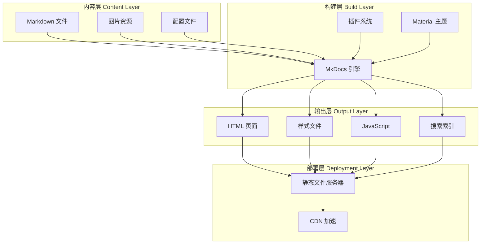

# Design Document

## Overview

Zephyr RTOS 学习系统是一个基于文档即代码（Docs-as-Code）方法的知识库平台。系统采用 Markdown 作为内容格式，使用 MkDocs 作为静态站点生成器，提供结构化、可搜索、易于导航的学习体验。

### 愿景对齐

本设计文档的所有技术决策都围绕系统愿景展开：

- **降低学习门槛**：通过简洁的 Markdown 格式和直观的导航系统，让学习者能够快速上手
- **构建完整知识体系**：支持四阶段学习路径的清晰组织和展示
- **强调实践导向**：优化代码示例展示和多媒体内容支持
- **促进知识共享**：通过 Git 集成支持社区协作和内容贡献
- **保持内容时效性**：自动化构建和部署流程确保内容快速更新

### 设计目标

1. **简单性**: 使用纯文本 Markdown 格式，降低内容创建和维护的门槛
2. **可维护性**: 通过 Git 版本控制，支持内容的历史追踪和协作编辑
3. **可扩展性**: 模块化的内容组织，便于添加新的学习主题和章节
4. **用户友好**: 提供直观的导航、强大的搜索和良好的阅读体验
5. **性能优化**: 生成轻量级静态页面，确保快速加载和流畅浏览
6. **质量保证**: 内置内容质量检查工具，确保文档准确性和一致性

### 技术选型

**静态站点生成器**: MkDocs
- 理由：Python 生态成熟，配置简单，专注于文档站点，中文支持良好
- 主题：Material for MkDocs（功能丰富，UI 现代，响应式设计）

**内容格式**: Markdown + 扩展
- 标准 Markdown 语法
- 代码块语法高亮（Pygments）
- Mermaid 图表支持
- Admonitions（提示框）
- 内容标签页（Tabs）

**搜索引擎**: Lunr.js（客户端搜索）
- 无需服务器，纯静态实现
- 支持中文分词
- 实时搜索反馈

## Architecture


### 系统架构图



### 目录结构设计

```
zephyr-learning-system/
├── docs/                          # 文档内容目录
│   ├── index.md                   # 首页
│   ├── prerequisites/             # 前置必备知识
│   │   ├── index.md
│   │   ├── c-language.md
│   │   ├── embedded-basics.md
│   │   ├── rtos-concepts.md
│   │   └── tools.md
│   ├── stage1-foundation/         # 第一阶段：入门筑基期
│   │   ├── index.md
│   │   ├── introduction.md
│   │   ├── environment-setup.md
│   │   ├── west-tool.md
│   │   ├── project-structure.md
│   │   └── basic-examples.md
│   ├── stage2-intermediate/       # 第二阶段：进阶实战期
│   │   ├── index.md
│   │   ├── kernel-mechanisms.md
│   │   ├── kconfig-devicetree.md
│   │   ├── driver-development.md
│   │   └── subsystems.md
│   ├── stage3-advanced/           # 第三阶段：高级深耕期
│   │   ├── index.md
│   │   ├── kernel-source.md
│   │   ├── bsp-porting.md
│   │   ├── optimization.md
│   │   └── security.md
│   ├── stage4-expert/             # 第四阶段：专业精通期
│   │   ├── index.md
│   │   ├── architecture-design.md
│   │   ├── community-contribution.md
│   │   └── technical-evangelism.md
│   ├── learning-principles/       # 通用学习黄金法则
│   │   └── index.md
│   └── assets/                    # 静态资源
│       ├── images/
│       └── diagrams/
├── mkdocs.yml                     # MkDocs 配置文件
├── requirements.txt               # Python 依赖
├── .gitignore                     # Git 忽略规则
└── README.md                      # 项目说明
```

## Components and Interfaces


### 1. Content Manager（内容管理器）

**职责**: 组织和管理 Markdown 格式的学习内容

**接口**:
- 输入：Markdown 文件、图片资源、元数据
- 输出：结构化的内容树

**实现细节**:
- 使用文件系统目录结构组织内容
- 每个学习阶段对应一个独立目录
- 使用 YAML Front Matter 定义页面元数据：
  ```yaml
  ---
  title: "环境搭建指南"
  description: "Zephyr 开发环境的完整搭建流程"
  tags: ["入门", "环境配置", "工具"]
  difficulty: "初级"
  estimated_time: "2-3 小时"
  ---
  ```

### 2. Site Generator（站点生成器）

**职责**: 将 Markdown 内容转换为静态 HTML 网站

**接口**:
- 输入：Markdown 文件、配置文件、主题设置
- 输出：HTML、CSS、JavaScript 文件

**核心组件**:

**2.1 MkDocs 引擎**
- 解析 Markdown 文件
- 应用主题模板
- 生成页面导航
- 构建搜索索引

**2.2 插件系统**
- `mkdocs-material`: Material Design 主题
- `pymdown-extensions`: Markdown 扩展语法支持
- `mkdocs-mermaid2-plugin`: Mermaid 图表渲染
- `mkdocs-git-revision-date-localized-plugin`: 显示最后更新时间
- `mkdocs-minify-plugin`: HTML/CSS/JS 压缩优化

**2.3 代码高亮配置**
```python
markdown_extensions:
  - pymdownx.highlight:
      anchor_linenums: true
      line_spans: __span
      pygments_lang_class: true
  - pymdownx.inlinehilite
  - pymdownx.snippets
  - pymdownx.superfences:
      custom_fences:
        - name: mermaid
          class: mermaid
          format: !!python/name:pymdownx.superfences.fence_code_format
```

### 3. Navigation System（导航系统）

**职责**: 提供多层级的内容导航和定位功能

**接口**:
- 输入：内容结构、当前页面位置
- 输出：导航菜单、面包屑、上下页链接

**导航层级**:
```yaml
nav:
  - 首页: index.md
  - 前置必备知识:
      - prerequisites/index.md
      - C 语言核心能力: prerequisites/c-language.md
      - 嵌入式硬件基础: prerequisites/embedded-basics.md
      - RTOS 基础概念: prerequisites/rtos-concepts.md
      - 基础工具能力: prerequisites/tools.md
  - 第一阶段 入门筑基期:
      - stage1-foundation/index.md
      - Zephyr 基础认知: stage1-foundation/introduction.md
      - 开发环境搭建: stage1-foundation/environment-setup.md
      - west 工具核心用法: stage1-foundation/west-tool.md
      - 工程结构与配置: stage1-foundation/project-structure.md
      - 基础例程实操: stage1-foundation/basic-examples.md
  # ... 其他阶段
```

**导航功能**:
- 侧边栏可折叠目录树
- 当前页面高亮
- 页面内目录大纲（右侧）
- 面包屑导航
- 上一页/下一页按钮

### 4. Search Engine（搜索引擎）

**职责**: 提供全文搜索功能

**接口**:
- 输入：用户搜索查询
- 输出：匹配的页面列表、关键词高亮、内容摘要

**实现方案**:
- 使用 Lunr.js 客户端搜索库
- 构建时生成搜索索引（JSON 格式）
- 支持中文分词（使用 jieba 分词）
- 搜索配置：
  ```yaml
  plugins:
    - search:
        lang: 
          - zh
          - en
        separator: '[\s\-\.]+'
        prebuild_index: true
  ```

**搜索优化**:
- 标题权重高于正文
- 支持模糊匹配
- 实时搜索建议
- 搜索结果分页

### 5. Theme System（主题系统）

**职责**: 定义网站的视觉样式和交互行为

**接口**:
- 输入：主题配置、自定义样式
- 输出：CSS 样式、JavaScript 交互

**Material 主题配置**:
```yaml
theme:
  name: material
  language: zh
  features:
    - navigation.instant      # 即时加载
    - navigation.tracking     # 锚点跟踪
    - navigation.tabs         # 顶部标签页
    - navigation.sections     # 章节分组
    - navigation.expand       # 默认展开
    - navigation.top          # 返回顶部按钮
    - search.suggest          # 搜索建议
    - search.highlight        # 搜索高亮
    - content.code.copy       # 代码复制按钮
    - content.tabs.link       # 标签页链接
  palette:
    # 浅色模式
    - scheme: default
      primary: indigo
      accent: indigo
      toggle:
        icon: material/brightness-7
        name: 切换到深色模式
    # 深色模式
    - scheme: slate
      primary: indigo
      accent: indigo
      toggle:
        icon: material/brightness-4
        name: 切换到浅色模式
  font:
    text: Noto Sans SC
    code: Roboto Mono
```

### 6. Build System（构建系统）

**职责**: 自动化构建和部署流程

**接口**:
- 输入：构建命令、配置参数
- 输出：静态网站文件、构建日志

**构建命令**:
```bash
# 本地开发服务器（热重载）
mkdocs serve

# 构建生产版本
mkdocs build

# 构建并部署到 GitHub Pages
mkdocs gh-deploy
```

**构建流程**:
1. 读取 mkdocs.yml 配置
2. 扫描 docs/ 目录下的所有 Markdown 文件
3. 解析 Markdown 并应用扩展语法
4. 应用主题模板生成 HTML
5. 生成搜索索引
6. 复制静态资源
7. 压缩优化输出文件
8. 输出到 site/ 目录

### 7. Vision and Mission Display（愿景使命展示）

**职责**: 在网站中清晰展示系统的愿景、使命和核心价值观

**接口**:
- 输入：愿景使命内容（Markdown 格式）
- 输出：格式化的 HTML 展示页面

**实现方式**:
- 在首页（index.md）顶部展示愿景和使命摘要
- 创建独立的关于页面（about.md）详细阐述
- 在每个学习阶段索引页中体现相关价值观
- 在贡献指南中强调开放协作精神

**内容结构**:
```markdown
# 首页展示
## 我们的愿景
[简短的愿景描述]

## 我们的使命
- 降低学习门槛
- 构建完整知识体系
- 强调实践导向
- 促进知识共享
- 保持内容时效性

# 关于页面
## 愿景
[完整的愿景描述]

## 使命
[详细的使命说明]

## 核心价值观
- 以学习者为中心
- 质量至上
- 开放协作
- 持续改进
- 实践驱动
```

### 8. Learning Progress Tracker（学习进度跟踪器）

**职责**: 跟踪和显示用户的学习进度

**接口**:
- 输入：用户阅读行为、页面访问记录
- 输出：进度数据、完成状态、统计信息

**实现方案**:
- 使用客户端 JavaScript 实现进度跟踪
- 使用 localStorage 存储进度数据
- 不需要服务器端支持，保持静态站点特性

**技术栈**:
- 纯 JavaScript（ES6+），无需额外框架
- localStorage API 用于数据持久化
- CSS3 用于进度条和动画效果
- Material Design Icons 用于视觉标记

**核心功能**:

**8.1 进度记录**
```javascript
// 进度数据结构
{
  "visitedPages": [
    "prerequisites/c-language",
    "stage1-foundation/introduction",
    "stage1-foundation/environment-setup"
  ],
  "completedStages": {
    "prerequisites": false,
    "stage1-foundation": false,
    "stage2-intermediate": false,
    "stage3-advanced": false,
    "stage4-expert": false
  },
  "lastVisit": "2026-02-25T10:30:00Z",
  "totalReadingTime": 7200  // 秒
}
```

**8.2 进度显示**

**导航菜单标记**:
```javascript
// 为已访问页面添加视觉标记
function markVisitedPages() {
  const progress = getProgress();
  document.querySelectorAll('[data-page-id]').forEach(element => {
    const pageId = element.getAttribute('data-page-id');
    if (progress.visitedPages.includes(pageId)) {
      element.classList.add('visited');
      // 添加 ✓ 图标
      if (!element.querySelector('.visited-icon')) {
        const icon = document.createElement('span');
        icon.className = 'visited-icon';
        icon.innerHTML = '✓';
        icon.style.color = '#4caf50';
        icon.style.marginLeft = '8px';
        element.appendChild(icon);
      }
    }
  });
}
```

**进度条组件**:
```javascript
// 创建进度条 HTML
function createProgressBar(stageId, percentage) {
  return `
    <div class="progress-container">
      <div class="progress-label">
        <span>学习进度</span>
        <span class="progress-percentage">${percentage.toFixed(0)}%</span>
      </div>
      <div class="progress-bar">
        <div class="progress-fill" style="width: ${percentage}%"></div>
      </div>
      <div class="progress-stats">
        <span>${getVisitedCount(stageId)} / ${getTotalPages(stageId)} 页已完成</span>
      </div>
    </div>
  `;
}
```

**进度概览页面**:
```javascript
// 生成整体进度概览
function generateProgressOverview() {
  const stages = ['prerequisites', 'stage1-foundation', 'stage2-intermediate', 
                  'stage3-advanced', 'stage4-expert'];
  const overview = {
    totalPages: 0,
    visitedPages: 0,
    stages: []
  };
  
  stages.forEach(stageId => {
    const total = getTotalPages(stageId);
    const visited = getVisitedCount(stageId);
    const percentage = (visited / total) * 100;
    
    overview.totalPages += total;
    overview.visitedPages += visited;
    overview.stages.push({
      id: stageId,
      name: getStageDisplayName(stageId),
      total,
      visited,
      percentage,
      completed: percentage === 100
    });
  });
  
  overview.overallPercentage = (overview.visitedPages / overview.totalPages) * 100;
  return overview;
}
```

**8.3 进度管理**

**重置进度功能**:
```javascript
// 重置进度（带确认对话框）
function resetProgress() {
  if (confirm('确定要重置所有学习进度吗？此操作不可撤销。')) {
    localStorage.removeItem('learningProgress');
    location.reload();
  }
}
```

**导出进度功能**:
```javascript
// 导出进度为 JSON 文件
function exportProgress() {
  const progress = getProgress();
  const dataStr = JSON.stringify(progress, null, 2);
  const dataBlob = new Blob([dataStr], { type: 'application/json' });
  const url = URL.createObjectURL(dataBlob);
  
  const link = document.createElement('a');
  link.href = url;
  link.download = `zephyr-learning-progress-${new Date().toISOString().split('T')[0]}.json`;
  link.click();
  
  URL.revokeObjectURL(url);
}
```

**导入进度功能**:
```javascript
// 导入进度从 JSON 文件
function importProgress(file) {
  const reader = new FileReader();
  reader.onload = function(e) {
    try {
      const progress = JSON.parse(e.target.result);
      // 验证数据格式
      if (validateProgressData(progress)) {
        localStorage.setItem('learningProgress', JSON.stringify(progress));
        alert('进度导入成功！');
        location.reload();
      } else {
        alert('进度文件格式无效');
      }
    } catch (error) {
      alert('进度文件解析失败：' + error.message);
    }
  };
  reader.readAsText(file);
}

// 验证进度数据格式
function validateProgressData(data) {
  return data && 
         Array.isArray(data.visitedPages) &&
         typeof data.completedStages === 'object' &&
         typeof data.lastVisit === 'string';
}
```

**阶段完成祝贺**:
```javascript
// 检查阶段完成并显示祝贺
function checkStageCompletion(stageId) {
  const total = getTotalPages(stageId);
  const visited = getVisitedCount(stageId);
  
  if (visited === total && !isStageCompletionShown(stageId)) {
    showCongratulationsModal(stageId);
    markStageCompletionShown(stageId);
  }
}

// 显示祝贺弹窗
function showCongratulationsModal(stageId) {
  const stageName = getStageDisplayName(stageId);
  const nextStage = getNextStage(stageId);
  
  const modal = `
    <div class="congratulations-modal">
      <div class="modal-content">
        <h2>🎉 恭喜完成 ${stageName}！</h2>
        <p>你已经完成了本阶段的所有学习内容。</p>
        ${nextStage ? `
          <p>准备好进入下一阶段了吗？</p>
          <a href="${nextStage.url}" class="btn-primary">
            开始学习：${nextStage.name}
          </a>
        ` : `
          <p>你已经完成了所有学习阶段，太棒了！</p>
        `}
        <button onclick="closeModal()">关闭</button>
      </div>
    </div>
  `;
  
  document.body.insertAdjacentHTML('beforeend', modal);
}
```

**8.4 性能优化**

**数据缓存策略**:
```javascript
// 缓存页面列表，避免重复计算
const pageCache = {
  stages: {},
  lastUpdate: null
};

function getTotalPages(stageId) {
  if (!pageCache.stages[stageId]) {
    pageCache.stages[stageId] = calculateStagePages(stageId);
  }
  return pageCache.stages[stageId].length;
}
```

**防抖处理**:
```javascript
// 防抖函数，避免频繁更新
function debounce(func, wait) {
  let timeout;
  return function executedFunction(...args) {
    const later = () => {
      clearTimeout(timeout);
      func(...args);
    };
    clearTimeout(timeout);
    timeout = setTimeout(later, wait);
  };
}

// 使用防抖更新进度显示
const debouncedUpdateProgress = debounce(updateProgressDisplay, 300);
```

**8.5 CSS 样式**

```css
/* 进度条样式 */
.progress-container {
  margin: 20px 0;
  padding: 15px;
  background: var(--md-code-bg-color);
  border-radius: 8px;
}

.progress-label {
  display: flex;
  justify-content: space-between;
  margin-bottom: 8px;
  font-weight: 500;
}

.progress-bar {
  height: 8px;
  background: var(--md-default-fg-color--lightest);
  border-radius: 4px;
  overflow: hidden;
}

.progress-fill {
  height: 100%;
  background: linear-gradient(90deg, #4caf50, #8bc34a);
  transition: width 0.3s ease;
}

.progress-stats {
  margin-top: 8px;
  font-size: 0.9em;
  color: var(--md-default-fg-color--light);
}

/* 已访问页面标记 */
.visited-icon {
  display: inline-block;
  margin-left: 8px;
  color: #4caf50;
  font-weight: bold;
}

/* 祝贺弹窗样式 */
.congratulations-modal {
  position: fixed;
  top: 0;
  left: 0;
  width: 100%;
  height: 100%;
  background: rgba(0, 0, 0, 0.5);
  display: flex;
  align-items: center;
  justify-content: center;
  z-index: 9999;
  animation: fadeIn 0.3s ease;
}

.modal-content {
  background: var(--md-default-bg-color);
  padding: 30px;
  border-radius: 12px;
  max-width: 500px;
  text-align: center;
  box-shadow: 0 4px 20px rgba(0, 0, 0, 0.3);
  animation: slideUp 0.3s ease;
}

@keyframes fadeIn {
  from { opacity: 0; }
  to { opacity: 1; }
}

@keyframes slideUp {
  from { transform: translateY(20px); opacity: 0; }
  to { transform: translateY(0); opacity: 1; }
}
```

### 9. Community Interaction Module（社区互动模块）

**职责**: 提供评论、反馈和社区统计功能

**接口**:
- 输入：用户交互、GitHub API 数据
- 输出：评论区、反馈链接、社区统计

**实现方案**:
- 使用 Giscus 或 Utterances 集成 GitHub Discussions/Issues
- 使用 GitHub API 获取仓库统计数据
- 使用 localStorage 存储点赞数据

**技术栈**:
- Giscus/Utterances 评论系统
- GitHub REST API v3
- Fetch API 用于数据获取
- CSS Grid 用于社区统计布局

**核心功能**:

**9.1 评论系统集成**

**Giscus 配置**:
```javascript
// Giscus 评论系统配置
const giscusConfig = {
  repo: 'your-username/zephyr-learning-system',
  repoId: 'YOUR_REPO_ID',
  category: 'General',
  categoryId: 'YOUR_CATEGORY_ID',
  mapping: 'pathname',
  reactionsEnabled: '1',
  emitMetadata: '0',
  inputPosition: 'top',
  theme: 'preferred_color_scheme',
  lang: 'zh-CN'
};

// 动态加载 Giscus
function loadGiscus() {
  const script = document.createElement('script');
  script.src = 'https://giscus.app/client.js';
  script.setAttribute('data-repo', giscusConfig.repo);
  script.setAttribute('data-repo-id', giscusConfig.repoId);
  script.setAttribute('data-category', giscusConfig.category);
  script.setAttribute('data-category-id', giscusConfig.categoryId);
  script.setAttribute('data-mapping', giscusConfig.mapping);
  script.setAttribute('data-reactions-enabled', giscusConfig.reactionsEnabled);
  script.setAttribute('data-emit-metadata', giscusConfig.emitMetadata);
  script.setAttribute('data-input-position', giscusConfig.inputPosition);
  script.setAttribute('data-theme', giscusConfig.theme);
  script.setAttribute('data-lang', giscusConfig.lang);
  script.setAttribute('crossorigin', 'anonymous');
  script.async = true;
  
  document.getElementById('comments-container').appendChild(script);
}
```

**主题同步**:
```javascript
// 同步评论系统主题与网站主题
function syncCommentTheme() {
  const isDark = document.body.getAttribute('data-md-color-scheme') === 'slate';
  const theme = isDark ? 'dark' : 'light';
  
  const iframe = document.querySelector('iframe.giscus-frame');
  if (iframe) {
    iframe.contentWindow.postMessage(
      { giscus: { setConfig: { theme } } },
      'https://giscus.app'
    );
  }
}

// 监听主题切换
const observer = new MutationObserver(syncCommentTheme);
observer.observe(document.body, {
  attributes: true,
  attributeFilter: ['data-md-color-scheme']
});
```

**9.2 点赞功能**

```javascript
// 点赞数据结构
{
  "likes": {
    "prerequisites/c-language": 15,
    "stage1-foundation/introduction": 23,
    ...
  }
}

// 点赞功能实现
function toggleLike(pageId) {
  const likes = getLikes();
  const currentLikes = likes[pageId] || 0;
  const hasLiked = hasUserLiked(pageId);
  
  if (hasLiked) {
    likes[pageId] = Math.max(0, currentLikes - 1);
    removeUserLike(pageId);
  } else {
    likes[pageId] = currentLikes + 1;
    addUserLike(pageId);
  }
  
  saveLikes(likes);
  updateLikeButton(pageId, likes[pageId], !hasLiked);
}

// 更新点赞按钮显示
function updateLikeButton(pageId, count, isLiked) {
  const button = document.querySelector(`[data-like-page="${pageId}"]`);
  if (button) {
    button.textContent = `👍 ${count}`;
    button.classList.toggle('liked', isLiked);
  }
}
```

**9.3 GitHub 统计集成**

```javascript
// 获取 GitHub 仓库统计
async function fetchGitHubStats() {
  const repo = 'your-username/zephyr-learning-system';
  const apiUrl = `https://api.github.com/repos/${repo}`;
  
  try {
    const response = await fetch(apiUrl);
    const data = await response.json();
    
    return {
      stars: data.stargazers_count,
      forks: data.forks_count,
      watchers: data.subscribers_count,
      openIssues: data.open_issues_count,
      lastUpdate: data.updated_at
    };
  } catch (error) {
    console.error('Failed to fetch GitHub stats:', error);
    return null;
  }
}

// 获取贡献者列表
async function fetchContributors() {
  const repo = 'your-username/zephyr-learning-system';
  const apiUrl = `https://api.github.com/repos/${repo}/contributors`;
  
  try {
    const response = await fetch(apiUrl);
    const contributors = await response.json();
    
    return contributors.map(c => ({
      username: c.login,
      avatar: c.avatar_url,
      contributions: c.contributions,
      profile: c.html_url
    }));
  } catch (error) {
    console.error('Failed to fetch contributors:', error);
    return [];
  }
}

// 显示社区统计
async function displayCommunityStats() {
  const stats = await fetchGitHubStats();
  const contributors = await fetchContributors();
  
  if (stats) {
    document.getElementById('github-stars').textContent = stats.stars;
    document.getElementById('github-forks').textContent = stats.forks;
    document.getElementById('open-issues').textContent = stats.openIssues;
  }
  
  if (contributors.length > 0) {
    const contributorHTML = contributors.slice(0, 10).map(c => `
      <a href="${c.profile}" target="_blank" title="${c.username} (${c.contributions} 次贡献)">
        
      </a>
    `).join('');
    
    document.getElementById('contributors-list').innerHTML = contributorHTML;
    document.getElementById('total-contributors').textContent = contributors.length;
  }
}
```

**9.4 反馈功能**

```javascript
// 生成 GitHub Issue 链接
function generateIssueLink(pageId, pageTitle) {
  const repo = 'your-username/zephyr-learning-system';
  const issueTitle = encodeURIComponent(`[反馈] ${pageTitle}`);
  const issueBody = encodeURIComponent(`
## 页面信息
- 页面: ${pageTitle}
- URL: ${window.location.href}
- 浏览器: ${navigator.userAgent}

## 问题描述
请在此描述您遇到的问题或建议...

## 期望行为
请描述您期望的行为...

## 截图（可选）
如果适用，请添加截图以帮助说明问题。
  `);
  
  return `https://github.com/${repo}/issues/new?title=${issueTitle}&body=${issueBody}&labels=feedback`;
}

// 添加反馈按钮
function addFeedbackButton() {
  const pageId = getCurrentPageId();
  const pageTitle = document.title;
  const issueLink = generateIssueLink(pageId, pageTitle);
  
  const button = `
    <a href="${issueLink}" target="_blank" class="feedback-button">
      <span class="icon">📝</span>
      <span class="text">报告问题</span>
    </a>
  `;
  
  document.querySelector('.feedback-container').innerHTML = button;
}
```

**9.5 CSS 样式**

```css
/* 评论区样式 */
#comments-container {
  margin-top: 40px;
  padding-top: 40px;
  border-top: 1px solid var(--md-default-fg-color--lightest);
}

/* 点赞按钮样式 */
.like-button {
  display: inline-flex;
  align-items: center;
  gap: 8px;
  padding: 8px 16px;
  background: var(--md-code-bg-color);
  border: 1px solid var(--md-default-fg-color--lightest);
  border-radius: 20px;
  cursor: pointer;
  transition: all 0.2s ease;
}

.like-button:hover {
  background: var(--md-accent-fg-color);
  color: white;
  transform: scale(1.05);
}

.like-button.liked {
  background: var(--md-accent-fg-color);
  color: white;
  border-color: var(--md-accent-fg-color);
}

/* 社区统计样式 */
.community-stats {
  display: grid;
  grid-template-columns: repeat(auto-fit, minmax(200px, 1fr));
  gap: 20px;
  margin: 30px 0;
}

.stat-card {
  padding: 20px;
  background: var(--md-code-bg-color);
  border-radius: 8px;
  text-align: center;
}

.stat-value {
  font-size: 2em;
  font-weight: bold;
  color: var(--md-accent-fg-color);
}

.stat-label {
  margin-top: 8px;
  color: var(--md-default-fg-color--light);
}

/* 贡献者头像样式 */
.contributor-avatar {
  width: 48px;
  height: 48px;
  border-radius: 50%;
  margin: 4px;
  transition: transform 0.2s ease;
}

.contributor-avatar:hover {
  transform: scale(1.1);
}

/* 反馈按钮样式 */
.feedback-button {
  display: inline-flex;
  align-items: center;
  gap: 8px;
  padding: 10px 20px;
  background: var(--md-primary-fg-color);
  color: white;
  border-radius: 4px;
  text-decoration: none;
  transition: background 0.2s ease;
}

.feedback-button:hover {
  background: var(--md-accent-fg-color);
}
```

## Data Models


### 页面元数据模型

```yaml
PageMetadata:
  title: string              # 页面标题
  description: string        # 页面描述
  tags: list[string]         # 标签列表
  difficulty: enum           # 难度级别：初级、中级、高级、专家
  estimated_time: string     # 预计学习时间
  prerequisites: list[string] # 前置知识要求
  author: string             # 作者（可选）
  last_updated: datetime     # 最后更新时间（自动生成）
```

### 导航节点模型

```python
NavigationNode:
  title: string              # 节点标题
  path: string               # 文件路径
  children: list[NavigationNode]  # 子节点
  level: int                 # 层级深度
  order: int                 # 排序顺序
```

### 搜索索引模型

```json
{
  "docs": [
    {
      "location": "stage1-foundation/environment-setup/",
      "title": "开发环境搭建",
      "text": "完整的页面文本内容...",
      "tags": ["入门", "环境配置"],
      "section": "第一阶段 入门筑基期"
    }
  ],
  "config": {
    "lang": ["zh", "en"],
    "separator": "[\\s\\-\\.]+"
  }
}
```

### 配置文件模型

```yaml
SiteConfig:
  site_name: string          # 站点名称
  site_url: string           # 站点 URL
  site_description: string   # 站点描述
  site_author: string        # 站点作者
  repo_url: string           # Git 仓库 URL
  repo_name: string          # 仓库名称
  edit_uri: string           # 编辑链接 URI
  copyright: string          # 版权信息
  theme: ThemeConfig         # 主题配置
  plugins: list[Plugin]      # 插件列表
  markdown_extensions: list[Extension]  # Markdown 扩展
  nav: list[NavigationNode]  # 导航结构
  extra: dict                # 额外配置
```

## Correctness Properties

*属性（Property）是关于系统行为的形式化陈述，应该在所有有效执行中保持为真。属性是人类可读规范和机器可验证正确性保证之间的桥梁。*


### Property 1: Markdown 文件加载完整性

*对于任意*有效的 Markdown 文件集合，Content Manager 应该能够成功加载所有文件，不丢失任何文件。

**Validates: Requirements 1.1**

### Property 2: 内容目录结构一致性

*对于任意*学习内容文件，如果其元数据标记为特定学习阶段，则该文件应该位于对应的阶段目录中。

**Validates: Requirements 1.2, 1.3**

### Property 3: 元数据解析正确性

*对于任意*包含 YAML Front Matter 的 Markdown 文件，Content Manager 应该能够正确提取所有元数据字段（title、description、tags、difficulty、estimated_time），且提取的值与原始定义相同。

**Validates: Requirements 1.4**

### Property 4: 内部链接解析有效性

*对于任意*包含内部链接的 Markdown 文件，所有链接应该指向存在的目标文件，且链接路径在生成的 HTML 中被正确转换为相对路径。

**Validates: Requirements 1.5**

### Property 5: Markdown 到 HTML 转换完整性

*对于任意*Markdown 文件集合，执行构建后，应该为每个 Markdown 文件生成对应的 HTML 文件，且 HTML 文件数量等于 Markdown 文件数量。

**Validates: Requirements 2.2**

### Property 6: 导航菜单结构一致性

*对于任意*内容目录结构，生成的导航菜单应该准确反映目录的层级关系，且导航节点的顺序与配置文件中定义的顺序一致。

**Validates: Requirements 2.4, 3.2**

### Property 7: 代码语法高亮完整性

*对于任意*包含代码块的 Markdown 文件，生成的 HTML 中，所有代码块应该包含语法高亮标记（CSS 类或内联样式），且代码块的语言标识被正确识别。

**Validates: Requirements 2.5, 8.1, 8.2**

### Property 8: Mermaid 图表渲染正确性

*对于任意*包含 Mermaid 代码块的 Markdown 文件，生成的 HTML 应该包含 Mermaid 渲染标记，且 Mermaid 代码被包裹在正确的容器元素中以支持客户端渲染。

**Validates: Requirements 2.6, 9.2, 9.3**

### Property 9: 页面导航链接完整性

*对于任意*非首页和非尾页的内容页面，生成的 HTML 应该包含"上一页"和"下一页"链接，且链接指向导航序列中的正确页面。

**Validates: Requirements 3.4**

### Property 10: 面包屑导航路径正确性

*对于任意*内容页面，生成的面包屑导航应该包含从根节点到当前页面的完整路径，且路径中的每个节点都可点击并指向正确的页面。

**Validates: Requirements 3.5**

### Property 11: 搜索索引完整性

*对于任意*内容页面，其标题和正文内容应该被包含在搜索索引中，且搜索索引中的文本与原始内容一致（去除 HTML 标记后）。

**Validates: Requirements 4.1**

### Property 12: 搜索功能准确性

*对于任意*搜索关键词，如果某个页面的标题或正文包含该关键词，则该页面应该出现在搜索结果中；如果不包含，则不应该出现。

**Validates: Requirements 4.2**

### Property 13: 多语言搜索支持

*对于任意*中文或英文关键词，搜索引擎应该能够返回包含该关键词的页面，且中文搜索支持分词匹配（如搜索"环境"能匹配"环境搭建"）。

**Validates: Requirements 4.4**

### Property 14: 搜索结果相关性排序

*对于任意*搜索关键词，如果多个页面都包含该关键词，则标题中包含关键词的页面应该排在仅正文包含关键词的页面之前。

**Validates: Requirements 4.5**

### Property 15: 搜索结果数据完整性

*对于任意*搜索结果项，应该包含页面标题、内容摘要、所属章节和页面路径，且这些信息都不为空。

**Validates: Requirements 4.6**

### Property 16: 配置文件必需字段完整性

*对于任意*有效的站点配置文件，应该包含所有必需字段（site_name、site_url、site_description、site_author、theme、nav），且这些字段的值都不为空。

**Validates: Requirements 6.2, 6.3, 6.4, 6.5**

### Property 17: 配置变更生效性

*对于任意*配置文件的修改（如修改 site_name），重新构建后，生成的 HTML 页面应该反映新的配置值（如页面标题显示新的 site_name）。

**Validates: Requirements 6.6**

### Property 18: Markdown 语法验证

*对于任意*包含语法错误的 Markdown 文件（如未闭合的代码块、错误的链接格式），执行构建时应该产生错误或警告，且不应该生成不完整的 HTML。

**Validates: Requirements 7.2**

### Property 19: 构建错误信息完整性

*对于任意*导致构建失败的错误，错误信息应该包含出错的文件路径、行号（如果适用）和错误描述，使开发者能够快速定位问题。

**Validates: Requirements 7.3**

### Property 20: 静态文件可移植性

*对于任意*构建生成的输出目录，其中的所有文件应该是纯静态的（HTML、CSS、JavaScript、图片），不包含服务器端代码，且所有资源引用使用相对路径，可以在任何静态文件服务器上运行。

**Validates: Requirements 7.5**

### Property 21: 代码块复制按钮存在性

*对于任意*包含代码块的页面，生成的 HTML 中，每个代码块应该包含一个复制按钮元素，且该按钮具有正确的 CSS 类或数据属性以支持复制功能。

**Validates: Requirements 8.3**

### Property 22: 外部代码文件引用正确性

*对于任意*使用外部文件引用语法的代码块，构建时应该能够读取外部文件内容，且生成的 HTML 中代码块内容与外部文件内容一致。

**Validates: Requirements 8.5**

### Property 23: 图片嵌入正确性

*对于任意*包含图片引用的 Markdown 文件，生成的 HTML 应该包含对应的 img 标签，且图片路径被正确转换为相对于 HTML 文件的路径。

**Validates: Requirements 9.1**

### Property 24: 视频嵌入正确性

*对于任意*包含视频链接的 Markdown 文件（如 YouTube、Bilibili 链接），生成的 HTML 应该包含嵌入式播放器的 iframe 标签，且 iframe 的 src 指向正确的嵌入 URL。

**Validates: Requirements 9.4**

### Property 25: 页面元数据显示完整性

*对于任意*内容页面，生成的 HTML 底部应该包含"最后更新时间"和"编辑此页"链接，且"编辑此页"链接指向 Git 仓库中对应文件的编辑 URL。

**Validates: Requirements 10.3, 10.4**

### Property 26: 页面加载性能

*对于任意*生成的 HTML 页面，其文件大小（包括内联 CSS 和 JavaScript）应该小于 500KB，且所有外部资源（CSS、JavaScript、字体）都应该启用压缩和缓存优化。

**Validates: Requirements 11.1**

### Property 27: 主题模式配置完整性

*对于任意*有效的主题配置，应该包含至少两个配色方案（浅色和深色），且每个方案都定义了 primary 和 accent 颜色。

**Validates: Requirements 11.3**

### Property 28: 页面目录大纲生成

*对于任意*包含多个标题的内容页面，生成的 HTML 应该包含目录大纲元素，且大纲中的每个条目对应页面中的一个标题，并链接到该标题的锚点。

**Validates: Requirements 11.4**

### Property 29: 打印样式支持

*对于任意*生成的 HTML 页面，应该包含打印媒体查询的 CSS 规则，隐藏导航、侧边栏等非内容元素，优化打印输出。

**Validates: Requirements 11.6**

### Property 30: 链接有效性检查

*对于任意*内容中的链接（内部链接和外部链接），链接检查工具应该能够验证链接的有效性，且对于失效的链接，报告应该包含链接所在的文件路径、行号和链接 URL。

**Validates: Requirements 12.2**

### Property 31: 格式一致性验证

*对于任意*内容文件，格式检查工具应该能够验证标题层级的连续性（不跳级）、代码块的语言标识完整性、列表格式的一致性，且对于不符合规范的内容，提供具体的错误位置和修正建议。

**Validates: Requirements 12.4**

### Property 32: 愿景使命内容展示

*对于任意*首页或关于页面，生成的 HTML 应该包含愿景、使命和核心价值观的内容，且这些内容清晰可读、格式正确。

**Validates: Requirements 13.1, 13.2**

### Property 33: 学习理念体现一致性

*对于任意*学习路径介绍页面，内容应该体现"循序渐进"的学习理念，且每个学习阶段的描述应该包含"核心目标"、"核心学习内容"、"必做实操任务"等结构化信息。

**Validates: Requirements 13.3, 13.4**

### Property 34: 学习进度记录准确性

*对于任意*用户访问的页面，如果该页面被标记为已访问，则该页面的标识符应该被存储在 localStorage 的 visitedPages 数组中，且该数组不包含重复项。

**Validates: Requirements 14.1, 14.6**

### Property 35: 进度显示一致性

*对于任意*学习阶段，显示的完成百分比应该等于（该阶段已访问页面数 / 该阶段总页面数）× 100%，且百分比值在 0 到 100 之间。

**Validates: Requirements 14.2, 14.3**

### Property 36: 社区互动功能可用性

*对于任意*内容页面，页面底部应该包含评论区或反馈入口，且反馈链接指向有效的 GitHub Issues 页面。

**Validates: Requirements 15.1, 15.4**

## Error Handling


### 构建错误处理

**错误类型**:
1. **Markdown 语法错误**: 未闭合的代码块、错误的链接格式、无效的 YAML Front Matter
2. **文件引用错误**: 引用不存在的图片、代码文件或内部链接
3. **配置错误**: 缺少必需的配置字段、无效的配置值
4. **插件错误**: 插件加载失败、插件配置错误

**错误处理策略**:
- 构建过程中遇到错误时，立即停止构建并输出详细错误信息
- 错误信息包含：文件路径、行号、错误类型、错误描述、修复建议
- 提供 `--strict` 模式，将警告也视为错误
- 提供 `--verbose` 模式，输出详细的构建日志

**错误信息示例**:
```
ERROR: Invalid internal link in docs/stage1-foundation/environment-setup.md:45
  Link target does not exist: ../stage2-intermediate/nonexistent.md
  Suggestion: Check the file path or create the missing file

WARNING: Missing language identifier in code block at docs/stage1-foundation/west-tool.md:78
  Code block should specify language for syntax highlighting
  Example: ```bash or ```python
```

### 运行时错误处理

**本地开发服务器**:
- 文件监控错误：如果文件系统监控失败，降级为手动刷新模式
- 端口占用：如果默认端口被占用，自动尝试其他端口或提示用户指定端口
- 热重载失败：如果热重载失败，提示用户手动刷新浏览器

**搜索功能**:
- 搜索索引损坏：如果搜索索引文件损坏，提示用户重新构建
- 搜索查询错误：对于无效的搜索查询，返回空结果而不是错误

### 内容质量错误处理

**链接检查**:
- 内部链接失效：报告所有失效的内部链接，包括文件路径和行号
- 外部链接失效：报告失效的外部链接，但不阻止构建（外部链接可能暂时不可用）
- 锚点链接失效：检查链接到的锚点是否存在

**格式检查**:
- 标题层级跳跃：检测从 H1 直接跳到 H3 的情况
- 代码块缺少语言标识：检测未指定语言的代码块
- 列表格式不一致：检测混用不同列表标记的情况

## Testing Strategy

### 单元测试策略

**测试框架**: pytest（Python）

**测试范围**:
1. **配置解析测试**: 测试 mkdocs.yml 配置文件的解析和验证
2. **Markdown 解析测试**: 测试特定 Markdown 语法的解析结果
3. **链接转换测试**: 测试内部链接的路径转换逻辑
4. **元数据提取测试**: 测试 YAML Front Matter 的提取和解析
5. **错误处理测试**: 测试各种错误情况的处理和错误信息生成

**测试示例**:
```python
def test_parse_yaml_frontmatter():
    """测试 YAML Front Matter 解析"""
    content = """---
title: "测试页面"
tags: ["测试", "示例"]
---
# 内容
"""
    metadata = parse_frontmatter(content)
    assert metadata['title'] == "测试页面"
    assert metadata['tags'] == ["测试", "示例"]

def test_internal_link_conversion():
    """测试内部链接转换"""
    source_path = "docs/stage1/page1.md"
    target_path = "docs/stage2/page2.md"
    link = convert_internal_link(source_path, target_path)
    assert link == "../stage2/page2.html"
```

### 属性测试策略

**测试框架**: Hypothesis（Python 的属性测试库）

**测试配置**:
- 每个属性测试运行最少 100 次迭代
- 使用自定义生成器生成有效的 Markdown 内容、配置文件等
- 每个测试标注对应的设计文档属性编号

**生成器设计**:

**Markdown 文件生成器**:
```python
from hypothesis import strategies as st

@st.composite
def markdown_file(draw):
    """生成有效的 Markdown 文件内容"""
    # 生成 YAML Front Matter
    title = draw(st.text(min_size=1, max_size=100))
    tags = draw(st.lists(st.text(min_size=1, max_size=20), min_size=0, max_size=5))
    
    # 生成 Markdown 内容
    headings = draw(st.lists(st.text(min_size=1, max_size=50), min_size=1, max_size=10))
    paragraphs = draw(st.lists(st.text(min_size=10, max_size=200), min_size=1, max_size=20))
    
    frontmatter = f"""---
title: "{title}"
tags: {tags}
---
"""
    content = "\n\n".join([f"## {h}\n\n{p}" for h, p in zip(headings, paragraphs)])
    return frontmatter + content
```

**配置文件生成器**:
```python
@st.composite
def site_config(draw):
    """生成有效的站点配置"""
    return {
        'site_name': draw(st.text(min_size=1, max_size=100)),
        'site_url': draw(st.from_regex(r'https?://[a-z0-9\-\.]+', fullmatch=True)),
        'site_description': draw(st.text(min_size=1, max_size=200)),
        'site_author': draw(st.text(min_size=1, max_size=50)),
        'theme': {'name': 'material'},
        'nav': draw(st.lists(st.dictionaries(
            st.text(min_size=1, max_size=50),
            st.text(min_size=1, max_size=100),
            min_size=1, max_size=1
        ), min_size=1, max_size=10))
    }
```

**属性测试示例**:
```python
from hypothesis import given, settings

@given(markdown_file())
@settings(max_examples=100)
def test_property_1_markdown_loading(md_content):
    """
    Property 1: Markdown 文件加载完整性
    Feature: zephyr-learning-system, Property 1: 对于任意有效的 Markdown 文件集合，
    Content Manager 应该能够成功加载所有文件，不丢失任何文件。
    """
    # 创建临时文件
    with tempfile.NamedTemporaryFile(mode='w', suffix='.md', delete=False) as f:
        f.write(md_content)
        temp_path = f.name
    
    try:
        # 加载文件
        loaded_content = load_markdown_file(temp_path)
        
        # 验证内容完整性
        assert loaded_content is not None
        assert len(loaded_content) == len(md_content)
    finally:
        os.unlink(temp_path)

@given(site_config())
@settings(max_examples=100)
def test_property_16_config_required_fields(config):
    """
    Property 16: 配置文件必需字段完整性
    Feature: zephyr-learning-system, Property 16: 对于任意有效的站点配置文件，
    应该包含所有必需字段，且这些字段的值都不为空。
    """
    # 验证必需字段存在
    required_fields = ['site_name', 'site_url', 'site_description', 
                      'site_author', 'theme', 'nav']
    
    for field in required_fields:
        assert field in config, f"Missing required field: {field}"
        assert config[field], f"Empty value for required field: {field}"
```

### 集成测试策略

**测试范围**:
1. **端到端构建测试**: 从 Markdown 源文件到最终 HTML 输出的完整流程
2. **搜索功能测试**: 构建搜索索引并验证搜索结果
3. **导航生成测试**: 验证导航菜单、面包屑、上下页链接的正确性
4. **多媒体内容测试**: 验证图片、Mermaid 图表、视频嵌入的渲染

**测试环境**:
- 使用真实的 MkDocs 环境
- 创建完整的测试内容目录结构
- 执行实际的构建命令
- 验证生成的 HTML 文件

**集成测试示例**:
```python
def test_end_to_end_build():
    """端到端构建测试"""
    # 创建测试项目
    test_project = create_test_project()
    
    # 执行构建
    result = subprocess.run(
        ['mkdocs', 'build'],
        cwd=test_project,
        capture_output=True,
        text=True
    )
    
    # 验证构建成功
    assert result.returncode == 0, f"Build failed: {result.stderr}"
    
    # 验证输出文件存在
    site_dir = os.path.join(test_project, 'site')
    assert os.path.exists(site_dir)
    assert os.path.exists(os.path.join(site_dir, 'index.html'))
    
    # 验证搜索索引生成
    search_index = os.path.join(site_dir, 'search', 'search_index.json')
    assert os.path.exists(search_index)
```

### 性能测试策略

**测试指标**:
1. **构建时间**: 测量不同规模内容的构建时间
2. **页面加载时间**: 测量生成页面的加载性能
3. **搜索响应时间**: 测量搜索查询的响应速度
4. **文件大小**: 测量生成文件的大小和压缩率

**性能基准**:
- 100 个页面的构建时间应小于 30 秒
- 单个页面的 HTML 文件大小应小于 500KB
- 搜索索引大小应小于内容总大小的 10%
- 首次页面加载时间应小于 3 秒

### 内容质量测试

**自动化检查**:
1. **链接有效性检查**: 使用 `mkdocs-linkcheck` 插件
2. **拼写检查**: 使用 `codespell` 工具
3. **格式一致性检查**: 自定义脚本检查标题层级、代码块格式等
4. **Markdown 语法检查**: 使用 `markdownlint` 工具

**持续集成**:
- 在 GitHub Actions 中配置自动化测试
- 每次提交和 Pull Request 都运行全量测试
- 测试失败时阻止合并

**CI 配置示例**:
```yaml
name: Build and Test

on: [push, pull_request]

jobs:
  test:
    runs-on: ubuntu-latest
    steps:
      - uses: actions/checkout@v2
      
      - name: Set up Python
        uses: actions/setup-python@v2
        with:
          python-version: '3.10'
      
      - name: Install dependencies
        run: |
          pip install -r requirements.txt
          pip install pytest hypothesis
      
      - name: Run unit tests
        run: pytest tests/unit/
      
      - name: Run property tests
        run: pytest tests/property/
      
      - name: Build site
        run: mkdocs build --strict
      
      - name: Check links
        run: mkdocs-linkcheck
      
      - name: Check spelling
        run: codespell docs/
```

### 测试覆盖率目标

- 单元测试覆盖率：> 80%
- 属性测试覆盖所有核心正确性属性
- 集成测试覆盖所有主要用户场景
- 性能测试覆盖所有性能关键路径

### 测试维护策略

- 每次添加新功能时，同步添加对应的测试
- 每次修复 bug 时，添加回归测试防止问题再次出现
- 定期审查和更新测试用例，确保测试的有效性
- 使用测试覆盖率工具监控测试质量
