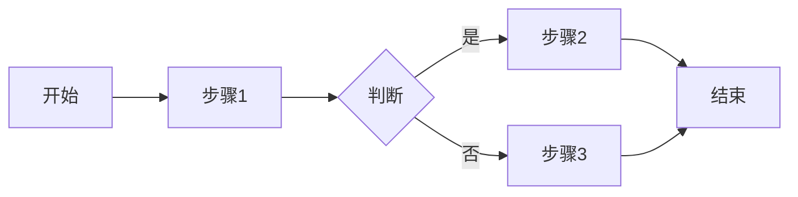
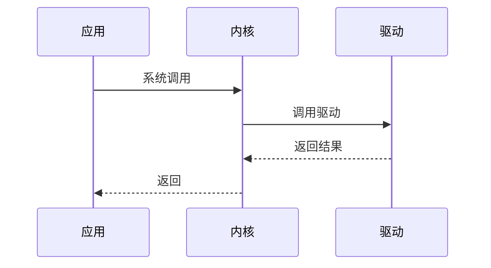
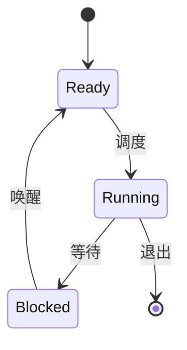

# 贡献指南

感谢你对 Zephyr RTOS 学习系统的关注！我们欢迎并感谢所有形式的贡献。

## 行为准则

参与本项目即表示你同意遵守我们的行为准则：

- 尊重所有贡献者
- 使用友好和包容的语言
- 接受建设性的批评
- 关注对社区最有利的事情
- 对其他社区成员表示同理心

## 如何贡献

### 报告问题

如果你发现了问题，请通过 [GitHub Issues](https://github.com/X-Gen-Lab/zephyr-learning-system/issues) 报告：

1. 搜索现有 Issues，避免重复报告
2. 使用清晰的标题描述问题
3. 提供详细的问题描述：
   - 问题出现的页面或章节
   - 预期行为和实际行为
   - 复现步骤（如果适用）
   - 截图（如果有助于说明问题）
   - 浏览器和操作系统信息

### 建议新功能

我们欢迎功能建议！请通过 [GitHub Discussions](https://github.com/X-Gen-Lab/zephyr-learning-system/discussions) 或 Issues 提出：

1. 描述你想要的功能
2. 解释为什么需要这个功能
3. 提供使用场景示例
4. 如果可能，提供实现思路

### 贡献内容

#### 准备工作

1. **Fork 仓库**
   
   点击 GitHub 页面右上角的 "Fork" 按钮

2. **克隆到本地**
   ```bash
   git clone https://github.com/your-username/zephyr-learning-system.git
   cd zephyr-learning-system
   ```

3. **设置上游仓库**
   ```bash
   git remote add upstream https://github.com/X-Gen-Lab/zephyr-learning-system.git
   ```

4. **安装依赖**
   ```bash
   # Linux/macOS
   ./scripts/build.sh install
   
   # Windows
   scripts\build.bat install
   ```

#### 开发流程

1. **同步最新代码**
   ```bash
   git checkout main
   git pull upstream main
   ```

2. **创建特性分支**
   ```bash
   git checkout -b feature/your-feature-name
   ```
   
   分支命名规范：
   - `feature/xxx` - 新功能
   - `fix/xxx` - Bug 修复
   - `docs/xxx` - 文档改进
   - `refactor/xxx` - 代码重构

3. **进行更改**
   
   - 编辑文档内容
   - 遵循内容规范（见下文）
   - 本地测试：`./scripts/build.sh serve`
   - 验证构建：`./scripts/build.sh build`

4. **提交更改**
   ```bash
   git add .
   git commit -m "type: brief description"
   ```
   
   提交信息格式：
   - `add: add XXX content`
   - `fix: fix XXX issue`
   - `update: update XXX content`
   - `docs: improve XXX documentation`
   - `refactor: refactor XXX code`
   - `style: format adjustment`
   
   提交信息应该：
   - 使用英文
   - 简洁明了
   - 描述做了什么，而不是为什么做

5. **推送到 GitHub**
   ```bash
   git push origin feature/your-feature-name
   ```

6. **创建 Pull Request**
   
   - 访问你的 Fork 仓库
   - 点击 "New Pull Request"
   - 选择你的特性分支
   - 填写 PR 描述：
     - 简要说明更改内容
     - 关联相关 Issue（如果有）
     - 添加截图（如果适用）
   - 提交 PR

#### Pull Request 检查清单

在提交 PR 前，请确保：

- [ ] 代码可以成功构建（`mkdocs build --strict` 通过）
- [ ] 所有链接有效
- [ ] 代码示例完整可运行
- [ ] 图片大小合理（< 200KB）
- [ ] 遵循内容规范
- [ ] 提交信息清晰
- [ ] 已同步最新的 main 分支

## 内容规范

### Markdown 格式

#### 标题层级

使用正确的标题层级，不要跳级：

```markdown
# 一级标题（页面标题，每页只有一个）

## 二级标题（主要章节）

### 三级标题（子章节）

#### 四级标题（细节）
```

#### 代码块

代码块必须指定语言标识：

```markdown
```c
#include <zephyr/kernel.h>

void main(void)
{
    printk("Hello, Zephyr!\n");
}
```
```

支持的语言：`c`, `python`, `bash`, `yaml`, `json`, `devicetree`, `kconfig`

#### 列表

使用一致的列表标记：

```markdown
- 无序列表项 1
- 无序列表项 2
  - 嵌套项 2.1
  - 嵌套项 2.2

1. 有序列表项 1
2. 有序列表项 2
   1. 嵌套项 2.1
   2. 嵌套项 2.2
```

#### Admonitions（提示框）

使用 Admonitions 突出重要信息：

```markdown
!!! info "提示"
    这是一个信息提示框

!!! warning "注意"
    这是一个警告提示框

!!! danger "危险"
    这是一个危险警告框

!!! tip "技巧"
    这是一个技巧提示框

!!! example "示例"
    这是一个示例框
```

#### 链接

使用相对路径链接内部页面：

```markdown
[环境搭建](../stage1-foundation/environment-setup.md)
```

外部链接使用完整 URL：

```markdown
[Zephyr 官方文档](https://docs.zephyrproject.org/)
```

### 页面元数据

每个页面应包含 YAML Front Matter：

```yaml
---
title: "页面标题"
description: "页面描述，用于 SEO"
tags: ["标签1", "标签2", "标签3"]
difficulty: "初级"  # 初级、中级、高级、专家
estimated_time: "30 分钟"
---
```

### 图片规范

#### 存放位置

图片存放在 `docs/assets/images/` 目录下，按类型分类：

```
docs/assets/images/
├── architecture/    # 架构图
├── hardware/       # 硬件相关图片
├── screenshots/    # 截图
└── logos/         # Logo 和图标
```

#### 文件命名

使用描述性的文件名，使用小写字母和连字符：

- ✅ `zephyr-architecture-overview.png`
- ✅ `nrf52840-dk-pinout.jpg`
- ❌ `图片1.png`
- ❌ `IMG_20240101.jpg`

#### 图片大小

- 单张图片大小应小于 200KB
- 使用适当的分辨率（通常 1200px 宽度足够）
- 优先使用 PNG 格式（截图、图表）
- 照片使用 JPG 格式
- 图标使用 SVG 格式

#### 图片引用

```markdown

```

必须提供有意义的 alt 文本。

### Mermaid 图表

使用 Mermaid 绘制流程图、时序图等：

#### 流程图

```markdown

```

#### 时序图

```markdown

```

#### 状态图

```markdown

```

### 代码示例规范

#### 完整性

代码示例应该完整可运行：

```c
#include <zephyr/kernel.h>
#include <zephyr/device.h>
#include <zephyr/drivers/gpio.h>

#define LED_NODE DT_ALIAS(led0)
static const struct gpio_dt_spec led = GPIO_DT_SPEC_GET(LED_NODE, gpios);

void main(void)
{
    if (!gpio_is_ready_dt(&led)) {
        return;
    }
    
    gpio_pin_configure_dt(&led, GPIO_OUTPUT_ACTIVE);
    
    while (1) {
        gpio_pin_toggle_dt(&led);
        k_msleep(1000);
    }
}
```

#### 注释

添加必要的注释，解释关键代码：

```c
/* 初始化 GPIO */
gpio_pin_configure_dt(&led, GPIO_OUTPUT_ACTIVE);

/* 主循环 */
while (1) {
    gpio_pin_toggle_dt(&led);  // 切换 LED 状态
    k_msleep(1000);             // 延时 1 秒
}
```

#### 错误处理

展示正确的错误处理方式：

```c
int ret = gpio_pin_configure_dt(&led, GPIO_OUTPUT_ACTIVE);
if (ret < 0) {
    printk("Error: Failed to configure GPIO (%d)\n", ret);
    return;
}
```

### 中文写作规范

#### 标点符号

- 使用中文标点符号（，。！？）
- 英文和数字前后加空格：`Zephyr RTOS 是一个实时操作系统`
- 专有名词使用正确的大小写：`Zephyr`、`GitHub`、`MkDocs`

#### 术语

使用统一的技术术语翻译：

| 英文 | 中文 |
|------|------|
| Thread | 线程 |
| Kernel | 内核 |
| Driver | 驱动 |
| Device Tree | 设备树 |
| Real-Time Operating System | 实时操作系统 |
| Interrupt | 中断 |
| Scheduler | 调度器 |

首次出现时可以使用"中文（英文）"格式：`实时操作系统（Real-Time Operating System，RTOS）`

#### 语言风格

- 使用简洁明了的语言
- 避免过于口语化的表达
- 使用主动语态
- 一句话表达一个意思
- 段落之间有明确的逻辑关系

## 审核流程

### 自动检查

提交 PR 后，GitHub Actions 会自动运行以下检查：

1. **构建测试**: 验证网站可以成功构建
2. **格式检查**: 检查 Markdown 格式
3. **链接检查**: 验证内部链接有效性
4. **文件大小检查**: 检查大文件

所有检查必须通过才能合并。

### 人工审核

维护者会审核以下方面：

1. **内容准确性**: 技术内容是否准确
2. **完整性**: 内容是否完整，逻辑是否清晰
3. **规范性**: 是否遵循内容规范
4. **可读性**: 中文表达是否流畅
5. **实用性**: 是否包含实际可用的示例

### 反馈和修改

- 维护者可能会提出修改建议
- 请及时响应反馈并进行修改
- 修改后推送到同一分支，PR 会自动更新
- 所有讨论解决后，PR 将被合并

## 成为维护者

如果你持续贡献高质量内容，我们可能会邀请你成为项目维护者。

维护者的职责：

- 审核 Pull Request
- 回答 Issues 和 Discussions
- 规划项目发展方向
- 维护项目质量

## 获取帮助

如果你在贡献过程中遇到问题：

1. 查看 [README.md](README.md) 中的常见问题
2. 搜索现有的 [Issues](https://github.com/X-Gen-Lab/zephyr-learning-system/issues)
3. 在 [Discussions](https://github.com/X-Gen-Lab/zephyr-learning-system/discussions) 中提问
4. 联系维护者

## 许可证

贡献的内容将采用与项目相同的 [MIT License](LICENSE) 许可证。

---

再次感谢你的贡献！🎉
