```mermaid
graph LR
    A[开始] --> B[学习]
    B --> C[实践]
    C --> D[精通]
```

# Zephyr RTOS 学习系统

> 成为全球最系统、最实用的 Zephyr RTOS 中文学习平台

结构化的 Zephyr RTOS 学习知识库，覆盖从入门到专业的全阶段学习路径。

[](https://github.com/X-Gen-Lab/zephyr-learning-system/actions)
[](https://opensource.org/licenses/MIT)

## 项目简介

本项目采用文档即代码（Docs-as-Code）方法，使用 MkDocs 和 Material 主题构建静态知识库网站。

### 核心特性

- 📚 **系统性**: 完整的四阶段学习路径，从前置知识到专业精通
- 💡 **实用性**: 每个阶段都包含实操任务、代码示例和避坑指南
- 🇨🇳 **中文优化**: 优化中文搜索、排版和技术术语表达
- 🔍 **强大搜索**: 支持中文分词的全文搜索功能
- 📱 **响应式设计**: 完美支持桌面和移动设备
- 🎨 **现代 UI**: 基于 Material Design 的美观界面
- 🌓 **深色模式**: 支持浅色/深色主题切换

## 学习路径

- **前置必备知识**: C 语言、嵌入式硬件基础、RTOS 概念、基础工具
- **第一阶段 - 入门筑基期**: 环境搭建、基础工具和核心概念
- **第二阶段 - 进阶实战期**: 内核机制、驱动开发和子系统使用
- **第三阶段 - 高级深耕期**: 源码分析、BSP 移植和系统优化
- **第四阶段 - 专业精通期**: 架构设计、社区贡献和技术布道

## 快速开始

### 方式一：使用构建脚本（推荐）

**Linux/macOS:**

```bash
# 1. 安装依赖
./scripts/build.sh install

# 2. 启动开发服务器
./scripts/build.sh serve

# 3. 访问 http://127.0.0.1:8000
```

**Windows:**

```cmd
REM 1. 安装依赖
scripts\build.bat install

REM 2. 启动开发服务器
scripts\build.bat serve

REM 3. 访问 http://127.0.0.1:8000
```

### 方式二：手动安装

```bash
# 1. 创建虚拟环境（推荐）
python -m venv venv

# 2. 激活虚拟环境
# Windows
venv\Scripts\activate
# Linux/Mac
source venv/bin/activate

# 3. 安装依赖
pip install -r requirements.txt

# 4. 启动开发服务器
mkdocs serve
```

## 本地开发

### 环境要求

- Python 3.8+
- pip
- Git

### 开发工作流

1. **启动开发服务器**
   ```bash
   ./scripts/build.sh serve  # Linux/macOS
   scripts\build.bat serve   # Windows
   ```
   
   开发服务器支持热重载，修改文件后自动刷新浏览器。

2. **编辑内容**
   - 所有内容文件位于 `docs/` 目录
   - 使用 Markdown 格式编写
   - 支持代码高亮、Mermaid 图表、Admonitions 等扩展语法

3. **预览更改**
   - 访问 http://127.0.0.1:8000
   - 实时查看更改效果

4. **构建生产版本**
   ```bash
   ./scripts/build.sh build  # Linux/macOS
   scripts\build.bat build   # Windows
   ```
   
   生成的静态文件位于 `site/` 目录。

### 验证构建

```bash
# 验证构建结果
./scripts/validate.sh  # Linux/macOS

# 检查内容质量
# - 文件大小
# - 搜索索引
# - 内部链接
# - 图片资源
```

## 部署

### 自动部署（GitHub Actions）

本项目配置了 GitHub Actions 自动化工作流：

- **推送到 main 分支**: 自动构建并部署到 GitHub Pages
- **Pull Request**: 自动运行构建测试和内容检查
- **手动触发**: 可在 Actions 页面手动触发部署

#### 启用 GitHub Pages

1. 进入仓库 Settings → Pages
2. Source 选择 "GitHub Actions"
3. 推送代码到 main 分支即可自动部署

部署完成后，网站将在 `https://<username>.github.io/<repository>/` 访问。

### 手动部署

#### 部署到 GitHub Pages

```bash
# 使用部署脚本
./scripts/deploy.sh github  # Linux/macOS

# 或使用 MkDocs 命令
mkdocs gh-deploy --clean
```

#### 部署到自定义服务器

```bash
# 设置环境变量
export DEPLOY_HOST=user@example.com
export DEPLOY_PATH=/var/www/html

# 执行部署
./scripts/deploy.sh custom  # Linux/macOS
```

#### 生成部署包

```bash
# 生成 tar.gz 压缩包
./scripts/deploy.sh package  # Linux/macOS

# 上传到服务器并解压
scp zephyr-learning-system_*.tar.gz user@server:/path/
ssh user@server "cd /path && tar -xzf zephyr-learning-system_*.tar.gz"
```

### 其他托管平台

生成的 `site/` 目录包含纯静态文件，可以部署到任何静态网站托管服务：

#### Netlify

1. 连接 GitHub 仓库
2. 构建命令: `mkdocs build`
3. 发布目录: `site`

#### Vercel

1. 导入 GitHub 仓库
2. Framework Preset: Other
3. Build Command: `pip install -r requirements.txt && mkdocs build`
4. Output Directory: `site`

#### AWS S3 + CloudFront

```bash
# 构建网站
./scripts/build.sh build

# 同步到 S3
aws s3 sync site/ s3://your-bucket-name/ --delete

# 清除 CloudFront 缓存
aws cloudfront create-invalidation --distribution-id YOUR_DIST_ID --paths "/*"
```

### 验证部署

```bash
# 验证部署的网站
./scripts/deploy.sh verify https://your-site-url.com
```

## 贡献指南

我们欢迎并感谢所有形式的贡献！

### 贡献方式

1. **内容贡献**: 添加新的学习内容、改进现有文档
2. **Bug 修复**: 修复错别字、断链、格式问题
3. **功能建议**: 提出新功能或改进建议
4. **问题反馈**: 报告问题或提供反馈

### 贡献流程

1. **Fork 本仓库**
   
   点击右上角的 Fork 按钮

2. **克隆到本地**
   ```bash
   git clone https://github.com/your-username/zephyr-learning-system.git
   cd zephyr-learning-system
   ```

3. **创建特性分支**
   ```bash
   git checkout -b feature/amazing-content
   ```

4. **进行更改**
   - 编辑文档内容
   - 本地测试: `./scripts/build.sh serve`
   - 验证构建: `./scripts/build.sh build`

5. **提交更改**
   ```bash
   git add .
   git commit -m "Add: 添加 XXX 内容"
   ```
   
   提交信息格式:
   - `Add: 添加新内容`
   - `Fix: 修复问题`
   - `Update: 更新内容`
   - `Docs: 文档改进`

6. **推送到 GitHub**
   ```bash
   git push origin feature/amazing-content
   ```

7. **创建 Pull Request**
   - 访问你的 Fork 仓库
   - 点击 "New Pull Request"
   - 填写 PR 描述
   - 等待审核

### 内容规范

#### Markdown 格式

- 使用标准 Markdown 语法
- 代码块必须指定语言标识
  ```markdown
  ```python
  def hello():
      print("Hello, Zephyr!")
  ```
  ```

- 使用 Admonitions 提示框
  ```markdown
  !!! info "提示"
      这是一个信息提示框
  
  !!! warning "注意"
      这是一个警告提示框
  ```

#### 页面元数据

每个页面应包含 YAML Front Matter:

```yaml
---
title: "页面标题"
description: "页面描述"
tags: ["标签1", "标签2"]
difficulty: "初级"  # 初级、中级、高级、专家
estimated_time: "30 分钟"
---
```

#### 图片资源

- 图片存放在 `docs/assets/images/` 目录
- 使用描述性文件名: `zephyr-architecture.png`
- 图片大小控制在 200KB 以内
- 提供 alt 文本: ``

#### Mermaid 图表

使用 Mermaid 绘制流程图、时序图等:

```markdown

```

#### 代码示例

- 代码应完整可运行
- 添加必要的注释
- 使用实际的 Zephyr API

```c
#include <zephyr/kernel.h>

void main(void)
{
    printk("Hello, Zephyr!\n");
}
```

### 审核标准

Pull Request 将根据以下标准审核:

- ✅ 内容准确性
- ✅ 格式规范性
- ✅ 构建通过
- ✅ 链接有效性
- ✅ 代码可运行性
- ✅ 中文表达流畅性

## 项目结构

```
zephyr-learning-system/
├── .github/
│   └── workflows/          # GitHub Actions 工作流
│       ├── build.yml       # 构建和部署
│       └── pr-check.yml    # PR 检查
├── docs/                   # 文档内容
│   ├── index.md           # 首页
│   ├── about.md           # 关于页面
│   ├── prerequisites/     # 前置必备知识
│   ├── stage1-foundation/ # 第一阶段：入门筑基期
│   ├── stage2-intermediate/ # 第二阶段：进阶实战期
│   ├── stage3-advanced/   # 第三阶段：高级深耕期
│   ├── stage4-expert/     # 第四阶段：专业精通期
│   ├── learning-principles/ # 学习黄金法则
│   └── assets/            # 静态资源
│       └── images/        # 图片资源
├── scripts/               # 构建和部署脚本
│   ├── build.sh          # Linux/macOS 构建脚本
│   ├── build.bat         # Windows 构建脚本
│   ├── deploy.sh         # 部署脚本
│   └── validate.sh       # 验证脚本
├── mkdocs.yml            # MkDocs 配置文件
├── requirements.txt      # Python 依赖
└── README.md            # 项目说明
```

## 技术栈

- **静态站点生成器**: [MkDocs](https://www.mkdocs.org/)
- **主题**: [Material for MkDocs](https://squidfunk.github.io/mkdocs-material/)
- **搜索**: Lunr.js（支持中文分词）
- **图表**: [Mermaid](https://mermaid-js.github.io/)
- **CI/CD**: GitHub Actions
- **托管**: GitHub Pages

## 常见问题

### 构建失败

**问题**: `mkdocs build` 失败

**解决方案**:
1. 检查 Python 版本（需要 3.8+）
2. 重新安装依赖: `pip install -r requirements.txt --upgrade`
3. 检查 mkdocs.yml 配置文件格式
4. 查看详细错误信息: `mkdocs build --verbose`

### 搜索不工作

**问题**: 搜索功能无法使用

**解决方案**:
1. 确保已构建网站: `mkdocs build`
2. 检查 `site/search/search_index.json` 是否存在
3. 清除浏览器缓存后重试

### 中文搜索不准确

**问题**: 中文搜索结果不理想

**解决方案**:
1. 确保 mkdocs.yml 中配置了中文语言: `lang: zh`
2. 检查搜索插件配置
3. 使用更具体的搜索关键词

### 图片不显示

**问题**: 页面中的图片无法显示

**解决方案**:
1. 检查图片路径是否正确（使用相对路径）
2. 确保图片文件存在于 `docs/assets/images/` 目录
3. 检查图片文件名是否正确（区分大小写）

## 许可证

本项目采用 [MIT License](LICENSE) 开源协议。

## 致谢

- [Zephyr Project](https://www.zephyrproject.org/) - 提供优秀的 RTOS
- [MkDocs](https://www.mkdocs.org/) - 强大的文档生成工具
- [Material for MkDocs](https://squidfunk.github.io/mkdocs-material/) - 美观的主题
- 所有贡献者 - 感谢你们的贡献

## 联系方式

- **GitHub Issues**: [提交问题](https://github.com/X-Gen-Lab/zephyr-learning-system/issues)
- **GitHub Discussions**: [参与讨论](https://github.com/X-Gen-Lab/zephyr-learning-system/discussions)
- **Email**: contact@example.com

## 路线图

- [x] 基础框架搭建
- [x] 前置知识内容
- [x] 第一阶段内容
- [x] 第二阶段内容
- [x] 第三阶段内容
- [x] 第四阶段内容
- [x] 学习法则内容
- [x] 构建和部署系统
- [ ] 学习进度跟踪功能
- [ ] 社区互动功能
- [ ] 多语言支持（英文版）
- [ ] 视频教程集成

---

**开始你的 Zephyr RTOS 学习之旅吧！** 🚀
