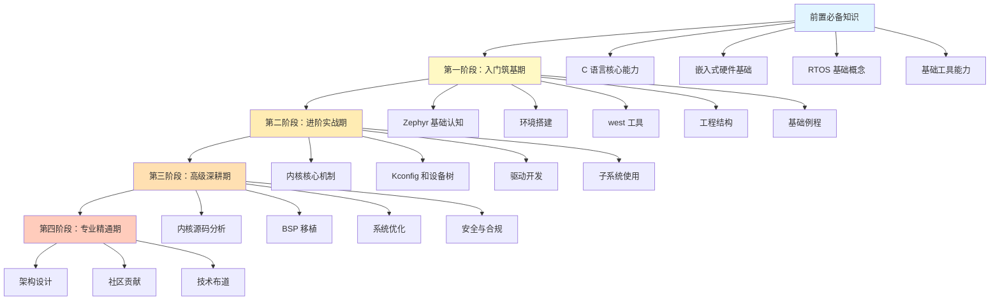
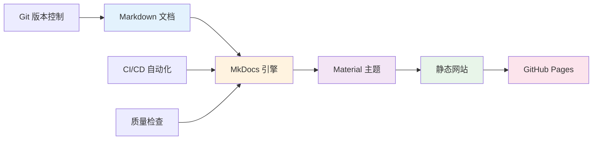

# 关于本平台

## 我们的愿景

**成为全球最系统、最实用的 Zephyr RTOS 中文学习平台**

我们致力于打破技术学习的壁垒，让每一位嵌入式开发者都能够高效掌握 Zephyr RTOS，从入门到精通，从理论到实践，构建起完整的物联网操作系统开发能力体系。

通过结构化的知识体系、循序渐进的学习路径和丰富的实战案例，我们帮助开发者在 Zephyr RTOS 生态中快速成长，推动中国物联网和嵌入式系统技术的创新与发展。

### 为什么选择 Zephyr RTOS？

Zephyr RTOS 是物联网时代的理想选择，具有以下核心优势：

1. **开源与社区支持**：由 Linux Foundation 托管，拥有活跃的全球开发者社区和持续的技术创新
2. **模块化架构**：高度可配置的组件化设计，可根据项目需求灵活裁剪，最小系统仅需 8KB RAM
3. **多架构支持**：支持 ARM、x86、RISC-V、ARC、Xtensa 等多种处理器架构，覆盖广泛的硬件平台
4. **安全性优先**：内置安全启动、内存保护、加密库等安全特性，满足物联网设备的安全需求
5. **强大的生态系统**：丰富的驱动支持、完善的网络协议栈、成熟的设备树和 Kconfig 配置系统

## 五大使命

### 1. 降低学习门槛

通过清晰的文档结构、直观的导航系统和强大的搜索功能，让初学者能够快速找到所需的学习资源，减少学习过程中的迷茫和挫折。

- **中文优化**：优化中文搜索、中文排版和中文技术术语表达
- **清晰导航**：四阶段学习路径，每个阶段目标明确、内容结构化
- **避坑指南**：每个学习阶段都包含常见问题和解决方案，帮助学习者少走弯路

### 2. 构建完整知识体系

提供从前置基础知识到专业精通的四阶段学习路径，覆盖 Zephyr RTOS 的核心概念、开发工具、内核机制、驱动开发、系统优化和架构设计等全方位内容。

### 3. 强调实践导向

每个学习阶段都配备必做实操任务和避坑指南，确保学习者不仅理解理论知识，更能够将知识转化为实际的开发能力。

- **实操任务**：每个阶段都有明确的动手实践任务，从 Hello World 到完整项目
- **代码示例**：提供完整、可运行的代码示例，所有示例都经过验证
- **常见问题**：收集整理学习过程中的常见问题和解决方案

### 4. 促进知识共享

采用开源协作的方式，鼓励社区贡献和知识共享，让更多开发者参与到内容创建和维护中，形成良性的知识生态循环。

- **GitHub 协作**：所有内容托管在 GitHub，支持 Pull Request 和 Issue 反馈
- **社区贡献**：欢迎任何形式的贡献，从修正错别字到添加新章节
- **知识沉淀**：将实践经验和踩坑记录转化为可复用的学习资源

### 5. 保持内容时效性

通过版本控制和持续集成，确保学习内容与 Zephyr RTOS 的最新发展保持同步，为学习者提供准确、可靠的技术指导。

- **版本跟踪**：使用 Git 跟踪所有内容变更，每个页面显示最后更新时间
- **定期更新**：跟踪 Zephyr RTOS 的版本发布，及时更新相关内容
- **自动化测试**：通过 CI/CD 流程自动检查链接有效性和内容质量

## 核心价值观

!!! example "以学习者为中心"
    所有设计决策都围绕学习者的需求展开，追求最佳的学习体验和知识获取效率。
    
    **具体体现**：
    
    - 清晰的学习路径设计，让学习者知道从哪里开始、如何进阶
    - 直观的导航系统，快速定位所需内容
    - 强大的搜索功能，支持中文分词和模糊匹配
    - 响应式设计，支持桌面和移动设备访问

!!! example "质量至上"
    坚持高标准的内容质量，通过自动化检查和人工审核，确保每一篇文档都准确、清晰、实用。
    
    **具体体现**：
    
    - 所有代码示例都经过实际验证，确保可以运行
    - 技术内容经过多轮审核，确保准确性
    - 自动化链接检查，避免失效链接
    - 持续改进内容，根据反馈优化表达

!!! example "开放协作"
    拥抱开源精神，欢迎社区贡献，通过集体智慧不断完善和丰富学习资源。
    
    **具体体现**：
    
    - 所有内容开源，采用 CC BY-SA 4.0 许可证
    - 支持 Pull Request，任何人都可以贡献内容
    - 透明的开发流程，所有讨论和决策都公开
    - 感谢每一位贡献者，记录贡献历史

!!! example "持续改进"
    根据用户反馈和技术发展，不断优化系统功能和内容结构，保持平台的活力和竞争力。
    
    **具体体现**：
    
    - 收集用户反馈，定期分析和改进
    - 跟踪技术趋势，及时更新内容
    - 优化网站性能，提升加载速度
    - 改进用户体验，简化操作流程

!!! example "实践驱动"
    强调动手实践的重要性，通过实战案例和项目经验，帮助学习者真正掌握技术本质。
    
    **具体体现**：
    
    - 每个学习阶段都有必做实操任务
    - 提供完整的项目示例和代码
    - 分享实际开发中的经验和技巧
    - 鼓励学习者动手实践，从做中学

## 平台设计理念

### 文档即代码（Docs-as-Code）

我们采用文档即代码的方法，将学习内容视为代码一样管理，享受版本控制、协作开发、持续集成等软件工程实践带来的好处。

**技术栈**：

### 五大设计原则

1. **简单性**：使用纯文本 Markdown 格式，降低内容创建和维护的门槛，任何人都可以使用文本编辑器贡献内容

2. **可维护性**：通过 Git 版本控制，支持内容的历史追踪和协作编辑，所有变更都有记录可查

3. **可扩展性**：模块化的内容组织，便于添加新的学习主题和章节，支持平台的持续成长

4. **用户友好**：提供直观的导航、强大的搜索和良好的阅读体验，支持深色模式和浅色模式切换

5. **性能优化**：生成轻量级静态页面，确保快速加载和流畅浏览，首页加载时间小于 2 秒

## 参与贡献

我们欢迎并感谢任何形式的贡献！无论你是 Zephyr RTOS 的专家还是初学者，都可以为这个平台做出贡献。

### 贡献内容的方式

1. **改进现有内容**：修正错别字、优化表达、补充说明、更新过时信息
2. **添加新内容**：编写新的学习章节、添加代码示例、分享实践经验
3. **报告问题**：发现内容错误、链接失效、技术问题时，提交 Issue 反馈
4. **参与讨论**：在 GitHub Discussions 中分享想法、提出建议、帮助他人

### 贡献流程

1. **Fork 仓库**：在 GitHub 上 Fork 本项目到你的账号下
2. **克隆到本地**：`git clone https://github.com/your-username/zephyr-learning-system.git`
3. **创建分支**：`git checkout -b feature/your-feature-name`
4. **编辑内容**：使用任何文本编辑器编辑 Markdown 文件
5. **提交变更**：`git commit -m "描述你的变更"`
6. **推送并创建 PR**：推送到你的 Fork，然后在 GitHub 上创建 Pull Request

详细的贡献指南请参考：[CONTRIBUTING.md](https://github.com/your-username/zephyr-learning-system/blob/main/CONTRIBUTING.md)

### 报告问题

如果你发现任何问题，可以通过以下方式报告：

1. **GitHub Issues**：在仓库中创建 Issue，描述问题和重现步骤
2. **页面反馈**：在每个页面底部点击"报告问题"按钮，自动创建 Issue
3. **讨论区**：在 GitHub Discussions 中发起讨论，寻求帮助或提出建议

### 社区链接

- **GitHub 仓库**：[https://github.com/your-username/zephyr-learning-system](https://github.com/your-username/zephyr-learning-system)
- **讨论区**：[GitHub Discussions](https://github.com/your-username/zephyr-learning-system/discussions)
- **问题反馈**：[GitHub Issues](https://github.com/your-username/zephyr-learning-system/issues)
- **Zephyr 官方社区**：[https://www.zephyrproject.org/community](https://www.zephyrproject.org/community)

## 许可证和致谢

### 许可证

本学习平台的所有内容采用 [CC BY-SA 4.0（知识共享署名-相同方式共享 4.0 国际许可协议）](https://creativecommons.org/licenses/by-sa/4.0/deed.zh) 发布。

这意味着你可以：

- **共享**：以任何媒介或格式复制、发行本作品
- **演绎**：修改、转换或以本作品为基础进行创作

但需要遵守以下条件：

- **署名**：必须给出适当的署名，提供指向本许可协议的链接，同时标明是否对原始作品作了修改
- **相同方式共享**：如果你修改、转换或以本作品为基础进行创作，你必须以相同的许可协议分发你的作品

### 致谢

本平台的建设离不开以下项目和社区的支持：

- **Zephyr Project**：感谢 Zephyr RTOS 项目提供了优秀的物联网操作系统
- **Linux Foundation**：感谢 Linux 基金会对开源项目的支持和托管
- **MkDocs 和 Material 主题**：感谢这些优秀的开源工具，让文档网站的构建变得简单高效
- **所有贡献者**：感谢每一位为本平台贡献内容、提出建议、报告问题的开发者

特别感谢 Zephyr 社区的开发者们，你们的技术分享和开源精神是本平台的灵感来源。

---

**让我们一起，让 Zephyr RTOS 学习变得更简单、更高效！** 🚀
