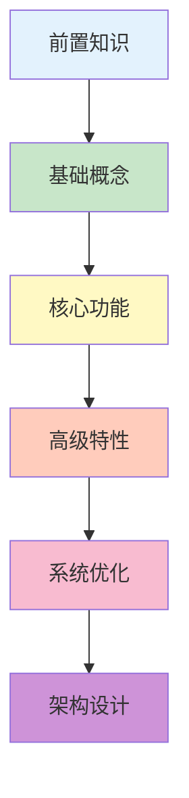
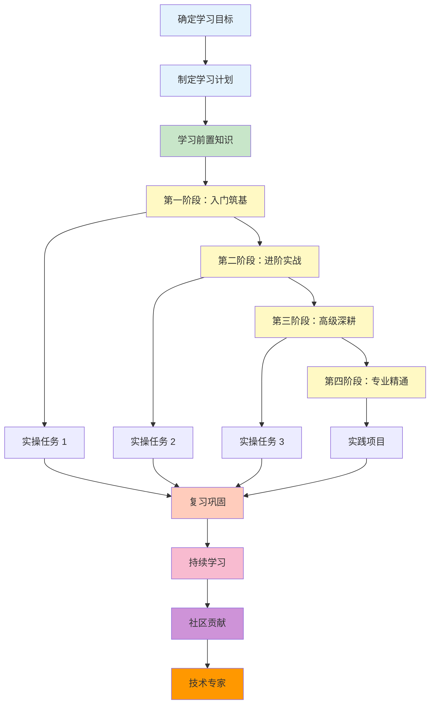

# 学习黄金法则

!!! quote "学习的本质"
    学习不仅仅是获取知识，更是培养解决问题的能力。掌握正确的学习方法，比学习具体的技术知识更重要。
    
    本章节总结了学习 Zephyr RTOS（以及任何技术）的黄金法则，帮助您建立高效的学习体系。

## 十大学习法则

### 法则 1：官方文档优先

!!! tip "为什么官方文档最重要？"
    - **权威性**：官方文档是第一手信息，最准确可靠
    - **完整性**：覆盖所有功能和 API，系统全面
    - **时效性**：随版本更新，始终保持最新
    - **深度**：不仅讲"怎么用"，还讲"为什么"

**Zephyr 官方文档结构**：
- **Getting Started**：快速入门指南
- **Kernel**：内核 API 和机制
- **Drivers**：设备驱动开发
- **Subsystems**：各子系统使用
- **Boards**：支持的开发板
- **Samples**：示例代码

**高效阅读方法**：
1. **目标导向**：带着问题去查文档，不要漫无目的地浏览
2. **跳读技巧**：先看目录和概述，再深入细节
3. **做笔记**：记录关键信息和自己的理解
4. **实践验证**：看完文档立即动手实践

**实践建议**：
```
遇到问题时的查找顺序：
1. Zephyr 官方文档（docs.zephyrproject.org）
2. Zephyr 源码和注释
3. GitHub Issues 和 Discussions
4. 第三方教程和博客（作为补充）
```

### 法则 2：实操为王

!!! tip "为什么实践最重要？"
    根据学习金字塔理论，实践的知识留存率高达 75%，而单纯阅读只有 10%。
    
    **看懂 ≠ 会用 ≠ 精通**

**实践的三个层次**：

**层次 1：验证性实践**
- 运行官方示例，验证环境配置
- 修改示例参数，观察结果变化
- 目标：确认理解正确

**层次 2：探索性实践**
- 尝试不同的 API 组合
- 故意制造错误，观察错误信息
- 目标：深入理解机制

**层次 3：创造性实践**
- 从零开始实现功能
- 解决实际问题
- 目标：融会贯通

**实践建议**：
```
每学一个知识点的实践流程：
1. 运行官方示例（5 分钟）
2. 修改参数观察变化（10 分钟）
3. 编写自己的测试代码（30 分钟）
4. 解决一个实际问题（1-2 小时）
```

### 法则 3：循序渐进

!!! tip "为什么要循序渐进？"
    知识是有依赖关系的，跳跃式学习会导致基础不牢，遇到问题时无从下手。

**学习路径规划**：



**避免跳跃式学习**：
- ❌ 还没搞懂线程，就去学驱动开发
- ❌ 还没掌握 Kconfig，就去做 BSP 移植
- ✅ 按照学习路径，扎实推进

**学习节奏**：
- 每天进步一点点，积少成多
- 定期复习，巩固记忆
- 遇到困难不要急躁，回到基础

**实践建议**：
```
学习计划示例：
第 1 周：前置知识 + 环境搭建
第 2 周：基础例程 + west 工具
第 3-4 周：内核机制 + 驱动开发
第 5-6 周：子系统 + 实际项目
```

### 法则 4：看源码

!!! tip "为什么要看源码？"
    - **理解实现**：知道"怎么做"比知道"做什么"更重要
    - **学习设计**：优秀的代码是最好的老师
    - **解决问题**：遇到 Bug 时，源码是最终答案

**源码阅读工具**：
- **VS Code + C/C++ 扩展**：代码跳转、符号搜索
- **cscope/ctags**：快速索引和查找
- **GDB**：动态调试，观察执行流程
- **GitHub**：查看提交历史和 PR 讨论

**源码阅读技巧**：

**1. 从宏观到微观**
```
系统架构 → 模块划分 → 核心数据结构 → 关键函数 → 实现细节
```

**2. 从接口到实现**
```
API 定义 → 函数调用链 → 底层实现 → 硬件操作
```

**3. 追踪代码执行**
```c
// 使用 printk 追踪
printk("Enter function: %s\n", __func__);

// 使用 GDB 单步调试
(gdb) break z_cstart
(gdb) step
(gdb) next
```

**实践建议**：
```
源码阅读计划：
1. 从简单的函数开始（如 k_sleep）
2. 追踪一个系统调用的完整路径
3. 分析一个子系统的实现（如日志系统）
4. 理解内核核心机制（调度器、内存管理）
```

### 法则 5：善用社区

!!! tip "为什么要利用社区？"
    - **解决问题**：遇到问题时，社区是最好的帮助
    - **学习经验**：从他人的问题和解决方案中学习
    - **建立人脉**：认识同行，拓展视野
    - **贡献回馈**：帮助他人，提升自己

**如何提问**：

**好的提问示例**：
```
标题：west build 失败：找不到 CMAKE_C_COMPILER

环境信息：
- 操作系统：Ubuntu 22.04
- Zephyr 版本：3.5.0
- 开发板：nrf52840dk_nrf52840

问题描述：
执行 west build 时报错：
```
CMake Error: CMAKE_C_COMPILER not set
```

已尝试的解决方案：
1. 确认 Zephyr SDK 已安装在 ~/zephyr-sdk-0.16.4
2. 执行了 source zephyr/zephyr-env.sh
3. 环境变量 ZEPHYR_TOOLCHAIN_VARIANT=zephyr

完整错误日志：
[附上完整的错误输出]
```

**不好的提问示例**：
```
❌ "编译失败了，怎么办？"（信息不足）
❌ "为什么我的代码不工作？"（没有代码和错误信息）
❌ "有人用过 Zephyr 吗？"（问题不明确）
```

**社区资源导航**：

**官方资源**：
- [Zephyr 官方文档](https://docs.zephyrproject.org/)
- [Zephyr GitHub](https://github.com/zephyrproject-rtos/zephyr)
- [Zephyr 邮件列表](https://lists.zephyrproject.org/)
- [Zephyr Discord](https://discord.gg/zephyr)

**第三方资源**：
- 技术博客（掘金、CSDN、个人博客）
- 视频教程（B站、YouTube）
- 技术论坛（Stack Overflow、Reddit）

**实践建议**：
```
社区参与计划：
1. 每周浏览 Zephyr GitHub Issues，了解常见问题
2. 在 Discord 或邮件列表中观察讨论
3. 尝试回答其他人的问题（教学相长）
4. 分享自己的学习笔记和经验
```

### 法则 6：记录总结

!!! tip "为什么要记录？"
    - **加深理解**：写作是最好的学习方式
    - **方便复习**：避免重复学习
    - **分享交流**：帮助他人，建立影响力
    - **职业发展**：技术博客是最好的简历

**笔记方法**：

**1. Markdown 笔记**
```markdown
# Zephyr 线程管理

## 核心概念
- 线程是 Zephyr 的基本执行单元
- 支持抢占式和协作式调度

## API 使用
```c
K_THREAD_DEFINE(my_thread, 1024, thread_entry, NULL, NULL, NULL, 5, 0, 0);
```

## 注意事项
- 线程栈大小要合理设置
- 优先级范围：0-14（抢占式），负数（协作式）

## 参考资料
- [官方文档](https://docs.zephyrproject.org/latest/kernel/services/threads/)
```

**2. 思维导图**
- 用于梳理知识结构
- 可视化知识点之间的关系

**3. 代码注释**
```c
// 创建线程的三种方式：
// 1. K_THREAD_DEFINE - 编译时定义（推荐）
// 2. k_thread_create - 运行时创建
// 3. K_THREAD_STACK_DEFINE + k_thread_create - 灵活控制
```

**实践建议**：
```
笔记系统建议：
- 工具：Notion、Obsidian、Typora
- 结构：按学习阶段组织
- 内容：概念 + 代码 + 问题 + 解决方案
- 习惯：每学完一个章节就整理笔记
```

### 法则 7：项目驱动

!!! tip "为什么要做项目？"
    - **综合应用**：将零散的知识点串联起来
    - **解决实际问题**：学以致用
    - **积累经验**：项目经验是最宝贵的财富
    - **展示能力**：项目是最好的作品集

**项目选择原则**：
1. **从小到大**：先做简单项目，再做复杂项目
2. **兴趣驱动**：选择自己感兴趣的方向
3. **循序渐进**：每个项目都比上一个复杂一点

**项目示例**：

**入门级项目**：
- 智能台灯（GPIO + PWM）
- 温湿度监测器（I2C + 日志）
- 串口调试助手（UART + Shell）

**进阶级项目**：
- 智能家居网关（多协议 + 网络）
- 数据采集器（多传感器 + 存储）
- 电机控制器（PWM + PID + 实时性）

**高级项目**：
- 工业物联网边缘计算节点
- 可穿戴健康监测设备
- 无人机飞控系统

**实践建议**：
```
项目开发流程：
1. 需求分析：明确要实现什么功能
2. 架构设计：设计系统架构和模块划分
3. 分步实现：先实现核心功能，再添加辅助功能
4. 测试优化：测试功能，优化性能
5. 文档总结：编写项目文档，总结经验
```

### 法则 8：对比学习

!!! tip "为什么要对比？"
    - **加深理解**：通过对比理解设计差异
    - **拓展视野**：了解不同的实现方式
    - **选型决策**：知道何时选择何种方案

**对比维度**：

**1. Zephyr vs 其他 RTOS**
| 特性 | Zephyr | FreeRTOS | RT-Thread |
|------|--------|----------|-----------|
| 许可证 | Apache 2.0 | MIT | Apache 2.0 |
| 配置系统 | Kconfig + 设备树 | 头文件 | menuconfig |
| 设备模型 | 设备树 | 无 | 设备框架 |
| 社区 | Linux Foundation | Amazon | 中国社区 |

**2. 不同实现方式对比**
```c
// 方式 1：编译时定义（推荐）
K_THREAD_DEFINE(my_thread, 1024, entry, NULL, NULL, NULL, 5, 0, 0);

// 方式 2：运行时创建（灵活）
struct k_thread my_thread;
K_THREAD_STACK_DEFINE(my_stack, 1024);
k_thread_create(&my_thread, my_stack, 1024, entry, NULL, NULL, NULL, 5, 0, K_NO_WAIT);
```

**实践建议**：
```
对比学习计划：
1. 对比 Zephyr 和 FreeRTOS 的 API 设计
2. 对比不同架构（ARM、x86、RISC-V）的实现
3. 对比不同配置方案的优缺点
```

### 法则 9：定期复习

!!! tip "为什么要复习？"
    根据艾宾浩斯遗忘曲线，不复习的知识会快速遗忘。定期复习可以将知识转化为长期记忆。

**复习策略**：

**间隔重复**：
- 第 1 次：学习后 1 天
- 第 2 次：学习后 3 天
- 第 3 次：学习后 1 周
- 第 4 次：学习后 1 个月

**复习方法**：
1. **回顾笔记**：快速浏览学习笔记
2. **重做练习**：重新实现之前的代码
3. **教授他人**：给别人讲解（最有效）
4. **解决新问题**：用学过的知识解决新问题

**实践建议**：
```
复习计划：
- 每周末：复习本周学习内容
- 每月末：复习本月学习内容
- 每季度：系统复习，查漏补缺
```

### 法则 10：保持好奇

!!! tip "为什么要保持好奇？"
    好奇心是学习的最大动力。保持对技术的好奇心，才能持续学习和进步。

**培养好奇心**：
- **多问为什么**：不满足于"能用"，要理解"为什么"
- **探索新领域**：关注技术发展趋势
- **尝试新工具**：体验不同的开发工具和方法
- **参与讨论**：与他人交流，碰撞思想

**保持学习热情**：
- 设定学习目标，完成后给自己奖励
- 加入学习小组，互相鼓励
- 参加技术会议和 Meetup
- 关注技术大牛，学习他们的思维方式

## 常见学习误区

!!! danger "误区 1：只看不练"
    **表现**：看了很多教程和文档，但从不动手写代码
    
    **危害**：知识停留在表面，遇到实际问题无从下手
    
    **解决**：每学一个知识点，立即动手实践

!!! danger "误区 2：跳跃式学习"
    **表现**：基础不牢，就去学高级内容
    
    **危害**：遇到问题时，发现基础知识缺失
    
    **解决**：按照学习路径，循序渐进

!!! danger "误区 3：过度依赖教程"
    **表现**：只看第三方教程，不看官方文档
    
    **危害**：信息可能过时或不准确
    
    **解决**：优先查阅官方文档

!!! danger "误区 4：遇到问题就放弃"
    **表现**：遇到困难就换方向，缺乏耐心
    
    **危害**：永远停留在入门阶段
    
    **解决**：培养解决问题的能力，坚持下去

!!! danger "误区 5：孤军奋战"
    **表现**：不利用社区资源，自己闭门造车
    
    **危害**：效率低下，容易走弯路
    
    **解决**：积极参与社区，寻求帮助

## 学习效率提升技巧

### 时间管理

**番茄工作法**：
- 25 分钟专注学习
- 5 分钟休息
- 4 个番茄后，休息 15-30 分钟

**时间块**：
- 将学习时间分块，每块专注一个主题
- 避免频繁切换任务

### 专注力

**减少干扰**：
- 关闭社交媒体和通知
- 使用专注模式（如 Forest App）
- 创造安静的学习环境

**深度工作**：
- 每天安排 2-4 小时深度学习时间
- 在精力最好的时候学习难点

### 学习工具

**笔记工具**：
- Notion：全能笔记工具
- Obsidian：本地 Markdown 笔记
- Typora：简洁的 Markdown 编辑器

**知识管理**：
- Anki：间隔重复记忆
- XMind：思维导图
- Zotero：文献管理

## 完整学习路线图



## 学习资源推荐

### 官方资源
- [Zephyr 官方文档](https://docs.zephyrproject.org/)
- [Zephyr GitHub](https://github.com/zephyrproject-rtos/zephyr)
- [Zephyr 示例代码](https://github.com/zephyrproject-rtos/zephyr/tree/main/samples)

### 书籍推荐
- 《嵌入式实时操作系统》
- 《ARM Cortex-M 权威指南》
- 《嵌入式系统设计》

### 在线课程
- Zephyr 官方培训
- Coursera 嵌入式系统课程
- Udemy Zephyr 课程

### 社区资源
- Zephyr 中文社区
- 嵌入式开发者论坛
- 技术博客和公众号

## 实操任务

!!! example "建立个人学习系统"
    完成以下任务，建立您的个人学习系统：
    
    ### 任务 1：制定学习计划
    - 评估当前技能水平
    - 设定学习目标（3 个月、6 个月、1 年）
    - 制定详细的学习计划
    - 设置学习检查点
    
    ### 任务 2：建立笔记系统
    - 选择笔记工具（Notion、Obsidian 等）
    - 创建笔记模板
    - 开始记录学习笔记
    - 定期整理和复习
    
    ### 任务 3：参与社区
    - 注册 GitHub 账号
    - 加入 Zephyr Discord 或邮件列表
    - 在社区提一个高质量的问题
    - 尝试回答其他人的问题

## 总结

学习是一个持续的过程，没有捷径，但有方法。遵循这些学习法则，您将能够：

- ✅ 建立系统的知识体系
- ✅ 高效地学习和掌握新技术
- ✅ 培养解决问题的能力
- ✅ 保持持续学习的热情

记住：**学习的目的不是记住所有知识，而是培养学习能力和解决问题的能力。**

<div style="text-align: center; margin-top: 30px;">
    <a href="../" class="md-button md-button--primary">
        返回首页
    </a>
</div>

---

!!! quote "最后的话"
    技术在变，但学习的方法不变。掌握了正确的学习方法，您就能够快速适应技术的变化，持续成长。
    
    祝您学习愉快，早日成为 Zephyr 专家！
