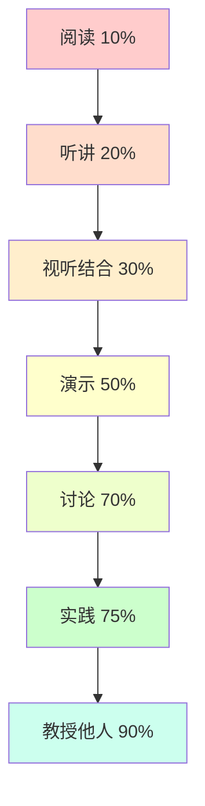
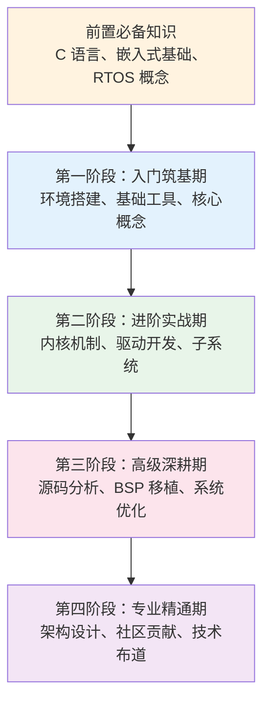
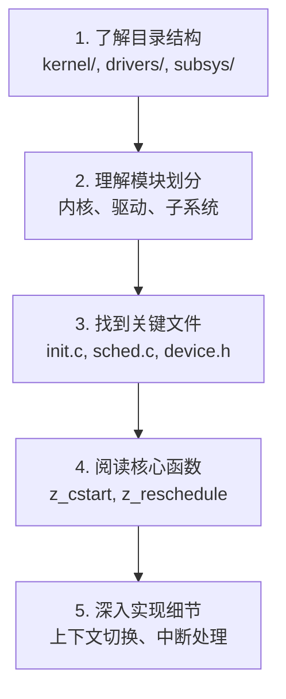
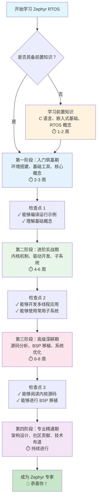

# 学习黄金法则

欢迎来到 Zephyr RTOS 学习黄金法则！本章节将为你提供一套经过验证的学习方法论，帮助你更高效、更系统地掌握 Zephyr RTOS。无论你是初学者还是有经验的开发者，这些原则都将指导你在学习旅程中少走弯路，快速成长。

!!! success "核心理念"
    学习不仅仅是获取知识，更是建立思维模式和解决问题的能力。通过遵循这些黄金法则，你将建立起扎实的技术基础和持续学习的能力。

## 一、官方文档优先原则

### 为什么官方文档最权威

官方文档是学习任何技术的第一手资料，具有无可替代的价值：

- **权威性**：由核心开发团队维护，确保信息准确无误
- **完整性**：覆盖所有功能特性，从基础到高级
- **时效性**：随版本更新而更新，始终保持最新
- **一致性**：术语、概念、API 描述统一规范
- **深度**：不仅讲"怎么用"，还讲"为什么"和"注意事项"

!!! tip "实践建议"
    遇到问题时，第一反应应该是"官方文档怎么说"，而不是"网上有没有教程"。养成查阅官方文档的习惯，是成为专业开发者的第一步。

### Zephyr 官方文档结构

Zephyr 官方文档（[https://docs.zephyrproject.org/](https://docs.zephyrproject.org/)）组织清晰，主要包含以下部分：

| 文档部分 | 内容说明 | 适用阶段 | 链接 |
|---------|---------|---------|------|
| **Getting Started** | 环境搭建、快速入门、基础示例 | 入门筑基期 | [查看](https://docs.zephyrproject.org/latest/develop/getting_started/index.html) |
| **Kernel** | 内核机制、线程管理、同步通信 | 进阶实战期 | [查看](https://docs.zephyrproject.org/latest/kernel/index.html) |
| **Drivers** | 驱动模型、外设 API、驱动开发 | 进阶实战期 | [查看](https://docs.zephyrproject.org/latest/hardware/peripherals/index.html) |
| **Subsystems** | 日志、Shell、存储、网络等子系统 | 进阶实战期 | [查看](https://docs.zephyrproject.org/latest/services/index.html) |
| **Build and Configuration** | Kconfig、设备树、CMake 构建 | 进阶实战期 | [查看](https://docs.zephyrproject.org/latest/build/index.html) |
| **Hardware Support** | 支持的开发板和 SoC | 入门筑基期 | [查看](https://docs.zephyrproject.org/latest/boards/index.html) |
| **API Reference** | 完整的 API 文档 | 所有阶段 | [查看](https://docs.zephyrproject.org/latest/doxygen/html/index.html) |
| **Guides** | 移植指南、优化指南、安全指南 | 高级深耕期 | [查看](https://docs.zephyrproject.org/latest/guides/index.html) |

### 高效阅读官方文档的方法

**1. 目标导向阅读**

不要试图从头到尾通读文档，而是带着具体问题和目标去查阅：

- 想实现某个功能？→ 查找对应的 API Reference
- 遇到编译错误？→ 查看 Build and Configuration
- 不理解某个概念？→ 阅读 Kernel 或 Subsystems 的概念说明

**2. 跳读与精读结合**

- **跳读**：快速浏览目录和标题，定位相关章节
- **精读**：找到目标内容后，仔细阅读每个细节
- **示例优先**：先看代码示例，再看文字说明

**3. 做笔记和标注**


- 使用 Markdown 记录重要概念和 API
- 标注不理解的地方，后续深入研究
- 整理常用 API 的快速参考手册

**4. 文档导航技巧**

- **使用搜索**：Ctrl+F 或文档搜索框快速定位关键词
- **查看索引**：API Reference 提供了完整的函数索引
- **跟随链接**：文档内部链接丰富，点击可深入了解相关概念

### 官方文档 vs 第三方教程

| 对比维度 | 官方文档 | 第三方教程 |
|---------|---------|-----------|
| **权威性** | ⭐⭐⭐⭐⭐ 最权威 | ⭐⭐⭐ 可能有误 |
| **完整性** | ⭐⭐⭐⭐⭐ 全面覆盖 | ⭐⭐⭐ 选择性讲解 |
| **时效性** | ⭐⭐⭐⭐⭐ 持续更新 | ⭐⭐ 可能过时 |
| **易读性** | ⭐⭐⭐ 偏技术性 | ⭐⭐⭐⭐⭐ 通俗易懂 |
| **实战性** | ⭐⭐⭐⭐ 有示例 | ⭐⭐⭐⭐⭐ 项目导向 |

!!! note "最佳实践"
    **先官方文档，后第三方教程**。用官方文档建立准确的知识框架，用第三方教程补充实战经验和不同视角。

## 二、实操为王原则

### 学习金字塔：实践的记忆留存率最高

根据学习金字塔理论，不同学习方式的知识留存率差异巨大：




**结论**：只看不练，知识留存率仅有 10-30%；动手实践，留存率可达 75%！

### 动手实践的重要性

**理论 vs 实践的差距**：

- **理论**：知道 `k_thread_create()` 的参数含义
- **实践**：能够创建线程、调试栈溢出、优化优先级配置

!!! warning "常见误区"
    很多初学者花大量时间看教程、看视频，却很少动手写代码。结果是"看懂了"但"不会写"，遇到实际问题束手无策。

### 如何设计实操任务

**从简单到复杂的进阶路径**：

1. **模仿阶段**：运行官方示例，观察输出
2. **修改阶段**：修改示例参数，观察变化
3. **组合阶段**：组合多个功能，实现小项目
4. **创造阶段**：独立设计和实现完整项目

**实操任务设计原则**：

- **目标明确**：每个任务有清晰的学习目标
- **可验证**：任务完成后有明确的验证标准
- **有挑战**：略高于当前水平，但不至于无从下手
- **有反馈**：通过编译、运行、调试获得即时反馈

### 从示例到项目的进阶


### 调试即学习

遇到问题不要急于求助，先尝试自己调试：

- **编译错误**：仔细阅读错误信息，定位问题代码
- **运行异常**：使用 printk 输出调试信息
- **功能不符**：使用 GDB 单步调试，观察变量变化

!!! tip "调试的价值"
    调试过程中，你会深入理解代码执行流程、数据结构变化、系统行为，这比单纯看文档学到的更多。

### 实践建议

**每学一个知识点就写代码验证**：

- 学习了线程创建？→ 立即写代码创建 3 个不同优先级的线程
- 学习了互斥锁？→ 立即写代码模拟资源竞争和保护
- 学习了消息队列？→ 立即写代码实现生产者-消费者模式

**建立个人代码库**：

- 为每个知识点创建独立的测试项目
- 整理常用代码片段和配置模板
- 记录遇到的问题和解决方案

## 三、循序渐进原则

### 学习路径规划

学习 Zephyr RTOS 需要遵循清晰的路径，不能跳跃式学习：




### 知识点的依赖关系

很多知识点之间存在依赖关系，必须先掌握基础才能理解高级内容：

| 高级知识点 | 依赖的基础知识 |
|-----------|---------------|
| **驱动开发** | 设备树、Kconfig、GPIO/I2C/SPI API |
| **BSP 移植** | 启动流程、设备树、驱动模型、链接脚本 |
| **系统优化** | 内核机制、调度器、内存管理、性能分析工具 |
| **多线程应用** | 线程创建、同步机制、优先级配置 |

!!! danger "跳跃式学习的危害"
    如果不理解设备树就去学驱动开发，会遇到大量看不懂的配置；如果不理解线程调度就去做性能优化，会无从下手。**基础不牢，地动山摇！**

### 避免跳跃式学习

**错误示例**：

- ❌ 刚搭建好环境，就想做 BSP 移植
- ❌ 还没理解线程，就想学习内核源码
- ❌ 基础 API 都不熟，就想做架构设计

**正确做法**：

- ✅ 按照本平台的学习路径顺序，一步一个脚印
- ✅ 每个阶段都完成必做实操任务，确保掌握
- ✅ 遇到不理解的概念，回到前面章节复习

### 学习节奏：每天进步一点点

**持续学习比突击学习更有效**：

- **每天 1-2 小时**，持续 3 个月 → 扎实掌握
- **周末突击 10 小时**，然后停一周 → 容易遗忘

**学习计划建议**：

| 学习阶段 | 建议时长 | 每日安排 |
|---------|---------|---------|
| **前置知识** | 1-2 周 | 1 小时复习 C 语言和嵌入式基础 |
| **入门筑基期** | 2-3 周 | 1 小时学习 + 1 小时实操 |
| **进阶实战期** | 4-6 周 | 1 小时学习 + 2 小时实操 |
| **高级深耕期** | 6-8 周 | 2 小时源码阅读 + 2 小时实践 |
| **专业精通期** | 持续进行 | 参与社区、做项目、分享经验 |


### 复习和巩固：间隔重复

**艾宾浩斯遗忘曲线**告诉我们，学习后如果不复习，遗忘速度很快：

- 20 分钟后，遗忘 42%
- 1 天后，遗忘 66%
- 1 周后，遗忘 75%

**间隔重复策略**：

1. **学习当天**：晚上复习一遍笔记和代码
2. **第 2 天**：快速回顾核心概念
3. **第 7 天**：重新运行代码，尝试不看文档实现
4. **第 30 天**：做一个综合项目，应用所学知识

!!! tip "实践建议"
    按照本平台的学习路径顺序学习，每个阶段都有明确的目标和检查点，帮助你循序渐进地掌握 Zephyr RTOS。

## 四、看源码方法

### 为什么要看源码

**看源码的价值**：

- **理解实现**：知道 API 背后的实现机制
- **学习设计**：学习优秀的代码组织和设计模式
- **解决问题**：遇到 Bug 时能够定位根因
- **提升能力**：从"会用"到"精通"的必经之路

!!! quote "Linus Torvalds 说"
    "Read the fucking source code."（去读源码！）

### 源码阅读工具

**推荐工具组合**：

| 工具 | 用途 | 优势 |
|-----|------|------|
| **VS Code** | 代码编辑和浏览 | 智能提示、跳转定义、查找引用 |
| **cscope** | 代码索引和搜索 | 快速查找函数定义、调用关系 |
| **ctags** | 符号索引 | 生成标签文件，支持跳转 |
| **GDB** | 源码级调试 | 单步执行、查看调用栈、观察变量 |
| **Git** | 版本历史 | 查看提交历史、理解代码演进 |


**VS Code 配置建议**：

```json
{
  "C_Cpp.intelliSenseEngine": "default",
  "C_Cpp.default.compileCommands": "${workspaceFolder}/build/compile_commands.json",
  "files.associations": {
    "*.dts": "dts",
    "*.overlay": "dts"
  }
}
```

### 源码阅读技巧

**1. 从宏观到微观**

不要一开始就陷入细节，先建立整体认识：



**2. 从接口到实现**

先看 API 定义（头文件），再看实现（源文件）：

- **头文件**（`include/zephyr/kernel.h`）：了解 API 签名、参数、返回值
- **源文件**（`kernel/thread.c`）：了解具体实现逻辑

**3. 追踪代码执行流程**

使用 GDB 或 printk 追踪函数调用链：

```c
// 添加调试输出
void my_function(void) {
    printk("Enter my_function\n");
    // ... 函数实现
    printk("Exit my_function\n");
}
```

**4. 使用 GDB 单步调试**

```bash
# 启动 GDB 调试
west debug

# GDB 命令
(gdb) break main          # 在 main 函数设置断点
(gdb) run                 # 运行程序
(gdb) step                # 单步执行（进入函数）
(gdb) next                # 单步执行（不进入函数）
(gdb) backtrace           # 查看调用栈
(gdb) print variable      # 打印变量值
```


### 理解设计意图

**不仅要知道"是什么"，更要理解"为什么"**：

**1. 阅读注释**

Zephyr 源码中有丰富的注释，解释设计决策：

```c
/**
 * @brief Create a thread.
 *
 * This routine initializes a thread, then schedules it for execution.
 *
 * @param new_thread Pointer to uninitialized struct k_thread
 * @param stack Pointer to the stack space.
 * @param stack_size Stack size in bytes.
 * ...
 */
```

**2. 查看提交历史**

使用 Git 查看代码的演进历史：

```bash
# 查看文件的提交历史
git log --follow kernel/sched.c

# 查看某次提交的详细信息
git show <commit-hash>

# 查看某行代码的修改历史
git blame kernel/sched.c
```

**3. 阅读设计文档**

Zephyr 官方文档中有很多设计文档，解释架构决策：

- Architecture Guides
- Design Documents
- RFC (Request for Comments)

### 实践建议

**从简单的函数开始，逐步深入**：

1. **第一周**：阅读简单的工具函数（如 `k_uptime_get()`）
2. **第二周**：阅读线程创建流程（`k_thread_create()`）
3. **第三周**：阅读调度器实现（`z_reschedule()`）
4. **第四周**：阅读上下文切换（`arch/arm/core/swap.c`）

!!! tip "源码阅读目标"
    不要试图理解每一行代码，重点是理解整体架构、关键流程和设计思想。

## 五、善用社区资源

### 如何提问

**提问是一门艺术**，好的问题更容易得到帮助：


**好问题的特征**：

1. **描述清楚**：问题是什么、期望是什么、实际是什么
2. **提供上下文**：Zephyr 版本、开发板型号、编译命令
3. **展示尝试**：已经尝试了哪些方法、查阅了哪些文档
4. **代码示例**：提供最小可复现代码（Minimal Reproducible Example）
5. **错误信息**：完整的错误日志和堆栈信息

**问题模板**：

```markdown
## 问题描述
我在使用 nRF52840 DK 开发板时，遇到了线程栈溢出的问题。

## 环境信息
- Zephyr 版本：3.5.0
- 开发板：nRF52840 DK
- 编译命令：west build -b nrf52840dk_nrf52840

## 期望行为
线程应该正常运行，不应该崩溃。

## 实际行为
程序运行一段时间后崩溃，串口输出：
```
*** USAGE FAULT ***
  Stacking error
```

## 已尝试的方法
1. 查阅了官方文档的线程管理章节
2. 尝试增加线程栈大小到 2048 字节，问题依然存在
3. 使用 CONFIG_THREAD_STACK_INFO=y 检查栈使用情况

## 代码示例
```c
K_THREAD_STACK_DEFINE(my_stack, 1024);
struct k_thread my_thread;

void my_thread_entry(void *p1, void *p2, void *p3) {
    while (1) {
        // 线程逻辑
        k_sleep(K_MSEC(1000));
    }
}

k_thread_create(&my_thread, my_stack, K_THREAD_STACK_SIZEOF(my_stack),
                my_thread_entry, NULL, NULL, NULL,
                5, 0, K_NO_WAIT);
```

## 问题
如何定位栈溢出的具体原因？是否有更好的调试方法？
```


!!! warning "不好的问题"
    - ❌ "Zephyr 怎么用？"（太宽泛）
    - ❌ "我的代码不工作，怎么办？"（没有具体信息）
    - ❌ "有没有人会 Zephyr？"（浪费时间）

### 搜索技巧

**在提问之前，先搜索**：

**1. Google 搜索技巧**

```
# 精确匹配
"k_thread_create" zephyr

# 站内搜索
site:docs.zephyrproject.org device tree

# 排除关键词
zephyr thread -freertos

# 文件类型
zephyr tutorial filetype:pdf
```

**2. GitHub 搜索**

- **搜索 Issues**：`is:issue k_thread_create stack overflow`
- **搜索代码**：在 Zephyr 仓库中搜索函数定义和使用
- **搜索 Discussions**：查看社区讨论

**3. Stack Overflow**

- 使用标签：`[zephyr-rtos]`
- 查看高票回答
- 关注相关问题

### 社区资源导航

**官方资源**：

| 资源 | 链接 | 用途 |
|-----|------|------|
| **官方文档** | https://docs.zephyrproject.org/ | 学习和参考 |
| **GitHub 仓库** | https://github.com/zephyrproject-rtos/zephyr | 源码和 Issues |
| **邮件列表** | https://lists.zephyrproject.org/ | 技术讨论 |
| **Discord** | https://chat.zephyrproject.org/ | 实时交流 |
| **开发者峰会** | Zephyr Developer Summit | 年度技术会议 |

**第三方资源**：

- **博客**：搜索 "Zephyr RTOS tutorial"
- **视频**：YouTube、B站 搜索 "Zephyr RTOS"
- **论坛**：嵌入式开发论坛、Reddit r/embedded
- **书籍**：《Zephyr RTOS 实战》等技术书籍


### 建立学习网络

**加入社区的好处**：

- **获得帮助**：遇到问题时有人解答
- **学习经验**：看到别人的问题和解决方案
- **建立人脉**：认识同行，交流技术
- **了解动态**：第一时间知道新版本和新特性

**如何参与社区**：

1. **订阅邮件列表**：接收技术讨论和公告
2. **加入 Discord**：实时交流，快速提问
3. **关注 GitHub**：Star 仓库，Watch Issues
4. **参与讨论**：回答别人的问题，分享经验
5. **贡献代码**：修复 Bug，提交 PR

!!! tip "实践建议"
    **先搜索再提问，积极参与社区**。帮助别人解决问题，也是提升自己的好方法。

## 六、学习效率提升技巧

### 时间管理

**番茄工作法**：

1. 选择一个学习任务
2. 设置 25 分钟计时器，专注学习
3. 休息 5 分钟
4. 每 4 个番茄钟，休息 15-30 分钟

**时间块规划**：

| 时间段 | 学习内容 | 时长 |
|-------|---------|------|
| **早上 7:00-8:00** | 阅读官方文档，学习新概念 | 1 小时 |
| **晚上 8:00-10:00** | 动手实操，编写代码 | 2 小时 |
| **周末上午** | 深入源码阅读 | 2-3 小时 |
| **周末下午** | 做综合项目，整合知识 | 2-3 小时 |

### 专注力提升

**减少干扰**：

- 关闭社交媒体通知
- 使用专注模式（手机勿扰模式）
- 整理干净的学习环境
- 告诉家人/室友你在学习

**深度工作**：

- 选择固定的学习时间和地点
- 避免多任务，一次只做一件事
- 进入"心流"状态，忘记时间


### 笔记方法

**Markdown 笔记**：

```markdown
# Zephyr 线程管理

## 核心概念
- 线程是 Zephyr 中的基本执行单元
- 每个线程有独立的栈空间
- 线程优先级：0-14（抢占式），负数（协作式）

## API 速查
```c
// 创建线程
k_thread_create(&thread, stack, stack_size, entry, p1, p2, p3, 
                priority, options, delay);

// 线程休眠
k_sleep(K_MSEC(1000));
```

## 常见问题
- 栈溢出：增加栈大小或优化代码
- 优先级反转：使用互斥锁
```

**思维导图**：

使用工具（如 XMind、MindMaster）绘制知识结构图，建立知识之间的联系。

### 知识管理

**建立个人知识库**：

- **工具选择**：Notion、Obsidian、语雀
- **组织方式**：按学习阶段、按主题、按项目
- **定期整理**：每周回顾和更新笔记

**代码片段管理**：

- 使用 VS Code Snippets
- 使用 GitHub Gist
- 建立个人代码模板库

### 学习工具推荐

| 工具 | 用途 | 推荐理由 |
|-----|------|---------|
| **Anki** | 间隔重复记忆 | 记忆 API、概念、命令 |
| **Notion** | 知识管理 | 强大的笔记和数据库功能 |
| **Obsidian** | 知识图谱 | Markdown 原生，双向链接 |
| **Typora** | Markdown 编辑 | 所见即所得，简洁美观 |
| **Draw.io** | 绘制图表 | 免费、功能强大 |

## 七、常见学习误区

### 误区 1：只看不练（纸上谈兵）

**表现**：

- 看了很多教程和视频
- 觉得自己"都懂了"
- 一写代码就卡壳


**危害**：

- 知识停留在表面，无法应用
- 遇到实际问题束手无策
- 浪费大量时间，学习效率低

**如何避免**：

- ✅ 看完一个知识点，立即写代码验证
- ✅ 每天至少 50% 的时间用于实操
- ✅ 完成本平台的必做实操任务

### 误区 2：跳跃式学习（基础不牢）

**表现**：

- 刚搭建好环境，就想做复杂项目
- 基础概念不理解，直接看高级内容
- 遇到问题不知道从哪里入手

**危害**：

- 基础不扎实，后续学习困难重重
- 理解不深入，容易出错
- 学习挫败感强，容易放弃

**如何避免**：

- ✅ 严格按照学习路径顺序学习
- ✅ 每个阶段都完成检查点验证
- ✅ 遇到不理解的，回到前面章节复习

### 误区 3：过度依赖教程（不看官方文档）

**表现**：

- 只看第三方教程，不看官方文档
- 遇到问题就搜教程，不查官方文档
- 对 API 的理解停留在教程层面

**危害**：

- 信息可能过时或不准确
- 理解不全面，只知其然不知其所以然
- 无法独立解决问题

**如何避免**：

- ✅ 官方文档优先，教程作为补充
- ✅ 遇到 API 问题，先查 API Reference
- ✅ 养成查阅官方文档的习惯


### 误区 4：遇到问题就放弃（缺乏耐心）

**表现**：

- 遇到编译错误就放弃
- 调试几次不成功就求助
- 看到复杂的代码就跳过

**危害**：

- 失去深入学习的机会
- 无法培养独立解决问题的能力
- 学习进度缓慢

**如何避免**：

- ✅ 给自己设定"调试时间"，至少尝试 30 分钟
- ✅ 学习使用调试工具（GDB、printk）
- ✅ 记录问题和解决过程，积累经验

### 误区 5：孤军奋战（不利用社区）

**表现**：

- 遇到问题自己死磕，不求助
- 不参与社区讨论
- 不关注技术动态

**危害**：

- 浪费时间在已知问题上
- 错过学习和交流的机会
- 技术视野狭窄

**如何避免**：

- ✅ 加入 Zephyr 社区（Discord、邮件列表）
- ✅ 遇到问题先搜索，再提问
- ✅ 积极参与讨论，帮助他人

## 八、完整学习路线图




### 各阶段学习重点和时间安排

| 学习阶段 | 核心目标 | 学习重点 | 建议时长 | 每日安排 |
|---------|---------|---------|---------|---------|
| **前置知识** | 补齐基础 | C 语言、嵌入式硬件、RTOS 概念、工具使用 | 1-2 周 | 1 小时复习 |
| **入门筑基期** | 能跑起来 | 环境搭建、west 工具、工程结构、基础例程 | 2-3 周 | 1 小时学习 + 1 小时实操 |
| **进阶实战期** | 能做项目 | 内核机制、驱动开发、子系统使用 | 4-6 周 | 1 小时学习 + 2 小时实操 |
| **高级深耕期** | 能解决难题 | 源码分析、BSP 移植、系统优化、安全 | 6-8 周 | 2 小时源码 + 2 小时实践 |
| **专业精通期** | 能带团队 | 架构设计、社区贡献、技术分享 | 持续进行 | 参与项目和社区 |

### 学习检查点：如何评估学习效果

**第一阶段检查点**：

- [ ] 能够独立搭建 Zephyr 开发环境
- [ ] 能够使用 west 工具编译和烧录程序
- [ ] 能够修改 hello_world 和 blinky 示例
- [ ] 理解 Zephyr 的基本概念和工程结构

**第二阶段检查点**：

- [ ] 能够创建多线程应用并处理同步问题
- [ ] 能够使用常用外设 API（GPIO、UART、I2C、SPI）
- [ ] 能够配置 Kconfig 和设备树
- [ ] 能够使用日志、Shell、存储等子系统

**第三阶段检查点**：

- [ ] 能够阅读和理解内核源码
- [ ] 能够为新的 SoC 或开发板移植 Zephyr
- [ ] 能够进行系统性能分析和优化
- [ ] 能够实现安全启动和 OTA 升级

**第四阶段检查点**：

- [ ] 能够设计复杂的嵌入式系统架构
- [ ] 能够向 Zephyr 社区贡献代码
- [ ] 能够进行技术分享和培训
- [ ] 能够指导团队成员学习 Zephyr


### 学习资源推荐

**官方资源**：

- 📚 [Zephyr 官方文档](https://docs.zephyrproject.org/)
- 💻 [Zephyr GitHub 仓库](https://github.com/zephyrproject-rtos/zephyr)
- 📧 [Zephyr 邮件列表](https://lists.zephyrproject.org/)
- 💬 [Zephyr Discord](https://chat.zephyrproject.org/)

**书籍推荐**：

- 《Mastering Zephyr RTOS》
- 《Embedded Systems with Zephyr》
- 《Real-Time Operating Systems》

**视频课程**：

- YouTube: "Zephyr RTOS Tutorial"
- B站: 搜索 "Zephyr RTOS 教程"
- Udemy: Zephyr RTOS 相关课程

**实战项目**：

- 智能家居传感器节点
- 可穿戴健康监测设备
- 工业数据采集器
- 无线通信网关

## 九、实操任务

完成以下实操任务，将学习方法论应用到实践中：

### 任务 1：制定个人学习计划

**目标**：根据自己的基础和时间，制定详细的学习计划。

**步骤**：

1. **自我评估**：
   - 评估自己的 C 语言水平（1-5 分）
   - 评估自己的嵌入式基础（1-5 分）
   - 评估自己的 RTOS 经验（1-5 分）

2. **确定起点**：
   - 如果总分 < 9 分，从前置知识开始
   - 如果总分 9-12 分，从第一阶段开始
   - 如果总分 > 12 分，从第二阶段开始

3. **制定计划**：
   - 确定每天的学习时间（建议 1-2 小时）
   - 规划每个阶段的完成时间
   - 设置检查点和里程碑

4. **记录计划**：
   - 使用 Markdown 或 Excel 记录学习计划
   - 包含学习内容、时间安排、完成标准


**学习计划模板**：

```markdown
# 我的 Zephyr RTOS 学习计划

## 自我评估
- C 语言水平：4/5
- 嵌入式基础：3/5
- RTOS 经验：2/5
- 总分：9/15

## 学习起点
从第一阶段开始

## 时间安排
- 每天学习时间：2 小时（晚上 8:00-10:00）
- 周末额外时间：4 小时（周六上午）

## 学习计划

### 第一阶段：入门筑基期（3 周）
- 第 1 周：环境搭建、west 工具
- 第 2 周：工程结构、基础例程
- 第 3 周：实操任务、总结复习

### 第二阶段：进阶实战期（6 周）
- 第 4-5 周：内核机制、多线程
- 第 6-7 周：驱动开发、外设使用
- 第 8-9 周：子系统、综合项目

### 检查点
- [ ] 第 1 周结束：能够编译运行 hello_world
- [ ] 第 3 周结束：完成第一阶段所有实操任务
- [ ] 第 6 周结束：能够开发多线程应用
- [ ] 第 9 周结束：完成一个综合项目

## 学习资源
- 主要：本学习平台 + Zephyr 官方文档
- 辅助：YouTube 视频教程
- 社区：加入 Zephyr Discord
```

### 任务 2：建立个人技术笔记系统

**目标**：建立一个系统化的技术笔记系统，记录学习过程。

**步骤**：

1. **选择工具**：
   - Notion（推荐，功能强大）
   - Obsidian（Markdown 原生）
   - 语雀（中文友好）
   - 或者简单的 Markdown 文件 + Git

2. **组织结构**：

```
Zephyr 学习笔记/
├── 00-前置知识/
│   ├── C 语言核心能力.md
│   ├── 嵌入式硬件基础.md
│   └── RTOS 基础概念.md
├── 01-入门筑基期/
│   ├── 环境搭建.md
│   ├── west 工具.md
│   └── 基础例程.md
├── 02-进阶实战期/
│   ├── 内核机制.md
│   ├── 驱动开发.md
│   └── 子系统.md
├── 代码片段/
│   ├── 线程创建模板.c
│   ├── I2C 驱动模板.c
│   └── 配置文件模板/
├── 问题记录/
│   ├── 编译错误解决.md
│   ├── 调试技巧.md
│   └── 常见问题 FAQ.md
└── 项目实战/
    ├── 项目 1：多线程应用.md
    └── 项目 2：传感器驱动.md
```


3. **笔记模板**：

```markdown
# 主题：Zephyr 线程管理

## 学习日期
2026-02-26

## 核心概念
- 线程是 Zephyr 中的基本执行单元
- 每个线程有独立的栈空间
- 线程优先级：0-14（抢占式），负数（协作式）

## API 速查
```c
// 创建线程
K_THREAD_DEFINE(my_thread, 1024, my_entry, NULL, NULL, NULL, 5, 0, 0);

// 线程休眠
k_sleep(K_MSEC(1000));

// 线程让出 CPU
k_yield();
```

## 代码示例
[链接到完整代码]

## 常见问题
1. **栈溢出**：增加栈大小或优化代码
2. **优先级反转**：使用互斥锁

## 参考资料
- [Zephyr 官方文档 - Threads](https://docs.zephyrproject.org/latest/kernel/services/threads/index.html)
- [本平台 - 内核机制](../stage2-intermediate/kernel-mechanisms.md)

## 待深入
- [ ] 线程栈大小如何计算？
- [ ] 上下文切换的开销有多大？
```

4. **养成习惯**：
   - 每天学习后，花 10 分钟整理笔记
   - 每周回顾一次笔记，补充和完善
   - 遇到问题时，先查自己的笔记

### 任务 3：在社区提一个高质量的问题

**目标**：学习如何在社区中有效提问，获得帮助。

**步骤**：

1. **选择平台**：
   - Zephyr Discord（实时交流）
   - GitHub Discussions（深入讨论）
   - Stack Overflow（技术问答）

2. **准备问题**：
   - 确保已经查阅了官方文档
   - 确保已经搜索过类似问题
   - 准备最小可复现代码
   - 整理完整的错误信息

3. **撰写问题**（参考前面的问题模板）：
   - 清晰的标题
   - 详细的问题描述
   - 环境信息
   - 已尝试的方法
   - 代码示例

4. **发布和跟进**：
   - 发布问题后，关注回复
   - 及时补充信息
   - 尝试建议的解决方案
   - 问题解决后，分享解决方案


5. **反馈和感谢**：
   - 问题解决后，更新问题状态
   - 感谢帮助你的人
   - 如果可能，帮助遇到类似问题的其他人

!!! success "完成标准"
    - ✅ 制定了详细的学习计划，包含时间安排和检查点
    - ✅ 建立了个人技术笔记系统，并开始记录学习内容
    - ✅ 在社区成功提问并获得回复（或帮助他人解决问题）

## 十、总结

学习 Zephyr RTOS 是一个系统工程，需要正确的方法和持续的努力。让我们回顾一下学习黄金法则：

!!! quote "学习黄金法则"
    1. **官方文档优先**：权威、完整、时效
    2. **实操为王**：动手实践，知识留存率最高
    3. **循序渐进**：打好基础，避免跳跃
    4. **看源码**：深入理解，学习设计
    5. **善用社区**：获得帮助，建立人脉

**最后的建议**：

- 🎯 **设定明确目标**：知道自己为什么学、要学到什么程度
- 📅 **制定学习计划**：每天进步一点点，持续学习
- 💪 **坚持实践**：理论结合实践，知行合一
- 🤝 **参与社区**：不要孤军奋战，善用资源
- 🔄 **定期复习**：间隔重复，巩固知识
- 📝 **记录总结**：建立笔记系统，积累经验
- 🚀 **持续学习**：技术不断发展，保持学习热情

!!! tip "开始行动"
    学习方法论只是起点，真正的成长来自于行动。现在就开始你的 Zephyr RTOS 学习之旅吧！

    - 📖 [开始学习：前置必备知识](../prerequisites/index.md)
    - 🚀 [第一阶段：入门筑基期](../stage1-foundation/index.md)
    - 💬 [加入社区：Zephyr Discord](https://chat.zephyrproject.org/)

---

**祝你学习顺利，早日成为 Zephyr RTOS 专家！** 🎉
