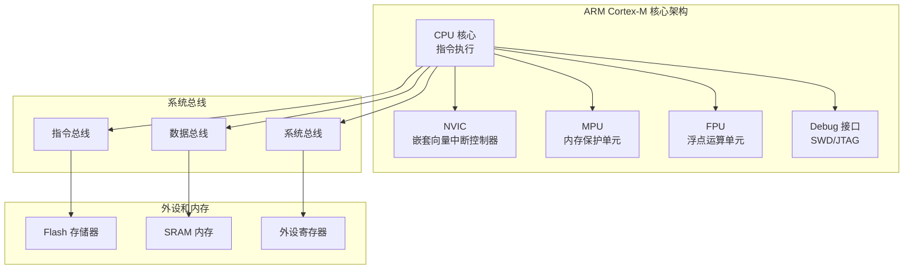
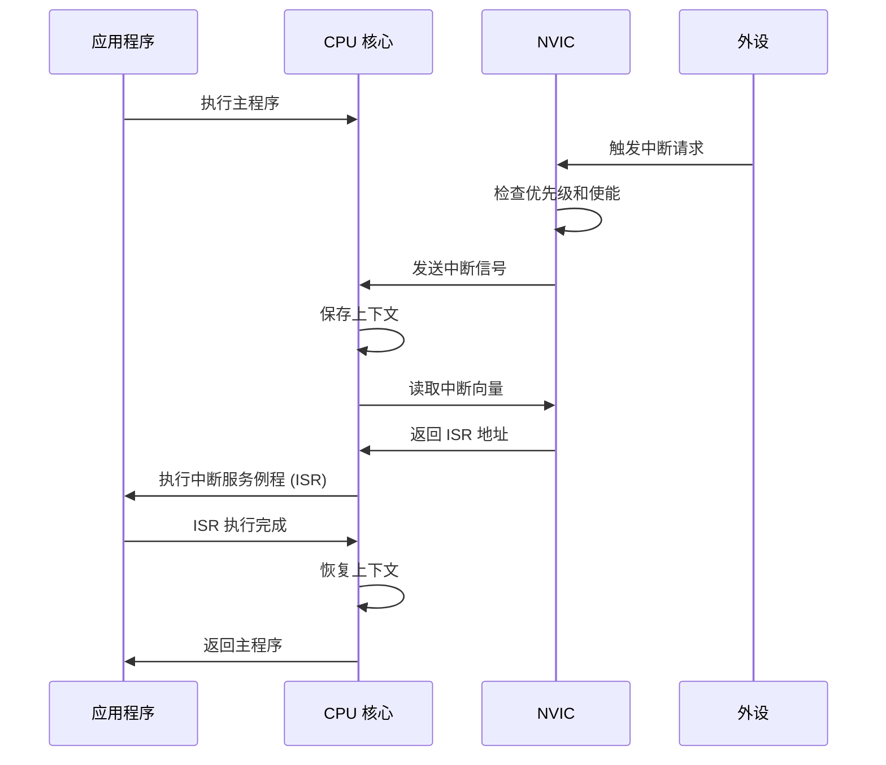
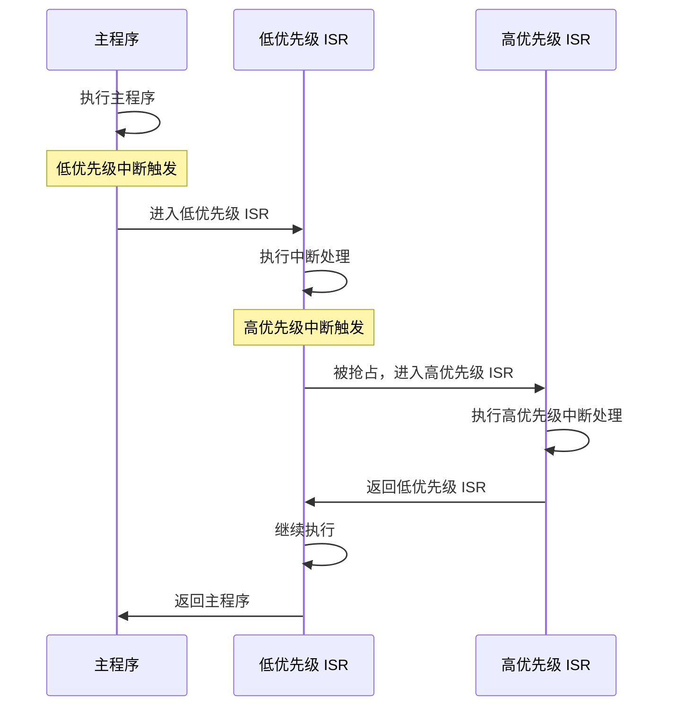

# 嵌入式硬件基础

## 概述

嵌入式系统开发需要对底层硬件有深入的理解。本章节将介绍 ARM Cortex-M 架构的核心概念、内存映射机制、中断处理流程，以及 Zephyr RTOS 支持的常见开发板。掌握这些基础知识将帮助你更好地理解 Zephyr 如何与硬件交互。

!!! info "学习目标"
    - 理解 ARM Cortex-M 架构的核心组件和特性
    - 掌握内存映射和外设寄存器访问方法
    - 理解中断和异常处理机制
    - 了解常见开发板的特性和选择标准
    - 学会使用 Zephyr API 进行硬件操作

## ARM Cortex-M 架构

### 架构概览

ARM Cortex-M 是专为嵌入式应用设计的处理器架构，具有低功耗、高性能和易于使用的特点。它是 Zephyr RTOS 支持的主要架构之一。



### 内存映射

ARM Cortex-M 使用统一的 4GB 地址空间，不同的内存区域有固定的地址范围：

| 地址范围 | 用途 | 大小 | 特性 |
|---------|------|------|------|
| 0x0000_0000 - 0x1FFF_FFFF | Code（代码区） | 512 MB | 存放程序代码和常量 |
| 0x2000_0000 - 0x3FFF_FFFF | SRAM（数据区） | 512 MB | 存放变量和栈 |
| 0x4000_0000 - 0x5FFF_FFFF | 外设区 | 512 MB | 外设寄存器映射 |
| 0x6000_0000 - 0x9FFF_FFFF | 外部 RAM | 1 GB | 外部存储器扩展 |
| 0xE000_0000 - 0xE00F_FFFF | 私有外设总线 | 1 MB | NVIC、SysTick、MPU 等 |

!!! tip "内存映射的重要性"
    理解内存映射对于嵌入式开发至关重要。它决定了：
    
    - 程序代码存放在哪里（通常在 Flash）
    - 变量存放在哪里（通常在 SRAM）
    - 如何访问外设寄存器
    - 如何配置内存保护

### Cortex-M 系列对比

不同的 Cortex-M 系列适用于不同的应用场景：

| 特性 | Cortex-M0/M0+ | Cortex-M3 | Cortex-M4 | Cortex-M7 |
|------|---------------|-----------|-----------|-----------|
| 架构版本 | ARMv6-M | ARMv7-M | ARMv7E-M | ARMv7E-M |
| 流水线 | 2 级 | 3 级 | 3 级 | 6 级超标量 |
| 指令集 | Thumb | Thumb-2 | Thumb-2 | Thumb-2 |
| 硬件除法 | 可选 | 标准 | 标准 | 标准 |
| 浮点运算 | 无 | 无 | 可选 FPU | 可选 FPU + DP |
| DSP 指令 | 无 | 无 | 有 | 有 |
| MPU | 可选 | 可选 | 可选 | 标准 |
| 性能 | 0.9 DMIPS/MHz | 1.25 DMIPS/MHz | 1.25 DMIPS/MHz | 2.14 DMIPS/MHz |
| 典型应用 | 传感器节点 | 工业控制 | 音频处理 | 高性能控制 |

!!! example "选择建议"
    - **Cortex-M0/M0+**: 成本敏感、低功耗应用（如传感器节点、简单控制器）
    - **Cortex-M3**: 通用嵌入式应用（如工业控制、智能家居）
    - **Cortex-M4**: 需要 DSP 和浮点运算的应用（如音频处理、电机控制）
    - **Cortex-M7**: 高性能应用（如图像处理、复杂算法）

## 内存映射和外设寄存器

### 内存映射原理

在嵌入式系统中，外设寄存器被映射到特定的内存地址。通过读写这些地址，CPU 可以控制外设的行为。


```c
// 示例：GPIO 寄存器映射（简化）
#define GPIO_BASE_ADDR    0x40020000
#define GPIO_MODE_OFFSET  0x00
#define GPIO_ODR_OFFSET   0x14

// 方法 1：直接地址访问
#define GPIO_MODE  (*((volatile uint32_t *)(GPIO_BASE_ADDR + GPIO_MODE_OFFSET)))
#define GPIO_ODR   (*((volatile uint32_t *)(GPIO_BASE_ADDR + GPIO_ODR_OFFSET)))

void set_pin_output(void) {
    GPIO_MODE |= (1 << 0);  // 设置 Pin 0 为输出模式
    GPIO_ODR  |= (1 << 0);  // 设置 Pin 0 输出高电平
}
```

### 寄存器访问方法

#### 方法 1：直接地址访问

```c
// 使用宏定义直接访问寄存器
#define REG_ADDR  0x40000000
#define REG       (*((volatile uint32_t *)REG_ADDR))

// 读取寄存器
uint32_t value = REG;

// 写入寄存器
REG = 0x12345678;

// 位操作
REG |= (1 << 5);   // 设置第 5 位
REG &= ~(1 << 5);  // 清除第 5 位
```

#### 方法 2：结构体映射

```c
// 定义寄存器结构体
typedef struct {
    volatile uint32_t MODE;    // 模式寄存器
    volatile uint32_t OTYPE;   // 输出类型寄存器
    volatile uint32_t OSPEED;  // 输出速度寄存器
    volatile uint32_t PUPD;    // 上拉/下拉寄存器
    volatile uint32_t IDR;     // 输入数据寄存器
    volatile uint32_t ODR;     // 输出数据寄存器
    volatile uint32_t BSRR;    // 位设置/复位寄存器
} GPIO_TypeDef;

// 映射到实际地址
#define GPIOA  ((GPIO_TypeDef *)0x40020000)

// 使用结构体访问
void configure_gpio(void) {
    GPIOA->MODE |= (1 << 0);   // 设置模式
    GPIOA->ODR  |= (1 << 0);   // 设置输出
}
```

!!! warning "volatile 关键字的重要性"
    访问硬件寄存器时必须使用 `volatile` 关键字，因为：
    
    - 寄存器的值可能被硬件改变（如中断标志位）
    - 防止编译器优化掉看似"无用"的读写操作
    - 确保每次访问都真实发生

### Zephyr 中的寄存器操作

Zephyr 提供了一套标准的 API 来访问硬件寄存器，无需直接操作地址：

```c
#include <zephyr/device.h>
#include <zephyr/drivers/gpio.h>

// 获取 GPIO 设备
const struct device *gpio_dev = device_get_binding("GPIO_0");

// 配置引脚为输出
gpio_pin_configure(gpio_dev, 0, GPIO_OUTPUT);

// 设置引脚电平
gpio_pin_set(gpio_dev, 0, 1);  // 设置为高电平
gpio_pin_set(gpio_dev, 0, 0);  // 设置为低电平

// 读取引脚状态
int value = gpio_pin_get(gpio_dev, 0);
```

!!! tip "Zephyr 抽象层的优势"
    使用 Zephyr API 而不是直接操作寄存器的好处：
    
    - **可移植性**: 代码可以在不同的硬件平台上运行
    - **安全性**: API 提供了错误检查和资源管理
    - **易用性**: 不需要查阅芯片手册中的寄存器定义
    - **维护性**: 硬件变更时只需更新驱动，应用代码无需修改


## 中断和异常处理

### 中断系统概述

中断是嵌入式系统中处理异步事件的核心机制。ARM Cortex-M 使用 NVIC（嵌套向量中断控制器）来管理中断。



### 中断优先级配置

ARM Cortex-M 支持可编程的中断优先级，数值越小优先级越高。

```c
// 中断优先级示例（裸机代码）
#define NVIC_PRIORITY_BITS  4  // 4 位优先级（0-15）

// 设置中断优先级
void set_interrupt_priority(IRQn_Type IRQn, uint32_t priority) {
    NVIC_SetPriority(IRQn, priority);
}

// 使能中断
void enable_interrupt(IRQn_Type IRQn) {
    NVIC_EnableIRQ(IRQn);
}
```

### Zephyr 中的中断处理

Zephyr 提供了统一的中断注册和管理 API：

```c
#include <zephyr/irq.h>

// 中断服务例程
void my_isr(const void *arg) {
    // 处理中断
    // 注意：ISR 中应该尽快完成，避免长时间阻塞
    
    // 清除中断标志（具体方法取决于外设）
    // ...
}

// 注册中断
void setup_interrupt(void) {
    // IRQ_CONNECT(irq, priority, isr, parameter, flags)
    IRQ_CONNECT(TIMER0_IRQn, 2, my_isr, NULL, 0);
    
    // 使能中断
    irq_enable(TIMER0_IRQn);
}
```

!!! example "完整的 GPIO 中断示例"
    ```c
    #include <zephyr/kernel.h>
    #include <zephyr/drivers/gpio.h>
    
    #define BUTTON_NODE DT_ALIAS(sw0)
    static const struct gpio_dt_spec button = GPIO_DT_SPEC_GET(BUTTON_NODE, gpios);
    static struct gpio_callback button_cb_data;
    
    // 中断回调函数
    void button_pressed(const struct device *dev, 
                       struct gpio_callback *cb, 
                       uint32_t pins) {
        printk("Button pressed! Pins: 0x%x\n", pins);
    }
    
    int main(void) {
        // 配置按钮引脚为输入
        gpio_pin_configure_dt(&button, GPIO_INPUT);
        
        // 配置中断
        gpio_pin_interrupt_configure_dt(&button, GPIO_INT_EDGE_TO_ACTIVE);
        
        // 初始化回调
        gpio_init_callback(&button_cb_data, button_pressed, BIT(button.pin));
        
        // 添加回调
        gpio_add_callback(button.port, &button_cb_data);
        
        while (1) {
            k_sleep(K_FOREVER);
        }
        
        return 0;
    }
    ```

### NVIC 配置和管理

NVIC 是 ARM Cortex-M 的核心组件，负责中断的优先级管理和嵌套控制。


**NVIC 关键特性**:

- **可编程优先级**: 支持 8 到 256 个优先级级别（取决于实现）
- **中断嵌套**: 高优先级中断可以抢占低优先级中断
- **中断屏蔽**: 可以通过优先级阈值屏蔽低优先级中断
- **尾链优化**: 连续中断时减少上下文切换开销

```c
// NVIC 配置示例
void configure_nvic(void) {
    // 设置优先级分组（抢占优先级和子优先级的位数分配）
    // NVIC_SetPriorityGrouping(3);  // 4 位抢占，0 位子优先级
    
    // 设置中断优先级
    NVIC_SetPriority(UART0_IRQn, 2);  // 优先级 2
    NVIC_SetPriority(TIMER0_IRQn, 3); // 优先级 3（较低）
    
    // 使能中断
    NVIC_EnableIRQ(UART0_IRQn);
    NVIC_EnableIRQ(TIMER0_IRQn);
}
```

### 中断嵌套和优先级抢占

中断嵌套允许高优先级中断打断正在执行的低优先级中断：



!!! warning "中断嵌套的注意事项"
    - **栈空间**: 嵌套中断会增加栈的使用，需要预留足够的栈空间
    - **临界区保护**: 共享资源需要使用互斥机制保护
    - **中断延迟**: 过多的嵌套会增加最低优先级中断的响应延迟
    - **死锁风险**: 不当的优先级配置可能导致死锁

### 中断处理最佳实践

!!! tip "ISR 编写原则"
    1. **快速执行**: ISR 应该尽快完成，避免长时间阻塞
    2. **最小化工作**: 只做必要的硬件操作，复杂处理交给线程
    3. **避免阻塞**: 不要在 ISR 中调用可能阻塞的函数
    4. **使用工作队列**: 将耗时操作提交到工作队列中处理
    5. **清除标志**: 及时清除中断标志，避免重复触发

```c
// 推荐的中断处理模式
#include <zephyr/kernel.h>

K_WORK_DEFINE(my_work, work_handler);

void my_isr(const void *arg) {
    // 1. 读取必要的硬件状态
    uint32_t status = read_hardware_status();
    
    // 2. 清除中断标志
    clear_interrupt_flag();
    
    // 3. 提交工作到工作队列（非阻塞）
    k_work_submit(&my_work);
}

void work_handler(struct k_work *work) {
    // 在线程上下文中处理复杂逻辑
    // 可以使用阻塞操作、分配内存等
    process_data();
}
```

## 常见开发板介绍

Zephyr RTOS 支持众多开发板，以下是几款常见且推荐的开发板：

### Nordic nRF52840 DK

**核心特性**:

- **MCU**: nRF52840（Cortex-M4F @ 64 MHz）
- **内存**: 1 MB Flash, 256 KB RAM
- **无线**: BLE 5.0, Thread, Zigbee, 802.15.4
- **外设**: USB, NFC, QSPI, I2S, PDM


**适用场景**:

- 低功耗物联网设备
- 智能家居（Thread、Zigbee）
- 可穿戴设备（BLE）
- 无线传感器网络

**Zephyr 支持**:

```bash
# 编译示例
west build -b nrf52840dk_nrf52840 samples/hello_world

# 烧录
west flash
```

!!! success "推荐理由"
    - 完善的 Zephyr 支持和丰富的示例
    - 强大的无线协议栈（BLE、Thread、Zigbee）
    - 低功耗特性优秀
    - 板载调试器（J-Link）

### STM32 Nucleo 系列

**核心特性**:

- **MCU**: STM32F4/F7/H7 系列（Cortex-M4/M7）
- **内存**: 512 KB - 2 MB Flash, 128 KB - 1 MB RAM
- **外设**: 丰富的通信接口（UART、SPI、I2C、CAN、USB）
- **扩展**: Arduino 兼容接口

**适用场景**:

- 工业控制系统
- 电机控制
- 数据采集
- 通用嵌入式应用

**Zephyr 支持**:

```bash
# 编译示例（以 STM32F4 Nucleo 为例）
west build -b nucleo_f429zi samples/hello_world

# 烧录（通过板载 ST-Link）
west flash
```

!!! success "推荐理由"
    - 价格实惠，性价比高
    - 外设丰富，适合学习和原型开发
    - 板载调试器（ST-Link）
    - 广泛的社区支持

### ESP32 系列

**核心特性**:

- **MCU**: Xtensa LX6/LX7 双核 @ 240 MHz
- **内存**: 4 MB Flash, 520 KB SRAM
- **无线**: Wi-Fi 802.11 b/g/n, BLE 5.0
- **外设**: GPIO, SPI, I2C, UART, ADC, DAC, PWM

**适用场景**:

- Wi-Fi 物联网设备
- 智能家居网关
- 数据采集和云端通信
- 低成本无线方案

**Zephyr 支持**:

```bash
# 编译示例
west build -b esp32 samples/hello_world

# 烧录
west flash
```

!!! success "推荐理由"
    - 内置 Wi-Fi 和 BLE，无需外部模块
    - 价格极低，适合批量应用
    - 强大的处理能力
    - 活跃的社区和丰富的资源

### 开发板对比表

| 特性 | nRF52840 DK | STM32 Nucleo | ESP32 |
|------|-------------|--------------|-------|
| 架构 | ARM Cortex-M4F | ARM Cortex-M4/M7 | Xtensa LX6/LX7 |
| 主频 | 64 MHz | 180-480 MHz | 240 MHz |
| Flash | 1 MB | 512 KB - 2 MB | 4 MB |
| RAM | 256 KB | 128 KB - 1 MB | 520 KB |
| 无线 | BLE, Thread, Zigbee | 无（需外接） | Wi-Fi, BLE |
| 功耗 | 极低 | 中等 | 中等 |
| 价格 | $$$ | $$ | $ |
| 调试器 | J-Link（板载） | ST-Link（板载） | USB-UART |
| 适用场景 | 低功耗无线 | 工业控制 | Wi-Fi 物联网 |
| Zephyr 支持 | ⭐⭐⭐⭐⭐ | ⭐⭐⭐⭐⭐ | ⭐⭐⭐⭐ |

## 实践建议

### 如何选择开发板

选择开发板时，应考虑以下因素：


**1. 应用需求**

- **无线通信**: 需要 BLE → nRF52840；需要 Wi-Fi → ESP32
- **高性能计算**: 需要 DSP 或浮点运算 → STM32F4/F7 或 Cortex-M7
- **低功耗**: 电池供电设备 → nRF52840 或 Cortex-M0+
- **工业应用**: 需要 CAN、多串口 → STM32 系列

**2. 学习目标**

- **入门学习**: STM32 Nucleo（外设丰富，资料多）
- **无线开发**: nRF52840 DK（完整的协议栈支持）
- **物联网项目**: ESP32（Wi-Fi + 低成本）

**3. 预算考虑**

- **低预算**: ESP32（$5-10）
- **中等预算**: STM32 Nucleo（$15-25）
- **专业开发**: nRF52840 DK（$40-50）

**4. Zephyr 支持程度**

优先选择 Zephyr 官方支持良好的开发板，可以通过以下命令查看支持的板子：

```bash
# 列出所有支持的开发板
west boards

# 搜索特定厂商的板子
west boards | grep nrf
west boards | grep stm32
west boards | grep esp32
```

### 硬件调试技巧

**1. 使用串口调试**

串口是最基本也是最常用的调试方法：

```c
#include <zephyr/kernel.h>
#include <zephyr/sys/printk.h>

int main(void) {
    printk("System started\n");
    printk("CPU: %s\n", CONFIG_BOARD);
    printk("Frequency: %d Hz\n", CONFIG_SYS_CLOCK_HW_CYCLES_PER_SEC);
    
    while (1) {
        printk("Heartbeat\n");
        k_sleep(K_SECONDS(1));
    }
    
    return 0;
}
```

**2. 使用 LED 指示状态**

LED 是快速验证程序运行的好方法：

```c
#include <zephyr/drivers/gpio.h>

#define LED0_NODE DT_ALIAS(led0)
static const struct gpio_dt_spec led = GPIO_DT_SPEC_GET(LED0_NODE, gpios);

void blink_led(void) {
    gpio_pin_configure_dt(&led, GPIO_OUTPUT_ACTIVE);
    
    while (1) {
        gpio_pin_toggle_dt(&led);
        k_sleep(K_MSEC(500));
    }
}
```

**3. 使用 JTAG/SWD 调试器**

对于复杂问题，使用硬件调试器可以：

- 设置断点，单步执行
- 查看变量和寄存器值
- 分析程序崩溃原因
- 实时跟踪程序执行

```bash
# 使用 west 启动调试会话
west debug

# 在 GDB 中设置断点
(gdb) break main
(gdb) continue
(gdb) print variable_name
(gdb) backtrace
```

**4. 使用逻辑分析仪**

对于时序问题和通信协议调试，逻辑分析仪非常有用：

- 分析 I2C、SPI、UART 通信
- 测量信号时序
- 捕获间歇性问题

**5. 使用示波器**

示波器用于分析模拟信号和电气特性：

- 测量信号电平和波形
- 分析 PWM 占空比
- 检查信号完整性

!!! tip "调试工具推荐"
    - **入门**: 串口 + LED（成本低，简单有效）
    - **进阶**: J-Link/ST-Link 调试器（硬件断点，实时调试）
    - **专业**: 逻辑分析仪 + 示波器（完整的信号分析）

### 常见硬件问题排查

**问题 1: 串口无输出**

可能原因和解决方案：

- 检查串口配置（波特率、数据位、停止位）
- 确认 TX/RX 引脚连接正确
- 检查串口工具设置
- 验证设备树中的串口配置

**问题 2: 程序无法烧录**

可能原因和解决方案：

- 检查调试器连接（USB 线、JTAG/SWD 接口）
- 确认开发板供电正常
- 尝试擦除 Flash 后重新烧录
- 检查 west flash 的 runner 配置

**问题 3: 外设不工作**

可能原因和解决方案：

- 检查设备树配置（引脚、时钟、中断）
- 确认外设驱动已启用（Kconfig）
- 验证硬件连接（使用万用表测量）
- 查看外设寄存器状态（使用调试器）

**问题 4: 系统频繁复位**

可能原因和解决方案：

- 检查栈大小配置（可能栈溢出）
- 验证电源供电稳定性
- 检查看门狗配置
- 分析崩溃日志（使用 GDB backtrace）

## 学习总结

完成本章节后，你应该掌握：

✅ ARM Cortex-M 架构的核心组件和特性  
✅ 内存映射的概念和寄存器访问方法  
✅ 中断和异常处理的机制和最佳实践  
✅ 常见开发板的特性和选择标准  
✅ 基本的硬件调试技巧

## 下一步

现在你已经了解了嵌入式硬件的基础知识，接下来可以：

- 学习 [RTOS 基础概念](rtos-concepts.md)，理解实时操作系统的核心机制
- 学习 [基础工具能力](tools.md)，掌握开发和调试工具的使用
- 进入 [第一阶段：入门筑基期](../stage1-foundation/index.md)，开始 Zephyr RTOS 的实战学习

## 参考资源

- [ARM Cortex-M 系列技术参考手册](https://developer.arm.com/documentation/)
- [Zephyr 硬件支持列表](https://docs.zephyrproject.org/latest/boards/index.html)
- [Nordic nRF52840 产品规格书](https://www.nordicsemi.com/Products/nRF52840)
- [STM32 Nucleo 用户手册](https://www.st.com/en/evaluation-tools/stm32-nucleo-boards.html)
- [ESP32 技术文档](https://www.espressif.com/en/products/socs/esp32)
