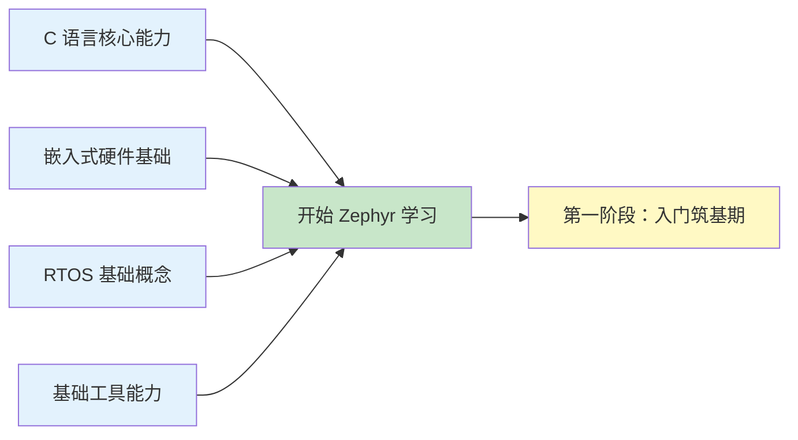

# 前置必备知识

!!! info "学习目标"
    在开始学习 Zephyr RTOS 之前，您需要掌握以下核心能力，这些基础知识将帮助您更顺利地理解和使用 Zephyr：
    
    - **C 语言核心能力**：熟练掌握指针、结构体、位操作等嵌入式 C 编程特性
    - **嵌入式硬件基础**：理解 ARM Cortex-M 架构、内存映射、中断机制等硬件概念
    - **RTOS 基础概念**：了解任务调度、同步机制、通信机制等实时操作系统核心概念
    - **基础工具能力**：掌握 Git、命令行工具、调试工具等开发必备技能

## 学习内容概览

| 主题 | 核心内容 | 预计时间 |
|------|----------|----------|
| [C 语言核心能力](c-language.md) | 指针、结构体、位操作、嵌入式 C 特性 | 2-3 天 |
| [嵌入式硬件基础](embedded-basics.md) | ARM Cortex-M 架构、内存映射、中断处理 | 2-3 天 |
| [RTOS 基础概念](rtos-concepts.md) | 任务调度、同步机制、通信机制 | 2-3 天 |
| [基础工具能力](tools.md) | Git、命令行、调试工具 | 1-2 天 |

**总计预计时间：1-2 周**

## 自我评估清单

在开始学习 Zephyr 之前，请确认您已经掌握以下能力：

- [ ] 能够熟练使用指针进行内存操作和函数回调
- [ ] 理解结构体和位域在硬件寄存器操作中的应用
- [ ] 了解 ARM Cortex-M 的基本架构和中断机制
- [ ] 理解 RTOS 的任务调度和优先级概念
- [ ] 能够使用 Git 进行版本控制
- [ ] 熟悉 Linux/Windows 命令行基本操作
- [ ] 了解 GDB 或其他调试工具的基本使用

!!! tip "学习建议"
    如果您对某些知识点还不够熟悉，建议先学习对应的章节内容。这些前置知识将帮助您：
    
    - **更快理解** Zephyr 的 API 设计和使用方式
    - **更容易调试** 开发过程中遇到的问题
    - **更深入掌握** Zephyr 的内核机制和驱动开发
    - **更高效开发** 实际的嵌入式应用项目

## 学习路径

## 为什么需要这些前置知识？

### C 语言是 Zephyr 的基础

Zephyr RTOS 完全使用 C 语言开发，其 API 设计大量使用了指针、结构体、函数指针等 C 语言特性。掌握这些知识将帮助您：

- 理解 Zephyr 的设备驱动模型
- 使用 Zephyr 的内核 API 进行多线程编程
- 编写高效的嵌入式应用代码

### 硬件知识帮助您理解底层机制

Zephyr 是一个面向资源受限设备的 RTOS，深入理解硬件架构将帮助您：

- 理解设备树（Device Tree）的配置方式
- 优化系统性能和功耗
- 进行 BSP 移植和驱动开发

### RTOS 概念是多任务编程的基础

Zephyr 提供了完整的 RTOS 功能，理解这些概念将帮助您：

- 设计合理的多任务应用架构
- 正确使用同步和通信机制
- 避免常见的并发编程问题

### 工具能力提升开发效率

熟练使用开发工具将帮助您：

- 快速定位和解决问题
- 高效管理代码版本
- 参与开源社区协作

## 下一步

完成前置知识的学习后，您就可以开始 Zephyr RTOS 的正式学习之旅了！

    <a href="../stage1-foundation/" class="md-button md-button--primary">
        开始第一阶段：入门筑基期 →
    </a>

---

!!! question "需要帮助？"
    如果您在学习前置知识的过程中遇到问题，可以：
    
    - 查阅各章节提供的参考资料
    - 在 [GitHub Discussions](https://github.com/your-repo/discussions) 提问
    - 加入 Zephyr 中文社区交流群
