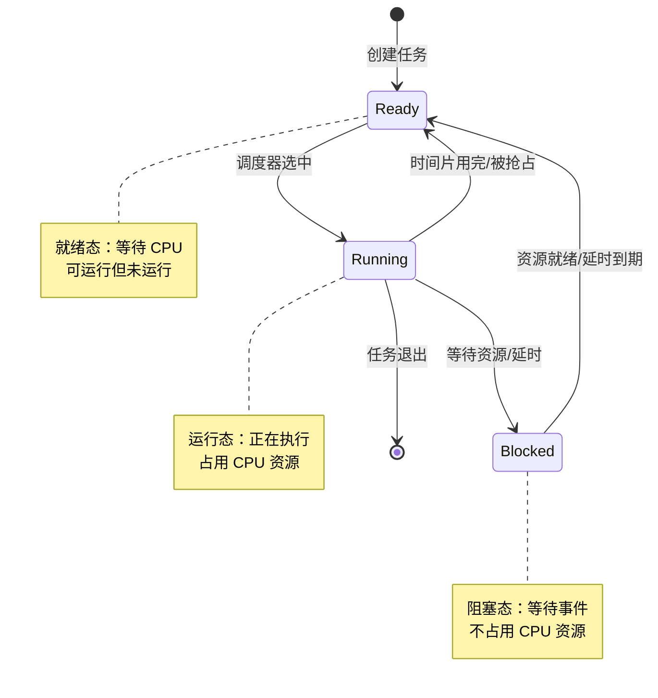
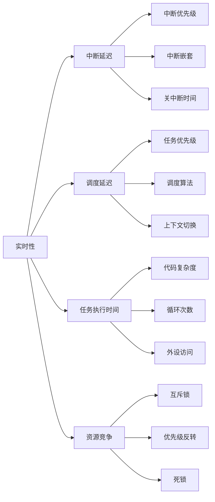

# RTOS 基础概念

## RTOS 概述

!!! info "什么是 RTOS？"
    **实时操作系统（Real-Time Operating System，RTOS）** 是一种专门为实时应用设计的操作系统，能够在严格的时间约束下处理事件和任务。与通用操作系统（如 Windows、Linux）不同，RTOS 强调**确定性**和**可预测性**，确保关键任务能够在规定的时间内完成。

### 为什么需要 RTOS？

在嵌入式系统开发中，我们可以选择裸机开发（Bare-Metal）或使用 RTOS。让我们对比一下两种方式：

| 特性 | 裸机开发 | RTOS 开发 |
|------|---------|-----------|
| **复杂度** | 简单，适合小型项目 | 复杂，适合中大型项目 |
| **任务管理** | 手动管理，使用状态机或轮询 | 自动调度，多任务并发 |
| **实时性** | 难以保证，依赖开发者经验 | 确定性调度，可预测响应时间 |
| **代码组织** | 容易混乱，难以维护 | 模块化，职责清晰 |
| **资源开销** | 最小，无额外开销 | 有内核开销（RAM、ROM、CPU） |
| **开发效率** | 初期快，后期慢 | 初期慢，后期快 |
| **可扩展性** | 差，添加功能困难 | 好，易于添加新任务 |

**RTOS 的优势**：

- **多任务并发**：同时处理多个任务，提高系统响应能力
- **确定性调度**：保证高优先级任务及时响应
- **模块化设计**：任务之间职责清晰，易于维护和扩展
- **丰富的同步机制**：互斥锁、信号量、消息队列等
- **成熟的生态**：大量的驱动、协议栈和中间件

**何时使用 RTOS**：

- 系统需要同时处理多个独立的功能模块
- 对实时性有严格要求（如电机控制、通信协议）
- 项目规模较大，需要多人协作开发
- 需要使用成熟的协议栈和中间件（如网络、文件系统）


## RTOS 核心概念

### 任务/线程

在 RTOS 中，**任务（Task）** 或 **线程（Thread）** 是调度的基本单位。每个任务代表一个独立的执行流程，拥有自己的栈空间和上下文。

#### 任务状态机

任务在运行过程中会在不同状态之间转换：



**状态说明**：

- **Ready（就绪态）**：任务已准备好运行，等待调度器分配 CPU
- **Running（运行态）**：任务正在 CPU 上执行
- **Blocked（阻塞态）**：任务等待某个事件（如信号量、延时），不参与调度

#### Zephyr 任务创建示例

在 Zephyr 中，创建任务非常简单：

```c
#include <zephyr/kernel.h>

// 定义任务栈大小
#define TASK_STACK_SIZE 1024
// 定义任务优先级（数字越小优先级越高）
#define TASK_PRIORITY 5

// 任务函数
void my_task(void *arg1, void *arg2, void *arg3)
{
    while (1) {
        printk("Task is running\n");
        k_sleep(K_MSEC(1000));  // 休眠 1 秒
    }
}

// 静态定义任务（推荐方式）
K_THREAD_DEFINE(my_task_id,           // 任务 ID
                TASK_STACK_SIZE,       // 栈大小
                my_task,               // 任务函数
                NULL, NULL, NULL,      // 参数
                TASK_PRIORITY,         // 优先级
                0,                     // 选项
                0);                    // 延迟启动时间

// 或者动态创建任务
void create_task_dynamically(void)
{
    static struct k_thread my_thread;
    static K_THREAD_STACK_DEFINE(my_stack, TASK_STACK_SIZE);
    
    k_thread_create(&my_thread, my_stack,
                    K_THREAD_STACK_SIZEOF(my_stack),
                    my_task,
                    NULL, NULL, NULL,
                    TASK_PRIORITY, 0, K_NO_WAIT);
}
```


### 调度器

**调度器（Scheduler）** 是 RTOS 的核心组件，负责决定哪个任务应该运行。

#### 调度策略

| 调度策略 | 描述 | 优点 | 缺点 | 适用场景 |
|---------|------|------|------|---------|
| **抢占式调度** | 高优先级任务可以打断低优先级任务 | 实时性好，响应快 | 可能导致低优先级任务饥饿 | 实时系统，有明确优先级需求 |
| **时间片轮转** | 相同优先级任务轮流执行，每个任务执行固定时间片 | 公平，避免饥饿 | 实时性较差 | 通用任务，无严格实时要求 |
| **协作式调度** | 任务主动让出 CPU，不会被抢占 | 简单，无竞争条件 | 实时性差，依赖任务配合 | 简单系统，任务可信 |

!!! tip "Zephyr 优先级规则"
    在 Zephyr 中：
    
    - **优先级范围**：-16 到 15（可配置）
    - **数字越小，优先级越高**：-16 是最高优先级，15 是最低优先级
    - **抢占式优先级**：0 到 15，高优先级任务可以抢占低优先级任务
    - **协作式优先级**：负数（-1 到 -16），相同优先级任务不会相互抢占
    - **默认调度**：抢占式 + 时间片轮转（相同优先级任务）
    
    ```c
    // 高优先级任务（抢占式）
    K_THREAD_DEFINE(high_prio_task, 1024, task_func, 
                    NULL, NULL, NULL, 5, 0, 0);
    
    // 协作式任务（不会被相同优先级任务抢占）
    K_THREAD_DEFINE(coop_task, 1024, task_func, 
                    NULL, NULL, NULL, -5, 0, 0);
    ```

#### 调度时机

调度器在以下情况下会重新选择任务：

1. **任务主动让出 CPU**：调用 `k_yield()`、`k_sleep()` 等
2. **任务被阻塞**：等待信号量、互斥锁、消息队列等
3. **高优先级任务就绪**：中断唤醒高优先级任务
4. **时间片用完**：相同优先级任务轮转
5. **任务退出**：任务函数返回


## 同步机制

多任务并发执行时，需要同步机制来协调任务之间的执行顺序和资源访问。

### 互斥锁（Mutex）

**互斥锁** 用于保护共享资源，确保同一时间只有一个任务可以访问。

```c
#include <zephyr/kernel.h>

// 定义互斥锁
K_MUTEX_DEFINE(my_mutex);

// 共享资源
static int shared_counter = 0;

void task_a(void)
{
    while (1) {
        // 获取互斥锁
        k_mutex_lock(&my_mutex, K_FOREVER);
        
        // 访问共享资源（临界区）
        shared_counter++;
        printk("Task A: counter = %d\n", shared_counter);
        
        // 释放互斥锁
        k_mutex_unlock(&my_mutex);
        
        k_sleep(K_MSEC(100));
    }
}

void task_b(void)
{
    while (1) {
        k_mutex_lock(&my_mutex, K_FOREVER);
        
        shared_counter++;
        printk("Task B: counter = %d\n", shared_counter);
        
        k_mutex_unlock(&my_mutex);
        
        k_sleep(K_MSEC(100));
    }
}
```

**互斥锁特性**：

- **所有权**：只有获取锁的任务才能释放锁
- **优先级继承**：防止优先级反转问题
- **递归锁**：同一任务可以多次获取（需配置）

!!! warning "死锁风险"
    使用互斥锁时要注意避免死锁：
    
    - **按顺序获取锁**：多个锁时，所有任务按相同顺序获取
    - **设置超时**：使用 `K_MSEC(timeout)` 而不是 `K_FOREVER`
    - **尽快释放锁**：临界区代码尽量简短
    - **避免嵌套锁**：减少锁的嵌套层次


### 信号量（Semaphore）

**信号量** 用于任务同步和资源计数，支持多个任务等待和释放。

#### 生产者-消费者示例

```c
#include <zephyr/kernel.h>

// 定义信号量（初始值为 0）
K_SEM_DEFINE(data_sem, 0, 10);  // 最多 10 个资源

// 数据缓冲区
#define BUFFER_SIZE 10
static int buffer[BUFFER_SIZE];
static int write_index = 0;
static int read_index = 0;

// 生产者任务
void producer_task(void)
{
    int data = 0;
    
    while (1) {
        // 生产数据
        data++;
        buffer[write_index] = data;
        write_index = (write_index + 1) % BUFFER_SIZE;
        
        printk("Produced: %d\n", data);
        
        // 释放信号量，通知消费者
        k_sem_give(&data_sem);
        
        k_sleep(K_MSEC(500));
    }
}

// 消费者任务
void consumer_task(void)
{
    int data;
    
    while (1) {
        // 等待信号量（有数据可消费）
        k_sem_take(&data_sem, K_FOREVER);
        
        // 消费数据
        data = buffer[read_index];
        read_index = (read_index + 1) % BUFFER_SIZE;
        
        printk("Consumed: %d\n", data);
        
        k_sleep(K_MSEC(1000));
    }
}
```

**信号量类型**：

- **二值信号量**：只有 0 和 1 两个值，类似互斥锁但无所有权
- **计数信号量**：可以有多个资源，用于资源池管理

### 事件（Events）

**事件** 用于任务之间的事件通知，支持多个事件的组合等待。

```c
#include <zephyr/kernel.h>

// 定义事件
K_EVENT_DEFINE(my_events);

// 事件标志位
#define EVENT_BUTTON_PRESSED  BIT(0)
#define EVENT_DATA_READY      BIT(1)
#define EVENT_TIMEOUT         BIT(2)

// 事件发送任务
void event_sender(void)
{
    k_sleep(K_MSEC(1000));
    k_event_post(&my_events, EVENT_BUTTON_PRESSED);
    
    k_sleep(K_MSEC(1000));
    k_event_post(&my_events, EVENT_DATA_READY);
}

// 事件等待任务
void event_waiter(void)
{
    uint32_t events;
    
    // 等待任意一个事件
    events = k_event_wait(&my_events, 
                          EVENT_BUTTON_PRESSED | EVENT_DATA_READY,
                          false,  // 不清除事件
                          K_FOREVER);
    
    if (events & EVENT_BUTTON_PRESSED) {
        printk("Button pressed!\n");
    }
    
    if (events & EVENT_DATA_READY) {
        printk("Data ready!\n");
    }
    
    // 等待所有事件
    events = k_event_wait_all(&my_events,
                              EVENT_BUTTON_PRESSED | EVENT_DATA_READY,
                              true,  // 清除事件
                              K_FOREVER);
}
```


## 通信机制

任务之间需要交换数据时，可以使用 RTOS 提供的通信机制。

### 消息队列（Message Queue）

**消息队列** 用于在任务之间传递固定大小的消息。

```c
#include <zephyr/kernel.h>

// 定义消息结构
struct data_msg {
    uint32_t timestamp;
    int16_t temperature;
    int16_t humidity;
};

// 定义消息队列（最多 10 条消息）
K_MSGQ_DEFINE(my_msgq, sizeof(struct data_msg), 10, 4);

// 发送任务
void sender_task(void)
{
    struct data_msg msg;
    
    while (1) {
        // 准备消息
        msg.timestamp = k_uptime_get_32();
        msg.temperature = 25;
        msg.humidity = 60;
        
        // 发送消息（如果队列满则等待）
        if (k_msgq_put(&my_msgq, &msg, K_FOREVER) == 0) {
            printk("Message sent\n");
        }
        
        k_sleep(K_MSEC(1000));
    }
}

// 接收任务
void receiver_task(void)
{
    struct data_msg msg;
    
    while (1) {
        // 接收消息（如果队列空则等待）
        if (k_msgq_get(&my_msgq, &msg, K_FOREVER) == 0) {
            printk("Received: temp=%d, hum=%d, time=%u\n",
                   msg.temperature, msg.humidity, msg.timestamp);
        }
    }
}
```

### 管道（Pipe）

**管道** 用于传递可变长度的字节流数据。

```c
#include <zephyr/kernel.h>

// 定义管道（缓冲区大小 1024 字节）
K_PIPE_DEFINE(my_pipe, 1024, 4);

// 写入数据
void pipe_writer(void)
{
    char data[] = "Hello from pipe!";
    size_t bytes_written;
    
    k_pipe_put(&my_pipe, data, sizeof(data), 
               &bytes_written, sizeof(data), K_NO_WAIT);
}

// 读取数据
void pipe_reader(void)
{
    char buffer[64];
    size_t bytes_read;
    
    k_pipe_get(&my_pipe, buffer, sizeof(buffer),
               &bytes_read, 1, K_FOREVER);
    
    printk("Read %zu bytes: %s\n", bytes_read, buffer);
}
```

### FIFO 和 LIFO

**FIFO（先进先出）** 和 **LIFO（后进先出）** 用于传递动态分配的数据项。

```c
#include <zephyr/kernel.h>

// 定义 FIFO
K_FIFO_DEFINE(my_fifo);

// 数据项结构（必须包含保留字段）
struct data_item {
    void *fifo_reserved;  // 必须是第一个字段
    int value;
};

// 发送数据
void fifo_sender(void)
{
    struct data_item *item = k_malloc(sizeof(struct data_item));
    item->value = 42;
    
    k_fifo_put(&my_fifo, item);
}

// 接收数据
void fifo_receiver(void)
{
    struct data_item *item;
    
    item = k_fifo_get(&my_fifo, K_FOREVER);
    printk("Received: %d\n", item->value);
    
    k_free(item);  // 记得释放内存
}
```

### 共享内存

**共享内存** 是最简单的通信方式，但需要配合同步机制使用。

```c
// 共享数据结构
struct shared_data {
    int sensor_value;
    bool data_ready;
};

static struct shared_data shared;
static K_MUTEX_DEFINE(shared_mutex);

// 写入共享数据
void writer_task(void)
{
    k_mutex_lock(&shared_mutex, K_FOREVER);
    shared.sensor_value = read_sensor();
    shared.data_ready = true;
    k_mutex_unlock(&shared_mutex);
}

// 读取共享数据
void reader_task(void)
{
    int value;
    
    k_mutex_lock(&shared_mutex, K_FOREVER);
    if (shared.data_ready) {
        value = shared.sensor_value;
        shared.data_ready = false;
    }
    k_mutex_unlock(&shared_mutex);
}
```


## Zephyr vs 其他 RTOS

了解不同 RTOS 的特点，有助于选择合适的平台。

### 功能对比

| 特性 | Zephyr | FreeRTOS | RT-Thread |
|------|--------|----------|-----------|
| **许可证** | Apache 2.0 | MIT | Apache 2.0 |
| **托管组织** | Linux Foundation | Amazon | RT-Thread 社区 |
| **内核类型** | 微内核 | 微内核 | 微内核 |
| **支持架构** | ARM, x86, RISC-V, ARC, Xtensa 等 | ARM, x86, RISC-V 等 | ARM, RISC-V, MIPS 等 |
| **设备树支持** | ✅ 完整支持 | ❌ 不支持 | ❌ 不支持 |
| **Kconfig 配置** | ✅ 完整支持 | ❌ 不支持 | ✅ 支持 |
| **网络协议栈** | 内置（TCP/IP, BLE, Thread, Zigbee） | 需要第三方（lwIP） | 内置（lwIP） |
| **文件系统** | 内置（FAT, LittleFS, NVS） | 需要第三方 | 内置（多种） |
| **Shell 控制台** | ✅ 内置 | ❌ 需要自己实现 | ✅ 内置 |
| **设备驱动模型** | 统一的设备模型 | 无统一模型 | 统一的设备模型 |
| **学习曲线** | 陡峭（功能丰富） | 平缓（简单易学） | 中等 |
| **社区活跃度** | 非常活跃 | 非常活跃 | 活跃 |
| **中文资料** | 较少 | 丰富 | 非常丰富 |
| **商业支持** | 多家公司 | Amazon | RT-Thread 公司 |

### API 对比：创建任务

=== "Zephyr"

    ```c
    #include <zephyr/kernel.h>
    
    #define STACK_SIZE 1024
    #define PRIORITY 5
    
    void my_task(void *arg1, void *arg2, void *arg3)
    {
        while (1) {
            printk("Zephyr task running\n");
            k_sleep(K_MSEC(1000));
        }
    }
    
    // 静态定义任务
    K_THREAD_DEFINE(my_task_id, STACK_SIZE, my_task,
                    NULL, NULL, NULL, PRIORITY, 0, 0);
    ```

=== "FreeRTOS"

    ```c
    #include "FreeRTOS.h"
    #include "task.h"
    
    #define STACK_SIZE 256  // 单位：字（word）
    #define PRIORITY 2
    
    void my_task(void *pvParameters)
    {
        while (1) {
            printf("FreeRTOS task running\n");
            vTaskDelay(pdMS_TO_TICKS(1000));
        }
    }
    
    void create_task(void)
    {
        TaskHandle_t task_handle;
        
        xTaskCreate(my_task,           // 任务函数
                    "MyTask",          // 任务名称
                    STACK_SIZE,        // 栈大小
                    NULL,              // 参数
                    PRIORITY,          // 优先级
                    &task_handle);     // 任务句柄
    }
    ```

=== "RT-Thread"

    ```c
    #include <rtthread.h>
    
    #define STACK_SIZE 1024
    #define PRIORITY 10
    
    void my_task(void *parameter)
    {
        while (1) {
            rt_kprintf("RT-Thread task running\n");
            rt_thread_mdelay(1000);
        }
    }
    
    void create_task(void)
    {
        rt_thread_t thread;
        
        thread = rt_thread_create("my_task",    // 任务名称
                                  my_task,       // 任务函数
                                  NULL,          // 参数
                                  STACK_SIZE,    // 栈大小
                                  PRIORITY,      // 优先级
                                  20);           // 时间片
        
        if (thread != NULL) {
            rt_thread_startup(thread);
        }
    }
    ```


### 选择建议

**选择 Zephyr 的理由**：

- 需要丰富的协议栈和子系统（网络、蓝牙、文件系统）
- 项目需要支持多种硬件平台，希望统一的开发体验
- 重视设备树和 Kconfig 的配置灵活性
- 需要 Linux Foundation 的长期支持和社区生态
- 团队有 Linux 内核开发经验（概念相似）

**选择 FreeRTOS 的理由**：

- 项目规模较小，需要快速上手
- 对资源占用有极致要求（ROM < 10KB）
- 团队已有 FreeRTOS 经验
- 需要 Amazon 的商业支持（AWS IoT 集成）
- 中文资料丰富，学习资源多

**选择 RT-Thread 的理由**：

- 团队主要是中文开发者，需要中文文档和社区支持
- 需要图形界面（RT-Thread Studio IDE）
- 需要丰富的软件包生态（类似 Arduino）
- 项目在中国，需要本地化的技术支持

!!! tip "学习建议"
    如果你是 RTOS 初学者：
    
    1. **先学 FreeRTOS**：概念简单，资料丰富，快速入门
    2. **再学 Zephyr**：功能强大，生态完善，适合复杂项目
    3. **了解 RT-Thread**：中文友好，适合国内项目
    
    掌握一个 RTOS 后，学习其他 RTOS 会非常快，因为核心概念是相通的。


## 实时性和确定性

实时性是 RTOS 的核心特性，理解实时性和确定性对于开发可靠的嵌入式系统至关重要。

!!! note "硬实时 vs 软实时"
    **硬实时（Hard Real-Time）**：
    
    - 任务必须在规定的时间内完成，超时会导致系统失效
    - 例如：汽车安全气囊、飞行控制系统、工业机器人
    - 要求：确定性调度、可预测的最坏情况响应时间
    
    **软实时（Soft Real-Time）**：
    
    - 任务通常在规定时间内完成，偶尔超时可以容忍
    - 例如：视频播放、音频处理、用户界面
    - 要求：平均响应时间满足要求，偶尔延迟可接受

### 影响实时性的因素



**关键因素说明**：

1. **中断延迟（Interrupt Latency）**
   - 从中断发生到中断服务例程（ISR）开始执行的时间
   - 影响因素：中断优先级、中断嵌套、关中断时间

2. **调度延迟（Scheduling Latency）**
   - 从任务就绪到任务开始执行的时间
   - 影响因素：调度算法、任务优先级、上下文切换开销

3. **任务执行时间（Task Execution Time）**
   - 任务完成工作所需的时间
   - 影响因素：代码复杂度、循环次数、外设访问速度

4. **资源竞争（Resource Contention）**
   - 多个任务竞争共享资源导致的延迟
   - 影响因素：互斥锁持有时间、优先级反转、死锁


### 优化实时性的建议

**1. 合理分配优先级**

```c
// 按照实时性要求分配优先级
#define CRITICAL_TASK_PRIO    0   // 最高优先级：关键控制任务
#define HIGH_TASK_PRIO        5   // 高优先级：重要数据处理
#define NORMAL_TASK_PRIO      10  // 普通优先级：一般业务逻辑
#define LOW_TASK_PRIO         15  // 低优先级：后台任务、日志

// 创建不同优先级的任务
K_THREAD_DEFINE(critical_task, 1024, critical_func,
                NULL, NULL, NULL, CRITICAL_TASK_PRIO, 0, 0);

K_THREAD_DEFINE(background_task, 1024, background_func,
                NULL, NULL, NULL, LOW_TASK_PRIO, 0, 0);
```

**2. 减少关中断时间**

```c
// ❌ 不好的做法：长时间关中断
void bad_example(void)
{
    unsigned int key = irq_lock();  // 关中断
    
    // 执行大量操作（可能需要几毫秒）
    process_large_data();
    update_display();
    write_to_flash();
    
    irq_unlock(key);  // 开中断
}

// ✅ 好的做法：最小化关中断时间
void good_example(void)
{
    // 只在必要时关中断
    unsigned int key = irq_lock();
    critical_variable++;  // 快速操作
    irq_unlock(key);
    
    // 耗时操作在中断使能状态下执行
    process_large_data();
    update_display();
}
```

**3. 优化 ISR 执行时间**

```c
// ❌ 不好的做法：ISR 中执行耗时操作
void bad_isr(const struct device *dev)
{
    // 在 ISR 中执行复杂处理（阻塞其他中断）
    process_sensor_data();
    update_display();
    send_to_network();
}

// ✅ 好的做法：ISR 中只做必要操作，其余交给任务
K_SEM_DEFINE(data_ready_sem, 0, 1);

void good_isr(const struct device *dev)
{
    // ISR 中只读取数据，快速返回
    read_sensor_raw_data();
    
    // 通知任务处理数据
    k_sem_give(&data_ready_sem);
}

void processing_task(void)
{
    while (1) {
        // 等待 ISR 通知
        k_sem_take(&data_ready_sem, K_FOREVER);
        
        // 在任务中执行耗时处理
        process_sensor_data();
        update_display();
        send_to_network();
    }
}
```

**4. 避免优先级反转**

```c
// 使用互斥锁自动处理优先级继承
K_MUTEX_DEFINE(resource_mutex);

void high_priority_task(void)
{
    // 高优先级任务等待锁时，会提升持有锁的低优先级任务的优先级
    k_mutex_lock(&resource_mutex, K_FOREVER);
    access_shared_resource();
    k_mutex_unlock(&resource_mutex);
}

void low_priority_task(void)
{
    k_mutex_lock(&resource_mutex, K_FOREVER);
    access_shared_resource();  // 如果高优先级任务等待，此任务优先级会临时提升
    k_mutex_unlock(&resource_mutex);
}
```

**5. 使用工作队列处理延迟工作**

```c
#include <zephyr/kernel.h>

// 定义工作项
static struct k_work my_work;

// 工作处理函数
void work_handler(struct k_work *work)
{
    // 在工作队列线程中执行
    printk("Processing work item\n");
    process_data();
}

void init_work(void)
{
    // 初始化工作项
    k_work_init(&my_work, work_handler);
}

void trigger_work(void)
{
    // 提交工作到系统工作队列
    k_work_submit(&my_work);
}

// 在 ISR 中使用
void my_isr(const struct device *dev)
{
    // ISR 中快速提交工作，实际处理在工作队列中完成
    k_work_submit(&my_work);
}
```

**6. 测量和分析实时性能**

```c
#include <zephyr/kernel.h>

void measure_response_time(void)
{
    uint32_t start_time, end_time, elapsed_us;
    
    // 记录开始时间（微秒）
    start_time = k_cyc_to_us_floor32(k_cycle_get_32());
    
    // 执行需要测量的操作
    critical_operation();
    
    // 记录结束时间
    end_time = k_cyc_to_us_floor32(k_cycle_get_32());
    
    // 计算耗时
    elapsed_us = end_time - start_time;
    printk("Operation took %u microseconds\n", elapsed_us);
}
```


## 学习总结

通过本章学习，你应该掌握了以下 RTOS 核心概念：

### 核心知识点

✅ **RTOS 基础**
- 理解 RTOS 的定义和应用场景
- 了解 RTOS 相比裸机开发的优势
- 知道何时应该使用 RTOS

✅ **任务管理**
- 理解任务的状态机（Ready、Running、Blocked）
- 掌握 Zephyr 中创建任务的方法
- 了解任务优先级和调度策略

✅ **同步机制**
- 掌握互斥锁（Mutex）的使用和死锁避免
- 理解信号量（Semaphore）的生产者-消费者模式
- 了解事件（Events）的多事件等待

✅ **通信机制**
- 掌握消息队列（Message Queue）传递固定大小消息
- 了解管道（Pipe）、FIFO/LIFO 的使用场景
- 理解共享内存需要配合同步机制

✅ **RTOS 对比**
- 了解 Zephyr、FreeRTOS、RT-Thread 的特点
- 能够根据项目需求选择合适的 RTOS
- 理解不同 RTOS 的 API 差异

✅ **实时性**
- 区分硬实时和软实时系统
- 理解影响实时性的关键因素
- 掌握优化实时性能的方法

### 自我检查

在进入下一阶段学习之前，请确认你能够：

- [ ] 解释 RTOS 的核心概念和工作原理
- [ ] 使用 Zephyr API 创建和管理任务
- [ ] 正确使用互斥锁和信号量进行任务同步
- [ ] 选择合适的通信机制在任务间传递数据
- [ ] 理解实时性要求并能够进行基本优化
- [ ] 对比不同 RTOS 的特点并做出选择

### 下一步学习

掌握了 RTOS 基础概念后，你可以：

1. **进入第一阶段学习**：[入门筑基期](../stage1-foundation/index.md)
   - 搭建 Zephyr 开发环境
   - 学习 west 工具的使用
   - 运行第一个 Zephyr 程序

2. **深入学习 Zephyr 内核**：[进阶实战期](../stage2-intermediate/index.md)
   - 深入理解 Zephyr 内核机制
   - 学习驱动开发和子系统使用

3. **参考官方文档**：
   - [Zephyr Kernel Services](https://docs.zephyrproject.org/latest/kernel/services/index.html)
   - [Zephyr API Documentation](https://docs.zephyrproject.org/latest/doxygen/html/index.html)

### 推荐资源

**书籍**：
- 《嵌入式实时操作系统原理与实践》
- 《FreeRTOS 从入门到精通》
- 《RT-Thread 内核实现与应用开发实战》

**在线资源**：
- [Zephyr 官方文档](https://docs.zephyrproject.org/)
- [FreeRTOS 官方网站](https://www.freertos.org/)
- [RT-Thread 官方文档](https://www.rt-thread.org/document/site/)

**视频教程**：
- Zephyr Project YouTube 频道
- 野火电子 FreeRTOS 教程
- RT-Thread 官方视频教程

---

!!! success "恭喜完成前置知识学习！"
    你已经完成了 RTOS 基础概念的学习，具备了进入 Zephyr 学习的理论基础。
    
    接下来，让我们开始 [第一阶段：入门筑基期](../stage1-foundation/index.md) 的学习，动手搭建开发环境，运行第一个 Zephyr 程序！

