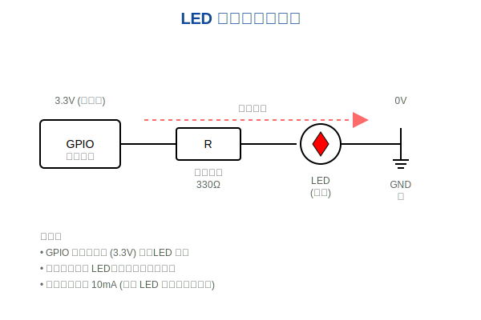

# 基础例程实操

!!! info "学习目标"
    通过本节学习，你将：
    
    - 深入理解 hello_world 例程的代码结构和执行流程
    - 掌握 GPIO 控制原理和 blinky 例程的实现
    - 学会编译、烧录和调试 Zephyr 应用程序
    - 完成三个必做实操任务，巩固所学知识
    - 了解常见问题的排查和解决方法

## hello_world 例程详解

hello_world 是 Zephyr 中最简单的示例程序，它展示了如何创建一个基本的 Zephyr 应用程序并输出信息到串口。

### 代码逐行分析

hello_world 例程的核心代码非常简洁，位于 `samples/hello_world/src/main.c`：

```c
#include <zephyr/kernel.h>

int main(void)
{
    printk("Hello World! %s\n", CONFIG_BOARD);
    return 0;
}
```

让我们逐行分析这段代码：

| 代码行 | 说明 |
|--------|------|
| `#include <zephyr/kernel.h>` | 包含 Zephyr 内核头文件，提供核心 API 和宏定义 |
| `int main(void)` | 应用程序入口函数，Zephyr 启动后会调用此函数 |
| `printk("Hello World! %s\n", CONFIG_BOARD);` | 使用 printk 输出字符串到串口，CONFIG_BOARD 是当前板子名称 |
| `return 0;` | 返回 0 表示程序正常结束 |

!!! tip "printk vs printf"
    - **printk**: Zephyr 内核提供的轻量级打印函数，直接输出到串口，不需要标准 C 库支持
    - **printf**: 标准 C 库函数，需要启用 `CONFIG_STDOUT_CONSOLE`，占用更多资源
    - **建议**: 在嵌入式系统中优先使用 printk，除非需要格式化输出的高级特性


### 项目配置文件

**CMakeLists.txt**:

```cmake
cmake_minimum_required(VERSION 3.20.0)
find_package(Zephyr REQUIRED HINTS $ENV{ZEPHYR_BASE})
project(hello_world)

target_sources(app PRIVATE src/main.c)
```

这个文件定义了项目的构建配置，指定了源文件和依赖关系。

**prj.conf**:

```ini
# 启用串口输出（大多数板子默认已启用）
# CONFIG_SERIAL=y
# CONFIG_UART_CONSOLE=y
```

hello_world 例程的配置非常简单，通常不需要额外配置。

### 编译和烧录步骤

#### 在 QEMU 模拟器中运行

QEMU 是一个虚拟机，可以在没有真实硬件的情况下运行 Zephyr 应用：

```bash
# 进入 hello_world 示例目录
cd ~/zephyrproject/zephyr/samples/hello_world

# 为 QEMU x86 平台构建
west build -b qemu_x86

# 运行（会自动启动 QEMU）
west build -t run
```

**预期输出**:

```
*** Booting Zephyr OS build v3.5.0 ***
Hello World! qemu_x86
```

按 `Ctrl+A` 然后按 `X` 退出 QEMU。

#### 在真实硬件上运行

以 nRF52840 DK 开发板为例：

```bash
# 为 nRF52840 DK 构建
west build -b nrf52840dk_nrf52840

# 烧录到开发板
west flash

# 查看串口输出（需要另开一个终端）
# Linux/macOS
screen /dev/ttyACM0 115200

# Windows
# 使用 PuTTY 或 Tera Term 连接到对应的 COM 口
```


### 串口输出查看

=== "Linux/macOS"

    **使用 screen**:
    ```bash
    # 查找串口设备
    ls /dev/tty*
    
    # 连接串口（波特率 115200）
    screen /dev/ttyACM0 115200
    
    # 退出 screen: Ctrl+A 然后按 K，确认退出
    ```
    
    **使用 minicom**:
    ```bash
    # 安装 minicom
    sudo apt install minicom  # Ubuntu/Debian
    
    # 配置并连接
    minicom -D /dev/ttyACM0 -b 115200
    
    # 退出 minicom: Ctrl+A 然后按 X
    ```

=== "Windows"

    **使用 PuTTY**:
    
    1. 下载并安装 [PuTTY](https://www.putty.org/)
    2. 打开设备管理器，查看 COM 口号（如 COM3）
    3. 打开 PuTTY，选择 Serial 连接类型
    4. 输入 COM 口号和波特率 115200
    5. 点击 Open 连接
    
    **使用 Tera Term**:
    
    1. 下载并安装 [Tera Term](https://ttssh2.osdn.jp/)
    2. 打开 Tera Term，选择 Serial 连接
    3. 选择 COM 口和波特率 115200
    4. 点击 OK 连接

=== "macOS"

    **使用 screen**:
    ```bash
    # 查找串口设备
    ls /dev/cu.*
    
    # 连接串口
    screen /dev/cu.usbmodem* 115200
    
    # 退出 screen: Ctrl+A 然后按 K
    ```

!!! success "成功标志"
    如果看到类似以下输出，说明 hello_world 运行成功：
    ```
    *** Booting Zephyr OS build v3.5.0 ***
    Hello World! nrf52840dk_nrf52840
    ```


## 实操任务 1: 修改 hello_world 输出内容

### 任务目标

修改 hello_world 例程，让它输出你的名字和当前系统运行时间，并每秒循环输出一次。

### 详细步骤

1. **复制示例到工作目录**:

```bash
# 创建自己的工作目录
mkdir -p ~/my_zephyr_apps
cd ~/my_zephyr_apps

# 复制 hello_world 示例
cp -r ~/zephyrproject/zephyr/samples/hello_world ./my_hello_world
cd my_hello_world
```

2. **修改 main.c**:

编辑 `src/main.c`，修改为以下内容：

```c
#include <zephyr/kernel.h>

int main(void)
{
    uint32_t count = 0;
    
    printk("=== Zephyr Hello World ===\n");
    printk("Board: %s\n", CONFIG_BOARD);
    printk("Author: 张三\n");  // 替换为你的名字
    printk("==========================\n\n");
    
    while (1) {
        // 获取系统运行时间（毫秒）
        uint64_t uptime_ms = k_uptime_get();
        
        // 转换为秒
        uint32_t uptime_sec = uptime_ms / 1000;
        
        printk("[%u] Uptime: %u seconds (Count: %u)\n", 
               uptime_sec, uptime_sec, count);
        
        count++;
        
        // 休眠 1 秒
        k_sleep(K_MSEC(1000));
    }
    
    return 0;
}
```

3. **编译和运行**:

```bash
# 为你的开发板构建（以 nRF52840 DK 为例）
west build -b nrf52840dk_nrf52840

# 烧录
west flash

# 查看输出
screen /dev/ttyACM0 115200
```


### 预期输出

```
=== Zephyr Hello World ===
Board: nrf52840dk_nrf52840
Author: 张三
==========================

[1] Uptime: 1 seconds (Count: 0)
[2] Uptime: 2 seconds (Count: 1)
[3] Uptime: 3 seconds (Count: 2)
[4] Uptime: 4 seconds (Count: 3)
...
```

### 知识点总结

通过这个任务，你学会了：

- 使用 `k_uptime_get()` 获取系统运行时间
- 使用 `k_sleep()` 实现延时
- 使用 `K_MSEC()` 宏将毫秒转换为内核时间单位
- 在 Zephyr 中实现循环任务

## blinky 例程详解

blinky 是另一个经典的入门例程，它通过控制 LED 闪烁来演示 GPIO 的基本使用。

!!! info "学习目标"
    - 理解 GPIO 控制原理
    - 掌握设备树的基本概念
    - 学会使用 Zephyr GPIO API
    - 了解硬件连接和电路原理

### 代码逐行分析

blinky 例程的核心代码位于 `samples/basic/blinky/src/main.c`：

```c
#include <zephyr/kernel.h>
#include <zephyr/drivers/gpio.h>

/* 1000 msec = 1 sec */
#define SLEEP_TIME_MS   1000

/* LED 设备树节点 */
#define LED0_NODE DT_ALIAS(led0)

/* 获取 LED GPIO 规格 */
static const struct gpio_dt_spec led = GPIO_DT_SPEC_GET(LED0_NODE, gpios);

int main(void)
{
    int ret;
    bool led_state = true;

    /* 检查 LED 设备是否就绪 */
    if (!gpio_is_ready_dt(&led)) {
        return 0;
    }

    /* 配置 LED GPIO 为输出模式 */
    ret = gpio_pin_configure_dt(&led, GPIO_OUTPUT_ACTIVE);
    if (ret < 0) {
        return 0;
    }

    while (1) {
        /* 切换 LED 状态 */
        ret = gpio_pin_toggle_dt(&led);
        if (ret < 0) {
            return 0;
        }

        led_state = !led_state;
        printk("LED state: %s\n", led_state ? "ON" : "OFF");
        k_msleep(SLEEP_TIME_MS);
    }
    return 0;
}
```


让我们详细分析每个部分：

| 代码部分 | 说明 |
|----------|------|
| `#include <zephyr/drivers/gpio.h>` | 包含 GPIO 驱动 API |
| `#define LED0_NODE DT_ALIAS(led0)` | 从设备树获取 led0 别名节点 |
| `GPIO_DT_SPEC_GET(LED0_NODE, gpios)` | 从设备树节点获取 GPIO 配置信息 |
| `gpio_is_ready_dt(&led)` | 检查 GPIO 设备是否已初始化并就绪 |
| `gpio_pin_configure_dt(&led, GPIO_OUTPUT_ACTIVE)` | 配置 GPIO 引脚为输出模式，初始状态为高电平 |
| `gpio_pin_toggle_dt(&led)` | 切换 GPIO 引脚状态（高电平 ↔ 低电平） |
| `k_msleep(SLEEP_TIME_MS)` | 休眠指定毫秒数（1000ms = 1秒） |

### 设备树配置

设备树（Device Tree）是 Zephyr 中描述硬件配置的机制。blinky 例程通过设备树获取 LED 的 GPIO 信息。


#### nRF52840 DK 的 LED 定义

在 `boards/arm/nrf52840dk_nrf52840/nrf52840dk_nrf52840.dts` 中：

```dts
/ {
    aliases {
        led0 = &led0;
        led1 = &led1;
        led2 = &led2;
        led3 = &led3;
    };

    leds {
        compatible = "gpio-leds";
        led0: led_0 {
            gpios = <&gpio0 13 GPIO_ACTIVE_LOW>;
            label = "Green LED 0";
        };
        led1: led_1 {
            gpios = <&gpio0 14 GPIO_ACTIVE_LOW>;
            label = "Green LED 1";
        };
        led2: led_2 {
            gpios = <&gpio0 15 GPIO_ACTIVE_LOW>;
            label = "Green LED 2";
        };
        led3: led_3 {
            gpios = <&gpio0 16 GPIO_ACTIVE_LOW>;
            label = "Green LED 3";
        };
    };
};
```

**字段说明**:

| 字段 | 说明 |
|------|------|
| `compatible = "gpio-leds"` | 指定这是一个 GPIO LED 设备 |
| `gpios = <&gpio0 13 GPIO_ACTIVE_LOW>` | LED 连接到 GPIO0 控制器的第 13 号引脚，低电平有效 |
| `GPIO_ACTIVE_LOW` | LED 低电平点亮（共阳极接法） |
| `label = "Green LED 0"` | LED 的描述性标签 |


### 实际硬件连接

#### nRF52840 DK LED 连接

| LED | GPIO 引脚 | 物理位置 | 电路连接 |
|-----|-----------|----------|----------|
| LED1 | P0.13 | 板子左上角 | 共阳极（低电平点亮） |
| LED2 | P0.14 | LED1 右侧 | 共阳极（低电平点亮） |
| LED3 | P0.15 | LED2 右侧 | 共阳极（低电平点亮） |
| LED4 | P0.16 | LED3 右侧 | 共阳极（低电平点亮） |

#### 电路原理



!!! info "共阴极 vs 共阳极"
    - **共阴极**: LED 负极接地，GPIO 输出高电平点亮（`GPIO_ACTIVE_HIGH`）
    - **共阳极**: LED 正极接 VDD，GPIO 输出低电平点亮（`GPIO_ACTIVE_LOW`）
    - nRF52840 DK 使用共阳极接法，因此设备树中配置为 `GPIO_ACTIVE_LOW`

### 编译和运行

```bash
# 进入 blinky 示例目录
cd ~/zephyrproject/zephyr/samples/basic/blinky

# 为 nRF52840 DK 构建
west build -b nrf52840dk_nrf52840

# 烧录
west flash
```

**预期效果**:

- 开发板上的 LED1（绿色）每秒闪烁一次
- 串口输出 LED 状态信息

```
LED state: ON
LED state: OFF
LED state: ON
LED state: OFF
...
```


## 实操任务 2: 改变 blinky 闪烁频率

### 任务目标

修改 blinky 例程，实现以下功能：

1. 将 LED 闪烁频率从 1Hz 改为 2Hz（每 0.5 秒切换一次）
2. 添加第二个 LED，让两个 LED 交替闪烁

### 修改代码示例

**修改 1: 改变闪烁频率**

编辑 `src/main.c`，将 `SLEEP_TIME_MS` 从 1000 改为 500：

```c
/* 500 msec = 0.5 sec，实现 2Hz 闪烁 */
#define SLEEP_TIME_MS   500
```

**修改 2: 添加第二个 LED（交替闪烁）**

```c
#include <zephyr/kernel.h>
#include <zephyr/drivers/gpio.h>

#define SLEEP_TIME_MS   500

/* 定义两个 LED */
#define LED0_NODE DT_ALIAS(led0)
#define LED1_NODE DT_ALIAS(led1)

static const struct gpio_dt_spec led0 = GPIO_DT_SPEC_GET(LED0_NODE, gpios);
static const struct gpio_dt_spec led1 = GPIO_DT_SPEC_GET(LED1_NODE, gpios);

int main(void)
{
    int ret;

    /* 检查两个 LED 是否就绪 */
    if (!gpio_is_ready_dt(&led0) || !gpio_is_ready_dt(&led1)) {
        printk("Error: LED device not ready\n");
        return 0;
    }

    /* 配置两个 LED 为输出模式 */
    ret = gpio_pin_configure_dt(&led0, GPIO_OUTPUT_ACTIVE);
    if (ret < 0) {
        return 0;
    }

    ret = gpio_pin_configure_dt(&led1, GPIO_OUTPUT_INACTIVE);
    if (ret < 0) {
        return 0;
    }

    printk("Dual LED blinky started\n");

    while (1) {
        /* 切换两个 LED 状态 */
        gpio_pin_toggle_dt(&led0);
        gpio_pin_toggle_dt(&led1);
        
        printk("LED0: %s, LED1: %s\n",
               gpio_pin_get_dt(&led0) ? "ON" : "OFF",
               gpio_pin_get_dt(&led1) ? "ON" : "OFF");
        
        k_msleep(SLEEP_TIME_MS);
    }
    
    return 0;
}
```

### 预期效果

- LED1 和 LED2 交替闪烁，频率为 2Hz
- 当 LED1 亮时，LED2 灭；当 LED1 灭时，LED2 亮
- 串口输出显示两个 LED 的状态

```
Dual LED blinky started
LED0: ON, LED1: OFF
LED0: OFF, LED1: ON
LED0: ON, LED1: OFF
LED0: OFF, LED1: ON
...
```


## 实操任务 3: 多板适配

### 任务目标

学习如何在不同的开发板上运行 blinky 例程，理解设备树的跨平台特性。

### 支持的开发板列表

Zephyr 支持数百种开发板，以下是一些常见的开发板：

| 开发板 | 板子标识符 | 芯片 | LED 数量 |
|--------|-----------|------|----------|
| nRF52840 DK | `nrf52840dk_nrf52840` | nRF52840 | 4 |
| STM32 Nucleo-F401RE | `nucleo_f401re` | STM32F401RE | 1 |
| ESP32 DevKitC | `esp32_devkitc_wroom` | ESP32 | 1 |
| Arduino Uno R3 | `arduino_uno` | ATmega328P | 1 |
| QEMU x86 | `qemu_x86` | 模拟器 | 无（仅串口） |

### 设备树差异说明

不同开发板的 LED 配置可能不同：

**nRF52840 DK**:
```dts
led0: led_0 {
    gpios = <&gpio0 13 GPIO_ACTIVE_LOW>;  // 共阳极
};
```

**STM32 Nucleo-F401RE**:
```dts
led0: led_0 {
    gpios = <&gpioa 5 GPIO_ACTIVE_HIGH>;  // 共阴极
};
```

**ESP32 DevKitC**:
```dts
led0: led_0 {
    gpios = <&gpio0 2 GPIO_ACTIVE_HIGH>;  // 共阴极
};
```

!!! tip "设备树的优势"
    由于使用了设备树抽象，同一份 blinky 代码可以在不同的开发板上运行，无需修改源代码。只需要在编译时指定不同的板子标识符即可。

### 编译和烧录命令

**nRF52840 DK**:
```bash
west build -b nrf52840dk_nrf52840 samples/basic/blinky
west flash
```

**STM32 Nucleo-F401RE**:
```bash
west build -b nucleo_f401re samples/basic/blinky
west flash
```

**ESP32 DevKitC**:
```bash
west build -b esp32_devkitc_wroom samples/basic/blinky
west flash
```

**QEMU x86（仅测试编译）**:
```bash
west build -b qemu_x86 samples/basic/blinky
west build -t run
# 注意：QEMU 没有 LED，只能看到串口输出
```


## 常见问题和解决方案

### 问题 1: 串口无输出

!!! danger "症状"
    烧录成功，但串口工具中看不到任何输出。

**可能原因和解决方案**:

1. **串口设备选择错误**
   ```bash
   # Linux: 查看所有串口设备
   ls /dev/tty* | grep -E "(ACM|USB)"
   
   # 通常是 /dev/ttyACM0 或 /dev/ttyUSB0
   ```

2. **波特率设置错误**
   - 确保串口工具的波特率设置为 115200
   - 检查 prj.conf 中的波特率配置

3. **串口驱动未启用**
   
   在 `prj.conf` 中添加：
   ```ini
   CONFIG_SERIAL=y
   CONFIG_UART_CONSOLE=y
   CONFIG_PRINTK=y
   ```

4. **USB 权限问题（Linux）**
   ```bash
   # 将当前用户添加到 dialout 组
   sudo usermod -a -G dialout $USER
   
   # 注销并重新登录生效
   ```

### 问题 2: LED 不闪烁

!!! danger "症状"
    程序运行正常（串口有输出），但 LED 不闪烁。

**可能原因和解决方案**:

1. **LED 别名未定义**
   
   检查板子的设备树文件是否定义了 `led0` 别名：
   ```bash
   # 查看板子的设备树文件
   cat boards/arm/your_board/your_board.dts | grep -A 5 "aliases"
   ```
   
   如果没有 `led0` 别名，需要创建 overlay 文件。

2. **GPIO 引脚配置错误**
   
   确认 LED 连接的 GPIO 引脚和极性：
   - 使用万用表测量 LED 引脚电压
   - 检查开发板原理图

3. **LED 已损坏**
   
   尝试使用其他 LED（led1、led2 等）：
   ```c
   #define LED0_NODE DT_ALIAS(led1)  // 改用 led1
   ```


### 问题 3: 编译错误 - 找不到设备树节点

!!! danger "症状"
    编译时出现类似错误：
    ```
    error: 'DT_N_ALIAS_led0' undeclared
    ```

**解决方案**:

1. **检查板子是否支持 LED**
   ```bash
   # 查看板子支持的别名
   west build -b your_board samples/basic/blinky -- -DDTC_OVERLAY_FILE=""
   ```

2. **创建设备树 overlay 文件**
   
   如果板子没有定义 LED，创建 `boards/your_board.overlay`：
   ```dts
   / {
       aliases {
           led0 = &user_led;
       };
   
       leds {
           compatible = "gpio-leds";
           user_led: led_0 {
               gpios = <&gpio0 13 GPIO_ACTIVE_LOW>;
               label = "User LED";
           };
       };
   };
   ```
   
   然后构建时指定 overlay：
   ```bash
   west build -b your_board -- -DDTC_OVERLAY_FILE=boards/your_board.overlay
   ```

### 问题 4: 烧录失败

!!! danger "症状"
    执行 `west flash` 时出现错误。

**可能原因和解决方案**:

1. **调试器未连接**
   - 检查 USB 线是否连接
   - 确认开发板电源指示灯是否亮起

2. **驱动未安装（Windows）**
   - 安装 J-Link 驱动或 ST-Link 驱动
   - 重新插拔 USB 线

3. **Flash Runner 不支持**
   
   尝试手动指定 runner：
   ```bash
   # 使用 J-Link
   west flash --runner jlink
   
   # 使用 OpenOCD
   west flash --runner openocd
   
   # 使用 pyOCD
   west flash --runner pyocd
   ```

4. **权限问题（Linux）**
   ```bash
   # 为 J-Link 添加 udev 规则
   sudo cp 99-jlink.rules /etc/udev/rules.d/
   sudo udevadm control --reload-rules
   ```


### 问题 5: 程序运行一段时间后停止

!!! danger "症状"
    程序开始运行正常，但几秒或几分钟后停止响应。

**可能原因和解决方案**:

1. **线程栈溢出**
   
   在 `prj.conf` 中增加主线程栈大小：
   ```ini
   CONFIG_MAIN_STACK_SIZE=2048
   ```

2. **看门狗超时**
   
   如果启用了看门狗，需要定期喂狗：
   ```c
   #include <zephyr/drivers/watchdog.h>
   
   // 在主循环中喂狗
   wdt_feed(wdt_dev, wdt_channel_id);
   ```

3. **电源不足**
   - 使用外部电源供电
   - 检查 USB 线质量

## 学习总结

完成本节学习后，你应该掌握以下能力：

### 核心技能

- ✅ 理解 Zephyr 应用程序的基本结构
- ✅ 掌握 printk 和串口输出的使用
- ✅ 理解设备树的基本概念和作用
- ✅ 掌握 GPIO API 的基本使用
- ✅ 能够编译、烧录和调试 Zephyr 应用
- ✅ 能够在不同开发板上运行同一份代码

### 实践经验

- ✅ 完成了 hello_world 的修改和扩展
- ✅ 实现了 LED 闪烁频率的调整
- ✅ 实现了多 LED 交替闪烁
- ✅ 在多个开发板上运行了示例程序
- ✅ 解决了常见的编译、烧录和运行问题

### 关键概念

- **printk vs printf**: 嵌入式系统中的轻量级输出
- **设备树**: 硬件描述和抽象机制
- **GPIO API**: 通用输入输出控制接口
- **k_sleep/k_msleep**: 内核延时函数
- **设备就绪检查**: 确保硬件初始化完成


## 下一步学习建议

### 继续深入

现在你已经掌握了 Zephyr 的基础开发流程，可以继续学习：

1. **[第二阶段：进阶实战期](../stage2-intermediate/index.md)**
   - 深入学习内核机制（线程、同步、通信）
   - 掌握 Kconfig 和设备树的高级用法
   - 学习驱动开发和子系统使用

2. **探索更多示例**
   ```bash
   # 查看所有可用示例
   ls ~/zephyrproject/zephyr/samples/
   
   # 推荐尝试的示例
   samples/basic/button/          # 按钮输入
   samples/basic/threads/         # 多线程
   samples/drivers/uart/          # 串口通信
   samples/subsys/logging/        # 日志系统
   ```

3. **阅读官方文档**
   - [Zephyr Getting Started Guide](https://docs.zephyrproject.org/latest/develop/getting_started/index.html)
   - [Zephyr API Documentation](https://docs.zephyrproject.org/latest/doxygen/html/index.html)
   - [Device Tree Guide](https://docs.zephyrproject.org/latest/build/dts/index.html)

### 实践项目建议

尝试完成以下小项目，巩固所学知识：

1. **呼吸灯效果**
   - 使用 PWM 实现 LED 亮度渐变
   - 学习 PWM API 的使用

2. **按钮控制 LED**
   - 使用按钮中断控制 LED 开关
   - 学习 GPIO 输入和中断处理

3. **串口命令行**
   - 通过串口接收命令控制 LED
   - 学习串口接收和字符串处理

4. **多任务闪烁**
   - 创建多个线程，每个线程控制一个 LED
   - 学习线程创建和同步

### 学习资源

- **官方资源**
  - [Zephyr Project 官网](https://www.zephyrproject.org/)
  - [Zephyr GitHub 仓库](https://github.com/zephyrproject-rtos/zephyr)
  - [Zephyr 邮件列表](https://lists.zephyrproject.org/)

- **社区资源**
  - [Zephyr Discord 频道](https://discord.gg/zephyr)
  - [Stack Overflow - Zephyr 标签](https://stackoverflow.com/questions/tagged/zephyr)
  - [Nordic DevZone](https://devzone.nordicsemi.com/)（nRF 系列）

- **视频教程**
  - [Zephyr Project YouTube 频道](https://www.youtube.com/c/ZephyrProject)
  - [Nordic Semiconductor YouTube](https://www.youtube.com/user/NordicSemi)

!!! success "恭喜！"
    你已经完成了第一阶段的基础例程实操学习。通过动手实践，你不仅理解了 Zephyr 的基本概念，还掌握了实际的开发技能。继续保持这种"实操为王"的学习态度，你将在 Zephyr 开发的道路上越走越远！

---

**上一节**: [工程结构与配置](project-structure.md) | **下一节**: [第二阶段：进阶实战期](../stage2-intermediate/index.md)
