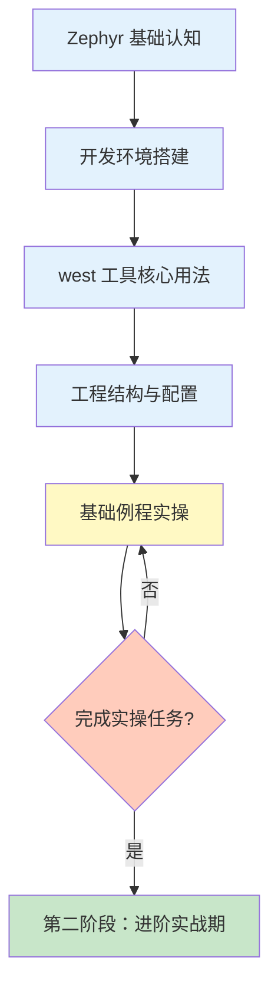

# 第一阶段：入门筑基期

!!! success "阶段目标"
    通过本阶段的学习，您将能够：
    
    - **建立 Zephyr 认知**：理解 Zephyr 的定位、优势和适用场景
    - **搭建开发环境**：在本地成功配置 Zephyr 开发环境并编译第一个程序
    - **掌握核心工具**：熟练使用 west 工具进行项目管理和构建
    - **理解工程结构**：掌握 Zephyr 项目的目录结构、配置文件和构建系统

## 学习内容

| 序号 | 主题 | 核心内容 | 预计时间 |
|------|------|----------|----------|
| 1 | [Zephyr 基础认知](introduction.md) | 项目定位、核心优势、适用场景、版本选择 | 1-2 小时 |
| 2 | [开发环境搭建](environment-setup.md) | 系统要求、安装步骤、SDK 配置、环境验证 | 2-4 小时 |
| 3 | [west 工具核心用法](west-tool.md) | 核心命令、Manifest 文件、多仓库管理 | 2-3 小时 |
| 4 | [工程结构与配置](project-structure.md) | 目录结构、CMakeLists.txt、prj.conf、Kconfig | 2-3 小时 |
| 5 | [基础例程实操](basic-examples.md) | hello_world 详解、blinky 实验、多板适配 | 3-4 小时 |

**总计预计时间：2-3 天**

## 必做实操任务

!!! example "实操任务清单"
    完成以下实操任务，确保您真正掌握了本阶段的核心技能：
    
    ### 任务 1：环境验证 ✓
    - 成功编译 hello_world 示例
    - 在 QEMU 模拟器中运行并看到输出
    - 验证 west 命令可用
    
    ### 任务 2：hello_world 定制 ✓
    - 修改 hello_world 输出内容，显示您的名字
    - 添加系统运行时间显示
    - 实现循环输出，每秒打印一次
    
    ### 任务 3：blinky 实验 ✓
    - 在真实开发板上运行 blinky 示例
    - 修改 LED 闪烁频率（从 1Hz 改为 2Hz）
    - 添加第二个 LED，实现交替闪烁效果
    
    ### 任务 4：多板适配 ✓
    - 在至少两个不同的开发板上运行同一个应用
    - 理解设备树在多板适配中的作用
    - 学会查看和修改板级配置文件

## 避坑指南

!!! danger "常见问题 1：Python 版本不兼容"
    **症状**：执行 `west` 命令时报错 `SyntaxError` 或 `ModuleNotFoundError`
    
    **原因**：Zephyr 要求 Python 3.8 或更高版本
    
    **解决方案**：
    ```bash
    # 检查 Python 版本
    python --version
    
    # 如果版本过低，安装 Python 3.10+
    # Ubuntu/Debian
    sudo apt install python3.10 python3.10-venv
    
    # 使用正确的 Python 版本创建虚拟环境
    python3.10 -m venv ~/zephyrproject/.venv
    source ~/zephyrproject/.venv/bin/activate
    ```

!!! danger "常见问题 2：west update 失败（网络问题）"
    **症状**：执行 `west update` 时下载速度极慢或超时
    
    **原因**：国内网络访问 GitHub 不稳定
    
    **解决方案**：
    
    **方案 1：使用代理**
    ```bash
    # 设置 Git 代理（假设代理地址为 127.0.0.1:7890）
    git config --global http.proxy http://127.0.0.1:7890
    git config --global https.proxy http://127.0.0.1:7890
    ```
    
    **方案 2：使用国内镜像**
    ```bash
    # 修改 .west/config 文件中的 remote URL
    # 将 https://github.com 替换为镜像地址
    ```
    
    **方案 3：分步下载**
    ```bash
    # 如果某个模块下载失败，单独重试
    cd ~/zephyrproject
    west update <module-name>
    ```

!!! danger "常见问题 3：编译错误 - 找不到工具链"
    **症状**：执行 `west build` 时报错 `No CMAKE_C_COMPILER could be found`
    
    **原因**：Zephyr SDK 未正确安装或环境变量未设置
    
    **解决方案**：
    ```bash
    # 1. 确认 SDK 已安装
    ls ~/zephyr-sdk-<version>
    
    # 2. 设置环境变量
    export ZEPHYR_TOOLCHAIN_VARIANT=zephyr
    export ZEPHYR_SDK_INSTALL_DIR=~/zephyr-sdk-<version>
    
    # 3. 或者运行 SDK 的 setup 脚本
    cd ~/zephyr-sdk-<version>
    ./setup.sh
    
    # 4. 重新激活 Zephyr 环境
    cd ~/zephyrproject
    source zephyr/zephyr-env.sh
    ```

## 学习进度检查

完成本阶段学习后，您应该能够：

- [ ] 清楚地说明 Zephyr RTOS 的核心优势和适用场景
- [ ] 在本地成功搭建 Zephyr 开发环境
- [ ] 熟练使用 west 命令进行项目初始化、更新、构建和烧录
- [ ] 理解 Zephyr 项目的目录结构和配置文件作用
- [ ] 独立编译和运行 hello_world 和 blinky 示例
- [ ] 能够在不同开发板上适配和运行同一个应用

## 学习路径



## 学习建议

!!! tip "循序渐进"
    - 按照章节顺序学习，不要跳过基础内容
    - 每学完一个章节，立即动手实践
    - 遇到问题先查看"避坑指南"，再搜索官方文档

!!! tip "实践导向"
    - 不要只看不练，动手实践是最好的学习方式
    - 尝试修改示例代码，观察运行结果的变化
    - 完成所有必做实操任务，确保真正掌握技能

!!! tip "善用资源"
    - 优先查阅 [Zephyr 官方文档](https://docs.zephyrproject.org/)
    - 遇到问题先搜索，再提问
    - 加入 Zephyr 中文社区，与其他学习者交流

## 下一步

完成本阶段学习后，您将具备 Zephyr 开发的基础能力。接下来，您可以：

<div style="text-align: center; margin-top: 30px;">
    <a href="../stage2-intermediate/" class="md-button md-button--primary">
        进入第二阶段：进阶实战期 →
    </a>
</div>

---

!!! question "需要帮助？"
    如果您在学习过程中遇到问题，可以：
    
    - 查看各章节的"常见问题"部分
    - 在 [GitHub Issues](https://github.com/your-repo/issues) 报告问题
    - 在 [GitHub Discussions](https://github.com/your-repo/discussions) 提问交流
