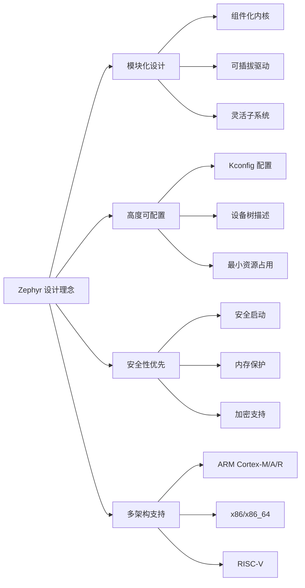
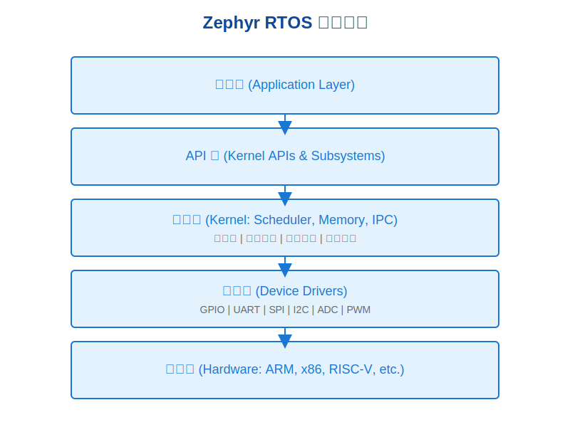
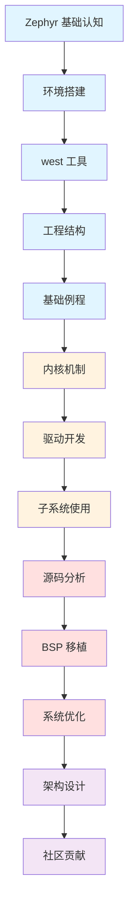

# Zephyr RTOS 基础认知

## Zephyr 项目定位

!!! info "Zephyr RTOS 官方定义"
    Zephyr 是一个开源的实时操作系统（RTOS），专为资源受限的嵌入式系统设计。它由 Linux Foundation 托管，支持多种硬件架构，提供模块化、可扩展和安全的操作系统解决方案。
    
    **官方网站**：[https://www.zephyrproject.org/](https://www.zephyrproject.org/)  
    **官方文档**：[https://docs.zephyrproject.org/](https://docs.zephyrproject.org/)  
    **GitHub 仓库**：[https://github.com/zephyrproject-rtos/zephyr](https://github.com/zephyrproject-rtos/zephyr)

### 项目背景

- **创立时间**：2016 年 2 月，由 Wind River 公司捐赠给 Linux Foundation
- **托管组织**：[Linux Foundation](https://www.linuxfoundation.org/)，确保项目的开放性和中立性
- **许可证**：[Apache 2.0](https://www.apache.org/licenses/LICENSE-2.0)，允许商业使用且无需开源衍生产品
- **支持公司**：Intel、Nordic Semiconductor、NXP、STMicroelectronics、Synopsys 等
- **社区规模**：超过 1000 名贡献者，来自全球 200+ 家公司和组织
- **社区资源**：[Zephyr 邮件列表](https://lists.zephyrproject.org/)、[Discord 频道](https://chat.zephyrproject.org/)

### 设计理念



## 核心优势

### 1. 模块化架构

Zephyr 采用高度模块化的设计，允许开发者根据实际需求选择所需的功能模块：

- **组件化设计**：内核、驱动、子系统、网络协议栈等都是独立模块
- **最小系统资源需求**：最小配置下，ROM 占用可低至 8KB，RAM 占用可低至 2KB
- **按需裁剪**：通过 Kconfig 配置系统，精确控制每个功能的启用和禁用



!!! note "架构图说明"
    Zephyr 采用分层架构设计：应用层 → API 层 → 内核层 → 驱动层 → 硬件层。每一层都有清晰的接口定义，便于移植和扩展。

### 2. 强大的配置系统

Zephyr 提供了业界领先的配置管理系统：

- **Kconfig**：继承自 Linux 内核的配置系统，提供图形化配置界面（menuconfig）
- **设备树（Device Tree）**：硬件描述语言，实现硬件和软件的解耦
- **Overlay 机制**：支持板级和应用级的配置覆盖，便于多板适配

### 3. 安全性特性

| 安全特性 | 说明 | 应用场景 |
|---------|------|---------|
| **安全启动** | 支持 MCUboot，验证固件签名 | 防止固件篡改 |
| **内存保护** | MPU/MMU 支持，隔离应用和内核 | 提高系统稳定性 |
| **加密库** | 集成 mbedTLS、TinyCrypt | 数据加密和认证 |
| **安全通信** | TLS/DTLS 支持 | 安全的网络通信 |
| **安全存储** | 加密文件系统、安全密钥存储 | 保护敏感数据 |

### 4. 多架构支持

Zephyr 支持业界最广泛的硬件架构：

- **ARM**：Cortex-M0/M0+/M3/M4/M7/M23/M33、Cortex-A、Cortex-R
- **x86**：x86、x86_64（支持 QEMU 仿真）
- **RISC-V**：RV32、RV64（支持多种 RISC-V 核心）
- **ARC**：ARC EM、ARC HS（Synopsys）
- **Xtensa**：ESP32、ESP32-S2/S3/C3（Espressif）
- **NIOS II**：Altera/Intel FPGA 软核

## 适用场景

### 物联网设备

!!! example "典型应用"
    - **智能家居**：智能灯泡、智能插座、温湿度传感器
    - **智能城市**：路灯控制、停车管理、环境监测
    - **智能农业**：土壤监测、灌溉控制、畜牧追踪

**优势**：
- 丰富的网络协议栈支持（BLE、Thread、Zigbee、Wi-Fi、LoRaWAN）
- 低功耗设计，适合电池供电设备
- OTA 升级支持，便于远程维护

### 可穿戴设备

!!! example "典型应用"
    - **健康监测**：智能手环、智能手表、心率监测器
    - **运动追踪**：跑步手表、骑行码表、游泳追踪器
    - **医疗设备**：血糖仪、血压计、体温计

**优势**：
- 超低功耗模式，延长电池续航
- 丰富的传感器驱动支持
- BLE 5.x 支持，实现与手机的高效通信

### 工业控制

!!! example "典型应用"
    - **工业自动化**：PLC、运动控制器、机器人控制
    - **设备监控**：振动监测、温度监控、能耗管理
    - **边缘计算**：工业网关、数据采集器、边缘 AI

**优势**：
- 实时性保证，支持硬实时任务
- 功能安全支持（IEC 61508）
- 工业通信协议支持（Modbus、CANopen、EtherCAT）

## 版本选择建议

### LTS 版本 vs 最新版本

| 对比项 | LTS 版本 | 最新版本 |
|-------|---------|---------|
| **发布周期** | 每年 1 次（通常在年底） | 每 4 个月 1 次 |
| **支持时长** | 2.5 年（包括安全更新） | 直到下一个版本发布 |
| **稳定性** | 高，经过长期测试 | 较高，但可能有新功能的 Bug |
| **新特性** | 较少，主要是 Bug 修复 | 最新功能和改进 |
| **适用场景** | 商业产品、长期维护项目 | 学习、原型开发、追求新特性 |

!!! tip "版本选择建议"
    - **学习和原型开发**：建议使用最新版本，体验最新功能和改进
    - **商业产品开发**：建议使用 LTS 版本，确保长期稳定性和支持
    - **现有项目维护**：继续使用当前版本，除非有重大 Bug 或安全问题

### 当前版本信息

截至 2026 年 2 月，Zephyr 的版本情况：

- **最新 LTS 版本**：v3.7 LTS（2024 年 12 月发布）
- **最新稳定版本**：v4.0（2025 年 4 月发布）
- **开发版本**：main 分支（持续更新）

### 版本切换命令

```bash
# 查看所有可用版本
cd ~/zephyrproject/zephyr
git tag | grep "^v"

# 切换到 LTS 版本
git checkout v3.7-branch
west update

# 切换到最新稳定版本
git checkout v4.0-branch
west update

# 切换到开发版本
git checkout main
west update
```

## 与其他 RTOS 对比

### 功能对比矩阵

| 特性 | Zephyr | FreeRTOS | RT-Thread | Mbed OS |
|-----|--------|----------|-----------|---------|
| **许可证** | Apache 2.0 | MIT | Apache 2.0 | Apache 2.0 |
| **内核类型** | 微内核 | 微内核 | 微内核 | 微内核 |
| **设备树支持** | ✅ 完整支持 | ❌ 不支持 | ❌ 不支持 | ❌ 不支持 |
| **Kconfig 配置** | ✅ 完整支持 | ❌ 不支持 | ⚠️ 部分支持 | ❌ 不支持 |
| **架构支持** | 10+ 架构 | 40+ 架构 | 10+ 架构 | ARM 为主 |
| **网络协议栈** | 丰富（BLE、Thread、Zigbee、Wi-Fi、LoRaWAN） | 基础（需第三方） | 丰富 | 丰富 |
| **文件系统** | LittleFS、FAT、NVS | FatFS（第三方） | 多种支持 | LittleFS、FAT |
| **安全特性** | 强（MCUboot、TLS、PSA） | 基础 | 中等 | 强（PSA） |
| **社区活跃度** | 高（1000+ 贡献者） | 非常高 | 高（中国为主） | 中等（已停止更新） |
| **学习曲线** | 陡峭（功能丰富） | 平缓 | 中等 | 中等 |
| **文档质量** | 优秀 | 良好 | 良好（中文丰富） | 优秀 |

### 选择 Zephyr 的理由

1. **企业级支持**：Linux Foundation 托管，多家大公司支持
2. **先进的配置系统**：Kconfig + 设备树，实现硬件软件解耦
3. **丰富的网络协议**：开箱即用的 BLE、Thread、Zigbee 等
4. **强大的安全特性**：适合对安全性要求高的应用
5. **活跃的社区**：持续更新，快速响应问题

### 考虑其他 RTOS 的情况

- **FreeRTOS**：如果需要最简单的 RTOS，或者已有 FreeRTOS 经验
- **RT-Thread**：如果需要丰富的中文文档和社区支持
- **裸机开发**：如果应用非常简单，资源极度受限（< 8KB ROM）

## 成功案例

### 商业产品

!!! success "Zephyr 在商业产品中的应用"
    - **Nordic Semiconductor**：nRF Connect SDK 基于 Zephyr，用于 BLE、Thread、Zigbee 产品
    - **NXP**：部分 MCU 开发套件使用 Zephyr 作为参考实现
    - **Intel**：部分物联网网关和边缘计算设备使用 Zephyr
    - **Synopsys**：ARC 处理器的官方 RTOS 支持

### 开源项目

- **OpenThread**：Google 的 Thread 协议栈，Zephyr 是官方支持的平台之一
- **MCUboot**：安全启动加载器，广泛用于 Zephyr 项目
- **EdgeX Foundry**：边缘计算框架，部分设备端使用 Zephyr
- **Zephyr.js**：在 Zephyr 上运行 JavaScript 的项目

## 学习路线图



**学习路径说明**：

- 🔵 **蓝色**：第一阶段 - 入门筑基期（本阶段）
- 🟡 **黄色**：第二阶段 - 进阶实战期
- 🔴 **红色**：第三阶段 - 高级深耕期
- 🟣 **紫色**：第四阶段 - 专业精通期

## 下一步

恭喜你完成了 Zephyr RTOS 的基础认知！现在你应该对 Zephyr 有了全面的了解。

**接下来，你将学习**：

1. [开发环境搭建](environment-setup.md) - 配置完整的 Zephyr 开发环境
2. [west 工具核心用法](west-tool.md) - 掌握 Zephyr 的核心管理工具
3. [工程结构与配置](project-structure.md) - 理解 Zephyr 项目的组织方式
4. [基础例程实操](basic-examples.md) - 动手实践第一个 Zephyr 程序

!!! tip "学习建议"
    - 不要急于深入细节，先建立整体认知
    - 对比自己熟悉的 RTOS，找到相似点和不同点
    - 思考 Zephyr 是否适合你的项目需求
    - 准备好开发板和开发环境，为后续实操做准备
