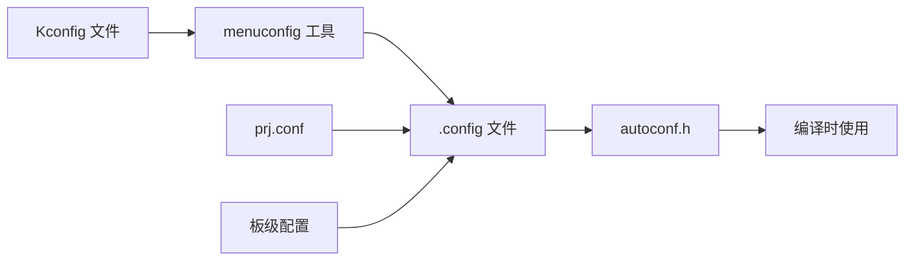

# 工程结构与配置

## 学习目标

完成本节学习后，你将能够：

- 理解 Zephyr 项目的目录结构和文件组织方式
- 掌握 CMakeLists.txt 的编写和配置方法
- 熟练使用 prj.conf 配置文件定制系统功能
- 了解 Kconfig 配置系统的基本原理和使用
- 学会添加源文件、库和外部依赖
- 掌握板级配置和设备树 Overlay 的使用

## Zephyr 项目目录结构

### 典型应用项目结构

一个标准的 Zephyr 应用项目通常包含以下目录和文件：

```
my_zephyr_app/
├── CMakeLists.txt          # CMake 构建配置文件
├── prj.conf                # 项目配置文件
├── src/                    # 源代码目录
│   ├── main.c              # 主程序入口
│   └── ...                 # 其他源文件
├── boards/                 # 板级配置目录（可选）
│   └── nrf52840dk_nrf52840.overlay  # 设备树 Overlay
├── include/                # 头文件目录（可选）
│   └── ...
├── lib/                    # 自定义库目录（可选）
│   └── ...
└── README.md               # 项目说明文档
```

!!! info "目录说明"
    - **CMakeLists.txt**: 定义项目构建规则，指定源文件、包含路径等
    - **prj.conf**: 配置 Zephyr 内核和子系统的功能选项
    - **src/**: 存放应用程序的源代码文件
    - **boards/**: 存放板级特定的配置文件（设备树 Overlay、板级 Kconfig）
    - **include/**: 存放应用程序的头文件
    - **lib/**: 存放自定义的库代码


### Zephyr 源码目录结构

Zephyr RTOS 的源码目录结构如下：

```
zephyr/
├── arch/                   # 架构相关代码（ARM、x86、RISC-V 等）
├── boards/                 # 板级支持包（BSP）
├── cmake/                  # CMake 构建脚本
├── doc/                    # 官方文档
├── drivers/                # 设备驱动程序
│   ├── gpio/
│   ├── i2c/
│   ├── spi/
│   └── ...
├── dts/                    # 设备树源文件和绑定
│   ├── bindings/           # 设备树绑定定义
│   └── ...
├── include/                # 公共头文件
│   ├── zephyr/
│   └── ...
├── kernel/                 # 内核核心代码
├── lib/                    # 通用库
├── modules/                # 外部模块
├── samples/                # 示例程序
├── scripts/                # 构建和工具脚本
├── subsys/                 # 子系统（日志、Shell、文件系统等）
│   ├── logging/
│   ├── shell/
│   ├── fs/
│   └── ...
├── tests/                  # 测试用例
└── CMakeLists.txt          # 顶层 CMake 文件
```

!!! info "核心目录说明"
    - **arch/**: 包含不同 CPU 架构的底层实现（启动代码、上下文切换、中断处理）
    - **boards/**: 包含各种开发板的配置文件和设备树定义
    - **drivers/**: 包含各种外设的驱动程序实现
    - **kernel/**: Zephyr 内核的核心实现（调度器、线程管理、同步机制）
    - **subsys/**: 各种子系统的实现（日志、Shell、网络、蓝牙等）
    - **samples/**: 官方提供的示例程序，是学习的好资源

## CMakeLists.txt 详解

CMakeLists.txt 是 Zephyr 项目的构建配置文件，使用 CMake 语法定义项目的构建规则。

### 最小示例

一个最简单的 CMakeLists.txt 文件：

```cmake
# 指定最低 CMake 版本
cmake_minimum_required(VERSION 3.20.0)

# 查找 Zephyr 包（必须在 project() 之前）
find_package(Zephyr REQUIRED HINTS $ENV{ZEPHYR_BASE})

# 定义项目名称
project(my_app)

# 添加源文件
target_sources(app PRIVATE src/main.c)
```


### 完整示例

一个包含多个源文件和配置的完整 CMakeLists.txt：

```cmake
# 指定最低 CMake 版本
cmake_minimum_required(VERSION 3.20.0)

# 查找 Zephyr 包（必须在 project() 之前）
find_package(Zephyr REQUIRED HINTS $ENV{ZEPHYR_BASE})

# 定义项目名称和版本
project(my_sensor_app VERSION 1.0.0)

# 添加应用程序源文件
target_sources(app PRIVATE
    src/main.c
    src/sensor.c
    src/display.c
)

# 添加包含目录
target_include_directories(app PRIVATE
    include
)

# 添加编译选项
target_compile_options(app PRIVATE
    -Wall                    # 启用所有警告
    -Wextra                  # 启用额外警告
)

# 添加编译定义
target_compile_definitions(app PRIVATE
    APP_VERSION_MAJOR=${PROJECT_VERSION_MAJOR}
    APP_VERSION_MINOR=${PROJECT_VERSION_MINOR}
)

# 条件编译：如果启用了调试模式
if(CONFIG_DEBUG)
    target_compile_definitions(app PRIVATE DEBUG_MODE=1)
endif()

# 链接自定义库（如果有）
# target_link_libraries(app PRIVATE my_custom_lib)
```

### CMake 常用命令

| 命令 | 说明 | 示例 |
|------|------|------|
| `cmake_minimum_required()` | 指定最低 CMake 版本 | `cmake_minimum_required(VERSION 3.20.0)` |
| `find_package()` | 查找 Zephyr 包 | `find_package(Zephyr REQUIRED HINTS $ENV{ZEPHYR_BASE})` |
| `project()` | 定义项目名称和版本 | `project(my_app VERSION 1.0.0)` |
| `target_sources()` | 添加源文件到目标 | `target_sources(app PRIVATE src/main.c)` |
| `target_include_directories()` | 添加头文件搜索路径 | `target_include_directories(app PRIVATE include)` |
| `target_compile_options()` | 添加编译选项 | `target_compile_options(app PRIVATE -Wall)` |
| `target_compile_definitions()` | 添加编译宏定义 | `target_compile_definitions(app PRIVATE DEBUG=1)` |
| `target_link_libraries()` | 链接库 | `target_link_libraries(app PRIVATE my_lib)` |

!!! tip "CMake 最佳实践"
    1. **始终使用 `PRIVATE` 关键字**：对于应用程序，使用 `PRIVATE` 确保配置不会传播到其他目标
    2. **使用相对路径**：源文件路径相对于 CMakeLists.txt 所在目录
    3. **分组管理源文件**：使用变量管理多个源文件，提高可读性
    4. **利用条件编译**：使用 `if(CONFIG_XXX)` 根据配置选项条件编译代码
    5. **保持简洁**：应用程序的 CMakeLists.txt 应该简单明了，复杂逻辑放在单独的 CMake 模块中


## prj.conf 配置文件

prj.conf 是 Zephyr 项目的配置文件，使用 Kconfig 语法定义系统功能和参数。

### 基本配置示例

一个简单的 prj.conf 文件：

```ini
# 串口配置
CONFIG_SERIAL=y
CONFIG_UART_CONSOLE=y

# 日志系统
CONFIG_LOG=y
CONFIG_LOG_DEFAULT_LEVEL=3

# GPIO 驱动
CONFIG_GPIO=y

# 线程栈大小
CONFIG_MAIN_STACK_SIZE=2048
```

### 完整配置示例

一个包含多个子系统配置的完整 prj.conf：

```ini
# ============================================================================
# 基础系统配置
# ============================================================================

# 串口和控制台
CONFIG_SERIAL=y
CONFIG_UART_CONSOLE=y
CONFIG_CONSOLE=y

# 系统时钟
CONFIG_SYS_CLOCK_TICKS_PER_SEC=1000

# 主线程栈大小（字节）
CONFIG_MAIN_STACK_SIZE=2048

# 空闲线程栈大小
CONFIG_IDLE_STACK_SIZE=512

# ============================================================================
# 日志系统配置
# ============================================================================

# 启用日志系统
CONFIG_LOG=y

# 日志级别：0=OFF, 1=ERR, 2=WRN, 3=INF, 4=DBG
CONFIG_LOG_DEFAULT_LEVEL=3

# 日志后端：串口输出
CONFIG_LOG_BACKEND_UART=y

# 日志时间戳
CONFIG_LOG_TIMESTAMP=y

# 日志颜色输出
CONFIG_LOG_BACKEND_SHOW_COLOR=y

# ============================================================================
# 驱动配置
# ============================================================================

# GPIO 驱动
CONFIG_GPIO=y

# I2C 驱动
CONFIG_I2C=y

# SPI 驱动
CONFIG_SPI=y

# PWM 驱动
CONFIG_PWM=y

# ============================================================================
# 子系统配置
# ============================================================================

# Shell 控制台
CONFIG_SHELL=y
CONFIG_SHELL_BACKEND_SERIAL=y

# 文件系统
CONFIG_FILE_SYSTEM=y
CONFIG_FILE_SYSTEM_LITTLEFS=y

# ============================================================================
# 调试配置
# ============================================================================

# 断言检查
CONFIG_ASSERT=y

# 栈溢出检查
CONFIG_STACK_SENTINEL=y

# 线程监控
CONFIG_THREAD_MONITOR=y

# 线程名称
CONFIG_THREAD_NAME=y

# ============================================================================
# 优化配置
# ============================================================================

# 编译优化级别：0=无优化, 1=O1, 2=O2, 3=O3, s=Os（体积优化）
CONFIG_COMPILER_OPTIMIZATIONS="2"

# 代码体积优化（如果需要）
# CONFIG_SIZE_OPTIMIZATIONS=y
```


### 配置选项说明

#### 日志级别

| 级别 | 值 | 说明 | 使用场景 |
|------|---|------|----------|
| OFF | 0 | 关闭日志 | 生产环境，追求最小体积 |
| ERR | 1 | 仅错误信息 | 生产环境，仅记录严重问题 |
| WRN | 2 | 错误和警告 | 生产环境，记录潜在问题 |
| INF | 3 | 信息、警告和错误 | 开发环境，了解系统运行状态 |
| DBG | 4 | 所有日志（包括调试） | 开发调试，详细追踪问题 |

#### 优化级别

| 选项 | 说明 | 适用场景 |
|------|------|----------|
| `CONFIG_COMPILER_OPTIMIZATIONS="0"` | 无优化（-O0） | 调试阶段，便于单步调试 |
| `CONFIG_COMPILER_OPTIMIZATIONS="1"` | 基本优化（-O1） | 平衡调试和性能 |
| `CONFIG_COMPILER_OPTIMIZATIONS="2"` | 标准优化（-O2） | 生产环境，推荐设置 |
| `CONFIG_COMPILER_OPTIMIZATIONS="3"` | 激进优化（-O3） | 追求最高性能 |
| `CONFIG_SIZE_OPTIMIZATIONS=y` | 体积优化（-Os） | 存储空间受限的场景 |

!!! warning "配置冲突注意事项"
    1. **互斥选项**：某些配置选项是互斥的，例如 `CONFIG_COMPILER_OPTIMIZATIONS` 和 `CONFIG_SIZE_OPTIMIZATIONS` 不能同时使用
    2. **依赖关系**：某些选项依赖其他选项，例如 `CONFIG_LOG_BACKEND_UART` 需要先启用 `CONFIG_LOG` 和 `CONFIG_SERIAL`
    3. **板级限制**：某些配置可能受到硬件限制，例如某些板子不支持特定的外设
    4. **内存限制**：启用过多功能可能导致内存不足，需要根据实际硬件资源调整配置

## Kconfig 基础

Kconfig 是 Zephyr 使用的配置系统，源自 Linux 内核。它提供了一种结构化的方式来管理系统配置。

### Kconfig 配置流程



!!! info "Kconfig 系统作用"
    - **配置管理**：提供统一的配置接口，管理内核、驱动、子系统的所有配置选项
    - **依赖检查**：自动检查配置选项之间的依赖关系，防止无效配置
    - **默认值**：为配置选项提供合理的默认值
    - **可视化配置**：通过 menuconfig 提供图形化配置界面
    - **配置继承**：支持板级配置、应用配置的层级覆盖


### 使用 menuconfig

menuconfig 是一个交互式的配置工具，可以方便地浏览和修改配置选项。

**启动 menuconfig**：

```bash
# 在项目目录中执行
west build -t menuconfig
```

**menuconfig 界面操作**：

- **方向键**：上下移动光标
- **Enter**：进入子菜单或修改选项
- **空格**：切换布尔选项（启用/禁用）
- **/**：搜索配置选项
- **?**：显示当前选项的帮助信息
- **S**：保存配置
- **Q**：退出

**搜索配置选项**：

1. 按 `/` 键打开搜索对话框
2. 输入配置选项名称（如 `LOG`）
3. 查看搜索结果和选项位置
4. 按数字键跳转到对应选项

### 自定义 Kconfig

你可以为应用程序创建自定义的 Kconfig 选项。

**创建 Kconfig 文件**（在项目根目录）：

```kconfig
# Kconfig

# 引入 Zephyr 的 Kconfig
source "Kconfig.zephyr"

# 自定义配置选项
menu "My Application Configuration"

config MY_APP_FEATURE_X
    bool "Enable Feature X"
    default y
    help
      Enable the custom feature X in the application.

config MY_APP_BUFFER_SIZE
    int "Buffer size in bytes"
    default 1024
    range 512 4096
    help
      Size of the application buffer in bytes.
      Valid range: 512 to 4096 bytes.

config MY_APP_LOG_LEVEL
    int "Application log level"
    default 3
    range 0 4
    help
      Log level for the application:
      0 = OFF, 1 = ERR, 2 = WRN, 3 = INF, 4 = DBG

endmenu
```

**在代码中使用自定义配置**：

```c
#include <zephyr/kernel.h>

// 使用 Kconfig 定义的宏
#if defined(CONFIG_MY_APP_FEATURE_X)
    // Feature X 启用时的代码
    void feature_x_init(void)
    {
        printk("Feature X is enabled\n");
    }
#endif

// 使用配置值
#define BUFFER_SIZE CONFIG_MY_APP_BUFFER_SIZE
static uint8_t buffer[BUFFER_SIZE];

void main(void)
{
    printk("Buffer size: %d bytes\n", BUFFER_SIZE);
    
#if defined(CONFIG_MY_APP_FEATURE_X)
    feature_x_init();
#endif
}
```


## 添加源文件和库

### 方法 1：直接添加源文件

最简单的方式是直接在 CMakeLists.txt 中列出所有源文件：

```cmake
target_sources(app PRIVATE
    src/main.c
    src/sensor.c
    src/display.c
    src/network.c
)
```

### 方法 2：使用变量管理源文件

当源文件较多时，使用变量可以提高可读性：

```cmake
# 定义源文件列表
set(APP_SOURCES
    src/main.c
    src/sensor.c
    src/display.c
    src/network.c
)

# 添加源文件
target_sources(app PRIVATE ${APP_SOURCES})
```

### 方法 3：条件编译

根据配置选项条件编译不同的源文件：

```cmake
# 基础源文件
target_sources(app PRIVATE
    src/main.c
)

# 如果启用了传感器功能
if(CONFIG_MY_APP_SENSOR)
    target_sources(app PRIVATE
        src/sensor.c
        src/sensor_driver.c
    )
endif()

# 如果启用了网络功能
if(CONFIG_NETWORKING)
    target_sources(app PRIVATE
        src/network.c
        src/mqtt_client.c
    )
endif()
```

### 组织源文件

**推荐的目录结构**：

```
my_app/
├── CMakeLists.txt
├── prj.conf
├── src/
│   ├── main.c              # 主程序
│   ├── sensor/             # 传感器模块
│   │   ├── sensor.c
│   │   └── sensor.h
│   ├── display/            # 显示模块
│   │   ├── display.c
│   │   └── display.h
│   └── network/            # 网络模块
│       ├── network.c
│       └── network.h
└── include/
    └── app_config.h        # 应用配置头文件
```

**对应的 CMakeLists.txt**：

```cmake
cmake_minimum_required(VERSION 3.20.0)
find_package(Zephyr REQUIRED HINTS $ENV{ZEPHYR_BASE})
project(my_app)

# 添加包含目录
target_include_directories(app PRIVATE
    include
    src/sensor
    src/display
    src/network
)

# 添加源文件
target_sources(app PRIVATE
    src/main.c
    src/sensor/sensor.c
    src/display/display.c
    src/network/network.c
)
```


### 创建和使用静态库

**创建库的 CMakeLists.txt**（lib/mylib/CMakeLists.txt）：

```cmake
# 创建静态库
zephyr_library_named(mylib)

# 添加库的源文件
zephyr_library_sources(
    mylib.c
    mylib_utils.c
)

# 添加库的包含目录
zephyr_library_include_directories(
    .
)
```

**在应用中使用库**（主 CMakeLists.txt）：

```cmake
cmake_minimum_required(VERSION 3.20.0)
find_package(Zephyr REQUIRED HINTS $ENV{ZEPHYR_BASE})
project(my_app)

# 添加库子目录
add_subdirectory(lib/mylib)

# 添加应用源文件
target_sources(app PRIVATE src/main.c)

# 链接库（如果需要）
# target_link_libraries(app PRIVATE mylib)
```

### 使用外部库

**方法 1：通过 west.yml 添加外部模块**

在项目根目录创建 west.yml：

```yaml
manifest:
  projects:
    - name: my-external-lib
      url: https://github.com/user/my-external-lib
      revision: main
      path: modules/lib/my-external-lib
```

更新依赖：

```bash
west update
```

**方法 2：在 CMakeLists.txt 中引用外部库**

```cmake
cmake_minimum_required(VERSION 3.20.0)
find_package(Zephyr REQUIRED HINTS $ENV{ZEPHYR_BASE})
project(my_app)

# 添加外部库的包含路径
target_include_directories(app PRIVATE
    ${ZEPHYR_BASE}/../modules/lib/my-external-lib/include
)

# 添加外部库的源文件
target_sources(app PRIVATE
    ${ZEPHYR_BASE}/../modules/lib/my-external-lib/src/lib.c
)

# 添加应用源文件
target_sources(app PRIVATE src/main.c)
```

## 板级配置

### 设备树 Overlay

设备树 Overlay 用于覆盖或扩展板级设备树定义。

**创建 Overlay 文件**（boards/nrf52840dk_nrf52840.overlay）：

```dts
/* 覆盖 LED 定义 */
&led0 {
    gpios = <&gpio0 13 GPIO_ACTIVE_LOW>;
    label = "My Custom LED";
};

/* 添加自定义 I2C 传感器节点 */
&i2c0 {
    status = "okay";
    
    my_sensor: sensor@48 {
        compatible = "my-vendor,my-sensor";
        reg = <0x48>;
        label = "MY_SENSOR";
    };
};

/* 添加自定义 GPIO 节点 */
/ {
    custom_gpios {
        compatible = "gpio-keys";
        button0: button_0 {
            gpios = <&gpio0 11 (GPIO_PULL_UP | GPIO_ACTIVE_LOW)>;
            label = "Custom Button";
        };
    };
};
```


### 板级 Kconfig

板级 Kconfig 文件用于为特定板子设置默认配置。

**创建板级配置文件**（boards/nrf52840dk_nrf52840.conf）：

```ini
# 板级特定配置
CONFIG_GPIO=y
CONFIG_I2C=y
CONFIG_SPI=y

# 启用板载外设
CONFIG_SENSOR=y
CONFIG_BME280=y

# 优化配置
CONFIG_COMPILER_OPTIMIZATIONS="2"
```

**配置优先级**：

```
板级默认配置 < prj.conf < 命令行参数
```

例如：

```bash
# prj.conf 会覆盖板级配置
west build -b nrf52840dk_nrf52840

# 命令行参数会覆盖 prj.conf
west build -b nrf52840dk_nrf52840 -- -DCONFIG_LOG_DEFAULT_LEVEL=4
```

## 实践示例：完整项目

让我们创建一个完整的传感器数据采集项目。

### 项目结构

```
sensor_app/
├── CMakeLists.txt
├── prj.conf
├── Kconfig
├── boards/
│   └── nrf52840dk_nrf52840.overlay
├── src/
│   ├── main.c
│   ├── sensor/
│   │   ├── sensor.c
│   │   └── sensor.h
│   └── display/
│       ├── display.c
│       └── display.h
└── include/
    └── app_config.h
```

### CMakeLists.txt

```cmake
cmake_minimum_required(VERSION 3.20.0)

find_package(Zephyr REQUIRED HINTS $ENV{ZEPHYR_BASE})

project(sensor_app VERSION 1.0.0)

# 添加包含目录
target_include_directories(app PRIVATE
    include
    src/sensor
    src/display
)

# 添加源文件
target_sources(app PRIVATE
    src/main.c
)

# 条件编译传感器模块
if(CONFIG_APP_SENSOR_ENABLE)
    target_sources(app PRIVATE
        src/sensor/sensor.c
    )
endif()

# 条件编译显示模块
if(CONFIG_APP_DISPLAY_ENABLE)
    target_sources(app PRIVATE
        src/display/display.c
    )
endif()

# 添加编译选项
target_compile_options(app PRIVATE
    -Wall
    -Wextra
)
```

### prj.conf

```ini
# 基础系统
CONFIG_SERIAL=y
CONFIG_UART_CONSOLE=y
CONFIG_MAIN_STACK_SIZE=2048

# 日志系统
CONFIG_LOG=y
CONFIG_LOG_DEFAULT_LEVEL=3
CONFIG_LOG_BACKEND_UART=y

# 驱动
CONFIG_GPIO=y
CONFIG_I2C=y
CONFIG_SENSOR=y

# 应用功能
CONFIG_APP_SENSOR_ENABLE=y
CONFIG_APP_DISPLAY_ENABLE=y
CONFIG_APP_SAMPLE_INTERVAL=1000

# 调试
CONFIG_ASSERT=y
CONFIG_THREAD_NAME=y
```


### Kconfig

```kconfig
# Kconfig

source "Kconfig.zephyr"

menu "Sensor Application Configuration"

config APP_SENSOR_ENABLE
    bool "Enable sensor module"
    default y
    help
      Enable the sensor data acquisition module.

config APP_DISPLAY_ENABLE
    bool "Enable display module"
    default y
    help
      Enable the display output module.

config APP_SAMPLE_INTERVAL
    int "Sensor sampling interval (ms)"
    default 1000
    range 100 10000
    depends on APP_SENSOR_ENABLE
    help
      Interval between sensor readings in milliseconds.

endmenu
```

### 构建命令

```bash
# 配置和构建
west build -b nrf52840dk_nrf52840

# 使用 menuconfig 修改配置
west build -t menuconfig

# 重新构建
west build

# 烧录到开发板
west flash

# 查看串口输出
# Linux/macOS
screen /dev/ttyACM0 115200

# Windows
# 使用 PuTTY 或 Tera Term
```

## 常见问题

### 问题 1：配置不生效

!!! danger "症状"
    修改了 prj.conf 中的配置，但重新编译后配置没有生效。

**原因**：

- 构建系统缓存了旧的配置
- 配置选项被其他配置覆盖
- 配置选项依赖未满足

**解决方案**：

```bash
# 方案 1：清理构建目录后重新构建
west build -t pristine
west build -b nrf52840dk_nrf52840

# 方案 2：删除构建目录
rm -rf build
west build -b nrf52840dk_nrf52840

# 方案 3：检查配置是否生效
west build -t menuconfig
# 在 menuconfig 中搜索配置选项，查看其状态和依赖

# 方案 4：查看最终生成的配置
cat build/zephyr/.config | grep CONFIG_YOUR_OPTION
```

### 问题 2：找不到头文件

!!! danger "症状"
    编译时报错：`fatal error: myheader.h: No such file or directory`

**原因**：

- 头文件路径未添加到包含目录
- 头文件路径拼写错误
- 头文件不在指定的目录中

**解决方案**：

```cmake
# 在 CMakeLists.txt 中添加包含目录
target_include_directories(app PRIVATE
    include              # 添加 include 目录
    src/mymodule         # 添加模块目录
    ${ZEPHYR_BASE}/include  # 添加 Zephyr 包含目录（通常不需要）
)
```

**验证包含路径**：

```bash
# 查看编译命令中的 -I 选项
west build -v | grep "include"
```


### 问题 3：链接错误

!!! danger "症状"
    链接时报错：`undefined reference to 'my_function'`

**原因**：

- 函数实现的源文件未添加到构建
- 函数声明和实现不匹配
- 库未正确链接
- 函数使用了 `static` 关键字限制了作用域

**解决方案**：

```cmake
# 方案 1：确保源文件已添加
target_sources(app PRIVATE
    src/main.c
    src/mymodule.c  # 确保包含函数实现的文件
)

# 方案 2：如果使用了库，确保链接
target_link_libraries(app PRIVATE mylib)

# 方案 3：检查函数声明
# 在头文件中：
void my_function(void);  // 声明

# 在源文件中：
void my_function(void)   // 实现（确保签名一致）
{
    // ...
}
```

**检查符号**：

```bash
# 查看目标文件中的符号
arm-zephyr-eabi-nm build/zephyr/CMakeFiles/app.dir/src/mymodule.c.obj | grep my_function

# 查看最终可执行文件中的符号
arm-zephyr-eabi-nm build/zephyr/zephyr.elf | grep my_function
```

## 学习总结

完成本节学习后，你应该掌握：

✅ Zephyr 项目的目录结构和文件组织方式  
✅ CMakeLists.txt 的编写和常用命令  
✅ prj.conf 配置文件的使用和配置选项  
✅ Kconfig 系统的基本原理和 menuconfig 使用  
✅ 如何添加源文件、创建库和使用外部依赖  
✅ 板级配置和设备树 Overlay 的使用  
✅ 常见配置和构建问题的解决方法

## 下一步

现在你已经掌握了 Zephyr 项目的结构和配置方法，接下来可以：

- 学习 [基础例程实操](basic-examples.md)，通过实际代码加深理解
- 深入学习 [Kconfig 和设备树](../stage2-intermediate/kconfig-devicetree.md)（第二阶段）
- 尝试创建自己的第一个 Zephyr 应用项目

## 参考资源

- [Zephyr 官方文档 - Application Development](https://docs.zephyrproject.org/latest/develop/application/index.html)
- [Zephyr 官方文档 - Build and Configuration Systems](https://docs.zephyrproject.org/latest/build/index.html)
- [CMake 官方文档](https://cmake.org/documentation/)
- [Kconfig 语言规范](https://www.kernel.org/doc/html/latest/kbuild/kconfig-language.html)
