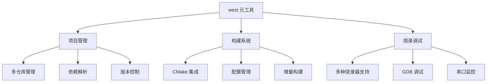
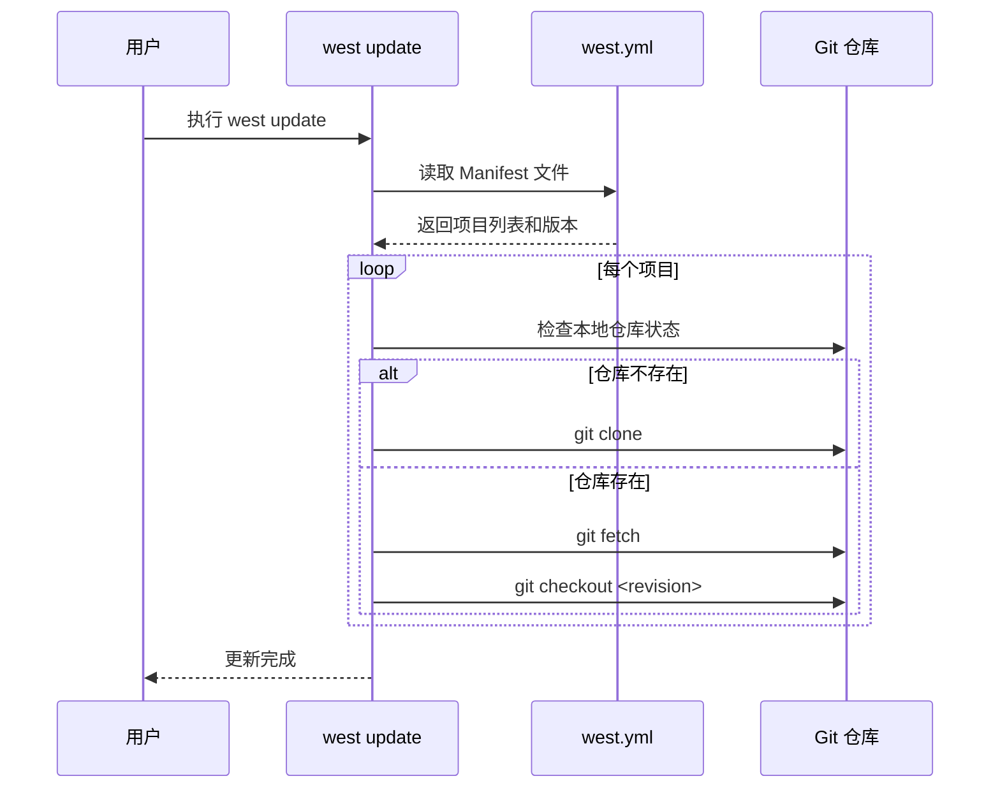
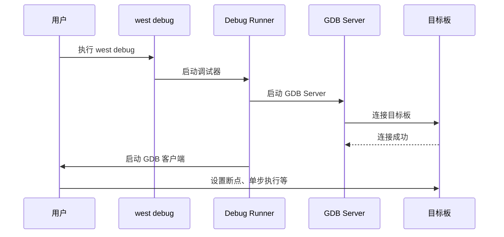

# west 工具核心用法

## west 工具概述

!!! info "什么是 west？"
    west 是 Zephyr 项目的元工具（meta-tool），它将多个功能集成到一个统一的命令行界面中。west 不仅是一个构建工具，更是一个完整的项目管理系统，负责源码管理、依赖处理、构建配置、固件烧录和调试等全流程任务。

### 设计理念

west 的设计遵循以下核心理念：



### 核心特性

- **统一接口**：一个命令行工具管理整个开发流程
- **多仓库支持**：通过 Manifest 文件管理多个 Git 仓库
- **可扩展性**：支持自定义命令和扩展
- **跨平台**：支持 Linux、Windows、macOS
- **工具链无关**：支持多种编译器和调试器


## west 核心命令详解

### west init - 初始化工作区

**命令格式**：

```bash
west init [-m MANIFEST_URL] [-mr MANIFEST_REVISION] [--mf MANIFEST_FILE] [PATH]
```

**常用示例**：

```bash
# 初始化默认的 Zephyr 工作区
west init ~/zephyrproject

# 指定 Manifest 仓库和分支
west init -m https://github.com/zephyrproject-rtos/zephyr --mr v3.5.0 ~/zephyr-v3.5

# 使用本地 Manifest 文件
west init --mf my-manifest.yml ~/my-project
```

**工作区结构**：

执行 `west init` 后，会创建以下目录结构：

```
zephyrproject/               # 工作区根目录
├── .west/                   # west 配置目录
│   └── config              # west 配置文件
├── zephyr/                  # Zephyr 主仓库（Manifest 仓库）
│   ├── west.yml            # Manifest 文件
│   ├── CMakeLists.txt
│   └── ...
├── modules/                 # 依赖模块（west update 后创建）
├── tools/                   # 工具链和工具
└── bootloader/              # 引导加载程序
```

!!! tip "最佳实践"
    - 为不同的项目或版本创建独立的工作区，避免版本冲突
    - 工作区路径避免包含空格和中文字符
    - 首次初始化后，立即执行 `west update` 获取所有依赖
    - 使用 `--mr` 参数指定稳定的 LTS 版本，而不是 main 分支


### west update - 更新依赖

**命令格式**：

```bash
west update [--fetch {always,smart}] [--rebase] [PROJECT ...]
```

**常用示例**：

```bash
# 更新所有项目
west update

# 只更新特定项目
west update hal_nordic mcuboot

# 强制重新获取（解决网络问题导致的不完整下载）
west update --fetch always

# 更新并自动 rebase 本地修改
west update --rebase
```

**更新流程**：



!!! warning "注意事项"
    - 首次执行 `west update` 会下载大量代码（约 1-2 GB），需要稳定的网络连接
    - 如果有本地修改，update 可能会失败，需要先提交或暂存修改
    - 国内用户建议配置 Git 代理或使用镜像源
    - 更新过程中不要中断，否则可能导致仓库状态不一致


### west build - 构建项目

**命令格式**：

```bash
west build -b BOARD [-d BUILD_DIR] [SOURCE_DIR] [-- CMAKE_ARGS]
```

**常用示例**：

```bash
# 构建 hello_world 示例（在示例目录中执行）
cd ~/zephyrproject/zephyr/samples/hello_world
west build -b nrf52840dk_nrf52840

# 指定源码目录和构建目录
west build -b nrf52840dk_nrf52840 -d build samples/hello_world

# 清理后重新构建
west build -b nrf52840dk_nrf52840 -p auto

# 传递 CMake 参数
west build -b nrf52840dk_nrf52840 -- -DCONF_FILE=prj_custom.conf

# 只编译，不重新配置
west build

# 构建特定目标
west build -t menuconfig    # 打开配置菜单
west build -t clean         # 清理构建输出
```

**构建选项表格**：

| 选项 | 说明 | 示例 |
|------|------|------|
| `-b BOARD` | 指定目标板子 | `-b nrf52840dk_nrf52840` |
| `-d BUILD_DIR` | 指定构建目录 | `-d build` |
| `-p auto` | 自动清理（pristine build） | `-p auto` |
| `-p always` | 总是清理重建 | `-p always` |
| `-t TARGET` | 构建特定目标 | `-t menuconfig` |
| `--cmake-only` | 只运行 CMake，不编译 | `--cmake-only` |
| `-c` | 增量构建（默认） | `-c` |

**构建输出结构**：

```
build/                       # 构建目录
├── zephyr/                  # Zephyr 输出
│   ├── zephyr.elf          # ELF 可执行文件
│   ├── zephyr.hex          # HEX 固件文件
│   ├── zephyr.bin          # BIN 固件文件
│   ├── zephyr.dts          # 生成的设备树
│   └── .config             # 最终配置
├── CMakeCache.txt          # CMake 缓存
└── compile_commands.json   # 编译命令数据库
```


### west flash - 烧录固件

**命令格式**：

```bash
west flash [-d BUILD_DIR] [--runner RUNNER] [--context] [RUNNER_ARGS]
```

**常用示例**：

```bash
# 烧录到目标板（使用默认 runner）
west flash

# 指定构建目录
west flash -d build

# 指定烧录器
west flash --runner jlink

# 查看支持的烧录器
west flash --context

# 传递烧录器参数
west flash --runner jlink -- --speed 4000
```

**Flash Runner 表格**：

| Runner | 支持的板子 | 说明 |
|--------|-----------|------|
| `jlink` | Nordic、STM32、NXP 等 | J-Link 调试器，商业产品，性能优秀 |
| `openocd` | STM32、ESP32 等 | 开源调试器，支持多种硬件 |
| `pyocd` | ARM Cortex-M | Python 实现，易于安装 |
| `nrfjprog` | Nordic nRF 系列 | Nordic 官方工具 |
| `stm32cubeprogrammer` | STM32 系列 | ST 官方工具 |
| `dfu-util` | 支持 DFU 的板子 | USB DFU 烧录 |
| `blackmagicprobe` | ARM Cortex-M | Black Magic Probe 调试器 |

!!! example "烧录示例"
    ```bash
    # 使用 J-Link 烧录 Nordic 开发板
    cd ~/zephyrproject/zephyr/samples/hello_world
    west build -b nrf52840dk_nrf52840
    west flash --runner jlink
    
    # 使用 OpenOCD 烧录 STM32 开发板
    cd ~/zephyrproject/zephyr/samples/hello_world
    west build -b nucleo_f401re
    west flash --runner openocd
    
    # 使用 DFU 烧录（需要板子进入 DFU 模式）
    west flash --runner dfu-util
    ```


### west debug - 调试程序

**命令格式**：

```bash
west debug [-d BUILD_DIR] [--runner RUNNER] [RUNNER_ARGS]
```

**常用示例**：

```bash
# 启动调试会话（使用默认 runner）
west debug

# 指定调试器
west debug --runner jlink

# 只启动 GDB 服务器，不启动 GDB 客户端
west debugserver
```

**调试流程**：



**调试命令示例**：

```bash
# 启动调试
west debug

# GDB 调试命令
(gdb) break main              # 在 main 函数设置断点
(gdb) continue                # 继续执行
(gdb) next                    # 单步执行（不进入函数）
(gdb) step                    # 单步执行（进入函数）
(gdb) print variable          # 打印变量值
(gdb) backtrace               # 查看调用栈
(gdb) info registers          # 查看寄存器
(gdb) quit                    # 退出调试
```


### 其他常用命令

#### west attach - 连接串口

```bash
# 连接到目标板的串口
west attach

# 指定串口设备
west attach -p /dev/ttyUSB0

# 指定波特率
west attach -b 115200
```

#### west boards - 列出支持的板子

```bash
# 列出所有支持的板子
west boards

# 搜索特定板子
west boards nrf52

# 显示板子详细信息
west boards -n nrf52840dk_nrf52840
```

#### west config - 配置管理

```bash
# 查看所有配置
west config -l

# 设置配置项
west config build.board nrf52840dk_nrf52840
west config build.dir-fmt "build/{board}"

# 删除配置项
west config -d build.board
```

#### west topdir - 显示工作区根目录

```bash
# 显示工作区根目录
west topdir

# 在脚本中使用
ZEPHYR_BASE=$(west topdir)/zephyr
```


## Manifest 文件详解

### 文件结构

Manifest 文件（通常是 `west.yml`）定义了工作区中所有项目的来源和版本。以下是一个典型的 Manifest 文件结构：

```yaml
# west.yml 示例
manifest:
  # 定义远程仓库
  remotes:
    - name: zephyrproject-rtos
      url-base: https://github.com/zephyrproject-rtos
    - name: my-company
      url-base: https://github.com/my-company
  
  # 定义项目列表
  projects:
    - name: hal_nordic
      remote: zephyrproject-rtos
      revision: v2.5.0
      path: modules/hal/nordic
    
    - name: mcuboot
      remote: zephyrproject-rtos
      revision: main
      path: bootloader/mcuboot
    
    - name: my-custom-module
      remote: my-company
      revision: v1.0.0
      path: modules/my-module
      import: true
  
  # 定义 Manifest 仓库自身
  self:
    path: zephyr
    west-commands: scripts/west-commands.yml
```

### 关键字段表格

| 字段 | 说明 | 示例 |
|------|------|------|
| `remotes` | 定义远程仓库的 URL 基础路径 | `url-base: https://github.com/zephyrproject-rtos` |
| `projects` | 定义要克隆的项目列表 | 见下方详细说明 |
| `name` | 项目名称（唯一标识符） | `name: hal_nordic` |
| `remote` | 项目所在的远程仓库 | `remote: zephyrproject-rtos` |
| `revision` | Git 分支、标签或提交哈希 | `revision: v2.5.0` 或 `main` |
| `path` | 项目在工作区中的路径 | `path: modules/hal/nordic` |
| `import` | 是否导入该项目的 Manifest | `import: true` 或 `import: west.yml` |
| `self` | 定义 Manifest 仓库自身的信息 | `path: zephyr` |
| `west-commands` | 自定义 west 命令的定义文件 | `west-commands: scripts/west-commands.yml` |


### 自定义 Manifest 示例

以下是一个为自定义项目创建的 Manifest 文件示例：

```yaml
# my-project/west.yml
manifest:
  remotes:
    - name: zephyrproject-rtos
      url-base: https://github.com/zephyrproject-rtos
    - name: my-org
      url-base: https://github.com/my-organization
  
  defaults:
    remote: zephyrproject-rtos
  
  projects:
    # Zephyr 核心
    - name: zephyr
      revision: v3.5.0
      path: zephyr
      import: true
    
    # 自定义应用代码
    - name: my-application
      remote: my-org
      revision: main
      path: application
    
    # 自定义硬件支持包
    - name: my-bsp
      remote: my-org
      revision: v1.2.0
      path: boards/my-board
  
  self:
    path: manifest-repo
```

**使用自定义 Manifest**：

```bash
# 使用自定义 Manifest 初始化工作区
west init -m https://github.com/my-organization/my-project --mr main ~/my-workspace

# 更新所有项目
cd ~/my-workspace
west update
```


## 多仓库管理

### 工作区布局

在多仓库工作区中，west 管理多个 Git 仓库，每个仓库都有独立的版本控制：

```
my-workspace/
├── .west/                   # west 元数据
├── zephyr/                  # Zephyr 主仓库
│   └── west.yml            # 主 Manifest 文件
├── modules/
│   ├── hal/
│   │   ├── nordic/         # Nordic HAL（独立 Git 仓库）
│   │   ├── stm32/          # STM32 HAL（独立 Git 仓库）
│   │   └── ...
│   ├── lib/
│   │   ├── mbedtls/        # mbedTLS（独立 Git 仓库）
│   │   └── ...
├── bootloader/
│   └── mcuboot/            # MCUboot（独立 Git 仓库）
├── tools/                   # 工具（独立 Git 仓库）
└── application/             # 你的应用代码（可以是独立 Git 仓库）
```

### 管理本地修改

当你需要修改某个依赖模块时，west 提供了便捷的管理方式：

**west forall - 在所有仓库中执行命令**：

```bash
# 查看所有仓库的状态
west forall -c "git status"

# 查看所有仓库的当前分支
west forall -c "git branch --show-current"

# 在所有仓库中拉取最新代码
west forall -c "git pull"

# 查看所有仓库的未提交修改
west forall -c "git diff --stat"

# 只在特定项目中执行命令
west forall -p hal_nordic,mcuboot -c "git status"
```

**本地修改工作流**：

```bash
# 1. 进入要修改的模块
cd modules/hal/nordic

# 2. 创建开发分支
git checkout -b my-feature

# 3. 进行修改并提交
# ... 编辑文件 ...
git add .
git commit -m "Add my feature"

# 4. 构建和测试
cd ~/my-workspace
west build -b nrf52840dk_nrf52840 application

# 5. 推送到你的 fork（如果需要贡献回上游）
git push origin my-feature
```


### 更新策略对比

| 策略 | 命令 | 适用场景 | 优点 | 缺点 |
|------|------|---------|------|------|
| **完全更新** | `west update` | 首次设置或长期未更新 | 确保所有依赖最新 | 耗时较长 |
| **智能更新** | `west update --fetch smart` | 日常开发 | 只更新有变化的仓库 | 可能遗漏某些更新 |
| **强制更新** | `west update --fetch always` | 网络问题导致的不完整下载 | 确保完整性 | 重新下载所有内容 |
| **部分更新** | `west update hal_nordic` | 只需要更新特定模块 | 快速、精确 | 需要知道模块名称 |
| **Rebase 更新** | `west update --rebase` | 有本地修改需要保留 | 自动合并本地修改 | 可能产生冲突 |


## 常见问题和调试

### 问题 1: west 命令找不到

!!! danger "症状"
    ```bash
    $ west --version
    bash: west: command not found
    ```

**原因**：west 未安装或未添加到 PATH 环境变量。

**解决方案**：

```bash
# 方案 1: 使用 pip 安装 west
pip3 install --user west

# 方案 2: 检查 PATH 环境变量
echo $PATH | grep ".local/bin"

# 如果没有，添加到 PATH（Linux/macOS）
echo 'export PATH="$HOME/.local/bin:$PATH"' >> ~/.bashrc
source ~/.bashrc

# Windows 用户需要添加到系统环境变量
# Python Scripts 目录通常在：C:\Users\<用户名>\AppData\Local\Programs\Python\Python3x\Scripts

# 验证安装
west --version
```

### 问题 2: west update 失败

!!! danger "症状"
    ```bash
    $ west update
    fatal: unable to access 'https://github.com/...': Failed to connect
    ```

**原因**：网络连接问题、防火墙限制或 GitHub 访问受限。

**解决方案**：

```bash
# 方案 1: 配置 Git 代理（如果有代理服务器）
git config --global http.proxy http://127.0.0.1:7890
git config --global https.proxy https://127.0.0.1:7890

# 方案 2: 使用 SSH 协议代替 HTTPS
# 编辑 ~/.gitconfig
[url "git@github.com:"]
    insteadOf = https://github.com/

# 方案 3: 使用国内镜像（如果可用）
# 修改 west.yml 中的 url-base

# 方案 4: 增加 Git 超时时间
git config --global http.lowSpeedLimit 0
git config --global http.lowSpeedTime 999999

# 方案 5: 使用 --fetch always 强制重新获取
west update --fetch always
```


### 问题 3: 构建失败

!!! danger "症状"
    ```bash
    $ west build -b nrf52840dk_nrf52840
    CMake Error: The source directory ".../zephyr" does not exist.
    ```

**原因**：未设置 ZEPHYR_BASE 环境变量或工作区未正确初始化。

**解决方案**：

```bash
# 方案 1: 确保在 west 工作区中执行命令
cd ~/zephyrproject
west topdir  # 应该显示工作区根目录

# 方案 2: 设置 Zephyr 环境变量
source ~/zephyrproject/zephyr/zephyr-env.sh

# 或者在 ~/.bashrc 中添加（Linux/macOS）
echo 'source ~/zephyrproject/zephyr/zephyr-env.sh' >> ~/.bashrc

# 方案 3: 使用 west config 设置默认板子
west config build.board nrf52840dk_nrf52840

# 方案 4: 清理并重新构建
west build -b nrf52840dk_nrf52840 -p auto

# 方案 5: 检查 CMake 版本（需要 3.20.0 或更高）
cmake --version
```

### 问题 4: 烧录失败

!!! danger "症状"
    ```bash
    $ west flash
    Error: unable to find a flash runner for board nrf52840dk_nrf52840
    ```

**原因**：缺少烧录工具或烧录器未正确配置。

**解决方案**：

```bash
# 方案 1: 安装所需的烧录工具
# 对于 Nordic 板子
sudo apt install nrf-command-line-tools  # Linux
# 或从 Nordic 官网下载

# 对于 J-Link
# 从 SEGGER 官网下载并安装 J-Link Software

# 对于 OpenOCD
sudo apt install openocd  # Linux

# 方案 2: 检查板子连接
lsusb  # Linux
# 或
ls /dev/tty*  # 查看串口设备

# 方案 3: 指定烧录器
west flash --runner jlink

# 方案 4: 查看支持的烧录器
west flash --context

# 方案 5: 检查权限（Linux）
sudo usermod -a -G dialout $USER  # 添加到 dialout 组
# 注销并重新登录使权限生效
```


### 问题 5: 构建目录混淆

!!! danger "症状"
    ```bash
    $ west build
    Error: build directory "build" does not exist
    ```

**原因**：west 无法找到之前的构建目录。

**解决方案**：

```bash
# 方案 1: 指定构建目录
west build -d build

# 方案 2: 配置默认构建目录格式
west config build.dir-fmt "build/{board}"

# 方案 3: 使用绝对路径
west build -d /path/to/build

# 方案 4: 在源码目录中构建
cd samples/hello_world
west build -b nrf52840dk_nrf52840

# 方案 5: 清理并重新构建
rm -rf build
west build -b nrf52840dk_nrf52840 -p auto
```


## west 高级用法

### 自定义命令

west 支持通过 YAML 或 Python 扩展自定义命令。

**YAML 方式（简单命令）**：

在 `scripts/west-commands.yml` 中定义：

```yaml
west-commands:
  - file: scripts/my_command.py
    commands:
      - name: my-build
        class: MyBuildCommand
        help: Custom build command with extra features
```

**Python 方式（复杂命令）**：

创建 `scripts/my_command.py`：

```python
from west.commands import WestCommand
from west import log

class MyBuildCommand(WestCommand):
    def __init__(self):
        super().__init__(
            'my-build',
            'Custom build command',
            'Build with custom configuration'
        )
    
    def do_add_parser(self, parser_adder):
        parser = parser_adder.add_parser(
            self.name,
            help=self.help,
            description=self.description
        )
        parser.add_argument('-b', '--board', required=True,
                          help='Target board')
        parser.add_argument('--optimize', action='store_true',
                          help='Enable optimizations')
        return parser
    
    def do_run(self, args, unknown_args):
        log.inf(f'Building for board: {args.board}')
        
        # 自定义构建逻辑
        if args.optimize:
            log.inf('Optimizations enabled')
            # 添加优化标志
        
        # 调用标准 west build
        self.run_west_command(['build', '-b', args.board])
```

**使用自定义命令**：

```bash
# 使用自定义命令
west my-build -b nrf52840dk_nrf52840 --optimize
```


### 配置技巧

**全局配置 vs 本地配置**：

```bash
# 全局配置（所有工作区）
west config --global build.board nrf52840dk_nrf52840

# 本地配置（当前工作区）
west config build.board nrf52840dk_nrf52840

# 查看配置来源
west config -l --show-origin
```

**常用配置项**：

```bash
# 设置默认板子
west config build.board nrf52840dk_nrf52840

# 设置构建目录格式
west config build.dir-fmt "build/{board}"

# 设置默认 CMake 生成器
west config build.cmake-generator "Ninja"

# 设置并行构建任务数
west config build.cmake-args -- -j8

# 设置默认烧录器
west config build.runner jlink
```

### 与 Git 工作流集成

**分支管理**：

```bash
# 在所有仓库中创建同名分支
west forall -c "git checkout -b feature-xyz"

# 在所有仓库中切换到 main 分支
west forall -c "git checkout main"

# 查看所有仓库的分支状态
west forall -c "git branch -vv"
```

**提交和推送**：

```bash
# 查看所有仓库的修改
west forall -c "git status -s"

# 在特定仓库中提交
cd modules/hal/nordic
git add .
git commit -m "Fix Nordic HAL issue"
git push origin feature-xyz

# 批量提交（谨慎使用）
west forall -c "git add . && git commit -m 'Batch update'"
```

**同步上游更新**：

```bash
# 更新 Manifest 仓库
cd zephyr
git pull upstream main

# 更新所有依赖
west update

# 如果有本地修改，使用 rebase
west update --rebase
```


## 学习总结

完成本节学习后，你应该能够：

- ✅ 理解 west 工具的设计理念和核心功能
- ✅ 使用 `west init` 初始化 Zephyr 工作区
- ✅ 使用 `west update` 管理多仓库依赖
- ✅ 使用 `west build` 构建 Zephyr 应用
- ✅ 使用 `west flash` 烧录固件到目标板
- ✅ 使用 `west debug` 调试 Zephyr 应用
- ✅ 理解 Manifest 文件的结构和作用
- ✅ 管理多仓库工作区中的本地修改
- ✅ 解决常见的 west 使用问题
- ✅ 使用 west 的高级功能和自定义命令

## 下一步

掌握了 west 工具后，你可以：

1. 学习 [工程结构与配置](project-structure.md)，了解 Zephyr 项目的组织方式
2. 实践 [基础例程实操](basic-examples.md)，动手编译和运行示例程序
3. 探索 Zephyr 的 [内核机制](../stage2-intermediate/kernel-mechanisms.md)，深入理解 RTOS 原理

## 参考资源

- [West 官方文档](https://docs.zephyrproject.org/latest/develop/west/index.html)
- [West Manifest 规范](https://docs.zephyrproject.org/latest/develop/west/manifest.html)
- [West 命令参考](https://docs.zephyrproject.org/latest/develop/west/built-in.html)
- [West 扩展开发](https://docs.zephyrproject.org/latest/develop/west/extensions.html)

