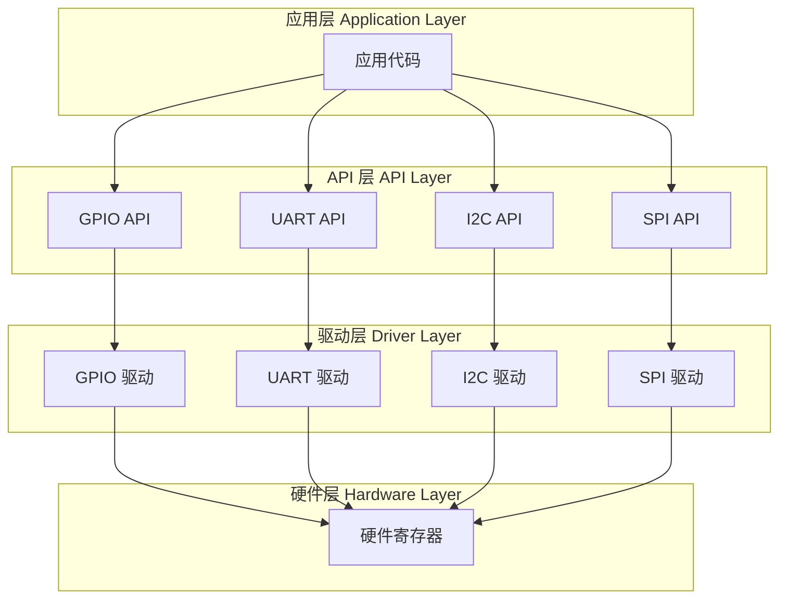
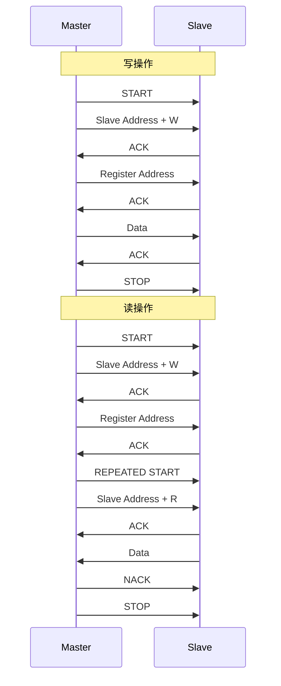
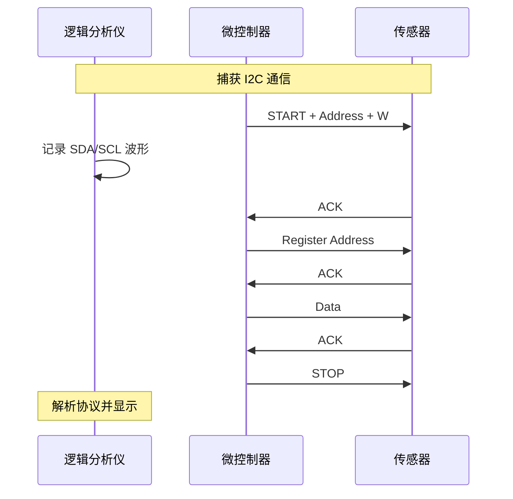

# 驱动开发

!!! info "学习目标"
    - 理解 Zephyr 驱动模型和设备驱动架构
    - 掌握常用外设 API（GPIO、UART、I2C、SPI、ADC、PWM）
    - 学会编写自定义驱动程序
    - 掌握驱动调试技巧和最佳实践
    - 完成实际驱动开发项目

## Zephyr 驱动模型

### 驱动架构概览

Zephyr 采用分层的驱动架构，将应用层、API 层、驱动层和硬件层清晰分离：




**架构优势**：

- **抽象性**：应用代码不直接操作硬件，通过统一的 API 访问
- **可移植性**：更换硬件平台只需替换驱动层，应用代码无需修改
- **可扩展性**：添加新设备只需实现标准 API 接口
- **可维护性**：清晰的分层结构便于代码维护和调试

### 设备模型

Zephyr 使用三个核心结构体来描述设备：

#### 1. device 结构体

设备实例，代表系统中的一个具体设备：

```c
struct device {
    const char *name;              // 设备名称
    const void *config;            // 设备配置（只读）
    const void *api;               // 驱动 API 函数表
    void *data;                    // 设备运行时数据
    // ... 其他字段
};
```

#### 2. device_config 结构体

设备配置信息（编译时确定，存储在 ROM 中）：

```c
struct my_device_config {
    uint32_t base_addr;            // 硬件基地址
    uint32_t clock_freq;           // 时钟频率
    uint8_t irq_num;               // 中断号
    // ... 其他配置
};
```

#### 3. device_data 结构体

设备运行时数据（存储在 RAM 中）：

```c
struct my_device_data {
    struct k_mutex lock;           // 互斥锁
    uint32_t transfer_count;       // 传输计数
    bool is_initialized;           // 初始化标志
    // ... 其他运行时数据
};
```

### 驱动 API

驱动 API 定义了设备的操作接口，以 GPIO 为例：

```c
struct gpio_driver_api {
    int (*pin_configure)(const struct device *dev, gpio_pin_t pin,
                         gpio_flags_t flags);
    int (*port_get_raw)(const struct device *dev, gpio_port_value_t *value);
    int (*port_set_masked_raw)(const struct device *dev,
                               gpio_port_pins_t mask,
                               gpio_port_value_t value);
    int (*port_set_bits_raw)(const struct device *dev, gpio_port_pins_t pins);
    int (*port_clear_bits_raw)(const struct device *dev, gpio_port_pins_t pins);
    int (*port_toggle_bits)(const struct device *dev, gpio_port_pins_t pins);
    int (*pin_interrupt_configure)(const struct device *dev, gpio_pin_t pin,
                                   enum gpio_int_mode mode,
                                   enum gpio_int_trig trig);
    // ... 其他函数指针
};
```


### 驱动初始化

Zephyr 使用 `DEVICE_DT_DEFINE()` 宏来定义和初始化设备：

```c
DEVICE_DT_DEFINE(
    node_id,                       // 设备树节点 ID
    init_fn,                       // 初始化函数
    NULL,                          // 电源管理函数（可选）
    &device_data,                  // 设备数据指针
    &device_config,                // 设备配置指针
    POST_KERNEL,                   // 初始化级别
    CONFIG_KERNEL_INIT_PRIORITY_DEVICE,  // 初始化优先级
    &driver_api                    // 驱动 API 指针
);
```

**初始化级别**（按顺序执行）：

| 级别 | 说明 | 典型用途 |
|------|------|----------|
| `PRE_KERNEL_1` | 内核启动前第一阶段 | 关键硬件初始化（时钟、中断控制器） |
| `PRE_KERNEL_2` | 内核启动前第二阶段 | 基础外设初始化（定时器、串口） |
| `POST_KERNEL` | 内核启动后 | 一般外设初始化（GPIO、I2C、SPI） |
| `APPLICATION` | 应用层初始化 | 应用相关设备初始化 |

**初始化优先级**：同一级别内的初始化顺序，数值越小越先执行（0-99）。

### 设备树绑定

驱动通过设备树绑定（bindings）与硬件关联。绑定文件定义了设备树节点的属性：

```yaml
# dts/bindings/gpio/my-gpio.yaml
description: My GPIO controller

compatible: "manufacturer,my-gpio"

include: gpio-controller.yaml

properties:
  reg:
    required: true
    description: Register base address and size
  
  interrupts:
    required: true
    description: Interrupt number
  
  clock-frequency:
    type: int
    required: true
    description: Clock frequency in Hz

gpio-cells:
  - pin
  - flags
```

设备树中使用：

```dts
my_gpio: gpio@40020000 {
    compatible = "manufacturer,my-gpio";
    reg = <0x40020000 0x400>;
    interrupts = <7 0>;
    clock-frequency = <48000000>;
    gpio-controller;
    #gpio-cells = <2>;
    status = "okay";
};
```


## 常用外设 API

### GPIO API

GPIO（通用输入输出）是最基础的外设接口。

#### 核心函数

```c
#include <zephyr/drivers/gpio.h>

// 配置引脚
int gpio_pin_configure(const struct device *port, gpio_pin_t pin, 
                       gpio_flags_t flags);

// 设置引脚电平
int gpio_pin_set(const struct device *port, gpio_pin_t pin, int value);

// 读取引脚电平
int gpio_pin_get(const struct device *port, gpio_pin_t pin);

// 翻转引脚电平
int gpio_pin_toggle(const struct device *port, gpio_pin_t pin);

// 配置引脚中断
int gpio_pin_interrupt_configure(const struct device *port, gpio_pin_t pin,
                                 enum gpio_int_mode mode, 
                                 enum gpio_int_trig trig);

// 添加中断回调
int gpio_add_callback(const struct device *port, 
                      struct gpio_callback *callback);
```

#### 使用示例

```c
#include <zephyr/kernel.h>
#include <zephyr/drivers/gpio.h>

// 从设备树获取 LED 设备
#define LED0_NODE DT_ALIAS(led0)
static const struct gpio_dt_spec led = GPIO_DT_SPEC_GET(LED0_NODE, gpios);

// 从设备树获取按钮设备
#define SW0_NODE DT_ALIAS(sw0)
static const struct gpio_dt_spec button = GPIO_DT_SPEC_GET(SW0_NODE, gpios);

// 按钮中断回调
static struct gpio_callback button_cb_data;

void button_pressed(const struct device *dev, struct gpio_callback *cb,
                    uint32_t pins)
{
    printk("Button pressed at %u\n", k_cycle_get_32());
    gpio_pin_toggle(led.port, led.pin);
}

int main(void)
{
    int ret;

    // 检查设备是否就绪
    if (!device_is_ready(led.port)) {
        printk("LED device not ready\n");
        return -1;
    }

    if (!device_is_ready(button.port)) {
        printk("Button device not ready\n");
        return -1;
    }

    // 配置 LED 为输出
    ret = gpio_pin_configure_dt(&led, GPIO_OUTPUT_ACTIVE);
    if (ret < 0) {
        printk("Failed to configure LED\n");
        return ret;
    }

    // 配置按钮为输入，带上拉电阻
    ret = gpio_pin_configure_dt(&button, GPIO_INPUT);
    if (ret < 0) {
        printk("Failed to configure button\n");
        return ret;
    }

    // 配置按钮中断（下降沿触发）
    ret = gpio_pin_interrupt_configure_dt(&button, GPIO_INT_EDGE_TO_ACTIVE);
    if (ret < 0) {
        printk("Failed to configure button interrupt\n");
        return ret;
    }

    // 初始化并添加中断回调
    gpio_init_callback(&button_cb_data, button_pressed, BIT(button.pin));
    gpio_add_callback(button.port, &button_cb_data);

    printk("GPIO example started\n");

    // 主循环：LED 闪烁
    while (1) {
        gpio_pin_toggle_dt(&led);
        k_msleep(1000);
    }

    return 0;
}
```


### UART API

UART（通用异步收发器）用于串口通信。

#### 核心函数

```c
#include <zephyr/drivers/uart.h>

// 配置 UART
int uart_configure(const struct device *dev, 
                   const struct uart_config *cfg);

// 轮询模式发送单字节
int uart_poll_out(const struct device *dev, unsigned char out_char);

// 轮询模式接收单字节
int uart_poll_in(const struct device *dev, unsigned char *p_char);

// 中断模式：启用接收中断
int uart_irq_rx_enable(const struct device *dev);

// 中断模式：设置回调函数
int uart_irq_callback_set(const struct device *dev, 
                          uart_irq_callback_user_data_t cb);

// 检查是否有数据可读
int uart_irq_rx_ready(const struct device *dev);

// 从 FIFO 读取数据
int uart_fifo_read(const struct device *dev, uint8_t *rx_data, 
                   const int size);

// 向 FIFO 写入数据
int uart_fifo_fill(const struct device *dev, const uint8_t *tx_data, 
                   int size);
```

#### 使用示例（轮询模式）

```c
#include <zephyr/kernel.h>
#include <zephyr/drivers/uart.h>

const struct device *uart = DEVICE_DT_GET(DT_NODELABEL(uart0));

int main(void)
{
    if (!device_is_ready(uart)) {
        printk("UART device not ready\n");
        return -1;
    }

    const char *msg = "Hello, UART!\r\n";
    
    // 发送字符串
    for (int i = 0; msg[i] != '\0'; i++) {
        uart_poll_out(uart, msg[i]);
    }

    // 接收并回显
    while (1) {
        unsigned char c;
        if (uart_poll_in(uart, &c) == 0) {
            uart_poll_out(uart, c);  // 回显
        }
        k_msleep(10);
    }

    return 0;
}
```

#### 使用示例（中断模式）

```c
#include <zephyr/kernel.h>
#include <zephyr/drivers/uart.h>

const struct device *uart = DEVICE_DT_GET(DT_NODELABEL(uart0));

static void uart_callback(const struct device *dev, void *user_data)
{
    uint8_t c;

    if (!uart_irq_update(dev)) {
        return;
    }

    // 检查是否有数据可读
    if (uart_irq_rx_ready(dev)) {
        // 读取数据
        while (uart_fifo_read(dev, &c, 1) == 1) {
            // 回显
            uart_poll_out(dev, c);
            
            if (c == '\r') {
                uart_poll_out(dev, '\n');
            }
        }
    }
}

int main(void)
{
    if (!device_is_ready(uart)) {
        printk("UART device not ready\n");
        return -1;
    }

    // 设置中断回调
    uart_irq_callback_set(uart, uart_callback);

    // 启用接收中断
    uart_irq_rx_enable(uart);

    printk("UART interrupt mode enabled\n");

    while (1) {
        k_sleep(K_FOREVER);
    }

    return 0;
}
```


### I2C API

I2C（Inter-Integrated Circuit）是常用的两线式串行总线。

#### 核心函数

```c
#include <zephyr/drivers/i2c.h>

// 配置 I2C
int i2c_configure(const struct device *dev, uint32_t dev_config);

// 写入数据
int i2c_write(const struct device *dev, const uint8_t *buf, 
              uint32_t num_bytes, uint16_t addr);

// 读取数据
int i2c_read(const struct device *dev, uint8_t *buf, 
             uint32_t num_bytes, uint16_t addr);

// 写后读（常用于寄存器读取）
int i2c_write_read(const struct device *dev, uint16_t addr,
                   const void *write_buf, size_t num_write,
                   void *read_buf, size_t num_read);

// 传输多个消息
int i2c_transfer(const struct device *dev, struct i2c_msg *msgs,
                 uint8_t num_msgs, uint16_t addr);
```

#### I2C 时序图



#### 使用示例

```c
#include <zephyr/kernel.h>
#include <zephyr/drivers/i2c.h>

#define I2C_NODE DT_NODELABEL(i2c0)
const struct device *i2c_dev = DEVICE_DT_GET(I2C_NODE);

// 假设连接了一个 I2C EEPROM，地址为 0x50
#define EEPROM_ADDR 0x50

int main(void)
{
    int ret;
    uint8_t write_buf[3];
    uint8_t read_buf[2];

    if (!device_is_ready(i2c_dev)) {
        printk("I2C device not ready\n");
        return -1;
    }

    // 配置 I2C（标准模式 100kHz）
    uint32_t i2c_cfg = I2C_SPEED_SET(I2C_SPEED_STANDARD) | I2C_MODE_CONTROLLER;
    ret = i2c_configure(i2c_dev, i2c_cfg);
    if (ret) {
        printk("I2C configure failed: %d\n", ret);
        return ret;
    }

    // 写入数据到 EEPROM 地址 0x0010
    write_buf[0] = 0x00;  // 地址高字节
    write_buf[1] = 0x10;  // 地址低字节
    write_buf[2] = 0xAB;  // 数据
    ret = i2c_write(i2c_dev, write_buf, sizeof(write_buf), EEPROM_ADDR);
    if (ret) {
        printk("I2C write failed: %d\n", ret);
        return ret;
    }

    // 等待 EEPROM 写入完成
    k_msleep(10);

    // 从 EEPROM 地址 0x0010 读取数据
    uint8_t addr_buf[2] = {0x00, 0x10};
    ret = i2c_write_read(i2c_dev, EEPROM_ADDR,
                         addr_buf, sizeof(addr_buf),
                         read_buf, 1);
    if (ret) {
        printk("I2C read failed: %d\n", ret);
        return ret;
    }

    printk("Read data: 0x%02X\n", read_buf[0]);

    return 0;
}
```


### SPI API

SPI（Serial Peripheral Interface）是高速全双工串行总线。

#### 核心函数

```c
#include <zephyr/drivers/spi.h>

// 配置 SPI
int spi_transceive(const struct device *dev,
                   const struct spi_config *config,
                   const struct spi_buf_set *tx_bufs,
                   const struct spi_buf_set *rx_bufs);

// 释放 SPI 总线
int spi_release(const struct device *dev, 
                const struct spi_config *config);
```

#### 使用示例

```c
#include <zephyr/kernel.h>
#include <zephyr/drivers/spi.h>

#define SPI_NODE DT_NODELABEL(spi1)
const struct device *spi_dev = DEVICE_DT_GET(SPI_NODE);

// SPI 配置
struct spi_config spi_cfg = {
    .frequency = 1000000,  // 1 MHz
    .operation = SPI_WORD_SET(8) | SPI_TRANSFER_MSB |
                 SPI_MODE_CPOL | SPI_MODE_CPHA,
    .slave = 0,
    .cs = NULL,  // 使用软件控制 CS
};

int main(void)
{
    int ret;
    uint8_t tx_data[3] = {0x01, 0x02, 0x03};
    uint8_t rx_data[3] = {0};

    if (!device_is_ready(spi_dev)) {
        printk("SPI device not ready\n");
        return -1;
    }

    // 准备发送缓冲区
    struct spi_buf tx_buf = {
        .buf = tx_data,
        .len = sizeof(tx_data)
    };
    struct spi_buf_set tx = {
        .buffers = &tx_buf,
        .count = 1
    };

    // 准备接收缓冲区
    struct spi_buf rx_buf = {
        .buf = rx_data,
        .len = sizeof(rx_data)
    };
    struct spi_buf_set rx = {
        .buffers = &rx_buf,
        .count = 1
    };

    // 执行 SPI 传输
    ret = spi_transceive(spi_dev, &spi_cfg, &tx, &rx);
    if (ret) {
        printk("SPI transceive failed: %d\n", ret);
        return ret;
    }

    printk("Received: 0x%02X 0x%02X 0x%02X\n", 
           rx_data[0], rx_data[1], rx_data[2]);

    return 0;
}
```

### ADC API

ADC（模数转换器）用于读取模拟信号。

#### 核心函数

```c
#include <zephyr/drivers/adc.h>

// 配置 ADC 通道
int adc_channel_setup(const struct device *dev,
                      const struct adc_channel_cfg *channel_cfg);

// 读取 ADC 值
int adc_read(const struct device *dev,
             const struct adc_sequence *sequence);
```

#### 使用示例

```c
#include <zephyr/kernel.h>
#include <zephyr/drivers/adc.h>

#define ADC_NODE DT_NODELABEL(adc0)
const struct device *adc_dev = DEVICE_DT_GET(ADC_NODE);

#define ADC_CHANNEL 0
#define ADC_RESOLUTION 12
#define ADC_GAIN ADC_GAIN_1
#define ADC_REFERENCE ADC_REF_INTERNAL
#define ADC_ACQUISITION_TIME ADC_ACQ_TIME_DEFAULT

int16_t sample_buffer[1];

int main(void)
{
    int ret;

    if (!device_is_ready(adc_dev)) {
        printk("ADC device not ready\n");
        return -1;
    }

    // 配置 ADC 通道
    struct adc_channel_cfg channel_cfg = {
        .gain = ADC_GAIN,
        .reference = ADC_REFERENCE,
        .acquisition_time = ADC_ACQUISITION_TIME,
        .channel_id = ADC_CHANNEL,
    };
    ret = adc_channel_setup(adc_dev, &channel_cfg);
    if (ret) {
        printk("ADC channel setup failed: %d\n", ret);
        return ret;
    }

    // 配置 ADC 序列
    struct adc_sequence sequence = {
        .channels = BIT(ADC_CHANNEL),
        .buffer = sample_buffer,
        .buffer_size = sizeof(sample_buffer),
        .resolution = ADC_RESOLUTION,
    };

    while (1) {
        // 读取 ADC 值
        ret = adc_read(adc_dev, &sequence);
        if (ret) {
            printk("ADC read failed: %d\n", ret);
        } else {
            int32_t val_mv = sample_buffer[0];
            // 转换为毫伏
            adc_raw_to_millivolts(adc_ref_internal(adc_dev),
                                  ADC_GAIN,
                                  ADC_RESOLUTION,
                                  &val_mv);
            printk("ADC value: %d mV\n", val_mv);
        }

        k_msleep(1000);
    }

    return 0;
}
```


### PWM API

PWM（脉冲宽度调制）用于控制电机、LED 亮度等。

#### 核心函数

```c
#include <zephyr/drivers/pwm.h>

// 设置 PWM 周期和脉冲宽度（以周期数为单位）
int pwm_set_cycles(const struct device *dev, uint32_t channel,
                   uint32_t period, uint32_t pulse, pwm_flags_t flags);

// 设置 PWM 周期和脉冲宽度（以纳秒为单位）
static inline int pwm_set(const struct device *dev, uint32_t channel,
                          uint32_t period, uint32_t pulse, pwm_flags_t flags);
```

#### 使用示例

```c
#include <zephyr/kernel.h>
#include <zephyr/drivers/pwm.h>

#define PWM_NODE DT_NODELABEL(pwm0)
static const struct pwm_dt_spec pwm_led = PWM_DT_SPEC_GET(PWM_NODE);

#define PWM_PERIOD_NS 1000000  // 1ms = 1kHz

int main(void)
{
    uint32_t pulse_width = 0;
    uint32_t step = PWM_PERIOD_NS / 100;  // 1% 步进
    int direction = 1;

    if (!device_is_ready(pwm_led.dev)) {
        printk("PWM device not ready\n");
        return -1;
    }

    printk("PWM LED breathing effect\n");

    while (1) {
        // 设置 PWM 占空比
        int ret = pwm_set_dt(&pwm_led, PWM_PERIOD_NS, pulse_width);
        if (ret) {
            printk("PWM set failed: %d\n", ret);
            return ret;
        }

        // 调整脉冲宽度（呼吸灯效果）
        if (direction == 1) {
            pulse_width += step;
            if (pulse_width >= PWM_PERIOD_NS) {
                pulse_width = PWM_PERIOD_NS;
                direction = -1;
            }
        } else {
            if (pulse_width <= step) {
                pulse_width = 0;
                direction = 1;
            } else {
                pulse_width -= step;
            }
        }

        k_msleep(20);
    }

    return 0;
}
```

!!! tip "占空比计算"
    占空比 = (pulse_width / period) × 100%
    
    例如：period = 1000000ns (1ms)，pulse_width = 500000ns (0.5ms)
    
    占空比 = 50%


## 驱动开发实战

### 示例 1：LED 驱动

这是一个简单的 LED 驱动示例，展示了驱动开发的完整流程。

#### 1. 设备树绑定文件

创建 `dts/bindings/led/custom-led.yaml`：

```yaml
description: Custom LED driver

compatible: "custom,led"

include: base.yaml

properties:
  gpios:
    type: phandle-array
    required: true
    description: GPIO pin for LED control

  label:
    type: string
    description: Human readable string describing the LED
```

#### 2. 设备树配置

在板级设备树文件中添加：

```dts
/ {
    leds {
        compatible = "gpio-leds";
        
        custom_led0: led_0 {
            compatible = "custom,led";
            gpios = <&gpio0 13 GPIO_ACTIVE_LOW>;
            label = "Custom LED 0";
        };
    };
};
```

#### 3. 驱动源码

创建 `drivers/led/custom_led.c`：

```c
#define DT_DRV_COMPAT custom_led

#include <zephyr/kernel.h>
#include <zephyr/device.h>
#include <zephyr/drivers/gpio.h>
#include <zephyr/logging/log.h>

LOG_MODULE_REGISTER(custom_led, CONFIG_LED_LOG_LEVEL);

/* 设备配置结构（ROM） */
struct custom_led_config {
    struct gpio_dt_spec gpio;
    const char *label;
};

/* 设备数据结构（RAM） */
struct custom_led_data {
    bool state;
};

/* LED API 函数 */
static int custom_led_on(const struct device *dev)
{
    const struct custom_led_config *config = dev->config;
    struct custom_led_data *data = dev->data;
    int ret;

    ret = gpio_pin_set_dt(&config->gpio, 1);
    if (ret == 0) {
        data->state = true;
        LOG_DBG("LED %s turned ON", config->label);
    }

    return ret;
}

static int custom_led_off(const struct device *dev)
{
    const struct custom_led_config *config = dev->config;
    struct custom_led_data *data = dev->data;
    int ret;

    ret = gpio_pin_set_dt(&config->gpio, 0);
    if (ret == 0) {
        data->state = false;
        LOG_DBG("LED %s turned OFF", config->label);
    }

    return ret;
}

static int custom_led_toggle(const struct device *dev)
{
    struct custom_led_data *data = dev->data;

    if (data->state) {
        return custom_led_off(dev);
    } else {
        return custom_led_on(dev);
    }
}

static bool custom_led_get_state(const struct device *dev)
{
    struct custom_led_data *data = dev->data;
    return data->state;
}

/* 驱动 API 结构 */
static const struct led_driver_api custom_led_api = {
    .on = custom_led_on,
    .off = custom_led_off,
    .toggle = custom_led_toggle,
    .get_state = custom_led_get_state,
};

/* 驱动初始化函数 */
static int custom_led_init(const struct device *dev)
{
    const struct custom_led_config *config = dev->config;
    int ret;

    /* 检查 GPIO 设备是否就绪 */
    if (!device_is_ready(config->gpio.port)) {
        LOG_ERR("GPIO device not ready");
        return -ENODEV;
    }

    /* 配置 GPIO 为输出 */
    ret = gpio_pin_configure_dt(&config->gpio, GPIO_OUTPUT_INACTIVE);
    if (ret < 0) {
        LOG_ERR("Failed to configure GPIO: %d", ret);
        return ret;
    }

    LOG_INF("LED %s initialized", config->label);

    return 0;
}

/* 设备实例化宏 */
#define CUSTOM_LED_DEFINE(inst)                                         \
    static const struct custom_led_config custom_led_config_##inst = { \
        .gpio = GPIO_DT_SPEC_INST_GET(inst, gpios),                    \
        .label = DT_INST_PROP_OR(inst, label, ""),                     \
    };                                                                  \
                                                                        \
    static struct custom_led_data custom_led_data_##inst;              \
                                                                        \
    DEVICE_DT_INST_DEFINE(inst,                                        \
                          custom_led_init,                             \
                          NULL,                                        \
                          &custom_led_data_##inst,                     \
                          &custom_led_config_##inst,                   \
                          POST_KERNEL,                                 \
                          CONFIG_LED_INIT_PRIORITY,                    \
                          &custom_led_api);

/* 为每个设备树实例创建设备 */
DT_INST_FOREACH_STATUS_OKAY(CUSTOM_LED_DEFINE)
```

#### 4. 应用代码

```c
#include <zephyr/kernel.h>
#include <zephyr/device.h>

const struct device *led = DEVICE_DT_GET(DT_NODELABEL(custom_led0));

int main(void)
{
    if (!device_is_ready(led)) {
        printk("LED device not ready\n");
        return -1;
    }

    printk("Custom LED driver example\n");

    while (1) {
        led_api->toggle(led);
        k_msleep(500);
    }

    return 0;
}
```


### 示例 2：I2C 温湿度传感器驱动（SHT3x）

这是一个完整的 I2C 传感器驱动示例。

#### 1. 设备树绑定文件

创建 `dts/bindings/sensor/sensirion,sht3x.yaml`：

```yaml
description: Sensirion SHT3x temperature and humidity sensor

compatible: "sensirion,sht3x"

include: [sensor-device.yaml, i2c-device.yaml]

properties:
  repeatability:
    type: string
    default: "high"
    enum:
      - "high"
      - "medium"
      - "low"
    description: Measurement repeatability level
```

#### 2. 设备树配置

```dts
&i2c0 {
    status = "okay";
    
    sht3x: sht3x@44 {
        compatible = "sensirion,sht3x";
        reg = <0x44>;
        repeatability = "high";
    };
};
```

#### 3. 驱动头文件

创建 `drivers/sensor/sht3x/sht3x.h`：

```c
#ifndef ZEPHYR_DRIVERS_SENSOR_SHT3X_H_
#define ZEPHYR_DRIVERS_SENSOR_SHT3X_H_

#include <zephyr/device.h>
#include <zephyr/drivers/i2c.h>

/* SHT3x 命令 */
#define SHT3X_CMD_MEASURE_HIGH_REP   0x2400
#define SHT3X_CMD_MEASURE_MEDIUM_REP 0x240B
#define SHT3X_CMD_MEASURE_LOW_REP    0x2416
#define SHT3X_CMD_SOFT_RESET         0x30A2
#define SHT3X_CMD_READ_STATUS        0xF32D

/* 设备配置 */
struct sht3x_config {
    struct i2c_dt_spec i2c;
    uint8_t repeatability;
};

/* 设备数据 */
struct sht3x_data {
    int16_t temperature;  // 温度 × 100
    uint16_t humidity;    // 湿度 × 100
};

#endif /* ZEPHYR_DRIVERS_SENSOR_SHT3X_H_ */
```

#### 4. 驱动源码

创建 `drivers/sensor/sht3x/sht3x.c`：

```c
#define DT_DRV_COMPAT sensirion_sht3x

#include <zephyr/kernel.h>
#include <zephyr/device.h>
#include <zephyr/drivers/sensor.h>
#include <zephyr/logging/log.h>
#include "sht3x.h"

LOG_MODULE_REGISTER(sht3x, CONFIG_SENSOR_LOG_LEVEL);

/* CRC-8 校验 */
static uint8_t sht3x_crc8(const uint8_t *data, size_t len)
{
    uint8_t crc = 0xFF;
    
    for (size_t i = 0; i < len; i++) {
        crc ^= data[i];
        for (uint8_t bit = 8; bit > 0; --bit) {
            if (crc & 0x80) {
                crc = (crc << 1) ^ 0x31;
            } else {
                crc = (crc << 1);
            }
        }
    }
    
    return crc;
}

/* 发送命令 */
static int sht3x_write_command(const struct device *dev, uint16_t cmd)
{
    const struct sht3x_config *config = dev->config;
    uint8_t buf[2];
    
    buf[0] = cmd >> 8;
    buf[1] = cmd & 0xFF;
    
    return i2c_write_dt(&config->i2c, buf, sizeof(buf));
}

/* 读取测量数据 */
static int sht3x_read_measurement(const struct device *dev)
{
    const struct sht3x_config *config = dev->config;
    struct sht3x_data *data = dev->data;
    uint8_t buf[6];
    int ret;
    
    /* 读取 6 字节数据（温度 2 字节 + CRC 1 字节 + 湿度 2 字节 + CRC 1 字节） */
    ret = i2c_read_dt(&config->i2c, buf, sizeof(buf));
    if (ret < 0) {
        LOG_ERR("Failed to read measurement: %d", ret);
        return ret;
    }
    
    /* 验证温度 CRC */
    if (sht3x_crc8(buf, 2) != buf[2]) {
        LOG_ERR("Temperature CRC mismatch");
        return -EIO;
    }
    
    /* 验证湿度 CRC */
    if (sht3x_crc8(&buf[3], 2) != buf[5]) {
        LOG_ERR("Humidity CRC mismatch");
        return -EIO;
    }
    
    /* 转换温度：T = -45 + 175 × (raw / 65535) */
    uint16_t temp_raw = (buf[0] << 8) | buf[1];
    data->temperature = -4500 + ((17500 * (int32_t)temp_raw) / 65535);
    
    /* 转换湿度：RH = 100 × (raw / 65535) */
    uint16_t hum_raw = (buf[3] << 8) | buf[4];
    data->humidity = (10000 * (uint32_t)hum_raw) / 65535;
    
    LOG_DBG("Temperature: %d.%02d °C, Humidity: %d.%02d %%",
            data->temperature / 100, abs(data->temperature % 100),
            data->humidity / 100, data->humidity % 100);
    
    return 0;
}

/* 采样函数 */
static int sht3x_sample_fetch(const struct device *dev,
                              enum sensor_channel chan)
{
    const struct sht3x_config *config = dev->config;
    uint16_t cmd;
    int ret;
    
    if (chan != SENSOR_CHAN_ALL &&
        chan != SENSOR_CHAN_AMBIENT_TEMP &&
        chan != SENSOR_CHAN_HUMIDITY) {
        return -ENOTSUP;
    }
    
    /* 选择测量命令 */
    switch (config->repeatability) {
    case 0: /* high */
        cmd = SHT3X_CMD_MEASURE_HIGH_REP;
        break;
    case 1: /* medium */
        cmd = SHT3X_CMD_MEASURE_MEDIUM_REP;
        break;
    case 2: /* low */
        cmd = SHT3X_CMD_MEASURE_LOW_REP;
        break;
    default:
        return -EINVAL;
    }
    
    /* 发送测量命令 */
    ret = sht3x_write_command(dev, cmd);
    if (ret < 0) {
        LOG_ERR("Failed to start measurement: %d", ret);
        return ret;
    }
    
    /* 等待测量完成（高精度需要 15ms） */
    k_msleep(20);
    
    /* 读取测量结果 */
    return sht3x_read_measurement(dev);
}

/* 获取通道值 */
static int sht3x_channel_get(const struct device *dev,
                             enum sensor_channel chan,
                             struct sensor_value *val)
{
    struct sht3x_data *data = dev->data;
    
    switch (chan) {
    case SENSOR_CHAN_AMBIENT_TEMP:
        val->val1 = data->temperature / 100;
        val->val2 = (data->temperature % 100) * 10000;
        break;
    case SENSOR_CHAN_HUMIDITY:
        val->val1 = data->humidity / 100;
        val->val2 = (data->humidity % 100) * 10000;
        break;
    default:
        return -ENOTSUP;
    }
    
    return 0;
}

/* 传感器 API */
static const struct sensor_driver_api sht3x_api = {
    .sample_fetch = sht3x_sample_fetch,
    .channel_get = sht3x_channel_get,
};

/* 初始化函数 */
static int sht3x_init(const struct device *dev)
{
    const struct sht3x_config *config = dev->config;
    int ret;
    
    /* 检查 I2C 总线是否就绪 */
    if (!device_is_ready(config->i2c.bus)) {
        LOG_ERR("I2C bus not ready");
        return -ENODEV;
    }
    
    /* 软复位 */
    ret = sht3x_write_command(dev, SHT3X_CMD_SOFT_RESET);
    if (ret < 0) {
        LOG_ERR("Failed to reset sensor: %d", ret);
        return ret;
    }
    
    k_msleep(10);
    
    LOG_INF("SHT3x sensor initialized");
    
    return 0;
}

/* 设备实例化 */
#define SHT3X_DEFINE(inst)                                              \
    static struct sht3x_data sht3x_data_##inst;                        \
                                                                        \
    static const struct sht3x_config sht3x_config_##inst = {           \
        .i2c = I2C_DT_SPEC_INST_GET(inst),                             \
        .repeatability = DT_INST_ENUM_IDX(inst, repeatability),        \
    };                                                                  \
                                                                        \
    DEVICE_DT_INST_DEFINE(inst,                                        \
                          sht3x_init,                                  \
                          NULL,                                        \
                          &sht3x_data_##inst,                          \
                          &sht3x_config_##inst,                        \
                          POST_KERNEL,                                 \
                          CONFIG_SENSOR_INIT_PRIORITY,                 \
                          &sht3x_api);

DT_INST_FOREACH_STATUS_OKAY(SHT3X_DEFINE)
```


#### 5. 应用代码

```c
#include <zephyr/kernel.h>
#include <zephyr/device.h>
#include <zephyr/drivers/sensor.h>

const struct device *sht3x = DEVICE_DT_GET(DT_NODELABEL(sht3x));

int main(void)
{
    struct sensor_value temp, hum;
    int ret;

    if (!device_is_ready(sht3x)) {
        printk("SHT3x device not ready\n");
        return -1;
    }

    printk("SHT3x sensor example\n");

    while (1) {
        /* 采样 */
        ret = sensor_sample_fetch(sht3x);
        if (ret) {
            printk("Failed to fetch sample: %d\n", ret);
            k_msleep(1000);
            continue;
        }

        /* 获取温度 */
        ret = sensor_channel_get(sht3x, SENSOR_CHAN_AMBIENT_TEMP, &temp);
        if (ret) {
            printk("Failed to get temperature: %d\n", ret);
        } else {
            printk("Temperature: %d.%02d °C\n", 
                   temp.val1, temp.val2 / 10000);
        }

        /* 获取湿度 */
        ret = sensor_channel_get(sht3x, SENSOR_CHAN_HUMIDITY, &hum);
        if (ret) {
            printk("Failed to get humidity: %d\n", ret);
        } else {
            printk("Humidity: %d.%02d %%\n", 
                   hum.val1, hum.val2 / 10000);
        }

        k_msleep(2000);
    }

    return 0;
}
```

#### 6. 项目结构

```
my_sht3x_project/
├── CMakeLists.txt
├── prj.conf
├── boards/
│   └── nrf52840dk_nrf52840.overlay
├── dts/
│   └── bindings/
│       └── sensor/
│           └── sensirion,sht3x.yaml
├── drivers/
│   └── sensor/
│       └── sht3x/
│           ├── CMakeLists.txt
│           ├── Kconfig
│           ├── sht3x.h
│           └── sht3x.c
└── src/
    └── main.c
```

#### 7. 配置文件

**prj.conf**:
```ini
CONFIG_I2C=y
CONFIG_SENSOR=y
CONFIG_SHT3X=y
CONFIG_LOG=y
CONFIG_SENSOR_LOG_LEVEL_DBG=y
```

**drivers/sensor/sht3x/Kconfig**:
```kconfig
config SHT3X
    bool "SHT3x temperature and humidity sensor"
    default y
    depends on DT_HAS_SENSIRION_SHT3X_ENABLED
    depends on I2C
    select SENSOR
    help
      Enable driver for SHT3x temperature and humidity sensor.
```

**drivers/sensor/sht3x/CMakeLists.txt**:
```cmake
zephyr_library()
zephyr_library_sources_ifdef(CONFIG_SHT3X sht3x.c)
```


### 示例 3：SPI Flash 驱动（简化版）

这是一个 SPI Flash 驱动的简化示例，展示 SPI 驱动开发。

#### 驱动源码

```c
#define DT_DRV_COMPAT jedec_spi_nor

#include <zephyr/kernel.h>
#include <zephyr/device.h>
#include <zephyr/drivers/spi.h>
#include <zephyr/logging/log.h>

LOG_MODULE_REGISTER(spi_flash, CONFIG_FLASH_LOG_LEVEL);

/* Flash 命令 */
#define CMD_READ_ID       0x9F
#define CMD_READ_DATA     0x03
#define CMD_WRITE_ENABLE  0x06
#define CMD_PAGE_PROGRAM  0x02
#define CMD_SECTOR_ERASE  0x20
#define CMD_READ_STATUS   0x05

/* 设备配置 */
struct spi_flash_config {
    struct spi_dt_spec spi;
    uint32_t size;
    uint32_t sector_size;
    uint32_t page_size;
};

/* 设备数据 */
struct spi_flash_data {
    struct k_mutex lock;
};

/* 发送命令 */
static int spi_flash_cmd(const struct device *dev, uint8_t cmd)
{
    const struct spi_flash_config *config = dev->config;
    uint8_t tx_buf[1] = {cmd};
    
    struct spi_buf tx = {
        .buf = tx_buf,
        .len = sizeof(tx_buf)
    };
    struct spi_buf_set tx_set = {
        .buffers = &tx,
        .count = 1
    };
    
    return spi_write_dt(&config->spi, &tx_set);
}

/* 读取 Flash ID */
static int spi_flash_read_id(const struct device *dev, uint8_t *id)
{
    const struct spi_flash_config *config = dev->config;
    uint8_t tx_buf[1] = {CMD_READ_ID};
    uint8_t rx_buf[4] = {0};
    
    struct spi_buf tx = {.buf = tx_buf, .len = 1};
    struct spi_buf_set tx_set = {.buffers = &tx, .count = 1};
    
    struct spi_buf rx = {.buf = rx_buf, .len = 4};
    struct spi_buf_set rx_set = {.buffers = &rx, .count = 1};
    
    int ret = spi_transceive_dt(&config->spi, &tx_set, &rx_set);
    if (ret == 0) {
        memcpy(id, &rx_buf[1], 3);  // 跳过第一个字节
    }
    
    return ret;
}

/* 等待 Flash 就绪 */
static int spi_flash_wait_ready(const struct device *dev)
{
    const struct spi_flash_config *config = dev->config;
    uint8_t tx_buf[1] = {CMD_READ_STATUS};
    uint8_t rx_buf[2] = {0};
    int timeout = 1000;
    
    struct spi_buf tx = {.buf = tx_buf, .len = 1};
    struct spi_buf_set tx_set = {.buffers = &tx, .count = 1};
    
    struct spi_buf rx = {.buf = rx_buf, .len = 2};
    struct spi_buf_set rx_set = {.buffers = &rx, .count = 1};
    
    while (timeout-- > 0) {
        int ret = spi_transceive_dt(&config->spi, &tx_set, &rx_set);
        if (ret < 0) {
            return ret;
        }
        
        /* 检查 BUSY 位（bit 0） */
        if ((rx_buf[1] & 0x01) == 0) {
            return 0;
        }
        
        k_msleep(1);
    }
    
    return -ETIMEDOUT;
}

/* 写使能 */
static int spi_flash_write_enable(const struct device *dev)
{
    int ret = spi_flash_cmd(dev, CMD_WRITE_ENABLE);
    if (ret < 0) {
        return ret;
    }
    
    k_msleep(1);
    return 0;
}

/* 读取数据 */
static int spi_flash_read(const struct device *dev, uint32_t addr,
                         void *data, size_t len)
{
    const struct spi_flash_config *config = dev->config;
    struct spi_flash_data *dev_data = dev->data;
    uint8_t tx_buf[4];
    int ret;
    
    k_mutex_lock(&dev_data->lock, K_FOREVER);
    
    /* 准备命令和地址 */
    tx_buf[0] = CMD_READ_DATA;
    tx_buf[1] = (addr >> 16) & 0xFF;
    tx_buf[2] = (addr >> 8) & 0xFF;
    tx_buf[3] = addr & 0xFF;
    
    struct spi_buf tx_bufs[] = {
        {.buf = tx_buf, .len = 4},
        {.buf = NULL, .len = len}  // 发送 dummy 字节
    };
    struct spi_buf_set tx = {.buffers = tx_bufs, .count = 2};
    
    struct spi_buf rx_bufs[] = {
        {.buf = NULL, .len = 4},    // 跳过命令和地址
        {.buf = data, .len = len}
    };
    struct spi_buf_set rx = {.buffers = rx_bufs, .count = 2};
    
    ret = spi_transceive_dt(&config->spi, &tx, &rx);
    
    k_mutex_unlock(&dev_data->lock);
    
    return ret;
}

/* 页编程 */
static int spi_flash_page_program(const struct device *dev, uint32_t addr,
                                  const void *data, size_t len)
{
    const struct spi_flash_config *config = dev->config;
    struct spi_flash_data *dev_data = dev->data;
    uint8_t tx_buf[4];
    int ret;
    
    if (len > config->page_size) {
        return -EINVAL;
    }
    
    k_mutex_lock(&dev_data->lock, K_FOREVER);
    
    /* 写使能 */
    ret = spi_flash_write_enable(dev);
    if (ret < 0) {
        goto unlock;
    }
    
    /* 准备命令和地址 */
    tx_buf[0] = CMD_PAGE_PROGRAM;
    tx_buf[1] = (addr >> 16) & 0xFF;
    tx_buf[2] = (addr >> 8) & 0xFF;
    tx_buf[3] = addr & 0xFF;
    
    struct spi_buf tx_bufs[] = {
        {.buf = tx_buf, .len = 4},
        {.buf = (void *)data, .len = len}
    };
    struct spi_buf_set tx = {.buffers = tx_bufs, .count = 2};
    
    ret = spi_write_dt(&config->spi, &tx);
    if (ret < 0) {
        goto unlock;
    }
    
    /* 等待编程完成 */
    ret = spi_flash_wait_ready(dev);
    
unlock:
    k_mutex_unlock(&dev_data->lock);
    return ret;
}

/* 扇区擦除 */
static int spi_flash_sector_erase(const struct device *dev, uint32_t addr)
{
    const struct spi_flash_config *config = dev->config;
    struct spi_flash_data *dev_data = dev->data;
    uint8_t tx_buf[4];
    int ret;
    
    k_mutex_lock(&dev_data->lock, K_FOREVER);
    
    /* 写使能 */
    ret = spi_flash_write_enable(dev);
    if (ret < 0) {
        goto unlock;
    }
    
    /* 准备命令和地址 */
    tx_buf[0] = CMD_SECTOR_ERASE;
    tx_buf[1] = (addr >> 16) & 0xFF;
    tx_buf[2] = (addr >> 8) & 0xFF;
    tx_buf[3] = addr & 0xFF;
    
    struct spi_buf tx = {.buf = tx_buf, .len = 4};
    struct spi_buf_set tx_set = {.buffers = &tx, .count = 1};
    
    ret = spi_write_dt(&config->spi, &tx_set);
    if (ret < 0) {
        goto unlock;
    }
    
    /* 等待擦除完成 */
    ret = spi_flash_wait_ready(dev);
    
unlock:
    k_mutex_unlock(&dev_data->lock);
    return ret;
}

/* 初始化函数 */
static int spi_flash_init(const struct device *dev)
{
    const struct spi_flash_config *config = dev->config;
    struct spi_flash_data *data = dev->data;
    uint8_t id[3];
    int ret;
    
    /* 检查 SPI 总线是否就绪 */
    if (!spi_is_ready_dt(&config->spi)) {
        LOG_ERR("SPI bus not ready");
        return -ENODEV;
    }
    
    /* 初始化互斥锁 */
    k_mutex_init(&data->lock);
    
    /* 读取 Flash ID */
    ret = spi_flash_read_id(dev, id);
    if (ret < 0) {
        LOG_ERR("Failed to read Flash ID: %d", ret);
        return ret;
    }
    
    LOG_INF("SPI Flash initialized, ID: %02X %02X %02X", 
            id[0], id[1], id[2]);
    
    return 0;
}

/* 设备实例化 */
#define SPI_FLASH_DEFINE(inst)                                          \
    static struct spi_flash_data spi_flash_data_##inst;                \
                                                                        \
    static const struct spi_flash_config spi_flash_config_##inst = {   \
        .spi = SPI_DT_SPEC_INST_GET(inst, SPI_WORD_SET(8) |           \
                                    SPI_TRANSFER_MSB, 0),              \
        .size = DT_INST_PROP(inst, size),                              \
        .sector_size = DT_INST_PROP(inst, sector_size),                \
        .page_size = DT_INST_PROP(inst, page_size),                    \
    };                                                                  \
                                                                        \
    DEVICE_DT_INST_DEFINE(inst,                                        \
                          spi_flash_init,                              \
                          NULL,                                        \
                          &spi_flash_data_##inst,                      \
                          &spi_flash_config_##inst,                    \
                          POST_KERNEL,                                 \
                          CONFIG_FLASH_INIT_PRIORITY,                  \
                          NULL);

DT_INST_FOREACH_STATUS_OKAY(SPI_FLASH_DEFINE)
```


## 驱动调试技巧

### 使用 printk 调试

最简单的调试方法是使用 `printk()` 输出调试信息：

```c
#include <zephyr/kernel.h>

int my_driver_function(const struct device *dev)
{
    printk("Entering my_driver_function\n");
    
    int ret = some_operation();
    printk("Operation returned: %d\n", ret);
    
    if (ret < 0) {
        printk("ERROR: Operation failed with code %d\n", ret);
        return ret;
    }
    
    printk("Exiting my_driver_function successfully\n");
    return 0;
}
```

!!! warning "printk 的限制"
    - `printk()` 是阻塞的，会影响实时性
    - 不能在 ISR 中使用（会导致系统崩溃）
    - 输出量大时会占用大量 CPU 时间

### 使用日志系统

Zephyr 的日志系统提供了更强大的调试功能：

```c
#include <zephyr/logging/log.h>

LOG_MODULE_REGISTER(my_driver, CONFIG_MY_DRIVER_LOG_LEVEL);

int my_driver_function(const struct device *dev)
{
    LOG_DBG("Entering function");  // 调试级别
    
    int ret = some_operation();
    LOG_INF("Operation completed: %d", ret);  // 信息级别
    
    if (ret < 0) {
        LOG_ERR("Operation failed: %d", ret);  // 错误级别
        return ret;
    }
    
    LOG_WRN("Warning: unusual condition");  // 警告级别
    
    return 0;
}
```

**日志级别配置**（prj.conf）：

```ini
CONFIG_LOG=y
CONFIG_LOG_DEFAULT_LEVEL=3  # 0=OFF, 1=ERR, 2=WRN, 3=INF, 4=DBG
CONFIG_MY_DRIVER_LOG_LEVEL_DBG=y
```

**日志优势**：

- 支持多种后端（UART、RTT、内存）
- 可以在 ISR 中使用（异步模式）
- 支持日志级别过滤
- 支持运行时动态调整日志级别

### 使用 GDB 调试驱动

#### 1. 启动 GDB 调试会话

```bash
# 构建带调试信息的固件
west build -b nrf52840dk_nrf52840 -- -DCMAKE_BUILD_TYPE=Debug

# 启动 GDB 服务器（J-Link）
JLinkGDBServer -device nRF52840_xxAA -if SWD -speed 4000

# 在另一个终端启动 GDB
arm-none-eabi-gdb build/zephyr/zephyr.elf
```

#### 2. GDB 常用命令

```gdb
# 连接到 GDB 服务器
(gdb) target remote localhost:2331

# 加载程序
(gdb) load

# 设置断点
(gdb) break my_driver_init
(gdb) break sht3x.c:123

# 运行程序
(gdb) continue

# 单步执行
(gdb) step      # 进入函数
(gdb) next      # 跳过函数
(gdb) finish    # 执行到函数返回

# 查看变量
(gdb) print ret
(gdb) print *dev
(gdb) print/x config->base_addr  # 十六进制显示

# 查看内存
(gdb) x/16xw 0x40000000  # 查看 16 个字（32位）

# 查看寄存器
(gdb) info registers
(gdb) print $r0

# 查看调用栈
(gdb) backtrace
(gdb) frame 2

# 查看线程
(gdb) info threads
(gdb) thread 3
```

#### 3. 调试 I2C 通信

```gdb
# 在 I2C 传输函数设置断点
(gdb) break i2c_transfer

# 运行到断点
(gdb) continue

# 查看传输参数
(gdb) print *msgs
(gdb) print msgs->buf[0]@msgs->len  # 查看缓冲区内容

# 单步执行，观察寄存器变化
(gdb) step
(gdb) x/4xw 0x40003000  # 查看 I2C 寄存器（假设基地址）
```


### 常见问题排查

#### 问题 1：设备未就绪

**症状**：
```
Device not ready
```

**排查步骤**：

1. 检查设备树配置是否正确
2. 检查设备状态是否为 "okay"
3. 检查驱动是否已编译进固件
4. 检查初始化顺序和优先级

```c
// 调试代码
const struct device *dev = DEVICE_DT_GET(DT_NODELABEL(my_device));

printk("Device pointer: %p\n", dev);
printk("Device name: %s\n", dev->name);
printk("Device ready: %d\n", device_is_ready(dev));

// 检查设备树节点
#if DT_NODE_HAS_STATUS(DT_NODELABEL(my_device), okay)
    printk("Device tree node is okay\n");
#else
    printk("Device tree node is NOT okay\n");
#endif
```

!!! danger "常见原因"
    - 设备树中 `status = "disabled"`
    - 驱动的 Kconfig 选项未启用
    - 初始化函数返回错误
    - 依赖的外设（如时钟、GPIO）未初始化

#### 问题 2：I2C 通信失败

**症状**：
```
I2C transfer failed: -5 (EIO)
```

**排查步骤**：

1. **检查硬件连接**
   - SDA、SCL 是否正确连接
   - 上拉电阻是否存在（通常 4.7kΩ）
   - 电源是否正常

2. **检查设备地址**
   ```c
   // 扫描 I2C 总线
   for (uint8_t addr = 0x08; addr < 0x78; addr++) {
       uint8_t dummy;
       int ret = i2c_read(i2c_dev, &dummy, 1, addr);
       if (ret == 0) {
           printk("Found device at 0x%02X\n", addr);
       }
   }
   ```

3. **检查时钟配置**
   ```c
   // 降低 I2C 速度测试
   uint32_t i2c_cfg = I2C_SPEED_SET(I2C_SPEED_STANDARD) | I2C_MODE_CONTROLLER;
   i2c_configure(i2c_dev, i2c_cfg);
   ```

4. **使用逻辑分析仪**
   - 观察 SDA、SCL 波形
   - 检查 START、STOP 条件
   - 验证 ACK/NACK 信号

#### 问题 3：中断未触发

**症状**：中断回调函数从未被调用

**排查步骤**：

1. **检查中断配置**
   ```c
   // 验证中断号
   printk("IRQ number: %d\n", DT_IRQN(DT_NODELABEL(my_device)));
   
   // 检查中断是否已启用
   printk("IRQ enabled: %d\n", irq_is_enabled(irq_num));
   ```

2. **检查中断优先级**
   ```c
   // 设备树中配置
   interrupts = <7 0>;  // IRQ 7, 优先级 0
   ```

3. **检查中断触发条件**
   ```c
   // GPIO 中断示例
   ret = gpio_pin_interrupt_configure_dt(&button, GPIO_INT_EDGE_TO_ACTIVE);
   if (ret < 0) {
       printk("Failed to configure interrupt: %d\n", ret);
   }
   ```

4. **添加调试输出**
   ```c
   void my_isr(const struct device *dev, struct gpio_callback *cb, uint32_t pins)
   {
       // 使用 printk 可能导致问题，使用日志系统
       LOG_INF("ISR triggered, pins: 0x%08X", pins);
   }
   ```

!!! warning "ISR 注意事项"
    - ISR 中不能使用阻塞函数（如 `k_sleep()`）
    - ISR 应该尽快返回
    - 复杂处理应该使用工作队列


### 使用硬件调试工具

#### 逻辑分析仪

逻辑分析仪可以捕获数字信号，分析通信协议：

**适用场景**：
- I2C、SPI、UART 通信调试
- GPIO 时序分析
- 中断触发时序验证

**推荐工具**：
- Saleae Logic Analyzer
- DSLogic
- PulseView + 廉价逻辑分析仪

**使用示例**（I2C 调试）：

1. 连接逻辑分析仪到 SDA、SCL 引脚
2. 设置采样率（至少 4 倍于 I2C 时钟频率）
3. 添加 I2C 协议解析器
4. 捕获数据并分析



#### 示波器

示波器用于分析模拟信号和精确时序：

**适用场景**：
- PWM 波形验证
- ADC 输入信号分析
- 信号完整性检查
- 上升/下降时间测量

**测量示例**（PWM 信号）：

```c
// 生成 PWM 信号
pwm_set_dt(&pwm_led, PWM_USEC(1000), PWM_USEC(500));  // 50% 占空比

// 使用示波器验证：
// - 周期：1ms
// - 高电平时间：0.5ms
// - 占空比：50%
```


## 驱动开发最佳实践

### 代码组织结构

**推荐的驱动文件组织**：

```
drivers/
└── my_subsystem/
    └── my_driver/
        ├── CMakeLists.txt       # 构建配置
        ├── Kconfig              # 配置选项
        ├── my_driver.h          # 内部头文件
        ├── my_driver.c          # 驱动实现
        └── my_driver_common.c   # 通用代码（可选）
```

**头文件组织**：

```c
/* my_driver.h - 内部头文件 */
#ifndef ZEPHYR_DRIVERS_MY_SUBSYSTEM_MY_DRIVER_H_
#define ZEPHYR_DRIVERS_MY_SUBSYSTEM_MY_DRIVER_H_

#include <zephyr/device.h>
#include <zephyr/drivers/my_subsystem.h>

/* 寄存器定义 */
#define REG_CONTROL    0x00
#define REG_STATUS     0x01
#define REG_DATA       0x02

/* 位定义 */
#define CONTROL_ENABLE BIT(0)
#define STATUS_READY   BIT(0)

/* 设备配置 */
struct my_driver_config {
    uint32_t base_addr;
    uint32_t clock_freq;
    uint8_t irq_num;
};

/* 设备数据 */
struct my_driver_data {
    struct k_mutex lock;
    bool is_initialized;
};

/* 内部函数声明 */
int my_driver_reg_read(const struct device *dev, uint8_t reg, uint8_t *val);
int my_driver_reg_write(const struct device *dev, uint8_t reg, uint8_t val);

#endif /* ZEPHYR_DRIVERS_MY_SUBSYSTEM_MY_DRIVER_H_ */
```

### 错误处理和返回值

**统一的错误码**：

```c
#include <zephyr/sys/errno.h>

int my_driver_operation(const struct device *dev)
{
    /* 参数检查 */
    if (dev == NULL) {
        return -EINVAL;  // 无效参数
    }

    /* 设备状态检查 */
    if (!device_is_ready(dev)) {
        return -ENODEV;  // 设备未就绪
    }

    /* 资源检查 */
    if (resource_not_available()) {
        return -EBUSY;   // 资源忙
    }

    /* 超时检查 */
    if (timeout_occurred()) {
        return -ETIMEDOUT;  // 超时
    }

    /* 硬件错误 */
    if (hardware_error()) {
        return -EIO;     // I/O 错误
    }

    /* 成功 */
    return 0;
}
```

**常用错误码**：

| 错误码 | 值 | 说明 |
|--------|-----|------|
| `EINVAL` | 22 | 无效参数 |
| `ENODEV` | 19 | 设备不存在 |
| `EBUSY` | 16 | 设备或资源忙 |
| `ETIMEDOUT` | 110 | 操作超时 |
| `EIO` | 5 | I/O 错误 |
| `ENOMEM` | 12 | 内存不足 |
| `ENOTSUP` | 134 | 不支持的操作 |

### 资源管理

#### 互斥锁保护

```c
struct my_driver_data {
    struct k_mutex lock;
    /* ... 其他字段 */
};

int my_driver_init(const struct device *dev)
{
    struct my_driver_data *data = dev->data;
    
    /* 初始化互斥锁 */
    k_mutex_init(&data->lock);
    
    return 0;
}

int my_driver_operation(const struct device *dev)
{
    struct my_driver_data *data = dev->data;
    int ret;
    
    /* 获取锁 */
    k_mutex_lock(&data->lock, K_FOREVER);
    
    /* 执行操作 */
    ret = do_something();
    
    /* 释放锁 */
    k_mutex_unlock(&data->lock);
    
    return ret;
}
```

#### 中断资源管理

```c
int my_driver_init(const struct device *dev)
{
    const struct my_driver_config *config = dev->config;
    
    /* 连接中断 */
    IRQ_CONNECT(config->irq_num,
                config->irq_priority,
                my_driver_isr,
                DEVICE_GET(my_driver),
                0);
    
    /* 启用中断 */
    irq_enable(config->irq_num);
    
    return 0;
}

/* ISR 应该尽快返回 */
static void my_driver_isr(const struct device *dev)
{
    /* 读取并清除中断标志 */
    uint32_t status = read_interrupt_status(dev);
    clear_interrupt_status(dev, status);
    
    /* 提交工作到工作队列 */
    k_work_submit(&my_work);
}
```


### 性能优化

#### 使用 DMA

DMA（直接内存访问）可以减少 CPU 负载：

```c
#include <zephyr/drivers/dma.h>

struct my_driver_data {
    const struct device *dma_dev;
    uint32_t dma_channel;
    struct dma_config dma_cfg;
    struct dma_block_config dma_block;
};

int my_driver_dma_transfer(const struct device *dev,
                           void *src, void *dst, size_t len)
{
    struct my_driver_data *data = dev->data;
    int ret;
    
    /* 配置 DMA 块 */
    data->dma_block.source_address = (uint32_t)src;
    data->dma_block.dest_address = (uint32_t)dst;
    data->dma_block.block_size = len;
    
    /* 配置 DMA */
    data->dma_cfg.head_block = &data->dma_block;
    data->dma_cfg.channel_direction = MEMORY_TO_MEMORY;
    
    ret = dma_config(data->dma_dev, data->dma_channel, &data->dma_cfg);
    if (ret < 0) {
        return ret;
    }
    
    /* 启动 DMA 传输 */
    ret = dma_start(data->dma_dev, data->dma_channel);
    if (ret < 0) {
        return ret;
    }
    
    return 0;
}
```

#### 中断驱动 vs 轮询

**中断驱动**（推荐用于低频事件）：

```c
/* 优点：CPU 效率高，响应及时 */
/* 缺点：中断开销，可能影响实时性 */

static void uart_isr(const struct device *dev)
{
    uint8_t c;
    
    while (uart_irq_rx_ready(dev)) {
        uart_fifo_read(dev, &c, 1);
        process_byte(c);
    }
}
```

**轮询模式**（推荐用于高频事件）：

```c
/* 优点：延迟可预测，无中断开销 */
/* 缺点：占用 CPU 时间 */

void uart_poll_thread(void)
{
    uint8_t c;
    
    while (1) {
        if (uart_poll_in(uart_dev, &c) == 0) {
            process_byte(c);
        }
        k_yield();  // 让出 CPU
    }
}
```

#### 缓存优化

```c
/* 对齐到缓存行，避免伪共享 */
struct __aligned(32) my_driver_data {
    volatile uint32_t status;
    uint8_t buffer[256];
    /* ... */
};

/* DMA 缓冲区应该对齐 */
static uint8_t __aligned(32) dma_buffer[1024];
```

### 可移植性设计

#### 使用设备树抽象硬件

```c
/* 不要硬编码寄存器地址 */
// ❌ 错误
#define UART_BASE 0x40002000

// ✅ 正确
#define UART_BASE DT_REG_ADDR(DT_NODELABEL(uart0))
```

#### 使用 Kconfig 配置

```c
/* 使用配置选项而不是硬编码 */
// ❌ 错误
#define BUFFER_SIZE 256

// ✅ 正确
#define BUFFER_SIZE CONFIG_MY_DRIVER_BUFFER_SIZE
```

#### 平台相关代码隔离

```c
/* 将平台相关代码放在单独的文件中 */

// my_driver_common.c - 通用代码
int my_driver_common_operation(const struct device *dev)
{
    /* 平台无关的逻辑 */
}

// my_driver_nrf52.c - nRF52 特定代码
#ifdef CONFIG_SOC_SERIES_NRF52X
int my_driver_platform_init(const struct device *dev)
{
    /* nRF52 特定的初始化 */
}
#endif

// my_driver_stm32.c - STM32 特定代码
#ifdef CONFIG_SOC_FAMILY_STM32
int my_driver_platform_init(const struct device *dev)
{
    /* STM32 特定的初始化 */
}
#endif
```


## 实操任务

完成以下实操任务，巩固驱动开发技能。

### 任务 1：为 DHT11 温湿度传感器编写驱动

**目标**：实现一个完整的 DHT11 传感器驱动

**DHT11 特点**：
- 单总线通信协议
- 测量范围：温度 0-50°C，湿度 20-90%RH
- 精度：温度 ±2°C，湿度 ±5%RH

**任务要求**：

1. **创建设备树绑定**
   - 定义 compatible 字符串
   - 定义 GPIO 引脚属性

2. **实现驱动功能**
   - 初始化函数
   - 读取温湿度数据
   - 数据校验（校验和）
   - 实现 sensor API

3. **编写应用程序**
   - 每 2 秒读取一次数据
   - 显示温度和湿度

**提示**：

```c
/* DHT11 时序要求 */
// 1. 主机发送起始信号：拉低至少 18ms
// 2. 主机释放总线，等待 DHT11 响应
// 3. DHT11 拉低 80us，然后拉高 80us
// 4. DHT11 发送 40 位数据（5 字节）
//    - 数据 0：50us 低电平 + 26-28us 高电平
//    - 数据 1：50us 低电平 + 70us 高电平
// 5. 数据格式：湿度整数 + 湿度小数 + 温度整数 + 温度小数 + 校验和

/* 参考代码框架 */
static int dht11_read_bit(const struct device *dev)
{
    /* 等待低电平结束 */
    /* 测量高电平持续时间 */
    /* 返回 0 或 1 */
}

static int dht11_read_byte(const struct device *dev)
{
    uint8_t byte = 0;
    for (int i = 0; i < 8; i++) {
        byte <<= 1;
        byte |= dht11_read_bit(dev);
    }
    return byte;
}

static int dht11_sample_fetch(const struct device *dev,
                              enum sensor_channel chan)
{
    /* 发送起始信号 */
    /* 等待 DHT11 响应 */
    /* 读取 5 字节数据 */
    /* 验证校验和 */
    /* 保存温湿度数据 */
}
```

### 任务 2：为 WS2812 LED 编写 SPI 驱动

**目标**：使用 SPI 控制 WS2812 RGB LED

**WS2812 特点**：
- 单线控制，级联连接
- 每个 LED 需要 24 位数据（GRB 顺序）
- 时序要求严格

**任务要求**：

1. **使用 SPI 模拟 WS2812 时序**
   - 数据 0：3 个 SPI 位 `100`
   - 数据 1：3 个 SPI 位 `110`
   - SPI 频率：2.4 MHz（每位 0.417us）

2. **实现驱动功能**
   - 设置单个 LED 颜色
   - 设置所有 LED 颜色
   - 清除所有 LED
   - 彩虹效果

3. **编写应用程序**
   - 实现流水灯效果
   - 实现呼吸灯效果
   - 实现彩虹渐变效果

**提示**：

```c
/* WS2812 时序转换 */
static uint8_t ws2812_encode_byte(uint8_t byte)
{
    uint8_t encoded[3] = {0};
    
    for (int i = 0; i < 8; i++) {
        if (byte & (1 << (7 - i))) {
            /* 数据 1: 110 */
            encoded[i / 3] |= (0x06 << (6 - (i % 3) * 2));
        } else {
            /* 数据 0: 100 */
            encoded[i / 3] |= (0x04 << (6 - (i % 3) * 2));
        }
    }
    
    return encoded;
}

/* 设置 LED 颜色 */
int ws2812_set_pixel(const struct device *dev, uint16_t pixel,
                     uint8_t r, uint8_t g, uint8_t b)
{
    /* WS2812 使用 GRB 顺序 */
    uint8_t data[9];  // 3 字节 × 3 = 9 字节 SPI 数据
    
    encode_byte(g, &data[0]);
    encode_byte(r, &data[3]);
    encode_byte(b, &data[6]);
    
    /* 通过 SPI 发送 */
    return spi_write(spi_dev, data, sizeof(data));
}
```

### 任务 3：为自定义外设编写驱动并集成到应用

**目标**：设计并实现一个自定义外设驱动

**任务要求**：

1. **选择一个外设**（例如）：
   - 旋转编码器（Rotary Encoder）
   - 超声波测距模块（HC-SR04）
   - 步进电机驱动（A4988）
   - OLED 显示屏（SSD1306）

2. **完整的驱动开发流程**：
   - 分析外设通信协议
   - 设计驱动架构
   - 编写设备树绑定
   - 实现驱动代码
   - 编写测试程序

3. **文档和测试**：
   - 编写驱动使用文档
   - 编写单元测试
   - 性能测试和优化

**评估标准**：

- ✅ 驱动可以成功编译
- ✅ 设备可以被正确识别
- ✅ 功能正常工作
- ✅ 错误处理完善
- ✅ 代码风格符合 Zephyr 规范
- ✅ 包含完整的测试代码


## 学习总结

完成本节学习后，你应该掌握：

✅ **驱动模型理解**
- Zephyr 分层驱动架构
- 设备模型（device、config、data）
- 驱动 API 设计模式
- 设备树绑定机制

✅ **外设 API 使用**
- GPIO：输入输出、中断处理
- UART：轮询模式、中断模式
- I2C：读写操作、多消息传输
- SPI：全双工通信、配置管理
- ADC：通道配置、数据采集
- PWM：周期控制、占空比调节

✅ **驱动开发实战**
- 编写完整的设备驱动
- 实现传感器驱动（I2C）
- 实现存储驱动（SPI）
- 设备树配置和绑定

✅ **调试技巧**
- printk 和日志系统
- GDB 调试方法
- 常见问题排查
- 硬件调试工具使用

✅ **最佳实践**
- 代码组织结构
- 错误处理规范
- 资源管理（锁、中断）
- 性能优化技巧
- 可移植性设计

## 下一步学习

完成驱动开发学习后，建议继续学习：

1. **子系统使用**：深入学习 Zephyr 各个子系统（日志、Shell、存储、电源管理）
2. **高级驱动开发**：学习复杂驱动开发（网络驱动、USB 驱动、显示驱动）
3. **源码分析**：深入研究 Zephyr 内核源码和驱动实现
4. **BSP 移植**：学习如何为新硬件平台移植 Zephyr

## 参考资源

- [Zephyr 官方文档 - Device Driver Model](https://docs.zephyrproject.org/latest/kernel/drivers/index.html)
- [Zephyr 官方文档 - Device Tree](https://docs.zephyrproject.org/latest/build/dts/index.html)
- [Zephyr API 参考](https://docs.zephyrproject.org/latest/doxygen/html/index.html)
- [Zephyr 驱动示例](https://github.com/zephyrproject-rtos/zephyr/tree/main/drivers)

!!! tip "持续实践"
    驱动开发是一个需要大量实践的技能。建议：
    
    - 从简单的 GPIO 驱动开始
    - 逐步尝试更复杂的外设
    - 阅读 Zephyr 官方驱动源码
    - 参与开源社区，贡献驱动代码
    - 记录遇到的问题和解决方案

---

**上一节**: [Kconfig 和设备树](kconfig-devicetree.md) | **下一节**: [子系统使用](subsystems.md)
