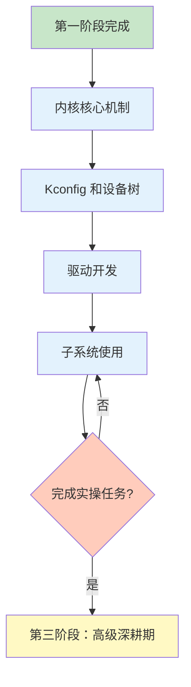

# 第二阶段：进阶实战期

!!! success "阶段目标"
    通过本阶段的学习，您将能够：
    
    - **掌握内核机制**：深入理解线程管理、中断处理、同步与通信机制
    - **精通配置系统**：熟练使用 Kconfig 和设备树进行系统配置
    - **开发设备驱动**：能够编写和适配常用外设的驱动程序
    - **使用核心子系统**：掌握日志、Shell、存储、低功耗等子系统的使用

## 学习内容

| 序号 | 主题 | 核心内容 | 预计时间 |
|------|------|----------|----------|
| 1 | [内核核心机制](kernel-mechanisms.md) | 线程管理、中断处理、同步通信、性能优化 | 1-2 天 |
| 2 | [Kconfig 和设备树](kconfig-devicetree.md) | Kconfig 语法、设备树语法、配置优先级、调试方法 | 1-2 天 |
| 3 | [驱动开发](driver-development.md) | 驱动模型、常用外设 API、自定义驱动、调试技巧 | 2-3 天 |
| 4 | [子系统使用](subsystems.md) | 日志系统、Shell 控制台、存储子系统、低功耗管理 | 1-2 天 |

**总计预计时间：1-2 周**

## 必做实操任务

!!! example "实操任务清单"
    完成以下实操任务，将理论知识转化为实际开发能力：
    
    ### 任务 1：多线程应用开发 ✓
    - 创建 3 个不同优先级的线程
    - 使用互斥锁保护共享资源
    - 使用信号量实现生产者-消费者模式
    - 使用消息队列进行线程间通信
    - 观察和分析线程调度行为
    
    ### 任务 2：自定义驱动开发 ✓
    - 为 I2C 温湿度传感器（如 SHT3x）编写完整驱动
    - 编写设备树绑定文件（YAML）
    - 在设备树中配置传感器节点
    - 编写应用程序读取传感器数据
    - 使用日志系统输出调试信息
    
    ### 任务 3：子系统集成应用 ✓
    - 集成日志系统，实现多模块日志管理
    - 集成 Shell 控制台，添加自定义命令
    - 使用 NVS 存储传感器校准参数
    - 实现低功耗模式，周期性唤醒采集数据

## 避坑指南

!!! danger "常见问题 1：设备树配置不生效"
    **症状**：修改了设备树文件，但编译后配置没有生效
    
    **原因**：
    - 设备树 overlay 文件命名或位置不正确
    - 设备树节点的 status 属性为 "disabled"
    - 配置被其他 overlay 文件覆盖
    
    **解决方案**：
    ```bash
    # 1. 检查生成的设备树文件
    cat build/zephyr/zephyr.dts
    
    # 2. 确认 overlay 文件命名正确
    # 应用级 overlay: <app_dir>/<board>.overlay
    # 板级 overlay: <board_dir>/<board>.overlay
    
    # 3. 检查节点 status 属性
    &i2c0 {
        status = "okay";  // 确保为 "okay"
        sensor@44 {
            compatible = "sensirion,sht3xd";
            reg = <0x44>;
            status = "okay";
        };
    };
    
    # 4. 使用 DT_NODE_HAS_STATUS 宏验证
    #if DT_NODE_HAS_STATUS(DT_NODELABEL(sensor), okay)
        // 节点已启用
    #endif
    ```

!!! danger "常见问题 2：线程栈溢出"
    **症状**：程序运行一段时间后崩溃，或出现不可预测的行为
    
    **原因**：线程栈大小设置过小，局部变量或函数调用超出栈空间
    
    **解决方案**：
    ```c
    // 1. 启用栈溢出检测
    // prj.conf
    CONFIG_THREAD_STACK_INFO=y
    CONFIG_THREAD_MONITOR=y
    CONFIG_THREAD_NAME=y
    
    // 2. 增加线程栈大小
    #define MY_STACK_SIZE 2048  // 根据实际需求调整
    K_THREAD_STACK_DEFINE(my_stack, MY_STACK_SIZE);
    
    // 3. 使用 Shell 命令查看栈使用情况
    // uart:~$ kernel threads
    // 查看 "unused" 列，如果接近 0 说明栈不足
    
    // 4. 减少栈上的局部变量
    // 使用静态变量或动态分配（k_malloc）
    static uint8_t large_buffer[1024];  // 不占用栈空间
    ```

## 学习进度检查

完成本阶段学习后，您应该能够：

- [ ] 熟练使用 Zephyr 的线程、互斥锁、信号量、消息队列等内核 API
- [ ] 理解 Zephyr 的中断处理机制，能够编写 ISR 和工作队列
- [ ] 掌握 Kconfig 和设备树的语法，能够配置和调试系统
- [ ] 能够为常用外设（GPIO、UART、I2C、SPI）编写驱动程序
- [ ] 熟练使用日志系统、Shell 控制台、存储子系统
- [ ] 能够设计和实现低功耗的嵌入式应用

## 学习路径



## 学习建议

!!! tip "深入理解"
    - 不要满足于"能用"，要理解"为什么"
    - 阅读 Zephyr 内核源码，理解实现机制
    - 对比 Zephyr 与其他 RTOS（如 FreeRTOS）的设计差异

!!! tip "实践驱动"
    - 每学一个 API，立即编写测试代码验证
    - 尝试修改内核参数，观察对系统行为的影响
    - 完成所有实操任务，积累实战经验

!!! tip "系统思维"
    - 理解各个子系统之间的关系和依赖
    - 学会权衡功能、性能、功耗之间的平衡
    - 培养架构设计和系统优化的思维

## 进阶方向

完成本阶段学习后，您已经具备了 Zephyr 应用开发的核心能力。根据您的兴趣和需求，可以选择以下进阶方向：

### 方向 1：深入内核和系统优化
如果您对操作系统内核和性能优化感兴趣，可以进入第三阶段学习源码分析、BSP 移植和系统优化。

### 方向 2：专注应用开发
如果您更关注应用层开发，可以开始实际项目开发，积累项目经验。

### 方向 3：特定领域深耕
选择特定领域（如物联网、工业控制、可穿戴设备）深入学习相关技术栈。

<div style="text-align: center; margin-top: 30px;">
    <a href="../stage3-advanced/" class="md-button md-button--primary">
        进入第三阶段：高级深耕期 →
    </a>
</div>

---

!!! question "需要帮助？"
    如果您在学习过程中遇到问题，可以：
    
    - 查看 [Zephyr 官方文档](https://docs.zephyrproject.org/)
    - 在 [GitHub Issues](https://github.com/your-repo/issues) 报告问题
    - 在 [GitHub Discussions](https://github.com/your-repo/discussions) 提问交流
    - 加入 Zephyr 中文社区，与其他开发者交流经验
