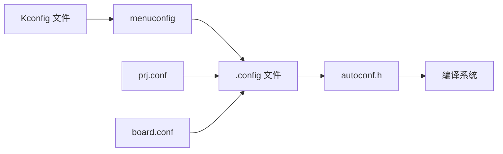
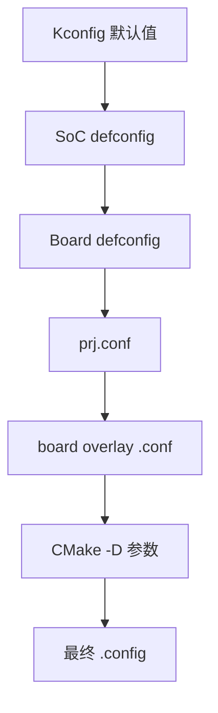
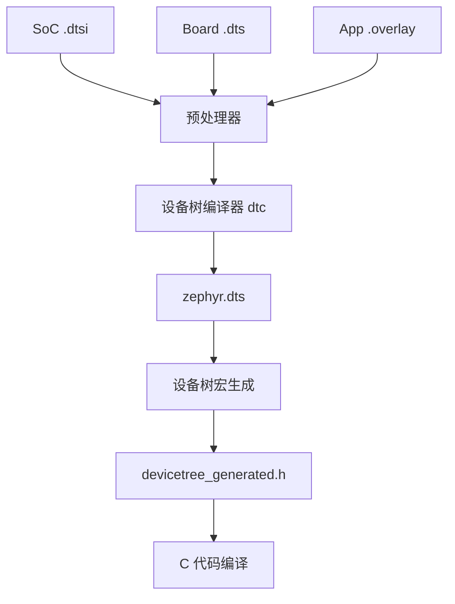

# Kconfig 和设备树深入

## 学习目标

完成本节学习后，你将能够：

- 掌握 Kconfig 语法和配置系统的工作原理
- 理解设备树（Device Tree）的结构和编译流程
- 能够为新硬件编写设备树配置
- 熟练使用 menuconfig 进行系统配置
- 掌握配置调试和问题排查方法

!!! info "为什么学习 Kconfig 和设备树"
    Kconfig 和设备树是 Zephyr 配置系统的两大核心机制。Kconfig 用于软件功能的配置（如启用哪些子系统、驱动），而设备树用于硬件描述（如外设地址、中断号、引脚配置）。掌握这两个工具是进行 Zephyr 开发的必备技能。

## Kconfig 深入

### Kconfig 概述

Kconfig 是一个配置系统，最初由 Linux 内核开发，Zephyr 继承了这一强大的配置机制。它允许开发者通过配置选项来定制系统功能，而无需修改源代码。



### Kconfig 语法完整参考

#### 基本配置类型

**1. bool 类型（布尔值）**

```kconfig
config MY_FEATURE
    bool "Enable my feature"
    default n
    help
      This option enables my custom feature.
      When enabled, the system will...
```


**2. int 类型（整数）**

```kconfig
config THREAD_STACK_SIZE
    int "Thread stack size"
    default 1024
    range 512 8192
    help
      Stack size for application threads in bytes.
```

**3. string 类型（字符串）**

```kconfig
config BOARD_NAME
    string "Board name"
    default "my_board"
    help
      The name of the target board.
```

**4. hex 类型（十六进制）**

```kconfig
config FLASH_BASE_ADDRESS
    hex "Flash base address"
    default 0x08000000
    help
      Base address of the flash memory.
```

**5. choice 类型（单选）**

```kconfig
choice LOG_LEVEL
    prompt "Log level"
    default LOG_LEVEL_INF

config LOG_LEVEL_OFF
    bool "Off"

config LOG_LEVEL_ERR
    bool "Error"

config LOG_LEVEL_WRN
    bool "Warning"

config LOG_LEVEL_INF
    bool "Info"

config LOG_LEVEL_DBG
    bool "Debug"

endchoice
```

#### 依赖关系管理

**depends on - 依赖条件**

```kconfig
config SENSOR_DRIVER
    bool "Enable sensor driver"
    depends on I2C
    help
      This driver requires I2C support.
```


**select - 自动选择依赖**

```kconfig
config USB_DEVICE
    bool "USB device support"
    select USB_DEVICE_STACK
    help
      Enable USB device support. This will automatically
      enable the USB device stack.
```

**imply - 弱依赖（建议）**

```kconfig
config NETWORKING
    bool "Networking support"
    imply NET_IPV4
    imply NET_IPV6
    help
      Enable networking. IPv4 and IPv6 are recommended
      but can be disabled if needed.
```

!!! tip "depends on vs select vs imply"
    - **depends on**: 当前选项依赖于其他选项，如果依赖不满足，当前选项不可见
    - **select**: 自动选择依赖项，强制启用（慎用，可能导致循环依赖）
    - **imply**: 建议启用依赖项，但用户可以手动禁用

#### 条件配置

**if...endif 条件块**

```kconfig
if NETWORKING

config NET_BUF_COUNT
    int "Network buffer count"
    default 16

config NET_PKT_RX_COUNT
    int "RX packet count"
    default 4

endif # NETWORKING
```

**visible if - 可见性条件**

```kconfig
menu "Advanced options"
    visible if EXPERT_MODE

config ADVANCED_FEATURE_1
    bool "Advanced feature 1"

config ADVANCED_FEATURE_2
    bool "Advanced feature 2"

endmenu
```

### menuconfig 完整操作指南

#### 启动 menuconfig

```bash
# 在项目目录中运行
west build -t menuconfig
```


#### 导航操作

| 按键 | 功能 |
|------|------|
| ↑/↓ | 上下移动光标 |
| Enter | 进入子菜单或切换选项 |
| Space | 选择/取消选择（对于 bool 类型） |
| Esc | 返回上级菜单或退出 |
| / | 搜索配置项 |
| ? | 显示帮助信息 |
| S | 保存配置 |
| Q | 退出 |

#### 搜索功能

1. 按 `/` 键打开搜索对话框
2. 输入配置项名称（如 `GPIO`）
3. 查看搜索结果和配置项位置
4. 按数字键跳转到对应配置项

#### 保存配置

menuconfig 的修改会保存到 `build/.config` 文件中。如果要将配置持久化到项目中：

```bash
# 方法 1：手动复制到 prj.conf
# 从 build/.config 中复制需要的配置项到 prj.conf

# 方法 2：使用 savedefconfig
west build -t savedefconfig
# 生成最小化的配置文件到 build/zephyr/defconfig
```

### 自定义 Kconfig 文件

#### 应用级 Kconfig

在应用目录中创建 `Kconfig` 文件：

```kconfig
# 应用根目录的 Kconfig
mainmenu "My Application Configuration"

config MY_APP
    bool "My Application"
    default y
    help
      Enable my application.

if MY_APP

config MY_APP_THREAD_PRIORITY
    int "Application thread priority"
    default 5
    range 0 15
    help
      Priority of the main application thread.

config MY_APP_STACK_SIZE
    int "Application stack size"
    default 2048
    help
      Stack size for the application thread.

menu "Sensor Configuration"

config MY_APP_SENSOR_ENABLE
    bool "Enable sensor support"
    depends on I2C
    default y

if MY_APP_SENSOR_ENABLE

config MY_APP_SENSOR_POLL_INTERVAL
    int "Sensor polling interval (ms)"
    default 1000
    range 100 10000

endif # MY_APP_SENSOR_ENABLE

endmenu

endif # MY_APP

source "Kconfig.zephyr"
```


#### 在代码中使用配置

```c
#include <zephyr/kernel.h>

// 使用 CONFIG_ 前缀访问配置项
#if defined(CONFIG_MY_APP_SENSOR_ENABLE)
    #define SENSOR_ENABLED 1
    #define POLL_INTERVAL CONFIG_MY_APP_SENSOR_POLL_INTERVAL
#else
    #define SENSOR_ENABLED 0
#endif

void main(void)
{
    printk("Application started\n");
    
#if SENSOR_ENABLED
    printk("Sensor polling interval: %d ms\n", POLL_INTERVAL);
    // 初始化传感器
#endif
}
```

### 配置优先级

Zephyr 的配置系统有明确的优先级顺序（从低到高）：



| 优先级 | 配置来源 | 说明 |
|--------|----------|------|
| 1（最低） | Kconfig 默认值 | Kconfig 文件中的 `default` 值 |
| 2 | SoC defconfig | `soc/<arch>/<soc>/Kconfig.defconfig` |
| 3 | Board defconfig | `boards/<arch>/<board>/<board>_defconfig` |
| 4 | prj.conf | 应用配置文件 |
| 5 | board overlay | `boards/<board>.conf` |
| 6（最高） | CMake 参数 | `west build -- -DCONFIG_XXX=y` |

!!! warning "配置冲突"
    如果多个配置源设置了同一个选项，高优先级的配置会覆盖低优先级的配置。使用 menuconfig 可以查看最终生效的配置值。

## 设备树深入

### 设备树概述

设备树（Device Tree）是一种描述硬件配置的数据结构，用于将硬件信息与驱动代码分离。在 Zephyr 中，设备树用于描述：

- 外设地址和寄存器映射
- 中断配置
- 时钟配置
- 引脚复用（pinmux）
- 设备间的连接关系


### 设备树编译流程



### DTS 语法详解

#### 基本结构

```dts
/dts-v1/;

/ {
    model = "My Custom Board";
    compatible = "vendor,my-board";
    
    chosen {
        zephyr,console = &uart0;
        zephyr,shell-uart = &uart0;
        zephyr,sram = &sram0;
        zephyr,flash = &flash0;
    };
    
    aliases {
        led0 = &led0;
        sw0 = &button0;
    };
};
```

#### 节点定义

**基本节点**

```dts
node_name@address {
    compatible = "vendor,device";
    reg = <0x40000000 0x1000>;
    status = "okay";
};
```

**标签和引用**

```dts
// 定义标签
uart0: serial@40002000 {
    compatible = "nordic,nrf-uart";
    reg = <0x40002000 0x1000>;
    status = "okay";
};

// 引用标签
&uart0 {
    current-speed = <115200>;
    tx-pin = <6>;
    rx-pin = <8>;
};
```

#### 常用属性

**compatible - 设备兼容性**

```dts
sensor@48 {
    compatible = "bosch,bme280";
    reg = <0x48>;
};
```

**reg - 寄存器地址**

```dts
// 格式：<地址 大小>
uart0: serial@40002000 {
    reg = <0x40002000 0x1000>;
};

// I2C 设备使用 7 位地址
sensor@76 {
    reg = <0x76>;
};
```


**status - 设备状态**

```dts
// 可选值：okay, disabled, reserved, fail
uart0: serial@40002000 {
    status = "okay";  // 设备启用
};

uart1: serial@40003000 {
    status = "disabled";  // 设备禁用
};
```

**interrupts - 中断配置**

```dts
uart0: serial@40002000 {
    interrupts = <2 1>;  // <中断号 优先级>
    interrupt-parent = <&nvic>;
};
```

**clocks - 时钟配置**

```dts
uart0: serial@40002000 {
    clocks = <&rcc STM32_CLOCK_BUS_APB1 0x00020000>;
};
```

### 设备树宏

Zephyr 提供了一系列宏来访问设备树信息：

#### DT_ALIAS() - 通过别名获取节点

```c
#include <zephyr/devicetree.h>

// 获取 led0 别名对应的节点 ID
#define LED0_NODE DT_ALIAS(led0)

// 检查节点是否存在
#if DT_NODE_EXISTS(LED0_NODE)
    // 获取 GPIO 控制器
    #define LED0_GPIO_NODE DT_GPIO_CTLR(LED0_NODE, gpios)
    #define LED0_GPIO_PIN DT_GPIO_PIN(LED0_NODE, gpios)
    #define LED0_GPIO_FLAGS DT_GPIO_FLAGS(LED0_NODE, gpios)
#endif
```

#### DT_NODELABEL() - 通过标签获取节点

```c
// 获取 uart0 标签对应的节点
#define UART0_NODE DT_NODELABEL(uart0)

// 获取寄存器地址
#define UART0_BASE DT_REG_ADDR(UART0_NODE)
```

#### DT_INST() - 通过实例索引获取节点

```c
// 获取第一个 "bosch,bme280" 设备
#define BME280_NODE DT_INST(0, bosch_bme280)

// 获取 I2C 地址
#define BME280_ADDR DT_REG_ADDR(BME280_NODE)
```

### overlay 机制

overlay 文件用于在不修改原始设备树的情况下，添加或修改设备树节点。

#### 板级 overlay

文件位置：`boards/<board>.overlay`

```dts
// nrf52840dk_nrf52840.overlay

// 启用 I2C0
&i2c0 {
    status = "okay";
    clock-frequency = <I2C_BITRATE_FAST>;
    
    // 添加 BME280 传感器
    bme280@76 {
        compatible = "bosch,bme280";
        reg = <0x76>;
    };
};

// 配置 LED
&led0 {
    gpios = <&gpio0 13 GPIO_ACTIVE_LOW>;
};
```


#### 应用 overlay

文件位置：应用目录中的 `app.overlay` 或 `<board>.overlay`

```dts
// app.overlay

/ {
    // 添加自定义别名
    aliases {
        mysensor = &bme280;
    };
    
    // 添加自定义节点
    my-device {
        compatible = "vendor,my-device";
        status = "okay";
    };
};

// 修改现有节点
&uart0 {
    current-speed = <9600>;  // 修改波特率
};
```

### 设备树绑定（Bindings）

绑定文件定义了设备树节点的属性规范，位于 `dts/bindings/` 目录。

#### YAML 格式说明

```yaml
# dts/bindings/sensor/bosch,bme280.yaml
description: Bosch BME280 temperature, pressure and humidity sensor

compatible: "bosch,bme280"

include: [sensor-device.yaml, i2c-device.yaml]

properties:
  int-gpios:
    type: phandle-array
    description: Interrupt GPIO

  standby-time:
    type: int
    default: 5
    description: |
      Standby time in milliseconds.
      Valid values: 0, 1, 10, 20, 62, 125, 250, 500, 1000
```

## 实际配置示例

### 示例 1：I2C 传感器完整配置

#### 设备树配置（app.overlay）

```dts
// 启用 I2C0 并配置 BME280 传感器
&i2c0 {
    compatible = "nordic,nrf-twi";
    status = "okay";
    clock-frequency = <I2C_BITRATE_FAST>;
    
    // SDA 和 SCL 引脚配置
    sda-pin = <26>;
    scl-pin = <27>;
    
    // BME280 温湿度传感器
    bme280: bme280@76 {
        compatible = "bosch,bme280";
        reg = <0x76>;
        status = "okay";
    };
};

/ {
    aliases {
        temp-sensor = &bme280;
    };
};
```

#### Kconfig 配置（prj.conf）

```ini
# 启用 I2C 驱动
CONFIG_I2C=y

# 启用传感器子系统
CONFIG_SENSOR=y

# 启用 BME280 驱动
CONFIG_BME280=y

# 日志配置
CONFIG_LOG=y
CONFIG_SENSOR_LOG_LEVEL_DBG=y
```


#### C 代码实现

```c
#include <zephyr/kernel.h>
#include <zephyr/device.h>
#include <zephyr/drivers/sensor.h>
#include <zephyr/logging/log.h>

LOG_MODULE_REGISTER(main, LOG_LEVEL_DBG);

void main(void)
{
    const struct device *dev = DEVICE_DT_GET(DT_ALIAS(temp_sensor));
    
    if (!device_is_ready(dev)) {
        LOG_ERR("Device %s is not ready", dev->name);
        return;
    }
    
    LOG_INF("BME280 sensor initialized");
    
    while (1) {
        struct sensor_value temp, press, humidity;
        
        // 触发采样
        sensor_sample_fetch(dev);
        
        // 读取温度
        sensor_channel_get(dev, SENSOR_CHAN_AMBIENT_TEMP, &temp);
        LOG_INF("Temperature: %d.%06d °C", temp.val1, temp.val2);
        
        // 读取压力
        sensor_channel_get(dev, SENSOR_CHAN_PRESS, &press);
        LOG_INF("Pressure: %d.%06d kPa", press.val1, press.val2);
        
        // 读取湿度
        sensor_channel_get(dev, SENSOR_CHAN_HUMIDITY, &humidity);
        LOG_INF("Humidity: %d.%06d %%", humidity.val1, humidity.val2);
        
        k_sleep(K_SECONDS(2));
    }
}
```

### 示例 2：SPI 外设配置

#### 设备树配置

```dts
&spi1 {
    compatible = "nordic,nrf-spi";
    status = "okay";
    
    cs-gpios = <&gpio0 3 GPIO_ACTIVE_LOW>;
    sck-pin = <19>;
    mosi-pin = <20>;
    miso-pin = <21>;
    
    // SPI Flash 芯片
    spi_flash: w25q32@0 {
        compatible = "jedec,spi-nor";
        reg = <0>;
        spi-max-frequency = <8000000>;
        jedec-id = [ef 40 16];
        size = <0x400000>;  // 4MB
        status = "okay";
    };
};
```

#### Kconfig 配置

```ini
CONFIG_SPI=y
CONFIG_SPI_NOR=y
CONFIG_SPI_NOR_FLASH_LAYOUT_PAGE_SIZE=256
```

### 示例 3：GPIO 中断配置

#### 设备树配置

```dts
/ {
    buttons {
        compatible = "gpio-keys";
        
        button0: button_0 {
            gpios = <&gpio0 11 (GPIO_PULL_UP | GPIO_ACTIVE_LOW)>;
            label = "Push button 0";
        };
    };
    
    aliases {
        sw0 = &button0;
    };
};
```


#### C 代码实现

```c
#include <zephyr/kernel.h>
#include <zephyr/device.h>
#include <zephyr/drivers/gpio.h>

#define SW0_NODE DT_ALIAS(sw0)

static const struct gpio_dt_spec button = GPIO_DT_SPEC_GET(SW0_NODE, gpios);
static struct gpio_callback button_cb_data;

void button_pressed(const struct device *dev, struct gpio_callback *cb,
                    uint32_t pins)
{
    printk("Button pressed at %d\n", k_cycle_get_32());
}

void main(void)
{
    if (!device_is_ready(button.port)) {
        printk("Error: button device not ready\n");
        return;
    }
    
    // 配置 GPIO 为输入
    gpio_pin_configure_dt(&button, GPIO_INPUT);
    
    // 配置中断
    gpio_pin_interrupt_configure_dt(&button, GPIO_INT_EDGE_TO_ACTIVE);
    
    // 注册回调
    gpio_init_callback(&button_cb_data, button_pressed, BIT(button.pin));
    gpio_add_callback(button.port, &button_cb_data);
    
    printk("Button interrupt configured\n");
}
```

### 示例 4：时钟树配置

#### 设备树配置（STM32 示例）

```dts
&clk_hse {
    clock-frequency = <DT_FREQ_M(8)>;  // 8 MHz 外部晶振
    status = "okay";
};

&pll {
    div-m = <8>;
    mul-n = <336>;
    div-p = <2>;
    div-q = <7>;
    clocks = <&clk_hse>;
    status = "okay";
};

&rcc {
    clocks = <&pll>;
    clock-frequency = <DT_FREQ_M(168)>;  // 168 MHz 系统时钟
    ahb-prescaler = <1>;
    apb1-prescaler = <4>;
    apb2-prescaler = <2>;
};
```

## 为新硬件编写设备树

### 步骤 1：分析硬件规格书

在编写设备树之前，需要收集以下信息：

- **CPU 架构和型号**：如 ARM Cortex-M4
- **内存映射**：Flash 和 RAM 的地址和大小
- **外设列表**：UART、I2C、SPI、GPIO 等
- **外设地址**：每个外设的寄存器基地址
- **中断号**：每个外设的中断向量号
- **时钟配置**：时钟源、PLL 配置、分频器
- **引脚定义**：GPIO 引脚号、复用功能

!!! tip "查找信息的位置"
    - 芯片数据手册（Datasheet）：电气特性、引脚定义
    - 参考手册（Reference Manual）：寄存器地址、外设详细说明
    - 板子原理图（Schematic）：外设连接、引脚使用


### 步骤 2：创建 SoC 设备树

SoC 设备树描述芯片级的硬件资源，位于 `dts/arm/<vendor>/`。

#### 示例：自定义 STM32 SoC

```dts
// dts/arm/st/custom_stm32f4.dtsi

#include <arm/armv7-m.dtsi>
#include <zephyr/dt-bindings/gpio/gpio.h>
#include <zephyr/dt-bindings/i2c/i2c.h>

/ {
    cpus {
        #address-cells = <1>;
        #size-cells = <0>;
        
        cpu0: cpu@0 {
            device_type = "cpu";
            compatible = "arm,cortex-m4f";
            reg = <0>;
        };
    };
    
    sram0: memory@20000000 {
        compatible = "mmio-sram";
        reg = <0x20000000 DT_SIZE_K(128)>;
    };
    
    flash0: flash@8000000 {
        compatible = "soc-nv-flash";
        reg = <0x08000000 DT_SIZE_K(512)>;
    };
    
    soc {
        uart1: serial@40011000 {
            compatible = "st,stm32-uart";
            reg = <0x40011000 0x400>;
            interrupts = <37 0>;
            status = "disabled";
        };
        
        i2c1: i2c@40005400 {
            compatible = "st,stm32-i2c-v1";
            reg = <0x40005400 0x400>;
            interrupts = <31 0>, <32 0>;
            #address-cells = <1>;
            #size-cells = <0>;
            status = "disabled";
        };
        
        spi1: spi@40013000 {
            compatible = "st,stm32-spi";
            reg = <0x40013000 0x400>;
            interrupts = <35 5>;
            #address-cells = <1>;
            #size-cells = <0>;
            status = "disabled";
        };
    };
};

&nvic {
    arm,num-irq-priority-bits = <4>;
};
```

### 步骤 3：创建板级设备树

板级设备树描述具体开发板的配置，位于 `boards/arm/<vendor>/<board>/`。

```dts
// boards/arm/my_vendor/my_board/my_board.dts

/dts-v1/;
#include <st/custom_stm32f4.dtsi>
#include "my_board-pinctrl.dtsi"

/ {
    model = "My Custom STM32F4 Board";
    compatible = "my-vendor,my-board";
    
    chosen {
        zephyr,console = &uart1;
        zephyr,shell-uart = &uart1;
        zephyr,sram = &sram0;
        zephyr,flash = &flash0;
    };
    
    leds {
        compatible = "gpio-leds";
        led0: led_0 {
            gpios = <&gpioa 5 GPIO_ACTIVE_HIGH>;
            label = "User LED";
        };
    };
    
    aliases {
        led0 = &led0;
    };
};

&uart1 {
    pinctrl-0 = <&uart1_tx_pa9 &uart1_rx_pa10>;
    pinctrl-names = "default";
    current-speed = <115200>;
    status = "okay";
};

&i2c1 {
    pinctrl-0 = <&i2c1_scl_pb6 &i2c1_sda_pb7>;
    pinctrl-names = "default";
    clock-frequency = <I2C_BITRATE_FAST>;
    status = "okay";
};
```


### 步骤 4：编写设备树绑定

如果使用自定义设备，需要创建绑定文件。

```yaml
# dts/bindings/vendor,my-device.yaml
description: My custom device

compatible: "vendor,my-device"

properties:
  reg:
    type: array
    description: Register address and size
    required: true
  
  interrupts:
    type: array
    description: Interrupt configuration
  
  clock-frequency:
    type: int
    description: Operating frequency in Hz
    default: 1000000
  
  enable-gpios:
    type: phandle-array
    description: GPIO for device enable
```

### 步骤 5：验证和测试

#### 查看生成的设备树

```bash
# 构建项目
west build -b my_board samples/hello_world

# 查看最终生成的设备树
cat build/zephyr/zephyr.dts
```

#### 验证设备树宏

在代码中添加编译时检查：

```c
#include <zephyr/devicetree.h>

// 检查节点是否存在
#if !DT_NODE_EXISTS(DT_NODELABEL(uart1))
#error "UART1 node not found in device tree"
#endif

// 检查属性值
#define UART1_BASE DT_REG_ADDR(DT_NODELABEL(uart1))
#if UART1_BASE != 0x40011000
#error "UART1 base address mismatch"
#endif
```

## 调试方法

### 查看生成的设备树

最终生成的设备树文件位于 `build/zephyr/zephyr.dts`，包含了所有 overlay 和预处理后的完整设备树。

```bash
# 查看完整设备树
cat build/zephyr/zephyr.dts | less

# 搜索特定节点
grep -A 10 "uart1:" build/zephyr/zephyr.dts
```

### 使用 menuconfig 检查配置

```bash
# 启动 menuconfig
west build -t menuconfig

# 搜索配置项（按 / 键）
# 查看配置项的值和依赖关系
```

### 常见错误和解决方案

#### 错误 1：节点未定义

**症状**：

```
error: DT_N_S_soc_S_serial_40011000 undeclared
```

**原因**：设备树中没有定义该节点，或节点被禁用（status = "disabled"）

**解决方案**：

1. 检查设备树文件中是否定义了该节点
2. 确认节点的 status 属性为 "okay"
3. 检查 overlay 文件是否正确应用

```dts
// 在 overlay 中启用节点
&uart1 {
    status = "okay";
};
```


#### 错误 2：属性类型错误

**症状**：

```
error: DT_REG_ADDR requires a node with reg property
```

**原因**：节点缺少 `reg` 属性，或属性格式不正确

**解决方案**：

```dts
// 正确的 reg 属性格式
uart1: serial@40011000 {
    reg = <0x40011000 0x400>;  // <地址 大小>
};

// I2C 设备使用 7 位地址
sensor@76 {
    reg = <0x76>;
};
```

#### 错误 3：依赖缺失

**症状**：

```
warning: MY_DRIVER (defined at drivers/Kconfig:10) has unmet dependencies
```

**原因**：Kconfig 配置项的依赖条件不满足

**解决方案**：

1. 查看配置项的依赖关系（使用 menuconfig 的 `?` 键）
2. 启用所有依赖项

```ini
# 如果 MY_DRIVER 依赖 I2C
CONFIG_I2C=y
CONFIG_MY_DRIVER=y
```

#### 错误 4：循环依赖

**症状**：

```
error: recursive dependency detected!
```

**原因**：Kconfig 中使用 `select` 导致循环依赖

**解决方案**：

1. 避免过度使用 `select`，改用 `depends on`
2. 使用 `imply` 代替 `select`

```kconfig
# 不好的做法
config A
    bool "Feature A"
    select B

config B
    bool "Feature B"
    select A

# 好的做法
config A
    bool "Feature A"
    depends on B

config B
    bool "Feature B"
```

### 调试工具

#### devicetree.h 宏展开

使用预处理器查看宏展开结果：

```bash
# 预处理单个文件
arm-zephyr-eabi-gcc -E -dM \
    -I build/zephyr/include/generated \
    src/main.c | grep DT_
```

#### 编译器错误分析

仔细阅读编译器错误信息，通常会指出：

- 缺少的宏定义
- 类型不匹配
- 未定义的符号

```c
// 添加编译时断言帮助调试
#if !DT_NODE_HAS_STATUS(DT_NODELABEL(uart1), okay)
#error "UART1 is not enabled in device tree"
#endif
```


## 实操任务

### 任务 1：为 I2C 传感器编写完整的设备树配置

**目标**：为 BME280 温湿度传感器编写完整的设备树配置和应用代码

**步骤**：

1. 创建 `app.overlay` 文件，启用 I2C 并配置 BME280
2. 在 `prj.conf` 中启用必要的 Kconfig 选项
3. 编写应用代码读取传感器数据
4. 编译并在开发板上测试

**预期结果**：

- 能够成功编译项目
- 串口输出显示温度、湿度和压力数据
- 数据更新周期为 2 秒

**参考配置**：

```dts
// app.overlay
&i2c0 {
    status = "okay";
    clock-frequency = <I2C_BITRATE_FAST>;
    
    bme280@76 {
        compatible = "bosch,bme280";
        reg = <0x76>;
    };
};
```

```ini
# prj.conf
CONFIG_I2C=y
CONFIG_SENSOR=y
CONFIG_BME280=y
CONFIG_LOG=y
```

### 任务 2：创建自定义 Kconfig 选项控制功能开关

**目标**：创建应用级 Kconfig 配置，控制 LED 闪烁频率和日志级别

**步骤**：

1. 在应用目录创建 `Kconfig` 文件
2. 定义配置选项：LED 闪烁间隔、日志级别
3. 在代码中使用这些配置
4. 使用 menuconfig 修改配置并测试

**预期结果**：

- 可以通过 menuconfig 修改 LED 闪烁间隔
- 可以通过 menuconfig 选择日志级别
- 修改配置后重新编译，行为符合预期

**参考 Kconfig**：

```kconfig
# Kconfig
config APP_BLINK_INTERVAL
    int "LED blink interval (ms)"
    default 1000
    range 100 5000
    help
      Interval between LED toggles in milliseconds.

choice APP_LOG_LEVEL
    prompt "Application log level"
    default APP_LOG_LEVEL_INF

config APP_LOG_LEVEL_OFF
    bool "Off"

config APP_LOG_LEVEL_ERR
    bool "Error"

config APP_LOG_LEVEL_INF
    bool "Info"

config APP_LOG_LEVEL_DBG
    bool "Debug"

endchoice

source "Kconfig.zephyr"
```


### 任务 3：使用 overlay 为不同板子适配同一应用

**目标**：创建一个通用应用，使用 overlay 适配不同的开发板

**步骤**：

1. 编写通用应用代码，使用设备树别名访问硬件
2. 为 nRF52840 DK 创建 `nrf52840dk_nrf52840.overlay`
3. 为 STM32 Nucleo 创建 `nucleo_f401re.overlay`
4. 分别在两个板子上编译和测试

**预期结果**：

- 同一份应用代码可以在不同板子上运行
- 通过 overlay 文件适配不同的硬件配置
- 功能在两个板子上都正常工作

**参考代码**：

```c
// main.c - 通用代码
#include <zephyr/kernel.h>
#include <zephyr/drivers/gpio.h>

#define LED0_NODE DT_ALIAS(led0)
static const struct gpio_dt_spec led = GPIO_DT_SPEC_GET(LED0_NODE, gpios);

void main(void)
{
    gpio_pin_configure_dt(&led, GPIO_OUTPUT_ACTIVE);
    
    while (1) {
        gpio_pin_toggle_dt(&led);
        k_msleep(CONFIG_APP_BLINK_INTERVAL);
    }
}
```

```dts
// nrf52840dk_nrf52840.overlay
/ {
    aliases {
        led0 = &led0;
    };
};

&led0 {
    gpios = <&gpio0 13 GPIO_ACTIVE_LOW>;
};
```

```dts
// nucleo_f401re.overlay
/ {
    aliases {
        led0 = &green_led_2;
    };
};
```

## 学习总结

完成本节学习后，你应该掌握：

✅ Kconfig 语法和配置系统的工作原理  
✅ 设备树的结构、语法和编译流程  
✅ 如何使用 menuconfig 进行系统配置  
✅ 如何为新硬件编写设备树  
✅ 如何使用 overlay 机制适配不同板子  
✅ 常见配置错误的调试方法

## 下一步学习

- [驱动开发](driver-development.md)：学习如何编写 Zephyr 驱动
- [子系统使用](subsystems.md)：深入了解 Zephyr 的各个子系统
- [内核源码分析](../stage3-advanced/kernel-source.md)：理解 Kconfig 和设备树在内核中的实现

## 参考资源

- [Zephyr 官方文档 - Kconfig](https://docs.zephyrproject.org/latest/build/kconfig/index.html)
- [Zephyr 官方文档 - Device Tree](https://docs.zephyrproject.org/latest/build/dts/index.html)
- [Device Tree Specification](https://www.devicetree.org/)
- [Linux Kconfig Language](https://www.kernel.org/doc/html/latest/kbuild/kconfig-language.html)

---

!!! success "恭喜完成本节学习！"
    你已经掌握了 Zephyr 配置系统的核心知识。Kconfig 和设备树是 Zephyr 开发的基础，熟练掌握这两个工具将大大提高你的开发效率。继续保持学习的热情，向更高级的主题进发！
