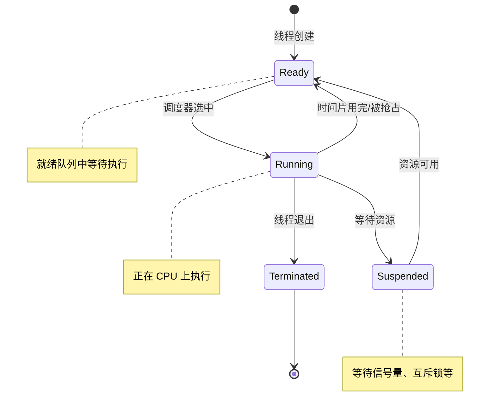
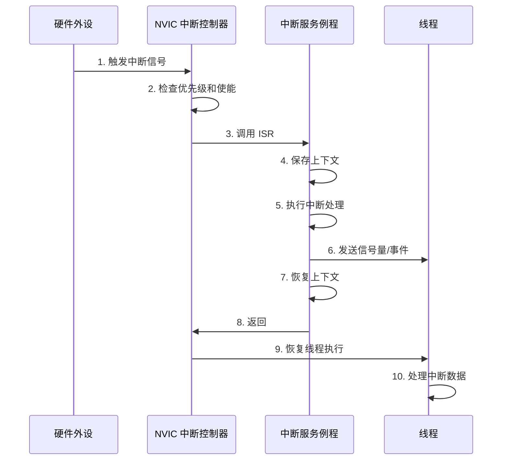

# Zephyr 内核核心机制

!!! info "学习目标"
    通过本章学习，你将掌握：
    
    - Zephyr 线程的创建、调度和管理机制
    - 多种同步原语的使用场景和最佳实践
    - 中断处理的完整流程和优化技巧
    - 线程间通信的多种方式和性能对比
    - 内核机制的性能优化策略

## 概述

Zephyr RTOS 的内核提供了一套完整的多线程支持机制，包括线程管理、调度、同步、通信和中断处理。理解这些核心机制是开发高性能、高可靠性嵌入式应用的基础。

本章将深入探讨 Zephyr 内核的核心机制，通过理论讲解、代码示例和实操任务，帮助你全面掌握 Zephyr 的内核编程。

## 1. 线程管理

### 1.1 线程状态机

Zephyr 线程在其生命周期中会经历多个状态。理解线程状态转换对于编写正确的多线程程序至关重要。



**线程状态说明**：

- **Ready（就绪）**: 线程已准备好运行，在就绪队列中等待调度器分配 CPU 时间
- **Running（运行）**: 线程正在 CPU 上执行
- **Suspended（挂起）**: 线程因等待资源（如信号量、互斥锁、消息队列）而被阻塞
- **Terminated（终止）**: 线程执行完毕或被终止

### 1.2 线程创建

Zephyr 提供两种主要的线程创建方式：动态创建和静态定义。

#### 动态创建线程：`k_thread_create()`

```c
#include <zephyr/kernel.h>

#define STACK_SIZE 1024
#define THREAD_PRIORITY 5

K_THREAD_STACK_DEFINE(my_stack_area, STACK_SIZE);
struct k_thread my_thread_data;

void my_thread_entry(void *p1, void *p2, void *p3)
{
    printk("线程启动，参数: %d\n", (int)p1);
    
    while (1) {
        printk("线程运行中...\n");
        k_sleep(K_SECONDS(1));
    }
}

void create_thread_example(void)
{
    k_tid_t my_tid = k_thread_create(
        &my_thread_data,           // 线程控制块
        my_stack_area,             // 线程栈
        K_THREAD_STACK_SIZEOF(my_stack_area),  // 栈大小
        my_thread_entry,           // 线程入口函数
        (void *)42, NULL, NULL,    // 传递给线程的参数
        THREAD_PRIORITY,           // 优先级
        0,                         // 选项（0 表示默认）
        K_NO_WAIT                  // 启动延迟（立即启动）
    );
    
    printk("线程创建成功，TID: %p\n", my_tid);
}
```

#### 静态定义线程：`K_THREAD_DEFINE()`

```c
#include <zephyr/kernel.h>

void static_thread_entry(void *p1, void *p2, void *p3)
{
    printk("静态线程启动\n");
    
    while (1) {
        printk("静态线程运行中...\n");
        k_sleep(K_SECONDS(2));
    }
}

// 在编译时定义线程，系统启动时自动创建
K_THREAD_DEFINE(
    static_thread_id,          // 线程 ID（变量名）
    1024,                      // 栈大小
    static_thread_entry,       // 入口函数
    NULL, NULL, NULL,          // 参数
    7,                         // 优先级
    0,                         // 选项
    0                          // 启动延迟（0 表示立即启动）
);
```

!!! tip "选择建议"
    - **静态定义**：适用于系统启动时就需要的线程，编译时分配资源，启动快
    - **动态创建**：适用于运行时根据需要创建的线程，更灵活但需要管理资源

### 1.3 线程优先级

Zephyr 使用基于优先级的抢占式调度。优先级数值越小，优先级越高。

**优先级范围**：

| 优先级类型 | 数值范围 | 调度方式 | 适用场景 |
|----------|---------|---------|---------|
| 协作式线程 | < 0（负数） | 不可抢占，主动让出 CPU | 长时间运行的后台任务 |
| 抢占式线程 | 0 - 14 | 可被更高优先级抢占 | 大多数应用线程 |
| 元线程 | -1 | 特殊的协作式线程 | 系统内部使用 |

```c
// 优先级配置示例
#define HIGH_PRIORITY    3   // 高优先级（实时任务）
#define MEDIUM_PRIORITY  7   // 中优先级（普通任务）
#define LOW_PRIORITY     12  // 低优先级（后台任务）
#define COOP_PRIORITY    -1  // 协作式线程

void high_priority_task(void *p1, void *p2, void *p3)
{
    while (1) {
        // 处理紧急事件
        k_sleep(K_MSEC(10));
    }
}

void low_priority_task(void *p1, void *p2, void *p3)
{
    while (1) {
        // 后台数据处理
        k_sleep(K_SECONDS(5));
    }
}

K_THREAD_DEFINE(high_thread, 512, high_priority_task, 
                NULL, NULL, NULL, HIGH_PRIORITY, 0, 0);
K_THREAD_DEFINE(low_thread, 1024, low_priority_task, 
                NULL, NULL, NULL, LOW_PRIORITY, 0, 0);
```

!!! warning "优先级反转"
    当低优先级线程持有高优先级线程需要的资源时，可能导致优先级反转。
    使用互斥锁（Mutex）可以自动处理优先级继承，避免此问题。

### 1.4 线程栈管理

每个线程都需要独立的栈空间。正确配置栈大小对系统稳定性至关重要。

#### 栈大小计算

```c
// 栈大小计算考虑因素：
// 1. 局部变量大小
// 2. 函数调用深度
// 3. 中断嵌套深度（如果线程可被中断）
// 4. 编译器优化级别

#define BASE_STACK_SIZE    512   // 基础栈大小
#define LOCAL_VAR_SIZE     256   // 局部变量空间
#define CALL_DEPTH_SIZE    256   // 函数调用栈
#define SAFETY_MARGIN      256   // 安全余量

#define TOTAL_STACK_SIZE   (BASE_STACK_SIZE + LOCAL_VAR_SIZE + \
                            CALL_DEPTH_SIZE + SAFETY_MARGIN)

K_THREAD_STACK_DEFINE(my_stack, TOTAL_STACK_SIZE);
```

#### 栈溢出检测

```c
// 在 prj.conf 中启用栈溢出检测
// CONFIG_THREAD_STACK_INFO=y
// CONFIG_THREAD_MONITOR=y

#include <zephyr/kernel.h>

void check_stack_usage(void)
{
    struct k_thread *current = k_current_get();
    size_t unused;
    
    // 获取未使用的栈空间
    unused = k_thread_stack_space_get(current, NULL);
    
    printk("当前线程栈使用情况：\n");
    printk("  未使用空间: %zu 字节\n", unused);
    
    if (unused < 128) {
        printk("  警告：栈空间不足！\n");
    }
}
```

### 1.5 多线程示例：不同优先级线程

```c
#include <zephyr/kernel.h>

#define STACK_SIZE 1024

// 定义三个不同优先级的线程
void thread_high(void *p1, void *p2, void *p3)
{
    while (1) {
        printk("[高优先级] 执行紧急任务\n");
        k_sleep(K_MSEC(100));
    }
}

void thread_medium(void *p1, void *p2, void *p3)
{
    while (1) {
        printk("[中优先级] 执行普通任务\n");
        k_sleep(K_MSEC(200));
    }
}

void thread_low(void *p1, void *p2, void *p3)
{
    while (1) {
        printk("[低优先级] 执行后台任务\n");
        k_sleep(K_MSEC(500));
    }
}

// 静态定义三个线程
K_THREAD_DEFINE(tid_high, STACK_SIZE, thread_high,
                NULL, NULL, NULL, 3, 0, 0);
K_THREAD_DEFINE(tid_medium, STACK_SIZE, thread_medium,
                NULL, NULL, NULL, 7, 0, 0);
K_THREAD_DEFINE(tid_low, STACK_SIZE, thread_low,
                NULL, NULL, NULL, 12, 0, 0);

int main(void)
{
    printk("多线程优先级示例启动\n");
    printk("观察不同优先级线程的执行顺序\n");
    return 0;
}
```

**预期输出**：
```
多线程优先级示例启动
观察不同优先级线程的执行顺序
[高优先级] 执行紧急任务
[高优先级] 执行紧急任务
[中优先级] 执行普通任务
[高优先级] 执行紧急任务
[低优先级] 执行后台任务
...
```

!!! note "观察要点"
    高优先级线程会更频繁地获得 CPU 时间，低优先级线程只在高优先级线程休眠时才能运行。


## 2. 同步机制

多线程环境下，线程间需要协调访问共享资源。Zephyr 提供了多种同步原语。

### 2.1 互斥锁（Mutex）

互斥锁用于保护共享资源，确保同一时间只有一个线程访问。Zephyr 的互斥锁支持优先级继承，可以避免优先级反转问题。

```c
#include <zephyr/kernel.h>

// 定义互斥锁
K_MUTEX_DEFINE(my_mutex);

// 共享资源
static int shared_counter = 0;

void thread_with_mutex(void *p1, void *p2, void *p3)
{
    int thread_id = (int)p1;
    
    while (1) {
        // 获取互斥锁
        k_mutex_lock(&my_mutex, K_FOREVER);
        
        // 临界区：访问共享资源
        int old_value = shared_counter;
        k_sleep(K_MSEC(10));  // 模拟处理时间
        shared_counter = old_value + 1;
        printk("线程 %d: counter = %d\n", thread_id, shared_counter);
        
        // 释放互斥锁
        k_mutex_unlock(&my_mutex);
        
        k_sleep(K_MSEC(100));
    }
}

// 创建多个线程访问共享资源
K_THREAD_DEFINE(thread1, 1024, thread_with_mutex,
                (void *)1, NULL, NULL, 7, 0, 0);
K_THREAD_DEFINE(thread2, 1024, thread_with_mutex,
                (void *)2, NULL, NULL, 7, 0, 0);
```

!!! tip "互斥锁最佳实践"
    - 临界区代码应尽可能短，减少锁持有时间
    - 避免在持有锁时调用可能阻塞的函数
    - 使用 `K_FOREVER` 等待时要小心死锁
    - 考虑使用超时参数（如 `K_MSEC(100)`）避免永久阻塞

#### 死锁避免

```c
// 错误示例：可能导致死锁
K_MUTEX_DEFINE(mutex_a);
K_MUTEX_DEFINE(mutex_b);

void thread_a(void *p1, void *p2, void *p3)
{
    k_mutex_lock(&mutex_a, K_FOREVER);
    k_sleep(K_MSEC(10));
    k_mutex_lock(&mutex_b, K_FOREVER);  // 可能死锁
    // ...
    k_mutex_unlock(&mutex_b);
    k_mutex_unlock(&mutex_a);
}

void thread_b(void *p1, void *p2, void *p3)
{
    k_mutex_lock(&mutex_b, K_FOREVER);
    k_sleep(K_MSEC(10));
    k_mutex_lock(&mutex_a, K_FOREVER);  // 可能死锁
    // ...
    k_mutex_unlock(&mutex_a);
    k_mutex_unlock(&mutex_b);
}

// 正确示例：统一锁顺序
void thread_a_fixed(void *p1, void *p2, void *p3)
{
    k_mutex_lock(&mutex_a, K_FOREVER);  // 总是先锁 A
    k_mutex_lock(&mutex_b, K_FOREVER);  // 再锁 B
    // ...
    k_mutex_unlock(&mutex_b);
    k_mutex_unlock(&mutex_a);
}

void thread_b_fixed(void *p1, void *p2, void *p3)
{
    k_mutex_lock(&mutex_a, K_FOREVER);  // 总是先锁 A
    k_mutex_lock(&mutex_b, K_FOREVER);  // 再锁 B
    // ...
    k_mutex_unlock(&mutex_b);
    k_mutex_unlock(&mutex_a);
}
```

### 2.2 信号量（Semaphore）

信号量用于资源计数和线程同步。Zephyr 支持计数信号量和二值信号量。

```c
#include <zephyr/kernel.h>

// 定义信号量（初始值 0，最大值 10）
K_SEM_DEFINE(my_sem, 0, 10);

// 生产者线程
void producer_thread(void *p1, void *p2, void *p3)
{
    int count = 0;
    
    while (1) {
        // 生产数据
        k_sleep(K_MSEC(500));
        count++;
        
        printk("生产者：生产数据 #%d\n", count);
        
        // 发送信号量（增加计数）
        k_sem_give(&my_sem);
    }
}

// 消费者线程
void consumer_thread(void *p1, void *p2, void *p3)
{
    while (1) {
        // 等待信号量（减少计数）
        printk("消费者：等待数据...\n");
        k_sem_take(&my_sem, K_FOREVER);
        
        // 消费数据
        printk("消费者：处理数据\n");
        k_sleep(K_MSEC(200));
    }
}

K_THREAD_DEFINE(producer, 1024, producer_thread,
                NULL, NULL, NULL, 7, 0, 0);
K_THREAD_DEFINE(consumer, 1024, consumer_thread,
                NULL, NULL, NULL, 7, 0, 0);
```

#### 信号量使用场景

| 场景 | 初始值 | 最大值 | 说明 |
|-----|-------|-------|------|
| 二值信号量 | 0 或 1 | 1 | 类似互斥锁，但不支持优先级继承 |
| 资源计数 | N | N | 管理 N 个相同资源的访问 |
| 事件通知 | 0 | 1 | 线程间事件通知 |
| 生产者-消费者 | 0 | 缓冲区大小 | 同步生产和消费速度 |

### 2.3 事件（Events）

事件对象允许线程等待多个条件的组合。

```c
#include <zephyr/kernel.h>

// 定义事件对象
K_EVENT_DEFINE(my_event);

// 事件位定义
#define EVENT_SENSOR_READY   BIT(0)  // 传感器就绪
#define EVENT_DATA_RECEIVED  BIT(1)  // 数据接收完成
#define EVENT_PROCESSING_DONE BIT(2) // 处理完成

// 传感器线程
void sensor_thread(void *p1, void *p2, void *p3)
{
    while (1) {
        k_sleep(K_SECONDS(1));
        printk("传感器：数据就绪\n");
        
        // 设置事件位
        k_event_post(&my_event, EVENT_SENSOR_READY);
    }
}

// 数据接收线程
void data_thread(void *p1, void *p2, void *p3)
{
    while (1) {
        k_sleep(K_MSEC(1500));
        printk("数据接收：完成\n");
        
        k_event_post(&my_event, EVENT_DATA_RECEIVED);
    }
}

// 主处理线程
void main_thread(void *p1, void *p2, void *p3)
{
    while (1) {
        printk("主线程：等待传感器和数据...\n");
        
        // 等待多个事件（AND 模式）
        uint32_t events = k_event_wait(&my_event,
                                       EVENT_SENSOR_READY | EVENT_DATA_RECEIVED,
                                       false,  // 不清除事件
                                       K_FOREVER);
        
        if (events & EVENT_SENSOR_READY) {
            printk("主线程：传感器就绪\n");
        }
        if (events & EVENT_DATA_RECEIVED) {
            printk("主线程：数据已接收\n");
        }
        
        // 清除已处理的事件
        k_event_clear(&my_event, EVENT_SENSOR_READY | EVENT_DATA_RECEIVED);
        
        printk("主线程：开始处理\n");
        k_sleep(K_MSEC(500));
        
        k_event_post(&my_event, EVENT_PROCESSING_DONE);
    }
}

K_THREAD_DEFINE(sensor_tid, 1024, sensor_thread, NULL, NULL, NULL, 7, 0, 0);
K_THREAD_DEFINE(data_tid, 1024, data_thread, NULL, NULL, NULL, 7, 0, 0);
K_THREAD_DEFINE(main_tid, 1024, main_thread, NULL, NULL, NULL, 5, 0, 0);
```

### 2.4 同步机制对比

| 同步机制 | 适用场景 | 优点 | 缺点 |
|---------|---------|------|------|
| 互斥锁（Mutex） | 保护共享资源 | 支持优先级继承，防止优先级反转 | 只能在线程上下文使用 |
| 信号量（Semaphore） | 资源计数、事件通知 | 可在 ISR 中使用，灵活 | 不支持优先级继承 |
| 事件（Events） | 等待多个条件 | 支持 AND/OR 组合等待 | 相对复杂 |

!!! tip "选择建议"
    - **保护共享数据**：使用互斥锁（Mutex）
    - **资源池管理**：使用信号量（Semaphore）
    - **简单事件通知**：使用信号量（初始值 0，最大值 1）
    - **复杂事件组合**：使用事件（Events）
    - **ISR 到线程通知**：使用信号量（不能用互斥锁）


## 3. 中断处理

中断是嵌入式系统响应外部事件的关键机制。Zephyr 提供了完整的中断管理框架。

### 3.1 中断架构



### 3.2 中断注册

Zephyr 使用 `IRQ_CONNECT()` 宏注册中断服务例程。

```c
#include <zephyr/kernel.h>
#include <zephyr/irq.h>

// 中断号和优先级定义
#define MY_IRQ_NUM      25
#define MY_IRQ_PRIORITY 2

// 中断服务例程
void my_isr(const void *arg)
{
    // ISR 中的代码应尽可能短
    printk("中断触发！\n");
    
    // 清除中断标志（硬件相关）
    // clear_interrupt_flag();
    
    // 通知线程处理数据
    // k_sem_give(&data_ready_sem);
}

void setup_interrupt(void)
{
    // 注册中断
    IRQ_CONNECT(MY_IRQ_NUM,           // 中断号
                MY_IRQ_PRIORITY,      // 优先级
                my_isr,               // ISR 函数
                NULL,                 // 参数
                0);                   // 标志
    
    // 使能中断
    irq_enable(MY_IRQ_NUM);
    
    printk("中断已配置和使能\n");
}
```

### 3.3 中断优先级和嵌套

ARM Cortex-M 支持中断优先级和嵌套。优先级数值越小，优先级越高。

```c
// 中断优先级配置示例
#define HIGH_PRIORITY_IRQ    0  // 最高优先级
#define MEDIUM_PRIORITY_IRQ  2  // 中等优先级
#define LOW_PRIORITY_IRQ     4  // 低优先级

// 高优先级中断可以抢占低优先级中断
void high_priority_isr(const void *arg)
{
    // 紧急处理
    printk("高优先级中断\n");
}

void low_priority_isr(const void *arg)
{
    printk("低优先级中断开始\n");
    // 如果此时高优先级中断触发，会被抢占
    k_busy_wait(1000);  // 模拟处理时间
    printk("低优先级中断结束\n");
}

void setup_nested_interrupts(void)
{
    IRQ_CONNECT(10, HIGH_PRIORITY_IRQ, high_priority_isr, NULL, 0);
    IRQ_CONNECT(11, LOW_PRIORITY_IRQ, low_priority_isr, NULL, 0);
    
    irq_enable(10);
    irq_enable(11);
}
```

!!! warning "中断嵌套注意事项"
    - 中断嵌套会增加栈使用量
    - 高优先级中断应尽快完成，避免影响系统响应
    - 考虑使用 `CONFIG_IRQ_OFFLOAD` 将中断处理延迟到线程上下文

### 3.4 ISR 与线程交互

ISR 应该尽可能短，复杂处理应该延迟到线程上下文。

```c
#include <zephyr/kernel.h>

// 信号量用于 ISR 到线程通知
K_SEM_DEFINE(isr_sem, 0, 1);

// 数据缓冲区
static volatile uint32_t isr_data = 0;

// 中断服务例程
void data_ready_isr(const void *arg)
{
    // 读取硬件数据（快速操作）
    isr_data = read_hardware_register();
    
    // 通知处理线程
    k_sem_give(&isr_sem);
    
    // ISR 结束，不做复杂处理
}

// 数据处理线程
void data_processing_thread(void *p1, void *p2, void *p3)
{
    while (1) {
        // 等待 ISR 通知
        k_sem_take(&isr_sem, K_FOREVER);
        
        // 在线程上下文中处理数据（可以使用复杂操作）
        uint32_t data = isr_data;
        printk("处理数据: 0x%08x\n", data);
        
        // 复杂处理：可以调用阻塞函数、分配内存等
        process_data(data);
    }
}

K_THREAD_DEFINE(data_thread, 2048, data_processing_thread,
                NULL, NULL, NULL, 5, 0, 0);

void setup_isr_thread_interaction(void)
{
    IRQ_CONNECT(MY_IRQ_NUM, 2, data_ready_isr, NULL, 0);
    irq_enable(MY_IRQ_NUM);
}
```

### 3.5 ISR 最佳实践

!!! success "ISR 中应该做的"
    - 读取硬件寄存器
    - 清除中断标志
    - 更新简单的全局变量
    - 发送信号量或事件通知线程
    - 使用 `k_sem_give()`, `k_event_post()` 等 ISR 安全的 API

!!! danger "ISR 中不应该做的"
    - 调用可能阻塞的函数（如 `k_sleep()`, `k_mutex_lock()`）
    - 执行长时间运算
    - 调用 `printk()`（除非调试，会影响实时性）
    - 分配或释放内存
    - 访问需要互斥锁保护的共享资源

```c
// 错误示例：ISR 中执行复杂操作
void bad_isr(const void *arg)
{
    // ❌ 错误：在 ISR 中休眠
    k_sleep(K_MSEC(10));
    
    // ❌ 错误：在 ISR 中获取互斥锁
    k_mutex_lock(&my_mutex, K_FOREVER);
    
    // ❌ 错误：在 ISR 中执行长时间运算
    for (int i = 0; i < 1000000; i++) {
        complex_calculation();
    }
}

// 正确示例：ISR 快速处理，延迟到线程
void good_isr(const void *arg)
{
    // ✓ 正确：快速读取数据
    uint32_t data = read_hardware();
    
    // ✓ 正确：存储到缓冲区
    buffer[buffer_index++] = data;
    
    // ✓ 正确：通知线程
    k_sem_give(&processing_sem);
    
    // ✓ 正确：清除中断标志
    clear_interrupt_flag();
}
```

### 3.6 工作队列（Work Queue）

工作队列是另一种将 ISR 处理延迟到线程上下文的机制。

```c
#include <zephyr/kernel.h>

// 定义工作项
static struct k_work my_work;

// 工作处理函数（在工作队列线程中执行）
void work_handler(struct k_work *work)
{
    printk("工作队列：处理延迟任务\n");
    
    // 可以执行复杂操作
    k_sleep(K_MSEC(100));
    process_complex_data();
}

// 中断服务例程
void isr_with_work(const void *arg)
{
    // 快速处理
    read_hardware_data();
    
    // 提交工作到系统工作队列
    k_work_submit(&my_work);
}

void setup_work_queue(void)
{
    // 初始化工作项
    k_work_init(&my_work, work_handler);
    
    // 注册中断
    IRQ_CONNECT(MY_IRQ_NUM, 2, isr_with_work, NULL, 0);
    irq_enable(MY_IRQ_NUM);
}
```

!!! tip "工作队列 vs 信号量+线程"
    - **工作队列**：适合一次性或偶尔的延迟处理，无需创建专用线程
    - **信号量+线程**：适合持续的、需要特定优先级的处理任务


## 4. 线程间通信

Zephyr 提供多种线程间通信机制，适用于不同的数据传递场景。

### 4.1 消息队列（Message Queue）

消息队列用于传递固定大小的消息。

```c
#include <zephyr/kernel.h>

// 消息结构
struct data_msg {
    uint32_t timestamp;
    uint16_t sensor_id;
    uint16_t value;
};

// 定义消息队列（最多 10 条消息）
K_MSGQ_DEFINE(my_msgq, sizeof(struct data_msg), 10, 4);

// 发送线程
void sender_thread(void *p1, void *p2, void *p3)
{
    struct data_msg msg;
    uint32_t count = 0;
    
    while (1) {
        // 准备消息
        msg.timestamp = k_uptime_get_32();
        msg.sensor_id = 1;
        msg.value = count++;
        
        // 发送消息
        int ret = k_msgq_put(&my_msgq, &msg, K_NO_WAIT);
        if (ret == 0) {
            printk("发送消息: value=%d\n", msg.value);
        } else {
            printk("消息队列已满\n");
        }
        
        k_sleep(K_MSEC(500));
    }
}

// 接收线程
void receiver_thread(void *p1, void *p2, void *p3)
{
    struct data_msg msg;
    
    while (1) {
        // 接收消息（阻塞等待）
        k_msgq_get(&my_msgq, &msg, K_FOREVER);
        
        printk("接收消息: sensor=%d, value=%d, time=%u\n",
               msg.sensor_id, msg.value, msg.timestamp);
        
        k_sleep(K_MSEC(200));
    }
}

K_THREAD_DEFINE(sender, 1024, sender_thread, NULL, NULL, NULL, 7, 0, 0);
K_THREAD_DEFINE(receiver, 1024, receiver_thread, NULL, NULL, NULL, 7, 0, 0);
```

**消息队列特点**：
- 固定大小的消息
- FIFO 顺序
- 支持阻塞和非阻塞操作
- 可以在 ISR 中使用（使用 `K_NO_WAIT`）

### 4.2 管道（Pipe）

管道用于传递字节流数据，适合不定长数据传输。

```c
#include <zephyr/kernel.h>

// 定义管道（缓冲区大小 256 字节）
K_PIPE_DEFINE(my_pipe, 256, 4);

// 写入线程
void pipe_writer_thread(void *p1, void *p2, void *p3)
{
    const char *messages[] = {
        "Hello",
        "Zephyr",
        "RTOS"
    };
    int msg_index = 0;
    
    while (1) {
        const char *msg = messages[msg_index];
        size_t len = strlen(msg) + 1;  // 包含 null 终止符
        size_t written;
        
        // 写入管道
        int ret = k_pipe_put(&my_pipe, (void *)msg, len, 
                            &written, len, K_NO_WAIT);
        
        if (ret == 0) {
            printk("写入管道: %s (%zu 字节)\n", msg, written);
        } else {
            printk("管道已满\n");
        }
        
        msg_index = (msg_index + 1) % 3;
        k_sleep(K_SECONDS(1));
    }
}

// 读取线程
void pipe_reader_thread(void *p1, void *p2, void *p3)
{
    char buffer[64];
    
    while (1) {
        size_t read_bytes;
        
        // 从管道读取
        int ret = k_pipe_get(&my_pipe, buffer, sizeof(buffer) - 1,
                            &read_bytes, 1, K_FOREVER);
        
        if (ret == 0 && read_bytes > 0) {
            buffer[read_bytes] = '\0';
            printk("从管道读取: %s (%zu 字节)\n", buffer, read_bytes);
        }
        
        k_sleep(K_MSEC(500));
    }
}

K_THREAD_DEFINE(writer, 1024, pipe_writer_thread, NULL, NULL, NULL, 7, 0, 0);
K_THREAD_DEFINE(reader, 1024, pipe_reader_thread, NULL, NULL, NULL, 7, 0, 0);
```

### 4.3 FIFO

FIFO 用于传递动态大小的数据项（通过指针）。

```c
#include <zephyr/kernel.h>

// 定义 FIFO
K_FIFO_DEFINE(my_fifo);

// 数据项结构（必须包含 reserved 字段）
struct data_item {
    void *fifo_reserved;  // 必须是第一个字段
    uint32_t data;
    char name[32];
};

// 生产者线程
void fifo_producer(void *p1, void *p2, void *p3)
{
    uint32_t count = 0;
    
    while (1) {
        // 分配数据项
        struct data_item *item = k_malloc(sizeof(struct data_item));
        if (item == NULL) {
            printk("内存分配失败\n");
            k_sleep(K_SECONDS(1));
            continue;
        }
        
        // 填充数据
        item->data = count++;
        snprintf(item->name, sizeof(item->name), "Item-%u", item->data);
        
        // 放入 FIFO
        k_fifo_put(&my_fifo, item);
        printk("生产: %s (data=%u)\n", item->name, item->data);
        
        k_sleep(K_MSEC(800));
    }
}

// 消费者线程
void fifo_consumer(void *p1, void *p2, void *p3)
{
    while (1) {
        // 从 FIFO 获取（阻塞等待）
        struct data_item *item = k_fifo_get(&my_fifo, K_FOREVER);
        
        printk("消费: %s (data=%u)\n", item->name, item->data);
        
        // 处理完后释放内存
        k_free(item);
        
        k_sleep(K_MSEC(300));
    }
}

K_THREAD_DEFINE(producer, 1024, fifo_producer, NULL, NULL, NULL, 7, 0, 0);
K_THREAD_DEFINE(consumer, 1024, fifo_consumer, NULL, NULL, NULL, 7, 0, 0);
```

### 4.4 定时器（Timer）

定时器用于周期性或一次性的任务调度。

```c
#include <zephyr/kernel.h>

// 定时器回调函数
void timer_expiry_function(struct k_timer *timer)
{
    printk("定时器触发: %u ms\n", k_uptime_get_32());
}

// 定时器停止回调
void timer_stop_function(struct k_timer *timer)
{
    printk("定时器停止\n");
}

// 定义定时器
K_TIMER_DEFINE(my_timer, timer_expiry_function, timer_stop_function);

void timer_example(void)
{
    printk("启动周期性定时器（每 1 秒）\n");
    
    // 启动定时器：延迟 0，周期 1 秒
    k_timer_start(&my_timer, K_NO_WAIT, K_SECONDS(1));
    
    // 运行 5 秒后停止
    k_sleep(K_SECONDS(5));
    k_timer_stop(&my_timer);
    
    printk("\n启动一次性定时器（2 秒后）\n");
    
    // 一次性定时器：延迟 2 秒，周期 0
    k_timer_start(&my_timer, K_SECONDS(2), K_NO_WAIT);
    
    k_sleep(K_SECONDS(3));
}
```

#### 定时器状态查询

```c
void timer_status_example(void)
{
    k_timer_start(&my_timer, K_NO_WAIT, K_MSEC(500));
    
    k_sleep(K_MSEC(100));
    
    // 查询定时器状态
    uint32_t status = k_timer_status_get(&my_timer);
    printk("定时器触发次数: %u\n", status);
    
    // 查询剩余时间
    k_ticks_t remaining = k_timer_remaining_get(&my_timer);
    printk("剩余时间: %lld ticks\n", remaining);
    
    k_timer_stop(&my_timer);
}
```

### 4.5 通信机制对比

| 机制 | 数据类型 | 大小 | 内存管理 | ISR 安全 | 适用场景 |
|-----|---------|------|---------|---------|---------|
| 消息队列 | 固定结构 | 固定 | 自动 | 是（K_NO_WAIT） | 结构化消息传递 |
| 管道 | 字节流 | 可变 | 自动 | 是（K_NO_WAIT） | 不定长数据流 |
| FIFO | 指针 | 可变 | 手动 | 是 | 动态大小数据项 |
| 定时器 | 回调 | N/A | N/A | 是 | 周期性任务 |

!!! tip "选择建议"
    - **固定大小消息**：使用消息队列
    - **字节流数据**：使用管道
    - **动态大小对象**：使用 FIFO（需要手动管理内存）
    - **周期性任务**：使用定时器
    - **简单通知**：使用信号量或事件


## 5. 性能优化

### 5.1 线程栈大小优化

合理配置线程栈大小可以节省内存并提高系统稳定性。

#### 启用栈监控

在 `prj.conf` 中添加：

```ini
# 启用线程栈信息
CONFIG_THREAD_STACK_INFO=y

# 启用线程监控
CONFIG_THREAD_MONITOR=y

# 启用栈哨兵（检测栈溢出）
CONFIG_THREAD_STACK_SENTINEL=y
```

#### 测量栈使用

```c
#include <zephyr/kernel.h>

void analyze_stack_usage(void)
{
    struct k_thread *thread;
    size_t unused;
    const char *name;
    
    printk("\n线程栈使用情况分析：\n");
    printk("%-20s %8s %8s %8s %5s\n", 
           "线程名", "栈大小", "已用", "未用", "使用率");
    printk("------------------------------------------------------------\n");
    
    // 遍历所有线程
    thread = k_thread_info_get();
    while (thread != NULL) {
        size_t size = thread->stack_info.size;
        
        // 获取未使用的栈空间
        unused = k_thread_stack_space_get(thread, NULL);
        size_t used = size - unused;
        int usage_percent = (used * 100) / size;
        
        name = k_thread_name_get(thread);
        if (name == NULL) {
            name = "<unnamed>";
        }
        
        printk("%-20s %8zu %8zu %8zu %4d%%\n",
               name, size, used, unused, usage_percent);
        
        // 警告：栈使用率超过 80%
        if (usage_percent > 80) {
            printk("  ⚠️  警告：栈使用率过高！\n");
        }
        
        thread = k_thread_info_get_next(thread);
    }
}
```

#### 栈大小调整策略

```c
// 根据实际使用情况调整栈大小

// 原始配置（过大）
#define OLD_STACK_SIZE 2048

// 测量后发现实际使用 512 字节
// 调整为：实际使用 + 安全余量（50%）
#define NEW_STACK_SIZE 768  // 512 * 1.5

K_THREAD_STACK_DEFINE(optimized_stack, NEW_STACK_SIZE);
```

### 5.2 优先级分配策略

合理的优先级分配可以提高系统响应性和吞吐量。

#### Rate Monotonic 调度

对于周期性任务，周期越短，优先级越高。

```c
// 任务周期和优先级
#define TASK_10MS_PERIOD   K_MSEC(10)
#define TASK_10MS_PRIORITY 3   // 最高优先级

#define TASK_50MS_PERIOD   K_MSEC(50)
#define TASK_50MS_PRIORITY 5   // 中等优先级

#define TASK_100MS_PERIOD  K_MSEC(100)
#define TASK_100MS_PRIORITY 7  // 较低优先级

void task_10ms(void *p1, void *p2, void *p3)
{
    while (1) {
        // 高频率任务
        process_critical_data();
        k_sleep(TASK_10MS_PERIOD);
    }
}

void task_50ms(void *p1, void *p2, void *p3)
{
    while (1) {
        // 中频率任务
        process_normal_data();
        k_sleep(TASK_50MS_PERIOD);
    }
}

void task_100ms(void *p1, void *p2, void *p3)
{
    while (1) {
        // 低频率任务
        process_background_data();
        k_sleep(TASK_100MS_PERIOD);
    }
}

K_THREAD_DEFINE(tid_10ms, 512, task_10ms, 
                NULL, NULL, NULL, TASK_10MS_PRIORITY, 0, 0);
K_THREAD_DEFINE(tid_50ms, 1024, task_50ms,
                NULL, NULL, NULL, TASK_50MS_PRIORITY, 0, 0);
K_THREAD_DEFINE(tid_100ms, 1024, task_100ms,
                NULL, NULL, NULL, TASK_100MS_PRIORITY, 0, 0);
```

### 5.3 减少上下文切换

频繁的上下文切换会降低系统性能。

#### 批量处理

```c
// 不好的做法：每次处理一个数据项
void inefficient_processing(void)
{
    while (1) {
        struct data_item *item = k_fifo_get(&my_fifo, K_FOREVER);
        process_item(item);  // 处理后立即切换
        k_free(item);
    }
}

// 好的做法：批量处理多个数据项
void efficient_processing(void)
{
    #define BATCH_SIZE 10
    struct data_item *batch[BATCH_SIZE];
    int count;
    
    while (1) {
        // 收集一批数据
        count = 0;
        while (count < BATCH_SIZE) {
            struct data_item *item = k_fifo_get(&my_fifo, K_MSEC(10));
            if (item == NULL) {
                break;  // 超时，处理已收集的数据
            }
            batch[count++] = item;
        }
        
        // 批量处理
        if (count > 0) {
            process_batch(batch, count);
            
            // 释放内存
            for (int i = 0; i < count; i++) {
                k_free(batch[i]);
            }
        }
    }
}
```

#### 使用协作式线程

对于长时间运行的后台任务，使用协作式线程可以减少不必要的抢占。

```c
// 协作式线程（优先级 < 0）
void cooperative_background_task(void *p1, void *p2, void *p3)
{
    while (1) {
        // 长时间运行的任务
        process_large_dataset();
        
        // 主动让出 CPU
        k_yield();
    }
}

K_THREAD_DEFINE(coop_thread, 2048, cooperative_background_task,
                NULL, NULL, NULL, -1, 0, 0);  // 优先级 -1（协作式）
```

### 5.4 中断延迟优化

减少中断延迟可以提高系统的实时响应能力。

#### 精简 ISR

```c
// 不好的做法：ISR 中执行复杂操作
void slow_isr(const void *arg)
{
    uint32_t data = read_hardware();
    
    // ❌ 在 ISR 中进行复杂计算
    uint32_t result = complex_algorithm(data);
    
    // ❌ 在 ISR 中访问慢速外设
    write_to_flash(result);
}

// 好的做法：ISR 快速返回
K_SEM_DEFINE(data_ready, 0, 1);
static volatile uint32_t isr_buffer;

void fast_isr(const void *arg)
{
    // ✓ 快速读取数据
    isr_buffer = read_hardware();
    
    // ✓ 通知处理线程
    k_sem_give(&data_ready);
    
    // ISR 快速返回
}

void processing_thread(void *p1, void *p2, void *p3)
{
    while (1) {
        k_sem_take(&data_ready, K_FOREVER);
        
        // 在线程上下文中执行复杂操作
        uint32_t data = isr_buffer;
        uint32_t result = complex_algorithm(data);
        write_to_flash(result);
    }
}
```

#### 使用 DMA

对于大量数据传输，使用 DMA 可以减少 CPU 负担和中断频率。

```c
// 不使用 DMA：每个字节触发一次中断
void uart_rx_isr_byte_by_byte(const void *arg)
{
    uint8_t byte = uart_read_byte();
    buffer[buffer_index++] = byte;
    
    if (buffer_index >= BUFFER_SIZE) {
        k_sem_give(&buffer_full);
    }
}

// 使用 DMA：整个缓冲区传输完成后触发一次中断
void uart_rx_dma_complete_isr(const void *arg)
{
    // DMA 已将整个缓冲区填充完成
    k_sem_give(&buffer_full);
}
```

### 5.5 性能测量工具

#### 使用 Timing API

```c
#include <zephyr/timing/timing.h>

void measure_function_performance(void)
{
    timing_t start, end;
    uint64_t cycles, ns;
    
    // 初始化 timing
    timing_init();
    timing_start();
    
    // 测量开始
    start = timing_counter_get();
    
    // 执行要测量的函数
    my_function();
    
    // 测量结束
    end = timing_counter_get();
    
    // 计算周期数和时间
    cycles = timing_cycles_get(&start, &end);
    ns = timing_cycles_to_ns(cycles);
    
    printk("函数执行时间: %llu cycles (%llu ns)\n", cycles, ns);
    
    timing_stop();
}
```

#### 线程运行时统计

在 `prj.conf` 中启用：

```ini
CONFIG_THREAD_RUNTIME_STATS=y
```

```c
void print_thread_stats(void)
{
    struct k_thread *thread;
    k_thread_runtime_stats_t stats;
    
    printk("\n线程运行时统计：\n");
    printk("%-20s %15s %10s\n", "线程名", "执行周期", "使用率");
    printk("------------------------------------------------\n");
    
    thread = k_thread_info_get();
    while (thread != NULL) {
        k_thread_runtime_stats_get(thread, &stats);
        
        const char *name = k_thread_name_get(thread);
        if (name == NULL) {
            name = "<unnamed>";
        }
        
        printk("%-20s %15llu %9llu%%\n",
               name, stats.execution_cycles, 
               stats.execution_cycles * 100 / stats.total_cycles);
        
        thread = k_thread_info_get_next(thread);
    }
}
```


## 6. 实操任务

通过以下实操任务，巩固对 Zephyr 内核机制的理解。

### 任务 1：实现生产者-消费者模式

**目标**：使用信号量和消息队列实现经典的生产者-消费者模式。

**要求**：
1. 创建一个消息队列，用于传递数据
2. 使用信号量控制生产和消费速度
3. 实现 2 个生产者线程和 1 个消费者线程
4. 生产者以不同速率生产数据
5. 消费者处理数据并打印统计信息

**参考代码框架**：

```c
#include <zephyr/kernel.h>

// 消息结构
struct sensor_data {
    uint32_t timestamp;
    uint16_t sensor_id;
    int16_t temperature;
};

// 定义消息队列和信号量
K_MSGQ_DEFINE(data_queue, sizeof(struct sensor_data), 20, 4);
K_SEM_DEFINE(queue_space, 20, 20);  // 初始值 = 队列大小
K_SEM_DEFINE(queue_data, 0, 20);    // 初始值 = 0

// 生产者线程 1（快速）
void producer_fast(void *p1, void *p2, void *p3)
{
    struct sensor_data data;
    uint16_t count = 0;
    
    while (1) {
        // TODO: 等待队列空间
        // TODO: 生成数据
        // TODO: 发送到队列
        // TODO: 通知消费者
        
        k_sleep(K_MSEC(100));  // 快速生产
    }
}

// 生产者线程 2（慢速）
void producer_slow(void *p1, void *p2, void *p3)
{
    // TODO: 实现慢速生产者
    k_sleep(K_MSEC(500));  // 慢速生产
}

// 消费者线程
void consumer(void *p1, void *p2, void *p3)
{
    struct sensor_data data;
    uint32_t total_processed = 0;
    
    while (1) {
        // TODO: 等待数据
        // TODO: 从队列接收
        // TODO: 处理数据
        // TODO: 释放队列空间
        
        total_processed++;
        if (total_processed % 10 == 0) {
            printk("已处理 %u 条消息\n", total_processed);
        }
    }
}

// 定义线程
K_THREAD_DEFINE(prod1, 1024, producer_fast, NULL, NULL, NULL, 7, 0, 0);
K_THREAD_DEFINE(prod2, 1024, producer_slow, NULL, NULL, NULL, 7, 0, 0);
K_THREAD_DEFINE(cons, 1024, consumer, NULL, NULL, NULL, 7, 0, 0);
```

**验证要点**：
- 队列不会溢出（生产者会等待空间）
- 消费者不会读取空队列（会等待数据）
- 打印的统计信息正确

### 任务 2：实现按钮中断处理

**目标**：使用 ISR 和工作队列实现按钮去抖动和事件处理。

**要求**：
1. 配置 GPIO 中断检测按钮按下
2. 在 ISR 中快速记录事件
3. 使用工作队列在线程上下文中处理按钮事件
4. 实现软件去抖动（忽略 50ms 内的重复触发）
5. 统计按钮按下次数和长按事件

**参考代码框架**：

```c
#include <zephyr/kernel.h>
#include <zephyr/drivers/gpio.h>

// 按钮配置（根据你的开发板调整）
#define BUTTON_NODE DT_ALIAS(sw0)
static const struct gpio_dt_spec button = GPIO_DT_SPEC_GET(BUTTON_NODE, gpios);

// 工作队列和工作项
static struct k_work button_work;
static struct k_work_delayable debounce_work;

// 统计信息
static uint32_t button_press_count = 0;
static uint32_t last_press_time = 0;

// 按钮中断 ISR
void button_isr(const struct device *dev, struct gpio_callback *cb, uint32_t pins)
{
    // TODO: 快速记录事件
    // TODO: 提交工作到工作队列
}

// 去抖动工作处理
void debounce_work_handler(struct k_work *work)
{
    // TODO: 检查按钮状态
    // TODO: 如果确认按下，提交按钮处理工作
}

// 按钮处理工作
void button_work_handler(struct k_work *work)
{
    uint32_t current_time = k_uptime_get_32();
    uint32_t press_duration = current_time - last_press_time;
    
    button_press_count++;
    
    // TODO: 判断是短按还是长按
    // TODO: 执行相应的动作
    
    printk("按钮按下 #%u\n", button_press_count);
    last_press_time = current_time;
}

int main(void)
{
    // TODO: 初始化 GPIO
    // TODO: 配置中断
    // TODO: 初始化工作项
    
    printk("按钮中断示例启动\n");
    return 0;
}
```

**验证要点**：
- 按钮按下能正确触发中断
- 去抖动有效（快速连续按下只计数一次）
- 能区分短按和长按
- ISR 执行时间很短

### 任务 3：多线程同步实验

**目标**：使用互斥锁保护共享资源，观察有锁和无锁的区别。

**要求**：
1. 创建一个共享计数器
2. 创建 3 个线程同时修改计数器
3. 实现两个版本：有互斥锁保护和无保护
4. 对比两个版本的结果
5. 测量互斥锁的性能开销

**参考代码框架**：

```c
#include <zephyr/kernel.h>

#define NUM_ITERATIONS 1000
#define NUM_THREADS 3

// 共享资源
static int shared_counter = 0;
K_MUTEX_DEFINE(counter_mutex);

// 无保护版本
void thread_without_mutex(void *p1, void *p2, void *p3)
{
    int thread_id = (int)p1;
    
    for (int i = 0; i < NUM_ITERATIONS; i++) {
        // 读取-修改-写入（非原子操作）
        int temp = shared_counter;
        k_busy_wait(1);  // 模拟处理时间
        shared_counter = temp + 1;
    }
    
    printk("线程 %d 完成（无锁）\n", thread_id);
}

// 有保护版本
void thread_with_mutex(void *p1, void *p2, void *p3)
{
    int thread_id = (int)p1;
    
    for (int i = 0; i < NUM_ITERATIONS; i++) {
        k_mutex_lock(&counter_mutex, K_FOREVER);
        
        // 临界区
        int temp = shared_counter;
        k_busy_wait(1);
        shared_counter = temp + 1;
        
        k_mutex_unlock(&counter_mutex);
    }
    
    printk("线程 %d 完成（有锁）\n", thread_id);
}

void run_experiment(bool use_mutex)
{
    shared_counter = 0;
    
    printk("\n实验：%s互斥锁\n", use_mutex ? "使用" : "不使用");
    
    // TODO: 创建线程
    // TODO: 等待线程完成
    // TODO: 打印最终计数器值
    
    int expected = NUM_THREADS * NUM_ITERATIONS;
    printk("期望值: %d, 实际值: %d, 差异: %d\n",
           expected, shared_counter, expected - shared_counter);
}

int main(void)
{
    printk("多线程同步实验\n");
    
    run_experiment(false);  // 无锁版本
    k_sleep(K_SECONDS(2));
    
    run_experiment(true);   // 有锁版本
    
    return 0;
}
```

**验证要点**：
- 无锁版本的最终计数器值小于期望值（存在竞态条件）
- 有锁版本的最终计数器值等于期望值
- 理解互斥锁如何解决竞态条件

## 7. 常见问题和调试技巧

### 7.1 线程栈溢出

**症状**：
- 系统崩溃或重启
- 数据损坏
- 不可预测的行为

**调试方法**：

```c
// 1. 启用栈哨兵检测
// prj.conf:
// CONFIG_THREAD_STACK_SENTINEL=y

// 2. 启用栈信息
// CONFIG_THREAD_STACK_INFO=y

// 3. 定期检查栈使用
void monitor_stack(void)
{
    struct k_thread *current = k_current_get();
    size_t unused = k_thread_stack_space_get(current, NULL);
    
    if (unused < 128) {
        printk("警告：栈空间不足！剩余 %zu 字节\n", unused);
    }
}
```

**解决方案**：
- 增加线程栈大小
- 减少局部变量使用
- 减少函数调用深度
- 使用动态内存分配代替大数组

### 7.2 优先级反转

**症状**：
- 高优先级线程响应延迟
- 系统实时性下降

**示例场景**：

```c
// 低优先级线程持有互斥锁
void low_priority_thread(void *p1, void *p2, void *p3)
{
    k_mutex_lock(&shared_mutex, K_FOREVER);
    // 长时间持有锁
    k_sleep(K_SECONDS(1));
    k_mutex_unlock(&shared_mutex);
}

// 高优先级线程等待互斥锁
void high_priority_thread(void *p1, void *p2, void *p3)
{
    // 被低优先级线程阻塞！
    k_mutex_lock(&shared_mutex, K_FOREVER);
    // ...
    k_mutex_unlock(&shared_mutex);
}
```

**解决方案**：
- 使用互斥锁（Mutex）而不是信号量（Mutex 支持优先级继承）
- 减少临界区大小
- 避免在持有锁时执行长时间操作

### 7.3 死锁

**症状**：
- 系统挂起
- 线程永久阻塞

**检测方法**：

```c
// 使用超时避免永久阻塞
int ret = k_mutex_lock(&my_mutex, K_MSEC(1000));
if (ret == -EAGAIN) {
    printk("错误：获取互斥锁超时，可能死锁\n");
    // 采取恢复措施
}
```

**预防策略**：
- 统一锁顺序
- 使用超时参数
- 避免嵌套锁
- 使用死锁检测工具

### 7.4 中断延迟过高

**测量中断延迟**：

```c
static volatile uint32_t isr_entry_time;
static volatile uint32_t isr_exit_time;

void my_isr(const void *arg)
{
    isr_entry_time = k_cycle_get_32();
    
    // ISR 处理
    handle_interrupt();
    
    isr_exit_time = k_cycle_get_32();
}

void print_isr_latency(void)
{
    uint32_t cycles = isr_exit_time - isr_entry_time;
    uint32_t us = k_cyc_to_us_floor32(cycles);
    
    printk("ISR 执行时间: %u us\n", us);
}
```

**优化建议**：
- 精简 ISR 代码
- 使用工作队列延迟处理
- 提高 ISR 优先级
- 使用 DMA 减少中断频率

## 8. 学习总结

通过本章学习，你应该掌握了：

✅ Zephyr 线程的创建、调度和优先级管理  
✅ 互斥锁、信号量、事件等同步机制的使用  
✅ 中断处理的完整流程和最佳实践  
✅ 消息队列、管道、FIFO 等通信机制  
✅ 性能优化的方法和工具  

## 9. 下一步学习

- **Kconfig 和设备树**：学习如何配置和定制 Zephyr 系统
- **驱动开发**：深入理解 Zephyr 的驱动模型
- **子系统使用**：探索日志、Shell、存储等子系统

## 10. 参考资源

- [Zephyr 官方文档 - Kernel Services](https://docs.zephyrproject.org/latest/kernel/index.html)
- [Zephyr 官方文档 - Threads](https://docs.zephyrproject.org/latest/kernel/services/threads/index.html)
- [Zephyr 官方文档 - Synchronization](https://docs.zephyrproject.org/latest/kernel/services/synchronization/index.html)
- [Zephyr 官方文档 - Interrupts](https://docs.zephyrproject.org/latest/kernel/services/interrupts.html)

---

!!! success "恭喜！"
    你已经完成了 Zephyr 内核核心机制的学习。继续保持学习的热情，向更高级的主题进发！
