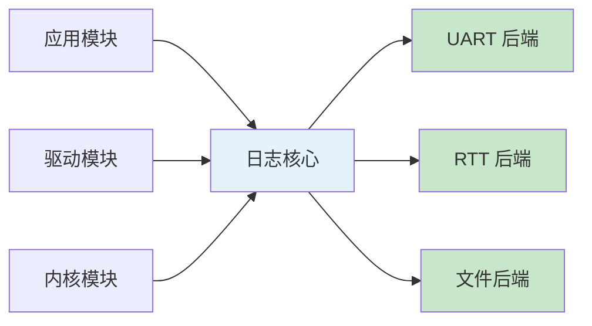
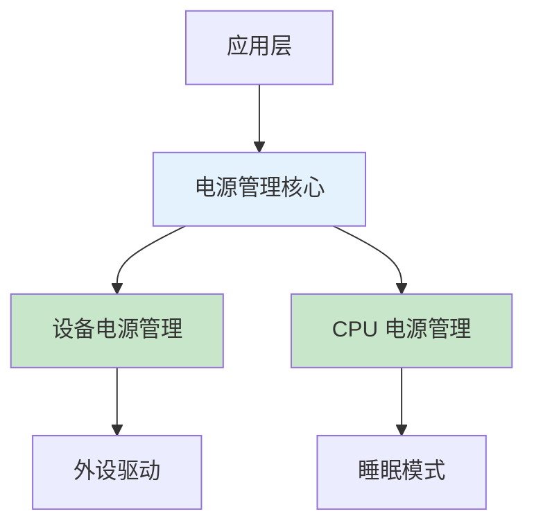

# 子系统使用

!!! info "学习目标"
    通过本节学习，您将能够：
    
    - 掌握 Zephyr 日志系统的配置和使用
    - 熟练使用 Shell 控制台进行运行时调试
    - 理解存储子系统（Flash、文件系统、NVS）的使用
    - 掌握低功耗管理的配置和优化技巧

Zephyr 提供了丰富的子系统，涵盖日志、Shell、存储、低功耗管理等核心功能。合理使用这些子系统可以大大提升开发效率和应用质量。

## 日志系统（Logging）

日志系统是调试和监控应用的重要工具。Zephyr 的日志系统支持多种后端、日志级别和格式化选项。

### 日志架构



### 配置选项

在 `prj.conf` 中配置日志系统：

```ini
# 启用日志系统
CONFIG_LOG=y

# 设置默认日志级别（0=OFF, 1=ERR, 2=WRN, 3=INF, 4=DBG）
CONFIG_LOG_DEFAULT_LEVEL=3

# 启用 UART 后端
CONFIG_LOG_BACKEND_UART=y

# 配置日志缓冲区大小（字节）
CONFIG_LOG_BUFFER_SIZE=2048

# 启用日志时间戳
CONFIG_LOG_TIMESTAMP=y

# 启用日志颜色（需要终端支持）
CONFIG_LOG_BACKEND_SHOW_COLOR=y

# 启用异步日志（提升性能）
CONFIG_LOG_MODE_DEFERRED=y
```


### 使用方法

在源文件中使用日志系统：

```c
#include <zephyr/logging/log.h>

// 注册日志模块（模块名，默认日志级别）
LOG_MODULE_REGISTER(my_module, LOG_LEVEL_INF);

void my_function(void)
{
    int value = 42;
    
    // 不同级别的日志
    LOG_ERR("Error message: %d", value);
    LOG_WRN("Warning message: %d", value);
    LOG_INF("Info message: %d", value);
    LOG_DBG("Debug message: %d", value);
    
    // 十六进制数据输出
    uint8_t data[] = {0x01, 0x02, 0x03, 0x04};
    LOG_HEXDUMP_INF(data, sizeof(data), "Data dump:");
}
```

### 日志级别说明

| 级别 | 宏 | 用途 | 示例 |
|------|-----|------|------|
| 0 | LOG_LEVEL_OFF | 关闭日志 | 生产环境 |
| 1 | LOG_LEVEL_ERR | 错误信息 | 致命错误、异常 |
| 2 | LOG_LEVEL_WRN | 警告信息 | 潜在问题、降级运行 |
| 3 | LOG_LEVEL_INF | 一般信息 | 状态变化、关键事件 |
| 4 | LOG_LEVEL_DBG | 调试信息 | 详细执行流程 |

### 日志格式化

日志输出格式示例：

```
[00:00:01.234,567] <inf> my_module: Info message: 42
[00:00:01.234,890] <wrn> my_module: Warning message: 42
[00:00:01.235,123] <err> my_module: Error message: 42
```

格式说明：
- `[00:00:01.234,567]`：时间戳（小时:分钟:秒.毫秒,微秒）
- `<inf>`：日志级别
- `my_module`：模块名
- `Info message: 42`：日志内容

### 性能影响分析

日志系统对性能的影响：

| 模式 | 延迟 | CPU 占用 | 适用场景 |
|------|------|----------|----------|
| 同步日志 | 高（阻塞） | 低 | 调试阶段 |
| 异步日志 | 低（非阻塞） | 中 | 生产环境 |
| 关闭日志 | 无 | 无 | 性能关键场景 |

!!! tip "性能优化建议"
    - 生产环境使用异步日志（`CONFIG_LOG_MODE_DEFERRED=y`）
    - 根据需要调整日志级别，避免输出过多调试信息
    - 关键性能路径中避免使用日志
    - 使用条件编译控制日志代码（`#if CONFIG_LOG`）

### 完整示例：多模块日志系统

```c
// sensor.c
#include <zephyr/logging/log.h>
LOG_MODULE_REGISTER(sensor, LOG_LEVEL_DBG);

void sensor_read(void)
{
    LOG_INF("Reading sensor data...");
    int value = 25;
    LOG_DBG("Sensor value: %d", value);
}

// main.c
#include <zephyr/logging/log.h>
LOG_MODULE_REGISTER(main, LOG_LEVEL_INF);

extern void sensor_read(void);

int main(void)
{
    LOG_INF("Application started");
    
    while (1) {
        sensor_read();
        k_sleep(K_SECONDS(1));
    }
    
    return 0;
}
```

配置文件 `prj.conf`：

```ini
CONFIG_LOG=y
CONFIG_LOG_DEFAULT_LEVEL=3
CONFIG_LOG_BACKEND_UART=y
CONFIG_LOG_MODE_DEFERRED=y
CONFIG_LOG_BUFFER_SIZE=2048
```


## Shell 控制台

Shell 控制台提供了运行时交互式调试和控制功能，可以在不重新编译的情况下查看系统状态、修改参数、执行命令。

### Shell 架构

Shell 系统采用命令树结构，支持命令分组和子命令。

### 配置 Shell

在 `prj.conf` 中启用 Shell：

```ini
# 启用 Shell
CONFIG_SHELL=y

# 启用串口后端
CONFIG_SHELL_BACKEND_SERIAL=y

# 配置 Shell 缓冲区大小
CONFIG_SHELL_CMD_BUFF_SIZE=256

# 启用命令历史
CONFIG_SHELL_HISTORY=y
CONFIG_SHELL_HISTORY_BUFFER=512

# 启用 Tab 自动补全
CONFIG_SHELL_TAB=y
CONFIG_SHELL_TAB_AUTOCOMPLETION=y

# 启用 VT100 颜色
CONFIG_SHELL_VT100_COLORS=y
```

### 使用内置命令

Zephyr 提供了丰富的内置 Shell 命令：

```bash
# 查看所有命令
uart:~$ help

# 查看内核信息
uart:~$ kernel version
uart:~$ kernel uptime
uart:~$ kernel threads

# 查看设备列表
uart:~$ device list

# 查看日志
uart:~$ log status
uart:~$ log enable inf my_module
uart:~$ log disable my_module

# 查看内存使用
uart:~$ kernel stacks
```

### 注册自定义命令

创建自定义 Shell 命令：

```c
#include <zephyr/shell/shell.h>
#include <zephyr/logging/log.h>

LOG_MODULE_REGISTER(sensor_shell, LOG_LEVEL_INF);

// 传感器读取命令
static int cmd_sensor_read(const struct shell *sh, size_t argc, char **argv)
{
    ARG_UNUSED(argc);
    ARG_UNUSED(argv);
    
    int value = 25;  // 模拟读取传感器
    shell_print(sh, "Sensor value: %d", value);
    
    return 0;
}

// 传感器配置命令
static int cmd_sensor_config(const struct shell *sh, size_t argc, char **argv)
{
    if (argc < 2) {
        shell_error(sh, "Usage: sensor config <rate>");
        return -EINVAL;
    }
    
    int rate = atoi(argv[1]);
    shell_print(sh, "Sensor rate set to: %d Hz", rate);
    
    return 0;
}

// 传感器校准命令
static int cmd_sensor_calibrate(const struct shell *sh, size_t argc, char **argv)
{
    shell_print(sh, "Calibrating sensor...");
    k_sleep(K_MSEC(500));
    shell_print(sh, "Calibration complete");
    
    return 0;
}

// 定义子命令
SHELL_STATIC_SUBCMD_SET_CREATE(sub_sensor,
    SHELL_CMD(read, NULL, "Read sensor value", cmd_sensor_read),
    SHELL_CMD(config, NULL, "Configure sensor rate", cmd_sensor_config),
    SHELL_CMD(calibrate, NULL, "Calibrate sensor", cmd_sensor_calibrate),
    SHELL_SUBCMD_SET_END
);

// 注册顶层命令
SHELL_CMD_REGISTER(sensor, &sub_sensor, "Sensor commands", NULL);
```

使用自定义命令：

```bash
uart:~$ sensor read
Sensor value: 25

uart:~$ sensor config 100
Sensor rate set to: 100 Hz

uart:~$ sensor calibrate
Calibrating sensor...
Calibration complete
```

### 命令处理函数

命令处理函数的参数说明：

```c
static int cmd_handler(const struct shell *sh, size_t argc, char **argv)
{
    // sh: Shell 实例指针，用于输出
    // argc: 参数个数（包括命令本身）
    // argv: 参数数组
    
    // 输出普通信息
    shell_print(sh, "Normal message");
    
    // 输出警告信息（黄色）
    shell_warn(sh, "Warning message");
    
    // 输出错误信息（红色）
    shell_error(sh, "Error message");
    
    // 输出信息（绿色）
    shell_info(sh, "Info message");
    
    return 0;  // 返回 0 表示成功，负数表示错误
}
```

### 运行时调试技巧

使用 Shell 进行运行时调试：

```bash
# 1. 查看线程状态
uart:~$ kernel threads
Scheduler: 257 since last call
Threads:
 0x20000a00 main            
        options: 0x0, priority: 0 timeout: 0
        state: pending
        stack size 2048, unused 1024, usage 1024 / 2048 (50 %)

# 2. 查看线程栈使用情况
uart:~$ kernel stacks
0x20000a00 main            (real size 2048):	unused 1024	usage 1024 / 2048 (50 %)

# 3. 动态调整日志级别
uart:~$ log enable dbg sensor
uart:~$ log disable main

# 4. 查看设备状态
uart:~$ device list
devices:
- gpio@50000000 (READY)
- uart@40002000 (READY)
- i2c@40003000 (READY)

# 5. 查看系统运行时间
uart:~$ kernel uptime
Uptime: 12345 ms
```


## 存储子系统

Zephyr 提供了多种存储方案，包括 Flash 存储、文件系统和非易失性存储（NVS）。

### 存储方案对比

| 存储方案 | 特性 | 性能 | 适用场景 |
|----------|------|------|----------|
| Flash API | 直接访问 Flash | 高 | 固件升级、原始数据存储 |
| LittleFS | 嵌入式文件系统 | 中 | 日志文件、配置文件 |
| FAT | 通用文件系统 | 中 | SD 卡、USB 存储 |
| NVS | 键值对存储 | 高 | 配置参数、校准数据 |

### Flash 存储

Flash 存储提供了对 Flash 分区的直接访问。

#### 配置 Flash 分区

在设备树中定义 Flash 分区：

```dts
&flash0 {
    partitions {
        compatible = "fixed-partitions";
        #address-cells = <1>;
        #size-cells = <1>;

        boot_partition: partition@0 {
            label = "mcuboot";
            reg = <0x00000000 0x0000C000>;
        };
        
        slot0_partition: partition@c000 {
            label = "image-0";
            reg = <0x0000C000 0x00076000>;
        };
        
        storage_partition: partition@82000 {
            label = "storage";
            reg = <0x00082000 0x0001E000>;
        };
    };
};
```

#### 使用 Flash API

```c
#include <zephyr/storage/flash_map.h>
#include <zephyr/logging/log.h>

LOG_MODULE_REGISTER(flash_example, LOG_LEVEL_INF);

void flash_example(void)
{
    const struct flash_area *fa;
    uint8_t write_buf[256];
    uint8_t read_buf[256];
    int rc;
    
    // 打开 Flash 分区
    rc = flash_area_open(FLASH_AREA_ID(storage), &fa);
    if (rc != 0) {
        LOG_ERR("Failed to open flash area: %d", rc);
        return;
    }
    
    // 擦除 Flash（必须先擦除才能写入）
    rc = flash_area_erase(fa, 0, fa->fa_size);
    if (rc != 0) {
        LOG_ERR("Failed to erase flash: %d", rc);
        flash_area_close(fa);
        return;
    }
    
    // 准备写入数据
    for (int i = 0; i < sizeof(write_buf); i++) {
        write_buf[i] = i;
    }
    
    // 写入数据
    rc = flash_area_write(fa, 0, write_buf, sizeof(write_buf));
    if (rc != 0) {
        LOG_ERR("Failed to write flash: %d", rc);
        flash_area_close(fa);
        return;
    }
    
    // 读取数据
    rc = flash_area_read(fa, 0, read_buf, sizeof(read_buf));
    if (rc != 0) {
        LOG_ERR("Failed to read flash: %d", rc);
        flash_area_close(fa);
        return;
    }
    
    // 验证数据
    if (memcmp(write_buf, read_buf, sizeof(write_buf)) == 0) {
        LOG_INF("Flash read/write successful");
    } else {
        LOG_ERR("Flash data mismatch");
    }
    
    // 关闭 Flash 分区
    flash_area_close(fa);
}
```

### LittleFS 文件系统

LittleFS 是专为嵌入式系统设计的文件系统，具有掉电保护和磨损均衡功能。

#### 配置 LittleFS

在 `prj.conf` 中启用 LittleFS：

```ini
# 启用文件系统
CONFIG_FILE_SYSTEM=y

# 启用 LittleFS
CONFIG_FILE_SYSTEM_LITTLEFS=y

# 配置 LittleFS 参数
CONFIG_FS_LITTLEFS_NUM_FILES=4
CONFIG_FS_LITTLEFS_NUM_DIRS=4
CONFIG_FS_LITTLEFS_CACHE_SIZE=256
```

#### 使用 LittleFS

```c
#include <zephyr/fs/fs.h>
#include <zephyr/fs/littlefs.h>
#include <zephyr/storage/flash_map.h>
#include <zephyr/logging/log.h>

LOG_MODULE_REGISTER(littlefs_example, LOG_LEVEL_INF);

// 定义挂载点
FS_LITTLEFS_DECLARE_DEFAULT_CONFIG(storage);
static struct fs_mount_t lfs_mnt = {
    .type = FS_LITTLEFS,
    .fs_data = &storage,
    .storage_dev = (void *)FLASH_AREA_ID(storage),
    .mnt_point = "/lfs",
};

void littlefs_example(void)
{
    struct fs_file_t file;
    int rc;
    
    // 挂载文件系统
    rc = fs_mount(&lfs_mnt);
    if (rc != 0) {
        LOG_ERR("Failed to mount filesystem: %d", rc);
        return;
    }
    LOG_INF("Filesystem mounted at %s", lfs_mnt.mnt_point);
    
    // 初始化文件结构
    fs_file_t_init(&file);
    
    // 打开文件（创建或覆盖）
    rc = fs_open(&file, "/lfs/test.txt", FS_O_CREATE | FS_O_WRITE);
    if (rc != 0) {
        LOG_ERR("Failed to open file: %d", rc);
        return;
    }
    
    // 写入数据
    const char *data = "Hello, LittleFS!";
    rc = fs_write(&file, data, strlen(data));
    if (rc < 0) {
        LOG_ERR("Failed to write file: %d", rc);
        fs_close(&file);
        return;
    }
    LOG_INF("Wrote %d bytes", rc);
    
    // 关闭文件
    fs_close(&file);
    
    // 重新打开文件读取
    rc = fs_open(&file, "/lfs/test.txt", FS_O_READ);
    if (rc != 0) {
        LOG_ERR("Failed to open file for reading: %d", rc);
        return;
    }
    
    // 读取数据
    char read_buf[64];
    rc = fs_read(&file, read_buf, sizeof(read_buf) - 1);
    if (rc < 0) {
        LOG_ERR("Failed to read file: %d", rc);
        fs_close(&file);
        return;
    }
    read_buf[rc] = '\0';
    LOG_INF("Read: %s", read_buf);
    
    // 关闭文件
    fs_close(&file);
    
    // 列出目录内容
    struct fs_dir_t dir;
    fs_dir_t_init(&dir);
    
    rc = fs_opendir(&dir, "/lfs");
    if (rc != 0) {
        LOG_ERR("Failed to open directory: %d", rc);
        return;
    }
    
    struct fs_dirent entry;
    while (fs_readdir(&dir, &entry) == 0) {
        if (entry.name[0] == 0) {
            break;
        }
        LOG_INF("File: %s, size: %zu", entry.name, entry.size);
    }
    
    fs_closedir(&dir);
}
```


### NVS（非易失性存储）

NVS 提供了简单的键值对存储，适合保存配置参数和校准数据。

#### 配置 NVS

在 `prj.conf` 中启用 NVS：

```ini
# 启用 NVS
CONFIG_NVS=y

# 配置 Flash
CONFIG_FLASH=y
CONFIG_FLASH_MAP=y
```

在设备树中定义存储分区（如前面 Flash 存储部分所示）。

#### 使用 NVS

```c
#include <zephyr/fs/nvs.h>
#include <zephyr/storage/flash_map.h>
#include <zephyr/logging/log.h>

LOG_MODULE_REGISTER(nvs_example, LOG_LEVEL_INF);

// NVS 文件系统实例
static struct nvs_fs fs;

// 配置参数 ID
#define NVS_ID_SENSOR_RATE    1
#define NVS_ID_SENSOR_OFFSET  2
#define NVS_ID_DEVICE_NAME    3

void nvs_example(void)
{
    int rc;
    
    // 获取 Flash 分区信息
    struct flash_sector sectors[8];
    const struct flash_area *fa;
    
    rc = flash_area_open(FLASH_AREA_ID(storage), &fa);
    if (rc != 0) {
        LOG_ERR("Failed to open flash area: %d", rc);
        return;
    }
    
    // 初始化 NVS
    fs.flash_device = fa->fa_dev;
    fs.offset = fa->fa_off;
    fs.sector_size = 4096;
    fs.sector_count = fa->fa_size / fs.sector_size;
    
    rc = nvs_mount(&fs);
    if (rc != 0) {
        LOG_ERR("Failed to mount NVS: %d", rc);
        flash_area_close(fa);
        return;
    }
    LOG_INF("NVS mounted successfully");
    
    // 写入整数值
    uint32_t sensor_rate = 100;
    rc = nvs_write(&fs, NVS_ID_SENSOR_RATE, &sensor_rate, sizeof(sensor_rate));
    if (rc < 0) {
        LOG_ERR("Failed to write sensor rate: %d", rc);
    } else {
        LOG_INF("Wrote sensor rate: %u", sensor_rate);
    }
    
    // 写入浮点数值
    float sensor_offset = 1.5f;
    rc = nvs_write(&fs, NVS_ID_SENSOR_OFFSET, &sensor_offset, sizeof(sensor_offset));
    if (rc < 0) {
        LOG_ERR("Failed to write sensor offset: %d", rc);
    } else {
        LOG_INF("Wrote sensor offset: %.2f", sensor_offset);
    }
    
    // 写入字符串
    const char *device_name = "MyDevice";
    rc = nvs_write(&fs, NVS_ID_DEVICE_NAME, device_name, strlen(device_name) + 1);
    if (rc < 0) {
        LOG_ERR("Failed to write device name: %d", rc);
    } else {
        LOG_INF("Wrote device name: %s", device_name);
    }
    
    // 读取整数值
    uint32_t read_rate;
    rc = nvs_read(&fs, NVS_ID_SENSOR_RATE, &read_rate, sizeof(read_rate));
    if (rc > 0) {
        LOG_INF("Read sensor rate: %u", read_rate);
    } else {
        LOG_ERR("Failed to read sensor rate: %d", rc);
    }
    
    // 读取浮点数值
    float read_offset;
    rc = nvs_read(&fs, NVS_ID_SENSOR_OFFSET, &read_offset, sizeof(read_offset));
    if (rc > 0) {
        LOG_INF("Read sensor offset: %.2f", read_offset);
    } else {
        LOG_ERR("Failed to read sensor offset: %d", rc);
    }
    
    // 读取字符串
    char read_name[32];
    rc = nvs_read(&fs, NVS_ID_DEVICE_NAME, read_name, sizeof(read_name));
    if (rc > 0) {
        LOG_INF("Read device name: %s", read_name);
    } else {
        LOG_ERR("Failed to read device name: %d", rc);
    }
    
    // 删除条目
    rc = nvs_delete(&fs, NVS_ID_SENSOR_RATE);
    if (rc == 0) {
        LOG_INF("Deleted sensor rate");
    }
    
    flash_area_close(fa);
}
```

#### NVS 最佳实践

!!! tip "NVS 使用建议"
    - 使用有意义的 ID 常量，避免硬编码数字
    - 定期检查返回值，处理读写错误
    - 避免频繁写入同一个键（Flash 有写入次数限制）
    - 使用版本号管理配置数据格式
    - 在写入前验证数据有效性

### 存储性能优化

#### 磨损均衡

Flash 存储有写入次数限制，需要实现磨损均衡：

- LittleFS 和 NVS 都内置了磨损均衡机制
- 避免频繁写入同一位置
- 使用循环缓冲区分散写入

#### 缓存策略

优化存储访问性能：

```c
// 使用内存缓存减少 Flash 访问
static struct {
    uint32_t sensor_rate;
    float sensor_offset;
    bool dirty;
} config_cache;

void config_load(void)
{
    nvs_read(&fs, NVS_ID_SENSOR_RATE, &config_cache.sensor_rate, 
             sizeof(config_cache.sensor_rate));
    nvs_read(&fs, NVS_ID_SENSOR_OFFSET, &config_cache.sensor_offset, 
             sizeof(config_cache.sensor_offset));
    config_cache.dirty = false;
}

void config_save(void)
{
    if (config_cache.dirty) {
        nvs_write(&fs, NVS_ID_SENSOR_RATE, &config_cache.sensor_rate, 
                  sizeof(config_cache.sensor_rate));
        nvs_write(&fs, NVS_ID_SENSOR_OFFSET, &config_cache.sensor_offset, 
                  sizeof(config_cache.sensor_offset));
        config_cache.dirty = false;
    }
}

void config_set_rate(uint32_t rate)
{
    config_cache.sensor_rate = rate;
    config_cache.dirty = true;
}
```


## 低功耗管理

低功耗管理是物联网设备的关键需求。Zephyr 提供了完善的电源管理框架。

### 电源管理架构



### 睡眠模式

Zephyr 支持多种睡眠模式：

| 模式 | 功耗 | 唤醒时间 | 保持状态 | 适用场景 |
|------|------|----------|----------|----------|
| Active | 最高 | - | 全部 | 正常运行 |
| Idle | 高 | 微秒级 | 全部 | 短暂空闲 |
| Standby | 中 | 毫秒级 | RAM | 周期性任务 |
| Suspend | 低 | 秒级 | 部分 RAM | 长时间休眠 |
| Deep Sleep | 最低 | 秒级 | 无 | 极低功耗 |

### 配置电源管理

在 `prj.conf` 中启用电源管理：

```ini
# 启用电源管理
CONFIG_PM=y

# 启用设备电源管理
CONFIG_PM_DEVICE=y

# 启用设备运行时电源管理
CONFIG_PM_DEVICE_RUNTIME=y

# 配置空闲时自动进入低功耗模式
CONFIG_PM_POLICY_DEFAULT=y

# 启用电源管理调试
CONFIG_PM_DEBUG=y
```

### 使用电源管理

#### 设备电源管理

控制外设的电源状态：

```c
#include <zephyr/pm/device.h>
#include <zephyr/device.h>
#include <zephyr/logging/log.h>

LOG_MODULE_REGISTER(pm_example, LOG_LEVEL_INF);

void device_power_example(void)
{
    const struct device *i2c_dev = DEVICE_DT_GET(DT_NODELABEL(i2c0));
    
    if (!device_is_ready(i2c_dev)) {
        LOG_ERR("I2C device not ready");
        return;
    }
    
    // 使用设备前确保其处于活动状态
    pm_device_action_run(i2c_dev, PM_DEVICE_ACTION_RESUME);
    
    // 使用 I2C 设备
    // ... I2C 操作 ...
    
    // 使用完毕后挂起设备以节省功耗
    pm_device_action_run(i2c_dev, PM_DEVICE_ACTION_SUSPEND);
    
    LOG_INF("Device suspended");
}
```

#### 系统睡眠

应用主动进入睡眠模式：

```c
#include <zephyr/kernel.h>
#include <zephyr/pm/pm.h>
#include <zephyr/logging/log.h>

LOG_MODULE_REGISTER(sleep_example, LOG_LEVEL_INF);

void sleep_example(void)
{
    LOG_INF("Entering sleep mode");
    
    // 睡眠 5 秒（系统会自动选择合适的睡眠模式）
    k_sleep(K_SECONDS(5));
    
    LOG_INF("Woke up from sleep");
}
```

### 唤醒源配置

配置 GPIO 中断作为唤醒源：

```c
#include <zephyr/drivers/gpio.h>
#include <zephyr/pm/pm.h>
#include <zephyr/logging/log.h>

LOG_MODULE_REGISTER(wakeup_example, LOG_LEVEL_INF);

static const struct gpio_dt_spec button = GPIO_DT_SPEC_GET(DT_ALIAS(sw0), gpios);
static struct gpio_callback button_cb_data;

void button_pressed(const struct device *dev, struct gpio_callback *cb, uint32_t pins)
{
    LOG_INF("Button pressed - woke up from sleep");
}

void wakeup_source_setup(void)
{
    if (!device_is_ready(button.port)) {
        LOG_ERR("Button device not ready");
        return;
    }
    
    // 配置按钮为输入，带上拉
    gpio_pin_configure_dt(&button, GPIO_INPUT);
    
    // 配置中断（下降沿触发）
    gpio_pin_interrupt_configure_dt(&button, GPIO_INT_EDGE_TO_ACTIVE);
    
    // 注册中断回调
    gpio_init_callback(&button_cb_data, button_pressed, BIT(button.pin));
    gpio_add_callback(button.port, &button_cb_data);
    
    LOG_INF("Wakeup source configured");
}
```

### 功耗测量

测量系统功耗的方法：

#### 硬件测量

使用电流表或功耗分析仪：

1. 断开开发板的 USB 供电
2. 使用外部电源供电
3. 在电源和开发板之间串联电流表
4. 记录不同模式下的电流值

#### 软件估算

使用 Zephyr 的功耗统计功能：

```c
#include <zephyr/pm/pm.h>
#include <zephyr/logging/log.h>

LOG_MODULE_REGISTER(power_stats, LOG_LEVEL_INF);

void print_power_stats(void)
{
    // 获取电源管理统计信息
    struct pm_state_info info;
    
    for (int i = 0; i < PM_STATE_COUNT; i++) {
        if (pm_state_get(i, &info)) {
            LOG_INF("State %d: min_residency=%u, exit_latency=%u",
                    i, info.min_residency_us, info.exit_latency_us);
        }
    }
}
```

### 低功耗应用示例

完整的低功耗数据采集器示例：

```c
#include <zephyr/kernel.h>
#include <zephyr/device.h>
#include <zephyr/drivers/sensor.h>
#include <zephyr/pm/pm.h>
#include <zephyr/pm/device.h>
#include <zephyr/fs/nvs.h>
#include <zephyr/logging/log.h>

LOG_MODULE_REGISTER(low_power_app, LOG_LEVEL_INF);

// 采集间隔（秒）
#define SAMPLE_INTERVAL 60

// NVS 实例
static struct nvs_fs fs;

void sensor_sample_and_store(void)
{
    const struct device *sensor = DEVICE_DT_GET(DT_NODELABEL(sensor0));
    struct sensor_value temp;
    
    // 唤醒传感器
    pm_device_action_run(sensor, PM_DEVICE_ACTION_RESUME);
    
    // 读取传感器数据
    sensor_sample_fetch(sensor);
    sensor_channel_get(sensor, SENSOR_CHAN_AMBIENT_TEMP, &temp);
    
    LOG_INF("Temperature: %d.%06d C", temp.val1, temp.val2);
    
    // 存储数据到 NVS
    uint32_t timestamp = k_uptime_get_32();
    nvs_write(&fs, timestamp, &temp, sizeof(temp));
    
    // 挂起传感器
    pm_device_action_run(sensor, PM_DEVICE_ACTION_SUSPEND);
}

int main(void)
{
    LOG_INF("Low power data logger started");
    
    // 初始化 NVS
    // ... NVS 初始化代码 ...
    
    while (1) {
        // 采集和存储数据
        sensor_sample_and_store();
        
        // 进入睡眠模式
        LOG_INF("Entering sleep for %d seconds", SAMPLE_INTERVAL);
        k_sleep(K_SECONDS(SAMPLE_INTERVAL));
    }
    
    return 0;
}
```

配置文件 `prj.conf`：

```ini
# 电源管理
CONFIG_PM=y
CONFIG_PM_DEVICE=y
CONFIG_PM_DEVICE_RUNTIME=y

# 传感器
CONFIG_SENSOR=y

# 存储
CONFIG_NVS=y
CONFIG_FLASH=y
CONFIG_FLASH_MAP=y

# 日志
CONFIG_LOG=y
CONFIG_LOG_DEFAULT_LEVEL=3
```


### 功耗优化技巧

!!! tip "功耗优化建议"
    
    **1. 外设管理**
    - 不使用的外设及时关闭
    - 使用设备运行时电源管理（`CONFIG_PM_DEVICE_RUNTIME`）
    - 优先使用低功耗外设（如 LPUART）
    
    **2. 时钟管理**
    - 降低 CPU 时钟频率
    - 关闭不需要的时钟源
    - 使用低功耗时钟（如 32kHz RTC）
    
    **3. 内存优化**
    - 减少 RAM 使用（RAM 需要持续供电）
    - 使用 Flash 存储常量数据
    - 关闭不需要的内存区域
    
    **4. 任务调度**
    - 合并周期性任务，减少唤醒次数
    - 使用更长的睡眠周期
    - 避免频繁的上下文切换
    
    **5. 通信优化**
    - 批量传输数据，减少通信次数
    - 使用低功耗通信协议（如 BLE）
    - 优化通信参数（如 BLE 连接间隔）

### 功耗测试案例

不同配置下的功耗对比：

| 配置 | 平均功耗 | 峰值功耗 | 电池寿命（2000mAh） |
|------|----------|----------|---------------------|
| 无优化（Active） | 10 mA | 20 mA | 8 天 |
| 启用 Idle | 5 mA | 20 mA | 16 天 |
| 启用 Standby | 500 µA | 20 mA | 166 天 |
| 深度优化 | 50 µA | 20 mA | 4.5 年 |

!!! example "优化效果"
    通过合理的电源管理配置，可以将平均功耗从 10mA 降低到 50µA，电池寿命从 8 天延长到 4.5 年！

## 子系统集成实战

### 实操任务 1：集成日志和 Shell

创建一个集成日志和 Shell 的应用，实现运行时日志级别调整。

#### 项目结构

```
my_app/
├── CMakeLists.txt
├── prj.conf
└── src/
    └── main.c
```

#### CMakeLists.txt

```cmake
cmake_minimum_required(VERSION 3.20.0)
find_package(Zephyr REQUIRED HINTS $ENV{ZEPHYR_BASE})
project(log_shell_app)

target_sources(app PRIVATE src/main.c)
```

#### prj.conf

```ini
# 日志系统
CONFIG_LOG=y
CONFIG_LOG_DEFAULT_LEVEL=3
CONFIG_LOG_BACKEND_UART=y
CONFIG_LOG_MODE_DEFERRED=y

# Shell 系统
CONFIG_SHELL=y
CONFIG_SHELL_BACKEND_SERIAL=y
CONFIG_SHELL_HISTORY=y
CONFIG_SHELL_TAB_AUTOCOMPLETION=y

# 串口
CONFIG_SERIAL=y
CONFIG_UART_CONSOLE=y
```

#### src/main.c

```c
#include <zephyr/kernel.h>
#include <zephyr/shell/shell.h>
#include <zephyr/logging/log.h>

LOG_MODULE_REGISTER(main, LOG_LEVEL_INF);

// 模拟传感器模块
LOG_MODULE_DECLARE(sensor, LOG_LEVEL_DBG);

// 传感器读取函数
void sensor_read(void)
{
    LOG_DBG("Reading sensor...");
    int value = 25;
    LOG_INF("Sensor value: %d", value);
}

// Shell 命令：读取传感器
static int cmd_sensor_read(const struct shell *sh, size_t argc, char **argv)
{
    sensor_read();
    return 0;
}

// Shell 命令：设置日志级别
static int cmd_log_level(const struct shell *sh, size_t argc, char **argv)
{
    if (argc < 3) {
        shell_error(sh, "Usage: loglevel <module> <level>");
        shell_print(sh, "Levels: 0=OFF, 1=ERR, 2=WRN, 3=INF, 4=DBG");
        return -EINVAL;
    }
    
    const char *module = argv[1];
    int level = atoi(argv[2]);
    
    shell_print(sh, "Setting %s log level to %d", module, level);
    
    // 这里简化处理，实际应该使用 log_filter_set()
    return 0;
}

SHELL_STATIC_SUBCMD_SET_CREATE(sub_app,
    SHELL_CMD(sensor, NULL, "Read sensor", cmd_sensor_read),
    SHELL_CMD(loglevel, NULL, "Set log level", cmd_log_level),
    SHELL_SUBCMD_SET_END
);

SHELL_CMD_REGISTER(app, &sub_app, "Application commands", NULL);

int main(void)
{
    LOG_INF("Application started");
    
    while (1) {
        sensor_read();
        k_sleep(K_SECONDS(5));
    }
    
    return 0;
}
```

#### 编译和运行

```bash
west build -b nrf52840dk_nrf52840
west flash
```

#### 测试

```bash
uart:~$ app sensor
[00:00:05.123,456] <inf> main: Sensor value: 25

uart:~$ app loglevel main 4
Setting main log level to 4

uart:~$ kernel threads
Scheduler: 123 since last call
Threads:
 0x20000a00 main            
        options: 0x0, priority: 0 timeout: 0
        state: pending
```

### 实操任务 2：使用 NVS 保存传感器校准参数

创建一个应用，使用 NVS 保存和读取传感器校准参数。

#### prj.conf

```ini
CONFIG_NVS=y
CONFIG_FLASH=y
CONFIG_FLASH_MAP=y
CONFIG_LOG=y
CONFIG_LOG_DEFAULT_LEVEL=3
```

#### src/main.c

```c
#include <zephyr/kernel.h>
#include <zephyr/fs/nvs.h>
#include <zephyr/storage/flash_map.h>
#include <zephyr/logging/log.h>

LOG_MODULE_REGISTER(calibration, LOG_LEVEL_INF);

static struct nvs_fs fs;

#define NVS_ID_CAL_OFFSET  1
#define NVS_ID_CAL_SCALE   2

typedef struct {
    float offset;
    float scale;
} sensor_calibration_t;

int calibration_init(void)
{
    int rc;
    const struct flash_area *fa;
    
    rc = flash_area_open(FLASH_AREA_ID(storage), &fa);
    if (rc != 0) {
        LOG_ERR("Failed to open flash area: %d", rc);
        return rc;
    }
    
    fs.flash_device = fa->fa_dev;
    fs.offset = fa->fa_off;
    fs.sector_size = 4096;
    fs.sector_count = fa->fa_size / fs.sector_size;
    
    rc = nvs_mount(&fs);
    if (rc != 0) {
        LOG_ERR("Failed to mount NVS: %d", rc);
        flash_area_close(fa);
        return rc;
    }
    
    LOG_INF("NVS initialized");
    flash_area_close(fa);
    return 0;
}

int calibration_save(sensor_calibration_t *cal)
{
    int rc;
    
    rc = nvs_write(&fs, NVS_ID_CAL_OFFSET, &cal->offset, sizeof(cal->offset));
    if (rc < 0) {
        LOG_ERR("Failed to write offset: %d", rc);
        return rc;
    }
    
    rc = nvs_write(&fs, NVS_ID_CAL_SCALE, &cal->scale, sizeof(cal->scale));
    if (rc < 0) {
        LOG_ERR("Failed to write scale: %d", rc);
        return rc;
    }
    
    LOG_INF("Calibration saved: offset=%.2f, scale=%.2f", cal->offset, cal->scale);
    return 0;
}

int calibration_load(sensor_calibration_t *cal)
{
    int rc;
    
    rc = nvs_read(&fs, NVS_ID_CAL_OFFSET, &cal->offset, sizeof(cal->offset));
    if (rc < 0) {
        LOG_WRN("Failed to read offset, using default");
        cal->offset = 0.0f;
    }
    
    rc = nvs_read(&fs, NVS_ID_CAL_SCALE, &cal->scale, sizeof(cal->scale));
    if (rc < 0) {
        LOG_WRN("Failed to read scale, using default");
        cal->scale = 1.0f;
    }
    
    LOG_INF("Calibration loaded: offset=%.2f, scale=%.2f", cal->offset, cal->scale);
    return 0;
}

int main(void)
{
    sensor_calibration_t cal;
    
    LOG_INF("Calibration example started");
    
    // 初始化 NVS
    if (calibration_init() != 0) {
        LOG_ERR("Failed to initialize calibration");
        return -1;
    }
    
    // 加载校准参数
    calibration_load(&cal);
    
    // 模拟校准过程
    LOG_INF("Performing calibration...");
    k_sleep(K_SECONDS(2));
    
    cal.offset = 1.5f;
    cal.scale = 0.98f;
    
    // 保存校准参数
    calibration_save(&cal);
    
    // 验证：重新加载
    sensor_calibration_t cal_verify;
    calibration_load(&cal_verify);
    
    if (cal_verify.offset == cal.offset && cal_verify.scale == cal.scale) {
        LOG_INF("Calibration verified successfully");
    } else {
        LOG_ERR("Calibration verification failed");
    }
    
    return 0;
}
```


### 实操任务 3：低功耗数据采集器

创建一个低功耗数据采集器，周期性唤醒、采集数据、存储、然后休眠。

#### prj.conf

```ini
# 电源管理
CONFIG_PM=y
CONFIG_PM_DEVICE=y
CONFIG_PM_DEVICE_RUNTIME=y

# 存储
CONFIG_NVS=y
CONFIG_FLASH=y
CONFIG_FLASH_MAP=y

# 日志
CONFIG_LOG=y
CONFIG_LOG_DEFAULT_LEVEL=3
CONFIG_LOG_MODE_DEFERRED=y

# GPIO（用于唤醒）
CONFIG_GPIO=y
```

#### src/main.c

```c
#include <zephyr/kernel.h>
#include <zephyr/pm/pm.h>
#include <zephyr/pm/device.h>
#include <zephyr/fs/nvs.h>
#include <zephyr/storage/flash_map.h>
#include <zephyr/drivers/gpio.h>
#include <zephyr/logging/log.h>

LOG_MODULE_REGISTER(low_power_logger, LOG_LEVEL_INF);

// 采集间隔（秒）
#define SAMPLE_INTERVAL 10

// NVS 实例
static struct nvs_fs fs;

// 按钮配置（用于唤醒）
static const struct gpio_dt_spec button = GPIO_DT_SPEC_GET_OR(DT_ALIAS(sw0), gpios, {0});
static struct gpio_callback button_cb_data;

// 数据结构
typedef struct {
    uint32_t timestamp;
    int16_t temperature;
    uint16_t humidity;
} sensor_data_t;

// 按钮中断回调
void button_pressed(const struct device *dev, struct gpio_callback *cb, uint32_t pins)
{
    LOG_INF("Button pressed - manual wakeup");
}

int nvs_init(void)
{
    int rc;
    const struct flash_area *fa;
    
    rc = flash_area_open(FLASH_AREA_ID(storage), &fa);
    if (rc != 0) {
        return rc;
    }
    
    fs.flash_device = fa->fa_dev;
    fs.offset = fa->fa_off;
    fs.sector_size = 4096;
    fs.sector_count = fa->fa_size / fs.sector_size;
    
    rc = nvs_mount(&fs);
    flash_area_close(fa);
    
    return rc;
}

void sensor_sample(sensor_data_t *data)
{
    // 模拟传感器读取
    data->timestamp = k_uptime_get_32();
    data->temperature = 2500;  // 25.00°C
    data->humidity = 6500;     // 65.00%
    
    LOG_INF("Sampled: T=%d.%02d°C, H=%d.%02d%%",
            data->temperature / 100, data->temperature % 100,
            data->humidity / 100, data->humidity % 100);
}

void data_store(sensor_data_t *data)
{
    static uint16_t data_id = 100;
    
    int rc = nvs_write(&fs, data_id++, data, sizeof(sensor_data_t));
    if (rc < 0) {
        LOG_ERR("Failed to store data: %d", rc);
    } else {
        LOG_INF("Data stored with ID: %d", data_id - 1);
    }
}

void wakeup_source_init(void)
{
    if (!device_is_ready(button.port)) {
        LOG_WRN("Button not available");
        return;
    }
    
    gpio_pin_configure_dt(&button, GPIO_INPUT);
    gpio_pin_interrupt_configure_dt(&button, GPIO_INT_EDGE_TO_ACTIVE);
    gpio_init_callback(&button_cb_data, button_pressed, BIT(button.pin));
    gpio_add_callback(button.port, &button_cb_data);
    
    LOG_INF("Wakeup source configured");
}

int main(void)
{
    sensor_data_t data;
    int sample_count = 0;
    
    LOG_INF("Low power data logger started");
    
    // 初始化 NVS
    if (nvs_init() != 0) {
        LOG_ERR("Failed to initialize NVS");
        return -1;
    }
    LOG_INF("NVS initialized");
    
    // 配置唤醒源
    wakeup_source_init();
    
    while (1) {
        // 采集数据
        sensor_sample(&data);
        
        // 存储数据
        data_store(&data);
        
        sample_count++;
        LOG_INF("Sample count: %d", sample_count);
        
        // 进入睡眠模式
        LOG_INF("Entering sleep for %d seconds...", SAMPLE_INTERVAL);
        
        // 刷新日志缓冲区（异步日志模式）
        k_sleep(K_MSEC(100));
        
        // 睡眠
        k_sleep(K_SECONDS(SAMPLE_INTERVAL));
        
        LOG_INF("Woke up from sleep");
    }
    
    return 0;
}
```

#### 编译和测试

```bash
# 编译
west build -b nrf52840dk_nrf52840

# 烧录
west flash

# 查看输出
minicom -D /dev/ttyACM0
```

#### 预期输出

```
[00:00:00.123,456] <inf> low_power_logger: Low power data logger started
[00:00:00.123,789] <inf> low_power_logger: NVS initialized
[00:00:00.124,012] <inf> low_power_logger: Wakeup source configured
[00:00:00.124,345] <inf> low_power_logger: Sampled: T=25.00°C, H=65.00%
[00:00:00.124,678] <inf> low_power_logger: Data stored with ID: 100
[00:00:00.124,901] <inf> low_power_logger: Sample count: 1
[00:00:00.125,234] <inf> low_power_logger: Entering sleep for 10 seconds...
[00:00:10.125,567] <inf> low_power_logger: Woke up from sleep
[00:00:10.125,890] <inf> low_power_logger: Sampled: T=25.00°C, H=65.00%
...
```

#### 功耗测试

使用电流表测量不同阶段的功耗：

| 阶段 | 电流 | 持续时间 | 占比 |
|------|------|----------|------|
| 采集和存储 | 10 mA | 100 ms | 1% |
| 睡眠 | 50 µA | 9.9 s | 99% |
| 平均功耗 | ~150 µA | - | - |

!!! success "优化效果"
    通过合理的睡眠策略，平均功耗降低到 150µA，使用 2000mAh 电池可以运行约 1.5 年！

## 学习总结

通过本节学习，您应该掌握了：

- ✓ 日志系统的配置和使用，能够进行多模块日志管理
- ✓ Shell 控制台的使用，能够创建自定义命令进行运行时调试
- ✓ 存储子系统的使用，包括 Flash、LittleFS 和 NVS
- ✓ 低功耗管理的配置和优化，能够设计低功耗应用

## 常见问题

!!! danger "问题 1：日志输出不完整"
    **症状**：日志输出被截断或丢失
    
    **原因**：
    - 日志缓冲区太小
    - 异步日志模式下，程序退出前未刷新缓冲区
    
    **解决方案**：
    ```ini
    # 增加日志缓冲区
    CONFIG_LOG_BUFFER_SIZE=4096
    
    # 或使用同步日志模式（调试阶段）
    CONFIG_LOG_MODE_IMMEDIATE=y
    ```
    
    在程序退出前刷新日志：
    ```c
    k_sleep(K_MSEC(100));  // 等待日志输出完成
    ```

!!! danger "问题 2：NVS 写入失败"
    **症状**：`nvs_write()` 返回负数错误码
    
    **原因**：
    - Flash 分区未正确配置
    - Flash 未擦除
    - 数据大小超过限制
    
    **解决方案**：
    ```c
    // 检查返回值
    int rc = nvs_write(&fs, id, data, size);
    if (rc == -ENOSPC) {
        LOG_ERR("NVS full, need to clear");
        // 清理旧数据或重新格式化
    } else if (rc < 0) {
        LOG_ERR("NVS write failed: %d", rc);
    }
    ```

!!! danger "问题 3：设备无法进入低功耗模式"
    **症状**：配置了电源管理，但功耗仍然很高
    
    **原因**：
    - 有外设未挂起
    - 有线程处于就绪状态
    - 定时器或中断频繁唤醒
    
    **解决方案**：
    ```bash
    # 使用 Shell 检查线程状态
    uart:~$ kernel threads
    
    # 检查设备状态
    uart:~$ device list
    ```
    
    确保所有外设都已挂起：
    ```c
    pm_device_action_run(device, PM_DEVICE_ACTION_SUSPEND);
    ```

## 下一步

完成本节学习后，您已经掌握了 Zephyr 的核心子系统。接下来可以：

- 进入[第三阶段：高级深耕期](../stage3-advanced/index.md)，学习源码分析和系统优化
- 开始实际项目开发，将所学知识应用到实践中
- 深入学习特定子系统的高级特性

---

!!! question "需要帮助？"
    如果您在学习过程中遇到问题，可以：
    
    - 查看 [Zephyr 官方文档 - Subsystems](https://docs.zephyrproject.org/latest/services/index.html)
    - 在 [GitHub Issues](https://github.com/your-repo/issues) 报告问题
    - 在 [GitHub Discussions](https://github.com/your-repo/discussions) 提问交流
