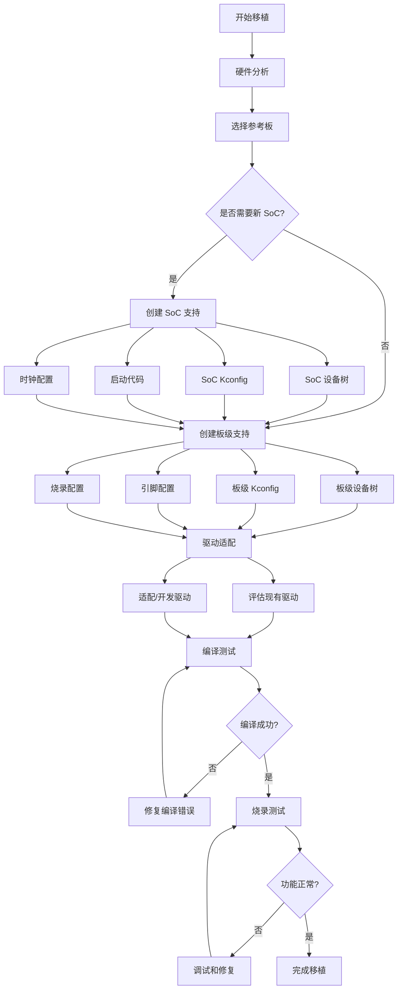

# BSP 移植指南

## 概述

BSP（Board Support Package，板级支持包）移植是将 Zephyr RTOS 适配到新硬件平台的过程。本章节将系统地介绍 BSP 移植的完整流程，从前期准备到最终验证，帮助你掌握为新 SoC 和开发板移植 Zephyr 的核心技能。

!!! info "学习目标"
    完成本章节学习后，你将能够：
    
    - 理解 Zephyr BSP 的架构和组织结构
    - 为新的 SoC 创建完整的设备树和配置
    - 适配和开发硬件驱动程序
    - 配置启动代码和链接脚本
    - 验证和测试移植的正确性
    - 解决常见的移植问题

!!! warning "前置要求"
    在开始 BSP 移植之前，你应该：
    
    - 熟悉 Zephyr 的设备树和 Kconfig 系统
    - 了解目标 SoC 的硬件架构和外设
    - 掌握 C 语言和汇编语言基础
    - 具备硬件调试经验（JTAG/SWD）

## 移植准备

### 硬件需求分析

在开始移植之前，需要全面了解目标硬件的特性：


**1. CPU 架构信息**

| 项目 | 需要确认的信息 |
|------|---------------|
| CPU 内核 | Cortex-M0/M3/M4/M7, RISC-V, x86, ARC 等 |
| 主频范围 | 最小/最大频率，PLL 配置 |
| 浮点单元 | 是否支持 FPU，单精度/双精度 |
| 内存保护 | MPU/MMU 支持情况 |
| 指令集 | Thumb, Thumb-2, RV32I/RV64I 等 |

**2. 内存配置**

| 内存类型 | 需要确认的信息 |
|---------|---------------|
| Flash | 起始地址、大小、扇区划分 |
| SRAM | 起始地址、大小、分区（如 DTCM/ITCM） |
| 外部存储 | QSPI Flash、SDRAM 等 |
| 启动模式 | 从 Flash/RAM 启动的地址映射 |

**3. 外设清单**

需要列出所有需要支持的外设及其特性：

- **通信接口**：UART、SPI、I2C、CAN、USB、Ethernet
- **定时器**：系统定时器、通用定时器、看门狗
- **GPIO**：引脚数量、中断能力、复用功能
- **模拟外设**：ADC、DAC、比较器
- **其他外设**：DMA、RTC、加密引擎等

### 参考文档收集


移植过程中需要准备以下文档：

!!! tip "必备文档"
    1. **芯片数据手册（Datasheet）**：包含电气特性、引脚定义、功能框图
    2. **参考手册（Reference Manual）**：详细的寄存器定义和外设说明
    3. **编程手册（Programming Manual）**：CPU 指令集和编程模型
    4. **勘误表（Errata）**：已知的硬件问题和解决方案
    5. **参考设计（Reference Design）**：官方开发板的原理图和 PCB 设计

### 选择参考板

找到一个与目标硬件相似的已支持板子作为参考，可以大大加快移植速度：

```bash
# 查看 Zephyr 支持的所有板子
west boards

# 查看特定架构的板子
west boards --arch arm

# 查看特定 SoC 系列的板子
west boards | grep stm32
```

**选择参考板的标准**：

1. **相同的 CPU 架构**：优先选择相同内核的 SoC
2. **相似的外设配置**：外设类型和数量接近
3. **相同的厂商**：同一厂商的 SoC 通常有相似的设计
4. **活跃的维护**：选择最近更新过的板子

### 工具准备


**硬件工具**：

- **调试器**：J-Link、ST-Link、DAPLink 等
- **烧录器**：根据目标芯片选择合适的烧录工具
- **逻辑分析仪**：用于调试通信协议（可选）
- **示波器**：用于信号分析（可选）

**软件工具**：

```bash
# 安装 Zephyr SDK（包含交叉编译工具链）
# 已在环境搭建阶段完成

# 安装调试工具
sudo apt-get install gdb-multiarch openocd

# 安装设备树编译器
sudo apt-get install device-tree-compiler
```

### 移植流程图



## SoC 移植

### 创建 SoC 目录结构

Zephyr 的 SoC 支持文件位于 `soc/` 目录下，按架构和厂商组织：

```
soc/
├── arm/
│   ├── st_stm32/
│   │   ├── stm32f1/
│   │   ├── stm32f4/
│   │   └── stm32g0/      # 我们要添加的新系列
│   ├── nordic_nrf/
│   └── ...
├── riscv/
└── x86/
```

**创建新 SoC 系列的目录结构**：

```bash
# 假设我们要为 STM32G0 系列创建支持
cd $ZEPHYR_BASE/soc/arm/st_stm32

# 创建 SoC 系列目录
mkdir -p stm32g0

cd stm32g0

# 创建必要的文件
touch Kconfig.soc Kconfig.defconfig.series CMakeLists.txt
touch soc.h soc.c
```

### 编写 SoC 设备树


SoC 设备树（`.dtsi` 文件）定义了芯片级别的硬件资源：

**stm32g0.dtsi 示例**：

```dts
#include <arm/armv6-m.dtsi>
#include <zephyr/dt-bindings/gpio/gpio.h>
#include <zephyr/dt-bindings/i2c/i2c.h>

/ {
    cpus {
        #address-cells = <1>;
        #size-cells = <0>;

        cpu0: cpu@0 {
            device_type = "cpu";
            compatible = "arm,cortex-m0+";
            reg = <0>;
        };
    };

    soc {
        flash-controller@40022000 {
            compatible = "st,stm32-flash-controller";
            reg = <0x40022000 0x400>;
            interrupts = <3 0>;

            #address-cells = <1>;
            #size-cells = <1>;

            flash0: flash@8000000 {
                compatible = "soc-nv-flash";
                reg = <0x08000000 DT_SIZE_K(128)>;
            };
        };

        sram0: memory@20000000 {
            compatible = "mmio-sram";
            reg = <0x20000000 DT_SIZE_K(36)>;
        };

        clocks {
            clk_hse: clk-hse {
                #clock-cells = <0>;
                compatible = "st,stm32-hse-clock";
                status = "disabled";
            };

            clk_hsi: clk-hsi {
                #clock-cells = <0>;
                compatible = "st,stm32-hsi-clock";
                clock-frequency = <DT_FREQ_M(16)>;
                status = "disabled";
            };

            pll: pll {
                #clock-cells = <0>;
                compatible = "st,stm32g0-pll-clock";
                status = "disabled";
            };
        };

        rcc: rcc@40021000 {
            compatible = "st,stm32-rcc";
            #clock-cells = <2>;
            reg = <0x40021000 0x400>;
        };

        usart1: serial@40013800 {
            compatible = "st,stm32-usart", "st,stm32-uart";
            reg = <0x40013800 0x400>;
            clocks = <&rcc STM32_CLOCK_BUS_APB2 0x00004000>;
            interrupts = <27 0>;
            status = "disabled";
        };

        i2c1: i2c@40005400 {
            compatible = "st,stm32-i2c-v2";
            #address-cells = <1>;
            #size-cells = <0>;
            reg = <0x40005400 0x400>;
            clocks = <&rcc STM32_CLOCK_BUS_APB1 0x00200000>;
            interrupts = <23 0>;
            interrupt-names = "combined";
            status = "disabled";
        };

        spi1: spi@40013000 {
            compatible = "st,stm32-spi-fifo", "st,stm32-spi";
            #address-cells = <1>;
            #size-cells = <0>;
            reg = <0x40013000 0x400>;
            clocks = <&rcc STM32_CLOCK_BUS_APB2 0x00001000>;
            interrupts = <25 3>;
            status = "disabled";
        };
    };
};

&nvic {
    arm,num-irq-priority-bits = <2>;
};
```

**设备树关键要素**：

1. **CPU 定义**：指定 CPU 类型和数量
2. **内存映射**：Flash 和 SRAM 的地址和大小
3. **时钟树**：定义所有时钟源和 PLL
4. **外设节点**：每个外设的寄存器地址、中断号、时钟配置
5. **默认状态**：外设默认为 `disabled`，由板级设备树启用

### 配置 Kconfig.soc


`Kconfig.soc` 定义 SoC 的配置选项：

```kconfig
# Kconfig.soc
config SOC_SERIES_STM32G0X
    bool "STM32G0 Series MCU"
    select ARM
    select CPU_CORTEX_M0PLUS
    select CPU_CORTEX_M_HAS_SYSTICK
    select SOC_FAMILY_STM32
    select HAS_STM32CUBE
    help
      Enable support for STM32G0 MCU series
```

`Kconfig.defconfig.series` 定义默认配置：

```kconfig
# Kconfig.defconfig.series
if SOC_SERIES_STM32G0X

config SOC_SERIES
    default "stm32g0"

config NUM_IRQS
    default 32

config SYS_CLOCK_HW_CYCLES_PER_SEC
    default 64000000

# 启用必要的驱动支持
config CLOCK_CONTROL
    default y

config UART_STM32
    default y if SERIAL

config I2C_STM32
    default y if I2C

config SPI_STM32
    default y if SPI

endif # SOC_SERIES_STM32G0X
```

### 配置 CMakeLists.txt

```cmake
# CMakeLists.txt
zephyr_sources(
  soc.c
)

zephyr_include_directories(.)

# 添加 STM32Cube HAL 支持（如果使用）
if(CONFIG_HAS_STM32CUBE)
  zephyr_include_directories(
    ${ZEPHYR_HAL_STM32_MODULE_DIR}/stm32cube/stm32g0xx/soc
    ${ZEPHYR_HAL_STM32_MODULE_DIR}/stm32cube/stm32g0xx/drivers/include
  )
endif()
```

### 启动代码适配


**链接脚本（linker.ld）**：

对于 ARM Cortex-M，通常使用通用的链接脚本模板，只需定义内存区域：

```ld
/* linker.ld */
MEMORY
{
    FLASH (rx)  : ORIGIN = 0x08000000, LENGTH = 128K
    SRAM (rwx)  : ORIGIN = 0x20000000, LENGTH = 36K
}

/* 包含通用的 ARM Cortex-M 链接脚本 */
#include <zephyr/arch/arm/cortex_m/scripts/linker.ld>
```

**复位向量和启动代码**：

对于 ARM Cortex-M，Zephyr 提供了通用的启动代码。如果需要特殊的初始化，可以在 `soc.c` 中实现：

```c
/* soc.c */
#include <zephyr/kernel.h>
#include <zephyr/device.h>
#include <zephyr/init.h>
#include <soc.h>

/**
 * @brief 执行基本的硬件初始化
 *
 * 在内核启动之前调用，用于配置时钟、Flash 等待状态等
 */
static int stm32g0_init(void)
{
    /* 配置 Flash 等待状态 */
    /* 根据系统时钟频率设置合适的等待周期 */
    
    /* 使能指令缓存（如果支持） */
    
    /* 其他必要的硬件初始化 */
    
    return 0;
}

SYS_INIT(stm32g0_init, PRE_KERNEL_1, 0);
```

### 时钟配置

时钟配置是 SoC 移植的关键部分，需要正确配置 PLL 和各个外设时钟：

```c
/* clock_stm32g0.c */
#include <zephyr/drivers/clock_control.h>
#include <zephyr/drivers/clock_control/stm32_clock_control.h>

/* 时钟树配置结构 */
struct stm32_pclken {
    uint32_t bus;
    uint32_t enr;
};

/* PLL 配置 */
static int stm32_clock_control_init(const struct device *dev)
{
    /* 1. 配置 Flash 等待状态 */
    
    /* 2. 启用 HSI/HSE */
    
    /* 3. 配置 PLL */
    /* PLLCLK = (HSI/HSE * PLLN) / (PLLM * PLLR) */
    
    /* 4. 切换系统时钟到 PLL */
    
    /* 5. 配置 AHB/APB 分频器 */
    
    return 0;
}
```

**时钟配置示例（设备树）**：

```dts
&clk_hsi {
    status = "okay";
};

&pll {
    div-m = <1>;
    mul-n = <8>;
    div-r = <2>;
    clocks = <&clk_hsi>;
    status = "okay";
};

&rcc {
    clocks = <&pll>;
    clock-frequency = <DT_FREQ_M(64)>;
    ahb-prescaler = <1>;
    apb1-prescaler = <1>;
};
```

## 板级移植

### 创建板子目录

板级支持文件位于 `boards/` 目录下：

```bash
cd $ZEPHYR_BASE/boards/arm

# 创建板子目录（使用小写和下划线）
mkdir -p myboard_stm32g0

cd myboard_stm32g0

# 创建必要的文件
touch myboard_stm32g0.dts
touch myboard_stm32g0_defconfig
touch Kconfig.board
touch Kconfig.defconfig
touch board.cmake
touch board.h
touch pinmux.c
```

### 编写板级设备树


板级设备树（`.dts` 文件）基于 SoC 设备树，添加板级特定的配置：

**myboard_stm32g0.dts 示例**：

```dts
/dts-v1/;
#include <st/g0/stm32g071Xb.dtsi>
#include <st/g0/stm32g071r(6-8-b)tx-pinctrl.dtsi>

/ {
    model = "My Custom STM32G0 Board";
    compatible = "mycompany,myboard-stm32g0";

    chosen {
        zephyr,console = &usart2;
        zephyr,shell-uart = &usart2;
        zephyr,sram = &sram0;
        zephyr,flash = &flash0;
    };

    leds {
        compatible = "gpio-leds";
        led0: led_0 {
            gpios = <&gpioa 5 GPIO_ACTIVE_HIGH>;
            label = "User LED";
        };
    };

    gpio_keys {
        compatible = "gpio-keys";
        user_button: button_0 {
            label = "User Button";
            gpios = <&gpioc 13 (GPIO_PULL_UP | GPIO_ACTIVE_LOW)>;
        };
    };

    aliases {
        led0 = &led0;
        sw0 = &user_button;
    };
};

&clk_hsi {
    status = "okay";
};

&pll {
    div-m = <1>;
    mul-n = <8>;
    div-r = <2>;
    clocks = <&clk_hsi>;
    status = "okay";
};

&rcc {
    clocks = <&pll>;
    clock-frequency = <DT_FREQ_M(64)>;
    ahb-prescaler = <1>;
    apb1-prescaler = <1>;
};

&usart2 {
    pinctrl-0 = <&usart2_tx_pa2 &usart2_rx_pa3>;
    pinctrl-names = "default";
    current-speed = <115200>;
    status = "okay";
};

&i2c1 {
    pinctrl-0 = <&i2c1_scl_pb6 &i2c1_sda_pb7>;
    pinctrl-names = "default";
    status = "okay";
    clock-frequency = <I2C_BITRATE_FAST>;

    /* 板载 I2C 设备示例 */
    eeprom@50 {
        compatible = "atmel,at24";
        reg = <0x50>;
        size = <2048>;
        pagesize = <16>;
        address-width = <8>;
        timeout = <5>;
    };
};

&spi1 {
    pinctrl-0 = <&spi1_sck_pa5 &spi1_miso_pa6 &spi1_mosi_pa7>;
    pinctrl-names = "default";
    cs-gpios = <&gpioa 4 GPIO_ACTIVE_LOW>;
    status = "okay";
};

&rtc {
    status = "okay";
};

&flash0 {
    partitions {
        compatible = "fixed-partitions";
        #address-cells = <1>;
        #size-cells = <1>;

        boot_partition: partition@0 {
            label = "mcuboot";
            reg = <0x00000000 0x00010000>;
        };
        slot0_partition: partition@10000 {
            label = "image-0";
            reg = <0x00010000 0x00008000>;
        };
        slot1_partition: partition@18000 {
            label = "image-1";
            reg = <0x00018000 0x00008000>;
        };
    };
};
```

**设备树关键要素**：

1. **chosen 节点**：指定控制台、Shell、内存等
2. **板载设备**：LED、按钮、传感器等
3. **外设配置**：启用需要的外设并配置引脚
4. **时钟配置**：设置系统时钟频率
5. **Flash 分区**：定义 Flash 的分区布局

### 配置 Kconfig.board

```kconfig
# Kconfig.board
config BOARD_MYBOARD_STM32G0
    bool "My Custom STM32G0 Board"
    depends on SOC_STM32G071XX
    select SOC_SERIES_STM32G0X
```

### 配置 Kconfig.defconfig

```kconfig
# Kconfig.defconfig
if BOARD_MYBOARD_STM32G0

config BOARD
    default "myboard_stm32g0"

endif # BOARD_MYBOARD_STM32G0
```

### 配置 board.cmake


`board.cmake` 配置烧录和调试工具：

```cmake
# board.cmake

# 支持的烧录工具
board_runner_args(jlink "--device=STM32G071RB" "--speed=4000")
board_runner_args(openocd "--config=${BOARD_DIR}/support/openocd.cfg")
board_runner_args(stm32cubeprogrammer "--port=swd" "--reset-mode=hw")

# 包含通用的 runner 配置
include(${ZEPHYR_BASE}/boards/common/jlink.board.cmake)
include(${ZEPHYR_BASE}/boards/common/openocd.board.cmake)
include(${ZEPHYR_BASE}/boards/common/stm32cubeprogrammer.board.cmake)
```

**OpenOCD 配置文件（support/openocd.cfg）**：

```tcl
# openocd.cfg
source [find interface/stlink.cfg]
transport select hla_swd

source [find target/stm32g0x.cfg]

# 工作区大小
$_TARGETNAME configure -work-area-phys 0x20000000 -work-area-size 0x2000 -work-area-backup 0

# Flash 配置
set _FLASHNAME $_CHIPNAME.flash
flash bank $_FLASHNAME stm32l4x 0x08000000 0 0 0 $_TARGETNAME

# 复位配置
reset_config srst_only
```

### 引脚映射配置

对于复杂的引脚复用，可以在 `pinmux.c` 中配置：

```c
/* pinmux.c */
#include <zephyr/kernel.h>
#include <zephyr/device.h>
#include <zephyr/init.h>
#include <zephyr/drivers/pinctrl.h>
#include <soc.h>

static int board_pinmux_init(void)
{
    /* 大多数引脚配置通过设备树的 pinctrl 完成 */
    /* 这里只需要处理特殊的引脚配置 */
    
    /* 例如：配置模拟引脚 */
    /* 或者配置不属于任何外设的 GPIO */
    
    return 0;
}

SYS_INIT(board_pinmux_init, PRE_KERNEL_1, CONFIG_PINMUX_INIT_PRIORITY);
```

### 板级配置文件

**myboard_stm32g0_defconfig**：

```kconfig
# Architecture
CONFIG_ARM=y
CONFIG_SOC_SERIES_STM32G0X=y
CONFIG_SOC_STM32G071XX=y

# Board
CONFIG_BOARD_MYBOARD_STM32G0=y

# Serial
CONFIG_SERIAL=y
CONFIG_UART_INTERRUPT_DRIVEN=y

# Console
CONFIG_CONSOLE=y
CONFIG_UART_CONSOLE=y

# GPIO
CONFIG_GPIO=y

# Pinctrl
CONFIG_PINCTRL=y
```

## 驱动适配

### 评估现有驱动

首先检查 Zephyr 是否已经支持目标外设的驱动：

```bash
# 查看可用的驱动
ls $ZEPHYR_BASE/drivers/

# 查看特定类型的驱动
ls $ZEPHYR_BASE/drivers/serial/
ls $ZEPHYR_BASE/drivers/i2c/
ls $ZEPHYR_BASE/drivers/spi/

# 搜索特定厂商的驱动
find $ZEPHYR_BASE/drivers -name "*stm32*"
```

**驱动兼容性检查**：

| 外设类型 | 检查项 | 说明 |
|---------|--------|------|
| UART | 寄存器布局 | 是否与现有驱动兼容 |
| I2C | 版本号 | STM32 I2C v1/v2/v3 |
| SPI | FIFO 支持 | 是否有硬件 FIFO |
| GPIO | 端口数量 | 引脚分组方式 |
| Timer | 功能特性 | 基本/高级定时器 |

### 复用现有驱动

如果硬件兼容，只需通过设备树绑定即可：

```dts
&usart2 {
    compatible = "st,stm32-usart", "st,stm32-uart";
    /* 驱动会自动匹配 compatible 字符串 */
    status = "okay";
};
```

### 适配驱动

如果寄存器布局略有不同，可能需要修改驱动代码：

**示例：适配 UART 驱动**

```c
/* uart_stm32.c */

/* 添加新的寄存器定义 */
#ifdef CONFIG_SOC_SERIES_STM32G0X
#define USART_CR1_FIFOEN    BIT(29)  /* STM32G0 特有的 FIFO 使能位 */
#endif

static int uart_stm32_init(const struct device *dev)
{
    /* ... 现有初始化代码 ... */
    
#ifdef CONFIG_SOC_SERIES_STM32G0X
    /* STM32G0 特定的初始化 */
    if (config->fifo_enable) {
        LL_USART_EnableFIFO(usart);
    }
#endif
    
    return 0;
}
```

### 开发新驱动


如果没有合适的驱动，需要从头开发。参考驱动开发模板：

```c
/* my_peripheral.c */
#define DT_DRV_COMPAT mycompany_my_peripheral

#include <zephyr/kernel.h>
#include <zephyr/device.h>
#include <zephyr/drivers/my_peripheral.h>

struct my_peripheral_config {
    uint32_t base;
    uint32_t clock_frequency;
};

struct my_peripheral_data {
    /* 运行时数据 */
};

static int my_peripheral_init(const struct device *dev)
{
    const struct my_peripheral_config *config = dev->config;
    
    /* 初始化硬件 */
    
    return 0;
}

static const struct my_peripheral_driver_api my_peripheral_api = {
    /* API 函数指针 */
};

#define MY_PERIPHERAL_INIT(inst)                                    \
    static const struct my_peripheral_config my_peripheral_config_##inst = { \
        .base = DT_INST_REG_ADDR(inst),                            \
        .clock_frequency = DT_INST_PROP(inst, clock_frequency),    \
    };                                                              \
                                                                    \
    static struct my_peripheral_data my_peripheral_data_##inst;    \
                                                                    \
    DEVICE_DT_INST_DEFINE(inst,                                    \
                          my_peripheral_init,                      \
                          NULL,                                    \
                          &my_peripheral_data_##inst,              \
                          &my_peripheral_config_##inst,            \
                          POST_KERNEL,                             \
                          CONFIG_MY_PERIPHERAL_INIT_PRIORITY,      \
                          &my_peripheral_api);

DT_INST_FOREACH_STATUS_OKAY(MY_PERIPHERAL_INIT)
```

**设备树绑定（bindings/my-peripheral.yaml）**：

```yaml
description: My Custom Peripheral

compatible: "mycompany,my-peripheral"

include: base.yaml

properties:
  reg:
    required: true

  interrupts:
    required: true

  clock-frequency:
    type: int
    required: true
    description: Peripheral clock frequency in Hz
```

## 移植验证和测试

### 编译测试

**步骤 1：编译 hello_world**

```bash
cd $ZEPHYR_BASE

# 编译 hello_world 示例
west build -p -b myboard_stm32g0 samples/hello_world

# 检查编译输出
ls build/zephyr/zephyr.elf
ls build/zephyr/zephyr.bin
ls build/zephyr/zephyr.hex
```

**常见编译错误**：

!!! danger "错误 1: 找不到板子定义"
    ```
    CMake Error: Unknown board: myboard_stm32g0
    ```
    
    **解决方案**：
    - 检查板子目录名称是否正确
    - 确认 `Kconfig.board` 中的配置名称
    - 运行 `west boards` 确认板子已被识别

!!! danger "错误 2: 设备树编译失败"
    ```
    devicetree error: 'compatible' is required
    ```
    
    **解决方案**：
    - 检查设备树语法
    - 确认所有节点都有 `compatible` 属性
    - 使用 `dtc` 工具验证设备树

!!! danger "错误 3: 链接错误"
    ```
    region `FLASH' overflowed by 1024 bytes
    ```
    
    **解决方案**：
    - 检查链接脚本中的内存大小定义
    - 减少应用程序大小或增加 Flash 大小
    - 启用编译优化（`CONFIG_SIZE_OPTIMIZATIONS=y`）

### 烧录测试

**使用 west flash 烧录**：

```bash
# 使用默认的烧录工具
west flash

# 指定烧录工具
west flash --runner jlink
west flash --runner openocd
west flash --runner stm32cubeprogrammer
```

**手动烧录**：

```bash
# 使用 OpenOCD
openocd -f board/support/openocd.cfg \
        -c "program build/zephyr/zephyr.elf verify reset exit"

# 使用 J-Link
JLinkExe -device STM32G071RB -if SWD -speed 4000 \
         -CommanderScript flash.jlink

# flash.jlink 内容：
# r
# loadfile build/zephyr/zephyr.hex
# r
# g
# q
```

### 功能测试

**测试 1：串口输出**

```bash
# 连接串口
minicom -D /dev/ttyUSB0 -b 115200

# 或使用 screen
screen /dev/ttyUSB0 115200
```

预期输出：

```
*** Booting Zephyr OS build v3.5.0 ***
Hello World! myboard_stm32g0
```

!!! success "成功标志"
    如果看到 "Hello World!" 输出，说明：
    
    - 启动代码正常工作
    - 时钟配置正确
    - UART 驱动工作正常
    - 引脚配置正确

**测试 2：GPIO 控制**

编译 blinky 示例：

```bash
west build -p -b myboard_stm32g0 samples/basic/blinky
west flash
```

观察 LED 是否按预期闪烁。

**测试 3：定时器精度**

```c
/* 测试代码 */
#include <zephyr/kernel.h>

void main(void)
{
    uint32_t start, end;
    
    start = k_cycle_get_32();
    k_sleep(K_MSEC(1000));
    end = k_cycle_get_32();
    
    uint32_t cycles = end - start;
    uint32_t freq = sys_clock_hw_cycles_per_sec();
    uint32_t ms = (cycles * 1000) / freq;
    
    printk("Expected: 1000ms, Actual: %ums\n", ms);
}
```

**测试 4：外设功能**

测试 I2C、SPI、ADC 等外设：

```bash
# I2C 扫描测试
west build -p -b myboard_stm32g0 samples/drivers/i2c/scan
west flash

# SPI 测试
west build -p -b myboard_stm32g0 samples/drivers/spi/loopback
west flash
```

### 性能测试


**中断延迟测试**：

```c
#include <zephyr/kernel.h>
#include <zephyr/drivers/gpio.h>

#define TEST_PIN DT_ALIAS(test_pin)

static const struct gpio_dt_spec test_pin = GPIO_DT_SPEC_GET(TEST_PIN, gpios);

static void gpio_callback(const struct device *dev,
                         struct gpio_callback *cb,
                         uint32_t pins)
{
    /* 在中断中翻转引脚，用示波器测量延迟 */
    gpio_pin_toggle_dt(&test_pin);
}

void main(void)
{
    gpio_pin_configure_dt(&test_pin, GPIO_OUTPUT);
    
    /* 配置中断引脚 */
    /* 使用示波器测量从中断触发到引脚翻转的时间 */
}
```

**上下文切换测试**：

```bash
west build -p -b myboard_stm32g0 tests/benchmarks/latency_measure
west flash
```

### 稳定性测试

**长时间运行测试**：

```c
void main(void)
{
    uint32_t count = 0;
    
    while (1) {
        printk("Running: %u\n", count++);
        k_sleep(K_SECONDS(1));
        
        /* 每小时输出一次统计 */
        if (count % 3600 == 0) {
            printk("Uptime: %u hours\n", count / 3600);
        }
    }
}
```

让系统运行 24-48 小时，观察是否有：

- 内存泄漏
- 看门狗复位
- 异常重启
- 性能下降

## 常见移植问题

### 问题 1：启动失败，无任何输出

!!! danger "症状"
    - 烧录成功，但串口无输出
    - LED 不闪烁
    - 调试器无法连接

**可能原因和解决方案**：

1. **时钟配置错误**
   ```c
   /* 检查时钟配置 */
   /* 确保 PLL 配置正确 */
   /* 验证系统时钟频率 */
   ```

2. **Flash 等待状态不正确**
   ```c
   /* 根据系统时钟设置 Flash 等待周期 */
   /* 64MHz 通常需要 2 个等待周期 */
   ```

3. **复位向量地址错误**
   ```ld
   /* 检查链接脚本中的 FLASH 起始地址 */
   MEMORY {
       FLASH (rx) : ORIGIN = 0x08000000, LENGTH = 128K
   }
   ```

4. **启动模式配置**
   - 检查 BOOT0/BOOT1 引脚状态
   - 确认从 Flash 启动

**调试方法**：

```bash
# 使用 GDB 连接
arm-none-eabi-gdb build/zephyr/zephyr.elf

# 在 GDB 中
(gdb) target remote localhost:3333
(gdb) monitor reset halt
(gdb) load
(gdb) break main
(gdb) continue
```

### 问题 2：串口无输出

!!! danger "症状"
    - 程序运行（LED 闪烁），但串口无输出
    - 串口工具显示连接，但无数据

**可能原因和解决方案**：

1. **波特率不匹配**
   ```dts
   &usart2 {
       current-speed = <115200>;  /* 确认波特率 */
   };
   ```

2. **引脚配置错误**
   ```dts
   &usart2 {
       pinctrl-0 = <&usart2_tx_pa2 &usart2_rx_pa3>;
       pinctrl-names = "default";
   };
   ```
   
   使用万用表或示波器检查引脚是否有信号输出。

3. **时钟未使能**
   ```c
   /* 确认 UART 时钟已使能 */
   /* 检查 RCC 配置 */
   ```

4. **控制台未配置**
   ```dts
   chosen {
       zephyr,console = &usart2;
   };
   ```

**调试方法**：

```c
/* 使用 GPIO 翻转验证程序运行 */
void main(void)
{
    const struct device *gpio = DEVICE_DT_GET(DT_NODELABEL(gpioa));
    gpio_pin_configure(gpio, 5, GPIO_OUTPUT);
    
    while (1) {
        gpio_pin_toggle(gpio, 5);
        k_sleep(K_MSEC(500));
    }
}
```

### 问题 3：外设不工作

!!! danger "症状"
    - I2C/SPI 通信失败
    - GPIO 中断不触发
    - ADC 读取错误

**可能原因和解决方案**：

1. **设备树配置错误**
   ```bash
   # 查看生成的设备树
   cat build/zephyr/zephyr.dts
   
   # 检查外设是否被正确启用
   # 检查引脚配置是否正确
   ```

2. **驱动未绑定**
   ```c
   /* 检查设备是否就绪 */
   const struct device *dev = DEVICE_DT_GET(DT_NODELABEL(i2c1));
   if (!device_is_ready(dev)) {
       printk("Device not ready\n");
   }
   ```

3. **时钟频率错误**
   ```dts
   &i2c1 {
       clock-frequency = <I2C_BITRATE_FAST>;  /* 400kHz */
   };
   ```

4. **引脚复用冲突**
   - 检查引脚是否被多个外设使用
   - 确认引脚复用配置正确

**调试方法**：

```c
/* 使用逻辑分析仪或示波器 */
/* 观察 SCL/SDA 或 MOSI/MISO 信号 */

/* 添加调试输出 */
#define LOG_LEVEL LOG_LEVEL_DBG
#include <zephyr/logging/log.h>
LOG_MODULE_REGISTER(main);

void main(void)
{
    LOG_DBG("I2C init");
    /* ... */
}
```

### 问题 4：编译警告和错误

!!! danger "常见警告"
    ```
    warning: implicit declaration of function 'xxx'
    warning: unused variable 'xxx'
    ```

**解决方案**：

1. **包含正确的头文件**
   ```c
   #include <zephyr/kernel.h>
   #include <zephyr/device.h>
   #include <zephyr/drivers/gpio.h>
   ```

2. **检查 Kconfig 配置**
   ```kconfig
   CONFIG_GPIO=y
   CONFIG_I2C=y
   ```

3. **更新设备树绑定**
   ```yaml
   # 确保 bindings 文件正确
   ```

### 问题 5：内存不足

!!! danger "症状"
    ```
    region `SRAM' overflowed by xxx bytes
    ```

**解决方案**：

1. **减小线程栈大小**
   ```c
   K_THREAD_STACK_DEFINE(my_stack, 512);  /* 减小栈大小 */
   ```

2. **启用编译优化**
   ```kconfig
   CONFIG_SIZE_OPTIMIZATIONS=y
   CONFIG_COMPILER_OPT="-Os"
   ```

3. **禁用不需要的功能**
   ```kconfig
   # CONFIG_PRINTK is not set
   # CONFIG_LOG is not set
   ```

4. **使用静态内存分配**
   ```c
   /* 避免使用 k_malloc */
   /* 使用静态数组或内存池 */
   ```

## 实际移植案例：STM32F103

让我们通过一个完整的案例来演示移植过程。

### 案例背景

- **目标硬件**：STM32F103C8T6（BluePill 板）
- **CPU**：ARM Cortex-M3, 72MHz
- **内存**：64KB Flash, 20KB SRAM
- **外设**：UART1, I2C1, SPI1, GPIO

### 步骤 1：创建 SoC 支持


由于 STM32F1 系列已经被 Zephyr 支持，我们可以直接使用现有的 SoC 定义。如果是全新的 SoC，需要创建：

```bash
# 查看现有的 STM32F1 支持
ls $ZEPHYR_BASE/soc/arm/st_stm32/stm32f1/
```

### 步骤 2：创建板级支持

```bash
cd $ZEPHYR_BASE/boards/arm
mkdir bluepill_stm32f103
cd bluepill_stm32f103
```

**创建 bluepill_stm32f103.dts**：

```dts
/dts-v1/;
#include <st/f1/stm32f103X8.dtsi>
#include <st/f1/stm32f103c(8-b)tx-pinctrl.dtsi>

/ {
    model = "BluePill STM32F103C8T6";
    compatible = "bluepill,stm32f103c8t6";

    chosen {
        zephyr,console = &usart1;
        zephyr,shell-uart = &usart1;
        zephyr,sram = &sram0;
        zephyr,flash = &flash0;
    };

    leds {
        compatible = "gpio-leds";
        led: led {
            gpios = <&gpioc 13 GPIO_ACTIVE_LOW>;
            label = "User LED";
        };
    };

    aliases {
        led0 = &led;
    };
};

&clk_hse {
    clock-frequency = <DT_FREQ_M(8)>;
    status = "okay";
};

&pll {
    mul = <9>;
    clocks = <&clk_hse>;
    status = "okay";
};

&rcc {
    clocks = <&pll>;
    clock-frequency = <DT_FREQ_M(72)>;
    ahb-prescaler = <1>;
    apb1-prescaler = <2>;
    apb2-prescaler = <1>;
};

&usart1 {
    pinctrl-0 = <&usart1_tx_pa9 &usart1_rx_pa10>;
    pinctrl-names = "default";
    current-speed = <115200>;
    status = "okay";
};

&i2c1 {
    pinctrl-0 = <&i2c1_scl_pb6 &i2c1_sda_pb7>;
    pinctrl-names = "default";
    status = "okay";
    clock-frequency = <I2C_BITRATE_STANDARD>;
};

&spi1 {
    pinctrl-0 = <&spi1_sck_pa5 &spi1_miso_pa6 &spi1_mosi_pa7>;
    pinctrl-names = "default";
    cs-gpios = <&gpioa 4 GPIO_ACTIVE_LOW>;
    status = "okay";
};

&rtc {
    status = "okay";
};
```

**创建 bluepill_stm32f103_defconfig**：

```kconfig
CONFIG_SOC_SERIES_STM32F1X=y
CONFIG_SOC_STM32F103X8=y
CONFIG_BOARD_BLUEPILL_STM32F103=y

CONFIG_SERIAL=y
CONFIG_UART_INTERRUPT_DRIVEN=y
CONFIG_CONSOLE=y
CONFIG_UART_CONSOLE=y

CONFIG_GPIO=y
CONFIG_PINCTRL=y

CONFIG_CLOCK_CONTROL=y
CONFIG_CLOCK_STM32_SYSCLK_SRC_PLL=y
CONFIG_CLOCK_STM32_PLL_MULTIPLIER=9
CONFIG_CLOCK_STM32_AHB_PRESCALER=1
CONFIG_CLOCK_STM32_APB1_PRESCALER=2
CONFIG_CLOCK_STM32_APB2_PRESCALER=1
```

**创建 Kconfig.board**：

```kconfig
config BOARD_BLUEPILL_STM32F103
    bool "BluePill STM32F103C8T6 Board"
    depends on SOC_STM32F103X8
```

**创建 Kconfig.defconfig**：

```kconfig
if BOARD_BLUEPILL_STM32F103

config BOARD
    default "bluepill_stm32f103"

endif
```

**创建 board.cmake**：

```cmake
board_runner_args(jlink "--device=STM32F103C8" "--speed=4000")
board_runner_args(openocd "--config=${BOARD_DIR}/support/openocd.cfg")
board_runner_args(stm32cubeprogrammer "--port=swd" "--reset-mode=hw")

include(${ZEPHYR_BASE}/boards/common/jlink.board.cmake)
include(${ZEPHYR_BASE}/boards/common/openocd.board.cmake)
include(${ZEPHYR_BASE}/boards/common/stm32cubeprogrammer.board.cmake)
```

**创建 support/openocd.cfg**：

```tcl
source [find interface/stlink.cfg]
transport select hla_swd

source [find target/stm32f1x.cfg]

$_TARGETNAME configure -work-area-phys 0x20000000 -work-area-size 0x5000 -work-area-backup 0

set _FLASHNAME $_CHIPNAME.flash
flash bank $_FLASHNAME stm32f1x 0x08000000 0 0 0 $_TARGETNAME

reset_config srst_only
```

### 步骤 3：编译和测试

```bash
# 编译 hello_world
cd $ZEPHYR_BASE
west build -p -b bluepill_stm32f103 samples/hello_world

# 烧录
west flash --runner openocd

# 查看串口输出
minicom -D /dev/ttyUSB0 -b 115200
```

**预期输出**：

```
*** Booting Zephyr OS build v3.5.0 ***
Hello World! bluepill_stm32f103
```

### 步骤 4：测试外设

**测试 LED 闪烁**：

```bash
west build -p -b bluepill_stm32f103 samples/basic/blinky
west flash
```

**测试 I2C 扫描**：

```bash
west build -p -b bluepill_stm32f103 samples/drivers/i2c/scan
west flash
```

### 步骤 5：性能验证

```bash
# 测试中断延迟
west build -p -b bluepill_stm32f103 tests/benchmarks/latency_measure
west flash

# 查看结果
minicom -D /dev/ttyUSB0 -b 115200
```

## 实操任务

### 任务 1：为 STM32F103 移植 Zephyr

**目标**：完成 BluePill 板的完整移植

**步骤**：

1. 按照上述案例创建所有必要的文件
2. 编译并烧录 hello_world
3. 验证串口输出
4. 测试 LED、I2C、SPI 功能
5. 运行性能测试

**验收标准**：

- [ ] hello_world 正常输出
- [ ] LED 正常闪烁
- [ ] I2C 扫描正常工作
- [ ] 中断延迟 < 10us

### 任务 2：为自定义板子编写设备树

**目标**：为你的自定义硬件创建设备树配置

**步骤**：

1. 分析硬件原理图，列出所有外设
2. 选择合适的参考板
3. 创建板级设备树文件
4. 配置所有需要的外设
5. 定义 Flash 分区

**验收标准**：

- [ ] 设备树编译通过
- [ ] 所有外设正确配置
- [ ] 引脚映射正确

### 任务 3：适配一个新的外设驱动

**目标**：为板载的特殊外设编写驱动

**步骤**：

1. 阅读外设数据手册
2. 创建设备树绑定文件
3. 实现驱动初始化函数
4. 实现驱动 API
5. 编写测试程序

**验收标准**：

- [ ] 驱动编译通过
- [ ] 设备正确初始化
- [ ] API 功能正常
- [ ] 测试程序通过

## 学习总结

完成本章节后，你应该掌握：

✅ BSP 移植的完整流程和方法论
✅ SoC 和板级支持的创建方法
✅ 设备树的编写和调试技巧
✅ 驱动的适配和开发方法
✅ 移植问题的诊断和解决能力

## 下一步学习

- **系统优化**：学习如何优化移植后的系统性能
- **安全与合规**：了解安全启动和 OTA 升级
- **架构设计**：学习如何设计复杂的嵌入式系统

## 参考资源

- [Zephyr 官方移植指南](https://docs.zephyrproject.org/latest/hardware/porting/index.html)
- [设备树规范](https://www.devicetree.org/)
- [ARM Cortex-M 编程手册](https://developer.arm.com/documentation/)
- [STM32 参考手册](https://www.st.com/en/microcontrollers-microprocessors/stm32-32-bit-arm-cortex-mcus.html)

---

!!! tip "移植技巧"
    - 从简单的板子开始，逐步增加复杂度
    - 充分利用现有的参考板代码
    - 使用版本控制跟踪所有修改
    - 详细记录遇到的问题和解决方案
    - 积极参与社区，分享你的移植经验
