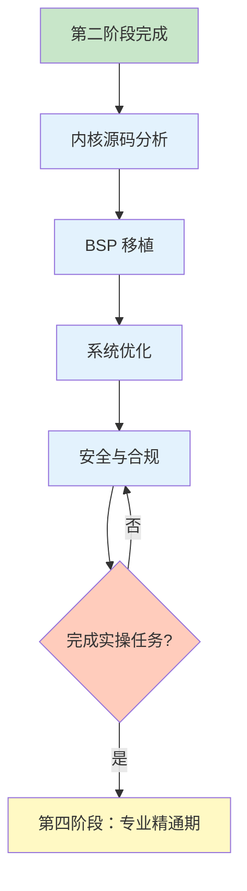

# 第三阶段：高级深耕期

!!! success "阶段目标"
    通过本阶段的学习，您将能够：
    
    - **源码级理解**：深入分析 Zephyr 内核源码，理解启动流程、调度器、内存管理等核心机制
    - **BSP 移植能力**：能够为新的 SoC 和开发板移植 Zephyr，编写设备树和驱动
    - **系统优化能力**：掌握系统裁剪、性能优化、实时性优化和功耗优化技术
    - **安全特性应用**：理解并应用安全启动、OTA 升级、功能安全等安全特性

## 学习内容

| 序号 | 主题 | 核心内容 | 预计时间 |
|------|------|----------|----------|
| 1 | [内核源码分析](kernel-source.md) | 启动流程、调度器实现、内存管理、源码阅读技巧 | 3-5 天 |
| 2 | [BSP 移植](bsp-porting.md) | 移植流程、设备树移植、驱动适配、启动代码适配 | 3-5 天 |
| 3 | [系统优化](optimization.md) | 系统裁剪、性能优化、实时性优化、功耗优化 | 2-3 天 |
| 4 | [安全与合规](security.md) | 安全启动、OTA 升级、功能安全、安全最佳实践 | 2-3 天 |

**总计预计时间：2-3 周**

## 必做实操任务

!!! example "实操任务清单"
    完成以下高级实操任务，提升您的系统级开发能力：
    
    ### 任务 1：内核源码追踪 ✓
    - 使用 GDB 追踪系统启动流程，从 reset vector 到 main 函数
    - 分析调度器如何选择下一个运行的线程
    - 追踪一个系统调用（如 k_sleep）的完整执行路径
    - 理解上下文切换的汇编代码实现
    
    ### 任务 2：BSP 移植实战 ✓
    - 为一个新的 STM32 系列芯片移植 Zephyr
    - 编写完整的 SoC 设备树和板级设备树
    - 适配至少 3 个外设驱动（UART、GPIO、Timer）
    - 验证基础功能（hello_world、blinky）
    
    ### 任务 3：系统优化项目 ✓
    - 将一个示例应用的代码体积优化到最小（< 50KB）
    - 优化一个多线程应用，降低 CPU 使用率 30% 以上
    - 实现一个低功耗数据采集器，平均功耗 < 100uA
    - 使用性能分析工具测量和优化关键路径
    
    ### 任务 4：安全功能集成 ✓
    - 配置 MCUboot 实现安全启动
    - 实现固件 OTA 升级功能（支持回滚）
    - 集成 TLS 实现安全通信
    - 编写安全配置清单和测试用例

## 避坑指南

!!! danger "常见问题 1：BSP 移植启动失败"
    **症状**：移植后的板子无法启动，串口无输出
    
    **原因**：
    - Linker script 配置错误（Flash/RAM 地址或大小）
    - 时钟配置错误，系统时钟未正确初始化
    - 复位向量地址不正确
    - UART 引脚或时钟配置错误
    
    **解决方案**：
    ```bash
    # 1. 检查 linker script
    # 确认 Flash 和 RAM 的起始地址和大小与芯片手册一致
    FLASH (rx) : ORIGIN = 0x08000000, LENGTH = 512K
    SRAM (rwx) : ORIGIN = 0x20000000, LENGTH = 128K
    
    # 2. 使用 JTAG 调试器连接
    # 查看 PC 寄存器，确认代码是否开始执行
    arm-none-eabi-gdb build/zephyr/zephyr.elf
    (gdb) target remote localhost:3333
    (gdb) monitor reset halt
    (gdb) info registers
    
    # 3. 添加早期调试输出
    // 在 z_cstart() 开始处添加
    volatile uint32_t *uart_dr = (uint32_t *)0x40011004;  // UART1 DR
    *uart_dr = 'A';  // 发送字符 'A'
    
    # 4. 检查设备树中的时钟配置
    &rcc {
        clocks = <&pll>;
        clock-frequency = <72000000>;
    };
    ```

!!! danger "常见问题 2：优化后功能异常"
    **症状**：启用编译器优化（-O2/-O3）后，程序行为异常
    
    **原因**：
    - 缺少 volatile 关键字，编译器优化掉了硬件寄存器访问
    - 中断处理函数中的变量未声明为 volatile
    - 内存屏障缺失，导致指令重排
    
    **解决方案**：
    ```c
    // 1. 硬件寄存器访问必须使用 volatile
    volatile uint32_t *reg = (volatile uint32_t *)0x40000000;
    *reg = 0x1234;  // 确保写入不被优化掉
    
    // 2. ISR 中修改的变量必须是 volatile
    static volatile bool data_ready = false;
    
    void isr_handler(void) {
        data_ready = true;  // 确保主循环能看到变化
    }
    
    // 3. 使用内存屏障
    #include <zephyr/sys/barrier.h>
    barrier_dmem_fence_full();  // 数据内存屏障
    
    // 4. 关键代码段禁用优化
    #pragma GCC push_options
    #pragma GCC optimize ("O0")
    void critical_function(void) {
        // 不优化的代码
    }
    #pragma GCC pop_options
    ```

!!! danger "常见问题 3：OTA 升级失败"
    **症状**：OTA 升级后设备无法启动或回滚失败
    
    **原因**：
    - 镜像签名验证失败
    - Flash 分区配置错误
    - 升级过程中断电，镜像不完整
    - MCUboot 配置不正确
    
    **解决方案**：
    ```bash
    # 1. 验证镜像签名
    imgtool verify -k signing-key.pem app_update.bin
    
    # 2. 检查 Flash 分区配置
    # 确保 MCUboot、主镜像、备份镜像分区不重叠
    &flash0 {
        partitions {
            boot_partition: partition@0 {
                label = "mcuboot";
                reg = <0x00000000 0x00010000>;  // 64KB
            };
            slot0_partition: partition@10000 {
                label = "image-0";
                reg = <0x00010000 0x00070000>;  // 448KB
            };
            slot1_partition: partition@80000 {
                label = "image-1";
                reg = <0x00080000 0x00070000>;  // 448KB
            };
        };
    };
    
    # 3. 启用镜像确认机制
    // 应用启动后必须确认镜像
    #include <zephyr/dfu/mcuboot.h>
    boot_write_img_confirmed();  // 确认当前镜像可用
    
    # 4. 测试回滚功能
    // 故意不确认镜像，重启后应回滚到旧版本
    ```

## 学习进度检查

完成本阶段学习后，您应该能够：

- [ ] 熟练阅读和理解 Zephyr 内核源码
- [ ] 能够追踪和调试内核级问题
- [ ] 独立完成新 SoC 和开发板的 BSP 移植
- [ ] 掌握系统裁剪和优化技术，满足资源受限场景需求
- [ ] 理解并应用安全启动、OTA 升级等安全特性
- [ ] 具备系统级问题分析和解决能力

## 学习路径



## 学习建议

!!! tip "源码为师"
    - 阅读源码是理解系统最好的方式
    - 使用 GDB 单步调试，观察代码执行流程
    - 对比不同架构（ARM、x86、RISC-V）的实现差异
    - 理解设计决策背后的原因
    - 如果对某些内核概念不清楚，可以回顾[第二阶段](../stage2-intermediate/index.md)的内容

!!! tip "实战为王"
    - 理论必须通过实践验证
    - 尝试移植到不同的硬件平台
    - 参与实际项目，积累工程经验
    - 记录遇到的问题和解决方案
    - 参考[通用学习黄金法则](../learning-principles/index.md)中的实操方法

!!! tip "性能意识"
    - 始终关注代码的性能影响
    - 使用性能分析工具量化优化效果
    - 理解硬件特性对性能的影响
    - 学会在功能、性能、功耗之间权衡

!!! tip "安全第一"
    - 安全应该从设计阶段就考虑
    - 了解常见的安全威胁和防护措施
    - 遵循安全编码规范
    - 定期进行安全审计和测试
    - 为进入[第四阶段：专业精通期](../stage4-expert/index.md)做好准备

## 进阶方向

完成本阶段学习后，您已经具备了 Zephyr 系统级开发的高级能力。您可以：

### 方向 1：成为 Zephyr 专家
继续学习第四阶段内容，掌握架构设计、社区贡献和技术布道能力，成为 Zephyr 领域的专家。

### 方向 2：专注特定领域
选择特定应用领域（物联网、工业控制、汽车电子等）深入研究，成为该领域的技术专家。

### 方向 3：参与开源贡献
开始为 Zephyr 社区贡献代码、文档或测试，提升技术影响力。

<div style="text-align: center; margin-top: 30px;">
    <a href="../stage4-expert/" class="md-button md-button--primary">
        进入第四阶段：专业精通期 →
    </a>
</div>

---

!!! question "需要帮助？"
    如果您在学习过程中遇到问题，可以：
    
    - 查看 [Zephyr 官方文档](https://docs.zephyrproject.org/)
    - 阅读 [Zephyr 源码](https://github.com/zephyrproject-rtos/zephyr)
    - 在 [Zephyr 邮件列表](https://lists.zephyrproject.org/) 提问
    - 在 [GitHub Discussions](https://github.com/your-repo/discussions) 交流经验
