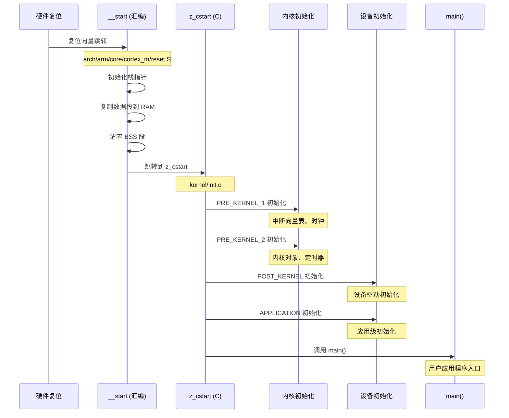
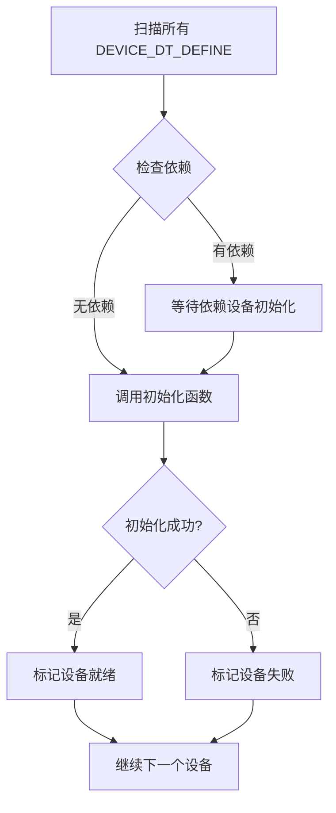
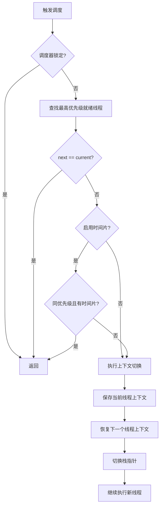
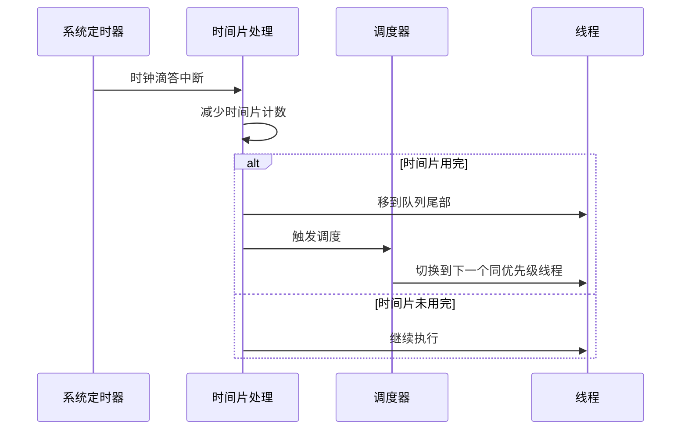
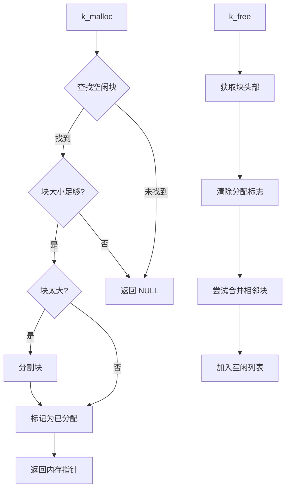
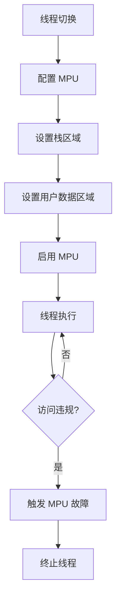
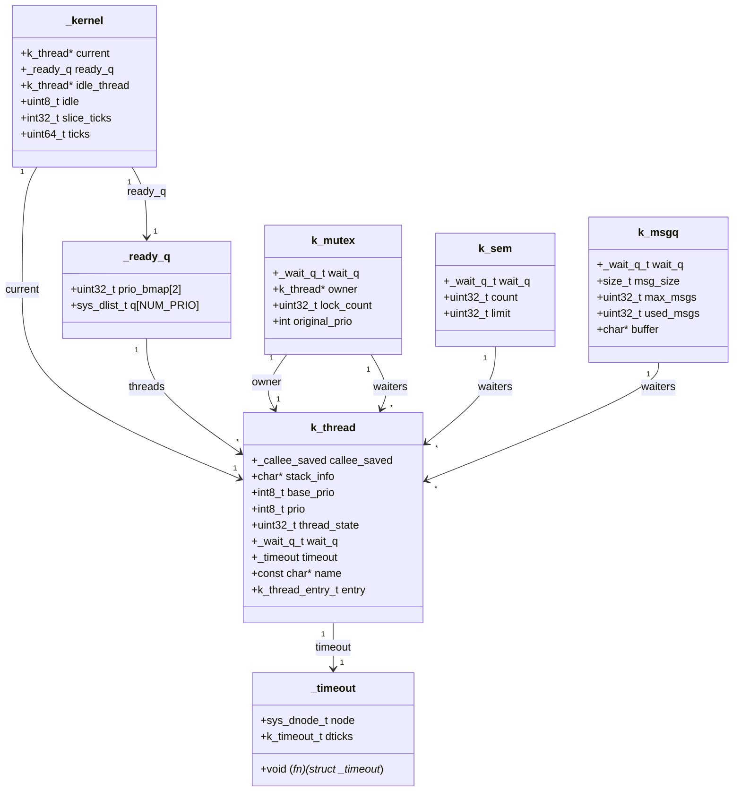

# Zephyr 内核源码分析

!!! info "学习目标"
    通过本章学习，你将能够：
    
    - 理解 Zephyr 从复位到 main 函数的完整启动流程
    - 掌握调度器的核心实现机制和上下文切换过程
    - 理解内存管理的实现细节（堆管理、内存池、栈保护）
    - 掌握源码阅读的工具和技巧
    - 理解 Zephyr 核心数据结构的设计

## 概述

深入理解操作系统内核源码是从使用者到贡献者、从应用开发到系统开发的必经之路。本章将带你深入 Zephyr RTOS 的核心源码，理解其设计思想和实现细节。

### 为什么要读源码

- **理解实现原理**：知其然更知其所以然，理解 API 背后的实现机制
- **学习设计模式**：学习优秀的系统设计和编程技巧
- **调试问题**：遇到复杂问题时，能够追踪到根本原因
- **贡献代码**：为社区贡献代码的前提是理解现有实现
- **系统优化**：基于源码理解进行针对性的性能优化

### 源码版本说明

本章基于 Zephyr 3.5 LTS 版本进行分析。不同版本的实现细节可能有所差异，但核心设计思想是一致的。

!!! tip "版本切换"
    ```bash
    # 切换到特定版本
    cd ~/zephyrproject/zephyr
    git checkout v3.5.0
    ```


## 启动流程分析

### 启动时序图

Zephyr 的启动过程从硬件复位开始，经过多个初始化阶段，最终进入用户的 main 函数。



### 汇编启动代码分析

**文件路径**: `zephyr/arch/arm/core/cortex_m/reset.S`

这是系统启动的第一段代码，负责最基础的硬件初始化。

```c
/* 复位向量入口 */
SECTION_FUNC(TEXT, __start)
    /* 设置主栈指针 (MSP) */
    ldr r0, =_interrupt_stack
    ldr r1, [r0]
    msr MSP, r1

    /* 复制数据段从 Flash 到 RAM */
    ldr r0, =__data_rom_start
    ldr r1, =__data_ram_start
    ldr r2, =__data_ram_end
    
data_copy_loop:
    cmp r1, r2
    bge data_copy_done
    ldr r3, [r0], #4
    str r3, [r1], #4
    b data_copy_loop
    
data_copy_done:
    /* 清零 BSS 段 */
    ldr r0, =__bss_start
    ldr r1, =__bss_end
    movs r2, #0
    
bss_zero_loop:
    cmp r0, r1
    bge bss_zero_done
    str r2, [r0], #4
    b bss_zero_loop
    
bss_zero_done:
    /* 跳转到 C 代码入口 */
    bl z_cstart
```

**关键步骤解析**：

1. **设置栈指针**：将主栈指针 (MSP) 设置为中断栈的顶部
2. **数据段复制**：将初始化数据从 Flash 复制到 RAM（因为 Flash 只读）
3. **BSS 段清零**：将未初始化的全局变量区域清零
4. **跳转到 C 代码**：调用 `z_cstart()` 进入 C 语言环境

!!! note "为什么需要复制数据段？"
    程序编译后，初始化的全局变量存储在 Flash 中。但程序运行时需要修改这些变量，而 Flash 是只读的，所以必须将它们复制到 RAM 中。


### C 启动代码分析

**文件路径**: `zephyr/kernel/init.c`

```c
/**
 * @brief Zephyr 内核启动入口
 */
FUNC_NORETURN void z_cstart(void)
{
    /* 架构特定的早期初始化 */
    arch_kernel_init();
    
    /* PRE_KERNEL_1: 最早期的初始化 */
    z_sys_init_run_level(SYS_INIT_LEVEL_PRE_KERNEL_1);
    
    /* PRE_KERNEL_2: 内核对象初始化 */
    z_sys_init_run_level(SYS_INIT_LEVEL_PRE_KERNEL_2);
    
    /* 初始化内核对象 */
    z_kernel_init();
    
    /* POST_KERNEL: 设备驱动初始化 */
    z_sys_init_run_level(SYS_INIT_LEVEL_POST_KERNEL);
    
    /* APPLICATION: 应用级初始化 */
    z_sys_init_run_level(SYS_INIT_LEVEL_APPLICATION);
    
    /* 切换到主线程 */
    z_switch_to_main_thread();
    
    /* 永不返回 */
    CODE_UNREACHABLE;
}
```

### 内核初始化阶段

Zephyr 使用分层初始化机制，确保依赖关系正确。

| 初始化阶段 | 优先级范围 | 典型初始化内容 | 示例 |
|-----------|-----------|---------------|------|
| **PRE_KERNEL_1** | 0-99 | 架构相关、中断向量表、时钟 | NVIC、SysTick |
| **PRE_KERNEL_2** | 0-99 | 内核对象、定时器、内存管理 | k_timer、k_mem_slab |
| **POST_KERNEL** | 0-99 | 设备驱动、外设初始化 | UART、GPIO、I2C |
| **APPLICATION** | 0-99 | 应用级初始化、子系统 | Shell、日志系统 |

**优先级规则**：

- 数字越小，优先级越高，越早初始化
- 同一阶段内，按优先级数字从小到大依次初始化
- 使用 `SYS_INIT()` 宏注册初始化函数

**初始化函数注册示例**：

```c
/* 在 PRE_KERNEL_1 阶段，优先级 10 初始化 */
static int my_early_init(void)
{
    /* 早期初始化代码 */
    return 0;
}
SYS_INIT(my_early_init, PRE_KERNEL_1, 10);

/* 在 POST_KERNEL 阶段，优先级 50 初始化设备 */
static int my_device_init(void)
{
    /* 设备初始化代码 */
    return 0;
}
SYS_INIT(my_device_init, POST_KERNEL, 50);
```


### 设备初始化顺序

设备初始化通过设备树和 `DEVICE_DT_DEFINE()` 宏自动管理依赖关系。

```c
/* 设备定义示例 */
DEVICE_DT_DEFINE(
    DT_NODELABEL(uart0),        /* 设备树节点 */
    uart_init,                   /* 初始化函数 */
    NULL,                        /* 电源管理函数 */
    &uart0_data,                 /* 设备数据 */
    &uart0_config,               /* 设备配置 */
    POST_KERNEL,                 /* 初始化阶段 */
    CONFIG_SERIAL_INIT_PRIORITY, /* 优先级 */
    &uart_api                    /* 设备 API */
);
```

**初始化流程**：



### 源码路径导航

**关键文件和目录**：

```
zephyr/
├── arch/                      # 架构相关代码
│   └── arm/
│       └── core/
│           └── cortex_m/
│               ├── reset.S    # 启动汇编代码
│               └── swap.c     # 上下文切换
├── kernel/                    # 内核核心代码
│   ├── init.c                 # 启动初始化
│   ├── sched.c                # 调度器
│   ├── thread.c               # 线程管理
│   ├── mempool.c              # 内存池
│   └── timeout.c              # 定时器
├── include/
│   └── zephyr/
│       ├── kernel.h           # 内核 API
│       └── sys/
│           └── __assert.h     # 断言
└── lib/
    └── heap/
        └── heap.c             # 堆管理器
```

**关键函数调用链**：

```
硬件复位
  └─> __start (reset.S)
      └─> z_cstart (init.c)
          ├─> arch_kernel_init()
          ├─> z_sys_init_run_level(PRE_KERNEL_1)
          ├─> z_sys_init_run_level(PRE_KERNEL_2)
          ├─> z_kernel_init()
          ├─> z_sys_init_run_level(POST_KERNEL)
          ├─> z_sys_init_run_level(APPLICATION)
          └─> z_switch_to_main_thread()
              └─> main()
```


## 调度器实现

### 调度器核心数据结构

**文件路径**: `zephyr/kernel/include/kernel_structs.h`

#### 1. 内核全局结构 `_kernel`

```c
struct _kernel {
    /* 当前运行的线程 */
    struct k_thread *current;
    
    /* 就绪队列 */
    struct _ready_q ready_q;
    
    /* 空闲线程 */
    struct k_thread *idle_thread;
    
    /* CPU 空闲标志 */
    uint8_t idle;
    
    /* 时间片计数器 */
    int32_t slice_ticks;
    
    /* 系统时钟 */
    uint64_t ticks;
};

/* 全局内核对象 */
extern struct _kernel _kernel;
```

#### 2. 线程控制块 `k_thread`

```c
struct k_thread {
    /* 架构相关的上下文 */
    struct _callee_saved callee_saved;
    
    /* 线程栈信息 */
    char *stack_info;
    
    /* 基础优先级 */
    int8_t base_prio;
    
    /* 当前优先级（可能被优先级继承修改）*/
    int8_t prio;
    
    /* 线程状态标志 */
    uint32_t thread_state;
    
    /* 等待队列节点 */
    struct _wait_q_t wait_q;
    
    /* 超时对象 */
    struct _timeout timeout;
    
    /* 线程名称 */
    const char *name;
    
    /* 线程入口函数 */
    k_thread_entry_t entry;
    void *p1, *p2, *p3;
};
```

#### 3. 就绪队列 `_ready_q`

```c
struct _ready_q {
    /* 优先级位图（快速查找最高优先级）*/
    uint32_t prio_bmap[2];
    
    /* 每个优先级的线程队列 */
    sys_dlist_t q[CONFIG_NUM_PREEMPT_PRIORITIES];
};
```


### 就绪队列实现

**文件路径**: `zephyr/kernel/sched.c`

Zephyr 使用优先级位图 + 双向链表实现高效的就绪队列。

#### 优先级位图机制

```c
/* 将线程加入就绪队列 */
void z_ready_thread(struct k_thread *thread)
{
    int prio = thread->prio;
    
    /* 将线程加入对应优先级的队列 */
    sys_dlist_append(&_kernel.ready_q.q[prio], &thread->base.qnode);
    
    /* 设置优先级位图 */
    _kernel.ready_q.prio_bmap[prio / 32] |= (1 << (prio % 32));
}

/* 从就绪队列移除线程 */
void z_remove_thread_from_ready_q(struct k_thread *thread)
{
    int prio = thread->prio;
    
    /* 从队列中移除 */
    sys_dlist_remove(&thread->base.qnode);
    
    /* 如果该优先级队列为空，清除位图 */
    if (sys_dlist_is_empty(&_kernel.ready_q.q[prio])) {
        _kernel.ready_q.prio_bmap[prio / 32] &= ~(1 << (prio % 32));
    }
}

/* 查找最高优先级的就绪线程 */
struct k_thread *z_get_next_ready_thread(void)
{
    /* 使用 CLZ (Count Leading Zeros) 指令快速查找 */
    int prio = find_first_set_bit(_kernel.ready_q.prio_bmap);
    
    if (prio < 0) {
        /* 没有就绪线程，返回空闲线程 */
        return _kernel.idle_thread;
    }
    
    /* 返回该优先级队列的第一个线程 */
    sys_dnode_t *node = sys_dlist_peek_head(&_kernel.ready_q.q[prio]);
    return CONTAINER_OF(node, struct k_thread, base.qnode);
}
```

**优先级位图优势**：

- **O(1) 时间复杂度**：使用 CLZ 指令快速找到最高优先级
- **内存高效**：每个优先级只需 1 位
- **硬件加速**：现代 CPU 都有 CLZ 指令


### 调度算法源码

**文件路径**: `zephyr/kernel/sched.c`

```c
/**
 * @brief 核心调度函数
 * 
 * 选择下一个要运行的线程，如果需要则触发上下文切换
 */
void z_reschedule(void)
{
    struct k_thread *current = _kernel.current;
    struct k_thread *next;
    
    /* 如果调度器被锁定，不进行调度 */
    if (_kernel.sched_lock > 0) {
        return;
    }
    
    /* 查找最高优先级的就绪线程 */
    next = z_get_next_ready_thread();
    
    /* 如果下一个线程就是当前线程，无需切换 */
    if (next == current) {
        return;
    }
    
    /* 如果启用了时间片轮转 */
    #ifdef CONFIG_TIMESLICING
    if (next->prio == current->prio && 
        current->base.slice_ticks > 0) {
        /* 同优先级且当前线程还有时间片，不切换 */
        return;
    }
    #endif
    
    /* 执行上下文切换 */
    z_swap(current, next);
}
```

**调度时机**：

1. **主动调度**：线程调用 `k_yield()` 或 `k_sleep()`
2. **被动调度**：
   - 更高优先级线程就绪（抢占）
   - 时间片用完（时间片轮转）
   - 等待资源（互斥锁、信号量等）

**调度流程图**：




### 上下文切换机制

**文件路径**: `zephyr/arch/arm/core/cortex_m/swap.c`

上下文切换是调度器的核心，负责保存和恢复线程的执行状态。

#### ARM Cortex-M 上下文切换

```c
/**
 * @brief 触发上下文切换
 * 
 * 通过触发 PendSV 异常实现上下文切换
 */
void arch_swap(unsigned int key)
{
    /* 触发 PendSV 异常 */
    SCB->ICSR |= SCB_ICSR_PENDSVSET_Msk;
    
    /* 等待 PendSV 执行 */
    __DSB();
    __ISB();
}

/**
 * @brief PendSV 异常处理函数（汇编实现）
 * 
 * 文件：arch/arm/core/cortex_m/swap_helper.S
 */
__pendsv:
    /* 保存当前线程上下文 */
    mrs r0, PSP                    /* 获取进程栈指针 */
    
    #ifdef CONFIG_FPU
    vstmdb r0!, {s16-s31}          /* 保存 FPU 寄存器 */
    #endif
    
    stmdb r0!, {r4-r11, lr}        /* 保存通用寄存器 */
    
    /* 保存栈指针到线程控制块 */
    ldr r1, =_kernel
    ldr r2, [r1, #_kernel_offset_to_current]
    str r0, [r2, #_thread_offset_to_sp]
    
    /* 获取下一个线程 */
    bl z_get_next_switch_handle
    
    /* 恢复下一个线程上下文 */
    ldr r0, [r0, #_thread_offset_to_sp]
    
    ldmia r0!, {r4-r11, lr}        /* 恢复通用寄存器 */
    
    #ifdef CONFIG_FPU
    vldmia r0!, {s16-s31}          /* 恢复 FPU 寄存器 */
    #endif
    
    msr PSP, r0                    /* 设置进程栈指针 */
    
    /* 返回到新线程 */
    bx lr
```

**上下文切换步骤**：

1. **触发 PendSV**：设置 PendSV 挂起位
2. **保存上下文**：保存当前线程的寄存器到栈
3. **切换线程**：更新 `_kernel.current` 指针
4. **恢复上下文**：从新线程的栈恢复寄存器
5. **返回执行**：跳转到新线程继续执行

!!! note "为什么使用 PendSV？"
    PendSV 是最低优先级的异常，确保在所有中断处理完成后才执行上下文切换，避免在中断处理过程中切换线程。


### 时间片轮转实现

**配置选项**: `CONFIG_TIMESLICING`

```c
/* 时间片配置 */
#define CONFIG_TIMESLICE_SIZE 10    /* 时间片大小（毫秒）*/
#define CONFIG_TIMESLICE_PRIORITY 0 /* 时间片适用的最低优先级 */

/**
 * @brief 时间片定时器回调
 * 
 * 每个时钟滴答调用，减少当前线程的时间片
 */
void z_time_slice(void)
{
    struct k_thread *curr = _kernel.current;
    
    /* 检查是否启用时间片 */
    if (!IS_ENABLED(CONFIG_TIMESLICING)) {
        return;
    }
    
    /* 检查线程优先级是否适用时间片 */
    if (curr->prio > CONFIG_TIMESLICE_PRIORITY) {
        return;
    }
    
    /* 减少时间片计数 */
    if (curr->base.slice_ticks > 0) {
        curr->base.slice_ticks--;
    }
    
    /* 时间片用完，触发调度 */
    if (curr->base.slice_ticks == 0) {
        /* 重置时间片 */
        curr->base.slice_ticks = CONFIG_TIMESLICE_SIZE;
        
        /* 将当前线程移到队列尾部 */
        z_remove_thread_from_ready_q(curr);
        z_ready_thread(curr);
        
        /* 触发调度 */
        z_reschedule();
    }
}
```

**时间片轮转流程**：




### 源码追踪示例：从 k_sleep() 到调度器

让我们追踪一个完整的系统调用路径，理解调度器如何工作。

```c
/* 1. 用户调用 k_sleep() */
int k_sleep(k_timeout_t timeout)
{
    /* 文件：kernel/sched.c */
    return z_impl_k_sleep(timeout);
}

/* 2. 实现函数 */
int z_impl_k_sleep(k_timeout_t timeout)
{
    /* 获取当前线程 */
    struct k_thread *thread = _current;
    
    /* 添加超时 */
    z_add_timeout(&thread->base.timeout, timeout);
    
    /* 将线程从就绪队列移除 */
    z_remove_thread_from_ready_q(thread);
    
    /* 设置线程状态为等待 */
    thread->base.thread_state |= _THREAD_SLEEPING;
    
    /* 3. 触发调度 */
    z_reschedule();
    
    return 0;
}

/* 4. 调度器选择下一个线程 */
void z_reschedule(void)
{
    /* 查找最高优先级就绪线程 */
    struct k_thread *next = z_get_next_ready_thread();
    
    /* 5. 执行上下文切换 */
    if (next != _current) {
        arch_swap(0);
    }
}

/* 6. 超时到期后，定时器回调唤醒线程 */
void z_timeout_handle(struct _timeout *timeout)
{
    struct k_thread *thread = CONTAINER_OF(timeout, struct k_thread, base.timeout);
    
    /* 清除睡眠状态 */
    thread->base.thread_state &= ~_THREAD_SLEEPING;
    
    /* 将线程加回就绪队列 */
    z_ready_thread(thread);
    
    /* 触发调度（可能抢占当前线程）*/
    z_reschedule();
}
```

**完整调用链**：

```
k_sleep()
  └─> z_impl_k_sleep()
      ├─> z_add_timeout()           # 添加超时
      ├─> z_remove_thread_from_ready_q()  # 移出就绪队列
      └─> z_reschedule()            # 触发调度
          └─> z_get_next_ready_thread()   # 查找下一个线程
              └─> arch_swap()       # 上下文切换
                  └─> __pendsv()    # PendSV 处理

[超时到期]
z_timeout_handle()
  ├─> z_ready_thread()              # 加回就绪队列
  └─> z_reschedule()                # 再次调度
```


## 内存管理实现

### 堆管理器源码

**文件路径**: `zephyr/lib/heap/heap.c`

Zephyr 使用多级分离适配（Multi-Level Segregated Fit, MLSF）算法实现堆管理。

#### 堆数据结构

```c
/**
 * @brief 堆块头部
 */
struct heap_block {
    /* 块大小（包含头部）*/
    size_t size;
    
    /* 空闲列表链接 */
    struct heap_block *next;
    struct heap_block *prev;
    
    /* 块状态标志 */
    uint32_t flags;
};

/**
 * @brief 堆结构
 */
struct sys_heap {
    /* 堆内存起始地址 */
    void *heap;
    
    /* 堆大小 */
    size_t len;
    
    /* 空闲块列表（按大小分级）*/
    struct heap_block *free_lists[NUM_SIZE_CLASSES];
    
    /* 统计信息 */
    size_t allocated_bytes;
    size_t max_allocated_bytes;
};
```

#### k_malloc 实现

```c
/**
 * @brief 从堆分配内存
 */
void *k_malloc(size_t size)
{
    struct sys_heap *heap = &_system_heap;
    struct heap_block *block;
    
    /* 对齐大小 */
    size = ROUND_UP(size + sizeof(struct heap_block), HEAP_ALIGN);
    
    /* 查找合适的空闲块 */
    block = find_free_block(heap, size);
    
    if (block == NULL) {
        /* 没有足够的内存 */
        return NULL;
    }
    
    /* 如果块太大，分割它 */
    if (block->size >= size + MIN_BLOCK_SIZE) {
        split_block(block, size);
    }
    
    /* 从空闲列表移除 */
    remove_from_free_list(heap, block);
    
    /* 标记为已分配 */
    block->flags |= BLOCK_ALLOCATED;
    
    /* 更新统计 */
    heap->allocated_bytes += block->size;
    if (heap->allocated_bytes > heap->max_allocated_bytes) {
        heap->max_allocated_bytes = heap->allocated_bytes;
    }
    
    /* 返回用户数据区域 */
    return (void *)((char *)block + sizeof(struct heap_block));
}
```


#### k_free 实现

```c
/**
 * @brief 释放内存
 */
void k_free(void *ptr)
{
    struct sys_heap *heap = &_system_heap;
    struct heap_block *block;
    
    if (ptr == NULL) {
        return;
    }
    
    /* 获取块头部 */
    block = (struct heap_block *)((char *)ptr - sizeof(struct heap_block));
    
    /* 检查块是否已分配 */
    __ASSERT(block->flags & BLOCK_ALLOCATED, "Double free detected");
    
    /* 清除分配标志 */
    block->flags &= ~BLOCK_ALLOCATED;
    
    /* 更新统计 */
    heap->allocated_bytes -= block->size;
    
    /* 尝试与相邻空闲块合并 */
    block = coalesce_blocks(heap, block);
    
    /* 加入空闲列表 */
    add_to_free_list(heap, block);
}

/**
 * @brief 合并相邻空闲块
 */
static struct heap_block *coalesce_blocks(struct sys_heap *heap, 
                                          struct heap_block *block)
{
    struct heap_block *next = get_next_block(block);
    struct heap_block *prev = get_prev_block(block);
    
    /* 与后面的块合并 */
    if (next && !(next->flags & BLOCK_ALLOCATED)) {
        remove_from_free_list(heap, next);
        block->size += next->size;
    }
    
    /* 与前面的块合并 */
    if (prev && !(prev->flags & BLOCK_ALLOCATED)) {
        remove_from_free_list(heap, prev);
        prev->size += block->size;
        block = prev;
    }
    
    return block;
}
```

**堆管理流程图**：




### 内存池实现

**文件路径**: `zephyr/kernel/mempool.c`

内存池用于固定大小块的快速分配，避免堆碎片。

```c
/**
 * @brief 内存池结构
 */
struct k_mem_pool {
    /* 块大小 */
    size_t block_size;
    
    /* 块数量 */
    size_t num_blocks;
    
    /* 空闲块列表 */
    void *free_list;
    
    /* 内存池缓冲区 */
    char *buffer;
    
    /* 锁 */
    struct k_spinlock lock;
};

/**
 * @brief 从内存池分配块
 */
int k_mem_pool_alloc(struct k_mem_pool *pool, void **block)
{
    k_spinlock_key_t key;
    void *ptr;
    
    key = k_spin_lock(&pool->lock);
    
    /* 从空闲列表获取块 */
    ptr = pool->free_list;
    
    if (ptr == NULL) {
        k_spin_unlock(&pool->lock, key);
        return -ENOMEM;
    }
    
    /* 更新空闲列表 */
    pool->free_list = *(void **)ptr;
    
    k_spin_unlock(&pool->lock, key);
    
    *block = ptr;
    return 0;
}

/**
 * @brief 释放块回内存池
 */
void k_mem_pool_free(struct k_mem_pool *pool, void *block)
{
    k_spinlock_key_t key;
    
    key = k_spin_lock(&pool->lock);
    
    /* 将块加回空闲列表 */
    *(void **)block = pool->free_list;
    pool->free_list = block;
    
    k_spin_unlock(&pool->lock, key);
}
```

**内存池优势**：

- **O(1) 分配和释放**：直接从链表头部操作
- **无碎片**：所有块大小相同
- **线程安全**：使用自旋锁保护
- **确定性**：分配时间可预测


### 栈管理和保护

#### 线程栈分配

```c
/**
 * @brief 定义线程栈
 */
#define K_THREAD_STACK_DEFINE(sym, size) \
    struct z_thread_stack_element sym[K_THREAD_STACK_LEN(size)] \
        __aligned(ARCH_STACK_PTR_ALIGN)

/**
 * @brief 线程栈结构
 */
struct z_thread_stack_element {
    char data;
} __aligned(ARCH_STACK_PTR_ALIGN);

/**
 * @brief 初始化线程栈
 */
void z_setup_new_thread(struct k_thread *thread,
                        k_thread_stack_t *stack,
                        size_t stack_size,
                        k_thread_entry_t entry,
                        void *p1, void *p2, void *p3)
{
    /* 栈顶地址 */
    char *stack_top = (char *)stack + stack_size;
    
    /* 栈底保护字（用于检测栈溢出）*/
    #ifdef CONFIG_THREAD_STACK_INFO
    thread->stack_info.start = (uintptr_t)stack;
    thread->stack_info.size = stack_size;
    *(uint32_t *)stack = STACK_SENTINEL;
    #endif
    
    /* 初始化栈帧 */
    thread->callee_saved.psp = (uint32_t)arch_new_thread(
        stack_top, entry, p1, p2, p3);
}
```

#### 栈溢出检测

```c
/**
 * @brief 检查栈溢出
 */
void z_check_stack_sentinel(struct k_thread *thread)
{
    #ifdef CONFIG_THREAD_STACK_INFO
    uint32_t *sentinel = (uint32_t *)thread->stack_info.start;
    
    if (*sentinel != STACK_SENTINEL) {
        /* 栈溢出！*/
        k_panic();
    }
    #endif
}

/**
 * @brief 获取栈使用情况
 */
size_t z_stack_space_get(struct k_thread *thread)
{
    char *stack_start = (char *)thread->stack_info.start;
    char *stack_end = stack_start + thread->stack_info.size;
    char *sp = (char *)thread->callee_saved.psp;
    
    /* 计算已使用的栈空间 */
    return stack_end - sp;
}
```


### MPU 内存保护

**文件路径**: `zephyr/arch/arm/core/cortex_m/mpu/arm_mpu.c`

```c
/**
 * @brief 配置 MPU 区域
 */
void arm_core_mpu_configure_thread(struct k_thread *thread)
{
    /* 配置线程栈区域为读写，禁止执行 */
    arm_core_mpu_region_config(
        MPU_REGION_THREAD_STACK,
        (uint32_t)thread->stack_info.start,
        thread->stack_info.size,
        ARM_MPU_RASR_XN_Msk |           /* 禁止执行 */
        ARM_MPU_RASR_AP_RW_RW |         /* 读写权限 */
        ARM_MPU_RASR_ENABLE_Msk         /* 启用区域 */
    );
    
    /* 配置用户数据区域 */
    if (thread->base.user_options & K_USER) {
        arm_core_mpu_region_config(
            MPU_REGION_USER_DATA,
            (uint32_t)thread->userspace_local_data,
            sizeof(struct _k_thread_userspace_local_data),
            ARM_MPU_RASR_AP_RW_RW |     /* 用户读写 */
            ARM_MPU_RASR_ENABLE_Msk
        );
    }
}

/**
 * @brief MPU 故障处理
 */
void z_arm_mpu_fault(void)
{
    uint32_t mmfsr = SCB->CFSR & SCB_CFSR_MEMFAULTSR_Msk;
    uint32_t mmfar = SCB->MMFAR;
    
    if (mmfsr & SCB_CFSR_DACCVIOL_Msk) {
        /* 数据访问违规 */
        printk("MPU: Data access violation at 0x%08x\n", mmfar);
    }
    
    if (mmfsr & SCB_CFSR_IACCVIOL_Msk) {
        /* 指令访问违规 */
        printk("MPU: Instruction access violation\n");
    }
    
    /* 终止违规线程 */
    k_thread_abort(_current);
}
```

**MPU 保护示例**：




## 源码阅读技巧和工具

### 使用 VS Code + C/C++ 扩展

**推荐配置**：

```json
// .vscode/c_cpp_properties.json
{
    "configurations": [
        {
            "name": "Zephyr",
            "includePath": [
                "${workspaceFolder}/zephyr/include",
                "${workspaceFolder}/zephyr/arch/arm/include",
                "${workspaceFolder}/zephyr/soc/arm/**",
                "${workspaceFolder}/build/zephyr/include/generated"
            ],
            "defines": [
                "CONFIG_ARM=1",
                "CONFIG_CORTEX_M=1",
                "__ZEPHYR__=1"
            ],
            "compilerPath": "/usr/bin/arm-none-eabi-gcc",
            "cStandard": "c11",
            "intelliSenseMode": "gcc-arm"
        }
    ]
}
```

**常用快捷键**：

- `F12`: 跳转到定义
- `Shift+F12`: 查找所有引用
- `Ctrl+T`: 搜索符号
- `Ctrl+P`: 快速打开文件
- `Ctrl+Shift+O`: 查看文件大纲

### 使用 cscope/ctags 索引

**生成索引**：

```bash
# 进入 Zephyr 源码目录
cd ~/zephyrproject/zephyr

# 生成 cscope 数据库
find . -name "*.c" -o -name "*.h" > cscope.files
cscope -b -q -k

# 生成 ctags
ctags -R --c-kinds=+p --fields=+iaS --extra=+q .
```

**使用 cscope 查询**：

```bash
# 查找函数定义
cscope -L -1 z_reschedule

# 查找函数调用
cscope -L -3 z_reschedule

# 查找符号
cscope -L -0 k_thread
```

### 使用 GDB 源码级调试

**启动 GDB 调试**：

```bash
# 编译带调试信息的版本
west build -b nrf52840dk_nrf52840 samples/hello_world -- -DCONFIG_DEBUG=y

# 启动 GDB
west debug
```

**常用 GDB 命令**：

```gdb
# 设置断点
break z_reschedule
break kernel/sched.c:123

# 查看源码
list z_reschedule
list kernel/sched.c:100,120

# 查看调用栈
backtrace
frame 2

# 查看变量
print _kernel.current
print *thread

# 单步执行
step      # 进入函数
next      # 跳过函数
finish    # 执行到函数返回

# 查看内存
x/10x 0x20000000
x/s thread->name
```


### 理解 Zephyr 代码组织

**目录结构**：

```
zephyr/
├── arch/              # 架构相关代码
│   ├── arm/           # ARM 架构
│   │   ├── core/      # 核心实现（启动、上下文切换）
│   │   └── include/   # 架构头文件
│   ├── x86/           # x86 架构
│   └── riscv/         # RISC-V 架构
│
├── kernel/            # 内核核心
│   ├── sched.c        # 调度器
│   ├── thread.c       # 线程管理
│   ├── mutex.c        # 互斥锁
│   ├── sem.c          # 信号量
│   └── timeout.c      # 定时器
│
├── drivers/           # 设备驱动
│   ├── serial/        # 串口驱动
│   ├── gpio/          # GPIO 驱动
│   └── i2c/           # I2C 驱动
│
├── include/           # 公共头文件
│   └── zephyr/
│       ├── kernel.h   # 内核 API
│       ├── device.h   # 设备模型
│       └── drivers/   # 驱动 API
│
├── lib/               # 库函数
│   ├── heap/          # 堆管理
│   ├── libc/          # C 库
│   └── os/            # OS 工具
│
└── subsys/            # 子系统
    ├── logging/       # 日志系统
    ├── shell/         # Shell 控制台
    └── fs/            # 文件系统
```

**代码命名规范**：

- `z_*`: 内部函数（不对外暴露）
- `k_*`: 内核 API（公共接口）
- `_*`: 私有变量或函数
- `CONFIG_*`: 配置选项
- `DT_*`: 设备树宏

### 追踪宏展开

Zephyr 大量使用宏，理解宏展开对阅读源码很重要。

**使用 gcc -E 预处理**：

```bash
# 预处理单个文件
arm-none-eabi-gcc -E \
    -I zephyr/include \
    -I build/zephyr/include/generated \
    -DCONFIG_ARM=1 \
    kernel/sched.c > sched_preprocessed.c

# 查看宏展开结果
less sched_preprocessed.c
```

**常见宏示例**：

```c
/* K_THREAD_DEFINE 宏展开 */
K_THREAD_DEFINE(my_thread, 1024, my_entry, NULL, NULL, NULL, 5, 0, 0);

/* 展开后 */
static struct k_thread my_thread_data;
static K_THREAD_STACK_DEFINE(my_thread_stack, 1024);

static void my_thread_init(void) {
    k_thread_create(&my_thread_data, my_thread_stack, 1024,
                    my_entry, NULL, NULL, NULL, 5, 0, 0);
}
SYS_INIT(my_thread_init, APPLICATION, 0);
```


## 关键数据结构解析

### 数据结构关系图



### struct k_thread 详解

```c
struct k_thread {
    /* === 架构相关部分 === */
    struct _callee_saved {
        uint32_t psp;      /* 进程栈指针 */
        uint32_t r4;       /* 通用寄存器 r4-r11 */
        uint32_t r5;
        uint32_t r6;
        uint32_t r7;
        uint32_t r8;
        uint32_t r9;
        uint32_t r10;
        uint32_t r11;
        uint32_t lr;       /* 链接寄存器 */
    } callee_saved;
    
    /* === 栈信息 === */
    struct _thread_stack_info {
        uintptr_t start;   /* 栈起始地址 */
        size_t size;       /* 栈大小 */
    } stack_info;
    
    /* === 调度信息 === */
    int8_t base_prio;      /* 基础优先级 */
    int8_t prio;           /* 当前优先级（可能被继承修改）*/
    uint32_t thread_state; /* 线程状态标志 */
    
    /* === 等待队列 === */
    struct _wait_q_t {
        sys_dlist_t waitq; /* 等待队列链表 */
    } wait_q;
    
    /* === 超时管理 === */
    struct _timeout {
        sys_dnode_t node;  /* 超时队列节点 */
        k_timeout_t dticks;/* 剩余时间 */
        void (*fn)(struct _timeout *); /* 超时回调 */
    } timeout;
    
    /* === 线程标识 === */
    const char *name;      /* 线程名称 */
    
    /* === 入口函数 === */
    k_thread_entry_t entry;/* 线程入口函数 */
    void *p1, *p2, *p3;    /* 入口参数 */
    
    /* === 时间片 === */
    int32_t slice_ticks;   /* 剩余时间片 */
    
    /* === 用户空间（可选）=== */
    #ifdef CONFIG_USERSPACE
    struct _k_thread_userspace_local_data *userspace_local_data;
    #endif
};
```


### struct device 详解

```c
/**
 * @brief 设备结构
 */
struct device {
    /* 设备名称 */
    const char *name;
    
    /* 设备配置（只读）*/
    const void *config;
    
    /* 设备 API（函数指针表）*/
    const void *api;
    
    /* 设备状态（运行时数据）*/
    struct device_state *state;
    
    /* 设备数据（驱动私有数据）*/
    void *data;
    
    /* 设备依赖 */
    const struct device *deps[];
};

/**
 * @brief 设备状态
 */
struct device_state {
    /* 初始化状态 */
    uint8_t initialized : 1;
    
    /* 电源管理状态 */
    uint8_t pm_state : 2;
    
    /* 锁 */
    struct k_mutex lock;
};
```

**设备 API 示例（UART）**：

```c
/**
 * @brief UART 设备 API
 */
struct uart_driver_api {
    int (*poll_in)(const struct device *dev, unsigned char *c);
    void (*poll_out)(const struct device *dev, unsigned char c);
    int (*configure)(const struct device *dev, const struct uart_config *cfg);
    int (*irq_tx_enable)(const struct device *dev);
    int (*irq_tx_disable)(const struct device *dev);
    int (*irq_rx_enable)(const struct device *dev);
    int (*irq_rx_disable)(const struct device *dev);
};

/* 使用设备 API */
const struct device *uart = DEVICE_DT_GET(DT_NODELABEL(uart0));
const struct uart_driver_api *api = uart->api;

/* 调用驱动函数 */
api->poll_out(uart, 'A');
```

### 同步对象数据结构

#### k_mutex（互斥锁）

```c
struct k_mutex {
    /* 等待队列 */
    _wait_q_t wait_q;
    
    /* 当前持有者 */
    struct k_thread *owner;
    
    /* 锁定计数（支持递归锁）*/
    uint32_t lock_count;
    
    /* 原始优先级（用于优先级继承）*/
    int original_prio;
};
```

#### k_sem（信号量）

```c
struct k_sem {
    /* 等待队列 */
    _wait_q_t wait_q;
    
    /* 当前计数 */
    uint32_t count;
    
    /* 最大计数 */
    uint32_t limit;
};
```

#### k_msgq（消息队列）

```c
struct k_msgq {
    /* 等待队列（发送者和接收者）*/
    _wait_q_t wait_q;
    
    /* 消息大小 */
    size_t msg_size;
    
    /* 最大消息数 */
    uint32_t max_msgs;
    
    /* 已使用消息数 */
    uint32_t used_msgs;
    
    /* 读写索引 */
    uint32_t read_index;
    uint32_t write_index;
    
    /* 消息缓冲区 */
    char *buffer;
    
    /* 锁 */
    struct k_spinlock lock;
};
```


## 实操任务

### 任务 1：追踪系统调用的完整执行路径

**目标**：从用户调用 `k_sem_give()` 开始，追踪到调度器的完整路径。

**步骤**：

1. **设置环境**：
   ```bash
   cd ~/zephyrproject/zephyr
   # 使用 VS Code 打开项目
   code .
   ```

2. **查找入口函数**：
   - 打开 `include/zephyr/kernel.h`
   - 搜索 `k_sem_give` 定义
   - 使用 F12 跳转到实现

3. **追踪调用链**：
   ```
   k_sem_give()
     └─> z_impl_k_sem_give()
         ├─> z_unpend_first_thread()  # 唤醒等待线程
         │   └─> z_ready_thread()     # 加入就绪队列
         └─> z_reschedule()           # 触发调度
             └─> arch_swap()          # 上下文切换
   ```

4. **记录关键信息**：
   - 每个函数的文件路径
   - 关键变量的变化
   - 调度决策的条件

5. **使用 GDB 验证**：
   ```bash
   west build -b qemu_cortex_m3 samples/synchronization
   west build -t run
   
   # 在另一个终端
   gdb build/zephyr/zephyr.elf
   (gdb) break k_sem_give
   (gdb) break z_reschedule
   (gdb) continue
   (gdb) backtrace
   ```

**预期输出**：

完整的调用链文档，包括：
- 函数调用顺序
- 关键数据结构的变化
- 调度决策的逻辑


### 任务 2：分析调度器如何选择下一个线程

**目标**：理解优先级位图和就绪队列的工作机制。

**步骤**：

1. **创建测试程序**：
   ```c
   #include <zephyr/kernel.h>
   #include <zephyr/sys/printk.h>
   
   void thread_entry(void *p1, void *p2, void *p3)
   {
       int id = (int)p1;
       while (1) {
           printk("Thread %d running\n", id);
           k_sleep(K_MSEC(100));
       }
   }
   
   K_THREAD_DEFINE(thread1, 1024, thread_entry, (void *)1, NULL, NULL, 5, 0, 0);
   K_THREAD_DEFINE(thread2, 1024, thread_entry, (void *)2, NULL, NULL, 5, 0, 0);
   K_THREAD_DEFINE(thread3, 1024, thread_entry, (void *)3, NULL, NULL, 7, 0, 0);
   
   int main(void)
   {
       printk("Scheduler analysis demo\n");
       return 0;
   }
   ```

2. **分析就绪队列**：
   - 在 `z_get_next_ready_thread()` 设置断点
   - 观察 `_kernel.ready_q.prio_bmap` 的值
   - 理解如何通过位图快速找到最高优先级

3. **观察调度决策**：
   ```gdb
   (gdb) break z_reschedule
   (gdb) continue
   (gdb) print _kernel.current->name
   (gdb) print _kernel.current->prio
   (gdb) print _kernel.ready_q.prio_bmap
   (gdb) step
   (gdb) print next->name
   (gdb) print next->prio
   ```

4. **绘制状态图**：
   记录每次调度时：
   - 当前线程
   - 就绪队列状态
   - 选择的下一个线程
   - 调度原因

**预期输出**：

调度决策分析报告，包括：
- 优先级位图的工作原理
- 同优先级线程的轮转机制
- 抢占式调度的触发条件


### 任务 3：使用 GDB 观察上下文切换过程

**目标**：深入理解上下文切换的寄存器保存和恢复过程。

**步骤**：

1. **准备调试环境**：
   ```bash
   west build -b qemu_cortex_m3 samples/hello_world -- -DCONFIG_DEBUG=y
   west debug
   ```

2. **设置断点**：
   ```gdb
   # 在上下文切换入口设置断点
   (gdb) break arch_swap
   (gdb) break __pendsv
   
   # 在调度器设置断点
   (gdb) break z_reschedule
   ```

3. **观察寄存器变化**：
   ```gdb
   (gdb) continue
   # 到达 arch_swap
   (gdb) info registers
   (gdb) print _kernel.current->name
   (gdb) print _kernel.current->callee_saved
   
   # 单步执行到 PendSV
   (gdb) stepi
   (gdb) info registers
   
   # 观察栈指针变化
   (gdb) print $psp
   (gdb) x/16x $psp
   ```

4. **追踪上下文保存**：
   ```gdb
   # 在保存寄存器后
   (gdb) print _kernel.current->callee_saved.r4
   (gdb) print _kernel.current->callee_saved.psp
   
   # 对比实际寄存器值
   (gdb) info registers r4
   (gdb) info registers psp
   ```

5. **观察线程切换**：
   ```gdb
   # 切换前
   (gdb) print _kernel.current->name
   
   # 执行切换
   (gdb) continue
   
   # 切换后
   (gdb) print _kernel.current->name
   (gdb) info registers
   ```

**预期输出**：

上下文切换分析报告，包括：
- 保存的寄存器列表
- 栈帧结构
- 切换前后的寄存器对比
- 切换时间测量


## 常见问题

### 1. 如何快速定位某个功能的实现？

**方法**：

1. **从 API 入手**：在 `include/zephyr/kernel.h` 中查找 API 定义
2. **使用 grep 搜索**：
   ```bash
   grep -r "k_thread_create" zephyr/kernel/
   ```
3. **查看实现宏**：很多 API 通过宏定义，需要追踪宏展开
4. **使用 IDE 跳转**：F12 跳转到定义，Shift+F12 查找引用

### 2. 源码中的 `z_` 前缀是什么意思？

`z_` 前缀表示内部函数，不对外暴露。命名规范：

- `k_*`: 公共 API（用户可调用）
- `z_*`: 内部函数（内核内部使用）
- `_*`: 私有变量或静态函数
- `arch_*`: 架构相关函数

### 3. 如何理解复杂的宏定义？

**方法**：

1. **使用 gcc -E 预处理**：查看宏展开后的代码
2. **分步展开**：手动展开宏，理解每一步
3. **查看宏定义**：使用 IDE 跳转到宏定义
4. **参考文档**：查看 Zephyr 官方文档的宏说明

### 4. 调试时如何查看内核内部状态？

**GDB 技巧**：

```gdb
# 查看当前线程
(gdb) print _kernel.current->name
(gdb) print _kernel.current->prio

# 查看就绪队列
(gdb) print _kernel.ready_q.prio_bmap

# 查看所有线程
(gdb) info threads

# 查看线程栈使用
(gdb) print _kernel.current->stack_info
```

### 5. 如何贡献源码修改？

**流程**：

1. **Fork 仓库**：在 GitHub 上 fork Zephyr 仓库
2. **创建分支**：`git checkout -b my-feature`
3. **修改代码**：遵循 Zephyr 编码规范
4. **测试**：运行相关测试用例
5. **提交 PR**：提交 Pull Request 到主仓库
6. **Code Review**：响应审查意见

详细流程参见：[社区贡献指南](../stage4-expert/community-contribution.md)


## 学习总结

通过本章学习，你应该掌握：

✅ **启动流程**：理解从硬件复位到 main 函数的完整过程

✅ **调度器实现**：掌握优先级位图、就绪队列和调度算法

✅ **上下文切换**：理解寄存器保存恢复和 PendSV 机制

✅ **内存管理**：了解堆管理、内存池和栈保护的实现

✅ **源码阅读**：掌握使用 VS Code、GDB、cscope 等工具

✅ **数据结构**：理解 k_thread、device 等核心数据结构

### 下一步学习建议

1. **深入特定子系统**：选择感兴趣的子系统（如日志、Shell）深入研究
2. **阅读驱动源码**：学习设备驱动的实现模式
3. **参与社区讨论**：在邮件列表或 GitHub 上参与技术讨论
4. **尝试贡献代码**：从修复小 bug 开始，逐步贡献新功能

### 推荐资源

**官方文档**：
- [Zephyr Kernel Documentation](https://docs.zephyrproject.org/latest/kernel/index.html)
- [Zephyr API Reference](https://docs.zephyrproject.org/latest/doxygen/html/index.html)

**源码仓库**：
- [Zephyr GitHub](https://github.com/zephyrproject-rtos/zephyr)

**社区资源**：
- [Zephyr 邮件列表](https://lists.zephyrproject.org/)
- [Zephyr Discord](https://chat.zephyrproject.org/)

!!! success "恭喜！"
    你已经完成了内核源码分析的学习。深入理解内核实现是成为 Zephyr 专家的重要一步。继续保持学习的热情，探索更多高级主题！

