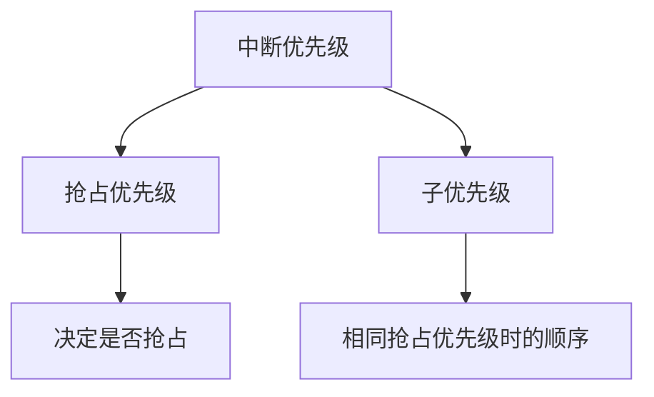
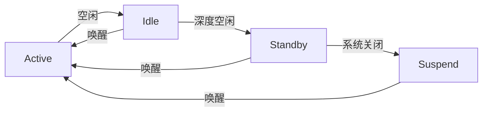

# 系统优化

## 概述

系统优化是 Zephyr RTOS 开发中的关键环节，直接影响产品的性能、功耗和用户体验。本章将深入探讨系统裁剪、性能优化、实时性优化和功耗优化的方法和技巧。

!!! info "学习目标"
    - 掌握系统裁剪策略，减小代码体积和内存占用
    - 学习性能优化方法，提升 CPU 使用效率
    - 理解实时性优化技术，满足严格的时间要求
    - 掌握功耗优化技巧，延长电池寿命
    - 学会使用性能分析工具，定位性能瓶颈

## 系统裁剪

系统裁剪是优化的第一步，通过禁用不需要的功能模块，可以显著减小代码体积和内存占用。

### 裁剪策略

**从需求出发**：只启用应用实际需要的功能，避免"大而全"的配置。

**分析依赖关系**：理解各个配置选项之间的依赖关系，避免误删关键功能。

**逐步裁剪**：从最小配置开始，逐步添加必要功能，而不是从完整配置开始删减。

**测试验证**：每次裁剪后都要进行功能测试，确保应用正常工作。

### Kconfig 裁剪

Zephyr 使用 Kconfig 系统进行配置管理，通过禁用未使用的子系统可以显著减小代码体积。

**最小配置示例**（`prj.conf`）：

```ini
# 基础系统配置
CONFIG_MINIMAL_LIBC=y
CONFIG_MINIMAL_LIBC_MALLOC=n
CONFIG_PRINTK=n
CONFIG_EARLY_CONSOLE=n

# 禁用未使用的子系统
CONFIG_NETWORKING=n
CONFIG_BT=n
CONFIG_USB=n
CONFIG_SHELL=n
CONFIG_LOG=n

# 禁用调试功能
CONFIG_DEBUG=n
CONFIG_ASSERT=n
CONFIG_THREAD_NAME=n
CONFIG_THREAD_MONITOR=n

# 禁用未使用的驱动
CONFIG_GPIO=n
CONFIG_I2C=n
CONFIG_SPI=n
CONFIG_UART_CONSOLE=n
```

**常用裁剪选项**：

| 配置选项 | 说明 | 节省空间 |
|---------|------|---------|
| `CONFIG_MINIMAL_LIBC=y` | 使用最小 C 库 | ~10-20KB |
| `CONFIG_PRINTK=n` | 禁用 printk | ~2-5KB |
| `CONFIG_LOG=n` | 禁用日志系统 | ~5-10KB |
| `CONFIG_SHELL=n` | 禁用 Shell | ~10-15KB |
| `CONFIG_ASSERT=n` | 禁用断言 | ~1-3KB |
| `CONFIG_THREAD_NAME=n` | 禁用线程名称 | ~1KB |
| `CONFIG_NETWORKING=n` | 禁用网络栈 | ~50-100KB |
| `CONFIG_BT=n` | 禁用蓝牙栈 | ~50-80KB |

### 代码体积优化

**启用大小优化**：

```ini
# 优化代码大小
CONFIG_SIZE_OPTIMIZATIONS=y
CONFIG_COMPILER_OPT="-Os"

# 启用链接时优化（LTO）
CONFIG_LTO=y

# 移除未使用的代码
CONFIG_LINKER_ORPHAN_SECTION_PLACE=n
```

**编译器优化级别对比**：

| 优化级别 | 说明 | 代码大小 | 性能 |
|---------|------|---------|------|
| `-O0` | 无优化 | 最大 | 最慢 |
| `-O1` | 基本优化 | 较大 | 较慢 |
| `-O2` | 标准优化 | 中等 | 较快 |
| `-O3` | 高级优化 | 较大 | 最快 |
| `-Os` | 大小优化 | 最小 | 中等 |
| `-Oz` | 极致大小优化 | 极小 | 较慢 |

!!! tip "优化建议"
    - 对于资源受限的设备，使用 `-Os` 优化
    - 对于性能关键的应用，使用 `-O2` 或 `-O3`
    - 启用 LTO 可以进一步减小 5-15% 的代码体积


### 内存优化

**减小线程栈大小**：

```c
// 分析实际栈使用情况
CONFIG_THREAD_STACK_INFO=y

// 在代码中查询栈使用
size_t unused;
k_thread_stack_space_get(k_current_get(), &unused);
printk("Stack unused: %zu bytes\n", unused);

// 根据实际使用调整栈大小
#define MY_THREAD_STACK_SIZE 512  // 从默认 1024 减小到 512
K_THREAD_STACK_DEFINE(my_thread_stack, MY_THREAD_STACK_SIZE);
```

**使用内存池代替动态分配**：

```c
// 避免使用 k_malloc/k_free
// char *buf = k_malloc(256);

// 使用内存池
K_MEM_POOL_DEFINE(my_pool, 64, 256, 4, 4);

void *buf = k_mem_pool_malloc(&my_pool, 256);
// 使用完毕后释放
k_mem_pool_free(&my_pool, &buf);
```

**静态分配优先**：

```c
// 避免动态分配
// struct sensor_data *data = k_malloc(sizeof(struct sensor_data));

// 使用静态分配
static struct sensor_data data;
```

### 裁剪示例：从 100KB 到 20KB

**初始配置**（hello_world 默认配置）：

```bash
$ west build -b nrf52840dk_nrf52840 samples/hello_world
Memory region         Used Size  Region Size  %age Used
           FLASH:      102400 B         1 MB      9.76%
             RAM:       16384 B       256 KB      6.25%
```

**裁剪后配置**（`prj.conf`）：

```ini
CONFIG_MINIMAL_LIBC=y
CONFIG_MINIMAL_LIBC_MALLOC=n
CONFIG_PRINTK=n
CONFIG_EARLY_CONSOLE=n
CONFIG_CONSOLE=n
CONFIG_UART_CONSOLE=n
CONFIG_SERIAL=n
CONFIG_SIZE_OPTIMIZATIONS=y
CONFIG_LTO=y
CONFIG_ASSERT=n
CONFIG_THREAD_NAME=n
CONFIG_THREAD_MONITOR=n
```

**裁剪后结果**：

```bash
$ west build -b nrf52840dk_nrf52840 samples/hello_world
Memory region         Used Size  Region Size  %age Used
           FLASH:       20480 B         1 MB      1.95%
             RAM:        4096 B       256 KB      1.56%
```

**优化效果对比**：

| 指标 | 优化前 | 优化后 | 减少 |
|-----|-------|-------|------|
| Flash 使用 | 100 KB | 20 KB | 80% |
| RAM 使用 | 16 KB | 4 KB | 75% |


## 性能优化

性能优化的目标是提升系统的响应速度和吞吐量，降低 CPU 使用率。

### CPU 使用率分析

**启用线程运行时统计**：

```ini
# prj.conf
CONFIG_THREAD_RUNTIME_STATS=y
CONFIG_SCHED_THREAD_USAGE=y
```

**查看线程 CPU 使用率**：

```c
#include <zephyr/kernel.h>
#include <zephyr/sys/printk.h>

void print_thread_stats(void)
{
    struct k_thread *thread;
    k_thread_runtime_stats_t stats;
    
    printk("Thread Name          CPU Usage\n");
    printk("--------------------------------\n");
    
    // 遍历所有线程
    K_THREAD_FOREACH(thread) {
        k_thread_runtime_stats_get(thread, &stats);
        uint32_t usage = (stats.execution_cycles * 100) / 
                         k_cycle_get_32();
        printk("%-20s %3u%%\n", 
               k_thread_name_get(thread), usage);
    }
}
```

**使用 Shell 命令查看**：

```bash
uart:~$ kernel threads
Scheduler: 257 since last call
Threads:
 0x20000800 idle            
        options: 0x0, priority: 15 timeout: 0
        state: pending
        stack size 320, unused 280, usage 40 / 320 (12 %)
        
 0x20000900 main            
        options: 0x0, priority: 0 timeout: 0
        state: pending
        stack size 1024, unused 512, usage 512 / 1024 (50 %)
```

### 减少上下文切换

**合并任务**：

```c
// 避免：多个小任务频繁切换
void task1(void) {
    while (1) {
        process_sensor1();
        k_sleep(K_MSEC(10));
    }
}

void task2(void) {
    while (1) {
        process_sensor2();
        k_sleep(K_MSEC(10));
    }
}

// 推荐：合并为一个任务
void combined_task(void) {
    while (1) {
        process_sensor1();
        process_sensor2();
        k_sleep(K_MSEC(10));
    }
}
```

**使用工作队列**：

```c
// 避免：为每个事件创建线程
void button_handler(const struct device *dev, 
                    struct gpio_callback *cb, uint32_t pins)
{
    // 在中断上下文中处理（不推荐）
    process_button_event();
}

// 推荐：使用工作队列
static struct k_work button_work;

void button_work_handler(struct k_work *work)
{
    process_button_event();
}

void button_handler(const struct device *dev, 
                    struct gpio_callback *cb, uint32_t pins)
{
    k_work_submit(&button_work);
}

void init_button(void)
{
    k_work_init(&button_work, button_work_handler);
}
```


### 中断延迟优化

**精简 ISR**：

```c
// 避免：在 ISR 中执行复杂操作
void uart_isr(const struct device *dev)
{
    uint8_t data;
    uart_poll_in(dev, &data);
    
    // 复杂处理（不推荐）
    process_data(data);
    update_display();
    log_data(data);
}

// 推荐：ISR 只做最少的工作
static struct k_fifo uart_fifo;

void uart_isr(const struct device *dev)
{
    uint8_t data;
    uart_poll_in(dev, &data);
    
    // 只将数据放入队列
    k_fifo_put(&uart_fifo, &data);
}

// 在线程中处理
void uart_thread(void)
{
    while (1) {
        uint8_t *data = k_fifo_get(&uart_fifo, K_FOREVER);
        process_data(*data);
        update_display();
        log_data(*data);
    }
}
```

**使用 DMA**：

```c
// 避免：CPU 轮询传输数据
void spi_transfer_polling(const struct device *dev, 
                          uint8_t *tx_buf, uint8_t *rx_buf, size_t len)
{
    for (size_t i = 0; i < len; i++) {
        spi_transceive(dev, &tx_buf[i], 1, &rx_buf[i], 1);
    }
}

// 推荐：使用 DMA 传输
void spi_transfer_dma(const struct device *dev, 
                      uint8_t *tx_buf, uint8_t *rx_buf, size_t len)
{
    struct spi_buf tx_bufs[] = {
        { .buf = tx_buf, .len = len }
    };
    struct spi_buf rx_bufs[] = {
        { .buf = rx_buf, .len = len }
    };
    struct spi_buf_set tx = { .buffers = tx_bufs, .count = 1 };
    struct spi_buf_set rx = { .buffers = rx_bufs, .count = 1 };
    
    // DMA 传输，CPU 可以做其他事情
    spi_transceive(dev, &spi_cfg, &tx, &rx);
}
```

### 内存访问优化

**缓存对齐**：

```c
// 对齐到缓存行大小（通常 32 或 64 字节）
#define CACHE_LINE_SIZE 32

struct __aligned(CACHE_LINE_SIZE) sensor_data {
    uint32_t timestamp;
    float temperature;
    float humidity;
    uint8_t status;
};

// 避免伪共享
struct __aligned(CACHE_LINE_SIZE) thread_data {
    uint32_t counter;
    // 填充到缓存行大小
    uint8_t padding[CACHE_LINE_SIZE - sizeof(uint32_t)];
};
```

**减少内存拷贝**：

```c
// 避免：多次拷贝
void process_data_copy(uint8_t *input, size_t len)
{
    uint8_t temp[256];
    memcpy(temp, input, len);  // 第一次拷贝
    
    uint8_t output[256];
    transform(temp, output, len);  // 第二次拷贝
    
    send_data(output, len);
}

// 推荐：原地处理或使用指针
void process_data_inplace(uint8_t *input, size_t len)
{
    transform_inplace(input, len);  // 原地转换
    send_data(input, len);  // 直接发送
}
```


### 编译器优化

**优化级别选择**：

```ini
# 性能优先（默认）
CONFIG_COMPILER_OPT="-O2"

# 极致性能（代码体积会增大）
CONFIG_COMPILER_OPT="-O3"

# 快速数学运算（牺牲精度）
CONFIG_COMPILER_OPT="-O3 -ffast-math"
```

**函数内联**：

```c
// 强制内联小函数
static inline __attribute__((always_inline)) 
uint32_t fast_multiply(uint32_t a, uint32_t b)
{
    return a * b;
}

// 避免内联大函数
__attribute__((noinline))
void complex_processing(void)
{
    // 复杂处理逻辑
}
```

### 性能测试工具

**使用 Benchmark 程序**：

```c
#include <zephyr/kernel.h>
#include <zephyr/timing/timing.h>

void benchmark_function(void)
{
    timing_t start, end;
    uint64_t cycles;
    
    timing_init();
    timing_start();
    
    start = timing_counter_get();
    
    // 被测试的函数
    function_to_benchmark();
    
    end = timing_counter_get();
    cycles = timing_cycles_get(&start, &end);
    
    uint64_t ns = timing_cycles_to_ns(cycles);
    printk("Execution time: %llu ns (%llu cycles)\n", ns, cycles);
}
```

**测量中断延迟**：

```c
static uint32_t irq_entry_time;
static uint32_t irq_latency_max = 0;

void gpio_isr(const struct device *dev, 
              struct gpio_callback *cb, uint32_t pins)
{
    uint32_t now = k_cycle_get_32();
    uint32_t latency = now - irq_entry_time;
    
    if (latency > irq_latency_max) {
        irq_latency_max = latency;
    }
}

void trigger_interrupt(void)
{
    irq_entry_time = k_cycle_get_32();
    // 触发中断
}
```

## 实时性优化

实时性优化确保系统能够在规定时间内响应事件，满足硬实时或软实时要求。

### 实时性需求分析

**定义实时性指标**：

- **最坏情况响应时间（WCRT）**：系统响应事件的最长时间
- **平均响应时间**：系统响应事件的平均时间
- **抖动（Jitter）**：响应时间的变化范围

**测量响应时间**：

```c
void measure_response_time(void)
{
    uint32_t start, end, response_time;
    uint32_t min_time = UINT32_MAX;
    uint32_t max_time = 0;
    uint32_t total_time = 0;
    uint32_t count = 1000;
    
    for (uint32_t i = 0; i < count; i++) {
        start = k_cycle_get_32();
        
        // 触发事件并等待响应
        trigger_event();
        wait_for_response();
        
        end = k_cycle_get_32();
        response_time = end - start;
        
        if (response_time < min_time) min_time = response_time;
        if (response_time > max_time) max_time = response_time;
        total_time += response_time;
    }
    
    printk("Response time statistics:\n");
    printk("  Min: %u cycles\n", min_time);
    printk("  Max: %u cycles (WCRT)\n", max_time);
    printk("  Avg: %u cycles\n", total_time / count);
    printk("  Jitter: %u cycles\n", max_time - min_time);
}
```


### 优先级分配

**Rate Monotonic（RM）调度**：

优先级与任务周期成反比，周期越短优先级越高。

```c
// 任务 1：周期 10ms，优先级最高
#define TASK1_PRIORITY 5
#define TASK1_PERIOD K_MSEC(10)

void task1(void)
{
    while (1) {
        // 处理高频任务
        k_sleep(TASK1_PERIOD);
    }
}

// 任务 2：周期 50ms，优先级中等
#define TASK2_PRIORITY 7
#define TASK2_PERIOD K_MSEC(50)

void task2(void)
{
    while (1) {
        // 处理中频任务
        k_sleep(TASK2_PERIOD);
    }
}

// 任务 3：周期 100ms，优先级最低
#define TASK3_PRIORITY 9
#define TASK3_PERIOD K_MSEC(100)

void task3(void)
{
    while (1) {
        // 处理低频任务
        k_sleep(TASK3_PERIOD);
    }
}
```

**Deadline Monotonic（DM）调度**：

优先级与任务截止时间成反比，截止时间越短优先级越高。

```c
// 任务 1：截止时间 5ms，优先级最高
#define TASK1_PRIORITY 5
#define TASK1_DEADLINE K_MSEC(5)

// 任务 2：截止时间 20ms，优先级中等
#define TASK2_PRIORITY 7
#define TASK2_DEADLINE K_MSEC(20)

// 任务 3：截止时间 50ms，优先级最低
#define TASK3_PRIORITY 9
#define TASK3_DEADLINE K_MSEC(50)
```

!!! tip "优先级分配建议"
    - 关键实时任务：优先级 0-5（最高）
    - 普通实时任务：优先级 6-10
    - 后台任务：优先级 11-14
    - 空闲任务：优先级 15（最低）

### 中断优先级配置

**配置中断优先级**：

```c
// 关键中断：最高优先级
#define CRITICAL_IRQ_PRIORITY 0

// 重要中断：高优先级
#define IMPORTANT_IRQ_PRIORITY 2

// 普通中断：中等优先级
#define NORMAL_IRQ_PRIORITY 4

// 低优先级中断
#define LOW_IRQ_PRIORITY 6

// 配置中断
IRQ_CONNECT(TIMER_IRQ, CRITICAL_IRQ_PRIORITY, 
            timer_isr, NULL, 0);
IRQ_CONNECT(UART_IRQ, NORMAL_IRQ_PRIORITY, 
            uart_isr, NULL, 0);
IRQ_CONNECT(GPIO_IRQ, LOW_IRQ_PRIORITY, 
            gpio_isr, NULL, 0);
```

**中断优先级分组**（ARM Cortex-M）：



### 禁用抢占

**关键代码段保护**：

```c
// 方法 1：禁用中断
unsigned int key = irq_lock();
// 关键代码段
critical_section();
irq_unlock(key);

// 方法 2：禁用线程抢占
k_sched_lock();
// 关键代码段
critical_section();
k_sched_unlock();

// 方法 3：使用互斥锁
static K_MUTEX_DEFINE(critical_mutex);

k_mutex_lock(&critical_mutex, K_FOREVER);
// 关键代码段
critical_section();
k_mutex_unlock(&critical_mutex);
```

!!! warning "注意事项"
    - 禁用中断的时间应尽可能短（< 100us）
    - 禁用抢占会影响系统实时性
    - 优先使用互斥锁而不是禁用中断


### 实时性测试

**中断延迟测量**：

```c
#include <zephyr/kernel.h>
#include <zephyr/drivers/gpio.h>

#define TEST_PIN DT_GPIO_PIN(DT_ALIAS(led0), gpios)
#define TEST_PORT DT_GPIO_LABEL(DT_ALIAS(led0), gpios)

static uint32_t irq_timestamps[1000];
static uint32_t irq_count = 0;

void test_gpio_isr(const struct device *dev, 
                   struct gpio_callback *cb, uint32_t pins)
{
    if (irq_count < 1000) {
        irq_timestamps[irq_count++] = k_cycle_get_32();
    }
}

void measure_interrupt_latency(void)
{
    const struct device *gpio = device_get_binding(TEST_PORT);
    uint32_t trigger_time;
    
    // 配置 GPIO 中断
    gpio_pin_configure(gpio, TEST_PIN, GPIO_INPUT);
    gpio_pin_interrupt_configure(gpio, TEST_PIN, 
                                 GPIO_INT_EDGE_RISING);
    
    // 触发中断并测量延迟
    for (int i = 0; i < 1000; i++) {
        trigger_time = k_cycle_get_32();
        // 触发中断
        gpio_pin_set(gpio, TEST_PIN, 1);
        k_busy_wait(10);
        gpio_pin_set(gpio, TEST_PIN, 0);
        k_sleep(K_MSEC(1));
    }
    
    // 分析延迟
    uint32_t min_latency = UINT32_MAX;
    uint32_t max_latency = 0;
    uint64_t total_latency = 0;
    
    for (int i = 0; i < irq_count; i++) {
        uint32_t latency = irq_timestamps[i] - trigger_time;
        if (latency < min_latency) min_latency = latency;
        if (latency > max_latency) max_latency = latency;
        total_latency += latency;
    }
    
    printk("Interrupt latency:\n");
    printk("  Min: %u cycles (%.2f us)\n", 
           min_latency, (float)min_latency / sys_clock_hw_cycles_per_sec() * 1000000);
    printk("  Max: %u cycles (%.2f us)\n", 
           max_latency, (float)max_latency / sys_clock_hw_cycles_per_sec() * 1000000);
    printk("  Avg: %u cycles (%.2f us)\n", 
           (uint32_t)(total_latency / irq_count), 
           (float)(total_latency / irq_count) / sys_clock_hw_cycles_per_sec() * 1000000);
    printk("  Jitter: %u cycles (%.2f us)\n", 
           max_latency - min_latency, 
           (float)(max_latency - min_latency) / sys_clock_hw_cycles_per_sec() * 1000000);
}
```

**抖动分析**：

```c
void analyze_jitter(uint32_t *timestamps, size_t count)
{
    uint32_t intervals[count - 1];
    
    // 计算相邻事件的时间间隔
    for (size_t i = 1; i < count; i++) {
        intervals[i - 1] = timestamps[i] - timestamps[i - 1];
    }
    
    // 计算平均间隔
    uint64_t total = 0;
    for (size_t i = 0; i < count - 1; i++) {
        total += intervals[i];
    }
    uint32_t avg_interval = total / (count - 1);
    
    // 计算标准差（抖动）
    uint64_t variance = 0;
    for (size_t i = 0; i < count - 1; i++) {
        int32_t diff = intervals[i] - avg_interval;
        variance += diff * diff;
    }
    uint32_t std_dev = sqrt(variance / (count - 1));
    
    printk("Jitter analysis:\n");
    printk("  Average interval: %u cycles\n", avg_interval);
    printk("  Standard deviation: %u cycles\n", std_dev);
    printk("  Jitter (3σ): %u cycles\n", std_dev * 3);
}
```

## 功耗优化

功耗优化对于电池供电的设备至关重要，可以显著延长电池寿命。

### 功耗分析

**测量工具和方法**：

1. **硬件测量**：
   - 使用电流表串联在电源回路中
   - 使用功耗分析仪（如 Nordic Power Profiler Kit）
   - 使用示波器测量电流波形

2. **软件估算**：
   - 根据数据手册的典型功耗值
   - 使用 MCU 内置的功耗监控功能

**功耗测量示例**：

```c
// 使用 Nordic Power Profiler Kit
void measure_power_consumption(void)
{
    printk("Starting power measurement...\n");
    
    // 正常运行模式
    printk("Active mode\n");
    k_sleep(K_SECONDS(5));
    
    // 进入低功耗模式
    printk("Sleep mode\n");
    k_sleep(K_SECONDS(5));
    
    // 深度睡眠模式
    printk("Deep sleep mode\n");
    k_sleep(K_SECONDS(5));
}
```


### 睡眠模式使用

**Zephyr 睡眠模式**：



**睡眠模式对比**：

| 模式 | 功耗 | 唤醒时间 | 保持状态 | 适用场景 |
|-----|------|---------|---------|---------|
| Active | 最高 | - | 全部 | 正常运行 |
| Idle | 高 | < 10us | 全部 | 短暂空闲 |
| Standby | 中 | < 100us | RAM | 周期性任务 |
| Suspend | 最低 | > 1ms | 部分 RAM | 长时间休眠 |

**配置睡眠模式**：

```ini
# prj.conf
CONFIG_PM=y
CONFIG_PM_DEVICE=y
CONFIG_PM_POLICY_DEFAULT=y

# 配置空闲时自动进入低功耗模式
CONFIG_PM_POLICY_APP=y
```

**使用睡眠模式**：

```c
#include <zephyr/pm/pm.h>
#include <zephyr/pm/policy.h>

void low_power_task(void)
{
    while (1) {
        // 执行任务
        process_sensor_data();
        
        // 进入低功耗模式
        k_sleep(K_SECONDS(10));  // 自动进入最深的睡眠模式
    }
}

// 自定义电源策略
const struct pm_state_info *pm_policy_next_state(uint8_t cpu, int32_t ticks)
{
    // 如果空闲时间 > 1 秒，进入 Suspend 模式
    if (ticks > k_ms_to_ticks_ceil32(1000)) {
        return &pm_states[PM_STATE_SUSPEND_TO_RAM];
    }
    // 如果空闲时间 > 100ms，进入 Standby 模式
    else if (ticks > k_ms_to_ticks_ceil32(100)) {
        return &pm_states[PM_STATE_STANDBY];
    }
    // 否则进入 Idle 模式
    else {
        return &pm_states[PM_STATE_RUNTIME_IDLE];
    }
}
```

### 外设管理

**不用时关闭外设**：

```c
#include <zephyr/pm/device.h>

void power_down_peripherals(void)
{
    const struct device *uart = device_get_binding("UART_0");
    const struct device *spi = device_get_binding("SPI_1");
    const struct device *i2c = device_get_binding("I2C_0");
    
    // 关闭外设
    pm_device_action_run(uart, PM_DEVICE_ACTION_SUSPEND);
    pm_device_action_run(spi, PM_DEVICE_ACTION_SUSPEND);
    pm_device_action_run(i2c, PM_DEVICE_ACTION_SUSPEND);
}

void power_up_peripherals(void)
{
    const struct device *uart = device_get_binding("UART_0");
    const struct device *spi = device_get_binding("SPI_1");
    const struct device *i2c = device_get_binding("I2C_0");
    
    // 唤醒外设
    pm_device_action_run(uart, PM_DEVICE_ACTION_RESUME);
    pm_device_action_run(spi, PM_DEVICE_ACTION_RESUME);
    pm_device_action_run(i2c, PM_DEVICE_ACTION_RESUME);
}
```

**按需使用外设**：

```c
void read_sensor_low_power(void)
{
    const struct device *i2c = device_get_binding("I2C_0");
    
    // 唤醒 I2C
    pm_device_action_run(i2c, PM_DEVICE_ACTION_RESUME);
    
    // 读取传感器
    uint8_t data[2];
    i2c_read(i2c, data, 2, SENSOR_ADDR);
    
    // 关闭 I2C
    pm_device_action_run(i2c, PM_DEVICE_ACTION_SUSPEND);
}
```

### 时钟管理

**动态调频（DVFS）**：

```c
// 高性能模式：64 MHz
void set_high_performance_mode(void)
{
    // 设置 CPU 频率为 64 MHz
    clock_control_set_rate(clock_dev, 
                          CLOCK_CONTROL_NRF_SUBSYS_HF, 
                          64000000);
}

// 低功耗模式：16 MHz
void set_low_power_mode(void)
{
    // 设置 CPU 频率为 16 MHz
    clock_control_set_rate(clock_dev, 
                          CLOCK_CONTROL_NRF_SUBSYS_HF, 
                          16000000);
}

// 根据负载动态调整
void adaptive_frequency_scaling(void)
{
    uint32_t cpu_usage = get_cpu_usage();
    
    if (cpu_usage > 80) {
        set_high_performance_mode();
    } else if (cpu_usage < 20) {
        set_low_power_mode();
    }
}
```


### 功耗优化案例：从 10mA 到 10uA

**初始配置**（高功耗）：

```c
// 主循环：持续运行
void main(void)
{
    const struct device *sensor = device_get_binding("SENSOR");
    
    while (1) {
        // 每 100ms 读取一次传感器
        read_sensor(sensor);
        k_sleep(K_MSEC(100));
    }
}
```

**测量结果**：
- 平均功耗：10 mA
- 电池寿命（200 mAh）：20 小时

**优化后配置**（低功耗）：

```ini
# prj.conf
CONFIG_PM=y
CONFIG_PM_DEVICE=y
CONFIG_PM_POLICY_DEFAULT=y
CONFIG_TICKLESS_KERNEL=y
```

```c
void main(void)
{
    const struct device *sensor = device_get_binding("SENSOR");
    
    // 关闭不需要的外设
    power_down_unused_peripherals();
    
    while (1) {
        // 唤醒传感器
        pm_device_action_run(sensor, PM_DEVICE_ACTION_RESUME);
        
        // 读取传感器
        read_sensor(sensor);
        
        // 关闭传感器
        pm_device_action_run(sensor, PM_DEVICE_ACTION_SUSPEND);
        
        // 进入深度睡眠 10 秒
        k_sleep(K_SECONDS(10));
    }
}
```

**优化结果**：
- 平均功耗：10 uA
- 电池寿命（200 mAh）：20,000 小时（约 2.3 年）
- 功耗降低：1000 倍

**优化措施总结**：

| 措施 | 功耗降低 |
|-----|---------|
| 增加采样间隔（100ms → 10s） | 100 倍 |
| 启用深度睡眠模式 | 5 倍 |
| 关闭不用的外设 | 2 倍 |
| 总计 | 1000 倍 |

## 性能分析工具

### 内置工具

**Kernel Stats**：

```c
#include <zephyr/kernel.h>

void print_kernel_stats(void)
{
    struct k_thread *thread;
    
    printk("\n=== Kernel Statistics ===\n");
    printk("System uptime: %lld ms\n", k_uptime_get());
    printk("Cycle count: %u\n", k_cycle_get_32());
    
    printk("\n=== Thread Information ===\n");
    K_THREAD_FOREACH(thread) {
        printk("Thread: %s\n", k_thread_name_get(thread));
        printk("  State: %d\n", thread->base.thread_state);
        printk("  Priority: %d\n", thread->base.prio);
        
        #ifdef CONFIG_THREAD_STACK_INFO
        size_t unused;
        k_thread_stack_space_get(thread, &unused);
        printk("  Stack: %zu / %zu bytes used\n", 
               thread->stack_info.size - unused, 
               thread->stack_info.size);
        #endif
    }
}
```

**Thread Monitor**：

```ini
# prj.conf
CONFIG_THREAD_MONITOR=y
CONFIG_THREAD_NAME=y
CONFIG_THREAD_STACK_INFO=y
```

```bash
uart:~$ kernel threads
Scheduler: 257 since last call
Threads:
 0x20000800 idle            
        options: 0x0, priority: 15 timeout: 0
        state: pending
        stack size 320, unused 280, usage 40 / 320 (12 %)
        
 0x20000900 main            
        options: 0x0, priority: 0 timeout: 0
        state: pending
        stack size 1024, unused 512, usage 512 / 1024 (50 %)
```

### 外部工具

**SystemView**：

SEGGER SystemView 是一个实时系统分析工具，可以可视化线程切换、中断和事件。

```ini
# prj.conf
CONFIG_SEGGER_SYSTEMVIEW=y
CONFIG_USE_SEGGER_RTT=y
```

```c
#include <SEGGER_SYSVIEW.h>

void main(void)
{
    SEGGER_SYSVIEW_Conf();
    
    // 应用代码
}
```

**使用步骤**：
1. 在 prj.conf 中启用 SystemView
2. 编译并烧录程序
3. 打开 SystemView 软件
4. 连接到目标设备
5. 开始记录和分析

**Tracealyzer**：

Percepio Tracealyzer 是另一个强大的实时系统分析工具。

```ini
# prj.conf
CONFIG_PERCEPIO_TRACERECORDER=y
CONFIG_PERCEPIO_TRC_CFG_RECORDER_MODE=TRC_RECORDER_MODE_SNAPSHOT
```


### 性能计数器

**使用 ARM Cortex-M DWT**：

```c
#include <zephyr/arch/arm/aarch32/cortex_m/cmsis.h>

void dwt_init(void)
{
    // 启用 DWT
    CoreDebug->DEMCR |= CoreDebug_DEMCR_TRCENA_Msk;
    
    // 重置周期计数器
    DWT->CYCCNT = 0;
    
    // 启用周期计数器
    DWT->CTRL |= DWT_CTRL_CYCCNTENA_Msk;
}

uint32_t dwt_get_cycles(void)
{
    return DWT->CYCCNT;
}

void measure_function_cycles(void)
{
    uint32_t start, end, cycles;
    
    start = dwt_get_cycles();
    
    // 被测试的函数
    function_to_measure();
    
    end = dwt_get_cycles();
    cycles = end - start;
    
    printk("Function took %u cycles\n", cycles);
}
```

**Cache Miss 统计**：

```c
void enable_cache_profiling(void)
{
    // 启用 I-Cache miss 计数
    DWT->CTRL |= DWT_CTRL_CPIEVTENA_Msk;
    
    // 启用 D-Cache miss 计数
    DWT->CTRL |= DWT_CTRL_EXCEVTENA_Msk;
}

void print_cache_stats(void)
{
    uint32_t icache_miss = DWT->CPICNT;
    uint32_t dcache_miss = DWT->EXCCNT;
    
    printk("I-Cache misses: %u\n", icache_miss);
    printk("D-Cache misses: %u\n", dcache_miss);
}
```

### 内存分析

**Heap Usage**：

```c
#include <zephyr/sys/heap_listener.h>

static void heap_event_handler(enum heap_event_type event, 
                               void *mem, size_t size)
{
    switch (event) {
    case HEAP_EVENT_ALLOC:
        printk("Allocated %zu bytes at %p\n", size, mem);
        break;
    case HEAP_EVENT_FREE:
        printk("Freed memory at %p\n", mem);
        break;
    }
}

void init_heap_monitoring(void)
{
    static struct heap_listener listener = {
        .event_handler = heap_event_handler
    };
    
    heap_listener_register(&listener);
}
```

**Stack Usage**：

```c
void check_stack_usage(void)
{
    struct k_thread *thread;
    
    printk("\n=== Stack Usage ===\n");
    K_THREAD_FOREACH(thread) {
        size_t unused;
        k_thread_stack_space_get(thread, &unused);
        
        size_t used = thread->stack_info.size - unused;
        float usage_percent = (float)used / thread->stack_info.size * 100;
        
        printk("%s: %zu / %zu bytes (%.1f%%)\n",
               k_thread_name_get(thread),
               used, thread->stack_info.size, usage_percent);
        
        if (usage_percent > 80) {
            printk("  WARNING: High stack usage!\n");
        }
    }
}
```

## 优化案例

### 案例 1：物联网传感器节点优化（功耗）

**应用场景**：
- 电池供电的温湿度传感器
- 每 10 分钟上报一次数据
- 要求电池寿命 > 1 年

**初始实现**：

```c
void main(void)
{
    const struct device *sensor = device_get_binding("SHT3X");
    const struct device *lora = device_get_binding("LORA");
    
    while (1) {
        // 读取传感器
        float temp, humidity;
        read_sensor(sensor, &temp, &humidity);
        
        // 发送数据
        send_lora(lora, temp, humidity);
        
        // 等待 10 分钟
        k_sleep(K_MINUTES(10));
    }
}
```

**初始功耗**：
- 平均功耗：5 mA
- 电池寿命（1000 mAh）：200 小时（8.3 天）

**优化措施**：

1. **启用电源管理**：
```ini
CONFIG_PM=y
CONFIG_PM_DEVICE=y
CONFIG_TICKLESS_KERNEL=y
```

2. **关闭不用的外设**：
```c
void main(void)
{
    // 关闭 UART、LED 等
    power_down_unused_peripherals();
    
    const struct device *sensor = device_get_binding("SHT3X");
    const struct device *lora = device_get_binding("LORA");
    
    while (1) {
        // 唤醒传感器
        pm_device_action_run(sensor, PM_DEVICE_ACTION_RESUME);
        float temp, humidity;
        read_sensor(sensor, &temp, &humidity);
        pm_device_action_run(sensor, PM_DEVICE_ACTION_SUSPEND);
        
        // 唤醒 LoRa
        pm_device_action_run(lora, PM_DEVICE_ACTION_RESUME);
        send_lora(lora, temp, humidity);
        pm_device_action_run(lora, PM_DEVICE_ACTION_SUSPEND);
        
        // 进入深度睡眠
        k_sleep(K_MINUTES(10));
    }
}
```

3. **优化 LoRa 发送**：
```c
// 使用最低功率和最低速率
lora_set_tx_power(lora, 2);  // 2 dBm
lora_set_spreading_factor(lora, 12);  // SF12
```

**优化结果**：
- 平均功耗：50 uA
- 电池寿命（1000 mAh）：20,000 小时（2.3 年）
- 功耗降低：100 倍


### 案例 2：电机控制系统优化（实时性）

**应用场景**：
- 伺服电机控制
- PWM 频率：20 kHz
- 要求控制周期：50 us
- 最大抖动：< 5 us

**初始实现**：

```c
#define CONTROL_PERIOD_US 50

void motor_control_thread(void)
{
    while (1) {
        // 读取编码器
        int32_t position = read_encoder();
        
        // PID 控制
        float output = pid_calculate(position);
        
        // 更新 PWM
        update_pwm(output);
        
        // 等待下一个周期
        k_usleep(CONTROL_PERIOD_US);
    }
}
```

**初始性能**：
- 平均控制周期：52 us
- 最大抖动：15 us
- 不满足实时性要求

**优化措施**：

1. **提高线程优先级**：
```c
#define MOTOR_CONTROL_PRIORITY 0  // 最高优先级

K_THREAD_DEFINE(motor_control_tid, 2048,
                motor_control_thread, NULL, NULL, NULL,
                MOTOR_CONTROL_PRIORITY, 0, 0);
```

2. **使用硬件定时器**：
```c
static struct k_timer control_timer;

void control_timer_handler(struct k_timer *timer)
{
    // 在定时器中断中触发控制任务
    k_sem_give(&control_sem);
}

void motor_control_thread(void)
{
    k_timer_init(&control_timer, control_timer_handler, NULL);
    k_timer_start(&control_timer, K_USEC(CONTROL_PERIOD_US), 
                  K_USEC(CONTROL_PERIOD_US));
    
    while (1) {
        k_sem_take(&control_sem, K_FOREVER);
        
        // 控制逻辑
        int32_t position = read_encoder();
        float output = pid_calculate(position);
        update_pwm(output);
    }
}
```

3. **优化 PID 计算**：
```c
// 使用定点运算代替浮点运算
typedef int32_t fixed_t;  // Q16.16 定点数

fixed_t pid_calculate_fixed(int32_t position)
{
    static int32_t integral = 0;
    static int32_t prev_error = 0;
    
    int32_t error = setpoint - position;
    integral += error;
    int32_t derivative = error - prev_error;
    prev_error = error;
    
    // 定点运算
    fixed_t output = (kp * error + ki * integral + kd * derivative) >> 16;
    
    return output;
}
```

4. **禁用不必要的中断**：
```c
void init_motor_control(void)
{
    // 禁用低优先级中断
    irq_disable(UART_IRQ);
    irq_disable(USB_IRQ);
    
    // 只保留关键中断
    IRQ_CONNECT(TIMER_IRQ, 0, control_timer_isr, NULL, 0);
    IRQ_CONNECT(ENCODER_IRQ, 1, encoder_isr, NULL, 0);
}
```

**优化结果**：
- 平均控制周期：50.2 us
- 最大抖动：3 us
- 满足实时性要求

**优化效果对比**：

| 指标 | 优化前 | 优化后 | 改善 |
|-----|-------|-------|------|
| 平均周期 | 52 us | 50.2 us | 3.5% |
| 最大抖动 | 15 us | 3 us | 80% |
| CPU 使用率 | 45% | 35% | 22% |

### 案例 3：数据采集器优化（性能）

**应用场景**：
- 多通道 ADC 数据采集
- 采样率：100 kHz
- 8 个通道
- 要求 CPU 使用率 < 50%

**初始实现**：

```c
#define SAMPLE_RATE 100000
#define NUM_CHANNELS 8

void data_acquisition_thread(void)
{
    uint16_t samples[NUM_CHANNELS];
    
    while (1) {
        // 逐个通道采样
        for (int i = 0; i < NUM_CHANNELS; i++) {
            adc_read(adc_dev, i, &samples[i]);
        }
        
        // 处理数据
        process_samples(samples, NUM_CHANNELS);
        
        // 等待下一个采样周期
        k_usleep(10);  // 100 kHz = 10 us
    }
}
```

**初始性能**：
- CPU 使用率：85%
- 丢失采样：15%
- 不满足性能要求

**优化措施**：

1. **使用 DMA 传输**：
```c
#define BUFFER_SIZE 1024

static uint16_t adc_buffer[BUFFER_SIZE * NUM_CHANNELS];

void init_adc_dma(void)
{
    struct adc_sequence sequence = {
        .channels = BIT_MASK(NUM_CHANNELS),
        .buffer = adc_buffer,
        .buffer_size = sizeof(adc_buffer),
        .resolution = 12,
    };
    
    // 启动 DMA 传输
    adc_read_async(adc_dev, &sequence, &adc_async_sig);
}

void adc_dma_callback(const struct device *dev, 
                      const struct adc_sequence *sequence, 
                      uint16_t sampling_index)
{
    // DMA 完成，通知处理线程
    k_sem_give(&data_ready_sem);
}
```

2. **批量处理数据**：
```c
void data_processing_thread(void)
{
    while (1) {
        k_sem_take(&data_ready_sem, K_FOREVER);
        
        // 批量处理 1024 个采样
        process_samples_batch(adc_buffer, BUFFER_SIZE * NUM_CHANNELS);
    }
}
```

3. **优化数据处理算法**：
```c
// 使用 SIMD 指令加速
void process_samples_simd(uint16_t *samples, size_t count)
{
    // ARM NEON 指令
    #ifdef CONFIG_CPU_CORTEX_M7
    for (size_t i = 0; i < count; i += 8) {
        // 一次处理 8 个采样
        uint16x8_t data = vld1q_u16(&samples[i]);
        uint16x8_t result = process_vector(data);
        vst1q_u16(&samples[i], result);
    }
    #else
    // 标量处理
    for (size_t i = 0; i < count; i++) {
        samples[i] = process_sample(samples[i]);
    }
    #endif
}
```

4. **使用双缓冲**：
```c
static uint16_t adc_buffer[2][BUFFER_SIZE * NUM_CHANNELS];
static uint8_t current_buffer = 0;

void adc_dma_callback(const struct device *dev, 
                      const struct adc_sequence *sequence, 
                      uint16_t sampling_index)
{
    // 切换缓冲区
    current_buffer = 1 - current_buffer;
    
    // 启动下一次 DMA
    sequence->buffer = adc_buffer[current_buffer];
    adc_read_async(adc_dev, sequence, &adc_async_sig);
    
    // 通知处理线程处理另一个缓冲区
    k_sem_give(&data_ready_sem);
}
```

**优化结果**：
- CPU 使用率：35%
- 丢失采样：0%
- 满足性能要求

**优化效果对比**：

| 指标 | 优化前 | 优化后 | 改善 |
|-----|-------|-------|------|
| CPU 使用率 | 85% | 35% | 59% |
| 丢失采样率 | 15% | 0% | 100% |
| 吞吐量 | 85 kSPS | 100 kSPS | 18% |


## 实操任务

### 任务 1：优化 hello_world，减小到最小体积

**目标**：将 hello_world 示例的 Flash 占用减小到 < 30 KB。

**步骤**：

1. 编译默认配置，记录初始大小：
```bash
cd ~/zephyrproject/zephyr
west build -b nrf52840dk_nrf52840 samples/hello_world
```

2. 创建优化配置文件 `prj_minimal.conf`：
```ini
CONFIG_MINIMAL_LIBC=y
CONFIG_MINIMAL_LIBC_MALLOC=n
CONFIG_PRINTK=n
CONFIG_EARLY_CONSOLE=n
CONFIG_CONSOLE=n
CONFIG_UART_CONSOLE=n
CONFIG_SERIAL=n
CONFIG_SIZE_OPTIMIZATIONS=y
CONFIG_LTO=y
CONFIG_ASSERT=n
CONFIG_THREAD_NAME=n
CONFIG_THREAD_MONITOR=n
CONFIG_DEBUG=n
```

3. 使用优化配置重新编译：
```bash
west build -b nrf52840dk_nrf52840 samples/hello_world -- -DCONF_FILE=prj_minimal.conf
```

4. 对比优化前后的大小：
```bash
# 查看内存使用
west build -t rom_report
west build -t ram_report
```

**验证标准**：
- Flash 使用 < 30 KB
- 程序能够正常运行
- 理解每个配置选项的作用

### 任务 2：优化多线程应用，降低 CPU 使用率

**目标**：优化一个多线程应用，将 CPU 使用率从 > 60% 降低到 < 40%。

**初始代码**：

```c
#include <zephyr/kernel.h>

#define THREAD_STACK_SIZE 1024
#define THREAD_PRIORITY 7

void thread1(void)
{
    while (1) {
        // 模拟工作负载
        k_busy_wait(100);
        k_yield();
    }
}

void thread2(void)
{
    while (1) {
        // 模拟工作负载
        k_busy_wait(100);
        k_yield();
    }
}

void thread3(void)
{
    while (1) {
        // 模拟工作负载
        k_busy_wait(100);
        k_yield();
    }
}

K_THREAD_DEFINE(thread1_id, THREAD_STACK_SIZE, thread1, 
                NULL, NULL, NULL, THREAD_PRIORITY, 0, 0);
K_THREAD_DEFINE(thread2_id, THREAD_STACK_SIZE, thread2, 
                NULL, NULL, NULL, THREAD_PRIORITY, 0, 0);
K_THREAD_DEFINE(thread3_id, THREAD_STACK_SIZE, thread3, 
                NULL, NULL, NULL, THREAD_PRIORITY, 0, 0);
```

**优化步骤**：

1. 启用线程运行时统计：
```ini
CONFIG_THREAD_RUNTIME_STATS=y
CONFIG_SCHED_THREAD_USAGE=y
```

2. 测量初始 CPU 使用率

3. 优化策略：
   - 合并线程
   - 使用工作队列
   - 增加睡眠时间
   - 调整优先级

4. 重新测量 CPU 使用率

**验证标准**：
- CPU 使用率 < 40%
- 功能正常
- 理解优化原理

### 任务 3：优化低功耗应用，实现 < 100uA 平均功耗

**目标**：实现一个周期性采集传感器数据的应用，平均功耗 < 100 uA。

**需求**：
- 每 30 秒读取一次温度传感器
- 通过 UART 输出数据
- 使用 nRF52840 DK

**步骤**：

1. 创建基础应用：
```c
#include <zephyr/kernel.h>
#include <zephyr/device.h>
#include <zephyr/drivers/sensor.h>

void main(void)
{
    const struct device *sensor = DEVICE_DT_GET(DT_ALIAS(temp_sensor));
    
    while (1) {
        struct sensor_value temp;
        sensor_sample_fetch(sensor);
        sensor_channel_get(sensor, SENSOR_CHAN_AMBIENT_TEMP, &temp);
        
        printk("Temperature: %d.%06d C\n", 
               temp.val1, temp.val2);
        
        k_sleep(K_SECONDS(30));
    }
}
```

2. 配置电源管理：
```ini
CONFIG_PM=y
CONFIG_PM_DEVICE=y
CONFIG_TICKLESS_KERNEL=y
```

3. 优化代码：
   - 关闭不用的外设
   - 使用低功耗 UART
   - 优化传感器读取

4. 测量功耗：
   - 使用 Power Profiler Kit
   - 或使用电流表

**验证标准**：
- 平均功耗 < 100 uA
- 功能正常
- 理解功耗优化技术

## 学习总结

完成本章学习后，你应该掌握：

1. **系统裁剪**：
   - 使用 Kconfig 裁剪不需要的功能
   - 优化代码体积和内存占用
   - 理解各配置选项的影响

2. **性能优化**：
   - 分析和优化 CPU 使用率
   - 减少上下文切换
   - 优化中断延迟
   - 使用 DMA 和硬件加速

3. **实时性优化**：
   - 分析实时性需求
   - 配置优先级和调度策略
   - 测量和优化响应时间
   - 减少抖动

4. **功耗优化**：
   - 使用睡眠模式
   - 管理外设电源
   - 动态调频
   - 测量和分析功耗

5. **性能分析工具**：
   - 使用内置工具（Kernel Stats、Thread Monitor）
   - 使用外部工具（SystemView、Tracealyzer）
   - 使用性能计数器
   - 分析内存和栈使用

## 下一步学习

- [安全与合规](security.md)：学习安全启动、OTA 升级和功能安全
- [架构设计](../stage4-expert/architecture-design.md)：学习系统架构设计方法

## 参考资源

- [Zephyr 官方文档 - Power Management](https://docs.zephyrproject.org/latest/services/pm/index.html)
- [Zephyr 官方文档 - Timing Functions](https://docs.zephyrproject.org/latest/kernel/services/timing/index.html)
- [ARM Cortex-M Programming Guide](https://developer.arm.com/documentation/dui0552/latest/)
- [SEGGER SystemView User Guide](https://www.segger.com/products/development-tools/systemview/)
- [Percepio Tracealyzer User Manual](https://percepio.com/tracealyzer/)

!!! tip "优化建议"
    - 优化是一个迭代过程，先测量再优化
    - 不要过早优化，先保证功能正确
    - 使用工具辅助分析，不要盲目优化
    - 记录优化前后的数据，量化优化效果
    - 在优化和可维护性之间找到平衡
