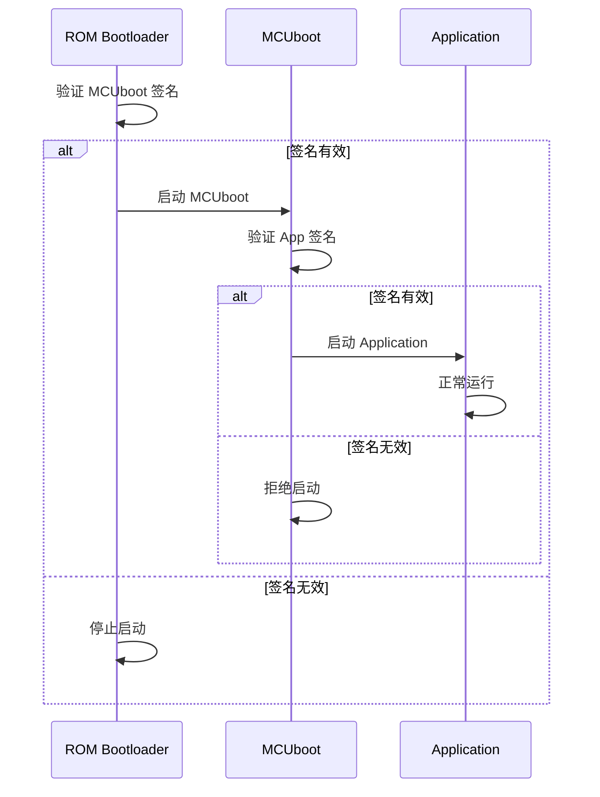
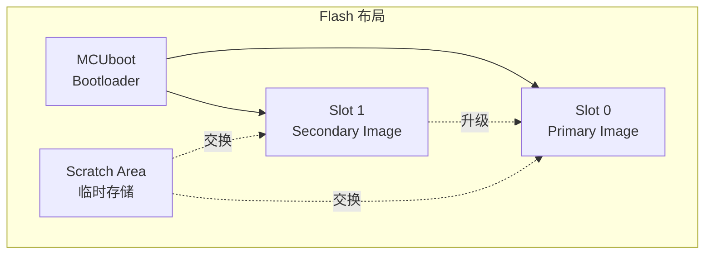
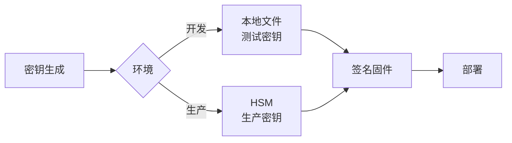
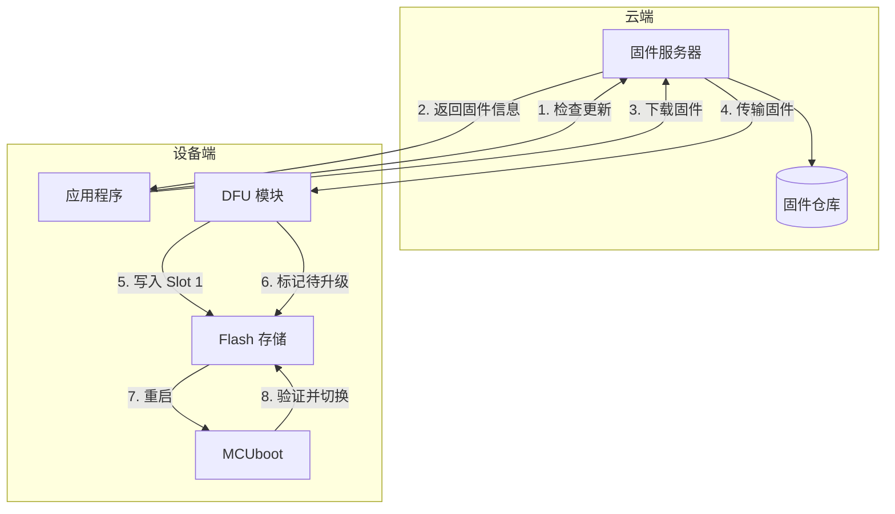
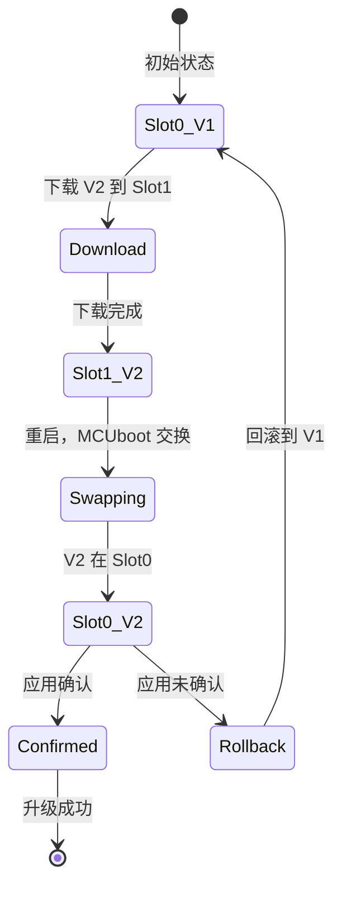
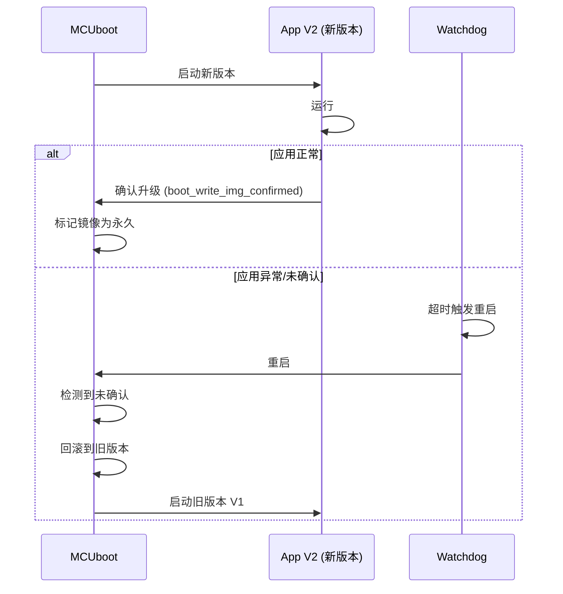
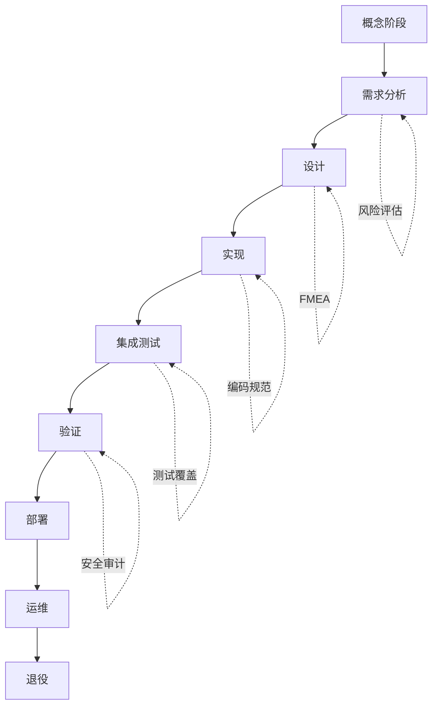

# 安全与合规

## 概述

在物联网和嵌入式系统中，安全性是至关重要的。本章节将深入探讨 Zephyr RTOS 的安全特性，包括安全启动、OTA 升级、加密认证和功能安全。通过本章节的学习，你将能够设计和实现安全可靠的嵌入式系统。

!!! info "学习目标"
    - 理解安全启动的原理和实现方法
    - 掌握 MCUboot 的配置和使用
    - 实现安全的 OTA 固件升级
    - 了解加密和认证技术在 Zephyr 中的应用
    - 理解功能安全标准和实践
    - 掌握安全编码和系统加固技巧

## 安全启动（Secure Boot）

安全启动是确保设备从可信固件启动的关键机制。通过建立信任链，可以防止恶意固件在设备上运行。

### 安全启动原理

安全启动通过建立信任链来确保每一级引导代码都是可信的：



**信任链的关键要素**：

1. **信任根（Root of Trust）**：通常是芯片内置的 ROM Bootloader，其代码在芯片制造时固化
2. **公钥存储**：公钥存储在安全区域（如 OTP、安全 Flash），用于验证下一级代码
3. **签名验证**：每一级代码在启动前验证下一级代码的数字签名
4. **安全失败**：如果验证失败，系统拒绝启动或进入安全模式


### MCUboot 集成

MCUboot 是 Zephyr 推荐的安全 Bootloader，支持固件签名验证、加密和 OTA 升级。

#### MCUboot 架构



**MCUboot 特性**：

- **镜像签名验证**：支持 RSA-2048、RSA-3072、ECDSA-P256 等算法
- **镜像加密**：支持 AES-128、AES-256 加密
- **回滚保护**：防止降级到旧版本固件
- **A/B 分区**：支持双镜像切换和回滚
- **安全计数器**：防止重放攻击

#### 配置 MCUboot

**1. 在项目中启用 MCUboot**

在 `prj.conf` 中添加：

```ini
# MCUboot 支持
CONFIG_BOOTLOADER_MCUBOOT=y

# 镜像版本信息
CONFIG_MCUBOOT_IMAGE_VERSION="1.0.0"

# 签名验证
CONFIG_MCUBOOT_SIGNATURE_KEY_FILE="root-rsa-2048.pem"
```

**2. 配置 Flash 分区**

在设备树 overlay 文件中定义分区：

```dts
&flash0 {
    partitions {
        compatible = "fixed-partitions";
        #address-cells = <1>;
        #size-cells = <1>;

        /* MCUboot Bootloader: 48KB */
        boot_partition: partition@0 {
            label = "mcuboot";
            reg = <0x00000000 0x0000C000>;
        };

        /* Slot 0 (Primary): 464KB */
        slot0_partition: partition@c000 {
            label = "image-0";
            reg = <0x0000C000 0x00074000>;
        };

        /* Slot 1 (Secondary): 464KB */
        slot1_partition: partition@80000 {
            label = "image-1";
            reg = <0x00080000 0x00074000>;
        };

        /* Scratch: 16KB */
        scratch_partition: partition@f4000 {
            label = "image-scratch";
            reg = <0x000F4000 0x00004000>;
        };

        /* Storage: 16KB */
        storage_partition: partition@f8000 {
            label = "storage";
            reg = <0x000F8000 0x00008000>;
        };
    };
};
```


### 固件签名

使用 `imgtool` 工具对固件进行签名。

#### 生成密钥对

```bash
# 生成 RSA-2048 密钥对
imgtool keygen -k root-rsa-2048.pem -t rsa-2048

# 生成 ECDSA-P256 密钥对
imgtool keygen -k root-ec-p256.pem -t ecdsa-p256
```

!!! warning "密钥管理"
    - **私钥**必须妥善保管，不能泄露或提交到版本控制系统
    - **公钥**嵌入到 MCUboot 中，用于验证固件签名
    - 建议使用硬件安全模块（HSM）存储私钥
    - 定期轮换密钥，建立密钥管理流程

#### 签名固件

```bash
# 签名应用固件
west sign -t imgtool -- --key root-rsa-2048.pem

# 或手动签名
imgtool sign \
    --key root-rsa-2048.pem \
    --header-size 0x200 \
    --align 8 \
    --version 1.2.3 \
    --slot-size 0x74000 \
    build/zephyr/zephyr.bin \
    signed-app.bin
```

**签名参数说明**：

| 参数 | 说明 |
|------|------|
| `--key` | 私钥文件路径 |
| `--header-size` | MCUboot 头部大小（通常 0x200） |
| `--align` | 对齐字节数（Flash 写入对齐要求） |
| `--version` | 固件版本号（用于回滚保护） |
| `--slot-size` | 镜像槽大小 |

#### 验证签名

MCUboot 在启动时自动验证签名：

```c
// MCUboot 签名验证流程（简化）
int boot_image_validate(const struct flash_area *fap,
                        struct image_header *hdr)
{
    // 1. 读取镜像头部
    rc = flash_area_read(fap, 0, hdr, sizeof(*hdr));
    
    // 2. 验证魔数
    if (hdr->ih_magic != IMAGE_MAGIC) {
        return -1;
    }
    
    // 3. 计算镜像哈希
    rc = bootutil_img_hash(fap, hdr, hash, &hash_len);
    
    // 4. 验证签名
    rc = bootutil_verify_sig(hash, hash_len, sig, sig_len, key_id);
    
    return rc;
}
```

### 密钥管理最佳实践

**开发环境**：
- 使用测试密钥，不用于生产
- 密钥存储在安全位置，不提交到 Git

**生产环境**：
- 使用硬件安全模块（HSM）生成和存储密钥
- 实施密钥访问控制和审计
- 建立密钥轮换机制
- 准备密钥吊销流程

**密钥存储方案**：




## OTA 固件升级

OTA（Over-The-Air）升级允许远程更新设备固件，是物联网设备的关键功能。

### OTA 升级架构



### OTA 升级流程

**完整的 OTA 升级流程**：

1. **检查更新**：应用定期向服务器查询新版本
2. **下载固件**：通过 HTTP/MQTT/CoAP 下载固件包
3. **验证完整性**：计算哈希值，验证固件完整性
4. **写入 Secondary Slot**：将固件写入 Slot 1
5. **标记待升级**：设置 MCUboot 升级标志
6. **重启设备**：触发系统重启
7. **MCUboot 验证**：验证新固件签名
8. **镜像交换**：将 Slot 1 内容复制到 Slot 0
9. **启动新固件**：从 Slot 0 启动新版本
10. **确认升级**：应用确认升级成功，否则回滚

### A/B 分区方案

MCUboot 支持两种镜像交换策略：

**1. Swap 模式（交换模式）**



**2. Overwrite 模式（覆盖模式）**

直接覆盖 Slot 0，不支持回滚，但节省 Flash 空间。

### 实现 OTA 升级

#### 配置 DFU 支持

在 `prj.conf` 中启用 DFU：

```ini
# DFU 支持
CONFIG_IMG_MANAGER=y
CONFIG_MCUMGR=y
CONFIG_MCUMGR_CMD_IMG_MGMT=y
CONFIG_MCUMGR_CMD_OS_MGMT=y

# Flash 支持
CONFIG_FLASH=y
CONFIG_FLASH_MAP=y
CONFIG_STREAM_FLASH=y

# 网络传输（根据需要选择）
CONFIG_MCUMGR_SMP_BT=y          # 蓝牙传输
# CONFIG_MCUMGR_SMP_UART=y      # 串口传输
# CONFIG_MCUMGR_SMP_UDP=y       # UDP 传输
```

#### OTA 升级代码示例

```c
#include <zephyr/kernel.h>
#include <zephyr/dfu/mcuboot.h>
#include <zephyr/storage/flash_map.h>
#include <zephyr/net/http/client.h>

#define FIRMWARE_URL "http://example.com/firmware.bin"
#define DOWNLOAD_BUFFER_SIZE 1024

/* 下载固件到 Secondary Slot */
int download_firmware(const char *url)
{
    const struct flash_area *fap;
    uint8_t buffer[DOWNLOAD_BUFFER_SIZE];
    size_t offset = 0;
    int rc;
    
    /* 打开 Secondary Slot */
    rc = flash_area_open(FLASH_AREA_IMAGE_SECONDARY, &fap);
    if (rc) {
        printk("Failed to open secondary slot: %d\n", rc);
        return rc;
    }
    
    /* 擦除 Secondary Slot */
    rc = flash_area_erase(fap, 0, fap->fa_size);
    if (rc) {
        printk("Failed to erase secondary slot: %d\n", rc);
        flash_area_close(fap);
        return rc;
    }
    
    /* 下载并写入固件 */
    while (/* 还有数据 */) {
        /* 从服务器读取数据到 buffer */
        size_t bytes_read = http_download_chunk(url, buffer, 
                                                 DOWNLOAD_BUFFER_SIZE);
        
        /* 写入 Flash */
        rc = flash_area_write(fap, offset, buffer, bytes_read);
        if (rc) {
            printk("Failed to write firmware: %d\n", rc);
            flash_area_close(fap);
            return rc;
        }
        
        offset += bytes_read;
        
        /* 显示进度 */
        printk("Downloaded: %zu bytes\r", offset);
    }
    
    flash_area_close(fap);
    printk("\nFirmware download complete\n");
    
    return 0;
}

/* 标记固件待升级 */
int mark_firmware_upgrade(void)
{
    int rc;
    
    /* 设置待升级标志 */
    rc = boot_request_upgrade(BOOT_UPGRADE_TEST);
    if (rc) {
        printk("Failed to mark upgrade: %d\n", rc);
        return rc;
    }
    
    printk("Firmware marked for upgrade\n");
    return 0;
}

/* 确认升级成功 */
int confirm_firmware_upgrade(void)
{
    int rc;
    
    /* 检查是否需要确认 */
    if (!boot_is_img_confirmed()) {
        /* 确认当前镜像 */
        rc = boot_write_img_confirmed();
        if (rc) {
            printk("Failed to confirm image: %d\n", rc);
            return rc;
        }
        printk("Firmware upgrade confirmed\n");
    }
    
    return 0;
}

/* OTA 升级主流程 */
void ota_upgrade_task(void)
{
    int rc;
    
    /* 1. 检查更新 */
    printk("Checking for updates...\n");
    if (!check_update_available()) {
        printk("No update available\n");
        return;
    }
    
    /* 2. 下载固件 */
    printk("Downloading firmware...\n");
    rc = download_firmware(FIRMWARE_URL);
    if (rc) {
        printk("Download failed: %d\n", rc);
        return;
    }
    
    /* 3. 验证固件（可选，MCUboot 会验证） */
    printk("Verifying firmware...\n");
    // 可以在这里添加额外的验证逻辑
    
    /* 4. 标记待升级 */
    rc = mark_firmware_upgrade();
    if (rc) {
        return;
    }
    
    /* 5. 重启设备 */
    printk("Rebooting to apply update...\n");
    k_sleep(K_SECONDS(2));
    sys_reboot(SYS_REBOOT_COLD);
}

/* 应用启动时确认升级 */
void main(void)
{
    printk("Application started\n");
    
    /* 如果是升级后首次启动，确认升级 */
    confirm_firmware_upgrade();
    
    /* 正常应用逻辑 */
    // ...
}
```


### 升级失败回滚

MCUboot 提供自动回滚机制，确保升级失败时系统仍可运行。

#### 回滚机制



#### 配置 Watchdog 保护

```c
#include <zephyr/drivers/watchdog.h>

#define WDT_TIMEOUT_MS 30000  // 30 秒超时

const struct device *wdt;
int wdt_channel_id;

/* 初始化 Watchdog */
int init_watchdog(void)
{
    struct wdt_timeout_cfg wdt_config = {
        .window.min = 0,
        .window.max = WDT_TIMEOUT_MS,
        .callback = NULL,
        .flags = WDT_FLAG_RESET_SOC,
    };
    
    wdt = DEVICE_DT_GET(DT_ALIAS(watchdog0));
    if (!device_is_ready(wdt)) {
        printk("Watchdog device not ready\n");
        return -ENODEV;
    }
    
    wdt_channel_id = wdt_install_timeout(wdt, &wdt_config);
    if (wdt_channel_id < 0) {
        printk("Failed to install watchdog timeout\n");
        return wdt_channel_id;
    }
    
    wdt_setup(wdt, WDT_OPT_PAUSE_HALTED_BY_DBG);
    
    printk("Watchdog initialized\n");
    return 0;
}

/* 应用主循环 */
void main(void)
{
    int rc;
    
    /* 初始化 Watchdog */
    rc = init_watchdog();
    if (rc) {
        printk("Watchdog init failed, continuing without it\n");
    }
    
    /* 确认升级（如果是升级后首次启动） */
    if (!boot_is_img_confirmed()) {
        /* 运行自检 */
        if (system_self_test()) {
            /* 自检通过，确认升级 */
            boot_write_img_confirmed();
            printk("Upgrade confirmed\n");
        } else {
            /* 自检失败，等待 Watchdog 触发回滚 */
            printk("Self-test failed, waiting for rollback\n");
            while (1) {
                k_sleep(K_FOREVER);
            }
        }
    }
    
    /* 主循环 */
    while (1) {
        /* 喂狗 */
        if (wdt) {
            wdt_feed(wdt, wdt_channel_id);
        }
        
        /* 应用逻辑 */
        do_work();
        
        k_sleep(K_SECONDS(1));
    }
}
```

### 增量升级（差分包）

对于大型固件，可以使用差分升级减少传输数据量。

#### 生成差分包

```bash
# 使用 bsdiff 生成差分包
bsdiff old-firmware.bin new-firmware.bin firmware.patch

# 压缩差分包
gzip firmware.patch
```

#### 应用差分包

```c
#include <zephyr/dfu/mcuboot.h>

/* 应用差分包 */
int apply_delta_update(const uint8_t *patch, size_t patch_size)
{
    const struct flash_area *old_fap, *new_fap;
    int rc;
    
    /* 打开 Primary Slot（旧固件） */
    rc = flash_area_open(FLASH_AREA_IMAGE_PRIMARY, &old_fap);
    if (rc) return rc;
    
    /* 打开 Secondary Slot（新固件） */
    rc = flash_area_open(FLASH_AREA_IMAGE_SECONDARY, &new_fap);
    if (rc) {
        flash_area_close(old_fap);
        return rc;
    }
    
    /* 应用差分包（需要 bspatch 库） */
    rc = bspatch_apply(old_fap, patch, patch_size, new_fap);
    
    flash_area_close(old_fap);
    flash_area_close(new_fap);
    
    return rc;
}
```


## 加密和认证

### TLS/DTLS 配置

Zephyr 集成了 mbedTLS 库，支持 TLS/DTLS 安全通信。

#### 启用 mbedTLS

在 `prj.conf` 中配置：

```ini
# mbedTLS 支持
CONFIG_MBEDTLS=y
CONFIG_MBEDTLS_BUILTIN=y
CONFIG_MBEDTLS_ENABLE_HEAP=y
CONFIG_MBEDTLS_HEAP_SIZE=32768

# TLS 版本
CONFIG_MBEDTLS_TLS_VERSION_1_2=y

# 加密套件
CONFIG_MBEDTLS_KEY_EXCHANGE_RSA_ENABLED=y
CONFIG_MBEDTLS_CIPHER_AES_ENABLED=y
CONFIG_MBEDTLS_MAC_SHA256_ENABLED=y

# 证书验证
CONFIG_MBEDTLS_X509_CRT_PARSE_C=y
CONFIG_MBEDTLS_PEM_CERTIFICATE_FORMAT=y
```

#### TLS 客户端示例

```c
#include <zephyr/net/socket.h>
#include <zephyr/net/tls_credentials.h>

/* CA 证书（PEM 格式） */
static const unsigned char ca_certificate[] = {
#include "ca_cert.pem.inc"
};

/* 初始化 TLS */
int init_tls(void)
{
    int rc;
    
    /* 添加 CA 证书 */
    rc = tls_credential_add(CA_CERTIFICATE_TAG,
                           TLS_CREDENTIAL_CA_CERTIFICATE,
                           ca_certificate,
                           sizeof(ca_certificate));
    if (rc < 0) {
        printk("Failed to add CA certificate: %d\n", rc);
        return rc;
    }
    
    return 0;
}

/* 创建 TLS 连接 */
int connect_tls(const char *hostname, uint16_t port)
{
    struct sockaddr_in addr;
    int sock;
    int rc;
    
    /* 创建 socket */
    sock = socket(AF_INET, SOCK_STREAM, IPPROTO_TLS_1_2);
    if (sock < 0) {
        printk("Failed to create socket: %d\n", errno);
        return -errno;
    }
    
    /* 配置 TLS */
    sec_tag_t sec_tag_list[] = { CA_CERTIFICATE_TAG };
    rc = setsockopt(sock, SOL_TLS, TLS_SEC_TAG_LIST,
                   sec_tag_list, sizeof(sec_tag_list));
    if (rc < 0) {
        printk("Failed to set TLS sec tag: %d\n", errno);
        close(sock);
        return -errno;
    }
    
    /* 设置主机名（用于 SNI） */
    rc = setsockopt(sock, SOL_TLS, TLS_HOSTNAME,
                   hostname, strlen(hostname));
    if (rc < 0) {
        printk("Failed to set TLS hostname: %d\n", errno);
        close(sock);
        return -errno;
    }
    
    /* 连接服务器 */
    addr.sin_family = AF_INET;
    addr.sin_port = htons(port);
    inet_pton(AF_INET, hostname, &addr.sin_addr);
    
    rc = connect(sock, (struct sockaddr *)&addr, sizeof(addr));
    if (rc < 0) {
        printk("Failed to connect: %d\n", errno);
        close(sock);
        return -errno;
    }
    
    printk("TLS connection established\n");
    return sock;
}

/* 发送数据 */
int send_tls_data(int sock, const char *data, size_t len)
{
    ssize_t sent = send(sock, data, len, 0);
    if (sent < 0) {
        printk("Failed to send data: %d\n", errno);
        return -errno;
    }
    return sent;
}

/* 接收数据 */
int recv_tls_data(int sock, char *buffer, size_t len)
{
    ssize_t received = recv(sock, buffer, len, 0);
    if (received < 0) {
        printk("Failed to receive data: %d\n", errno);
        return -errno;
    }
    return received;
}
```

### 对称加密（AES）

```c
#include <zephyr/crypto/crypto.h>

#define AES_KEY_SIZE 16  // AES-128
#define AES_BLOCK_SIZE 16

/* AES 加密 */
int aes_encrypt(const uint8_t *key, const uint8_t *plaintext,
                uint8_t *ciphertext, size_t len)
{
    const struct device *crypto_dev;
    struct cipher_ctx ctx;
    struct cipher_pkt pkt;
    int rc;
    
    /* 获取加密设备 */
    crypto_dev = device_get_binding(CONFIG_CRYPTO_TINYCRYPT_SHIM_DRV_NAME);
    if (!crypto_dev) {
        printk("Crypto device not found\n");
        return -ENODEV;
    }
    
    /* 初始化加密上下文 */
    ctx.keylen = AES_KEY_SIZE;
    ctx.key.bit_stream = (uint8_t *)key;
    ctx.flags = CAP_RAW_KEY | CAP_SYNC_OPS;
    
    rc = cipher_begin_session(crypto_dev, &ctx, CRYPTO_CIPHER_ALGO_AES,
                              CRYPTO_CIPHER_MODE_ECB,
                              CRYPTO_CIPHER_OP_ENCRYPT);
    if (rc) {
        printk("Failed to begin cipher session: %d\n", rc);
        return rc;
    }
    
    /* 加密数据 */
    pkt.in_buf = (uint8_t *)plaintext;
    pkt.in_len = len;
    pkt.out_buf = ciphertext;
    pkt.out_buf_max = len;
    
    rc = cipher_block_op(&ctx, &pkt);
    
    cipher_free_session(crypto_dev, &ctx);
    
    return rc;
}

/* AES 解密 */
int aes_decrypt(const uint8_t *key, const uint8_t *ciphertext,
                uint8_t *plaintext, size_t len)
{
    const struct device *crypto_dev;
    struct cipher_ctx ctx;
    struct cipher_pkt pkt;
    int rc;
    
    crypto_dev = device_get_binding(CONFIG_CRYPTO_TINYCRYPT_SHIM_DRV_NAME);
    if (!crypto_dev) {
        return -ENODEV;
    }
    
    ctx.keylen = AES_KEY_SIZE;
    ctx.key.bit_stream = (uint8_t *)key;
    ctx.flags = CAP_RAW_KEY | CAP_SYNC_OPS;
    
    rc = cipher_begin_session(crypto_dev, &ctx, CRYPTO_CIPHER_ALGO_AES,
                              CRYPTO_CIPHER_MODE_ECB,
                              CRYPTO_CIPHER_OP_DECRYPT);
    if (rc) {
        return rc;
    }
    
    pkt.in_buf = (uint8_t *)ciphertext;
    pkt.in_len = len;
    pkt.out_buf = plaintext;
    pkt.out_buf_max = len;
    
    rc = cipher_block_op(&ctx, &pkt);
    
    cipher_free_session(crypto_dev, &ctx);
    
    return rc;
}
```


### 哈希算法（SHA-256）

```c
#include <zephyr/crypto/crypto.h>

#define SHA256_DIGEST_SIZE 32

/* 计算 SHA-256 哈希 */
int calculate_sha256(const uint8_t *data, size_t len, uint8_t *hash)
{
    const struct device *crypto_dev;
    struct hash_ctx ctx;
    struct hash_pkt pkt;
    int rc;
    
    crypto_dev = device_get_binding(CONFIG_CRYPTO_TINYCRYPT_SHIM_DRV_NAME);
    if (!crypto_dev) {
        return -ENODEV;
    }
    
    /* 初始化哈希上下文 */
    ctx.flags = CAP_RAW_KEY | CAP_SYNC_OPS;
    
    rc = hash_begin_session(crypto_dev, &ctx, CRYPTO_HASH_ALGO_SHA256);
    if (rc) {
        printk("Failed to begin hash session: %d\n", rc);
        return rc;
    }
    
    /* 计算哈希 */
    pkt.in_buf = (uint8_t *)data;
    pkt.in_len = len;
    pkt.out_buf = hash;
    
    rc = hash_compute(&ctx, &pkt);
    
    hash_free_session(crypto_dev, &ctx);
    
    return rc;
}

/* 验证数据完整性 */
bool verify_integrity(const uint8_t *data, size_t len,
                     const uint8_t *expected_hash)
{
    uint8_t calculated_hash[SHA256_DIGEST_SIZE];
    int rc;
    
    rc = calculate_sha256(data, len, calculated_hash);
    if (rc) {
        return false;
    }
    
    return memcmp(calculated_hash, expected_hash, SHA256_DIGEST_SIZE) == 0;
}
```

### 随机数生成

```c
#include <zephyr/random/rand32.h>

/* 生成随机数 */
void generate_random_bytes(uint8_t *buffer, size_t len)
{
    sys_rand_get(buffer, len);
}

/* 生成随机密钥 */
void generate_aes_key(uint8_t *key)
{
    generate_random_bytes(key, AES_KEY_SIZE);
}

/* 生成随机 IV */
void generate_iv(uint8_t *iv)
{
    generate_random_bytes(iv, AES_BLOCK_SIZE);
}
```

### 安全存储

#### 使用加密 Flash

```c
#include <zephyr/storage/flash_map.h>

/* 加密存储敏感数据 */
int secure_store(const uint8_t *key, const uint8_t *data, size_t len)
{
    const struct flash_area *fap;
    uint8_t encrypted[256];
    int rc;
    
    /* 加密数据 */
    rc = aes_encrypt(key, data, encrypted, len);
    if (rc) {
        return rc;
    }
    
    /* 写入 Flash */
    rc = flash_area_open(FLASH_AREA_STORAGE, &fap);
    if (rc) {
        return rc;
    }
    
    rc = flash_area_write(fap, 0, encrypted, len);
    
    flash_area_close(fap);
    
    return rc;
}

/* 读取加密数据 */
int secure_load(const uint8_t *key, uint8_t *data, size_t len)
{
    const struct flash_area *fap;
    uint8_t encrypted[256];
    int rc;
    
    /* 从 Flash 读取 */
    rc = flash_area_open(FLASH_AREA_STORAGE, &fap);
    if (rc) {
        return rc;
    }
    
    rc = flash_area_read(fap, 0, encrypted, len);
    flash_area_close(fap);
    
    if (rc) {
        return rc;
    }
    
    /* 解密数据 */
    rc = aes_decrypt(key, encrypted, data, len);
    
    return rc;
}
```


## 功能安全（Functional Safety）

功能安全关注系统在故障情况下的安全行为，确保系统不会对人员或环境造成危害。

### IEC 61508 标准简介

IEC 61508 是功能安全的国际标准，定义了安全相关系统的开发流程。

**安全完整性等级（SIL）**：

| SIL 等级 | 失效概率（每小时） | 风险降低因子 | 应用场景 |
|----------|-------------------|--------------|----------|
| SIL 1 | 10⁻⁵ ~ 10⁻⁶ | 10 ~ 100 | 轻微伤害 |
| SIL 2 | 10⁻⁶ ~ 10⁻⁷ | 100 ~ 1,000 | 严重伤害 |
| SIL 3 | 10⁻⁷ ~ 10⁻⁸ | 1,000 ~ 10,000 | 致命伤害（单人） |
| SIL 4 | 10⁻⁸ ~ 10⁻⁹ | 10,000 ~ 100,000 | 致命伤害（多人） |

**功能安全生命周期**：



### 故障检测

#### Watchdog 监控

```c
#include <zephyr/drivers/watchdog.h>

/* Watchdog 配置 */
struct wdt_timeout_cfg wdt_config = {
    .window.min = 0,
    .window.max = 10000,  // 10 秒
    .callback = wdt_callback,
    .flags = WDT_FLAG_RESET_SOC,
};

/* Watchdog 回调（可选） */
void wdt_callback(const struct device *dev, int channel_id)
{
    printk("Watchdog timeout! System will reset.\n");
    
    /* 记录故障信息 */
    log_fault_info();
}

/* 初始化 Watchdog */
int init_safety_watchdog(void)
{
    const struct device *wdt;
    int wdt_channel_id;
    
    wdt = DEVICE_DT_GET(DT_ALIAS(watchdog0));
    if (!device_is_ready(wdt)) {
        return -ENODEV;
    }
    
    wdt_channel_id = wdt_install_timeout(wdt, &wdt_config);
    if (wdt_channel_id < 0) {
        return wdt_channel_id;
    }
    
    wdt_setup(wdt, WDT_OPT_PAUSE_HALTED_BY_DBG);
    
    return 0;
}
```

#### CRC 校验

```c
#include <zephyr/sys/crc.h>

/* 内存完整性检查 */
bool check_memory_integrity(const uint8_t *data, size_t len,
                            uint32_t expected_crc)
{
    uint32_t calculated_crc = crc32_ieee(data, len);
    return calculated_crc == expected_crc;
}

/* 定期检查关键数据 */
void periodic_integrity_check(void)
{
    static const uint32_t expected_crc = 0x12345678;  // 预计算的 CRC
    
    if (!check_memory_integrity(critical_data, sizeof(critical_data),
                                expected_crc)) {
        printk("Memory corruption detected!\n");
        
        /* 进入安全状态 */
        enter_safe_state();
    }
}
```

#### ECC 内存保护

```c
/* 启用 ECC（在 prj.conf 中） */
// CONFIG_ARM_MPU=y
// CONFIG_ARM_MPU_REGION_MIN_ALIGN_AND_SIZE=y

/* 配置 MPU 保护关键内存 */
void configure_memory_protection(void)
{
    /* 保护代码段（只读） */
    arm_core_mpu_configure_static_mpu_regions(
        (struct arm_mpu_region[]) {
            {
                .name = "CODE",
                .base = (uint32_t)&_image_rom_start,
                .size = (uint32_t)&_image_rom_end - 
                        (uint32_t)&_image_rom_start,
                .attr = {
                    .rw = MPU_REGION_READ,
                    .xn = MPU_REGION_EXEC,
                },
            },
        },
        1
    );
}
```

### 故障处理

#### 安全状态

```c
/* 定义安全状态 */
enum safety_state {
    STATE_NORMAL,
    STATE_DEGRADED,
    STATE_SAFE,
    STATE_FAULT,
};

static enum safety_state current_state = STATE_NORMAL;

/* 进入安全状态 */
void enter_safe_state(void)
{
    printk("Entering safe state\n");
    
    current_state = STATE_SAFE;
    
    /* 关闭所有输出 */
    disable_all_outputs();
    
    /* 记录故障 */
    log_fault_event();
    
    /* 通知监控系统 */
    notify_monitoring_system();
    
    /* 等待人工干预或自动恢复 */
    while (current_state == STATE_SAFE) {
        k_sleep(K_SECONDS(1));
    }
}

/* 降级运行 */
void enter_degraded_mode(void)
{
    printk("Entering degraded mode\n");
    
    current_state = STATE_DEGRADED;
    
    /* 禁用非关键功能 */
    disable_non_critical_features();
    
    /* 降低性能要求 */
    reduce_performance_requirements();
}
```

#### 故障记录

```c
#include <zephyr/storage/flash_map.h>

/* 故障记录结构 */
struct fault_record {
    uint32_t timestamp;
    uint32_t fault_code;
    uint32_t pc;  // 程序计数器
    uint32_t lr;  // 链接寄存器
    char description[64];
};

/* 记录故障信息 */
void log_fault_info(void)
{
    struct fault_record record;
    const struct flash_area *fap;
    
    /* 填充故障信息 */
    record.timestamp = k_uptime_get_32();
    record.fault_code = get_last_fault_code();
    record.pc = __get_PC();
    record.lr = __get_LR();
    snprintf(record.description, sizeof(record.description),
             "System fault detected");
    
    /* 写入 Flash */
    flash_area_open(FLASH_AREA_STORAGE, &fap);
    flash_area_write(fap, 0, &record, sizeof(record));
    flash_area_close(fap);
}
```


### 安全相关配置

在 `prj.conf` 中启用安全特性：

```ini
# 断言检查
CONFIG_ASSERT=y
CONFIG_ASSERT_LEVEL=2

# 栈保护
CONFIG_STACK_SENTINEL=y
CONFIG_THREAD_STACK_INFO=y

# 内存保护
CONFIG_ARM_MPU=y
CONFIG_USERSPACE=y

# 运行时检查
CONFIG_THREAD_MONITOR=y
CONFIG_THREAD_NAME=y

# 日志记录
CONFIG_LOG=y
CONFIG_LOG_MODE_IMMEDIATE=y

# Watchdog
CONFIG_WATCHDOG=y

# 故障处理
CONFIG_FAULT_DUMP=2
```

**配置说明**：

| 配置项 | 说明 | 安全价值 |
|--------|------|----------|
| `CONFIG_ASSERT` | 启用断言检查 | 及早发现逻辑错误 |
| `CONFIG_STACK_SENTINEL` | 栈哨兵保护 | 检测栈溢出 |
| `CONFIG_ARM_MPU` | 内存保护单元 | 防止非法内存访问 |
| `CONFIG_USERSPACE` | 用户空间隔离 | 权限分离 |
| `CONFIG_WATCHDOG` | 看门狗 | 检测系统挂起 |
| `CONFIG_FAULT_DUMP` | 故障转储 | 故障诊断 |

### 认证准备

为了通过功能安全认证，需要准备以下文档和证据：

**1. 安全需求文档**
- 系统安全目标
- 风险评估结果
- SIL 等级确定
- 安全功能需求

**2. 设计文档**
- 安全架构设计
- 故障模式分析（FMEA）
- 故障树分析（FTA）
- 安全机制设计

**3. 测试文档**
- 测试计划和用例
- 测试覆盖率报告
- 故障注入测试
- 集成测试报告

**4. 审计证据**
- 代码审查记录
- 静态分析报告
- 动态测试报告
- 配置管理记录

## 安全最佳实践

### 输入验证

```c
/* 验证输入参数 */
int process_user_input(const char *input, size_t len)
{
    /* 检查空指针 */
    if (input == NULL) {
        return -EINVAL;
    }
    
    /* 检查长度 */
    if (len == 0 || len > MAX_INPUT_SIZE) {
        return -EINVAL;
    }
    
    /* 检查字符有效性 */
    for (size_t i = 0; i < len; i++) {
        if (!isprint(input[i])) {
            return -EINVAL;
        }
    }
    
    /* 防止缓冲区溢出 */
    char buffer[MAX_INPUT_SIZE + 1];
    strncpy(buffer, input, MAX_INPUT_SIZE);
    buffer[MAX_INPUT_SIZE] = '\0';
    
    /* 处理输入 */
    return do_process(buffer);
}
```

### 权限最小化

```c
/* 使用用户空间隔离 */
K_APPMEM_PARTITION_DEFINE(app_partition);

/* 定义用户线程 */
void user_thread_entry(void *p1, void *p2, void *p3)
{
    /* 此线程运行在用户空间，权限受限 */
    
    /* 只能访问授权的内存区域 */
    /* 不能直接访问硬件寄存器 */
    /* 必须通过系统调用访问内核服务 */
}

K_THREAD_DEFINE(user_thread, 1024,
                user_thread_entry, NULL, NULL, NULL,
                5, K_USER, 0);
```

### 安全编码

**避免常见漏洞**：

```c
/* ❌ 错误：缓冲区溢出 */
void bad_copy(const char *src)
{
    char buffer[64];
    strcpy(buffer, src);  // 危险！
}

/* ✅ 正确：使用安全函数 */
void safe_copy(const char *src)
{
    char buffer[64];
    strncpy(buffer, src, sizeof(buffer) - 1);
    buffer[sizeof(buffer) - 1] = '\0';
}

/* ❌ 错误：整数溢出 */
void bad_alloc(size_t count, size_t size)
{
    void *ptr = malloc(count * size);  // 可能溢出
}

/* ✅ 正确：检查溢出 */
void safe_alloc(size_t count, size_t size)
{
    if (count > SIZE_MAX / size) {
        return;  // 溢出检测
    }
    void *ptr = malloc(count * size);
}

/* ❌ 错误：未初始化变量 */
void bad_init(void)
{
    int value;
    if (value > 0) {  // 未定义行为
        do_something();
    }
}

/* ✅ 正确：初始化变量 */
void safe_init(void)
{
    int value = 0;
    if (value > 0) {
        do_something();
    }
}
```

### 定期更新

```c
/* 版本管理 */
#define FIRMWARE_VERSION "1.2.3"
#define SECURITY_PATCH_LEVEL "2026-02"

/* 检查安全补丁 */
bool is_security_patch_current(void)
{
    const char *latest_patch = get_latest_patch_level();
    return strcmp(SECURITY_PATCH_LEVEL, latest_patch) >= 0;
}

/* 强制更新检查 */
void enforce_security_updates(void)
{
    if (!is_security_patch_current()) {
        printk("Security patch outdated, forcing update\n");
        trigger_ota_update();
    }
}
```

### 安全审计

**代码审查清单**：

- [ ] 所有输入都经过验证
- [ ] 没有缓冲区溢出风险
- [ ] 没有整数溢出风险
- [ ] 敏感数据已加密存储
- [ ] 使用安全的随机数生成
- [ ] 错误处理完整
- [ ] 日志不包含敏感信息
- [ ] 遵循最小权限原则
- [ ] 使用最新的安全库
- [ ] 通过静态分析工具检查

**静态分析工具**：

```bash
# 使用 Coverity 进行静态分析
cov-build --dir cov-int west build

# 使用 Clang Static Analyzer
scan-build west build

# 使用 Cppcheck
cppcheck --enable=all src/
```


## 实操任务

### 任务 1：配置 MCUboot 实现安全启动

**目标**：为你的项目配置 MCUboot，实现固件签名验证。

**步骤**：

1. **生成密钥对**

```bash
# 安装 imgtool
pip3 install imgtool

# 生成 RSA-2048 密钥
imgtool keygen -k signing-key.pem -t rsa-2048

# 提取公钥（用于 MCUboot）
imgtool getpub -k signing-key.pem > signing-key-pub.c
```

2. **配置项目**

在 `prj.conf` 中添加：

```ini
CONFIG_BOOTLOADER_MCUBOOT=y
CONFIG_MCUBOOT_IMAGE_VERSION="1.0.0"
```

3. **配置 Flash 分区**

创建 `boards/nrf52840dk_nrf52840.overlay`：

```dts
&flash0 {
    partitions {
        compatible = "fixed-partitions";
        #address-cells = <1>;
        #size-cells = <1>;

        boot_partition: partition@0 {
            label = "mcuboot";
            reg = <0x00000000 0x0000C000>;
        };

        slot0_partition: partition@c000 {
            label = "image-0";
            reg = <0x0000C000 0x00074000>;
        };

        slot1_partition: partition@80000 {
            label = "image-1";
            reg = <0x00080000 0x00074000>;
        };

        scratch_partition: partition@f4000 {
            label = "image-scratch";
            reg = <0x000F4000 0x00004000>;
        };

        storage_partition: partition@f8000 {
            label = "storage";
            reg = <0x000F8000 0x00008000>;
        };
    };
};
```

4. **构建和签名**

```bash
# 构建应用
west build -b nrf52840dk_nrf52840

# 签名固件
west sign -t imgtool -- --key signing-key.pem

# 烧录 MCUboot 和应用
west flash --hex-file build/zephyr/zephyr.signed.hex
```

5. **验证**

观察串口输出，确认 MCUboot 验证签名并启动应用。

**预期结果**：
- MCUboot 成功验证固件签名
- 应用正常启动
- 修改固件后签名失败，MCUboot 拒绝启动

### 任务 2：实现固件 OTA 升级功能

**目标**：实现通过蓝牙或 HTTP 进行 OTA 固件升级。

**步骤**：

1. **启用 DFU 支持**

在 `prj.conf` 中添加：

```ini
# DFU 支持
CONFIG_IMG_MANAGER=y
CONFIG_MCUMGR=y
CONFIG_MCUMGR_CMD_IMG_MGMT=y
CONFIG_MCUMGR_CMD_OS_MGMT=y

# 蓝牙传输
CONFIG_BT=y
CONFIG_BT_PERIPHERAL=y
CONFIG_MCUMGR_SMP_BT=y
CONFIG_MCUMGR_SMP_BT_AUTHEN=n

# Flash 支持
CONFIG_FLASH=y
CONFIG_FLASH_MAP=y
CONFIG_STREAM_FLASH=y
```

2. **实现 OTA 逻辑**

```c
#include <zephyr/mgmt/mcumgr/smp_bt.h>
#include <zephyr/dfu/mcuboot.h>

void main(void)
{
    int rc;
    
    printk("OTA Demo Application\n");
    printk("Version: %s\n", CONFIG_MCUBOOT_IMAGE_VERSION);
    
    /* 确认升级（如果是升级后首次启动） */
    if (!boot_is_img_confirmed()) {
        printk("Confirming firmware upgrade\n");
        rc = boot_write_img_confirmed();
        if (rc) {
            printk("Failed to confirm: %d\n", rc);
        }
    }
    
    /* 初始化 SMP 蓝牙服务 */
    rc = smp_bt_register();
    if (rc) {
        printk("Failed to register SMP BT: %d\n", rc);
        return;
    }
    
    printk("Ready for OTA update via Bluetooth\n");
    
    /* 主循环 */
    while (1) {
        k_sleep(K_SECONDS(1));
    }
}
```

3. **使用 mcumgr 工具升级**

```bash
# 安装 mcumgr
go install github.com/apache/mynewt-mcumgr-cli/mcumgr@latest

# 连接设备
mcumgr --conntype ble --connstring peer_name=Zephyr conn add zephyr

# 上传新固件
mcumgr -c zephyr image upload build/zephyr/zephyr.signed.bin

# 查看镜像列表
mcumgr -c zephyr image list

# 测试新镜像
mcumgr -c zephyr image test <hash>

# 重启设备
mcumgr -c zephyr reset

# 确认升级（在新固件中自动完成）
```

**预期结果**：
- 成功通过蓝牙上传新固件
- 设备重启后运行新版本
- 如果新版本有问题，自动回滚到旧版本

### 任务 3：集成 TLS 实现安全通信

**目标**：使用 TLS 加密与服务器的通信。

**步骤**：

1. **准备证书**

```bash
# 生成 CA 证书
openssl req -x509 -newkey rsa:2048 -keyout ca-key.pem -out ca-cert.pem -days 365 -nodes

# 转换为 C 数组
xxd -i ca-cert.pem > ca-cert.pem.inc
```

2. **配置 TLS**

在 `prj.conf` 中添加：

```ini
# 网络支持
CONFIG_NETWORKING=y
CONFIG_NET_TCP=y
CONFIG_NET_SOCKETS=y

# TLS 支持
CONFIG_MBEDTLS=y
CONFIG_MBEDTLS_BUILTIN=y
CONFIG_MBEDTLS_ENABLE_HEAP=y
CONFIG_MBEDTLS_HEAP_SIZE=32768
CONFIG_MBEDTLS_TLS_VERSION_1_2=y

# 证书
CONFIG_NET_SOCKETS_SOCKOPT_TLS=y
CONFIG_TLS_CREDENTIALS=y
```

3. **实现 TLS 客户端**

```c
#include <zephyr/net/socket.h>
#include <zephyr/net/tls_credentials.h>

#define SERVER_ADDR "192.168.1.100"
#define SERVER_PORT 8443
#define CA_CERT_TAG 1

static const unsigned char ca_cert[] = {
#include "ca-cert.pem.inc"
};

void tls_client_demo(void)
{
    struct sockaddr_in addr;
    int sock;
    int rc;
    
    /* 添加 CA 证书 */
    rc = tls_credential_add(CA_CERT_TAG,
                           TLS_CREDENTIAL_CA_CERTIFICATE,
                           ca_cert, sizeof(ca_cert));
    if (rc < 0) {
        printk("Failed to add CA cert: %d\n", rc);
        return;
    }
    
    /* 创建 TLS socket */
    sock = socket(AF_INET, SOCK_STREAM, IPPROTO_TLS_1_2);
    if (sock < 0) {
        printk("Failed to create socket: %d\n", errno);
        return;
    }
    
    /* 配置 TLS */
    sec_tag_t sec_tag_list[] = { CA_CERT_TAG };
    rc = setsockopt(sock, SOL_TLS, TLS_SEC_TAG_LIST,
                   sec_tag_list, sizeof(sec_tag_list));
    if (rc < 0) {
        printk("Failed to set TLS options: %d\n", errno);
        close(sock);
        return;
    }
    
    /* 连接服务器 */
    addr.sin_family = AF_INET;
    addr.sin_port = htons(SERVER_PORT);
    inet_pton(AF_INET, SERVER_ADDR, &addr.sin_addr);
    
    rc = connect(sock, (struct sockaddr *)&addr, sizeof(addr));
    if (rc < 0) {
        printk("Failed to connect: %d\n", errno);
        close(sock);
        return;
    }
    
    printk("TLS connection established\n");
    
    /* 发送数据 */
    const char *msg = "Hello, secure world!";
    send(sock, msg, strlen(msg), 0);
    
    /* 接收响应 */
    char buffer[128];
    ssize_t len = recv(sock, buffer, sizeof(buffer) - 1, 0);
    if (len > 0) {
        buffer[len] = '\0';
        printk("Received: %s\n", buffer);
    }
    
    close(sock);
}
```

**预期结果**：
- 成功建立 TLS 连接
- 数据传输加密
- 证书验证通过

## 常见问题

### 问题 1：MCUboot 验证失败

**症状**：设备无法启动，串口输出签名验证错误。

**原因**：
- 固件未签名或签名错误
- 公钥不匹配
- Flash 分区配置错误

**解决方案**：

```bash
# 检查签名
imgtool verify -k signing-key.pem build/zephyr/zephyr.signed.bin

# 重新签名
west sign -t imgtool -- --key signing-key.pem

# 检查 Flash 分区配置
west build -t menuconfig
# 导航到 MCUboot 配置，检查分区大小
```

### 问题 2：OTA 升级失败

**症状**：固件下载完成但升级失败，或升级后回滚。

**原因**：
- 新固件签名错误
- Secondary Slot 空间不足
- 应用未确认升级

**解决方案**：

```c
/* 确保应用启动时确认升级 */
void main(void)
{
    if (!boot_is_img_confirmed()) {
        /* 运行自检 */
        if (system_self_test()) {
            boot_write_img_confirmed();
            printk("Upgrade confirmed\n");
        }
    }
    
    /* 正常应用逻辑 */
}
```

### 问题 3：TLS 连接失败

**症状**：TLS 握手失败，连接被拒绝。

**原因**：
- 证书不匹配
- 加密套件不支持
- 内存不足

**解决方案**：

```ini
# 增加 mbedTLS 堆大小
CONFIG_MBEDTLS_HEAP_SIZE=65536

# 启用更多加密套件
CONFIG_MBEDTLS_KEY_EXCHANGE_RSA_ENABLED=y
CONFIG_MBEDTLS_KEY_EXCHANGE_ECDHE_RSA_ENABLED=y

# 启用调试日志
CONFIG_MBEDTLS_DEBUG=y
CONFIG_MBEDTLS_DEBUG_LEVEL=2
```

## 学习总结

完成本章节后，你应该掌握：

- ✅ 安全启动的原理和 MCUboot 的使用
- ✅ 固件签名和密钥管理
- ✅ OTA 固件升级的完整流程
- ✅ A/B 分区和回滚机制
- ✅ TLS/DTLS 加密通信
- ✅ 对称和非对称加密的使用
- ✅ 功能安全标准和实践
- ✅ 故障检测和处理机制
- ✅ 安全编码最佳实践

## 下一步学习

- 深入学习密码学原理
- 研究硬件安全模块（HSM）
- 了解安全认证流程（Common Criteria、IEC 62443）
- 学习渗透测试和漏洞分析
- 参与 Zephyr 安全工作组

## 参考资源

- [MCUboot 官方文档](https://docs.mcuboot.com/)
- [Zephyr 安全指南](https://docs.zephyrproject.org/latest/security/index.html)
- [mbedTLS 文档](https://tls.mbed.org/kb)
- [IEC 61508 标准](https://www.iec.ch/functionalsafety/)
- [OWASP 嵌入式应用安全](https://owasp.org/www-project-embedded-application-security/)
