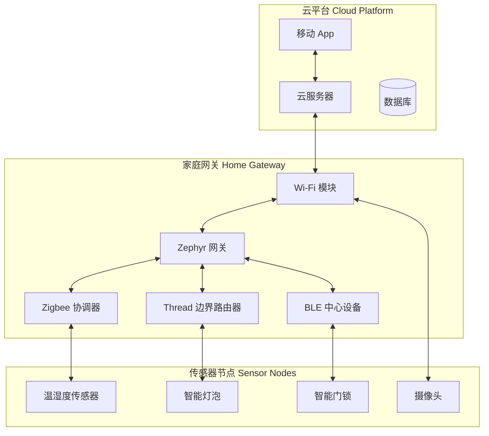
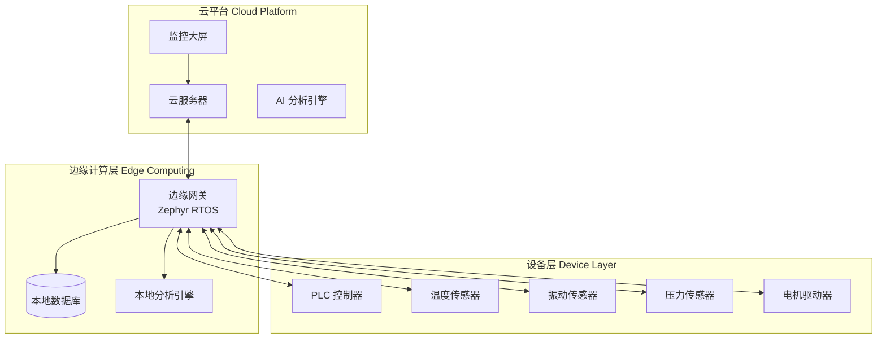
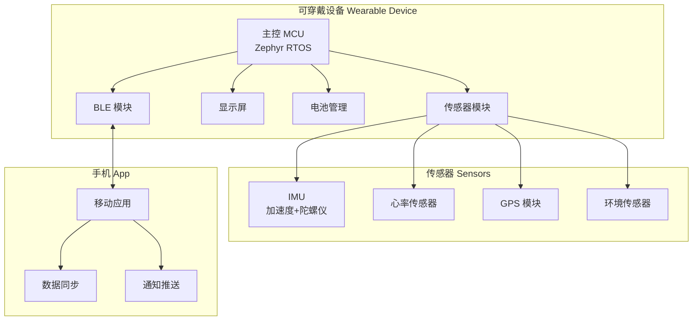
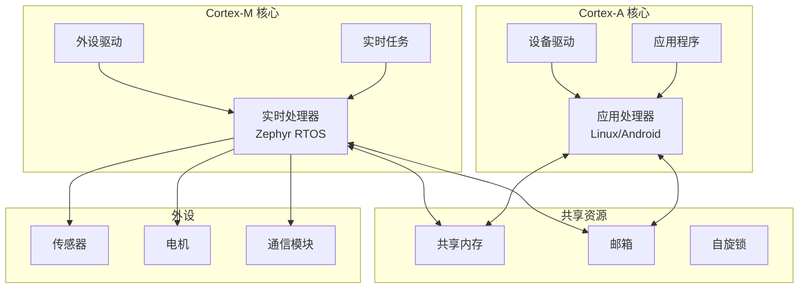

# 系统架构设计

## 概述

系统架构设计是从专业开发者迈向架构师的关键能力。本章节将介绍基于 Zephyr RTOS 的系统架构设计方法，涵盖智能家居、工业物联网、可穿戴设备等典型行业解决方案，以及高可靠系统设计和异构多核系统开发的核心技术。

!!! info "学习目标"
    - 掌握行业解决方案的架构设计方法
    - 理解高可靠系统的设计原则和实现技术
    - 掌握异构多核系统的开发技术
    - 学习架构设计最佳实践和评审方法
    - 能够独立设计和评审复杂的嵌入式系统架构

## 智能家居系统架构

### 系统架构概览

智能家居系统是物联网技术的典型应用场景，涉及多种设备、多种通信协议和云端服务的集成。




### 通信协议选择

智能家居系统需要支持多种无线通信协议，每种协议都有其适用场景：

| 协议 | 特点 | 适用场景 | 功耗 | 传输距离 |
|------|------|----------|------|----------|
| **Zigbee** | 低功耗、Mesh 网络、成熟稳定 | 传感器、开关、插座 | 极低 | 10-100m |
| **Thread** | IPv6、Mesh 网络、安全性高 | 智能灯泡、传感器 | 低 | 10-100m |
| **BLE Mesh** | 低功耗、广泛支持、成本低 | 灯光控制、传感器 | 极低 | 10-30m |
| **Wi-Fi** | 高带宽、广泛支持 | 摄像头、音箱、网关 | 高 | 50-100m |
| **Matter** | 统一标准、跨平台互操作 | 所有智能家居设备 | 中 | 取决于底层协议 |

!!! tip "协议选择建议"
    - **低功耗传感器**：优先选择 Zigbee 或 Thread
    - **灯光控制**：BLE Mesh 或 Thread
    - **高带宽设备**：Wi-Fi
    - **跨平台互操作**：Matter（基于 Thread 或 Wi-Fi）

### 网关设计

智能家居网关是系统的核心，负责协议转换、本地控制和云端同步。

#### 网关核心功能

1. **协议转换**
   - Zigbee/Thread/BLE ↔ Wi-Fi/以太网
   - 设备发现和配对
   - 消息路由和转发

2. **本地控制**
   - 场景自动化（如"回家模式"）
   - 设备联动（如门锁开启时开灯）
   - 离线控制能力

3. **云端同步**
   - 设备状态上报
   - 远程控制指令下发
   - 固件 OTA 更新

4. **安全管理**
   - 设备认证和授权
   - 数据加密传输
   - 访问控制

#### 网关软件架构

```c
// 网关主要模块
struct gateway_system {
    // 协议栈管理
    struct protocol_manager {
        struct zigbee_coordinator *zigbee;
        struct thread_border_router *thread;
        struct ble_central *ble;
        struct wifi_station *wifi;
    } protocols;
    
    // 设备管理
    struct device_manager {
        struct device_list devices;
        struct pairing_service pairing;
        struct device_discovery discovery;
    } devices;
    
    // 自动化引擎
    struct automation_engine {
        struct scene_list scenes;
        struct rule_engine rules;
        struct scheduler scheduler;
    } automation;
    
    // 云端连接
    struct cloud_connector {
        struct mqtt_client *mqtt;
        struct https_client *https;
        struct ota_manager *ota;
    } cloud;
};
```


### 传感器节点设计

传感器节点需要在功耗、成本和功能之间取得平衡。

#### 低功耗设计策略

1. **睡眠模式管理**
```c
// 传感器节点低功耗状态机
void sensor_node_main(void) {
    while (1) {
        // 1. 唤醒并采集数据
        sensor_wakeup();
        float temperature = read_temperature();
        float humidity = read_humidity();
        
        // 2. 发送数据到网关
        if (data_changed(temperature, humidity)) {
            zigbee_send_data(temperature, humidity);
        }
        
        // 3. 进入深度睡眠
        k_timer_start(&wakeup_timer, K_MINUTES(5), K_NO_WAIT);
        pm_device_action_run(sensor_dev, PM_DEVICE_ACTION_SUSPEND);
        k_sleep(K_FOREVER);  // 等待定时器唤醒
    }
}
```

2. **数据缓存和批量发送**
   - 本地缓存多次采样数据
   - 批量发送减少无线通信次数
   - 仅在数据变化超过阈值时发送

3. **动态功耗调整**
   - 根据电池电量调整采样频率
   - 低电量时进入省电模式
   - 电量告警通知

#### OTA 升级支持

```c
// 传感器节点 OTA 配置
CONFIG_BOOTLOADER_MCUBOOT=y
CONFIG_IMG_MANAGER=y
CONFIG_MCUBOOT_IMG_MANAGER=y
CONFIG_IMG_ERASE_PROGRESSIVELY=y

// OTA 升级流程
void ota_upgrade_handler(void) {
    // 1. 接收固件包
    while (receiving_firmware) {
        uint8_t *chunk = zigbee_receive_chunk();
        img_mgmt_impl_write_image_data(offset, chunk, chunk_size);
        offset += chunk_size;
    }
    
    // 2. 验证固件
    if (img_mgmt_impl_verify_image() == 0) {
        // 3. 标记为待测试
        boot_set_pending(1);
        
        // 4. 重启到新固件
        sys_reboot(SYS_REBOOT_WARM);
    }
}
```

### 安全设计

智能家居系统的安全性至关重要，需要从多个层面保障。

#### 设备认证

```c
// 基于证书的设备认证
struct device_identity {
    uint8_t device_id[16];           // 唯一设备 ID
    uint8_t manufacturer_cert[256];  // 制造商证书
    uint8_t device_cert[256];        // 设备证书
    uint8_t private_key[32];         // 设备私钥
};

// 设备配对流程
int device_pairing(struct device_identity *id) {
    // 1. 交换证书
    exchange_certificates(id->device_cert, id->manufacturer_cert);
    
    // 2. 验证证书链
    if (!verify_certificate_chain()) {
        return -EAUTH;
    }
    
    // 3. 生成会话密钥
    uint8_t session_key[32];
    ecdh_generate_shared_secret(id->private_key, peer_public_key, session_key);
    
    // 4. 保存配对信息
    save_pairing_info(id->device_id, session_key);
    
    return 0;
}
```

#### 数据加密

```c
// AES-128 加密通信
struct encrypted_message {
    uint8_t iv[16];           // 初始化向量
    uint8_t payload[256];     // 加密数据
    uint8_t mac[16];          // 消息认证码
};

int send_encrypted_message(const uint8_t *data, size_t len) {
    struct encrypted_message msg;
    
    // 1. 生成随机 IV
    sys_csrand_get(msg.iv, sizeof(msg.iv));
    
    // 2. AES-128-CBC 加密
    aes_encrypt_cbc(session_key, msg.iv, data, len, msg.payload);
    
    // 3. 计算 HMAC-SHA256
    hmac_sha256(session_key, msg.payload, len, msg.mac);
    
    // 4. 发送加密消息
    return zigbee_send(&msg, sizeof(msg));
}
```


### 完整案例：基于 Zephyr 的智能家居网关

#### 系统需求

- 支持 Zigbee、Thread、BLE 三种协议
- 支持 50+ 设备同时连接
- 本地场景自动化
- MQTT 云端连接
- Web 配置界面

#### 硬件选型

- **主控**：Nordic nRF5340（双核 Cortex-M33）
  - 应用核：运行网关主逻辑
  - 网络核：运行 BLE/Thread 协议栈
- **Zigbee**：外接 Zigbee 模块（UART 通信）
- **Wi-Fi**：ESP32-C3 模块（SPI 通信）
- **存储**：8MB Flash（存储设备信息和场景）

#### 软件架构

```c
// 主应用线程
void gateway_main_thread(void) {
    // 初始化各协议栈
    zigbee_coordinator_init();
    thread_border_router_init();
    ble_central_init();
    wifi_station_init();
    
    // 启动设备管理服务
    device_manager_start();
    
    // 启动自动化引擎
    automation_engine_start();
    
    // 连接云端
    mqtt_connect("mqtt.example.com", 8883);
    
    // 主循环
    while (1) {
        // 处理协议栈事件
        process_protocol_events();
        
        // 处理自动化规则
        process_automation_rules();
        
        // 同步云端状态
        sync_cloud_state();
        
        k_sleep(K_MSEC(100));
    }
}

// 设备发现和配对
void device_discovery_thread(void) {
    while (1) {
        // 扫描 Zigbee 设备
        struct zigbee_device *zb_dev = zigbee_scan_devices();
        if (zb_dev) {
            device_manager_add(zb_dev, PROTOCOL_ZIGBEE);
        }
        
        // 扫描 BLE 设备
        struct ble_device *ble_dev = ble_scan_devices();
        if (ble_dev) {
            device_manager_add(ble_dev, PROTOCOL_BLE);
        }
        
        k_sleep(K_SECONDS(5));
    }
}

// 场景自动化示例
void scene_automation_example(void) {
    // 定义"回家模式"场景
    struct scene home_scene = {
        .name = "回家模式",
        .triggers = {
            {.type = TRIGGER_DOOR_UNLOCK, .device_id = "lock_001"},
            {.type = TRIGGER_TIME, .time = "18:00"},
        },
        .actions = {
            {.type = ACTION_LIGHT_ON, .device_id = "light_001"},
            {.type = ACTION_LIGHT_ON, .device_id = "light_002"},
            {.type = ACTION_THERMOSTAT_SET, .device_id = "thermo_001", .value = 24},
        },
    };
    
    automation_engine_add_scene(&home_scene);
}
```

#### 性能优化

1. **多线程设计**
   - 协议栈线程：处理无线通信
   - 自动化线程：执行场景规则
   - 云端同步线程：MQTT 通信
   - Web 服务线程：配置界面

2. **消息队列**
```c
// 使用消息队列解耦模块
K_MSGQ_DEFINE(device_event_queue, sizeof(struct device_event), 32, 4);

// 设备事件生产者
void device_event_producer(struct device_event *event) {
    k_msgq_put(&device_event_queue, event, K_NO_WAIT);
}

// 设备事件消费者
void device_event_consumer(void) {
    struct device_event event;
    while (1) {
        if (k_msgq_get(&device_event_queue, &event, K_FOREVER) == 0) {
            process_device_event(&event);
        }
    }
}
```

3. **内存优化**
   - 使用内存池管理设备对象
   - 限制同时处理的消息数量
   - 定期清理过期数据


## 工业物联网方案

### 工业 IoT 架构概览

工业物联网对实时性、可靠性和安全性有更高的要求。



### 实时性要求

工业控制系统对实时性有严格要求，需要确定性调度和时间同步。

#### 确定性调度

```c
// 使用 Zephyr 的抢占式调度实现确定性
#define PRIORITY_CRITICAL    0   // 最高优先级：安全监控
#define PRIORITY_HIGH        5   // 高优先级：数据采集
#define PRIORITY_NORMAL      10  // 普通优先级：数据处理
#define PRIORITY_LOW         15  // 低优先级：日志记录

// 关键任务：安全监控（1ms 周期）
void safety_monitor_thread(void) {
    while (1) {
        // 检查安全参数
        if (check_temperature() > TEMP_THRESHOLD ||
            check_pressure() > PRESSURE_THRESHOLD) {
            // 立即触发紧急停机
            emergency_shutdown();
        }
        
        k_sleep(K_USEC(1000));  // 1ms 周期
    }
}
K_THREAD_DEFINE(safety_tid, 2048, safety_monitor_thread, NULL, NULL, NULL,
                PRIORITY_CRITICAL, 0, 0);

// 高优先级任务：数据采集（10ms 周期）
void data_acquisition_thread(void) {
    while (1) {
        // 采集传感器数据
        float temp = read_temperature_sensor();
        float vibration = read_vibration_sensor();
        float pressure = read_pressure_sensor();
        
        // 存入缓冲区
        data_buffer_push(temp, vibration, pressure);
        
        k_sleep(K_MSEC(10));  // 10ms 周期
    }
}
K_THREAD_DEFINE(acq_tid, 4096, data_acquisition_thread, NULL, NULL, NULL,
                PRIORITY_HIGH, 0, 0);
```

#### 时间同步

工业系统需要精确的时间同步，通常使用 PTP（Precision Time Protocol）或 NTP。

```c
// PTP 时间同步配置
CONFIG_NET_GPTP=y
CONFIG_NET_GPTP_VLAN=y

// 时间同步初始化
void time_sync_init(void) {
    struct gptp_domain *domain;
    
    // 配置 PTP 域
    domain = gptp_get_domain();
    gptp_set_priority1(domain, 128);
    gptp_set_priority2(domain, 128);
    
    // 启动 PTP 协议
    gptp_start();
    
    printk("PTP time synchronization started\n");
}

// 获取同步时间戳
uint64_t get_synchronized_timestamp(void) {
    struct net_ptp_time ts;
    
    gptp_get_time(&ts);
    
    return (uint64_t)ts.second * 1000000000ULL + ts.nanosecond;
}
```

### 可靠性设计

工业系统需要 7×24 小时不间断运行，可靠性设计至关重要。

#### 冗余设计

1. **硬件冗余**
```c
// 双传感器冗余
struct redundant_sensor {
    const struct device *sensor_a;
    const struct device *sensor_b;
    float last_valid_value;
};

float read_redundant_sensor(struct redundant_sensor *rs) {
    float value_a = read_sensor(rs->sensor_a);
    float value_b = read_sensor(rs->sensor_b);
    
    // 交叉验证
    if (fabs(value_a - value_b) < TOLERANCE) {
        rs->last_valid_value = (value_a + value_b) / 2.0f;
        return rs->last_valid_value;
    }
    
    // 传感器故障检测
    if (is_sensor_valid(rs->sensor_a)) {
        LOG_WRN("Sensor B fault detected");
        return value_a;
    } else if (is_sensor_valid(rs->sensor_b)) {
        LOG_WRN("Sensor A fault detected");
        return value_b;
    } else {
        LOG_ERR("Both sensors failed, using last valid value");
        return rs->last_valid_value;
    }
}
```

2. **软件冗余**
```c
// 双通道数据处理
struct dual_channel_processor {
    float (*process_func_a)(float input);
    float (*process_func_b)(float input);
};

float process_with_redundancy(struct dual_channel_processor *proc, float input) {
    float result_a = proc->process_func_a(input);
    float result_b = proc->process_func_b(input);
    
    // 结果比对
    if (fabs(result_a - result_b) < TOLERANCE) {
        return result_a;
    } else {
        LOG_ERR("Processing mismatch: A=%.2f, B=%.2f", result_a, result_b);
        // 触发告警
        trigger_alarm(ALARM_PROCESSING_MISMATCH);
        return result_a;  // 使用主通道结果
    }
}
```

#### 故障转移

```c
// 主备切换机制
enum gateway_role {
    ROLE_PRIMARY,
    ROLE_BACKUP,
};

struct gateway_ha {
    enum gateway_role role;
    const struct device *peer_comm;  // 与对端通信
    k_timer_t heartbeat_timer;
    uint32_t peer_heartbeat_count;
};

void ha_heartbeat_handler(struct k_timer *timer) {
    struct gateway_ha *ha = CONTAINER_OF(timer, struct gateway_ha, heartbeat_timer);
    
    if (ha->role == ROLE_PRIMARY) {
        // 主设备发送心跳
        send_heartbeat(ha->peer_comm);
    } else {
        // 备设备检查心跳
        if (ha->peer_heartbeat_count == 0) {
            // 主设备失联，切换为主
            LOG_WRN("Primary gateway failed, taking over");
            ha->role = ROLE_PRIMARY;
            activate_gateway_services();
        }
        ha->peer_heartbeat_count = 0;
    }
}
```


### 数据采集

工业系统需要高速、高精度的数据采集能力。

#### 多传感器融合

```c
// 传感器融合数据结构
struct sensor_fusion_data {
    uint64_t timestamp;
    float temperature;
    float vibration_x;
    float vibration_y;
    float vibration_z;
    float pressure;
    float current;
};

// 同步采集多个传感器
void synchronized_acquisition(struct sensor_fusion_data *data) {
    // 获取同步时间戳
    data->timestamp = get_synchronized_timestamp();
    
    // 同时触发所有传感器采样
    trigger_all_sensors();
    
    // 等待采样完成
    k_sleep(K_USEC(100));
    
    // 读取所有传感器数据
    data->temperature = read_temperature();
    data->vibration_x = read_vibration_x();
    data->vibration_y = read_vibration_y();
    data->vibration_z = read_vibration_z();
    data->pressure = read_pressure();
    data->current = read_current();
}
```

#### 高速采集

```c
// 使用 DMA 实现高速 ADC 采集
#define SAMPLE_RATE     10000  // 10kHz
#define BUFFER_SIZE     1024

static uint16_t adc_buffer[BUFFER_SIZE];
static struct k_sem adc_sem;

void adc_dma_callback(const struct device *dev, void *user_data,
                      uint32_t channel, int status) {
    if (status == 0) {
        k_sem_give(&adc_sem);
    }
}

void high_speed_acquisition_thread(void) {
    const struct device *adc = DEVICE_DT_GET(DT_NODELABEL(adc0));
    
    // 配置 ADC DMA 模式
    struct adc_sequence sequence = {
        .buffer = adc_buffer,
        .buffer_size = sizeof(adc_buffer),
        .resolution = 12,
        .oversampling = 0,
        .channels = BIT(0),
    };
    
    while (1) {
        // 启动 DMA 采集
        adc_read_async(adc, &sequence, &adc_sem);
        
        // 等待采集完成
        k_sem_take(&adc_sem, K_FOREVER);
        
        // 处理采集数据
        process_adc_data(adc_buffer, BUFFER_SIZE);
    }
}
```

### 边缘计算

边缘计算可以减少云端传输压力，实现本地实时分析。

#### 本地数据分析

```c
// FFT 频谱分析（用于振动监测）
#include <zephyr/dsp/dsp.h>

void vibration_analysis(float *samples, size_t count) {
    // 执行 FFT
    float fft_output[FFT_SIZE];
    arm_rfft_fast_f32(&fft_instance, samples, fft_output, 0);
    
    // 计算功率谱
    float power_spectrum[FFT_SIZE / 2];
    for (int i = 0; i < FFT_SIZE / 2; i++) {
        float real = fft_output[2 * i];
        float imag = fft_output[2 * i + 1];
        power_spectrum[i] = sqrtf(real * real + imag * imag);
    }
    
    // 检测异常频率
    for (int i = 0; i < FFT_SIZE / 2; i++) {
        float freq = (float)i * SAMPLE_RATE / FFT_SIZE;
        if (power_spectrum[i] > THRESHOLD && 
            freq > FAULT_FREQ_MIN && freq < FAULT_FREQ_MAX) {
            LOG_WRN("Abnormal vibration detected at %.1f Hz", freq);
            trigger_alarm(ALARM_VIBRATION_ABNORMAL);
        }
    }
}
```

#### 预测性维护

```c
// 简单的趋势分析
struct trend_analyzer {
    float history[HISTORY_SIZE];
    size_t index;
    float slope;
};

void update_trend(struct trend_analyzer *ta, float value) {
    ta->history[ta->index] = value;
    ta->index = (ta->index + 1) % HISTORY_SIZE;
    
    // 计算线性回归斜率
    ta->slope = calculate_linear_regression_slope(ta->history, HISTORY_SIZE);
    
    // 预测未来值
    float predicted = value + ta->slope * PREDICTION_STEPS;
    
    if (predicted > FAILURE_THRESHOLD) {
        LOG_WRN("Predicted failure in %d steps", PREDICTION_STEPS);
        schedule_maintenance();
    }
}
```

### 完整案例：工业设备监控系统

#### 系统需求

- 监控 10 台设备的温度、振动、电流
- 采样率：1kHz（振动）、10Hz（温度、电流）
- 本地存储 7 天历史数据
- 异常检测和告警
- 预测性维护

#### 系统架构

```c
// 主监控系统
struct monitoring_system {
    // 数据采集
    struct {
        struct k_thread thread;
        struct k_msgq data_queue;
    } acquisition;
    
    // 数据分析
    struct {
        struct k_thread thread;
        struct trend_analyzer analyzers[10];
    } analysis;
    
    // 数据存储
    struct {
        struct k_thread thread;
        struct ring_buffer *buffer;
    } storage;
    
    // 云端同步
    struct {
        struct k_thread thread;
        struct mqtt_client *client;
    } cloud;
};

// 初始化监控系统
void monitoring_system_init(struct monitoring_system *sys) {
    // 创建数据采集线程
    k_thread_create(&sys->acquisition.thread, acq_stack, STACK_SIZE,
                    acquisition_thread_entry, sys, NULL, NULL,
                    PRIORITY_HIGH, 0, K_NO_WAIT);
    
    // 创建数据分析线程
    k_thread_create(&sys->analysis.thread, analysis_stack, STACK_SIZE,
                    analysis_thread_entry, sys, NULL, NULL,
                    PRIORITY_NORMAL, 0, K_NO_WAIT);
    
    // 创建数据存储线程
    k_thread_create(&sys->storage.thread, storage_stack, STACK_SIZE,
                    storage_thread_entry, sys, NULL, NULL,
                    PRIORITY_LOW, 0, K_NO_WAIT);
    
    // 创建云端同步线程
    k_thread_create(&sys->cloud.thread, cloud_stack, STACK_SIZE,
                    cloud_thread_entry, sys, NULL, NULL,
                    PRIORITY_LOW, 0, K_NO_WAIT);
}
```


## 可穿戴设备架构

### 可穿戴设备架构概览

可穿戴设备对功耗、体积和用户体验有特殊要求。



### 超低功耗设计

可穿戴设备需要在有限的电池容量下工作数天甚至数周。

#### 动态功耗管理

```c
// 功耗状态定义
enum power_state {
    POWER_ACTIVE,       // 活跃状态：所有功能开启
    POWER_IDLE,         // 空闲状态：显示关闭，传感器低频采样
    POWER_SLEEP,        // 睡眠状态：仅保持时钟和加速度计
    POWER_DEEP_SLEEP,   // 深度睡眠：仅 RTC 运行
};

struct power_manager {
    enum power_state current_state;
    uint32_t idle_timeout;
    uint32_t sleep_timeout;
    struct k_timer idle_timer;
    struct k_timer sleep_timer;
};

// 功耗状态机
void power_state_transition(struct power_manager *pm, enum power_state new_state) {
    if (pm->current_state == new_state) {
        return;
    }
    
    switch (new_state) {
    case POWER_ACTIVE:
        // 唤醒所有外设
        display_on();
        enable_all_sensors();
        set_cpu_freq(64000000);  // 64MHz
        break;
        
    case POWER_IDLE:
        // 关闭显示，降低采样率
        display_off();
        reduce_sensor_sampling_rate();
        set_cpu_freq(32000000);  // 32MHz
        k_timer_start(&pm->sleep_timer, K_SECONDS(pm->sleep_timeout), K_NO_WAIT);
        break;
        
    case POWER_SLEEP:
        // 仅保持必要传感器
        disable_non_essential_sensors();
        enable_motion_detection();  // 运动检测唤醒
        set_cpu_freq(16000000);  // 16MHz
        break;
        
    case POWER_DEEP_SLEEP:
        // 进入深度睡眠
        disable_all_sensors();
        pm_device_action_run(PM_DEVICE_ACTION_SUSPEND);
        break;
    }
    
    pm->current_state = new_state;
    LOG_INF("Power state: %d", new_state);
}

// 用户活动检测
void user_activity_handler(void) {
    // 检测到用户活动，切换到活跃状态
    power_state_transition(&pm, POWER_ACTIVE);
    
    // 重启空闲定时器
    k_timer_start(&pm.idle_timer, K_SECONDS(pm.idle_timeout), K_NO_WAIT);
}
```

#### 传感器功耗优化

```c
// 心率传感器智能采样
struct hr_sensor_config {
    bool continuous_mode;  // 连续模式 vs 按需模式
    uint32_t sample_interval;
    uint32_t active_duration;
};

void hr_sensor_smart_sampling(struct hr_sensor_config *cfg) {
    if (cfg->continuous_mode) {
        // 运动时：连续采样
        hr_sensor_set_mode(HR_MODE_CONTINUOUS);
        hr_sensor_set_rate(HR_RATE_HIGH);  // 1Hz
    } else {
        // 静止时：间歇采样
        hr_sensor_set_mode(HR_MODE_SINGLE_SHOT);
        
        // 每 5 分钟采样一次
        while (1) {
            hr_sensor_trigger_measurement();
            k_sleep(K_MSEC(cfg->active_duration));  // 采样 10 秒
            hr_sensor_power_down();
            k_sleep(K_MINUTES(5));
        }
    }
}
```

### 传感器融合

可穿戴设备需要融合多个传感器数据以提供准确的健康和运动信息。

#### IMU 数据融合

```c
// 姿态估计（使用互补滤波器）
struct attitude_estimator {
    float roll;
    float pitch;
    float yaw;
    float alpha;  // 滤波系数
};

void update_attitude(struct attitude_estimator *est,
                     float acc_x, float acc_y, float acc_z,
                     float gyro_x, float gyro_y, float gyro_z,
                     float dt) {
    // 从加速度计计算倾角
    float acc_roll = atan2f(acc_y, acc_z);
    float acc_pitch = atan2f(-acc_x, sqrtf(acc_y * acc_y + acc_z * acc_z));
    
    // 从陀螺仪积分角度
    float gyro_roll = est->roll + gyro_x * dt;
    float gyro_pitch = est->pitch + gyro_y * dt;
    float gyro_yaw = est->yaw + gyro_z * dt;
    
    // 互补滤波融合
    est->roll = est->alpha * gyro_roll + (1 - est->alpha) * acc_roll;
    est->pitch = est->alpha * gyro_pitch + (1 - est->alpha) * acc_pitch;
    est->yaw = gyro_yaw;  // 偏航角仅依赖陀螺仪
}
```

#### 步数计算

```c
// 步数检测算法
struct step_detector {
    float acc_magnitude_history[WINDOW_SIZE];
    size_t history_index;
    uint32_t step_count;
    uint64_t last_step_time;
};

void detect_steps(struct step_detector *sd, float acc_x, float acc_y, float acc_z) {
    // 计算加速度幅值
    float magnitude = sqrtf(acc_x * acc_x + acc_y * acc_y + acc_z * acc_z);
    
    // 更新历史数据
    sd->acc_magnitude_history[sd->history_index] = magnitude;
    sd->history_index = (sd->history_index + 1) % WINDOW_SIZE;
    
    // 计算平均值和标准差
    float mean = calculate_mean(sd->acc_magnitude_history, WINDOW_SIZE);
    float std_dev = calculate_std_dev(sd->acc_magnitude_history, WINDOW_SIZE);
    
    // 峰值检测
    if (magnitude > mean + THRESHOLD * std_dev) {
        uint64_t current_time = k_uptime_get();
        
        // 防止重复计数（最小步频限制）
        if (current_time - sd->last_step_time > MIN_STEP_INTERVAL) {
            sd->step_count++;
            sd->last_step_time = current_time;
            LOG_DBG("Step detected, total: %u", sd->step_count);
        }
    }
}
```


### 用户交互

可穿戴设备需要提供直观的用户交互方式。

#### 触摸屏交互

```c
// 触摸事件处理
enum touch_gesture {
    GESTURE_TAP,
    GESTURE_DOUBLE_TAP,
    GESTURE_LONG_PRESS,
    GESTURE_SWIPE_UP,
    GESTURE_SWIPE_DOWN,
    GESTURE_SWIPE_LEFT,
    GESTURE_SWIPE_RIGHT,
};

struct touch_handler {
    uint32_t touch_start_time;
    int16_t touch_start_x;
    int16_t touch_start_y;
    bool touch_active;
};

enum touch_gesture detect_gesture(struct touch_handler *th,
                                   int16_t x, int16_t y, bool pressed) {
    if (pressed && !th->touch_active) {
        // 触摸开始
        th->touch_start_time = k_uptime_get_32();
        th->touch_start_x = x;
        th->touch_start_y = y;
        th->touch_active = true;
        return GESTURE_NONE;
    }
    
    if (!pressed && th->touch_active) {
        // 触摸结束
        th->touch_active = false;
        uint32_t duration = k_uptime_get_32() - th->touch_start_time;
        int16_t dx = x - th->touch_start_x;
        int16_t dy = y - th->touch_start_y;
        
        // 判断手势
        if (duration < TAP_DURATION && abs(dx) < TAP_THRESHOLD && abs(dy) < TAP_THRESHOLD) {
            return GESTURE_TAP;
        } else if (duration > LONG_PRESS_DURATION) {
            return GESTURE_LONG_PRESS;
        } else if (abs(dx) > SWIPE_THRESHOLD) {
            return dx > 0 ? GESTURE_SWIPE_RIGHT : GESTURE_SWIPE_LEFT;
        } else if (abs(dy) > SWIPE_THRESHOLD) {
            return dy > 0 ? GESTURE_SWIPE_DOWN : GESTURE_SWIPE_UP;
        }
    }
    
    return GESTURE_NONE;
}
```

#### 振动反馈

```c
// 振动马达控制
void haptic_feedback(enum haptic_pattern pattern) {
    const struct device *motor = DEVICE_DT_GET(DT_NODELABEL(vibration_motor));
    
    switch (pattern) {
    case HAPTIC_SHORT:
        // 短振动：按键反馈
        pwm_set_pulse_dt(motor, PWM_USEC(50));
        k_sleep(K_MSEC(50));
        pwm_set_pulse_dt(motor, 0);
        break;
        
    case HAPTIC_LONG:
        // 长振动：通知提醒
        pwm_set_pulse_dt(motor, PWM_USEC(100));
        k_sleep(K_MSEC(200));
        pwm_set_pulse_dt(motor, 0);
        break;
        
    case HAPTIC_DOUBLE:
        // 双振动：重要提醒
        for (int i = 0; i < 2; i++) {
            pwm_set_pulse_dt(motor, PWM_USEC(80));
            k_sleep(K_MSEC(100));
            pwm_set_pulse_dt(motor, 0);
            k_sleep(K_MSEC(100));
        }
        break;
    }
}
```

### 数据同步

可穿戴设备需要与手机 App 同步数据。

#### BLE 数据同步

```c
// BLE 数据同步服务
struct sync_service {
    struct bt_conn *conn;
    struct k_msgq sync_queue;
    bool sync_in_progress;
};

// 同步数据包
struct sync_packet {
    uint8_t type;  // 数据类型：步数、心率、睡眠等
    uint64_t timestamp;
    uint8_t data[256];
    size_t data_len;
};

// 数据同步线程
void data_sync_thread(void *arg) {
    struct sync_service *svc = arg;
    struct sync_packet packet;
    
    while (1) {
        // 等待连接
        if (!svc->conn) {
            k_sleep(K_SECONDS(1));
            continue;
        }
        
        // 从队列获取待同步数据
        if (k_msgq_get(&svc->sync_queue, &packet, K_NO_WAIT) == 0) {
            // 发送数据包
            bt_gatt_notify(svc->conn, &sync_attr, &packet, sizeof(packet));
            
            // 等待确认
            k_sleep(K_MSEC(100));
        } else {
            k_sleep(K_MSEC(500));
        }
    }
}

// 添加数据到同步队列
void queue_data_for_sync(uint8_t type, const void *data, size_t len) {
    struct sync_packet packet = {
        .type = type,
        .timestamp = k_uptime_get(),
        .data_len = MIN(len, sizeof(packet.data)),
    };
    
    memcpy(packet.data, data, packet.data_len);
    k_msgq_put(&sync_svc.sync_queue, &packet, K_NO_WAIT);
}
```

### 完整案例：智能手环系统设计

#### 系统需求

- 步数统计、心率监测、睡眠分析
- 通知提醒（来电、短信、App 通知）
- 7 天续航
- 触摸屏交互
- BLE 5.0 连接

#### 硬件选型

- **主控**：Nordic nRF52840（Cortex-M4F, BLE 5.0）
- **显示**：1.3 寸 OLED（240×240）
- **传感器**：
  - IMU：LSM6DSO（加速度计 + 陀螺仪）
  - 心率：MAX30102（光电容积脉搏波）
  - 环境：BME280（温湿度、气压）
- **电池**：200mAh 锂电池

#### 软件架构

```c
// 智能手环主系统
struct smartband_system {
    // 传感器管理
    struct {
        struct sensor_device *imu;
        struct sensor_device *hr;
        struct sensor_device *env;
    } sensors;
    
    // 数据处理
    struct {
        struct step_detector step_det;
        struct hr_monitor hr_mon;
        struct sleep_analyzer sleep_ana;
    } analytics;
    
    // 用户界面
    struct {
        struct display_device *display;
        struct touch_handler touch;
        enum ui_screen current_screen;
    } ui;
    
    // 通信
    struct {
        struct bt_conn *conn;
        struct sync_service sync;
        struct notification_service notify;
    } comm;
    
    // 功耗管理
    struct power_manager pm;
};

// 主循环
void smartband_main(void) {
    struct smartband_system sys;
    
    // 初始化系统
    smartband_init(&sys);
    
    while (1) {
        // 更新传感器数据
        update_sensors(&sys);
        
        // 数据分析
        analyze_data(&sys);
        
        // 更新 UI
        update_ui(&sys);
        
        // 处理通信
        handle_communication(&sys);
        
        // 功耗管理
        manage_power(&sys);
        
        k_sleep(K_MSEC(100));
    }
}
```


## 高可靠系统设计

### 冗余设计

冗余是提高系统可靠性的重要手段。

#### 硬件冗余

1. **N+1 冗余**：N 个工作单元 + 1 个备份单元
2. **2oo3 表决**：3 个单元，2 个一致即有效
3. **热备份**：主备实时同步，故障时立即切换

```c
// 2oo3 表决系统
struct voting_system {
    float (*read_sensor_a)(void);
    float (*read_sensor_b)(void);
    float (*read_sensor_c)(void);
};

float read_with_voting(struct voting_system *vs) {
    float value_a = vs->read_sensor_a();
    float value_b = vs->read_sensor_b();
    float value_c = vs->read_sensor_c();
    
    // 2oo3 表决逻辑
    if (fabs(value_a - value_b) < TOLERANCE) {
        return (value_a + value_b) / 2.0f;
    } else if (fabs(value_a - value_c) < TOLERANCE) {
        return (value_a + value_c) / 2.0f;
    } else if (fabs(value_b - value_c) < TOLERANCE) {
        return (value_b + value_c) / 2.0f;
    } else {
        // 三个值都不一致，触发告警
        LOG_ERR("Voting failed: A=%.2f, B=%.2f, C=%.2f", value_a, value_b, value_c);
        trigger_alarm(ALARM_SENSOR_DISAGREEMENT);
        return value_a;  // 返回主传感器值
    }
}
```

#### 软件冗余

```c
// 软件多版本执行
struct software_redundancy {
    int (*algorithm_v1)(int input);
    int (*algorithm_v2)(int input);
    int (*algorithm_v3)(int input);
};

int execute_with_redundancy(struct software_redundancy *sr, int input) {
    int result_v1 = sr->algorithm_v1(input);
    int result_v2 = sr->algorithm_v2(input);
    int result_v3 = sr->algorithm_v3(input);
    
    // 多数表决
    if (result_v1 == result_v2) {
        return result_v1;
    } else if (result_v1 == result_v3) {
        return result_v1;
    } else if (result_v2 == result_v3) {
        return result_v2;
    } else {
        LOG_ERR("Software voting failed");
        return result_v1;
    }
}
```

### 故障检测

及时发现故障是可靠系统的关键。

#### Watchdog 监控

```c
// 多级 Watchdog 系统
struct watchdog_system {
    const struct device *wdt_hw;      // 硬件 Watchdog
    struct k_timer wdt_sw_timer;      // 软件 Watchdog
    uint32_t task_heartbeats[MAX_TASKS];
    uint32_t last_feed_time;
};

// 任务心跳
void task_heartbeat(int task_id) {
    wdt_sys.task_heartbeats[task_id] = k_uptime_get_32();
}

// 软件 Watchdog 检查
void software_watchdog_check(struct k_timer *timer) {
    uint32_t current_time = k_uptime_get_32();
    
    // 检查所有任务心跳
    for (int i = 0; i < MAX_TASKS; i++) {
        if (current_time - wdt_sys.task_heartbeats[i] > TASK_TIMEOUT) {
            LOG_ERR("Task %d timeout", i);
            // 尝试恢复任务
            restart_task(i);
        }
    }
    
    // 喂硬件 Watchdog
    wdt_feed(wdt_sys.wdt_hw, 0);
    wdt_sys.last_feed_time = current_time;
}
```

#### 健康检查

```c
// 系统健康检查
struct health_monitor {
    uint32_t cpu_usage;
    uint32_t memory_usage;
    uint32_t task_count;
    uint32_t error_count;
};

void system_health_check(struct health_monitor *hm) {
    // CPU 使用率检查
    hm->cpu_usage = get_cpu_usage();
    if (hm->cpu_usage > CPU_USAGE_THRESHOLD) {
        LOG_WRN("High CPU usage: %u%%", hm->cpu_usage);
    }
    
    // 内存使用率检查
    hm->memory_usage = get_memory_usage();
    if (hm->memory_usage > MEMORY_USAGE_THRESHOLD) {
        LOG_WRN("High memory usage: %u%%", hm->memory_usage);
    }
    
    // 任务数量检查
    hm->task_count = get_task_count();
    if (hm->task_count > MAX_TASK_COUNT) {
        LOG_ERR("Too many tasks: %u", hm->task_count);
    }
    
    // 错误计数检查
    if (hm->error_count > ERROR_COUNT_THRESHOLD) {
        LOG_ERR("Too many errors: %u", hm->error_count);
        trigger_system_recovery();
    }
}
```

#### 异常监控

```c
// 异常捕获和记录
void exception_handler(void) {
    // 保存异常上下文
    struct exception_context ctx;
    save_exception_context(&ctx);
    
    // 记录异常信息
    LOG_ERR("Exception occurred:");
    LOG_ERR("  PC: 0x%08x", ctx.pc);
    LOG_ERR("  LR: 0x%08x", ctx.lr);
    LOG_ERR("  SP: 0x%08x", ctx.sp);
    LOG_ERR("  Exception type: %u", ctx.exception_type);
    
    // 保存到非易失性存储
    save_crash_dump(&ctx);
    
    // 尝试恢复或重启
    if (can_recover()) {
        recover_from_exception();
    } else {
        sys_reboot(SYS_REBOOT_WARM);
    }
}
```

### 故障恢复

发现故障后需要快速恢复系统。

#### 自动重启

```c
// 智能重启策略
struct restart_policy {
    uint32_t restart_count;
    uint32_t last_restart_time;
    uint32_t restart_interval;
};

void smart_restart(struct restart_policy *policy) {
    uint32_t current_time = k_uptime_get_32();
    
    // 检查重启频率
    if (current_time - policy->last_restart_time < policy->restart_interval) {
        policy->restart_count++;
        
        if (policy->restart_count > MAX_RESTART_COUNT) {
            LOG_ERR("Too many restarts, entering safe mode");
            enter_safe_mode();
            return;
        }
    } else {
        // 重置计数器
        policy->restart_count = 0;
    }
    
    policy->last_restart_time = current_time;
    
    // 保存重启原因
    save_restart_reason(RESTART_REASON_FAULT);
    
    // 执行重启
    sys_reboot(SYS_REBOOT_WARM);
}
```

#### 状态恢复

```c
// 状态保存和恢复
struct system_state {
    uint32_t magic;
    uint32_t version;
    uint32_t checksum;
    // 应用状态数据
    struct {
        uint32_t operation_mode;
        float calibration_data[10];
        uint32_t runtime_config;
    } app_state;
};

// 保存状态到非易失性存储
void save_system_state(struct system_state *state) {
    state->magic = STATE_MAGIC;
    state->version = STATE_VERSION;
    state->checksum = calculate_checksum(state, sizeof(*state) - sizeof(state->checksum));
    
    nvs_write(&nvs, STATE_ID, state, sizeof(*state));
}

// 恢复状态
bool restore_system_state(struct system_state *state) {
    if (nvs_read(&nvs, STATE_ID, state, sizeof(*state)) < 0) {
        return false;
    }
    
    // 验证状态
    if (state->magic != STATE_MAGIC || state->version != STATE_VERSION) {
        return false;
    }
    
    uint32_t checksum = calculate_checksum(state, sizeof(*state) - sizeof(state->checksum));
    if (checksum != state->checksum) {
        return false;
    }
    
    return true;
}
```

#### 降级运行

```c
// 降级模式
enum degraded_mode {
    MODE_NORMAL,
    MODE_DEGRADED_LEVEL1,  // 关闭非关键功能
    MODE_DEGRADED_LEVEL2,  // 仅保留核心功能
    MODE_SAFE,             // 安全模式
};

void enter_degraded_mode(enum degraded_mode mode) {
    switch (mode) {
    case MODE_DEGRADED_LEVEL1:
        // 关闭非关键功能
        disable_logging();
        disable_statistics();
        reduce_sampling_rate();
        break;
        
    case MODE_DEGRADED_LEVEL2:
        // 仅保留核心功能
        disable_all_non_essential_features();
        enable_core_functions_only();
        break;
        
    case MODE_SAFE:
        // 安全模式：最小功能
        disable_all_features();
        enable_emergency_functions();
        notify_maintenance_required();
        break;
    }
    
    LOG_WRN("Entered degraded mode: %d", mode);
}
```

### 系统监控

持续监控系统状态，及时发现潜在问题。

#### 日志记录

```c
// 分级日志系统
CONFIG_LOG=y
CONFIG_LOG_DEFAULT_LEVEL=3  // INFO
CONFIG_LOG_BACKEND_UART=y
CONFIG_LOG_BACKEND_RTT=y

// 关键事件日志
void log_critical_event(const char *event, uint32_t data) {
    LOG_ERR("CRITICAL: %s, data=0x%08x", event, data);
    
    // 保存到非易失性存储
    struct log_entry entry = {
        .timestamp = k_uptime_get(),
        .level = LOG_LEVEL_ERR,
        .event = event,
        .data = data,
    };
    save_log_entry(&entry);
}
```

#### 性能监控

```c
// 性能指标收集
struct performance_metrics {
    uint32_t cpu_usage;
    uint32_t memory_usage;
    uint32_t task_switch_count;
    uint32_t interrupt_count;
    uint32_t max_interrupt_latency;
};

void collect_performance_metrics(struct performance_metrics *metrics) {
    // CPU 使用率
    metrics->cpu_usage = k_thread_runtime_stats_get_all();
    
    // 内存使用
    struct sys_memory_stats mem_stats;
    sys_memory_stats_get(&mem_stats);
    metrics->memory_usage = mem_stats.allocated_bytes;
    
    // 任务切换次数
    metrics->task_switch_count = get_context_switch_count();
    
    // 中断统计
    metrics->interrupt_count = get_interrupt_count();
    metrics->max_interrupt_latency = get_max_interrupt_latency();
}
```

#### 远程诊断

```c
// 远程诊断接口
struct diagnostic_info {
    uint32_t uptime;
    uint32_t restart_count;
    uint32_t error_count;
    struct performance_metrics perf;
    struct health_monitor health;
    char last_error[128];
};

void get_diagnostic_info(struct diagnostic_info *info) {
    info->uptime = k_uptime_get_32();
    info->restart_count = get_restart_count();
    info->error_count = get_error_count();
    
    collect_performance_metrics(&info->perf);
    system_health_check(&info->health);
    
    get_last_error_message(info->last_error, sizeof(info->last_error));
}

// 通过 MQTT 上报诊断信息
void report_diagnostic_info(void) {
    struct diagnostic_info info;
    get_diagnostic_info(&info);
    
    // 序列化为 JSON
    char json[512];
    snprintf(json, sizeof(json),
             "{\"uptime\":%u,\"restarts\":%u,\"errors\":%u,"
             "\"cpu\":%u,\"memory\":%u}",
             info.uptime, info.restart_count, info.error_count,
             info.perf.cpu_usage, info.perf.memory_usage);
    
    // 发送到云端
    mqtt_publish("device/diagnostic", json, strlen(json));
}
```


## 异构多核系统开发

### 多核架构概览

异构多核系统通常包含不同类型的处理器核心，各司其职。



### 核间通信机制

多核系统需要高效的核间通信机制。

#### 共享内存

```c
// 共享内存区域定义
#define SHMEM_BASE      0x20000000
#define SHMEM_SIZE      (64 * 1024)  // 64KB

struct shared_memory {
    // 控制区
    struct {
        uint32_t magic;
        uint32_t version;
        volatile uint32_t a_to_m_flag;  // A 核到 M 核标志
        volatile uint32_t m_to_a_flag;  // M 核到 A 核标志
    } control;
    
    // 数据缓冲区
    struct {
        uint8_t a_to_m_buffer[4096];
        uint8_t m_to_a_buffer[4096];
    } data;
};

// 初始化共享内存
void shmem_init(void) {
    struct shared_memory *shmem = (struct shared_memory *)SHMEM_BASE;
    
    shmem->control.magic = SHMEM_MAGIC;
    shmem->control.version = SHMEM_VERSION;
    shmem->control.a_to_m_flag = 0;
    shmem->control.m_to_a_flag = 0;
}

// M 核读取共享内存
int shmem_read_from_a(void *buffer, size_t len) {
    struct shared_memory *shmem = (struct shared_memory *)SHMEM_BASE;
    
    // 等待 A 核写入
    while (shmem->control.a_to_m_flag == 0) {
        k_yield();
    }
    
    // 读取数据
    memcpy(buffer, shmem->data.a_to_m_buffer, MIN(len, sizeof(shmem->data.a_to_m_buffer)));
    
    // 清除标志
    shmem->control.a_to_m_flag = 0;
    
    return 0;
}

// M 核写入共享内存
int shmem_write_to_a(const void *buffer, size_t len) {
    struct shared_memory *shmem = (struct shared_memory *)SHMEM_BASE;
    
    // 等待 A 核读取完成
    while (shmem->control.m_to_a_flag != 0) {
        k_yield();
    }
    
    // 写入数据
    memcpy(shmem->data.m_to_a_buffer, buffer, MIN(len, sizeof(shmem->data.m_to_a_buffer)));
    
    // 设置标志
    shmem->control.m_to_a_flag = 1;
    
    return 0;
}
```

#### 消息传递（RPMsg）

```c
// RPMsg 配置
CONFIG_OPENAMP=y
CONFIG_OPENAMP_RSC_TABLE=y

// RPMsg 端点
struct rpmsg_endpoint {
    struct rpmsg_device *rdev;
    uint32_t addr;
    rpmsg_ept_cb callback;
};

// 创建 RPMsg 端点
int rpmsg_create_endpoint(struct rpmsg_endpoint *ept, const char *name,
                          rpmsg_ept_cb callback) {
    ept->callback = callback;
    
    // 创建端点
    return rpmsg_create_ept(&ept->rdev->ept, name, RPMSG_ADDR_ANY,
                           RPMSG_ADDR_ANY, callback, NULL);
}

// 发送 RPMsg 消息
int rpmsg_send_message(struct rpmsg_endpoint *ept, const void *data, size_t len) {
    return rpmsg_send(&ept->rdev->ept, data, len);
}

// RPMsg 接收回调
int rpmsg_receive_callback(struct rpmsg_endpoint *ept, void *data,
                           size_t len, uint32_t src, void *priv) {
    LOG_INF("Received RPMsg: len=%zu, src=0x%x", len, src);
    
    // 处理接收到的消息
    process_rpmsg_data(data, len);
    
    return 0;
}
```

#### 邮箱（Mailbox）

```c
// 邮箱配置
CONFIG_MBOX=y

// 邮箱通道
struct mbox_channel {
    const struct device *mbox_dev;
    uint32_t channel_id;
    mbox_callback_t callback;
};

// 初始化邮箱
int mbox_init(struct mbox_channel *ch, uint32_t channel_id, mbox_callback_t callback) {
    ch->mbox_dev = DEVICE_DT_GET(DT_NODELABEL(mailbox));
    ch->channel_id = channel_id;
    ch->callback = callback;
    
    // 注册回调
    return mbox_register_callback(ch->mbox_dev, channel_id, callback, NULL);
}

// 发送邮箱消息
int mbox_send(struct mbox_channel *ch, uint32_t message) {
    struct mbox_msg msg = {
        .data = &message,
        .size = sizeof(message),
    };
    
    return mbox_send_dt(ch->mbox_dev, ch->channel_id, &msg);
}

// 邮箱接收回调
void mbox_receive_callback(const struct device *dev, uint32_t channel,
                           void *user_data, struct mbox_msg *msg) {
    uint32_t *data = (uint32_t *)msg->data;
    LOG_INF("Mailbox received: 0x%08x", *data);
    
    // 处理消息
    handle_mailbox_message(*data);
}
```

### 任务分配策略

合理分配任务到不同核心可以充分发挥多核优势。

#### 实时任务 vs 非实时任务

```c
// 任务分配原则
// Cortex-M 核心（Zephyr）：
// - 实时控制任务（电机控制、传感器采集）
// - 中断密集型任务
// - 低延迟任务

// Cortex-A 核心（Linux）：
// - 复杂计算任务（图像处理、AI 推理）
// - 用户界面
// - 网络通信

// M 核实时任务示例
void motor_control_task(void) {
    while (1) {
        // 读取编码器
        int32_t position = read_encoder();
        
        // PID 控制
        float control_output = pid_calculate(&pid, target_position, position);
        
        // 输出 PWM
        set_motor_pwm(control_output);
        
        // 1ms 控制周期
        k_sleep(K_USEC(1000));
    }
}

// A 核非实时任务示例（伪代码）
void image_processing_task(void) {
    while (1) {
        // 从摄像头获取图像
        image = capture_image();
        
        // 图像处理
        processed = process_image(image);
        
        // 发送结果到 M 核
        rpmsg_send_to_m_core(processed);
        
        // 30fps
        usleep(33000);
    }
}
```

#### 负载均衡

```c
// 动态任务分配
struct task_scheduler {
    uint32_t m_core_load;  // M 核负载
    uint32_t a_core_load;  // A 核负载
};

enum core_type {
    CORE_M,
    CORE_A,
};

enum core_type select_core_for_task(struct task_scheduler *sched, uint32_t task_load) {
    // 选择负载较低的核心
    if (sched->m_core_load + task_load < sched->a_core_load) {
        sched->m_core_load += task_load;
        return CORE_M;
    } else {
        sched->a_core_load += task_load;
        return CORE_A;
    }
}
```

### 资源共享管理

多核系统需要协调对共享资源的访问。

#### 互斥访问

```c
// 硬件自旋锁
struct hwspinlock {
    volatile uint32_t *lock_reg;
    uint32_t lock_id;
};

// 获取硬件自旋锁
int hwspinlock_lock(struct hwspinlock *lock) {
    while (1) {
        // 尝试获取锁
        if (__atomic_test_and_set(lock->lock_reg, __ATOMIC_ACQUIRE) == 0) {
            return 0;
        }
        
        // 短暂等待后重试
        k_busy_wait(10);
    }
}

// 释放硬件自旋锁
void hwspinlock_unlock(struct hwspinlock *lock) {
    __atomic_clear(lock->lock_reg, __ATOMIC_RELEASE);
}

// 使用硬件自旋锁保护共享资源
void access_shared_resource(void) {
    hwspinlock_lock(&shared_lock);
    
    // 访问共享资源
    shared_data++;
    
    hwspinlock_unlock(&shared_lock);
}
```

#### DMA 协调

```c
// DMA 通道分配
enum dma_channel_owner {
    DMA_OWNER_M_CORE,
    DMA_OWNER_A_CORE,
};

struct dma_coordinator {
    enum dma_channel_owner channel_owner[MAX_DMA_CHANNELS];
    struct hwspinlock lock;
};

// 请求 DMA 通道
int dma_request_channel(struct dma_coordinator *coord, uint32_t channel,
                        enum dma_channel_owner owner) {
    hwspinlock_lock(&coord->lock);
    
    if (coord->channel_owner[channel] == DMA_OWNER_NONE) {
        coord->channel_owner[channel] = owner;
        hwspinlock_unlock(&coord->lock);
        return 0;
    }
    
    hwspinlock_unlock(&coord->lock);
    return -EBUSY;
}

// 释放 DMA 通道
void dma_release_channel(struct dma_coordinator *coord, uint32_t channel) {
    hwspinlock_lock(&coord->lock);
    coord->channel_owner[channel] = DMA_OWNER_NONE;
    hwspinlock_unlock(&coord->lock);
}
```

### 完整案例：双核电机控制系统

#### 系统需求

- M 核：实时电机控制（1kHz 控制频率）
- A 核：运动规划、用户界面
- 核间通信：位置指令、状态反馈

#### 系统架构

```c
// M 核：实时控制
void m_core_main(void) {
    // 初始化 RPMsg
    rpmsg_init();
    
    // 初始化电机驱动
    motor_init();
    
    // 控制循环
    while (1) {
        // 接收 A 核的位置指令
        if (rpmsg_receive(&target_position, sizeof(target_position)) == 0) {
            LOG_DBG("New target: %d", target_position);
        }
        
        // 读取当前位置
        int32_t current_position = read_encoder();
        
        // PID 控制
        float control = pid_calculate(&pid, target_position, current_position);
        
        // 输出到电机
        set_motor_pwm(control);
        
        // 发送状态到 A 核
        struct motor_status status = {
            .position = current_position,
            .velocity = calculate_velocity(),
            .current = read_motor_current(),
        };
        rpmsg_send(&status, sizeof(status));
        
        // 1ms 控制周期
        k_sleep(K_USEC(1000));
    }
}

// A 核：运动规划（伪代码）
void a_core_main(void) {
    // 初始化 RPMsg
    rpmsg_init();
    
    while (1) {
        // 接收用户指令
        user_command = get_user_command();
        
        // 运动规划
        trajectory = plan_trajectory(user_command);
        
        // 发送轨迹点到 M 核
        for (int i = 0; i < trajectory.length; i++) {
            rpmsg_send(&trajectory.points[i], sizeof(int32_t));
            usleep(1000);  // 1ms
        }
        
        // 接收 M 核状态
        struct motor_status status;
        if (rpmsg_receive(&status, sizeof(status)) == 0) {
            update_ui(status);
        }
    }
}
```


## 架构设计最佳实践

### 模块化设计

模块化是构建可维护系统的基础。

#### 高内聚低耦合

```c
// 良好的模块设计示例
// sensor_module.h
struct sensor_module {
    // 私有数据（外部不可见）
    void *private_data;
    
    // 公共接口
    int (*init)(struct sensor_module *mod);
    int (*read)(struct sensor_module *mod, float *value);
    int (*configure)(struct sensor_module *mod, const struct sensor_config *cfg);
    void (*deinit)(struct sensor_module *mod);
};

// 模块实现
// sensor_module.c
struct sensor_private {
    const struct device *dev;
    struct sensor_config config;
    bool initialized;
};

static int sensor_init(struct sensor_module *mod) {
    struct sensor_private *priv = mod->private_data;
    
    priv->dev = device_get_binding("SENSOR_0");
    if (!priv->dev) {
        return -ENODEV;
    }
    
    priv->initialized = true;
    return 0;
}

// 创建模块实例
struct sensor_module *sensor_module_create(void) {
    struct sensor_module *mod = k_malloc(sizeof(*mod));
    struct sensor_private *priv = k_malloc(sizeof(*priv));
    
    mod->private_data = priv;
    mod->init = sensor_init;
    mod->read = sensor_read;
    mod->configure = sensor_configure;
    mod->deinit = sensor_deinit;
    
    return mod;
}
```

#### 依赖注入

```c
// 使用依赖注入解耦模块
struct data_processor {
    // 依赖的接口
    struct {
        int (*read_sensor)(float *value);
        int (*write_output)(float value);
        void (*log_error)(const char *msg);
    } deps;
};

// 创建处理器时注入依赖
struct data_processor *create_processor(
    int (*read_sensor)(float *),
    int (*write_output)(float),
    void (*log_error)(const char *)) {
    
    struct data_processor *proc = k_malloc(sizeof(*proc));
    proc->deps.read_sensor = read_sensor;
    proc->deps.write_output = write_output;
    proc->deps.log_error = log_error;
    
    return proc;
}

// 使用依赖
void process_data(struct data_processor *proc) {
    float value;
    
    if (proc->deps.read_sensor(&value) != 0) {
        proc->deps.log_error("Failed to read sensor");
        return;
    }
    
    float processed = value * 2.0f;
    proc->deps.write_output(processed);
}
```

### 接口设计

清晰的接口是模块间协作的关键。

#### API 设计原则

1. **一致性**：相似功能使用相似的命名和参数顺序
2. **完整性**：提供完整的功能集合
3. **简洁性**：接口尽可能简单
4. **可扩展性**：预留扩展空间

```c
// 良好的 API 设计示例
// 设备驱动 API
struct device_api {
    // 初始化和清理
    int (*init)(const struct device *dev);
    void (*deinit)(const struct device *dev);
    
    // 配置
    int (*configure)(const struct device *dev, const void *config);
    int (*get_config)(const struct device *dev, void *config);
    
    // 数据操作
    int (*read)(const struct device *dev, void *buffer, size_t len);
    int (*write)(const struct device *dev, const void *buffer, size_t len);
    
    // 控制
    int (*ioctl)(const struct device *dev, uint32_t cmd, void *arg);
};

// 使用示例
int device_read(const struct device *dev, void *buffer, size_t len) {
    const struct device_api *api = dev->api;
    
    if (!api || !api->read) {
        return -ENOTSUP;
    }
    
    return api->read(dev, buffer, len);
}
```

### 可扩展性

系统应该易于扩展新功能。

#### 插件机制

```c
// 插件接口
struct plugin {
    const char *name;
    const char *version;
    
    int (*init)(void);
    void (*deinit)(void);
    int (*process)(void *data);
};

// 插件管理器
struct plugin_manager {
    struct plugin *plugins[MAX_PLUGINS];
    size_t plugin_count;
};

// 注册插件
int register_plugin(struct plugin_manager *mgr, struct plugin *plugin) {
    if (mgr->plugin_count >= MAX_PLUGINS) {
        return -ENOMEM;
    }
    
    mgr->plugins[mgr->plugin_count++] = plugin;
    
    // 初始化插件
    if (plugin->init) {
        return plugin->init();
    }
    
    return 0;
}

// 执行所有插件
void execute_plugins(struct plugin_manager *mgr, void *data) {
    for (size_t i = 0; i < mgr->plugin_count; i++) {
        struct plugin *plugin = mgr->plugins[i];
        if (plugin->process) {
            plugin->process(data);
        }
    }
}
```

#### 配置化

```c
// 使用配置文件实现可扩展性
struct system_config {
    // 功能开关
    bool enable_logging;
    bool enable_statistics;
    bool enable_remote_access;
    
    // 参数配置
    uint32_t log_level;
    uint32_t sampling_rate;
    uint32_t buffer_size;
    
    // 模块配置
    struct {
        bool enabled;
        void *config_data;
    } modules[MAX_MODULES];
};

// 从配置初始化系统
void system_init_from_config(const struct system_config *cfg) {
    if (cfg->enable_logging) {
        logging_init(cfg->log_level);
    }
    
    if (cfg->enable_statistics) {
        statistics_init();
    }
    
    // 初始化模块
    for (int i = 0; i < MAX_MODULES; i++) {
        if (cfg->modules[i].enabled) {
            module_init(i, cfg->modules[i].config_data);
        }
    }
}
```

### 可测试性

设计时考虑测试需求。

#### 单元测试友好

```c
// 可测试的代码设计
// 将依赖作为参数传入，便于 mock
int calculate_average(float *values, size_t count,
                      float (*filter_func)(float)) {
    float sum = 0;
    size_t valid_count = 0;
    
    for (size_t i = 0; i < count; i++) {
        float filtered = filter_func ? filter_func(values[i]) : values[i];
        if (!isnan(filtered)) {
            sum += filtered;
            valid_count++;
        }
    }
    
    return valid_count > 0 ? sum / valid_count : 0;
}

// 测试代码
float mock_filter(float value) {
    return value > 0 ? value : NAN;
}

void test_calculate_average(void) {
    float values[] = {1.0, -2.0, 3.0, 4.0};
    
    // 使用 mock 函数测试
    float avg = calculate_average(values, 4, mock_filter);
    
    zassert_equal(avg, 2.67, "Average calculation failed");
}
```

### 文档化

良好的文档是架构设计的重要组成部分。

#### 架构文档

```markdown
# 系统架构文档

## 1. 系统概述
- 系统目标和范围
- 关键特性
- 技术栈

## 2. 架构设计
- 系统架构图
- 模块划分
- 数据流图
- 部署架构

## 3. 模块设计
### 3.1 传感器模块
- 功能描述
- 接口定义
- 依赖关系
- 配置参数

### 3.2 数据处理模块
...

## 4. 接口规范
- API 定义
- 数据格式
- 错误码

## 5. 非功能需求
- 性能指标
- 可靠性要求
- 安全性要求

## 6. 部署和运维
- 部署流程
- 配置说明
- 监控和告警
```

#### 接口文档

```c
/**
 * @brief 读取传感器数据
 * 
 * 从指定的传感器读取数据。此函数会阻塞直到数据可用或超时。
 * 
 * @param dev 传感器设备指针
 * @param buffer 数据缓冲区
 * @param len 缓冲区大小（字节）
 * @param timeout 超时时间（毫秒），K_FOREVER 表示永久等待
 * 
 * @return 成功返回读取的字节数，失败返回负数错误码：
 *         -EINVAL: 参数无效
 *         -ENODEV: 设备未就绪
 *         -ETIMEDOUT: 超时
 * 
 * @note 此函数不是线程安全的，需要外部同步
 * 
 * @code
 * float temperature;
 * int ret = sensor_read(temp_sensor, &temperature, sizeof(temperature), K_SECONDS(1));
 * if (ret > 0) {
 *     printk("Temperature: %.2f C\n", temperature);
 * }
 * @endcode
 */
int sensor_read(const struct device *dev, void *buffer, size_t len, k_timeout_t timeout);
```


## 架构评审要点

### 功能完整性

评审架构是否满足所有功能需求。

#### 需求覆盖检查清单

- [ ] 所有功能需求都有对应的模块实现
- [ ] 模块间的交互关系清晰
- [ ] 异常情况有处理方案
- [ ] 边界条件有考虑
- [ ] 扩展需求有预留空间

```markdown
# 需求追溯矩阵

| 需求 ID | 需求描述 | 对应模块 | 实现状态 | 备注 |
|---------|----------|----------|----------|------|
| REQ-001 | 温度监测 | sensor_module | 已实现 | - |
| REQ-002 | 数据存储 | storage_module | 已实现 | 使用 NVS |
| REQ-003 | 远程控制 | comm_module | 计划中 | 待实现 |
```

### 性能指标

评审系统是否满足性能要求。

#### 性能评审清单

1. **响应时间**
   - 关键路径的最大延迟
   - 平均响应时间
   - 99 百分位延迟

2. **吞吐量**
   - 每秒处理的事务数
   - 数据传输速率
   - 并发处理能力

3. **资源占用**
   - CPU 使用率
   - 内存占用
   - Flash 占用
   - 功耗

```c
// 性能测试示例
void performance_test(void) {
    uint64_t start_time, end_time;
    uint32_t iterations = 10000;
    
    // 测试响应时间
    start_time = k_uptime_get();
    for (uint32_t i = 0; i < iterations; i++) {
        process_data();
    }
    end_time = k_uptime_get();
    
    uint64_t avg_time = (end_time - start_time) / iterations;
    LOG_INF("Average processing time: %llu us", avg_time);
    
    // 测试吞吐量
    uint32_t throughput = iterations * 1000 / (end_time - start_time);
    LOG_INF("Throughput: %u ops/sec", throughput);
}
```

### 可靠性

评审系统的可靠性设计。

#### 可靠性评审清单

1. **MTBF（平均无故障时间）**
   - 目标 MTBF
   - 故障模式分析
   - 冗余设计

2. **故障恢复**
   - 故障检测机制
   - 自动恢复能力
   - 降级运行方案

3. **数据完整性**
   - 数据校验机制
   - 备份策略
   - 一致性保证

```markdown
# 故障模式与影响分析（FMEA）

| 故障模式 | 影响 | 严重度 | 发生概率 | 检测方法 | 缓解措施 | 风险等级 |
|----------|------|--------|----------|----------|----------|----------|
| 传感器失效 | 数据丢失 | 高 | 中 | 数据校验 | 冗余传感器 | 中 |
| 通信中断 | 无法远程控制 | 中 | 低 | 心跳检测 | 本地控制 | 低 |
| 电源故障 | 系统停机 | 高 | 低 | 电压监测 | UPS 备份 | 中 |
```

### 安全性

评审系统的安全设计。

#### 安全评审清单

1. **威胁模型**
   - 识别潜在威胁
   - 攻击面分析
   - 风险评估

2. **安全措施**
   - 认证机制
   - 加密方案
   - 访问控制
   - 安全启动

3. **合规性**
   - 相关标准（如 IEC 62443）
   - 认证要求
   - 审计日志

```markdown
# 威胁模型分析

## 威胁 1: 未授权访问
- **描述**: 攻击者尝试未经授权访问系统
- **影响**: 数据泄露、系统控制权丧失
- **缓解措施**:
  - 实施强认证（证书 + 密码）
  - 限制登录尝试次数
  - 记录所有访问日志

## 威胁 2: 中间人攻击
- **描述**: 攻击者拦截和篡改通信数据
- **影响**: 数据泄露、指令篡改
- **缓解措施**:
  - 使用 TLS 加密通信
  - 实施消息认证码（MAC）
  - 证书固定（Certificate Pinning）
```

### 可维护性

评审系统的可维护性。

#### 可维护性评审清单

1. **代码质量**
   - 代码规范遵守情况
   - 代码复杂度
   - 测试覆盖率

2. **文档完整性**
   - 架构文档
   - API 文档
   - 部署文档
   - 故障排查指南

3. **可调试性**
   - 日志系统
   - 调试接口
   - 性能分析工具

```c
// 代码质量指标
// 圈复杂度：< 10（推荐）
// 函数长度：< 50 行（推荐）
// 文件长度：< 500 行（推荐）

// 良好的代码示例
int process_sensor_data(float value) {
    // 输入验证
    if (isnan(value) || value < MIN_VALUE || value > MAX_VALUE) {
        LOG_ERR("Invalid sensor value: %.2f", value);
        return -EINVAL;
    }
    
    // 数据处理
    float filtered = apply_filter(value);
    float calibrated = apply_calibration(filtered);
    
    // 存储数据
    int ret = store_data(calibrated);
    if (ret != 0) {
        LOG_ERR("Failed to store data: %d", ret);
        return ret;
    }
    
    return 0;
}
```

## 实操任务

### 任务 1：设计智能家居网关系统架构

**目标**: 设计一个支持 Zigbee、Thread、BLE 的智能家居网关系统。

**要求**:
1. 绘制系统架构图（使用 Mermaid 或其他工具）
2. 定义主要模块和接口
3. 说明通信协议选择理由
4. 设计安全方案
5. 估算性能指标（支持设备数、响应时间等）

**交付物**:
- 架构设计文档（Markdown 格式）
- 系统架构图
- 接口定义（C 头文件）
- 性能分析报告

### 任务 2：设计工业数据采集系统

**目标**: 设计一个工业设备监控和数据采集系统。

**要求**:
1. 支持 10 台设备的实时监控
2. 采样率：温度 10Hz，振动 1kHz
3. 本地存储 7 天数据
4. 异常检测和告警
5. 边缘计算能力（FFT 分析）

**交付物**:
- 系统架构设计文档
- 数据流图
- 实时性分析报告
- 可靠性设计方案

### 任务 3：进行架构评审并输出评审报告

**目标**: 对现有系统进行架构评审。

**要求**:
1. 使用本章节的评审清单
2. 评审功能完整性、性能、可靠性、安全性、可维护性
3. 识别架构风险和改进点
4. 提出具体的改进建议

**交付物**:
- 架构评审报告
- 风险清单
- 改进建议和优先级
- 行动计划

## 学习总结

完成本章节学习后，你应该掌握：

1. **行业解决方案设计能力**
   - 智能家居系统架构设计
   - 工业物联网方案设计
   - 可穿戴设备架构设计

2. **高可靠系统设计能力**
   - 冗余设计方法
   - 故障检测和恢复机制
   - 系统监控和诊断

3. **异构多核系统开发能力**
   - 核间通信机制
   - 任务分配策略
   - 资源共享管理

4. **架构设计最佳实践**
   - 模块化设计
   - 接口设计原则
   - 可扩展性和可测试性

5. **架构评审能力**
   - 功能完整性评审
   - 性能和可靠性评审
   - 安全性和可维护性评审

## 下一步

- 学习 [社区贡献](community-contribution.md)，了解如何参与 Zephyr 社区
- 学习 [技术布道](technical-evangelism.md)，提升技术影响力
- 实践架构设计，积累项目经验

!!! tip "持续学习"
    架构设计是一个持续学习和实践的过程。建议：
    
    - 研究优秀开源项目的架构设计
    - 参与架构评审，学习他人经验
    - 记录架构决策和经验教训
    - 关注行业最新技术趋势
    - 不断反思和改进自己的设计

