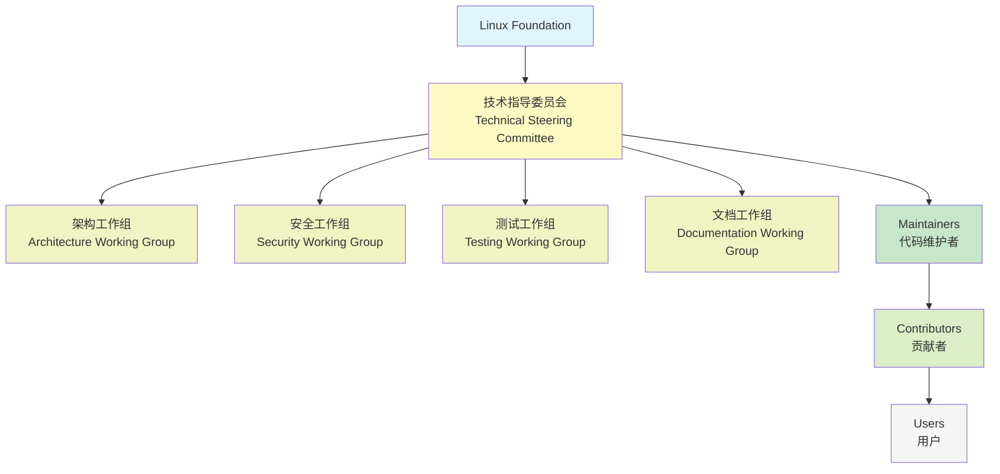
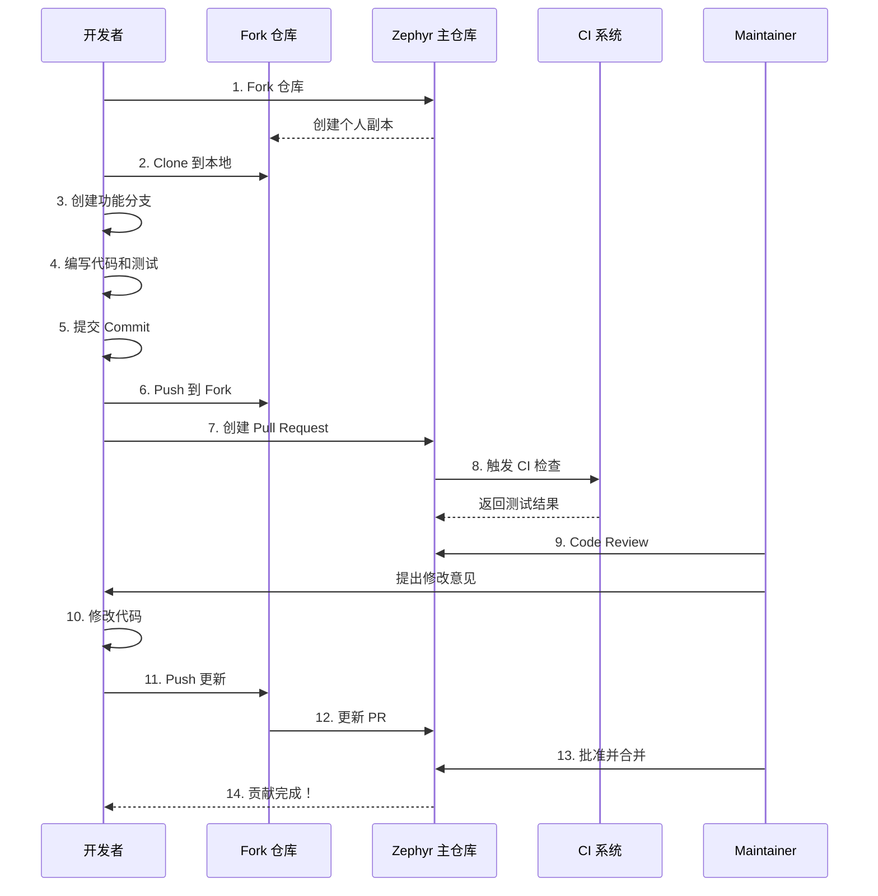

# 社区贡献指南

## 概述

参与开源社区是从技术专家走向技术领袖的必经之路。Zephyr RTOS 作为 Linux Foundation 旗下的重要项目，拥有活跃的全球开发者社区。本章将指导你如何参与 Zephyr 社区，从提交第一个 Issue 到成为 Maintainer，构建你的开源影响力。

!!! success "社区参与的价值"
    - **技术成长**：通过与全球顶尖开发者交流，快速提升技术水平
    - **职业发展**：开源贡献是最好的技术简历，展示你的实力
    - **行业影响力**：参与标准制定，影响技术方向
    - **人脉网络**：结识志同道合的开发者，建立职业人脉
    - **回馈社区**：分享知识，帮助他人，推动技术进步

## Zephyr 社区介绍

### 社区组织结构

Zephyr 项目采用开放治理模式，由 Linux Foundation 托管，社区成员共同决策项目方向。




### 组织角色说明

**Linux Foundation（Linux 基金会）**

- 项目托管方，提供法律、财务和基础设施支持
- 确保项目的中立性和开放性
- 组织年度开发者峰会和技术活动

**Technical Steering Committee（技术指导委员会，TSC）**

- 负责项目的技术方向和重大决策
- 审批架构变更和新特性提案
- 管理发布流程和版本规划
- 成员由社区选举产生，任期 2 年
- 当前成员包括来自 Intel、Nordic、NXP 等公司的技术专家

**Architecture Working Group（架构工作组，AWG）**

- 负责 Zephyr 架构设计和演进
- 审查重大架构变更提案（RFC）
- 制定架构设计指南和最佳实践
- 定期召开会议讨论架构问题

**Security Working Group（安全工作组）**

- 负责安全漏洞响应和修复
- 制定安全编码规范
- 审查安全相关的代码变更
- 发布安全公告和补丁

**Testing Working Group（测试工作组）**

- 负责测试框架和测试用例开发
- 维护 CI/CD 基础设施
- 制定测试标准和覆盖率目标
- 审查测试相关的代码变更

**Documentation Working Group（文档工作组）**

- 负责官方文档的维护和改进
- 审查文档相关的 Pull Request
- 制定文档编写规范
- 组织文档翻译工作

**Maintainers（代码维护者）**

- 负责特定子系统或模块的代码维护
- 审查和合并 Pull Request
- 修复 Bug 和实现新特性
- 指导新贡献者
- 每个子系统都有指定的 Maintainer，列表见 `MAINTAINERS.yml`

**Contributors（贡献者）**

- 提交代码、文档、测试用例
- 报告 Bug 和提出功能建议
- 参与代码审查和技术讨论
- 任何人都可以成为贡献者


### 主要贡献公司和个人

Zephyr 项目得到了众多公司和个人的支持：

**主要贡献公司**：

| 公司 | 贡献领域 | 代表性工作 |
|------|----------|------------|
| Intel | 架构设计、x86 支持 | 内核优化、电源管理 |
| Nordic Semiconductor | BLE、Thread、Zigbee | nRF 系列芯片支持 |
| NXP | ARM Cortex-M 支持 | i.MX RT 系列支持 |
| STMicroelectronics | STM32 系列支持 | 驱动开发、BSP 移植 |
| Espressif | ESP32 系列支持 | Wi-Fi、BLE 集成 |
| Google | 测试框架、CI/CD | Twister 测试系统 |
| Facebook/Meta | 网络协议栈 | LwM2M、CoAP 实现 |

**活跃的个人贡献者**：

- 来自全球 50+ 个国家的开发者
- 累计贡献者超过 1000 人
- 核心贡献者约 100 人
- 中国开发者占比约 10%，且在快速增长

!!! tip "加入中国开发者社区"
    - **微信群**：搜索"Zephyr 中文社区"
    - **QQ 群**：Zephyr RTOS 技术交流
    - **知乎专栏**：Zephyr RTOS 实战
    - **B站**：搜索"Zephyr RTOS"查看视频教程

## 贡献代码流程

### GitHub 工作流程

Zephyr 使用标准的 GitHub Fork + Pull Request 工作流程：




### 详细步骤说明

#### 1. Fork 仓库和创建分支

```bash
# 1. 在 GitHub 上 Fork zephyrproject-rtos/zephyr 仓库

# 2. Clone 你的 Fork 到本地
git clone https://github.com/YOUR_USERNAME/zephyr.git
cd zephyr

# 3. 添加上游仓库
git remote add upstream https://github.com/zephyrproject-rtos/zephyr.git

# 4. 创建功能分支（基于最新的 main 分支）
git fetch upstream
git checkout -b fix-uart-driver upstream/main

# 5. 验证分支
git branch -vv
```

!!! warning "分支命名规范"
    - 使用描述性的分支名：`fix-uart-driver`、`add-spi-support`
    - 避免使用 `patch`、`update` 等模糊名称
    - 一个分支只做一件事，不要混合多个不相关的修改

#### 2. 代码规范

Zephyr 有严格的代码规范，必须遵守：

**命名规范**：

```c
// 函数命名：小写字母 + 下划线
int uart_init(const struct device *dev);

// 宏定义：大写字母 + 下划线
#define UART_BAUDRATE_115200  115200

// 结构体命名：小写字母 + 下划线
struct uart_config {
    uint32_t baudrate;
    uint8_t parity;
};

// 枚举命名：大写字母 + 下划线
enum uart_parity {
    UART_PARITY_NONE,
    UART_PARITY_ODD,
    UART_PARITY_EVEN,
};
```

**格式规范**：

- 使用 Tab 缩进（宽度为 8）
- 每行最多 100 个字符
- 函数左花括号另起一行
- if/for/while 语句必须使用花括号，即使只有一行

```c
// 正确的格式
int uart_configure(const struct device *dev, const struct uart_config *cfg)
{
    if (cfg == NULL) {
        return -EINVAL;
    }

    for (int i = 0; i < UART_COUNT; i++) {
        // 处理逻辑
    }

    return 0;
}
```

**注释规范**：

```c
/**
 * @brief Initialize UART device
 *
 * This function initializes the UART device with default configuration.
 *
 * @param dev Pointer to the device structure
 * @return 0 on success, negative errno code on failure
 */
int uart_init(const struct device *dev);
```

**使用 checkpatch 检查代码**：

```bash
# 检查最近的提交
./scripts/checkpatch.pl --git HEAD~1..HEAD

# 检查特定文件
./scripts/checkpatch.pl -f drivers/serial/uart_mydriver.c
```


#### 3. Commit 消息规范

Commit 消息必须遵循严格的格式：

**基本格式**：

```
<area>: <summary>

<detailed description>

Signed-off-by: Your Name <your.email@example.com>
```

**示例**：

```
drivers: serial: uart_stm32: Fix baudrate calculation

The baudrate calculation was incorrect for high-speed UARTs,
causing communication errors at rates above 115200 bps.

This patch fixes the calculation by using the correct clock
divider formula from the STM32 reference manual.

Fixes #12345

Signed-off-by: Zhang San <zhangsan@example.com>
```

**Commit 消息规则**：

1. **标题行**（必需）：
   - 格式：`<area>: <summary>`
   - area：子系统或模块名称（如 `drivers: serial`、`kernel`、`doc`）
   - summary：简短描述（50 字符以内），使用祈使句
   - 首字母小写，结尾不加句号

2. **空行**（必需）：标题和正文之间必须有空行

3. **正文**（推荐）：
   - 详细描述修改的原因和方法
   - 解释"为什么"而不仅仅是"做了什么"
   - 每行不超过 72 个字符

4. **引用 Issue**（如果适用）：
   - `Fixes #12345`：修复 Issue
   - `Closes #12345`：关闭 Issue
   - `Related to #12345`：相关 Issue

5. **Signed-off-by**（必需）：
   - 表示你同意 Developer Certificate of Origin (DCO)
   - 使用真实姓名和邮箱
   - 使用 `git commit -s` 自动添加

**常见 area 前缀**：

| Area | 说明 | 示例 |
|------|------|------|
| `drivers: serial` | 串口驱动 | `drivers: serial: uart_nrf: Add flow control` |
| `drivers: gpio` | GPIO 驱动 | `drivers: gpio: gpio_stm32: Fix interrupt handling` |
| `kernel` | 内核核心 | `kernel: sched: Optimize thread scheduling` |
| `subsys: bluetooth` | 蓝牙子系统 | `subsys: bluetooth: mesh: Fix provisioning` |
| `boards: arm` | ARM 板级支持 | `boards: arm: nucleo_f401re: Add SPI support` |
| `doc` | 文档 | `doc: getting_started: Update installation guide` |
| `tests` | 测试用例 | `tests: kernel: Add semaphore stress test` |

!!! tip "使用 git commit 模板"
    创建 `.git/commit-template.txt`：
    ```
    <area>: <summary>
    
    <detailed description>
    
    Signed-off-by: Your Name <your.email@example.com>
    ```
    
    配置 git 使用模板：
    ```bash
    git config commit.template .git/commit-template.txt
    ```


#### 4. 提交 Pull Request

**PR 标题**：

- 与 Commit 标题保持一致
- 如果 PR 包含多个 Commit，使用最主要的修改作为标题

**PR 描述**：

使用 GitHub 提供的 PR 模板，包含以下内容：

```markdown
## Description

Brief description of what this PR does.

## Related Issues

Fixes #12345

## Testing

Describe how you tested this change:
- Tested on nRF52840 DK
- Ran `west build -b nrf52840dk_nrf52840 samples/hello_world`
- Verified UART output at 115200 bps

## Checklist

- [x] Code follows Zephyr coding style
- [x] Commit message follows guidelines
- [x] Added/updated tests
- [x] Added/updated documentation
- [x] Signed-off-by added
```

**PR 最佳实践**：

1. **保持 PR 小而专注**：
   - 一个 PR 只做一件事
   - 避免混合多个不相关的修改
   - 大的功能拆分成多个 PR

2. **提供充分的测试信息**：
   - 说明在哪些硬件上测试过
   - 提供测试步骤和预期结果
   - 如果是 Bug 修复，说明如何复现原问题

3. **添加文档**：
   - 新功能必须更新文档
   - API 变更必须更新 API 文档
   - 复杂的修改需要添加示例代码

4. **响应 CI 失败**：
   - PR 提交后会自动运行 CI 测试
   - 如果 CI 失败，及时修复
   - 查看 CI 日志定位问题

#### 5. Code Review 流程

**Review 过程**：

1. **自动检查**：
   - CI 系统自动运行编译和测试
   - checkpatch 检查代码风格
   - 文档构建检查

2. **人工审查**：
   - Maintainer 审查代码逻辑和设计
   - 其他贡献者可以参与审查
   - 通常需要至少 2 个 Approver

3. **修改和更新**：
   - 根据审查意见修改代码
   - 使用 `git commit --amend` 修改最后一个 commit
   - 或者添加新的 commit
   - Push 到 Fork 仓库，PR 会自动更新

**响应审查意见**：

```bash
# 修改代码后，更新 commit
git add .
git commit --amend
git push -f origin fix-uart-driver

# 或者添加新的 commit
git add .
git commit -s -m "drivers: serial: Address review comments"
git push origin fix-uart-driver
```

**审查意见示例**：

```
Reviewer: "This function is too long, consider splitting it."
You: "Good point! I've split it into two functions: uart_configure_baudrate() 
     and uart_configure_parity(). Updated in the latest commit."

Reviewer: "Missing error handling for NULL pointer."
You: "Fixed. Added NULL check at the beginning of the function."

Reviewer: "Please add a test case for this new feature."
You: "Added test case in tests/drivers/uart/uart_api/src/test_uart_configure.c"
```


#### 6. 合并流程

**合并条件**：

- ✅ 所有 CI 检查通过
- ✅ 至少 2 个 Approver 批准
- ✅ 没有未解决的审查意见
- ✅ 代码符合规范
- ✅ 文档和测试完整

**合并方式**：

- Zephyr 使用 Rebase and Merge 策略
- 保持线性的提交历史
- Maintainer 负责合并

**合并后**：

```bash
# 同步上游更新
git fetch upstream
git checkout main
git merge upstream/main

# 删除已合并的分支
git branch -d fix-uart-driver
git push origin --delete fix-uart-driver
```

!!! success "恭喜！"
    你的代码已经合并到 Zephyr 主仓库，成为全球数百万设备的一部分！
    你的名字将永久出现在 Zephyr 的贡献者列表中。

### 完整示例：提交一个 Bug 修复

让我们通过一个完整的例子来演示整个流程：

**场景**：修复 STM32 UART 驱动的波特率计算错误

**步骤 1：准备工作**

```bash
# Fork zephyrproject-rtos/zephyr 到你的 GitHub 账号

# Clone 并设置
git clone https://github.com/YOUR_USERNAME/zephyr.git
cd zephyr
git remote add upstream https://github.com/zephyrproject-rtos/zephyr.git

# 创建分支
git fetch upstream
git checkout -b fix-stm32-uart-baudrate upstream/main
```

**步骤 2：修改代码**

编辑 `drivers/serial/uart_stm32.c`：

```c
// 修复波特率计算
static int uart_stm32_configure(const struct device *dev,
                                 const struct uart_config *cfg)
{
    // ... 其他代码 ...
    
    // 修复：使用正确的时钟分频公式
    // 旧代码（错误）：
    // uint32_t divisor = clock_freq / cfg->baudrate;
    
    // 新代码（正确）：
    uint32_t divisor = (clock_freq + (cfg->baudrate / 2)) / cfg->baudrate;
    
    // ... 其他代码 ...
}
```

**步骤 3：添加测试**

创建或更新测试文件 `tests/drivers/uart/uart_api/src/test_uart_baudrate.c`：

```c
ZTEST(uart_api, test_uart_high_baudrate)
{
    struct uart_config cfg = {
        .baudrate = 921600,
        .parity = UART_CFG_PARITY_NONE,
        .stop_bits = UART_CFG_STOP_BITS_1,
        .data_bits = UART_CFG_DATA_BITS_8,
        .flow_ctrl = UART_CFG_FLOW_CTRL_NONE,
    };
    
    int ret = uart_configure(uart_dev, &cfg);
    zassert_equal(ret, 0, "Failed to configure high baudrate");
    
    // 验证实际波特率在误差范围内
    uint32_t actual_baudrate = uart_get_baudrate(uart_dev);
    uint32_t error = abs(actual_baudrate - cfg.baudrate);
    zassert_true(error < (cfg.baudrate / 100), 
                 "Baudrate error too large: %d", error);
}
```


**步骤 4：更新文档**

更新 `doc/hardware/peripherals/uart.rst`（如果需要）：

```rst
High Baudrate Support
=====================

The UART driver now supports baudrates up to 921600 bps on STM32 devices.
The baudrate calculation has been improved to reduce error at high speeds.

Example:

.. code-block:: c

   struct uart_config cfg = {
       .baudrate = 921600,
       // ... other settings
   };
   uart_configure(dev, &cfg);
```

**步骤 5：提交代码**

```bash
# 检查代码风格
./scripts/checkpatch.pl --git HEAD~1..HEAD

# 提交（使用 -s 自动添加 Signed-off-by）
git add drivers/serial/uart_stm32.c
git add tests/drivers/uart/uart_api/src/test_uart_baudrate.c
git add doc/hardware/peripherals/uart.rst

git commit -s -m "drivers: serial: uart_stm32: Fix baudrate calculation

The baudrate calculation was incorrect for high-speed UARTs,
causing communication errors at rates above 115200 bps.

The issue was that the divisor calculation didn't account for
rounding, leading to significant errors at high baudrates.

This patch fixes the calculation by adding proper rounding:
divisor = (clock_freq + (baudrate / 2)) / baudrate

Tested on STM32F4 and STM32L4 with baudrates from 9600 to 921600.

Fixes #45678"

# Push 到你的 Fork
git push origin fix-stm32-uart-baudrate
```

**步骤 6：创建 Pull Request**

在 GitHub 上创建 PR，填写描述：

```markdown
## Description

Fix baudrate calculation in STM32 UART driver to support high-speed communication.

## Problem

The current baudrate calculation doesn't account for rounding, causing significant 
errors at high baudrates (>115200 bps). This leads to communication failures.

## Solution

Updated the divisor calculation to include proper rounding:
```c
uint32_t divisor = (clock_freq + (baudrate / 2)) / baudrate;
```

## Testing

- Tested on STM32F401RE Nucleo board
- Verified baudrates: 9600, 19200, 38400, 57600, 115200, 230400, 460800, 921600
- Measured actual baudrate error < 1% for all tested rates
- All existing UART tests pass

## Related Issues

Fixes #45678

## Checklist

- [x] Code follows Zephyr coding style (checkpatch passed)
- [x] Commit message follows guidelines
- [x] Added test case for high baudrate
- [x] Updated documentation
- [x] Signed-off-by added
```

**步骤 7：响应审查**

假设收到以下审查意见：

```
Reviewer 1: "Please also test on STM32L4 series."
Reviewer 2: "Consider adding a comment explaining the rounding formula."
```

修改代码并更新：

```bash
# 添加注释
# 编辑 drivers/serial/uart_stm32.c，添加注释

git add drivers/serial/uart_stm32.c
git commit --amend
# 在 commit 消息中添加测试信息

git push -f origin fix-stm32-uart-baudrate
```

在 PR 中回复：

```
@reviewer1 Tested on STM32L476RG Nucleo board, all baudrates work correctly.
@reviewer2 Added comment explaining the rounding formula. Thanks for the suggestion!
```

**步骤 8：合并**

- 等待 CI 通过
- 获得 2 个 Approver 批准
- Maintainer 合并 PR

🎉 **完成！你的第一个贡献已经合并！**


## 社区参与方式

除了贡献代码，还有很多其他方式参与 Zephyr 社区。

### 邮件列表

Zephyr 使用邮件列表进行技术讨论和公告。

**主要邮件列表**：

| 邮件列表 | 用途 | 订阅地址 |
|----------|------|----------|
| devel@lists.zephyrproject.org | 开发讨论 | https://lists.zephyrproject.org/g/devel |
| users@lists.zephyrproject.org | 用户支持 | https://lists.zephyrproject.org/g/users |
| announce@lists.zephyrproject.org | 重要公告 | https://lists.zephyrproject.org/g/announce |

**订阅方法**：

1. 访问订阅地址
2. 点击 "Join This Group"
3. 使用 GitHub 账号或邮箱注册
4. 选择接收方式（每封邮件、每日摘要、仅网页）

**发帖礼仪**：

1. **使用描述性的主题**：
   - ❌ "Help needed"
   - ✅ "STM32 UART driver: How to enable DMA?"

2. **提供足够的上下文**：
   - Zephyr 版本
   - 硬件平台
   - 完整的错误信息
   - 已尝试的解决方法

3. **格式化代码**：
   - 使用代码块或附件
   - 不要粘贴大段代码到邮件正文

4. **及时回复**：
   - 如果问题解决了，回复说明解决方法
   - 帮助后来遇到同样问题的人

**邮件示例**：

```
Subject: STM32F4: UART DMA transmission hangs after 1024 bytes

Hi all,

I'm trying to use DMA for UART transmission on STM32F401RE, but the 
transmission hangs after exactly 1024 bytes.

Environment:
- Zephyr version: 3.5.0
- Board: nucleo_f401re
- Sample: samples/drivers/uart/uart_async_api

Configuration:
CONFIG_UART_ASYNC_API=y
CONFIG_UART_STM32_DMA=y

Error message:
[00:00:10.234,000] <err> uart_stm32: DMA transfer timeout

I've checked the DMA configuration in the device tree and it looks correct.
Has anyone encountered this issue?

Thanks,
Zhang San
```

### GitHub Discussions

GitHub Discussions 是更现代的讨论平台，适合：

- 技术问答
- 功能讨论
- 最佳实践分享
- 展示项目

**访问地址**：https://github.com/zephyrproject-rtos/zephyr/discussions

**讨论分类**：

- **Q&A**：技术问答
- **Ideas**：功能建议和讨论
- **Show and tell**：展示你的项目
- **General**：一般性讨论

!!! tip "提问技巧"
    参考 [How To Ask Questions The Smart Way](http://www.catb.org/~esr/faqs/smart-questions.html)
    
    好的问题特征：
    - 清晰的标题
    - 详细的问题描述
    - 完整的环境信息
    - 已尝试的解决方法
    - 最小可复现示例


### Discord 实时交流

Zephyr 社区在 Discord 上有活跃的实时交流频道。

**加入方法**：

1. 访问 https://chat.zephyrproject.org
2. 使用 GitHub 账号登录
3. 阅读并同意社区行为准则

**主要频道**：

- **#general**：一般性讨论
- **#help**：寻求帮助
- **#development**：开发讨论
- **#bluetooth**：蓝牙相关
- **#networking**：网络协议栈
- **#testing**：测试相关
- **#documentation**：文档相关
- **#chinese**：中文频道

**使用建议**：

- 在合适的频道提问
- 使用代码块格式化代码
- 尊重他人的时间，不要重复提问
- 主动帮助其他人

### 技术会议和活动

**Zephyr Developer Summit**

- 每年一次的全球开发者大会
- 技术演讲、工作坊、社交活动
- 通常在欧洲或北美举办
- 提供远程参与选项

**工作组会议**

- 各工作组定期召开在线会议
- 会议时间和议程在邮件列表公布
- 任何人都可以参加
- 会议记录公开发布

**本地 Meetup**

- 各地区的 Zephyr 用户组织线下聚会
- 中国主要城市（北京、上海、深圳）有定期活动
- 关注微信群和邮件列表获取信息

### Bug 报告

发现 Bug 是贡献的重要方式。

**如何写好 Bug 报告**：

1. **搜索已有 Issue**：
   - 避免重复报告
   - 可以在已有 Issue 上补充信息

2. **使用 Issue 模板**：
   - GitHub 提供了 Bug 报告模板
   - 填写所有必需字段

3. **提供完整信息**：
   - Zephyr 版本（commit hash）
   - 硬件平台和板子
   - 完整的错误信息和日志
   - 最小可复现步骤

4. **附加有用的信息**：
   - 配置文件（prj.conf）
   - 设备树 overlay
   - 相关代码片段
   - 截图或视频

**Bug 报告示例**：

```markdown
**Describe the bug**
UART transmission fails when using DMA on STM32F4 with buffer size > 1024 bytes.

**To Reproduce**
Steps to reproduce the behavior:
1. Build sample: `west build -b nucleo_f401re samples/drivers/uart/uart_async_api`
2. Flash to board: `west flash`
3. Send data > 1024 bytes
4. Transmission hangs

**Expected behavior**
Data should be transmitted completely regardless of buffer size.

**Impact**
Critical - blocks UART DMA usage for large transfers

**Logs and console output**
```
[00:00:10.234,000] <err> uart_stm32: DMA transfer timeout
[00:00:10.235,000] <err> uart_stm32: TX failed: -ETIMEDOUT
```

**Environment**
- Zephyr version: v3.5.0-123-gabcdef123
- Board: nucleo_f401re
- Toolchain: Zephyr SDK 0.16.3

**Additional context**
The issue doesn't occur with buffer sizes <= 1024 bytes.
DMA configuration in device tree looks correct.
```


### 功能建议

有好的想法？通过 RFC（Request for Comments）流程提出。

**RFC 流程**：

1. **在 GitHub Discussions 中讨论**：
   - 在 Ideas 分类下创建讨论
   - 描述功能需求和使用场景
   - 收集社区反馈

2. **编写正式 RFC**：
   - 如果社区反馈积极，编写详细的 RFC 文档
   - RFC 模板：https://github.com/zephyrproject-rtos/zephyr/blob/main/doc/contribute/rfcs/rfc_template.rst

3. **提交 RFC PR**：
   - 将 RFC 文档提交到 `doc/contribute/rfcs/` 目录
   - 在 PR 中讨论技术细节

4. **TSC 审批**：
   - 重大功能需要 TSC 批准
   - 小功能可以直接实现

**RFC 示例主题**：

- 新的驱动 API 设计
- 内核调度器改进
- 新的子系统支持
- 架构变更

## 技术工作组

加入工作组是深度参与社区的好方式。

### 工作组列表

**Architecture Working Group（架构工作组）**

- **职责**：
  - 审查架构变更提案
  - 制定架构设计指南
  - 解决架构相关的技术债务

- **会议**：每两周一次，周三 16:00 UTC

- **如何加入**：
  - 订阅 arch-wg@lists.zephyrproject.org
  - 参加会议
  - 参与 RFC 讨论

**Security Working Group（安全工作组）**

- **职责**：
  - 处理安全漏洞报告
  - 审查安全相关代码
  - 制定安全编码规范

- **会议**：每月一次

- **如何加入**：
  - 订阅 security-wg@lists.zephyrproject.org
  - 需要签署保密协议（处理未公开漏洞）

**Testing Working Group（测试工作组）**

- **职责**：
  - 维护 Twister 测试框架
  - 改进 CI/CD 流程
  - 提高测试覆盖率

- **会议**：每两周一次

- **如何加入**：
  - 订阅 testing-wg@lists.zephyrproject.org
  - 贡献测试用例
  - 改进测试工具

**Documentation Working Group（文档工作组）**

- **职责**：
  - 维护官方文档
  - 审查文档 PR
  - 组织文档翻译

- **会议**：每月一次

- **如何加入**：
  - 订阅 docs-wg@lists.zephyrproject.org
  - 贡献文档改进
  - 参与翻译工作

### 贡献机会

每个工作组都有适合不同技能水平的贡献机会：

**初级贡献**：

- 修复文档错误
- 改进示例代码
- 添加测试用例
- 翻译文档

**中级贡献**：

- 实现新功能
- 优化性能
- 修复复杂 Bug
- 编写技术文档

**高级贡献**：

- 架构设计
- 安全审计
- 性能分析
- 指导新贡献者


## 成为 Maintainer 的路径

Maintainer 是 Zephyr 社区的核心力量，负责特定子系统的维护。

### Maintainer 职责

**代码维护**：

- 审查和合并 Pull Request
- 修复 Bug 和实现新特性
- 维护代码质量和一致性
- 管理子系统的技术债务

**社区支持**：

- 回答用户问题
- 指导新贡献者
- 参与技术讨论
- 代表子系统参加工作组会议

**规划和决策**：

- 制定子系统发展路线图
- 审查架构变更提案
- 参与版本发布规划
- 协调跨子系统的工作

### Maintainer 权限

- 合并 PR 到主仓库
- 管理子系统的 Issue 和 PR
- 参与 TSC 投票（部分 Maintainer）
- 访问 CI/CD 基础设施

### 成为 Maintainer 的步骤

**1. 持续贡献（6-12 个月）**

- 定期提交高质量的 PR
- 参与代码审查
- 帮助其他贡献者
- 展示对子系统的深入理解

**典型贡献路径**：


**2. 建立信任**

- 代码质量始终如一
- 及时响应审查意见
- 遵守社区规范
- 展示技术领导力

**3. 获得提名**

- 现有 Maintainer 提名
- 或自我提名（需要展示贡献记录）
- 提名邮件发送到 devel 邮件列表

**提名邮件示例**：

```
Subject: Maintainer nomination: Zhang San for drivers/serial

Hi all,

I would like to nominate Zhang San as a maintainer for the serial 
drivers subsystem.

Zhang San has been an active contributor for the past 12 months:
- 25+ merged PRs, including major features and bug fixes
- Consistently high-quality code reviews
- Active in helping users on Discord and mailing list
- Deep understanding of UART hardware and driver architecture

Recent contributions:
- Implemented DMA support for STM32 UART (#12345)
- Fixed critical bug in nRF UART driver (#12346)
- Improved UART API documentation (#12347)

I believe Zhang San would be an excellent addition to the maintainer team.

Best regards,
Current Maintainer
```

**4. TSC 审批**

- TSC 审查提名
- 社区讨论（通常 1-2 周）
- TSC 投票决定
- 批准后更新 MAINTAINERS.yml

### Maintainer 最佳实践

**代码审查**：

- 及时审查 PR（目标：48 小时内首次响应）
- 提供建设性的反馈
- 解释"为什么"而不仅仅是"做什么"
- 鼓励新贡献者

**沟通**：

- 保持透明和开放
- 及时回复邮件和 Issue
- 主动分享技术决策的理由
- 尊重不同意见

**技术领导**：

- 制定清晰的技术方向
- 平衡短期需求和长期架构
- 推动技术债务的解决
- 培养新的贡献者

**时间管理**：

- Maintainer 工作通常是志愿的
- 合理分配时间
- 必要时寻求帮助
- 避免过度承诺

!!! quote "Maintainer 的话"
    "成为 Maintainer 不仅是技术能力的认可，更是对社区贡献的认可。
    最重要的是保持热情，持续学习，帮助他人成长。" 
    
    — Zephyr Maintainer


## 实际贡献案例

让我们看几个真实的贡献案例，学习成功的经验。

### 案例 1：修复一个 Bug

**背景**：

- 贡献者：李明（化名），嵌入式工程师，Zephyr 使用 6 个月
- 问题：nRF52840 的 GPIO 中断在高频触发时丢失事件
- 影响：影响按键检测和外部传感器数据采集

**贡献过程**：

**1. 问题发现和复现**

```c
// 测试代码：快速触发 GPIO 中断
void button_test(void)
{
    int count = 0;
    
    // 配置 GPIO 中断
    gpio_pin_interrupt_configure(gpio_dev, BUTTON_PIN, 
                                  GPIO_INT_EDGE_BOTH);
    
    // 快速按压按钮 100 次
    // 预期：count = 200（按下 + 释放）
    // 实际：count = 150-180（丢失事件）
}
```

**2. 问题分析**

- 使用逻辑分析仪捕获 GPIO 信号
- 发现硬件确实产生了所有中断
- 问题在于驱动的中断处理逻辑

**3. 定位根因**

```c
// drivers/gpio/gpio_nrfx.c
// 问题代码：
static void gpio_nrfx_isr(const struct device *dev)
{
    // 读取中断状态
    uint32_t status = nrf_gpio_latch_get();
    
    // 清除中断标志
    nrf_gpio_latch_clear();  // ❌ 太早清除，可能丢失新中断
    
    // 处理中断
    for (int i = 0; i < 32; i++) {
        if (status & BIT(i)) {
            // 调用回调
            fire_callback(dev, i);
        }
    }
}
```

**4. 修复方案**

```c
// 修复后的代码：
static void gpio_nrfx_isr(const struct device *dev)
{
    // 读取中断状态
    uint32_t status = nrf_gpio_latch_get();
    
    // 处理中断
    for (int i = 0; i < 32; i++) {
        if (status & BIT(i)) {
            // 调用回调
            fire_callback(dev, i);
        }
    }
    
    // 处理完成后再清除中断标志
    nrf_gpio_latch_clear();  // ✅ 确保不丢失新中断
}
```

**5. 添加测试**

```c
// tests/drivers/gpio/gpio_api/src/test_gpio_interrupt.c
ZTEST(gpio_api, test_gpio_high_frequency_interrupt)
{
    int count = 0;
    
    // 配置中断
    gpio_pin_interrupt_configure(gpio_dev, TEST_PIN, 
                                  GPIO_INT_EDGE_BOTH);
    
    // 模拟高频中断（使用定时器触发）
    for (int i = 0; i < 100; i++) {
        gpio_emul_trigger(gpio_dev, TEST_PIN);
        k_busy_wait(100);  // 100us 间隔
    }
    
    // 验证所有中断都被处理
    zassert_equal(count, 100, "Missed interrupts: %d", 100 - count);
}
```

**6. 提交 PR**

- Commit 消息遵循规范
- PR 描述清晰，包含问题分析和测试结果
- 响应审查意见，添加更多测试用例
- 2 周后合并

**成果**：

- 修复了影响多个项目的关键 Bug
- 获得社区认可
- 建立了在 GPIO 子系统的专业声誉


### 案例 2：添加新的驱动

**背景**：

- 贡献者：王芳（化名），硬件工程师，Zephyr 使用 1 年
- 目标：为 AHT20 温湿度传感器添加驱动支持
- 动机：项目需要，官方尚未支持

**贡献过程**：

**1. 研究现有驱动**

```bash
# 查看类似的传感器驱动
ls drivers/sensor/
# 参考 SHT3x 驱动（类似的 I2C 温湿度传感器）
```

**2. 实现驱动**

```c
// drivers/sensor/aht20/aht20.c
#define DT_DRV_COMPAT aosong_aht20

struct aht20_data {
    uint16_t temperature;
    uint16_t humidity;
};

struct aht20_config {
    struct i2c_dt_spec i2c;
};

static int aht20_sample_fetch(const struct device *dev,
                               enum sensor_channel chan)
{
    const struct aht20_config *cfg = dev->config;
    struct aht20_data *data = dev->data;
    uint8_t cmd[] = {0xAC, 0x33, 0x00};  // 触发测量命令
    uint8_t buf[7];
    int ret;
    
    // 发送测量命令
    ret = i2c_write_dt(&cfg->i2c, cmd, sizeof(cmd));
    if (ret < 0) {
        return ret;
    }
    
    // 等待测量完成（80ms）
    k_sleep(K_MSEC(80));
    
    // 读取数据
    ret = i2c_read_dt(&cfg->i2c, buf, sizeof(buf));
    if (ret < 0) {
        return ret;
    }
    
    // 解析数据
    uint32_t raw_humidity = ((uint32_t)buf[1] << 12) | 
                            ((uint32_t)buf[2] << 4) | 
                            (buf[3] >> 4);
    uint32_t raw_temp = (((uint32_t)buf[3] & 0x0F) << 16) | 
                        ((uint32_t)buf[4] << 8) | 
                        buf[5];
    
    // 转换为标准单位
    data->humidity = (raw_humidity * 100) / 1048576;
    data->temperature = ((raw_temp * 200) / 1048576) - 50;
    
    return 0;
}

static int aht20_channel_get(const struct device *dev,
                              enum sensor_channel chan,
                              struct sensor_value *val)
{
    struct aht20_data *data = dev->data;
    
    switch (chan) {
    case SENSOR_CHAN_AMBIENT_TEMP:
        val->val1 = data->temperature / 100;
        val->val2 = (data->temperature % 100) * 10000;
        break;
    case SENSOR_CHAN_HUMIDITY:
        val->val1 = data->humidity / 100;
        val->val2 = (data->humidity % 100) * 10000;
        break;
    default:
        return -ENOTSUP;
    }
    
    return 0;
}

static const struct sensor_driver_api aht20_api = {
    .sample_fetch = aht20_sample_fetch,
    .channel_get = aht20_channel_get,
};

static int aht20_init(const struct device *dev)
{
    const struct aht20_config *cfg = dev->config;
    
    if (!device_is_ready(cfg->i2c.bus)) {
        return -ENODEV;
    }
    
    // 软复位
    uint8_t reset_cmd = 0xBA;
    i2c_write_dt(&cfg->i2c, &reset_cmd, 1);
    k_sleep(K_MSEC(20));
    
    return 0;
}

#define AHT20_DEFINE(inst)                                          \
    static struct aht20_data aht20_data_##inst;                     \
    static const struct aht20_config aht20_config_##inst = {        \
        .i2c = I2C_DT_SPEC_INST_GET(inst),                          \
    };                                                              \
    DEVICE_DT_INST_DEFINE(inst, aht20_init, NULL,                   \
                          &aht20_data_##inst, &aht20_config_##inst, \
                          POST_KERNEL, CONFIG_SENSOR_INIT_PRIORITY, \
                          &aht20_api);

DT_INST_FOREACH_STATUS_OKAY(AHT20_DEFINE)
```

**3. 添加设备树绑定**

```yaml
# dts/bindings/sensor/aosong,aht20.yaml
description: AHT20 temperature and humidity sensor

compatible: "aosong,aht20"

include: [sensor-device.yaml, i2c-device.yaml]

properties:
  # 继承 I2C 设备属性
```

**4. 添加 Kconfig**

```kconfig
# drivers/sensor/aht20/Kconfig
config AHT20
    bool "AHT20 temperature and humidity sensor"
    default y
    depends on DT_HAS_AOSONG_AHT20_ENABLED
    depends on I2C
    help
      Enable driver for AHT20 temperature and humidity sensor.
```

**5. 编写测试**

```c
// tests/drivers/sensor/aht20/src/main.c
ZTEST(aht20, test_aht20_read)
{
    const struct device *dev = DEVICE_DT_GET_ONE(aosong_aht20);
    struct sensor_value temp, humidity;
    
    zassert_true(device_is_ready(dev), "Device not ready");
    
    // 读取传感器数据
    int ret = sensor_sample_fetch(dev);
    zassert_equal(ret, 0, "Failed to fetch sample");
    
    ret = sensor_channel_get(dev, SENSOR_CHAN_AMBIENT_TEMP, &temp);
    zassert_equal(ret, 0, "Failed to get temperature");
    
    ret = sensor_channel_get(dev, SENSOR_CHAN_HUMIDITY, &humidity);
    zassert_equal(ret, 0, "Failed to get humidity");
    
    // 验证数据范围合理
    zassert_true(temp.val1 >= -40 && temp.val1 <= 85, 
                 "Temperature out of range");
    zassert_true(humidity.val1 >= 0 && humidity.val1 <= 100, 
                 "Humidity out of range");
}
```

**6. 编写文档**

```rst
.. _aht20:

AHT20: Temperature and Humidity Sensor
#######################################

Overview
********

The AHT20 is a temperature and humidity sensor with I2C interface.

Supported Features
******************

* Temperature measurement (-40°C to +85°C)
* Humidity measurement (0% to 100% RH)
* I2C interface (address 0x38)

Configuration
*************

Device Tree
===========

.. code-block:: devicetree

   &i2c0 {
       aht20@38 {
           compatible = "aosong,aht20";
           reg = <0x38>;
       };
   };

API Usage
*********

.. code-block:: c

   const struct device *dev = DEVICE_DT_GET_ONE(aosong_aht20);
   struct sensor_value temp, humidity;
   
   sensor_sample_fetch(dev);
   sensor_channel_get(dev, SENSOR_CHAN_AMBIENT_TEMP, &temp);
   sensor_channel_get(dev, SENSOR_CHAN_HUMIDITY, &humidity);
   
   printk("Temperature: %d.%d C\n", temp.val1, temp.val2 / 10000);
   printk("Humidity: %d.%d %%\n", humidity.val1, humidity.val2 / 10000);
```

**7. 提交 PR**

- 包含驱动代码、绑定、测试、文档
- PR 描述包含硬件规格和测试结果
- 提供示例应用
- 响应审查，改进代码质量

**成果**：

- 成功合并，成为官方支持的传感器
- 帮助其他开发者快速集成 AHT20
- 在传感器子系统建立专业声誉
- 后续成为传感器子系统的活跃贡献者


### 案例 3：改进文档

**背景**：

- 贡献者：陈华（化名），技术写作爱好者，Zephyr 新手
- 问题：官方文档的入门指南对新手不够友好
- 目标：改进文档，降低学习门槛

**贡献过程**：

**1. 识别问题**

- 自己学习 Zephyr 时遇到困难
- 在社区看到很多新手提类似的问题
- 官方文档缺少详细的故障排除指南

**2. 提出改进建议**

在 GitHub Discussions 发起讨论：

```markdown
Title: Improve Getting Started Guide for Beginners

Hi all,

As a Zephyr beginner, I found the getting started guide could be improved:

1. Missing troubleshooting section for common installation issues
2. No explanation of what each command does
3. Lack of "what to do next" guidance after hello_world

I'd like to contribute improvements. Would this be welcome?

Specific improvements I'm thinking of:
- Add troubleshooting section with common errors
- Add explanations for each command
- Add "next steps" section with learning path

Feedback welcome!
```

**3. 获得社区支持**

- Documentation WG 表示欢迎
- 其他用户分享了他们遇到的问题
- Maintainer 提供了改进建议

**4. 编写改进内容**

```rst
.. _getting_started_troubleshooting:

Troubleshooting
***************

This section covers common issues encountered during installation.

Python Version Issues
=====================

**Symptom:**

.. code-block:: console

   ERROR: Python 3.8 or newer is required

**Solution:**

Zephyr requires Python 3.8 or newer. Check your Python version:

.. code-block:: console

   python3 --version

If your version is older, install a newer Python:

**Ubuntu/Debian:**

.. code-block:: console

   sudo apt install python3.10

**macOS:**

.. code-block:: console

   brew install python@3.10

**Windows:**

Download from https://www.python.org/downloads/

west update Fails
=================

**Symptom:**

.. code-block:: console

   ERROR: Failed to clone repository

**Possible Causes:**

1. **Network issues:** Check your internet connection
2. **Firewall/Proxy:** Configure git proxy if behind corporate firewall
3. **Disk space:** Ensure you have at least 5GB free space

**Solutions:**

For proxy issues:

.. code-block:: console

   git config --global http.proxy http://proxy.example.com:8080

For slow connections, use shallow clone:

.. code-block:: console

   west update --narrow

Compilation Errors
==================

**Symptom:**

.. code-block:: console

   ERROR: Toolchain not found

**Solution:**

Ensure Zephyr SDK is installed and environment is set up:

.. code-block:: console

   # Check SDK installation
   ls $ZEPHYR_SDK_INSTALL_DIR
   
   # Re-run environment setup
   source zephyr/zephyr-env.sh

Next Steps
**********

After successfully running hello_world, here's your learning path:

1. **Explore Basic Samples**
   
   Try the blinky sample to learn GPIO control:
   
   .. code-block:: console
   
      west build -b your_board samples/basic/blinky
      west flash

2. **Learn Project Structure**
   
   Understand how Zephyr projects are organized:
   - CMakeLists.txt: Build configuration
   - prj.conf: Kconfig options
   - src/: Source code

3. **Read Core Documentation**
   
   - :ref:`kernel`: Understand threads, scheduling
   - :ref:`device_model`: Learn device drivers
   - :ref:`devicetree`: Configure hardware

4. **Join the Community**
   
   - Subscribe to mailing list
   - Join Discord chat
   - Ask questions on GitHub Discussions
```

**5. 添加图表**

```rst
Learning Path
=============

.. mermaid::

   graph LR
       A[Install Zephyr] --> B[Hello World]
       B --> C[Basic Samples]
       C --> D[Learn Concepts]
       D --> E[Build Projects]
       E --> F[Contribute Back]
       
       style A fill:#e1f5ff
       style B fill:#b3e5fc
       style C fill:#81d4fa
       style D fill:#4fc3f7
       style E fill:#29b6f6
       style F fill:#03a9f4
```

**6. 提交 PR**

- PR 标题：`doc: getting_started: Add troubleshooting and next steps`
- 详细说明改进内容和动机
- 请求 Documentation WG 审查

**7. 响应审查**

```
Reviewer: "Great improvements! Can you also add a section about board selection?"
Response: "Good idea! Added a 'Choosing Your Board' section with comparison table."

Reviewer: "Some commands are outdated for Windows."
Response: "Fixed. Tested all commands on Windows 11."
```

**成果**：

- 文档改进被合并
- 帮助数百名新用户更顺利地入门
- 建立了在文档领域的贡献记录
- 后续继续改进其他文档章节
- 6 个月后被邀请加入 Documentation WG


### 案例 4：参与 RFC 讨论

**背景**：

- 贡献者：刘强（化名），系统架构师，Zephyr 使用 2 年
- 场景：社区提出新的电源管理 API 设计
- 目标：基于实际项目经验提供反馈

**贡献过程**：

**1. 阅读 RFC**

RFC 提案：重新设计设备电源管理 API

```rst
RFC: Device Power Management API Redesign
==========================================

Problem Statement
-----------------

Current device PM API has several limitations:
1. No support for partial power states
2. Difficult to coordinate multiple devices
3. Lack of power budget management

Proposed Solution
-----------------

New API design:

.. code-block:: c

   // New power state enum
   enum pm_device_state {
       PM_DEVICE_STATE_ACTIVE,
       PM_DEVICE_STATE_IDLE,
       PM_DEVICE_STATE_STANDBY,
       PM_DEVICE_STATE_SUSPEND,
       PM_DEVICE_STATE_OFF,
   };
   
   // New API
   int pm_device_state_set(const struct device *dev,
                           enum pm_device_state state);
   int pm_device_state_get(const struct device *dev,
                           enum pm_device_state *state);
```

**2. 基于实际经验提供反馈**

在 RFC PR 中评论：

```markdown
Thanks for this RFC! I've been working on a battery-powered IoT device 
and have some feedback based on real-world usage:

## Positive Aspects

1. The new state enum is much clearer than the old API
2. Separating IDLE and STANDBY states is very useful

## Concerns

### 1. Missing Transition Time Information

In our project, we need to know how long it takes to transition between 
states to make optimal power decisions. For example:

- ACTIVE → STANDBY: 10ms
- STANDBY → ACTIVE: 50ms

If we're only idle for 30ms, it's not worth going to STANDBY.

**Suggestion:** Add transition time query API:

```c
int pm_device_transition_time_get(const struct device *dev,
                                   enum pm_device_state from,
                                   enum pm_device_state to,
                                   uint32_t *time_us);
```

### 2. Power Consumption Information

We also need to know the power consumption of each state to calculate 
battery life. Current API doesn't provide this.

**Suggestion:** Add power consumption query:

```c
int pm_device_power_get(const struct device *dev,
                        enum pm_device_state state,
                        uint32_t *power_uw);  // microwatts
```

### 3. Dependency Management

In our system, some devices depend on others (e.g., sensor depends on I2C bus).
The API should handle dependencies automatically.

**Suggestion:** Add dependency declaration in device tree:

```devicetree
sensor@48 {
    compatible = "vendor,sensor";
    pm-dependencies = <&i2c0>;
};
```

## Real-World Example

Here's how we currently handle power management (pseudocode):

```c
// Calculate if it's worth entering low power mode
uint32_t idle_time = predict_idle_time();
uint32_t transition_time = get_transition_time(ACTIVE, STANDBY);
uint32_t active_power = get_power_consumption(ACTIVE);
uint32_t standby_power = get_power_consumption(STANDBY);

// Only enter standby if we save energy
if (idle_time > transition_time * 2) {
    uint32_t energy_saved = (active_power - standby_power) * idle_time;
    uint32_t energy_cost = active_power * transition_time * 2;
    
    if (energy_saved > energy_cost) {
        pm_device_state_set(dev, PM_DEVICE_STATE_STANDBY);
    }
}
```

This logic should be built into the PM subsystem, not reimplemented by 
every application.

## Conclusion

The RFC is a good start, but needs additional APIs for:
1. Transition time queries
2. Power consumption queries  
3. Automatic dependency management

I'm happy to help implement these features if the community agrees.
```

**3. 参与讨论**

其他开发者回应：

```
Developer A: "Great points! We have similar needs in our wearable device."

Developer B: "Transition time is critical. We should definitely add this."

RFC Author: "Thanks for the detailed feedback! I'll update the RFC to 
include transition time and power consumption APIs."

Maintainer: "Dependency management is complex. Let's discuss this in the 
next Architecture WG meeting."
```

**4. 协助改进 RFC**

- 参加 Architecture WG 会议讨论细节
- 提供设备树绑定的具体设计
- 编写示例代码展示 API 使用

**5. 实现部分功能**

RFC 批准后，主动实现部分功能：

```c
// 实现过渡时间查询 API
int pm_device_transition_time_get(const struct device *dev,
                                   enum pm_device_state from,
                                   enum pm_device_state to,
                                   uint32_t *time_us)
{
    const struct pm_device_data *pm_data = dev->pm;
    
    if (!pm_data || !pm_data->transition_times) {
        return -ENOTSUP;
    }
    
    *time_us = pm_data->transition_times[from][to];
    return 0;
}
```

**成果**：

- RFC 采纳了大部分建议
- 新 API 更加实用和完善
- 建立了在电源管理领域的专业声誉
- 后续成为电源管理子系统的活跃贡献者
- 1 年后成为电源管理子系统的 Co-Maintainer

!!! tip "参与 RFC 的价值"
    - 影响 Zephyr 的技术方向
    - 确保 API 设计符合实际需求
    - 建立技术领导力
    - 与顶尖开发者交流学习


## 实操任务

通过实际行动开始你的社区贡献之旅。

### 任务 1：在 GitHub 上提交一个 Issue

**目标**：学习如何正确报告问题

**步骤**：

1. **寻找问题**：
   - 在使用 Zephyr 过程中遇到的 Bug
   - 文档中的错误或不清楚的地方
   - 缺失的功能或改进建议

2. **搜索已有 Issue**：
   ```
   在 GitHub 搜索框输入关键词
   检查是否已有人报告相同问题
   ```

3. **创建 Issue**：
   - 访问 https://github.com/zephyrproject-rtos/zephyr/issues/new/choose
   - 选择合适的 Issue 模板（Bug Report / Feature Request）
   - 填写所有必需字段

4. **提供完整信息**：
   - Zephyr 版本（commit hash）
   - 硬件平台
   - 完整的错误信息
   - 最小可复现步骤
   - 配置文件

5. **跟进 Issue**：
   - 及时回复维护者的问题
   - 提供额外的信息
   - 测试建议的解决方案

**评估标准**：

- ✅ Issue 描述清晰完整
- ✅ 提供了足够的复现信息
- ✅ 及时响应维护者的询问
- ✅ Issue 得到确认或解决

### 任务 2：修复一个 Good First Issue 并提交 PR

**目标**：完成第一个代码贡献

**步骤**：

1. **寻找 Good First Issue**：
   - 访问 https://github.com/zephyrproject-rtos/zephyr/labels/good%20first%20issue
   - 选择一个你感兴趣且能力范围内的 Issue
   - 在 Issue 中评论表示你想处理这个问题

2. **设置开发环境**：
   ```bash
   # Fork 仓库
   # Clone 到本地
   git clone https://github.com/YOUR_USERNAME/zephyr.git
   cd zephyr
   git remote add upstream https://github.com/zephyrproject-rtos/zephyr.git
   
   # 创建分支
   git checkout -b fix-issue-12345 upstream/main
   ```

3. **修复问题**：
   - 理解问题的根本原因
   - 编写修复代码
   - 添加或更新测试
   - 运行 checkpatch 检查代码风格

4. **提交代码**：
   ```bash
   git add .
   git commit -s -m "area: Fix issue description
   
   Detailed explanation of the fix.
   
   Fixes #12345"
   
   git push origin fix-issue-12345
   ```

5. **创建 Pull Request**：
   - 在 GitHub 上创建 PR
   - 填写 PR 模板
   - 等待 CI 检查通过

6. **响应审查**：
   - 及时回复审查意见
   - 修改代码并更新 PR
   - 保持耐心和礼貌

**评估标准**：

- ✅ 代码符合 Zephyr 编码规范
- ✅ 包含适当的测试
- ✅ Commit 消息符合规范
- ✅ 及时响应审查意见
- ✅ PR 最终被合并

### 任务 3：参与一次社区讨论或会议

**目标**：融入社区，建立联系

**选项 A：参与邮件列表讨论**

1. 订阅 devel@lists.zephyrproject.org
2. 阅读最近的讨论主题
3. 选择一个你有见解的话题
4. 撰写有价值的回复
5. 参与后续讨论

**选项 B：参加工作组会议**

1. 选择一个感兴趣的工作组
2. 订阅工作组邮件列表
3. 查看会议时间和议程
4. 参加在线会议（通常使用 Zoom）
5. 在会议中提问或分享观点

**选项 C：在 Discord 上帮助他人**

1. 加入 Zephyr Discord 服务器
2. 在 #help 频道浏览问题
3. 选择你能回答的问题
4. 提供详细和有帮助的回答
5. 持续参与社区互动

**评估标准**：

- ✅ 积极参与讨论
- ✅ 提供有价值的见解
- ✅ 尊重他人观点
- ✅ 建立社区联系

!!! success "完成任务后"
    恭喜你迈出了社区贡献的第一步！
    
    继续保持：
    - 定期贡献代码或文档
    - 参与社区讨论
    - 帮助其他开发者
    - 分享你的经验
    
    你正在成为 Zephyr 社区的重要一员！


## 学习总结

完成本章学习后，你应该掌握：

**社区理解**：

- ✅ 了解 Zephyr 社区的组织结构和运作方式
- ✅ 认识各个工作组的职责和参与方式
- ✅ 理解开源协作的价值和意义

**贡献技能**：

- ✅ 掌握 GitHub Fork + PR 工作流程
- ✅ 遵守代码规范和 Commit 消息规范
- ✅ 能够编写高质量的 Bug 报告和功能建议
- ✅ 理解 Code Review 流程和最佳实践

**社区参与**：

- ✅ 知道如何使用邮件列表、Discord、GitHub Discussions
- ✅ 能够参与技术讨论和 RFC 评审
- ✅ 了解如何加入工作组和参加会议

**职业发展**：

- ✅ 理解从贡献者到 Maintainer 的成长路径
- ✅ 建立开源贡献的个人品牌
- ✅ 通过社区贡献提升技术影响力

## 进阶资源

**官方资源**：

- [Zephyr 贡献指南](https://docs.zephyrproject.org/latest/contribute/index.html)
- [代码规范](https://docs.zephyrproject.org/latest/contribute/coding_guidelines/index.html)
- [Commit 消息规范](https://docs.zephyrproject.org/latest/contribute/guidelines.html#commit-guidelines)
- [MAINTAINERS.yml](https://github.com/zephyrproject-rtos/zephyr/blob/main/MAINTAINERS.yml)

**社区链接**：

- [GitHub 仓库](https://github.com/zephyrproject-rtos/zephyr)
- [邮件列表](https://lists.zephyrproject.org/)
- [Discord 服务器](https://chat.zephyrproject.org)
- [开发者峰会](https://www.zephyrproject.org/developer-summit/)

**学习资源**：

- [How To Ask Questions The Smart Way](http://www.catb.org/~esr/faqs/smart-questions.html)
- [GitHub Flow](https://guides.github.com/introduction/flow/)
- [Conventional Commits](https://www.conventionalcommits.org/)
- [Code Review Best Practices](https://google.github.io/eng-practices/review/)

**中文社区**：

- 微信公众号：Zephyr RTOS 中文社区
- 知乎专栏：Zephyr RTOS 实战
- B站：搜索"Zephyr RTOS"
- GitHub：zephyr-chinese-community

## 下一步

完成社区贡献学习后，建议：

1. **持续贡献**：
   - 每月至少提交 1 个 PR
   - 参与代码审查
   - 帮助新贡献者

2. **深入专业领域**：
   - 选择一个子系统深入研究
   - 成为该领域的专家
   - 争取成为 Maintainer

3. **技术布道**：
   - 撰写技术博客
   - 制作视频教程
   - 在技术会议上演讲
   - 参考下一章：[技术布道](technical-evangelism.md)

4. **建立影响力**：
   - 在社区中建立声誉
   - 参与技术决策
   - 指导新人成长
   - 推动技术创新

!!! quote "开源精神"
    "开源不仅是代码的共享，更是知识、经验和智慧的传承。
    每一个贡献，无论大小，都在推动技术进步，让世界变得更好。"
    
    — Linus Torvalds

---

**恭喜你完成第四阶段的社区贡献学习！**

你已经掌握了参与开源社区的核心技能，现在是时候将知识转化为行动，成为 Zephyr 社区的活跃贡献者。记住，最好的学习方式就是实践和分享。开始你的贡献之旅吧！

