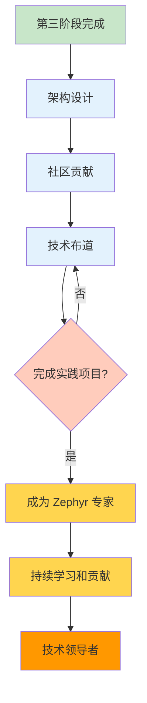

# 第四阶段：专业精通期

!!! success "阶段目标"
    通过本阶段的学习，您将能够：
    
    - **架构设计能力**：能够设计复杂的嵌入式系统架构，包括智能家居、工业物联网、可穿戴设备等
    - **社区贡献能力**：熟悉 Zephyr 社区的运作方式，能够为社区贡献高质量的代码和文档
    - **技术布道能力**：能够通过技术分享、博客写作、视频教程等方式传播 Zephyr 技术
    - **团队建设能力**：能够在团队中推广 Zephyr 技术，建立技术培训体系和知识库

## 学习内容

| 序号 | 主题 | 核心内容 | 预计时间 |
|------|------|----------|----------|
| 1 | [架构设计](architecture-design.md) | 行业解决方案、高可靠系统、异构多核系统、架构评审 | 3-5 天 |
| 2 | [社区贡献](community-contribution.md) | 社区组织、贡献流程、Code Review、成为 Maintainer | 2-3 天 |
| 3 | [技术布道](technical-evangelism.md) | 技术分享、博客写作、视频制作、团队建设 | 2-3 天 |

**总计预计时间：1-2 周**

## 实践项目

!!! example "专家级项目清单"
    完成以下项目，展示您的专业能力：
    
    ### 项目 1：行业解决方案设计 ✓
    - 选择一个行业场景（智能家居、工业物联网、可穿戴设备）
    - 设计完整的系统架构（硬件选型、软件架构、通信协议）
    - 编写详细的设计文档（架构图、接口定义、数据流）
    - 实现核心功能的原型验证
    - 进行架构评审并输出评审报告
    
    ### 项目 2：开源贡献 ✓
    - 为 Zephyr 社区贡献至少 3 个 Pull Request
    - 贡献类型可以是：Bug 修复、新功能、驱动支持、文档改进
    - 参与 Code Review，为其他贡献者提供反馈
    - 在社区讨论中积极参与技术讨论
    
    ### 项目 3：技术内容创作 ✓
    - 撰写至少 3 篇 Zephyr 技术博客并发布
    - 准备一次技术分享（PPT + Demo），时长 30-60 分钟
    - 制作一个 Zephyr 入门视频教程（可选）
    - 为团队建立 Zephyr 技术知识库
    
    ### 项目 4：团队技术建设 ✓
    - 在团队中推广 Zephyr 技术
    - 组织技术培训，培养至少 3 名 Zephyr 开发者
    - 建立团队的 Zephyr 开发规范和最佳实践
    - 搭建团队的 CI/CD 流程和测试体系

## 能力提升指南

!!! tip "架构设计能力"
    **如何提升**：
    - 学习经典的系统架构设计模式
    - 分析开源项目的架构设计
    - 参与实际项目的架构设计和评审
    - 阅读架构设计相关的书籍和论文
    
    **推荐资源**：
    - 《嵌入式系统架构设计》
    - 《物联网系统设计》
    - Zephyr 官方示例项目
    - 行业白皮书和技术报告

!!! tip "社区贡献能力"
    **如何提升**：
    - 从小的贡献开始（文档、测试、Bug 修复）
    - 学习 Zephyr 的代码规范和提交规范
    - 积极参与社区讨论，建立人脉
    - 持续贡献，建立信任和影响力
    
    **推荐资源**：
    - [Zephyr 贡献指南](https://docs.zephyrproject.org/latest/contribute/)
    - [Zephyr 代码规范](https://docs.zephyrproject.org/latest/contribute/coding_guidelines/)
    - Zephyr 邮件列表和 Discord 频道
    - GitHub 上的 Good First Issue

!!! tip "技术布道能力"
    **如何提升**：
    - 从写技术笔记开始，逐步发展为博客文章
    - 参加技术分享会，锻炼演讲能力
    - 学习优秀技术博主的写作风格
    - 收集反馈，持续改进内容质量
    
    **推荐资源**：
    - 《技术写作指南》
    - 《演讲的力量》
    - 优秀技术博客（如掘金、CSDN）
    - 技术会议和 Meetup

## 学习进度检查

完成本阶段学习后，您应该能够：

- [ ] 独立设计复杂的嵌入式系统架构
- [ ] 为 Zephyr 社区贡献高质量的代码和文档
- [ ] 通过技术分享和内容创作传播 Zephyr 技术
- [ ] 在团队中推广 Zephyr 技术，建立技术培训体系
- [ ] 具备技术领导力和影响力
- [ ] 成为 Zephyr 领域的专家

## 学习路径

## 学习建议

!!! tip "系统思维"
    - 从全局视角看待技术问题
    - 理解业务需求和技术实现的平衡
    - 关注系统的可扩展性、可维护性、可靠性
    - 培养架构设计和技术决策能力

!!! tip "开放协作"
    - 积极参与开源社区，贡献代码和文档
    - 与其他开发者交流，学习不同的视角
    - 分享自己的经验和知识
    - 建立技术影响力和个人品牌

!!! tip "持续学习"
    - 技术发展日新月异，保持学习的热情
    - 关注 Zephyr 的最新发展和技术趋势
    - 学习相关领域的知识（物联网、边缘计算、AI）
    - 培养终身学习的习惯

!!! tip "知识传播"
    - 通过技术分享帮助他人成长
    - 写作是最好的学习方式
    - 建立个人技术品牌
    - 为社区和行业做出贡献

## 职业发展方向

完成本阶段学习后，您已经成为 Zephyr 领域的专家。您可以选择以下职业发展方向：

### 方向 1：技术专家
继续深耕技术领域，成为 Zephyr 或嵌入式系统的顶级专家，为行业提供技术咨询和解决方案。

### 方向 2：技术管理
转向技术管理岗位，带领团队进行技术创新和产品开发，培养更多的技术人才。

### 方向 3：技术创业
基于 Zephyr 技术创业，开发创新的物联网产品或提供技术服务。

### 方向 4：开源领袖
成为 Zephyr 社区的核心贡献者或 Maintainer，推动开源项目的发展。

## 成为 Zephyr 专家的标志

!!! success "专家标志"
    当您达到以下标准时，您就是一名真正的 Zephyr 专家：
    
    - ✅ 能够独立设计和实现复杂的嵌入式系统
    - ✅ 为 Zephyr 社区贡献了多个被合并的 Pull Request
    - ✅ 在技术社区有一定的影响力和知名度
    - ✅ 能够指导和培养其他 Zephyr 开发者
    - ✅ 对 Zephyr 的发展方向有自己的见解
    - ✅ 持续学习和分享，保持技术热情

## 下一步

恭喜您完成了 Zephyr RTOS 学习系统的全部四个阶段！您已经从入门者成长为 Zephyr 专家。

接下来，您可以：

- **持续贡献**：继续为 Zephyr 社区贡献代码和文档
- **深入研究**：选择感兴趣的领域深入研究
- **分享经验**：通过博客、视频、演讲分享您的经验
- **培养新人**：帮助更多人学习和使用 Zephyr
- **推动创新**：将 Zephyr 应用到新的领域和场景

    <a href="../learning-principles/" class="md-button md-button--primary">
        查看学习黄金法则 →
    </a>

---

!!! quote "寄语"
    技术的学习永无止境，但掌握了正确的方法和建立了良好的习惯，您就能够持续成长。
    
    希望这个学习系统能够帮助您成为优秀的 Zephyr 开发者，也希望您能够将所学回馈给社区，帮助更多的人。
    
    **让我们一起推动 Zephyr 技术的发展，为物联网和嵌入式系统的创新贡献力量！**

!!! question "需要帮助？"
    如果您有任何问题或建议，欢迎：
    
    - 在 [GitHub Issues](https://github.com/your-repo/issues) 提出
    - 在 [GitHub Discussions](https://github.com/your-repo/discussions) 讨论
    - 加入 Zephyr 中文社区交流群
    - 参与 Zephyr 官方社区活动
