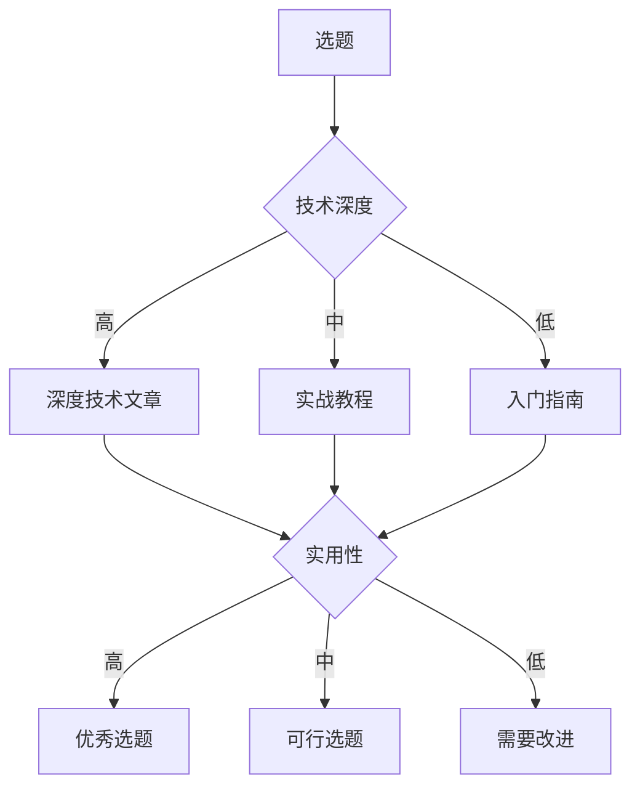
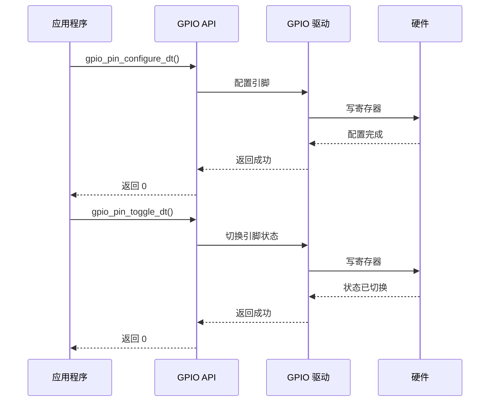
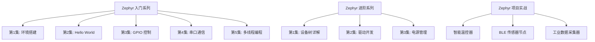
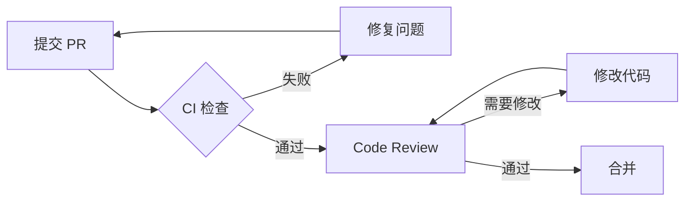

# 技术布道与影响力建设

## 概述

技术布道（Technical Evangelism）是指通过技术分享、文档编写、社区建设等方式，传播技术知识、推广技术方案、建立个人技术品牌的过程。作为一名专业的嵌入式系统工程师，掌握技术布道能力不仅能够帮助他人成长，也能提升自己的技术影响力和职业发展空间。

本章节将系统介绍技术布道的各个方面，包括技术演讲、博客写作、视频教程制作、技术文档编写、团队技术建设、开源项目维护和个人品牌建设。通过学习这些内容，你将能够：

- 准备和进行高质量的技术演讲
- 撰写清晰、实用的技术博客
- 制作专业的视频教程
- 编写规范的技术文档
- 建设团队技术文化
- 维护和运营开源项目
- 打造个人技术品牌

!!! tip "为什么要学习技术布道"
    - **帮助他人成长**：分享知识，降低学习门槛
    - **深化自己理解**：教是最好的学，通过分享加深理解
    - **建立技术影响力**：在技术社区中建立声誉
    - **拓展职业机会**：技术影响力带来更多职业发展机会
    - **推动技术发展**：促进技术交流和创新

## 技术演讲

技术演讲是技术布道最直接、最有影响力的方式之一。一场成功的技术演讲能够快速传播知识，激发听众兴趣，建立个人影响力。

### 演讲准备

#### 选题策略

选择合适的演讲主题是成功的第一步：

**选题原则**：
1. **自己熟悉**：选择自己深入研究过的技术领域
2. **听众需要**：了解目标听众的技术背景和需求
3. **有实践经验**：最好有实际项目经验支撑
4. **有独特见解**：提供新的视角或解决方案
5. **时效性**：关注当前热点和趋势

**Zephyr 相关选题示例**：
- 入门级：《Zephyr RTOS 快速入门：从 Hello World 到实际应用》
- 进阶级：《Zephyr 设备树深度解析：从原理到实践》
- 高级：《基于 Zephyr 的低功耗物联网系统设计》
- 案例分享：《使用 Zephyr 开发智能家居网关的实践经验》


#### 演讲大纲设计

一个清晰的演讲大纲是演讲成功的关键：

**经典演讲结构**：


**开场（5-10%）**：
- 自我介绍：姓名、背景、为什么有资格讲这个话题
- 吸引注意：有趣的故事、惊人的数据、引人思考的问题
- 明确目标：听众将学到什么、解决什么问题

**背景介绍（10-15%）**：
- 问题背景：为什么需要这个技术
- 现有方案：目前的解决方案及其局限性
- 引出主题：你的方案如何解决这些问题

**核心内容（60-70%）**：
- 分点讲解：3-5 个核心要点
- 逻辑清晰：从简单到复杂，从理论到实践
- 实例支撑：代码示例、架构图、Demo 演示
- 互动环节：提问、投票、现场演示

**总结回顾（5-10%）**：
- 要点回顾：重申核心内容
- 行动建议：听众下一步可以做什么
- 资源分享：提供学习资源和联系方式

**Q&A（10-15%）**：
- 预留充足时间
- 准备常见问题
- 坦诚回答，不懂就说不懂

#### PPT 设计原则

**视觉设计**：
- **简洁为王**：每页 PPT 只表达一个核心观点
- **大字体**：标题 40-60pt，正文 24-32pt
- **少文字**：每页不超过 6 行，每行不超过 6 个词
- **多图表**：用图表、流程图、架构图代替文字
- **统一风格**：使用一致的配色、字体、布局

**内容组织**：
- **标题明确**：每页标题清楚表达核心观点
- **逻辑清晰**：页面之间有明确的逻辑关系
- **重点突出**：使用颜色、大小、动画突出重点
- **代码可读**：代码字体足够大，语法高亮，关键部分标注

**常用工具**：
- **PowerPoint**：功能全面，兼容性好
- **Keynote**：Mac 平台，动画效果出色
- **Reveal.js**：基于 Web，支持 Markdown，适合技术演讲
- **Google Slides**：在线协作，跨平台


### 演讲技巧

#### 开场技巧

**破冰方法**：
1. **讲故事**：分享一个相关的个人经历或案例
2. **提问题**：向听众提出引人思考的问题
3. **展示数据**：用惊人的统计数据吸引注意
4. **幽默开场**：适当的幽默能拉近距离（但要谨慎）
5. **直入主题**：对于技术听众，直接切入核心也很有效

**示例开场**：
> "大家好，我是张三。三年前，我第一次接触 Zephyr RTOS 时，花了整整一周时间才搭建好开发环境。今天，我将用 30 分钟告诉你如何在 30 分钟内完成这个过程。"

#### 演讲节奏控制

**时间分配**：
- 提前规划每部分的时间
- 在 PPT 中标注时间节点
- 预留 10-15% 的缓冲时间
- 使用计时器或手表监控时间

**语速控制**：
- 正常语速：每分钟 120-150 字
- 技术演讲：适当放慢，每分钟 100-120 字
- 重点内容：更慢，给听众思考时间
- 过渡内容：可以稍快

**停顿的艺术**：
- 在关键观点后停顿 2-3 秒
- 在提问后停顿，等待听众思考
- 在切换主题时停顿，给听众缓冲

#### 互动技巧

**提问互动**：
- **开放式问题**："你们在开发中遇到过哪些问题？"
- **选择式问题**："有多少人用过 FreeRTOS？请举手"
- **引导式问题**："如果要优化功耗，你会从哪里入手？"

**现场演示**：
- **提前准备**：多次彩排，确保 Demo 可靠
- **备份方案**：准备录屏视频作为备份
- **讲解清晰**：边演示边讲解，不要只操作不说话
- **处理失败**：如果 Demo 失败，保持冷静，切换到备份方案

**肢体语言**：
- **眼神交流**：与不同区域的听众进行眼神交流
- **手势辅助**：用手势强调重点，但不要过度
- **移动走位**：适当移动，但不要来回踱步
- **面向听众**：不要一直面对屏幕


### Demo 准备

#### Demo 设计原则

**KISS 原则（Keep It Simple and Stupid）**：
- Demo 要简单明了，一眼就能看懂
- 专注于展示核心功能，不要炫技
- 避免复杂的配置和依赖

**可靠性第一**：
- 在多台设备上测试
- 准备备用硬件
- 录制备份视频
- 准备降级方案（如果 Demo 失败，如何继续）

**可见性**：
- 使用大字体和高对比度
- 放大终端窗口
- 使用屏幕录制工具突出鼠标和按键
- 准备清晰的硬件展示（摄像头或实物投影）

#### Demo 检查清单

**硬件准备**：
- [ ] 开发板已充电或连接电源
- [ ] USB 线缆连接稳定
- [ ] 调试器工作正常
- [ ] LED、传感器等外设功能正常
- [ ] 备用硬件已准备

**软件准备**：
- [ ] 代码已编译通过
- [ ] 固件已烧录并测试
- [ ] 开发环境已配置
- [ ] 终端字体和颜色已优化
- [ ] 不必要的窗口已关闭

**网络准备**：
- [ ] 如需网络，准备移动热点作为备份
- [ ] 提前下载所需资源，不要现场下载
- [ ] 测试网络连接稳定性

**备份方案**：
- [ ] 录制完整 Demo 视频
- [ ] 准备关键步骤的截图
- [ ] 准备文字版操作步骤

### Q&A 处理

#### 常见问题准备

**技术问题**：
- 列出可能被问到的技术问题
- 准备简洁明了的答案
- 准备相关资料链接

**示例问题（Zephyr 演讲）**：
- Q: Zephyr 和 FreeRTOS 相比有什么优势？
- Q: Zephyr 的学习曲线陡峭吗？
- Q: Zephyr 支持哪些开发板？
- Q: 如何为新硬件移植 Zephyr？
- Q: Zephyr 的社区活跃度如何？

#### 回答技巧

**不懂就说不懂**：
- 坦诚承认不了解
- 承诺会后查找资料并回复
- 请教现场专家

**避免争论**：
- 尊重不同观点
- 不要与听众争论
- 如果问题偏离主题，建议会后单独讨论

**控制时间**：
- 简洁回答，不要展开太多
- 如果问题复杂，建议会后详细讨论
- 给更多人提问机会


### 完整示例：Zephyr 技术分享准备

#### 演讲主题

**标题**：《Zephyr RTOS 设备树实战：从入门到精通》

**目标听众**：有一定嵌入式开发经验，了解基本的 RTOS 概念，希望深入学习 Zephyr 设备树的工程师

**演讲时长**：45 分钟（内容 35 分钟 + Q&A 10 分钟）

#### 演讲大纲

**1. 开场（3 分钟）**
- 自我介绍：嵌入式工程师，3 年 Zephyr 开发经验
- 引入问题："你是否曾经因为设备树配置错误而调试了一整天？"
- 演讲目标：理解设备树原理，掌握实战技巧，避免常见陷阱

**2. 背景介绍（5 分钟）**
- 什么是设备树：硬件描述语言
- 为什么需要设备树：硬件抽象、配置灵活
- Zephyr 中的设备树：与 Linux 的异同

**3. 核心内容（25 分钟）**

*3.1 设备树基础（8 分钟）*
- DTS 语法：节点、属性、标签
- 设备树编译流程
- 设备树宏：DT_ALIAS()、DT_NODELABEL()
- 代码示例：简单的 LED 设备树

*3.2 实战技巧（10 分钟）*
- 如何为 I2C 传感器编写设备树
- Overlay 机制：板级适配
- 设备树绑定：YAML 文件
- Demo：现场编写并测试设备树配置

*3.3 调试与避坑（7 分钟）*
- 常见错误：节点未定义、属性类型错误
- 调试方法：查看生成的 zephyr.dts
- 避坑指南：5 个最常见的错误

**4. 总结（2 分钟）**
- 要点回顾：语法、实战、调试
- 行动建议：动手实践、阅读官方文档
- 资源分享：文档链接、示例代码

**5. Q&A（10 分钟）**

#### PPT 设计

**封面页**：
- 标题：Zephyr RTOS 设备树实战
- 副标题：从入门到精通
- 讲师信息和日期

**内容页示例**：

```
第 10 页：设备树节点定义

┌─────────────────────────────────────┐
│ 设备树节点定义                        │
│                                     │
│ / {                                 │
│     leds {                          │
│         compatible = "gpio-leds";   │
│         led0: led_0 {               │
│             gpios = <&gpio0 13 0>;  │
│             label = "Green LED";    │
│         };                          │
│     };                              │
│ };                                  │
│                                     │
│ 关键点：                             │
│ • compatible 属性指定设备类型        │
│ • label 用于引用节点                │
│ • gpios 属性定义 GPIO 引脚          │
└─────────────────────────────────────┘
```

#### Demo 准备

**Demo 1：LED 设备树配置**
- 展示如何在设备树中定义 LED
- 编译并烧录到开发板
- 运行示例程序，LED 闪烁

**Demo 2：I2C 传感器设备树**
- 展示如何为 I2C 传感器编写设备树
- 使用 overlay 机制适配不同板子
- 读取传感器数据并显示

**备份方案**：
- 录制两个 Demo 的完整视频
- 准备关键步骤的截图
- 准备代码文件，可以直接展示

#### 预期问题和答案

**Q1: 设备树和 Kconfig 有什么区别？**
A: 设备树描述硬件（"有什么硬件"），Kconfig 配置软件功能（"启用什么功能"）。设备树是硬件抽象层，Kconfig 是功能开关。

**Q2: 如何调试设备树配置错误？**
A: 三个步骤：1) 查看编译错误信息，2) 检查生成的 build/zephyr/zephyr.dts，3) 使用 DT_PROP() 宏打印属性值。

**Q3: Overlay 文件的优先级是怎样的？**
A: 优先级从低到高：SoC DTS < 板级 DTS < 应用 Overlay。后面的配置会覆盖前面的。

!!! success "演讲准备检查清单"
    - [ ] 演讲大纲已完成并经过审阅
    - [ ] PPT 已制作完成，字体大小合适
    - [ ] Demo 已在多台设备上测试成功
    - [ ] 备份视频已录制
    - [ ] 常见问题答案已准备
    - [ ] 演讲已彩排至少 2 次
    - [ ] 时间控制在目标范围内
    - [ ] 硬件设备已充电并测试
    - [ ] 资料链接已整理并可分享


## 博客写作

技术博客是技术布道的重要方式，它能够系统地记录技术知识，帮助更多人学习，同时也是建立个人技术品牌的有效途径。

### 选题策略

#### 选题方向

**问题解决型**：
- 记录你遇到的问题和解决方案
- 这类文章最受欢迎，因为很多人会遇到相同问题
- 示例：《解决 Zephyr west update 失败的 5 种方法》

**技术深度型**：
- 深入分析某个技术点的原理和实现
- 适合建立技术权威性
- 示例：《Zephyr 调度器源码深度解析》

**实战教程型**：
- 手把手教读者完成某个项目
- 适合初学者，传播范围广
- 示例：《使用 Zephyr 开发智能温控器：从零到一》

**技术对比型**：
- 对比不同技术方案的优劣
- 帮助读者做技术选型
- 示例：《Zephyr vs FreeRTOS：物联网 RTOS 选型指南》

**经验总结型**：
- 总结项目经验和最佳实践
- 具有很高的参考价值
- 示例：《Zephyr 低功耗设计的 10 个最佳实践》

#### 选题原则

**技术深度 vs 实用性平衡**：



**好选题的特征**：
- 有明确的目标读者
- 解决实际问题
- 有独特见解或新颖角度
- 可以提供可操作的建议
- 有代码示例或实际案例

### 文章结构

#### 经典结构

**标题（Title）**：
- 简洁明了，包含关键词
- 吸引眼球，但不要标题党
- 长度控制在 10-20 个字

**引言（Introduction）**：
- 提出问题或背景
- 说明文章将解决什么问题
- 吸引读者继续阅读
- 长度：100-200 字

**正文（Body）**：
- 分段落、分小节
- 使用小标题组织内容
- 逻辑清晰，循序渐进
- 配合代码示例和图表
- 长度：根据主题而定，通常 1000-3000 字

**总结（Conclusion）**：
- 回顾核心要点
- 提供行动建议
- 引导读者互动（评论、分享）
- 长度：100-200 字

**参考资料（References）**：
- 列出引用的资料
- 提供延伸阅读链接


### 写作技巧

#### 清晰表达

**使用简单句**：
- 避免长句和复杂从句
- 一句话表达一个观点
- 技术文章不是文学创作

**术语解释**：
- 第一次出现的术语要解释
- 使用括号或脚注说明
- 示例："设备树（Device Tree，DT）是一种..."

**逻辑连接**：
- 使用过渡词连接段落
- 常用过渡词：首先、其次、然后、因此、但是、例如
- 保持论述的连贯性

#### 代码示例

**完整性**：
- 提供完整的、可运行的代码
- 包含必要的头文件和依赖
- 说明运行环境和前提条件

**可读性**：
- 使用语法高亮
- 添加注释说明关键部分
- 代码格式规范，缩进一致

**示例代码模板**：

```c
/**
 * @file main.c
 * @brief Zephyr LED 闪烁示例
 * 
 * 本示例演示如何使用 Zephyr GPIO API 控制 LED 闪烁
 * 
 * 硬件要求：
 * - nRF52840 DK 或兼容开发板
 * - LED 连接到 GPIO
 * 
 * 编译命令：
 * west build -b nrf52840dk_nrf52840
 */

#include <zephyr/kernel.h>
#include <zephyr/drivers/gpio.h>

/* LED 设备树定义 */
#define LED0_NODE DT_ALIAS(led0)
static const struct gpio_dt_spec led = GPIO_DT_SPEC_GET(LED0_NODE, gpios);

void main(void)
{
    int ret;
    
    /* 检查 LED 设备是否就绪 */
    if (!device_is_ready(led.port)) {
        printk("Error: LED device not ready\n");
        return;
    }
    
    /* 配置 LED 引脚为输出 */
    ret = gpio_pin_configure_dt(&led, GPIO_OUTPUT_ACTIVE);
    if (ret < 0) {
        printk("Error: Failed to configure LED pin\n");
        return;
    }
    
    /* 主循环：LED 闪烁 */
    while (1) {
        gpio_pin_toggle_dt(&led);  // 切换 LED 状态
        k_msleep(1000);             // 延时 1 秒
    }
}
```

**代码说明要点**：
- 文件头注释说明用途
- 硬件要求和编译命令
- 关键代码行添加注释
- 错误处理代码

#### 图表使用

**何时使用图表**：
- 架构设计：系统架构图
- 流程说明：流程图、时序图
- 数据对比：表格、柱状图
- 概念解释：示意图、思维导图

**图表工具**：
- **Mermaid**：代码生成图表，适合技术博客
- **Draw.io**：在线绘图工具，功能强大
- **PlantUML**：文本生成 UML 图
- **Excalidraw**：手绘风格图表

**图表示例（Mermaid）**：




### SEO 优化

#### 标题优化

**包含关键词**：
- 在标题中包含核心关键词
- 示例：《Zephyr RTOS 入门教程》而不是《我的 RTOS 学习笔记》

**长度控制**：
- 标题长度 10-20 个字
- 搜索引擎显示的标题长度有限

**吸引点击**：
- 使用数字：《Zephyr 开发的 10 个技巧》
- 使用疑问：《如何快速上手 Zephyr？》
- 使用行动词：《掌握 Zephyr 设备树配置》

#### 关键词策略

**关键词选择**：
- 主关键词：文章核心主题（如"Zephyr RTOS"）
- 长尾关键词：更具体的搜索词（如"Zephyr 设备树配置教程"）
- 相关关键词：相关技术词汇（如"嵌入式开发"、"物联网"）

**关键词布局**：
- 标题中出现主关键词
- 第一段出现主关键词
- 小标题中出现相关关键词
- 正文中自然分布关键词（不要堆砌）
- 图片 alt 属性包含关键词

#### 内部链接

**链接策略**：
- 链接到自己的其他相关文章
- 建立文章之间的关联
- 提高网站整体权重

**示例**：
> 关于 Zephyr 的环境搭建，可以参考我之前的文章《Zephyr 开发环境搭建详解》。

#### 外部链接

**权威来源**：
- 链接到官方文档
- 链接到知名技术网站
- 提高文章可信度

**示例**：
> 更多关于设备树的信息，请参考 [Zephyr 官方文档](https://docs.zephyrproject.org/latest/build/dts/index.html)。

### 发布平台

#### 个人博客

**优势**：
- 完全自主控制
- 无广告干扰
- 可以自定义域名和样式
- 数据归自己所有

**常用平台**：
- **GitHub Pages + Jekyll/Hugo**：免费，适合技术人员
- **WordPress**：功能强大，插件丰富
- **Hexo**：轻量级，适合静态博客
- **Ghost**：专注写作，界面简洁

**建议**：
- 使用自定义域名（提升专业度）
- 配置 HTTPS（安全性和 SEO）
- 优化加载速度
- 添加评论系统（Disqus、Utterances）

#### 技术社区

**国内平台**：
- **掘金**：技术氛围好，推荐算法优秀
- **CSDN**：用户基数大，流量高
- **博客园**：老牌技术社区
- **知乎**：问答形式，适合深度内容
- **思否（SegmentFault）**：问答+博客

**国际平台**：
- **Medium**：界面简洁，国际化
- **Dev.to**：开发者社区
- **Hashnode**：技术博客平台

**多平台发布策略**：
1. 在个人博客首发（建立原创性）
2. 同步到技术社区（扩大传播）
3. 在文章中注明原文链接
4. 根据平台特点调整格式


### 完整示例：Zephyr 技术博客写作

#### 文章标题

《Zephyr RTOS 低功耗设计实战：让你的物联网设备续航翻倍》

#### 文章大纲

**1. 引言（200 字）**
- 问题：物联网设备功耗高，续航短
- 数据：普通设计 vs 优化设计的功耗对比
- 承诺：本文将介绍 5 个实用的低功耗设计技巧

**2. 背景知识（300 字）**
- Zephyr 电源管理架构
- 功耗测量方法
- 功耗优化的基本原则

**3. 核心内容（1500 字）**

*技巧 1：使用睡眠模式（300 字）*
- 睡眠模式介绍
- 代码示例
- 功耗对比数据

*技巧 2：优化外设使用（300 字）*
- 不用时关闭外设
- 代码示例
- 功耗对比数据

*技巧 3：降低时钟频率（300 字）*
- 动态调频原理
- 代码示例
- 性能 vs 功耗权衡

*技巧 4：优化任务调度（300 字）*
- 减少上下文切换
- 合并任务
- 代码示例

*技巧 5：使用 DMA（300 字）*
- DMA 的功耗优势
- 代码示例
- 适用场景

**4. 实战案例（500 字）**
- 完整的低功耗温度监测器项目
- 优化前后功耗对比
- 完整代码和配置

**5. 总结（200 字）**
- 5 个技巧回顾
- 功耗优化的一般原则
- 行动建议：从哪里开始

**6. 参考资料**
- Zephyr 官方文档链接
- 相关文章链接

#### 文章正文示例

```markdown
# Zephyr RTOS 低功耗设计实战：让你的物联网设备续航翻倍

## 引言

你是否曾经为物联网设备的续航时间而烦恼？一个普通的温度传感器节点，使用两节 AA 电池，可能只能工作几周。但通过合理的低功耗设计，同样的硬件可以工作数月甚至数年。

根据我的实际测试，一个未优化的 Zephyr 应用平均功耗可能在 10mA 左右，而经过优化后可以降低到 10μA 以下——功耗降低了 1000 倍！这意味着续航时间可以从几周延长到几年。

本文将分享 5 个实用的 Zephyr 低功耗设计技巧，每个技巧都配有代码示例和实测数据。无论你是初学者还是有经验的开发者，都能从中获得启发。

## 背景知识

### Zephyr 电源管理架构

Zephyr 提供了完整的电源管理框架，支持多种睡眠模式：

- **Active**：CPU 和所有外设都在运行
- **Idle**：CPU 空闲，外设运行
- **Standby**：CPU 和大部分外设关闭，保持 RAM
- **Suspend**：深度睡眠，只保留必要的唤醒电路


### 功耗测量方法

在优化之前，我们需要能够准确测量功耗：

1. **使用万用表**：串联在电源回路中测量电流
2. **使用功耗分析仪**：如 Nordic PPK2、Joulescope
3. **使用示波器**：观察电流波形

## 技巧 1：使用睡眠模式

### 原理

当 CPU 没有任务需要执行时，让它进入睡眠模式可以大幅降低功耗。Zephyr 的调度器会自动在空闲时进入睡眠。

### 代码示例

```c
#include <zephyr/kernel.h>
#include <zephyr/pm/pm.h>

void main(void)
{
    /* 启用电源管理 */
    pm_policy_state_lock_get(PM_STATE_SUSPEND_TO_IDLE, PM_ALL_SUBSTATES);
    
    while (1) {
        /* 执行任务 */
        do_work();
        
        /* 睡眠 10 秒 */
        k_msleep(10000);
        
        /* CPU 会自动进入睡眠模式 */
    }
}
```

### 配置

在 `prj.conf` 中启用电源管理：

```ini
CONFIG_PM=y
CONFIG_PM_DEVICE=y
```

### 功耗对比

| 模式 | 平均功耗 | 续航时间（2000mAh 电池） |
|------|----------|-------------------------|
| 未优化 | 10mA | 8.3 天 |
| 使用睡眠 | 50μA | 4.6 年 |

**功耗降低：200 倍**

## 技巧 2：优化外设使用

### 原理

外设（如 UART、SPI、I2C）在不使用时也会消耗功耗。通过设备电源管理 API，可以在不需要时关闭外设。

### 代码示例

```c
#include <zephyr/pm/device.h>

const struct device *uart = DEVICE_DT_GET(DT_NODELABEL(uart0));

void send_data(const char *data)
{
    /* 唤醒 UART */
    pm_device_action_run(uart, PM_DEVICE_ACTION_RESUME);
    
    /* 发送数据 */
    uart_poll_out(uart, data, strlen(data));
    
    /* 关闭 UART */
    pm_device_action_run(uart, PM_DEVICE_ACTION_SUSPEND);
}
```

### 功耗对比

| 外设状态 | 功耗增加 |
|----------|----------|
| UART 开启 | +2mA |
| SPI 开启 | +1.5mA |
| I2C 开启 | +0.5mA |

**建议**：只在需要时开启外设，用完立即关闭。

## 实战案例：低功耗温度监测器

### 项目需求

- 每 10 分钟读取一次温度
- 通过 BLE 上报数据
- 使用纽扣电池（CR2032，220mAh）
- 目标续航：1 年以上

### 优化策略

1. 大部分时间处于深度睡眠
2. 定时唤醒读取传感器
3. 读取后立即关闭传感器
4. BLE 使用低功耗广播

### 完整代码

```c
#include <zephyr/kernel.h>
#include <zephyr/pm/pm.h>
#include <zephyr/drivers/sensor.h>

#define SAMPLE_INTERVAL_MS (10 * 60 * 1000)  // 10 分钟

const struct device *temp_sensor = DEVICE_DT_GET(DT_NODELABEL(temp0));

void main(void)
{
    struct sensor_value temp;
    
    /* 配置电源管理 */
    pm_policy_state_lock_get(PM_STATE_SUSPEND_TO_IDLE, PM_ALL_SUBSTATES);
    
    while (1) {
        /* 唤醒传感器 */
        pm_device_action_run(temp_sensor, PM_DEVICE_ACTION_RESUME);
        
        /* 读取温度 */
        sensor_sample_fetch(temp_sensor);
        sensor_channel_get(temp_sensor, SENSOR_CHAN_AMBIENT_TEMP, &temp);
        
        /* 关闭传感器 */
        pm_device_action_run(temp_sensor, PM_DEVICE_ACTION_SUSPEND);
        
        /* 上报数据（BLE 广播） */
        ble_advertise_temperature(temp.val1);
        
        /* 睡眠 10 分钟 */
        k_msleep(SAMPLE_INTERVAL_MS);
    }
}
```

### 功耗测试结果

| 阶段 | 持续时间 | 平均功耗 |
|------|----------|----------|
| 深度睡眠 | 599 秒 | 5μA |
| 唤醒+读取 | 0.5 秒 | 10mA |
| BLE 广播 | 0.5 秒 | 15mA |

**平均功耗计算**：
```
平均功耗 = (5μA × 599s + 10mA × 0.5s + 15mA × 0.5s) / 600s
        ≈ 25μA
```

**续航时间**：
```
续航 = 220mAh / 0.025mA = 8800 小时 ≈ 1 年
```

**目标达成！** ✅

## 总结

通过本文介绍的 5 个技巧，我们可以将 Zephyr 应用的功耗从 10mA 降低到 10μA 以下，续航时间提升 1000 倍。

**核心要点回顾**：
1. 使用睡眠模式：空闲时让 CPU 休眠
2. 优化外设使用：不用时关闭外设
3. 降低时钟频率：根据需求动态调整
4. 优化任务调度：减少上下文切换
5. 使用 DMA：减少 CPU 参与

**行动建议**：
- 从测量当前功耗开始
- 逐个应用优化技巧
- 每次优化后测量效果
- 根据实际需求权衡性能和功耗

**下一步**：
- 阅读 [Zephyr 电源管理文档](https://docs.zephyrproject.org/latest/services/pm/index.html)
- 尝试在你的项目中应用这些技巧
- 分享你的优化经验

## 参考资料

- [Zephyr Power Management](https://docs.zephyrproject.org/latest/services/pm/index.html)
- [Nordic Power Profiler Kit II](https://www.nordicsemi.com/Products/Development-hardware/Power-Profiler-Kit-2)
- [低功耗设计最佳实践](https://example.com/low-power-best-practices)

---

**关于作者**：张三，嵌入式系统工程师，专注于物联网和低功耗设计。欢迎在评论区交流讨论！

**原文链接**：https://myblog.com/zephyr-low-power-design
```

!!! success "博客写作检查清单"
    - [ ] 标题包含关键词且吸引人
    - [ ] 引言清楚说明文章价值
    - [ ] 结构清晰，使用小标题
    - [ ] 代码示例完整且可运行
    - [ ] 配图清晰，有助于理解
    - [ ] 总结回顾核心要点
    - [ ] 提供参考资料和延伸阅读
    - [ ] 检查拼写和语法错误
    - [ ] SEO 优化（关键词、链接）
    - [ ] 在多个平台发布


## 视频教程制作

视频教程是技术传播的重要形式，相比文字更直观、更容易理解，特别适合演示操作流程和实际效果。

### 视频规划

#### 系列规划

**系列化优势**：
- 系统性强，覆盖完整知识体系
- 提高观众粘性，建立订阅关系
- 便于推广和传播

**Zephyr 视频系列示例**：



#### 单集时长

**时长建议**：
- **短视频（5-10 分钟）**：适合单一知识点、快速教程
- **中等视频（15-30 分钟）**：适合完整教程、项目演示
- **长视频（30-60 分钟）**：适合深度讲解、完整项目

**时长控制原则**：
- 内容紧凑，不拖沓
- 可以分集，不要强行压缩
- 考虑观众注意力持续时间
- 提供时间戳，方便跳转

### 录制工具

#### 屏幕录制软件

**OBS Studio**（推荐）：
- 免费开源
- 功能强大，支持多场景切换
- 支持多平台（Windows、macOS、Linux）
- 可以同时录制屏幕和摄像头

**配置建议**：
- 分辨率：1920x1080（1080p）
- 帧率：30fps（流畅度足够）
- 编码：H.264
- 比特率：5000-8000 kbps

**Camtasia**：
- 商业软件，功能全面
- 录制和编辑一体化
- 适合初学者
- 价格较高

**其他选择**：
- **ScreenFlow**（macOS）：专业级录屏软件
- **Bandicam**（Windows）：轻量级，性能好
- **QuickTime**（macOS）：系统自带，简单易用

#### 音频设备

**麦克风选择**：
- **USB 麦克风**：方便，音质好（推荐 Blue Yeti、Audio-Technica AT2020）
- **领夹麦克风**：适合移动录制
- **耳机麦克风**：入门选择，但音质一般

**录音技巧**：
- 选择安静的环境
- 使用防喷罩减少爆破音
- 调整麦克风距离（15-20cm）
- 录制前测试音量


### 录制技巧

#### 声音处理

**语速控制**：
- 正常语速：每分钟 120-150 字
- 技术教程：适当放慢，每分钟 100-120 字
- 重点内容：更慢，给观众思考时间

**语调变化**：
- 避免单调，适当变化语调
- 重点内容提高音量或放慢语速
- 使用停顿强调关键点

**口头禅处理**：
- 录制前准备好脚本或大纲
- 避免"嗯"、"啊"、"那个"等口头禅
- 可以在后期剪辑时删除

#### 画面处理

**屏幕布局**：
- 关闭不必要的窗口和通知
- 使用大字体（终端至少 16pt）
- 高对比度配色方案
- 隐藏个人信息（邮箱、用户名等）

**鼠标和按键显示**：
- 使用鼠标高亮工具（如 PointerFocus）
- 显示按键操作（如 KeyCastr、Carnac）
- 放慢鼠标移动速度

**代码演示**：
- 使用代码编辑器的演示模式
- 逐行讲解，不要跳过
- 使用代码折叠隐藏无关代码
- 高亮关键代码行

#### 节奏控制

**录制节奏**：
- 不要一次录完，分段录制
- 每段 5-10 分钟，便于重录
- 录制前深呼吸，放松心情
- 出错不要慌，停顿后重新开始

**内容节奏**：
- 开头快速进入主题
- 核心内容详细讲解
- 适当重复重点内容
- 结尾简洁总结

### 后期制作

#### 剪辑

**基本剪辑**：
- 删除错误和停顿
- 删除无关内容
- 调整音量平衡
- 添加转场效果（不要过度）

**剪辑软件**：
- **DaVinci Resolve**：免费，专业级
- **Adobe Premiere Pro**：行业标准，功能强大
- **Final Cut Pro**（macOS）：专业级，易用
- **剪映**：简单易用，适合初学者

#### 字幕

**字幕的重要性**：
- 提高可访问性（听力障碍、非母语观众）
- 提高理解度（技术术语、代码）
- 提高完播率（可以静音观看）
- 提高 SEO（字幕可被搜索引擎索引）

**字幕制作**：
- **自动生成**：使用 YouTube 自动字幕，然后修正
- **手动制作**：使用 Aegisub、Subtitle Edit
- **外包服务**：淘宝、Fiverr 等平台

**字幕规范**：
- 字体大小适中，易读
- 位置固定，不遮挡重要内容
- 颜色对比度高
- 技术术语保持英文或中英对照

#### 封面设计

**封面要素**：
- 清晰的标题
- 吸引眼球的图片
- 统一的品牌风格
- 集数标识（如果是系列）

**设计工具**：
- **Canva**：在线设计，模板丰富
- **Figma**：专业设计工具
- **Photoshop**：功能强大，学习曲线陡

**封面尺寸**：
- YouTube：1280x720（16:9）
- B站：1146x717（16:10）


### 发布平台

#### B站（Bilibili）

**优势**：
- 国内最大的技术视频平台
- 用户活跃度高
- 弹幕文化，互动性强
- 技术区流量大

**发布建议**：
- 选择合适的分区（科技 > 计算机技术）
- 标题包含关键词
- 标签选择准确（Zephyr、RTOS、嵌入式）
- 简介详细，包含资源链接
- 定期更新，保持活跃

**视频嵌入示例**：

在文档中嵌入 B站视频：

```html
<!-- B站视频嵌入 -->
<iframe src="//player.bilibili.com/player.html?bvid=BV1xx411c7mD&page=1" 
        scrolling="no" 
        border="0" 
        frameborder="no" 
        framespacing="0" 
        allowfullscreen="true"
        width="100%" 
        height="500">
</iframe>
```

!!! tip "获取 B站嵌入代码"
    1. 打开视频页面
    2. 点击分享按钮
    3. 选择"嵌入代码"
    4. 复制代码并粘贴到 Markdown 文件中

#### YouTube

**优势**：
- 全球最大的视频平台
- 国际化，覆盖面广
- SEO 友好
- 广告收益

**发布建议**：
- 英文标题和描述（或中英双语）
- 详细的视频描述
- 添加时间戳（章节）
- 创建播放列表
- 使用 YouTube Studio 分析数据

**视频嵌入示例**：

在文档中嵌入 YouTube 视频：

```html
<!-- YouTube 视频嵌入 -->
<iframe width="100%" 
        height="500" 
        src="https://www.youtube.com/embed/VIDEO_ID" 
        title="YouTube video player" 
        frameborder="0" 
        allow="accelerometer; autoplay; clipboard-write; encrypted-media; gyroscope; picture-in-picture" 
        allowfullscreen>
</iframe>
```

!!! tip "获取 YouTube 嵌入代码"
    1. 打开视频页面
    2. 点击"分享"按钮
    3. 选择"嵌入"
    4. 复制嵌入代码
    5. 将 `VIDEO_ID` 替换为实际的视频 ID

#### 其他平台

- **抖音/快手**：短视频，适合知识点讲解
- **知乎视频**：适合深度内容
- **腾讯视频/爱奇艺**：流量大，但技术内容较少

### 完整示例：制作 Zephyr 入门视频

#### 视频主题

**标题**：《Zephyr RTOS 入门教程 #1：环境搭建与 Hello World》

**时长**：15 分钟

**目标观众**：有一定嵌入式开发经验，想学习 Zephyr 的工程师

#### 视频大纲

**开场（1 分钟）**：
- 自我介绍
- 系列介绍：这是 Zephyr 入门系列的第一集
- 本集内容：环境搭建和第一个程序

**环境搭建（8 分钟）**：
- 系统要求说明
- 安装依赖工具（演示）
- 安装 west 工具（演示）
- 初始化 Zephyr 工作区（演示）
- 安装 Zephyr SDK（演示）
- 验证安装（演示）

**Hello World（5 分钟）**：
- 创建项目目录
- 编写 main.c
- 编写 CMakeLists.txt 和 prj.conf
- 编译项目（演示）
- 在 QEMU 中运行（演示）
- 在真实硬件上运行（演示）

**总结（1 分钟）**：
- 回顾本集内容
- 预告下一集：GPIO 控制
- 资源链接和联系方式

#### 录制脚本

```
[开场画面：标题 + 背景音乐]

大家好，我是张三，欢迎来到 Zephyr RTOS 入门教程系列。

[切换到摄像头画面]

这是本系列的第一集，我们将一起搭建 Zephyr 开发环境，
并运行第一个 Hello World 程序。

[切换到屏幕录制]

首先，让我们看看系统要求...

[显示系统要求列表]

Zephyr 支持 Windows、Linux 和 macOS。
今天我使用的是 Ubuntu 22.04。

[开始演示安装过程]

第一步，安装依赖工具。打开终端，输入以下命令...

[逐步演示每个安装步骤]

...

[演示编译和运行]

现在，让我们编译这个项目。输入 west build...

[显示编译输出]

编译成功！让我们在 QEMU 中运行它...

[显示运行结果]

太好了！我们看到了 "Hello World" 的输出。

[切换到硬件演示]

接下来，让我们在真实硬件上运行。我这里使用的是 nRF52840 DK...

[演示烧录和运行]

完美！硬件上也成功运行了。

[切换到总结画面]

今天我们完成了 Zephyr 环境搭建，并成功运行了第一个程序。
下一集，我们将学习如何使用 GPIO 控制 LED。

[显示资源链接]

相关资源链接我放在了视频描述中，包括：
- Zephyr 官方文档
- 本集代码
- 我的博客

感谢观看，我们下期再见！

[结束画面：订阅提示]
```

#### 后期制作清单

- [ ] 剪辑删除错误和停顿
- [ ] 调整音量，消除噪音
- [ ] 添加片头片尾
- [ ] 添加字幕
- [ ] 添加关键步骤的文字说明
- [ ] 设计封面
- [ ] 准备视频描述和标签
- [ ] 导出视频（1080p，H.264）

#### 发布信息

**标题**：
- B站：《Zephyr RTOS 入门教程 #1：环境搭建与 Hello World》
- YouTube：《Zephyr RTOS Tutorial #1: Setup and Hello World》

**描述**：
```
本视频是 Zephyr RTOS 入门教程系列的第一集，将手把手教你搭建 Zephyr 开发环境，并运行第一个 Hello World 程序。

⏱️ 时间戳：
00:00 开场介绍
01:00 系统要求
02:00 安装依赖工具
05:00 安装 west 和 Zephyr SDK
08:00 验证安装
09:00 创建 Hello World 项目
12:00 编译和运行
14:00 总结和预告

📚 相关资源：
- Zephyr 官方文档：https://docs.zephyrproject.org
- 本集代码：https://github.com/xxx/zephyr-tutorial-01
- 我的博客：https://myblog.com

🔔 订阅频道，不错过后续教程！

#Zephyr #RTOS #嵌入式 #物联网
```

**标签**：
- Zephyr
- RTOS
- 嵌入式开发
- 物联网
- 教程

!!! success "视频制作检查清单"
    - [ ] 视频大纲已完成
    - [ ] 录制脚本已准备
    - [ ] 录制环境已优化（安静、光线好）
    - [ ] 录制设备已测试（麦克风、摄像头）
    - [ ] 屏幕布局已优化（大字体、高对比度）
    - [ ] 视频已录制完成
    - [ ] 后期剪辑已完成
    - [ ] 字幕已添加
    - [ ] 封面已设计
    - [ ] 视频描述和标签已准备
    - [ ] 已在多个平台发布


## 技术文档编写

技术文档是技术传播的基础，好的文档能够大大降低学习门槛，提高技术的可用性。

### 文档类型

#### 教程（Tutorial）

**特点**：
- 面向初学者
- 手把手教学
- 循序渐进
- 包含完整示例

**适用场景**：
- 入门指南
- 快速开始
- 基础概念讲解

**示例**：《Zephyr RTOS 快速入门教程》

#### 参考文档（Reference）

**特点**：
- 面向有经验的用户
- 详细的 API 说明
- 参数和返回值说明
- 简洁准确

**适用场景**：
- API 文档
- 配置选项说明
- 命令行工具手册

**示例**：《Zephyr GPIO API 参考手册》

#### 操作指南（How-to Guide）

**特点**：
- 面向特定任务
- 解决具体问题
- 步骤清晰
- 可操作性强

**适用场景**：
- 问题解决
- 最佳实践
- 配置指南

**示例**：《如何为 Zephyr 添加新的开发板支持》

#### 解释性文档（Explanation）

**特点**：
- 深入讲解原理
- 提供背景知识
- 帮助理解设计决策
- 理论性强

**适用场景**：
- 架构设计说明
- 原理解析
- 设计理念

**示例**：《Zephyr 设备树设计原理》

### 文档结构

#### 标准文档结构

```markdown
# 文档标题

## 概述
- 简要说明文档内容
- 目标读者
- 前置知识要求

## 快速开始（可选）
- 最简单的使用示例
- 让读者快速上手

## 详细内容
### 主题 1
- 详细说明
- 代码示例
- 注意事项

### 主题 2
- 详细说明
- 代码示例
- 注意事项

## 常见问题
- Q&A 列表

## 参考资料
- 相关文档链接
- 外部资源

## 更新日志（可选）
- 文档版本历史
```

#### 章节组织原则

**逻辑清晰**：
- 从简单到复杂
- 从概念到实践
- 从通用到特殊

**层级分明**：
- 使用标题层级（H1-H6）
- 不要跳级（H1 → H3）
- 每个层级有明确的主题

**长度适中**：
- 每个章节 500-1500 字
- 过长的章节拆分成子章节
- 使用目录导航


### 中文技术写作规范

#### 标点符号

**中英文混排**：
- 中文使用全角标点：，。！？；：""''
- 英文使用半角标点：, . ! ? ; : "" ''
- 数字使用半角：123, 45.6

**空格使用**：
- 中英文之间加空格：使用 Zephyr RTOS 开发
- 中文与数字之间加空格：需要 2GB 内存
- 数字与单位之间加空格：100 ms, 5 MB
- 例外：百分号不加空格：50%

**引号使用**：
- 中文引号：「」『』或 ""
- 英文引号：" " 或 ' '
- 代码和命令使用反引号：`west build`

#### 术语规范

**专有名词**：
- 保持原文：Zephyr, GitHub, Linux
- 首次出现时注释：设备树（Device Tree）
- 统一翻译：不要一会儿"设备树"一会儿"装置树"

**技术术语**：
- 常用术语保持英文：API, SDK, IDE
- 可翻译的术语使用中文：线程、调度器、驱动
- 首次出现时中英对照：线程（Thread）

**缩写**：
- 首次出现时写全称：RTOS（Real-Time Operating System）
- 后续可以使用缩写
- 常见缩写可以直接使用：CPU, RAM, GPIO

#### 排版规范

**段落**：
- 段落之间空一行
- 段落内不要手动换行
- 每段表达一个完整的观点

**列表**：
- 使用无序列表（-）或有序列表（1.）
- 列表项首字母大写
- 列表项结尾不加句号（除非是完整句子）

**强调**：
- 重要内容使用粗体：**重要**
- 术语使用斜体：*Device Tree*
- 代码使用反引号：`k_thread_create()`

**链接**：
- 使用描述性文字：`[Zephyr 官方文档](https://docs.zephyrproject.org/)`
- 不要使用"点击这里"：~~点击这里~~

### 示例代码编写规范

#### 代码完整性

**包含必要信息**：
```c
/**
 * @file main.c
 * @brief GPIO LED 控制示例
 * 
 * 本示例演示如何使用 Zephyr GPIO API 控制 LED
 * 
 * 硬件要求：
 * - nRF52840 DK 或兼容开发板
 * - LED 连接到 GPIO
 * 
 * 编译命令：
 * west build -b nrf52840dk_nrf52840
 * 
 * 烧录命令：
 * west flash
 */

#include <zephyr/kernel.h>
#include <zephyr/drivers/gpio.h>

/* 设备树定义 */
#define LED0_NODE DT_ALIAS(led0)

/* 全局变量 */
static const struct gpio_dt_spec led = GPIO_DT_SPEC_GET(LED0_NODE, gpios);

/**
 * @brief 主函数
 */
void main(void)
{
    int ret;
    
    /* 检查设备是否就绪 */
    if (!device_is_ready(led.port)) {
        printk("Error: LED device not ready\n");
        return;
    }
    
    /* 配置 GPIO 引脚 */
    ret = gpio_pin_configure_dt(&led, GPIO_OUTPUT_ACTIVE);
    if (ret < 0) {
        printk("Error: Failed to configure LED pin\n");
        return;
    }
    
    printk("LED control started\n");
    
    /* 主循环 */
    while (1) {
        /* 切换 LED 状态 */
        ret = gpio_pin_toggle_dt(&led);
        if (ret < 0) {
            printk("Error: Failed to toggle LED\n");
        }
        
        /* 延时 1 秒 */
        k_msleep(1000);
    }
}
```

#### 代码注释

**文件头注释**：
- 文件名和简要说明
- 功能描述
- 硬件要求
- 编译和运行方法

**函数注释**：
- 函数功能说明
- 参数说明
- 返回值说明
- 使用示例（如果复杂）

**行内注释**：
- 解释关键代码
- 说明算法思路
- 标注注意事项
- 不要注释显而易见的代码

#### 代码格式

**缩进**：
- 使用 Tab 或 4 个空格
- 保持一致性

**命名**：
- 变量：小写下划线：`led_state`
- 函数：小写下划线：`init_gpio()`
- 宏：大写下划线：`LED_PIN`
- 类型：小写下划线加 `_t`：`led_config_t`

**空格**：
- 运算符两边加空格：`a = b + c`
- 逗号后加空格：`func(a, b, c)`
- 括号内不加空格：`if (condition)`


### 文档工具

#### MkDocs

**特点**：
- Python 生态，简单易用
- Markdown 格式
- 主题丰富（Material 主题推荐）
- 适合项目文档

**使用示例**：
```bash
# 安装
pip install mkdocs mkdocs-material

# 创建项目
mkdocs new my-project

# 本地预览
mkdocs serve

# 构建
mkdocs build

# 部署到 GitHub Pages
mkdocs gh-deploy
```

**配置文件（mkdocs.yml）**：
```yaml
site_name: Zephyr 学习指南
theme:
  name: material
  language: zh
  features:
    - navigation.instant
    - navigation.tracking
    - search.suggest
    - search.highlight

nav:
  - 首页: index.md
  - 入门:
      - 环境搭建: getting-started/setup.md
      - Hello World: getting-started/hello-world.md
  - 进阶:
      - 设备树: advanced/devicetree.md
      - 驱动开发: advanced/drivers.md
```

#### Sphinx

**特点**：
- Python 官方文档工具
- 功能强大，扩展丰富
- 支持多种输出格式（HTML、PDF、ePub）
- 适合大型项目文档

**使用示例**：
```bash
# 安装
pip install sphinx sphinx-rtd-theme

# 创建项目
sphinx-quickstart

# 构建
make html
```

#### GitBook

**特点**：
- 在线文档平台
- 界面美观
- 支持团队协作
- 有免费和付费版本

**使用场景**：
- 产品文档
- 知识库
- 电子书

#### Docusaurus

**特点**：
- Facebook 开源
- React 技术栈
- 现代化界面
- 适合开源项目文档

**使用示例**：
```bash
# 创建项目
npx create-docusaurus@latest my-website classic

# 启动开发服务器
npm start

# 构建
npm run build
```

### 完整示例：编写 Zephyr 驱动开发指南

#### 文档大纲

```markdown
# Zephyr 驱动开发指南

## 1. 概述
- 什么是驱动
- Zephyr 驱动模型
- 本指南的目标读者
- 前置知识要求

## 2. 驱动架构
- 驱动层次结构
- 设备模型
- 驱动 API
- 设备树绑定

## 3. 开发流程
- 准备工作
- 创建驱动文件
- 实现驱动接口
- 编写设备树绑定
- 配置 Kconfig
- 编译和测试

## 4. GPIO 驱动示例
- GPIO 驱动架构
- 完整代码实现
- 设备树配置
- 测试程序

## 5. I2C 驱动示例
- I2C 驱动架构
- 完整代码实现
- 设备树配置
- 测试程序

## 6. 最佳实践
- 错误处理
- 资源管理
- 性能优化
- 可移植性

## 7. 调试技巧
- 使用 printk 调试
- 使用 GDB 调试
- 常见问题排查

## 8. 参考资料
- Zephyr 官方文档
- 驱动示例代码
- 相关文章

## 附录
- A. 驱动 API 参考
- B. 设备树语法参考
- C. Kconfig 语法参考
```

#### 文档片段示例

```markdown
## 3. 开发流程

### 3.1 准备工作

在开始开发驱动之前，你需要：

1. **了解硬件规格**：阅读芯片数据手册，了解寄存器定义和操作流程
2. **准备开发环境**：确保 Zephyr 开发环境已搭建完成
3. **选择参考驱动**：在 Zephyr 源码中找到类似的驱动作为参考
4. **准备测试硬件**：准备开发板和必要的外设

!!! tip "选择参考驱动"
    在 `drivers/` 目录下查找类似的驱动，学习其实现方式。
    例如，开发 GPIO 驱动时，可以参考 `drivers/gpio/gpio_nrfx.c`。

### 3.2 创建驱动文件

驱动文件通常放在 `drivers/<subsystem>/` 目录下。

**目录结构**：
```
drivers/
└── gpio/
    ├── gpio_mydriver.c      # 驱动实现
    ├── Kconfig              # 配置选项
    └── CMakeLists.txt       # 构建配置
```

**创建驱动文件**：
```bash
cd $ZEPHYR_BASE/drivers/gpio
touch gpio_mydriver.c
```

### 3.3 实现驱动接口

Zephyr 驱动需要实现特定的 API 接口。以 GPIO 驱动为例：

```c
#include <zephyr/drivers/gpio.h>
#include <zephyr/kernel.h>

/* 驱动私有数据结构 */
struct gpio_mydriver_data {
    /* 运行时数据 */
    uint32_t pin_state;
};

/* 驱动配置数据结构 */
struct gpio_mydriver_config {
    /* 编译时配置 */
    uint32_t base_addr;
    uint8_t num_pins;
};

/* 配置引脚 */
static int gpio_mydriver_pin_configure(const struct device *dev,
                                       gpio_pin_t pin,
                                       gpio_flags_t flags)
{
    const struct gpio_mydriver_config *config = dev->config;
    struct gpio_mydriver_data *data = dev->data;
    
    /* 检查引脚号是否有效 */
    if (pin >= config->num_pins) {
        return -EINVAL;
    }
    
    /* 配置引脚方向 */
    if (flags & GPIO_OUTPUT) {
        /* 配置为输出 */
        // 写寄存器...
    } else if (flags & GPIO_INPUT) {
        /* 配置为输入 */
        // 写寄存器...
    }
    
    return 0;
}

/* 设置引脚电平 */
static int gpio_mydriver_port_set_bits_raw(const struct device *dev,
                                           gpio_port_pins_t pins)
{
    const struct gpio_mydriver_config *config = dev->config;
    
    /* 设置引脚为高电平 */
    // 写寄存器...
    
    return 0;
}

/* 驱动 API 结构体 */
static const struct gpio_driver_api gpio_mydriver_api = {
    .pin_configure = gpio_mydriver_pin_configure,
    .port_set_bits_raw = gpio_mydriver_port_set_bits_raw,
    /* 其他 API... */
};

/* 驱动初始化函数 */
static int gpio_mydriver_init(const struct device *dev)
{
    const struct gpio_mydriver_config *config = dev->config;
    
    /* 初始化硬件 */
    // 配置时钟、复位等...
    
    return 0;
}

/* 定义驱动实例 */
#define GPIO_MYDRIVER_INIT(n)                                          \
    static struct gpio_mydriver_data gpio_mydriver_data_##n;           \
                                                                       \
    static const struct gpio_mydriver_config gpio_mydriver_config_##n = { \
        .base_addr = DT_INST_REG_ADDR(n),                             \
        .num_pins = DT_INST_PROP(n, ngpios),                          \
    };                                                                 \
                                                                       \
    DEVICE_DT_INST_DEFINE(n,                                          \
                          gpio_mydriver_init,                         \
                          NULL,                                       \
                          &gpio_mydriver_data_##n,                    \
                          &gpio_mydriver_config_##n,                  \
                          POST_KERNEL,                                \
                          CONFIG_GPIO_INIT_PRIORITY,                  \
                          &gpio_mydriver_api);

/* 为每个设备树实例创建驱动 */
DT_INST_FOREACH_STATUS_OKAY(GPIO_MYDRIVER_INIT)
```

**关键点说明**：

1. **数据结构**：
   - `gpio_mydriver_data`：运行时数据
   - `gpio_mydriver_config`：编译时配置

2. **API 实现**：
   - 实现 `gpio_driver_api` 中定义的接口
   - 每个函数返回 0 表示成功，负数表示错误

3. **设备定义**：
   - 使用 `DEVICE_DT_INST_DEFINE` 宏定义设备
   - 从设备树获取配置信息

4. **初始化优先级**：
   - `POST_KERNEL`：在内核初始化后
   - `CONFIG_GPIO_INIT_PRIORITY`：GPIO 驱动的优先级

### 3.4 编写设备树绑定

设备树绑定文件定义了驱动的设备树属性。

**创建绑定文件**：
```bash
cd $ZEPHYR_BASE/dts/bindings/gpio
touch myvendor,gpio.yaml
```

**绑定文件内容**：
```yaml
# myvendor,gpio.yaml
description: My GPIO controller

compatible: "myvendor,gpio"

include: [gpio-controller.yaml, base.yaml]

properties:
  reg:
    required: true

  ngpios:
    type: int
    required: true
    description: Number of GPIO pins

  "#gpio-cells":
    const: 2
```

**在设备树中使用**：
```dts
gpio0: gpio@40000000 {
    compatible = "myvendor,gpio";
    reg = <0x40000000 0x1000>;
    ngpios = <32>;
    gpio-controller;
    #gpio-cells = <2>;
    status = "okay";
};
```

### 3.5 配置 Kconfig

在 `drivers/gpio/Kconfig` 中添加配置选项：

```kconfig
config GPIO_MYDRIVER
    bool "My GPIO driver"
    default y
    depends on DT_HAS_MYVENDOR_GPIO_ENABLED
    help
      Enable My GPIO driver.
```

在 `drivers/gpio/CMakeLists.txt` 中添加：

```cmake
zephyr_library_sources_ifdef(CONFIG_GPIO_MYDRIVER gpio_mydriver.c)
```

### 3.6 编译和测试

**编译驱动**：
```bash
west build -b myboard samples/basic/blinky
```

**测试程序**：
```c
#include <zephyr/kernel.h>
#include <zephyr/drivers/gpio.h>

#define LED_NODE DT_ALIAS(led0)
static const struct gpio_dt_spec led = GPIO_DT_SPEC_GET(LED_NODE, gpios);

void main(void)
{
    if (!device_is_ready(led.port)) {
        printk("LED device not ready\n");
        return;
    }
    
    gpio_pin_configure_dt(&led, GPIO_OUTPUT_ACTIVE);
    
    while (1) {
        gpio_pin_toggle_dt(&led);
        k_msleep(1000);
    }
}
```

!!! success "驱动开发检查清单"
    - [ ] 驱动文件已创建
    - [ ] 驱动 API 已实现
    - [ ] 设备树绑定已编写
    - [ ] Kconfig 已配置
    - [ ] CMakeLists.txt 已更新
    - [ ] 驱动已编译通过
    - [ ] 测试程序已运行成功
    - [ ] 文档已编写

## 参考资料

- [Zephyr 驱动开发文档](https://docs.zephyrproject.org/latest/kernel/drivers/index.html)
- [设备树规范](https://www.devicetree.org/)
- [Zephyr 驱动示例](https://github.com/zephyrproject-rtos/zephyr/tree/main/drivers)
```

!!! success "文档编写检查清单"
    - [ ] 文档结构清晰，层级分明
    - [ ] 目标读者明确
    - [ ] 前置知识说明清楚
    - [ ] 代码示例完整可运行
    - [ ] 代码注释详细
    - [ ] 图表清晰易懂
    - [ ] 术语使用规范
    - [ ] 标点符号正确
    - [ ] 排版美观
    - [ ] 链接有效
    - [ ] 拼写检查通过
    - [ ] 已在多个设备上测试显示效果


## 团队技术建设

技术布道不仅是对外传播，对内的团队技术建设同样重要。一个技术氛围浓厚的团队能够持续产出高质量的技术成果。

### 技术培训体系

#### 新人培训

**培训目标**：
- 快速了解团队技术栈
- 掌握开发工具和流程
- 融入团队文化

**培训内容**：
1. **公司和团队介绍**（半天）
   - 公司业务和产品
   - 团队组织结构
   - 团队文化和价值观

2. **开发环境搭建**（1 天）
   - 开发工具安装
   - 代码仓库访问
   - 开发流程介绍

3. **技术栈培训**（1-2 周）
   - Zephyr RTOS 基础
   - 项目架构介绍
   - 代码规范和最佳实践

4. **实战项目**（1-2 周）
   - 完成一个小功能
   - 代码审查和反馈
   - 独立解决问题

**培训形式**：
- 文档自学 + 导师答疑
- 视频教程 + 实操练习
- 结对编程 + Code Review
- 定期考核 + 反馈改进

#### 进阶培训

**培训目标**：
- 深入掌握核心技术
- 提升问题解决能力
- 培养技术领导力

**培训内容**：
- **技术深度**：源码分析、性能优化、架构设计
- **技术广度**：新技术调研、技术选型、跨领域知识
- **软技能**：沟通协作、项目管理、技术写作

**培训形式**：
- 技术分享会
- 读书会
- 技术沙龙
- 外部培训

### 知识库建设

#### 知识库类型

**Wiki 系统**：
- 团队知识沉淀
- 项目文档
- 技术规范
- 常见问题

**推荐工具**：
- **Confluence**：企业级 Wiki，功能强大
- **GitBook**：适合技术文档
- **Notion**：现代化，协作方便
- **MediaWiki**：开源，可自建

**内容组织**：
```
团队 Wiki
├── 新人指南
│   ├── 入职流程
│   ├── 开发环境搭建
│   └── 团队规范
├── 技术文档
│   ├── Zephyr 开发指南
│   ├── 项目架构文档
│   └── API 文档
├── 最佳实践
│   ├── 代码规范
│   ├── Git 工作流
│   └── 测试规范
├── 问题解决
│   ├── 常见问题 FAQ
│   ├── 故障排查指南
│   └── 性能优化技巧
└── 项目管理
    ├── 项目计划
    ├── 会议纪要
    └── 决策记录
```

#### 文档库

**代码文档**：
- API 文档（Doxygen）
- 架构文档
- 设计文档

**项目文档**：
- 需求文档
- 设计文档
- 测试文档
- 部署文档

**维护原则**：
- 文档与代码同步更新
- 定期审查和更新
- 鼓励贡献和完善

#### 代码库

**示例代码库**：
- 常用功能示例
- 最佳实践代码
- 工具脚本

**组织方式**：
```
code-examples/
├── zephyr-basics/
│   ├── gpio-control/
│   ├── uart-communication/
│   └── thread-management/
├── zephyr-advanced/
│   ├── device-tree/
│   ├── driver-development/
│   └── power-management/
└── tools/
    ├── build-scripts/
    ├── test-scripts/
    └── deployment-scripts/
```


### 技术分享会

#### 分享会组织

**频率**：
- 每周或每两周一次
- 固定时间（如周五下午）
- 时长 30-60 分钟

**形式**：
- 技术主题分享
- 项目经验总结
- 新技术调研
- 问题讨论

**流程**：
1. **提前安排**：提前一周确定主题和分享人
2. **准备材料**：分享人准备 PPT 或 Demo
3. **现场分享**：30-45 分钟分享 + 15 分钟讨论
4. **记录归档**：会议纪要和材料归档到 Wiki

**主题示例**：
- 《Zephyr 设备树深度解析》
- 《低功耗设计实战经验》
- 《项目 X 的架构设计与实现》
- 《Rust 在嵌入式系统中的应用》

#### 激励机制

**分享激励**：
- 分享次数纳入绩效考核
- 优秀分享给予奖励
- 分享内容可用于晋升答辩

**学习激励**：
- 鼓励提问和讨论
- 分享后的实践应用
- 知识传承和复用

### Code Review 文化

#### Code Review 规范

**Review 范围**：
- 所有代码提交都需要 Review
- 至少一人审核通过才能合并
- 核心代码需要资深工程师审核

**Review 要点**：
1. **功能正确性**：代码是否实现了需求
2. **代码质量**：是否符合编码规范
3. **性能**：是否有性能问题
4. **安全性**：是否有安全隐患
5. **可维护性**：代码是否易于理解和维护
6. **测试**：是否有足够的测试覆盖

**Review 工具**：
- **GitHub/GitLab**：Pull Request / Merge Request
- **Gerrit**：专业的 Code Review 工具
- **Phabricator**：Facebook 开源的 Review 工具

#### Review 最佳实践

**提交者**：
- 提交前自我审查
- 提交信息清晰
- 代码改动适中（不要一次提交太多）
- 及时响应 Review 意见

**审查者**：
- 及时审查（24 小时内）
- 提供建设性意见
- 指出问题并给出建议
- 认可好的代码

**Review 评论示例**：

❌ **不好的评论**：
> "这段代码写得太烂了"

✅ **好的评论**：
> "这里可以使用 `k_sem_take()` 代替忙等待，这样可以降低 CPU 占用率。参考：[链接]"

### 技术氛围营造

#### 鼓励学习

**学习时间**：
- 每周固定学习时间（如周五下午）
- 鼓励阅读技术书籍和文章
- 支持参加技术会议和培训

**学习资源**：
- 购买技术书籍
- 订阅技术课程
- 报销会议门票

**学习分享**：
- 学习心得分享
- 读书笔记分享
- 会议见闻分享

#### 容忍失败

**试错文化**：
- 鼓励尝试新技术
- 允许失败，但要总结经验
- 失败案例也要分享

**问题讨论**：
- 遇到问题及时讨论
- 不要隐藏问题
- 集体智慧解决问题

#### 技术竞赛

**内部竞赛**：
- 代码优化竞赛
- Bug 修复竞赛
- 创新项目竞赛

**外部竞赛**：
- 参加开源贡献
- 参加技术竞赛
- 参加 Hackathon


## 开源项目维护

维护一个开源项目是技术布道的高级形式，它需要技术能力、项目管理能力和社区运营能力的综合运用。

### 项目管理

#### 版本规划

**语义化版本（Semantic Versioning）**：
- 格式：`主版本号.次版本号.修订号`（如 1.2.3）
- 主版本号：不兼容的 API 变更
- 次版本号：向下兼容的功能新增
- 修订号：向下兼容的问题修正

**发布周期**：
- **定期发布**：如每月或每季度发布
- **功能驱动**：重要功能完成后发布
- **混合模式**：定期发布 + 紧急修复

**版本规划示例**：
```
v1.0.0 (2024-01-01) - 初始版本
├── 基础功能
├── 核心 API
└── 文档

v1.1.0 (2024-04-01) - 功能增强
├── 新增功能 A
├── 新增功能 B
└── 性能优化

v1.1.1 (2024-04-15) - Bug 修复
├── 修复 Bug #123
└── 修复 Bug #456

v2.0.0 (2024-07-01) - 重大更新
├── API 重构
├── 架构优化
└── 不兼容变更
```

#### Issue 管理

**Issue 分类**：
- **Bug**：程序错误
- **Feature**：功能请求
- **Enhancement**：改进建议
- **Documentation**：文档问题
- **Question**：使用问题

**Issue 标签**：
```
优先级：
- priority: high
- priority: medium
- priority: low

状态：
- status: confirmed
- status: in-progress
- status: need-info

难度：
- good-first-issue
- help-wanted
- difficult

类型：
- bug
- feature
- enhancement
- documentation
```

**Issue 模板**：
```markdown
## Bug 报告

**描述**
简要描述问题

**复现步骤**
1. 步骤 1
2. 步骤 2
3. 步骤 3

**预期行为**
描述预期的正确行为

**实际行为**
描述实际发生的错误行为

**环境信息**
- OS: [e.g. Ubuntu 22.04]
- Zephyr 版本: [e.g. 3.5.0]
- 开发板: [e.g. nRF52840 DK]

**附加信息**
- 错误日志
- 截图
- 相关代码
```

#### Pull Request 管理

**PR 审查流程**：


**PR 检查清单**：
- [ ] CI 测试通过
- [ ] 代码符合规范
- [ ] 有足够的测试覆盖
- [ ] 文档已更新
- [ ] Commit 信息清晰
- [ ] 没有不相关的改动
- [ ] 至少一人审核通过

**PR 模板**：
```markdown
## 变更说明

简要描述本次变更的内容和目的

## 相关 Issue

Fixes #123
Related to #456

## 变更类型

- [ ] Bug 修复
- [ ] 新功能
- [ ] 性能优化
- [ ] 文档更新
- [ ] 代码重构

## 测试

描述如何测试这些变更

## 检查清单

- [ ] 代码符合项目规范
- [ ] 已添加/更新测试
- [ ] 已更新文档
- [ ] CI 测试通过
```


### 社区运营

#### 用户支持

**支持渠道**：
- **GitHub Issues**：问题报告和功能请求
- **GitHub Discussions**：一般性讨论和问答
- **Discord/Slack**：实时交流
- **邮件列表**：正式沟通
- **Stack Overflow**：技术问答

**响应时效**：
- 紧急问题：24 小时内响应
- 一般问题：3 天内响应
- 功能请求：1 周内响应

**支持技巧**：
- 友好和耐心
- 提供详细的解决方案
- 引导用户自助解决
- 记录常见问题到 FAQ

#### 贡献者管理

**贡献者分类**：
- **核心维护者**：有合并权限，负责项目方向
- **活跃贡献者**：经常提交代码或文档
- **偶尔贡献者**：偶尔提交 PR
- **用户**：使用项目但不贡献代码

**贡献者激励**：
- **认可**：在 README 中列出贡献者
- **权限**：给活跃贡献者更多权限
- **奖励**：提供纪念品或奖金
- **机会**：邀请参加会议或活动

**贡献者指南**：
```markdown
# 贡献指南

感谢你对本项目的关注！我们欢迎各种形式的贡献。

## 如何贡献

### 报告 Bug
1. 搜索现有 Issues，避免重复
2. 使用 Bug 报告模板
3. 提供详细的复现步骤

### 提交功能请求
1. 描述功能的用途和价值
2. 提供使用场景
3. 讨论实现方案

### 提交代码
1. Fork 项目
2. 创建功能分支
3. 编写代码和测试
4. 提交 Pull Request

## 代码规范

- 遵循项目的编码风格
- 添加必要的注释
- 编写单元测试
- 更新相关文档

## Code Review

- 所有 PR 需要至少一人审核
- 及时响应审核意见
- 保持 PR 的专注性

## 行为准则

- 尊重他人
- 建设性讨论
- 包容不同观点
```

#### 社区活动

**线上活动**：
- **AMA（Ask Me Anything）**：定期问答
- **线上 Meetup**：技术分享
- **Hackathon**：编程马拉松
- **贡献月**：鼓励贡献的特殊活动

**线下活动**：
- **技术会议**：组织或参加技术会议
- **Workshop**：实践工作坊
- **Meetup**：本地聚会

### 文档维护

#### 文档类型

**用户文档**：
- 快速开始
- 使用教程
- API 参考
- 常见问题

**开发者文档**：
- 架构设计
- 贡献指南
- 开发环境搭建
- 测试指南

**维护文档**：
- 发布流程
- 版本管理
- 问题处理流程

#### 文档更新

**更新时机**：
- 代码变更时同步更新
- 用户反馈问题时补充
- 定期审查和更新

**多语言支持**：
- 优先维护英文文档
- 社区贡献其他语言翻译
- 使用翻译工具辅助

### 持续集成

#### CI/CD 配置

**GitHub Actions 示例**：
```yaml
name: CI

on:
  push:
    branches: [ main, develop ]
  pull_request:
    branches: [ main, develop ]

jobs:
  build:
    runs-on: ubuntu-latest
    
    steps:
    - uses: actions/checkout@v3
    
    - name: Setup Zephyr
      run: |
        pip install west
        west init -l .
        west update
    
    - name: Build
      run: |
        west build -b qemu_cortex_m3 samples/hello_world
    
    - name: Test
      run: |
        west build -t run
  
  lint:
    runs-on: ubuntu-latest
    
    steps:
    - uses: actions/checkout@v3
    
    - name: Check code style
      run: |
        pip install clang-format
        clang-format --dry-run --Werror **/*.c
  
  docs:
    runs-on: ubuntu-latest
    
    steps:
    - uses: actions/checkout@v3
    
    - name: Build docs
      run: |
        pip install mkdocs mkdocs-material
        mkdocs build
    
    - name: Deploy docs
      if: github.ref == 'refs/heads/main'
      run: |
        mkdocs gh-deploy --force
```

**CI 检查项**：
- 代码编译
- 单元测试
- 代码风格检查
- 文档构建
- 安全扫描

### 项目推广

#### 社交媒体

**平台选择**：
- **Twitter**：技术动态、版本发布
- **知乎**：深度文章、技术讨论
- **微信公众号**：教程、案例分享
- **Reddit**：社区讨论

**内容策略**：
- 定期发布项目动态
- 分享使用案例
- 转发社区内容
- 回应用户反馈

#### 技术会议

**演讲机会**：
- 申请会议演讲
- 分享项目经验
- 展示技术特色

**展位宣传**：
- 设置展位
- 发放宣传资料
- 现场演示

#### 合作推广

**与其他项目合作**：
- 集成到其他项目
- 互相推荐
- 联合活动

**与公司合作**：
- 商业支持
- 案例合作
- 联合推广


## 个人技术品牌建设

建立个人技术品牌是技术布道的最终目标之一，它能够为你带来更多的职业机会和影响力。

### 技术博客

#### 持续输出

**输出频率**：
- 每周 1-2 篇（理想）
- 每月 2-4 篇（可行）
- 保持规律性比数量更重要

**内容规划**：
- 技术深度文章（30%）
- 实战教程（40%）
- 经验总结（20%）
- 技术动态（10%）

**写作习惯**：
- 固定写作时间
- 积累写作素材
- 及时记录灵感
- 定期回顾和改进

#### 博客优化

**SEO 优化**：
- 标题包含关键词
- 使用合适的标签
- 内部链接建设
- 外部链接获取

**用户体验**：
- 快速加载
- 移动端友好
- 清晰的导航
- 评论互动

**数据分析**：
- 使用 Google Analytics
- 分析热门文章
- 了解读者来源
- 优化内容策略

### 开源贡献

#### GitHub 活跃度

**贡献方式**：
- 提交代码
- 报告 Bug
- 改进文档
- 回答问题
- 参与讨论

**贡献策略**：
- 选择感兴趣的项目
- 从小贡献开始
- 持续参与
- 建立信任

**GitHub Profile 优化**：
```markdown
# 张三

嵌入式系统工程师 | Zephyr RTOS 贡献者

## 🔭 当前工作
- 开发基于 Zephyr 的物联网平台
- 维护 [zephyr-examples](https://github.com/xxx/zephyr-examples)

## 🌱 正在学习
- Rust 嵌入式开发
- 低功耗设计

## 👯 寻求合作
- Zephyr 相关项目
- 物联网开源项目

## 📫 联系方式
- 博客: https://myblog.com
- Twitter: @xxx
- Email: xxx@example.com

## ⚡ 有趣的事实
- 贡献了 50+ 个开源项目
- 写了 100+ 篇技术博客
```

**贡献统计**：
- 使用 GitHub Profile README
- 展示贡献图表
- 列出主要项目

### 社交媒体

#### 平台选择

**Twitter**：
- 技术动态分享
- 与国际开发者交流
- 关注技术大牛

**知乎**：
- 深度技术文章
- 问答互动
- 建立专业形象

**微信公众号**：
- 系统化内容输出
- 建立粉丝群体
- 商业变现

**LinkedIn**：
- 职业网络建设
- 展示工作经历
- 寻找职业机会

#### 内容策略

**内容类型**：
- 技术文章（40%）
- 项目分享（30%）
- 学习心得（20%）
- 行业动态（10%）

**发布频率**：
- Twitter：每天 1-3 条
- 知乎：每周 1-2 篇
- 公众号：每周 1 篇

**互动策略**：
- 及时回复评论
- 参与话题讨论
- 转发优质内容
- 建立社交网络

### 技术会议

#### 演讲机会

**会议类型**：
- **国际会议**：如 Embedded Linux Conference
- **国内会议**：如 GOPS、ArchSummit
- **技术 Meetup**：本地技术聚会
- **公司内部**：内部技术分享

**申请演讲**：
1. 关注会议 CFP（Call for Proposals）
2. 准备演讲提案
3. 提交申请
4. 准备演讲内容

**演讲提案模板**：
```markdown
# 演讲提案

## 标题
Zephyr RTOS 在工业物联网中的应用实践

## 摘要
本演讲将分享我们团队在工业物联网项目中使用 Zephyr RTOS 的实践经验，
包括架构设计、低功耗优化、OTA 升级等关键技术点。

## 目标听众
- 嵌入式系统工程师
- 物联网开发者
- 对 Zephyr RTOS 感兴趣的开发者

## 演讲大纲
1. 项目背景和需求（5 分钟）
2. 技术选型和架构设计（10 分钟）
3. 关键技术实现（20 分钟）
   - 低功耗设计
   - OTA 升级
   - 安全机制
4. 遇到的问题和解决方案（10 分钟）
5. 经验总结和展望（5 分钟）

## 讲师简介
张三，某公司嵌入式系统工程师，5 年嵌入式开发经验，
Zephyr RTOS 贡献者，技术博客作者。
```

#### 参与会议

**参会收获**：
- 学习最新技术
- 建立人脉网络
- 了解行业动态
- 寻找合作机会

**参会技巧**：
- 提前了解议程
- 准备名片和简介
- 主动交流
- 会后保持联系

### 个人网站

#### 网站内容

**核心内容**：
- **首页**：个人简介、核心技能
- **博客**：技术文章
- **项目**：开源项目和作品
- **关于**：详细简历和联系方式

**可选内容**：
- **演讲**：演讲记录和资料
- **出版**：书籍和文章
- **教程**：视频教程
- **服务**：咨询和培训

#### 网站搭建

**技术选择**：
- **静态网站**：Jekyll、Hugo、Hexo
- **动态网站**：WordPress、Ghost
- **托管平台**：GitHub Pages、Netlify、Vercel

**域名选择**：
- 使用个人姓名：zhangsan.com
- 使用品牌名：mytech.dev
- 简短易记

**SEO 优化**：
- 合理的标题和描述
- 结构化数据
- 快速加载
- 移动端友好


## 实操任务

通过以下实操任务，将技术布道的理论知识转化为实际能力。

### 任务 1：撰写一篇 Zephyr 技术博客并发布

#### 任务目标

撰写一篇高质量的 Zephyr 技术博客，并发布到至少两个平台。

#### 任务要求

**选题**：
- 选择一个你熟悉的 Zephyr 技术点
- 确保有实际项目经验支撑
- 目标读者明确

**内容要求**：
- 字数：1500-3000 字
- 包含完整的代码示例
- 包含至少一个图表（架构图、流程图等）
- 结构清晰，逻辑连贯

**发布要求**：
- 在个人博客或 GitHub Pages 首发
- 同步到至少一个技术社区（掘金、CSDN、知乎等）
- 在文章中注明原文链接

#### 评估标准

- [ ] 选题有价值，解决实际问题
- [ ] 内容准确，代码可运行
- [ ] 结构清晰，易于理解
- [ ] 图表清晰，辅助说明
- [ ] 排版美观，符合规范
- [ ] 已发布到多个平台
- [ ] 获得至少 10 个阅读或点赞

#### 参考示例

- 《Zephyr RTOS 低功耗设计实战》
- 《Zephyr 设备树配置详解》
- 《使用 Zephyr 开发 BLE 传感器节点》

### 任务 2：准备一次技术分享（PPT + Demo）

#### 任务目标

准备一次 30 分钟的 Zephyr 技术分享，包括 PPT 和 Demo 演示。

#### 任务要求

**主题选择**：
- 选择一个适合 30 分钟讲解的主题
- 有清晰的学习目标
- 适合目标听众的技术水平

**PPT 要求**：
- 15-25 页
- 结构清晰：开场 → 背景 → 核心内容 → 总结
- 字体大小合适（标题 40pt+，正文 24pt+）
- 配色统一，视觉舒适
- 包含代码示例和图表

**Demo 要求**：
- 准备至少一个可运行的 Demo
- Demo 简单明了，突出核心功能
- 准备备份方案（录屏视频）
- 测试多次，确保可靠

**彩排要求**：
- 至少彩排 2 次
- 控制时间在 30 分钟内
- 准备 Q&A 常见问题

#### 评估标准

- [ ] PPT 结构清晰，内容充实
- [ ] PPT 视觉效果好，易于阅读
- [ ] Demo 准备充分，运行可靠
- [ ] 时间控制合理
- [ ] 已完成至少 2 次彩排
- [ ] 准备了常见问题答案
- [ ] 实际进行了分享（团队内部或外部）

#### 参考主题

- 《Zephyr RTOS 快速入门》
- 《Zephyr 设备树实战》
- 《Zephyr 低功耗设计技巧》

### 任务 3：为团队建立一个技术知识库

#### 任务目标

为团队建立一个技术知识库，沉淀技术知识和最佳实践。

#### 任务要求

**平台选择**：
- 选择合适的知识库平台（Confluence、GitBook、Notion 等）
- 考虑团队规模和需求
- 易于使用和维护

**内容组织**：
- 设计清晰的目录结构
- 至少包含以下内容：
  - 新人指南
  - 技术文档
  - 最佳实践
  - 常见问题
- 每个分类至少 3 篇文档

**文档编写**：
- 编写至少 10 篇文档
- 文档结构清晰，内容准确
- 包含代码示例和图表
- 符合团队规范

**推广使用**：
- 向团队介绍知识库
- 鼓励团队成员贡献
- 定期更新和维护

#### 评估标准

- [ ] 知识库平台已搭建
- [ ] 目录结构清晰合理
- [ ] 已编写至少 10 篇文档
- [ ] 文档质量高，内容准确
- [ ] 团队成员已开始使用
- [ ] 至少 3 人贡献了内容
- [ ] 建立了更新和维护机制

#### 参考结构

```
团队技术知识库
├── 新人指南
│   ├── 入职流程
│   ├── 开发环境搭建
│   ├── 代码规范
│   └── Git 工作流
├── Zephyr 开发
│   ├── 快速入门
│   ├── 设备树配置
│   ├── 驱动开发
│   └── 低功耗设计
├── 最佳实践
│   ├── 代码审查规范
│   ├── 测试规范
│   └── 文档规范
└── 常见问题
    ├── 环境搭建问题
    ├── 编译问题
    └── 调试问题
```

## 总结

技术布道是一项综合性的能力，它需要技术深度、表达能力、项目管理和社区运营的综合运用。通过本章的学习，你应该掌握了：

**技术分享能力**：
- 准备和进行技术演讲
- 撰写高质量的技术博客
- 制作专业的视频教程

**文档编写能力**：
- 编写规范的技术文档
- 掌握中文技术写作规范
- 编写清晰的示例代码

**团队建设能力**：
- 建立技术培训体系
- 建设团队知识库
- 营造技术氛围

**项目维护能力**：
- 管理开源项目
- 运营技术社区
- 推广技术方案

**品牌建设能力**：
- 持续输出技术内容
- 参与开源贡献
- 建立个人影响力

!!! tip "持续成长"
    技术布道是一个长期的过程，需要持续投入和积累。建议：
    
    - **保持输出**：定期写博客、做分享
    - **积极参与**：参与开源项目和社区活动
    - **不断学习**：学习新技术，拓展知识面
    - **建立网络**：与其他技术人建立联系
    - **总结反思**：定期回顾和改进

**下一步行动**：
1. 完成本章的实操任务
2. 制定个人技术布道计划
3. 开始持续输出技术内容
4. 参与开源项目和社区活动
5. 建立个人技术品牌

**相关资源**：
- [技术写作指南](https://developers.google.com/tech-writing)
- [开源项目维护指南](https://opensource.guide/)
- [演讲技巧](https://www.ted.com/playlists/574/how_to_make_a_great_presentation)
- [个人品牌建设](https://www.swyx.io/learn-in-public/)

---

恭喜你完成了第四阶段的学习！你已经掌握了从架构设计到社区贡献，从技术布道到个人品牌建设的完整能力体系。继续保持学习和实践，你将成为 Zephyr RTOS 领域的专家和技术领袖！

